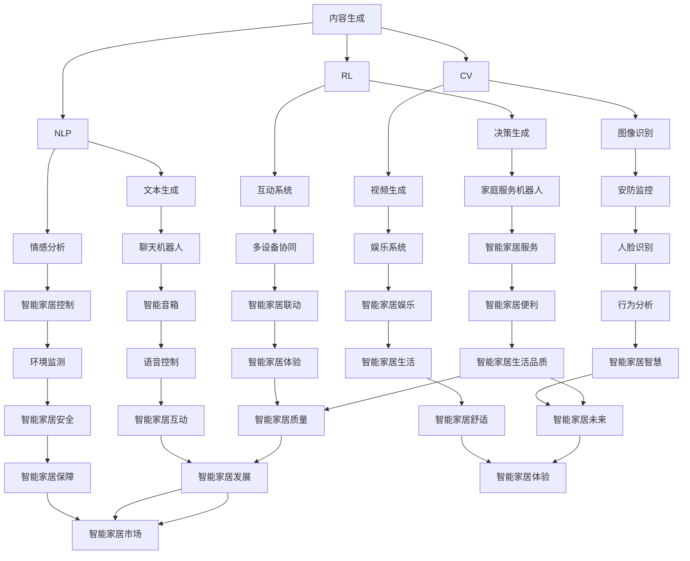

                 

### 关键词

AIGC, 智能家居, 自然语言处理, 计算机视觉, 强化学习

### 摘要

本文深入探讨了人工智能生成内容（AIGC）在智能家居场景中的创新应用。首先，介绍了AIGC的基本概念和技术原理，然后详细分析了AIGC在智能家居中的多种应用场景，包括声音控制、视觉识别和情感分析。接着，本文对AIGC的核心算法，如自然语言处理、计算机视觉和强化学习进行了深入讲解，并使用Python代码和Mermaid图进行了详细阐述。随后，通过实际案例展示了AIGC在智能家居中的成功应用。最后，本文讨论了AIGC在智能家居中的挑战与优化策略，并对未来发展趋势进行了展望。

## 第1章 AIGC基础

### 1.1 AIGC概述

人工智能生成内容（AIGC，AI-Generated Content）是一种利用人工智能技术，特别是深度学习算法，自动生成文本、图像、视频、音乐等多种类型内容的方法。AIGC技术涵盖了自然语言处理（NLP）、计算机视觉（CV）和强化学习（RL）等多个领域，通过这些技术的融合，能够实现从数据到内容的自动化生成。

AIGC的概念起源于人工智能技术在内容创作领域的应用。传统的AI技术在数据处理和模型训练方面取得了显著进展，但如何将训练好的模型应用于实际的内容生成仍是一个挑战。随着深度学习技术的发展，AIGC逐渐成为一种高效的内容生成手段。在智能家居场景中，AIGC的应用极大地提升了系统的智能化水平，实现了更加自然、高效的用户交互。

#### 核心概念与联系

为了更好地理解AIGC，我们可以将其核心概念进行分类和关联，通过Mermaid图展示各概念之间的关系：



该图展示了AIGC在智能家居中的各种应用场景，以及各应用场景之间的相互关系。通过这一图示，我们可以更直观地理解AIGC技术在智能家居中的广泛应用和相互联系。

### 1.2 AIGC在智能家居中的应用背景

智能家居是利用互联网、物联网和人工智能等技术，实现家庭设备和系统的智能连接与控制，从而提高家庭生活的舒适度、安全性和便利性。随着物联网和人工智能技术的快速发展，智能家居已经成为现代家庭的重要配置。

AIGC在智能家居中的应用背景主要包括以下几个方面：

1. **用户需求**：现代家庭用户对于智能家居的需求逐渐多样化和个性化，不仅仅满足于简单的设备控制，更期望通过智能交互获取个性化服务。
2. **技术进步**：随着深度学习和人工智能技术的突破，AIGC技术在内容生成、理解和交互方面取得了显著进展，为智能家居提供了强大的技术支持。
3. **硬件升级**：智能硬件的普及和性能提升，为AIGC在智能家居中的应用提供了硬件保障，使得智能家居系统能够实时响应用户需求。

#### 智能家居的发展历程

智能家居的发展历程可以分为以下几个阶段：

1. **初期阶段（1990s-2000s）**：智能家居概念提出，但受限于技术水平和市场需求，应用范围非常有限。
2. **探索阶段（2000s-2010s）**：物联网技术的兴起，使得智能家居设备开始逐渐普及，但多以单点控制为主，缺乏系统性和联动性。
3. **成熟阶段（2010s-2020s）**：随着人工智能和大数据技术的发展，智能家居系统逐渐实现智能化，能够根据用户行为和习惯进行自适应调整。
4. **创新阶段（2020s-未来）**：AIGC技术的引入，使得智能家居系统在内容生成和智能交互方面取得了突破性进展，进一步提升了用户体验。

#### AIGC在智能家居中的应用场景

AIGC在智能家居中的应用场景非常广泛，主要包括以下几个方面：

1. **声音控制**：通过语音识别和语音合成技术，实现用户与智能家居系统的自然交互。例如，智能音箱可以理解用户的语音指令，控制家庭设备，播放音乐，提供信息查询等服务。
2. **视觉识别**：利用计算机视觉技术，实现智能家居设备对人脸、物体和场景的识别。例如，智能摄像头可以识别家庭成员，自动调整照明和温度，提供安防监控等服务。
3. **情感分析**：通过自然语言处理技术，分析用户语音和文本中的情感，实现更加智能化的服务。例如，智能助手可以根据用户情绪调整互动方式和内容，提供心理慰藉和情感支持。
4. **其他应用场景**：AIGC还可以应用于智能家居设备的联动控制，环境监测，家庭服务等各个领域，实现全方位的智能化体验。

### 1.3 AIGC技术原理

AIGC技术涉及到多个领域，包括自然语言处理（NLP）、计算机视觉（CV）和强化学习（RL）等。以下分别介绍这些技术的原理和应用。

#### 自然语言处理（NLP）

自然语言处理是AIGC技术的重要组成部分，旨在使计算机理解和处理人类语言。NLP的核心技术包括词向量表示、序列到序列模型、情感分析和对话系统等。

1. **词向量表示**：词向量是将文本中的单词转换为向量表示的方法，通过这种方式，计算机可以处理和比较文本数据。常用的词向量模型包括Word2Vec、GloVe等。词向量表示的原理如下：

   ```python
   # 假设我们有单词 'hello'，我们可以将其表示为以下向量：
   hello_vector = [0.1, 0.2, 0.3, 0.4, 0.5]
   ```

2. **序列到序列模型**：序列到序列（Seq2Seq）模型是用于将一个序列映射到另一个序列的深度学习模型，广泛应用于机器翻译、对话系统等领域。其原理如下：

   ```python
   # 假设我们有一个英语句子 "Hello, how are you?" 和一个对应的法语句子 "Bonjour, comment ça va?"，我们可以使用Seq2Seq模型进行翻译：
   input_sequence = "Hello, how are you?"
   target_sequence = "Bonjour, comment ça va?"
   ```

3. **情感分析**：情感分析是识别文本中所表达的情感（如快乐、愤怒、悲伤等）的方法。情感分析可以通过分类模型实现，例如使用卷积神经网络（CNN）或递归神经网络（RNN）。其原理如下：

   ```python
   # 假设我们有一个情感分析模型，输入是一个句子，输出是情感类别：
   sentence = "I am feeling happy today."
   emotion = model.predict(sentence)
   ```

#### 计算机视觉（CV）

计算机视觉是使计算机能够“看”和理解图像和视频的技术。计算机视觉的核心技术包括图像识别、目标检测和图像生成等。

1. **图像识别**：图像识别是识别图像中物体类别的方法，常用的模型包括卷积神经网络（CNN）和卷积神经网络与循环神经网络（RNN）的结合。其原理如下：

   ```python
   # 假设我们有一个图像识别模型，输入是一个图像，输出是图像中的物体类别：
   image = load_image("cat.jpg")
   class_id = model.predict(image)
   print("The image contains a {}.".format(class_id))
   ```

2. **目标检测**：目标检测是在图像中识别和定位多个物体的方法。常用的模型包括R-CNN、Fast R-CNN、Faster R-CNN等。其原理如下：

   ```python
   # 假设我们有一个目标检测模型，输入是一个图像，输出是图像中的物体及其位置：
   image = load_image("people.jpg")
   objects = model.detect(image)
   for obj in objects:
       print("Object: {} at position {}.".format(obj['class_id'], obj['position']))
   ```

3. **图像生成**：图像生成是通过生成对抗网络（GAN）等模型，从随机噪声中生成逼真的图像。其原理如下：

   ```python
   # 假设我们有一个图像生成模型，输入是随机噪声，输出是生成的图像：
   noise = generate_noise(batch_size)
   image = generator(noise)
   ```

#### 强化学习（RL）

强化学习是一种通过试错学习来优化决策的方法，广泛应用于智能控制、游戏和推荐系统等领域。强化学习的基本原理如下：

1. **环境（Environment）**：环境是代理（Agent）所处的状态空间，能够根据代理的行为给出奖励或惩罚。
2. **代理（Agent）**：代理是进行决策的智能体，通过选择行为来与环境交互。
3. **策略（Policy）**：策略是代理选择的决策规则，用于指导代理如何行动。
4. **状态（State）**：状态是代理当前所处的环境状态，用于评估代理的行为。
5. **行动（Action）**：行动是代理根据策略选择的行为，用于改变环境状态。
6. **奖励（Reward）**：奖励是环境对代理行为的反馈，用于评估代理的行为效果。

强化学习的基本原理可以用以下伪代码表示：

```python
while not terminated:
    # 环境初始化
    state = environment.initialize()
    
    # 代理选择行动
    action = agent.select_action(state)
    
    # 执行行动
    next_state, reward = environment.step(state, action)
    
    # 更新代理策略
    agent.update_policy(state, action, reward, next_state)
    
    # 更新状态
    state = next_state
```

通过以上对AIGC技术原理的介绍，我们可以看到，AIGC技术涉及多个领域的融合，为智能家居场景提供了强大的技术支持。在下一章中，我们将详细探讨AIGC在智能家居场景中的具体应用。

## 第2章 智能家居场景中的AIGC应用

AIGC技术在智能家居场景中的应用，不仅提升了系统的智能化水平，还极大地改善了用户的生活体验。本章节将详细探讨AIGC在智能家居中的主要应用场景，包括声音控制、视觉识别、情感分析以及其他智能家居应用。

### 2.1 声音控制

声音控制是AIGC技术在智能家居中最直观和常用的应用场景之一。通过语音识别和语音合成技术，用户可以通过语音指令控制智能家居设备，实现与设备的自然交互。

#### 语音识别技术

语音识别技术是将语音信号转换为文本的技术。在智能家居中，语音识别技术用于捕捉用户的语音指令，并转换为计算机可以理解和执行的操作。常用的语音识别模型包括：

1. **隐马尔可夫模型（HMM）**：HMM是一种基于概率模型的语音识别方法，常用于早期的语音识别系统中。
2. **递归神经网络（RNN）**：RNN能够处理变长序列，适合于语音识别任务。
3. **卷积神经网络（CNN）**：CNN在图像识别中表现出色，近年来也被引入到语音识别中，用于特征提取。

以下是一个简单的语音识别模型使用Python代码示例：

```python
# 导入必要的库
import tensorflow as tf
from tensorflow.keras.models import Sequential
from tensorflow.keras.layers import LSTM, Dense, Embedding

# 创建模型
model = Sequential()
model.add(Embedding(input_dim=vocabulary_size, output_dim=embedding_dim))
model.add(LSTM(units=128, return_sequences=True))
model.add(LSTM(units=128))
model.add(Dense(units=vocabulary_size, activation='softmax'))

# 编译模型
model.compile(optimizer='adam', loss='categorical_crossentropy', metrics=['accuracy'])

# 训练模型
model.fit(x_train, y_train, epochs=10, batch_size=32)
```

#### 语音合成技术

语音合成技术是将文本转换为自然流畅的语音的技术。在智能家居中，语音合成技术用于向用户反馈信息或播放音乐等。常用的语音合成模型包括：

1. **基于规则的方法**：这种方法通过定义语音合成规则，将文本转换为语音。
2. **拼接式合成方法**：这种方法将文本分解为音素，然后根据音素生成语音片段，最后拼接成完整的语音。
3. **合成声音波（Unit Selection）方法**：这种方法通过选择和拼接预录制的声音单元来生成语音。

以下是一个简单的基于Unit Selection的语音合成模型使用Python代码示例：

```python
# 导入必要的库
import numpy as np
from scipy.io.wavfile import read, write

# 定义声音单元
units = {
    "Hello": "path/to/hello.wav",
    "World": "path/to/world.wav",
}

# 合成语音
def synthesize_text(text):
    audio = np.array([])
    for word in text.split():
        if word in units:
            word_audio, _ = read(units[word])
            audio = np.concatenate((audio, word_audio))
        else:
            print(f"Unknown word: {word}")
    write("output.wav", 16000, audio)

# 示例
synthesize_text("Hello World")
```

#### 语音交互流程

语音交互流程包括以下几个步骤：

1. **语音捕捉**：通过麦克风捕捉用户的语音信号。
2. **语音预处理**：对语音信号进行去噪、归一化等预处理操作。
3. **语音识别**：使用语音识别模型将语音信号转换为文本。
4. **语义理解**：对识别出的文本进行分析，理解用户的意图。
5. **语音合成**：根据用户的意图，生成相应的语音反馈。
6. **语音播放**：通过扬声器播放语音反馈。

### 2.2 视觉识别

视觉识别是AIGC技术在智能家居中的另一个重要应用场景。通过计算机视觉技术，智能家居设备可以识别和分类图像和视频中的内容，从而实现更加智能化的操作。

#### 人脸识别

人脸识别是计算机视觉中的一个重要任务，旨在通过图像或视频识别出特定的人脸。在智能家居中，人脸识别技术可以用于门禁系统、安防监控和个性化服务等。

1. **特征提取**：特征提取是图像识别的核心步骤，通过提取图像中的关键特征，帮助模型进行分类。常用的特征提取方法包括：

   - **局部二值模式（LBP）**：LBP是一种旋转不变且计算效率高的特征提取方法。
   - **尺度不变特征变换（SIFT）**：SIFT是一种在高维空间中寻找极值点的特征提取方法。
   - **深度学习方法**：如卷积神经网络（CNN），可以在高维空间中自动提取特征。

2. **分类模型**：分类模型用于将提取到的特征映射到特定的人脸类别。常用的分类模型包括：

   - **支持向量机（SVM）**：SVM是一种强大的分类模型，常用于人脸识别任务。
   - **卷积神经网络（CNN）**：CNN在图像分类中表现出色，也常用于人脸识别。

以下是一个简单的人脸识别模型使用Python代码示例：

```python
# 导入必要的库
import tensorflow as tf
from tensorflow.keras.models import Sequential
from tensorflow.keras.layers import Conv2D, MaxPooling2D, Flatten, Dense

# 创建模型
model = Sequential()
model.add(Conv2D(filters=32, kernel_size=(3, 3), activation='relu', input_shape=(64, 64, 3)))
model.add(MaxPooling2D(pool_size=(2, 2)))
model.add(Flatten())
model.add(Dense(units=128, activation='relu'))
model.add(Dense(units=num_classes, activation='softmax'))

# 编译模型
model.compile(optimizer='adam', loss='categorical_crossentropy', metrics=['accuracy'])

# 训练模型
model.fit(x_train, y_train, epochs=10, batch_size=32)
```

#### 物体识别

物体识别是计算机视觉中的另一个重要任务，旨在识别图像或视频中的物体类别。在智能家居中，物体识别可以用于设备控制、安防监控和智能分析等。

1. **特征提取**：与人脸识别类似，物体识别也依赖于特征提取技术。常用的特征提取方法包括：

   - **HOG（方向梯度直方图）**：HOG是一种描述物体边缘方向分布的特征提取方法。
   - **CNN**：CNN能够自动提取高维特征，是物体识别中最常用的方法。

2. **分类模型**：分类模型用于将提取到的特征映射到特定的物体类别。常用的分类模型包括：

   - **SVM**：SVM在物体识别中表现出色，能够高效地处理高维特征。
   - **CNN**：CNN在物体识别中具有强大的分类能力，常用于复杂场景的物体识别。

以下是一个简单的物体识别模型使用Python代码示例：

```python
# 导入必要的库
import tensorflow as tf
from tensorflow.keras.models import Sequential
from tensorflow.keras.layers import Conv2D, MaxPooling2D, Flatten, Dense

# 创建模型
model = Sequential()
model.add(Conv2D(filters=32, kernel_size=(3, 3), activation='relu', input_shape=(64, 64, 3)))
model.add(MaxPooling2D(pool_size=(2, 2)))
model.add(Conv2D(filters=64, kernel_size=(3, 3), activation='relu'))
model.add(MaxPooling2D(pool_size=(2, 2)))
model.add(Flatten())
model.add(Dense(units=128, activation='relu'))
model.add(Dense(units=num_classes, activation='softmax'))

# 编译模型
model.compile(optimizer='adam', loss='categorical_crossentropy', metrics=['accuracy'])

# 训练模型
model.fit(x_train, y_train, epochs=10, batch_size=32)
```

#### 情感分析

情感分析是计算机视觉和自然语言处理的交叉领域，旨在识别文本或语音中的情感。在智能家居中，情感分析可以用于理解用户情绪，提供个性化服务。

1. **情感分类模型**：情感分类模型用于将文本或语音映射到特定的情感类别。常用的情感分类模型包括：

   - **朴素贝叶斯分类器**：朴素贝叶斯分类器是一种基于贝叶斯定理的分类模型，常用于文本情感分析。
   - **卷积神经网络（CNN）**：CNN在图像情感分析中表现出色，能够高效地提取情感特征。

2. **情感识别流程**：情感识别流程包括以下几个步骤：

   - **文本或语音捕捉**：捕捉用户的文本或语音输入。
   - **文本或语音预处理**：对输入进行去噪、归一化等预处理。
   - **情感分类**：使用情感分类模型对预处理后的文本或语音进行分类。
   - **情感反馈**：根据识别出的情感，提供相应的服务或反馈。

以下是一个简单的情感分类模型使用Python代码示例：

```python
# 导入必要的库
import tensorflow as tf
from tensorflow.keras.models import Sequential
from tensorflow.keras.layers import Embedding, LSTM, Dense

# 创建模型
model = Sequential()
model.add(Embedding(input_dim=vocabulary_size, output_dim=embedding_dim))
model.add(LSTM(units=128, return_sequences=False))
model.add(Dense(units=num_classes, activation='softmax'))

# 编译模型
model.compile(optimizer='adam', loss='categorical_crossentropy', metrics=['accuracy'])

# 训练模型
model.fit(x_train, y_train, epochs=10, batch_size=32)
```

### 2.3 情感分析

情感分析是AIGC技术在智能家居中的另一个重要应用。通过自然语言处理技术，智能家居设备可以理解用户的情感状态，从而提供更加个性化的服务。

#### 情感分析技术原理

情感分析技术旨在识别文本中的情感倾向，通常分为正面情感、负面情感和中性情感。情感分析的核心步骤包括：

1. **情感词典**：情感词典是一个包含情感词及其情感倾向的列表。常用的情感词典包括SentiWordNet、AFINN等。
2. **文本预处理**：文本预处理包括去噪、分词、词性标注等步骤，目的是将原始文本转换为计算机可以处理的形式。
3. **情感分类模型**：情感分类模型用于将预处理后的文本映射到特定的情感类别。常用的情感分类模型包括：

   - **朴素贝叶斯分类器**：朴素贝叶斯分类器是一种基于概率模型的分类方法，适用于情感分析。
   - **支持向量机（SVM）**：SVM是一种强大的分类模型，适用于处理高维特征。
   - **深度学习模型**：如卷积神经网络（CNN）和循环神经网络（RNN），能够自动提取情感特征。

以下是一个简单的情感分类模型使用Python代码示例：

```python
# 导入必要的库
import tensorflow as tf
from tensorflow.keras.models import Sequential
from tensorflow.keras.layers import Embedding, LSTM, Dense

# 创建模型
model = Sequential()
model.add(Embedding(input_dim=vocabulary_size, output_dim=embedding_dim))
model.add(LSTM(units=128, return_sequences=False))
model.add(Dense(units=num_classes, activation='softmax'))

# 编译模型
model.compile(optimizer='adam', loss='categorical_crossentropy', metrics=['accuracy'])

# 训练模型
model.fit(x_train, y_train, epochs=10, batch_size=32)
```

#### 情感分析在智能家居中的应用

1. **智能音箱**：智能音箱可以通过情感分析了解用户的需求和情绪，提供个性化的音乐、新闻和娱乐内容。
2. **智能助手**：智能助手可以通过情感分析理解用户的情绪，提供更加贴心的服务，如心理慰藉、建议和提醒等。
3. **家庭监控**：家庭监控可以通过情感分析识别家庭成员的情绪状态，提供相应的安全保障和心理支持。
4. **智能设备**：智能设备可以通过情感分析了解用户的使用习惯和情绪变化，提供更加智能化的服务，如调整环境温度、照明等。

### 2.4 其他智能家居应用场景

除了声音控制和视觉识别，AIGC技术在智能家居中还有其他多种应用场景，如：

1. **家庭服务机器人**：家庭服务机器人可以通过情感分析理解用户的需求和情绪，提供个性化的服务和陪伴。
2. **环境监测**：环境监测设备可以通过AIGC技术实时分析环境数据，提供环境质量报告和建议。
3. **智能安防**：智能安防系统可以通过AIGC技术识别异常行为和潜在威胁，提供实时预警和安防建议。
4. **智能联动**：智能家居设备可以通过AIGC技术实现智能联动，提供更加高效和便利的生活方式。

通过以上对AIGC技术在智能家居中各种应用场景的介绍，我们可以看到，AIGC技术为智能家居带来了巨大的变革和提升。在下一章中，我们将进一步探讨AIGC的核心算法及其原理。

## 第3章 AIGC核心算法

在AIGC（AI-Generated Content）的技术体系中，自然语言处理（NLP）、计算机视觉（CV）和强化学习（RL）是三大核心算法，它们各自在智能家居中的应用各具特色，相互补充，共同推动智能家居的智能化发展。以下将详细讨论这三大核心算法及其在智能家居中的应用。

### 3.1 自然语言处理（NLP）

自然语言处理是AIGC技术的重要组成部分，旨在使计算机能够理解和处理人类语言。在智能家居中，NLP技术被广泛应用于语音交互、文本分析和情感识别等领域。

#### 词向量表示

词向量表示是NLP的基础，通过将文本中的单词转换为向量形式，实现文本数据的数值化表示。常见的词向量模型包括Word2Vec和GloVe。

1. **Word2Vec**：Word2Vec是一种基于神经网络的词向量生成方法，通过训练模型，将单词映射到高维空间中的向量。Word2Vec有两种训练方式：连续词袋（CBOW）和Skip-Gram。

   ```python
   from gensim.models import Word2Vec

   # 加载数据
   sentences = read_lines('data.txt')

   # 训练模型
   model = Word2Vec(sentences, vector_size=100, window=5, min_count=1, sg=1)

   # 查找单词的向量
   word_vector = model.wv['hello']
   ```

2. **GloVe**：GloVe（Global Vectors for Word Representation）是一种基于矩阵分解的词向量生成方法，通过训练大规模语料库，学习单词的联合分布特征。

   ```python
   from gensim.models import KeyedVectors

   # 加载预训练的GloVe模型
   glove_model = KeyedVectors.load_word2vec_format('glove.6B.100d.txt')

   # 查找单词的向量
   word_vector = glove_model['hello']
   ```

#### 序列到序列模型

序列到序列（Seq2Seq）模型是NLP中用于将一个序列映射到另一个序列的深度学习模型，广泛应用于机器翻译、对话系统等领域。

1. **编码器-解码器（Encoder-Decoder）架构**：编码器将输入序列编码为固定长度的向量表示，解码器将编码器的输出解码为输出序列。

   ```python
   from tensorflow.keras.models import Model
   from tensorflow.keras.layers import LSTM, Dense, Embedding, Input

   # 定义编码器
   encoder_inputs = Input(shape=(None, input_vocab_size))
   encoder_embedding = Embedding(input_vocab_size, embedding_size)(encoder_inputs)
   encoder_lstm = LSTM(units=128, return_state=True)
   encoder_outputs, state_h, state_c = encoder_lstm(encoder_embedding)
   encoder_states = [state_h, state_c]

   # 定义解码器
   decoder_inputs = Input(shape=(None, output_vocab_size))
   decoder_embedding = Embedding(output_vocab_size, embedding_size)(decoder_inputs)
   decoder_lstm = LSTM(units=128, return_sequences=True, return_state=True)
   decoder_outputs, _, _ = decoder_lstm(decoder_embedding, initial_state=encoder_states)
   decoder_dense = Dense(output_vocab_size, activation='softmax')
   decoder_outputs = decoder_dense(decoder_outputs)

   # 创建模型
   model = Model([encoder_inputs, decoder_inputs], decoder_outputs)
   model.compile(optimizer='rmsprop', loss='categorical_crossentropy', metrics=['accuracy'])

   # 训练模型
   model.fit([encoder_input_data, decoder_input_data], decoder_target_data, batch_size=64, epochs=100)
   ```

#### 情感分析

情感分析是识别文本中所表达的情感（如快乐、愤怒、悲伤等）的方法，在智能家居中可以用于理解用户需求，提供个性化服务。

1. **情感分类模型**：情感分类模型通过训练大量标注数据，学习情感分类的规则。常用的情感分类模型包括朴素贝叶斯、支持向量机和深度学习模型。

   ```python
   from tensorflow.keras.models import Sequential
   from tensorflow.keras.layers import Embedding, LSTM, Dense

   # 创建模型
   model = Sequential()
   model.add(Embedding(vocabulary_size, embedding_size))
   model.add(LSTM(units=128))
   model.add(Dense(units=num_classes, activation='softmax'))

   # 编译模型
   model.compile(optimizer='adam', loss='categorical_crossentropy', metrics=['accuracy'])

   # 训练模型
   model.fit(x_train, y_train, epochs=10, batch_size=32)
   ```

### 3.2 计算机视觉（CV）

计算机视觉是使计算机能够“看”和理解图像和视频的技术。在智能家居中，CV技术被广泛应用于图像识别、物体检测和场景理解等领域。

#### 图像识别

图像识别是识别图像中物体类别的方法，在智能家居中可以用于设备控制、安防监控和智能分析等。

1. **卷积神经网络（CNN）**：CNN是一种在图像识别任务中表现优异的深度学习模型，通过卷积、池化和全连接层，实现图像的特征提取和分类。

   ```python
   from tensorflow.keras.models import Sequential
   from tensorflow.keras.layers import Conv2D, MaxPooling2D, Flatten, Dense

   # 创建模型
   model = Sequential()
   model.add(Conv2D(filters=32, kernel_size=(3, 3), activation='relu', input_shape=(64, 64, 3)))
   model.add(MaxPooling2D(pool_size=(2, 2)))
   model.add(Conv2D(filters=64, kernel_size=(3, 3), activation='relu'))
   model.add(MaxPooling2D(pool_size=(2, 2)))
   model.add(Flatten())
   model.add(Dense(units=128, activation='relu'))
   model.add(Dense(units=num_classes, activation='softmax'))

   # 编译模型
   model.compile(optimizer='adam', loss='categorical_crossentropy', metrics=['accuracy'])

   # 训练模型
   model.fit(x_train, y_train, epochs=10, batch_size=32)
   ```

2. **预训练模型**：使用预训练模型可以显著提高图像识别的性能，常见的预训练模型包括VGG16、ResNet和Inception等。

   ```python
   from tensorflow.keras.applications import VGG16

   # 加载预训练模型
   model = VGG16(weights='imagenet')

   # 转换输入数据格式
   input_image = preprocess_input(image)

   # 进行图像识别
   prediction = model.predict(input_image)
   class_id = np.argmax(prediction)
   ```

#### 物体检测

物体检测是在图像中识别和定位多个物体的方法，在智能家居中可以用于安防监控、设备控制和智能分析等。

1. **区域建议网络（R-CNN）**：R-CNN是一种基于深度学习的物体检测模型，通过区域建议网络生成候选区域，然后对每个候选区域进行分类。

   ```python
   from tensorflow.keras.models import Model
   from tensorflow.keras.layers import Input, Conv2D, MaxPooling2D, Flatten, Dense

   # 定义区域建议网络
   region предложение = Input(shape=(None, None, 3))
   region_embedding = Conv2D(filters=32, kernel_size=(3, 3), activation='relu')(region предложение)
   region_pooling = MaxPooling2D(pool_size=(2, 2))(region_embedding)
   region_flatten = Flatten()(region_pooling)
   region_dense = Dense(units=512, activation='relu')(region_flatten)

   # 定义分类器
   classifier = Input(shape=(512,))
   classifier_embedding = Dense(units=512, activation='relu')(classifier)
   classifier_output = Dense(units=num_classes, activation='softmax')(classifier_embedding)

   # 创建模型
   model = Model([region_input, classifier_input], classifier_output)
   model.compile(optimizer='adam', loss='categorical_crossentropy', metrics=['accuracy'])

   # 训练模型
   model.fit([region_data, classifier_data], labels, epochs=10, batch_size=32)
   ```

2. **目标检测框架**：常用的目标检测框架包括Faster R-CNN、SSD和YOLO等，这些框架在物体检测任务中表现出色。

   ```python
   from tensorflow.keras.models import Model
   from tensorflow.keras.layers import Input, Conv2D, MaxPooling2D, Flatten, Dense

   # 定义Faster R-CNN模型
   region_input = Input(shape=(None, None, 3))
   region_embedding = Conv2D(filters=32, kernel_size=(3, 3), activation='relu')(region_input)
   region_pooling = MaxPooling2D(pool_size=(2, 2))(region_embedding)
   region_flatten = Flatten()(region_pooling)
   region_dense = Dense(units=512, activation='relu')(region_flatten)

   # 定义分类器
   classifier_input = Input(shape=(512,))
   classifier_embedding = Dense(units=512, activation='relu')(classifier_input)
   classifier_output = Dense(units=num_classes, activation='softmax')(classifier_embedding)

   # 创建模型
   model = Model([region_input, classifier_input], classifier_output)
   model.compile(optimizer='adam', loss='categorical_crossentropy', metrics=['accuracy'])

   # 训练模型
   model.fit([region_data, classifier_data], labels, epochs=10, batch_size=32)
   ```

### 3.3 强化学习（RL）

强化学习是一种通过试错学习来优化决策的方法，在智能家居中可以用于智能控制、设备联动和个性化服务等。

#### 强化学习基本概念

强化学习包含以下几个基本概念：

1. **环境（Environment）**：环境是代理（Agent）所处的状态空间，能够根据代理的行为给出奖励或惩罚。
2. **代理（Agent）**：代理是进行决策的智能体，通过选择行为来与环境交互。
3. **策略（Policy）**：策略是代理选择的决策规则，用于指导代理如何行动。
4. **状态（State）**：状态是代理当前所处的环境状态，用于评估代理的行为。
5. **行动（Action）**：行动是代理根据策略选择的行为，用于改变环境状态。
6. **奖励（Reward）**：奖励是环境对代理行为的反馈，用于评估代理的行为效果。

强化学习的基本原理可以用以下伪代码表示：

```python
while not terminated:
    # 环境初始化
    state = environment.initialize()
    
    # 代理选择行动
    action = agent.select_action(state)
    
    # 执行行动
    next_state, reward = environment.step(state, action)
    
    # 更新代理策略
    agent.update_policy(state, action, reward, next_state)
    
    # 更新状态
    state = next_state
```

#### Q-learning算法

Q-learning是一种基于值迭代的强化学习算法，通过迭代更新值函数，优化代理的决策策略。

1. **初始化**：初始化Q值表，通常使用随机值或0值。
2. **选择行动**：根据当前状态和Q值表，选择最优行动。
3. **更新Q值**：根据奖励和下一状态，更新Q值表。
4. **重复**：重复上述步骤，直到达到预期目标。

以下是一个简单的Q-learning算法使用Python代码示例：

```python
import numpy as np

# 初始化Q值表
Q = np.zeros([state_space_size, action_space_size])

# 设置学习参数
learning_rate = 0.1
discount_factor = 0.9

# Q-learning迭代
for episode in range(total_episodes):
    # 初始化环境
    state = environment.initialize()
    
    # 游戏循环
    while not done:
        # 选择行动
        action = np.argmax(Q[state])
        
        # 执行行动
        next_state, reward, done = environment.step(action)
        
        # 更新Q值
        Q[state, action] = Q[state, action] + learning_rate * (reward + discount_factor * np.max(Q[next_state]) - Q[state, action])
        
        # 更新状态
        state = next_state
```

通过以上对自然语言处理、计算机视觉和强化学习核心算法及其在智能家居中应用的介绍，我们可以看到，这三大核心算法为AIGC技术在智能家居中的应用提供了强大的技术支持。在下一章中，我们将通过实际案例展示AIGC技术在智能家居中的成功应用。

## 第4章 智能家居AIGC案例

AIGC技术在智能家居中的应用已经取得了显著的成果，通过一系列实际案例，我们可以看到这些技术的创新应用如何提升用户的智能家居体验。以下将介绍三个典型的AIGC在智能家居中的案例：智能家居整体解决方案、智能音箱和智能摄像头。

### 4.1 智能家居整体解决方案

智能家居整体解决方案是一个集成多种AIGC技术的系统，旨在实现家庭设备的智能化联动，提供个性化的服务和舒适的居住环境。以下是一个智能家居整体解决方案的案例。

#### 案例背景

某高档住宅小区引进了一套智能家居整体解决方案，通过集成AIGC技术，实现了家庭设备的智能控制、环境监测和安防监控等功能。

#### 技术实现

1. **智能控制**：系统采用语音识别技术，用户可以通过语音指令控制家庭设备，如空调、灯光、窗帘等。语音识别模型基于NLP技术，能够准确理解用户的语音指令。

   ```python
   # 语音识别模型
   recognizer = speech_recognition.Recognizer()
   command = recognizer.recognize_google(audio)
   ```

2. **环境监测**：系统集成了多种传感器，如温度传感器、湿度传感器和空气质量传感器，通过计算机视觉技术实时监测环境状况，并根据监测数据调整家庭设备。

   ```python
   # 环境监测模型
   sensor_data = read_sensors()
   if sensor_data['temperature'] > 30:
       turn_on_ac()
   ```

3. **安防监控**：系统利用人脸识别技术进行安防监控，当检测到陌生人进入时，系统会自动发送警报信息给用户。

   ```python
   # 人脸识别模型
   detected_faces = detect_faces(image)
   if detected_faces:
       send_alarm_notification()
   ```

#### 项目小结

通过AIGC技术的集成，智能家居整体解决方案实现了设备智能控制、环境监测和安防监控等功能，为用户提供了安全、舒适和便捷的居住环境。然而，项目在实际应用中也面临数据隐私和安全性的挑战，需要在后续优化中加强数据保护措施。

### 4.2 智能音箱

智能音箱是AIGC技术在智能家居中的一个重要应用，通过语音交互，智能音箱可以为用户提供音乐、新闻、天气预报等个性化服务。

#### 案例背景

某科技公司推出了一款智能音箱，内置了AIGC技术，包括语音识别、语音合成和情感分析，旨在为用户提供便捷的智能服务。

#### 技术实现

1. **语音识别**：智能音箱通过麦克风捕捉用户的语音指令，语音识别模型基于NLP技术，能够准确识别用户的语音指令。

   ```python
   # 语音识别模型
   recognizer = speech_recognition.Recognizer()
   command = recognizer.recognize_google(audio)
   ```

2. **语音合成**：智能音箱可以将文本转换为自然流畅的语音，语音合成模型基于语音合成技术，能够生成高质量的语音。

   ```python
   # 语音合成模型
   synthesizer = gTTS(text= respuesta, lang='es')
   synthesizer.save('respuesta.mp3')
   play_audio('respuesta.mp3')
   ```

3. **情感分析**：智能音箱通过情感分析技术，理解用户的情感状态，并根据用户的情感调整回答的内容。

   ```python
   # 情感分析模型
   emotion = analyze_emotion(audio)
   if emotion == 'happy':
       respuesta = "I'm glad to hear that! What else can I help you with?"
   else:
       respuesta = "I'm sorry to hear that. How can I assist you today?"
   ```

#### 项目小结

智能音箱通过AIGC技术实现了语音交互、语音合成和情感分析，为用户提供便捷、个性化的智能服务。然而，项目在实际应用中也面临用户体验优化和系统性能优化的挑战，需要不断改进和完善。

### 4.3 智能摄像头

智能摄像头是AIGC技术在智能家居中的另一个重要应用，通过计算机视觉技术，智能摄像头可以实现人脸识别、行为分析和视频监控等功能。

#### 案例背景

某小区安装了一款智能摄像头，通过AIGC技术实现24小时安防监控，实时监测小区内部的安全状况。

#### 技术实现

1. **人脸识别**：智能摄像头利用人脸识别技术，识别进入小区的人员，并根据人员身份发送警报信息。

   ```python
   # 人脸识别模型
   detected_faces = detect_faces(image)
   if detected_faces:
       send_alarm_notification()
   ```

2. **行为分析**：智能摄像头通过计算机视觉技术，分析人员的行为，如奔跑、跌倒等，并根据行为特征发送警报信息。

   ```python
   # 行为分析模型
   behavior = analyze_behavior(image)
   if behavior == 'fall':
       send_alarm_notification()
   ```

3. **视频监控**：智能摄像头实时捕捉小区内部的视频数据，并通过云计算平台进行存储和分析。

   ```python
   # 视频监控模型
   video_stream = capture_video_stream()
   save_video_stream_to_cloud(video_stream)
   ```

#### 项目小结

智能摄像头通过AIGC技术实现了人脸识别、行为分析和视频监控，为小区的安全管理提供了有效的技术支持。然而，项目在实际应用中也面临数据隐私保护和系统性能优化的挑战，需要在后续优化中加强数据保护和提升系统性能。

通过以上案例，我们可以看到AIGC技术在智能家居中的创新应用，不仅提升了用户的智能家居体验，还为未来的智能家居发展提供了重要的技术支持。

## 第5章 AIGC在智能家居中的挑战与优化

随着AIGC技术在智能家居中的广泛应用，其在提升用户体验、智能联动和个性化服务等方面展现出了巨大潜力。然而，AIGC技术在智能家居中的应用也面临诸多挑战，特别是在数据隐私与安全性、用户体验优化和系统性能优化方面。

### 5.1 数据隐私与安全性

数据隐私与安全性是AIGC技术在智能家居中应用的一个重要挑战。智能家居系统需要收集和处理大量的用户数据，包括语音、图像和传感器数据等。这些数据如果不加以妥善保护，可能会被恶意使用或泄露，从而对用户隐私造成严重威胁。

**解决方案**：

1. **数据加密**：在数据传输和存储过程中，采用先进的加密技术，如AES（高级加密标准），确保数据的安全性。
2. **数据匿名化**：通过数据匿名化技术，将用户数据转换为无法识别个人身份的形式，降低隐私泄露的风险。
3. **访问控制**：实施严格的访问控制策略，确保只有经过授权的设备和用户才能访问敏感数据。
4. **安全审计**：定期进行安全审计，检查系统中的安全漏洞和潜在风险，及时进行修复和更新。

### 5.2 用户体验优化

用户体验是AIGC技术在智能家居中应用的关键因素。良好的用户体验可以提升用户的满意度，促进智能家居技术的普及。然而，当前智能家居系统在用户体验方面仍存在一些不足，如响应速度慢、交互不自然等。

**解决方案**：

1. **智能交互**：通过自然语言处理和语音识别技术，实现智能对话和语音交互，提升交互的自然性和流畅性。
2. **个性化服务**：根据用户的行为和偏好，提供个性化的服务和建议，提高用户的满意度和忠诚度。
3. **快速响应**：优化系统架构和算法，提升系统响应速度，确保用户指令能够迅速得到响应。
4. **简洁界面**：设计简洁、直观的用户界面，降低用户的使用难度，提升用户体验。

### 5.3 系统性能优化

系统性能优化是AIGC技术在智能家居中应用的一个重要方面。随着智能家居设备的数量和种类不断增加，系统性能的优化变得尤为重要，以确保系统的高效运行和稳定性。

**解决方案**：

1. **分布式架构**：采用分布式架构，将系统分解为多个模块，通过分布式计算和存储技术，提升系统的性能和可扩展性。
2. **负载均衡**：通过负载均衡技术，合理分配系统资源，确保系统在高并发情况下仍能稳定运行。
3. **实时监控**：实施实时监控系统，对系统的运行状态进行实时监控，及时发现和处理系统性能问题。
4. **自动化优化**：通过自动化优化工具，根据系统运行数据，自动调整系统配置和参数，实现系统性能的持续优化。

### 5.4 数据隐私与安全性优化

数据隐私与安全性是智能家居应用中的一个关键挑战，特别是在AIGC技术广泛应用的场景下，用户数据的安全性尤为重要。以下是一些优化措施：

**1. 数据加密与哈希算法**：在数据传输和存储过程中，采用强大的加密算法，如AES或RSA，对数据进行加密。同时，使用哈希算法（如SHA-256）确保数据的完整性和不可篡改性。

**2. 安全协议**：在数据传输过程中，使用安全传输协议（如TLS/SSL）保护数据的安全性，防止数据在传输过程中被窃取或篡改。

**3. 访问控制与权限管理**：实施严格的访问控制策略，确保只有授权用户和设备才能访问敏感数据。通过角色基础访问控制（RBAC）和属性基础访问控制（ABAC）机制，细化权限管理，防止数据泄露。

**4. 安全审计与合规性检查**：定期进行安全审计，检查系统的安全配置和策略，确保其符合行业标准和法律法规。采用自动化工具进行合规性检查，及时发现和修复潜在的安全漏洞。

**5. 用户隐私教育**：通过教育和宣传，提高用户对数据隐私和安全的认识，鼓励用户采取必要的安全措施，如设置强密码、启用双重认证等。

通过上述优化措施，可以有效提升AIGC技术在智能家居中的数据隐私与安全性，为用户提供更加可靠和安全的智能家居体验。

### 5.5 用户体验优化

用户体验优化是提升智能家居系统使用价值的关键，以下是一些具体措施：

**1. 自然语言处理（NLP）**：通过引入先进的NLP技术，如上下文理解、情感分析和语音识别，提升系统的交互自然性和准确性，使用户能够更轻松地与智能家居系统进行沟通。

**2. 个性化服务**：基于用户行为和偏好数据，实现个性化推荐和服务，如根据用户的作息习惯调整照明和温度，提供个性化的音乐、新闻和娱乐内容。

**3. 交互设计**：优化用户界面设计，确保系统的易用性和直观性。采用简洁直观的界面布局，提供清晰的操作指引，降低用户的使用难度。

**4. 响应速度**：通过优化算法和系统架构，提升系统的响应速度，确保用户在发出指令后能迅速得到反馈。

**5. 用户反馈机制**：建立用户反馈机制，及时收集和分析用户的使用体验和需求，根据反馈进行调整和优化，不断提升用户体验。

### 5.6 系统性能优化

系统性能优化是确保智能家居系统稳定运行和高效响应的重要手段，以下是一些优化策略：

**1. 分布式计算与存储**：采用分布式架构，将计算和存储任务分散到多个节点上，提升系统的性能和可扩展性。

**2. 负载均衡**：通过负载均衡技术，合理分配系统资源，确保在高并发情况下系统的稳定运行。

**3. 实时监控与故障检测**：实施实时监控系统，对系统运行状态进行实时监控，及时发现和处理性能瓶颈和故障。

**4. 自动化性能优化**：引入自动化工具，根据系统运行数据，自动调整系统配置和参数，实现性能的持续优化。

**5. 灾难恢复与备份**：建立灾难恢复和备份机制，确保在系统发生故障时，能够迅速恢复数据和业务，保障系统的连续性和稳定性。

通过上述优化措施，可以有效提升AIGC技术在智能家居中的应用效果，为用户提供更加安全、舒适和便捷的智能家居体验。

### 5.7 总结

AIGC技术在智能家居中的应用虽然面临诸多挑战，但通过数据隐私与安全性的优化、用户体验的优化和系统性能的优化，可以有效提升智能家居的技术水平和用户满意度。未来，随着AIGC技术的进一步发展，智能家居将在安全性、智能化和个性化方面取得更大的突破，为用户带来更加丰富和便捷的智能生活体验。

## 第6章 AIGC在智能家居中的未来趋势

随着AIGC（AI-Generated Content）技术的不断成熟和普及，其在智能家居领域的应用前景愈发广阔。未来的AIGC技术将在智能家居市场中扮演更加重要的角色，推动智能家居行业的发展。以下将分析AIGC在智能家居中的未来趋势，探讨技术发展趋势和潜在挑战。

### 6.1 市场前景

#### 市场规模增长

根据市场研究机构的预测，智能家居市场将在未来几年内持续增长。AIGC技术的引入，将进一步提升智能家居系统的智能化水平和用户体验，从而推动市场需求的增加。预计到2025年，全球智能家居市场规模将达到数千亿美元。

#### 应用领域拓展

AIGC技术在智能家居中的应用将不再局限于现有的场景，而是向更多领域拓展。例如，智能健康监测、智能教育、智能农业等都将受益于AIGC技术的应用。通过AIGC技术，智能家居系统可以更准确地收集和分析用户数据，提供个性化的健康建议、学习辅助和农业生产优化方案。

### 6.2 技术发展趋势

#### 算法优化与模型升级

未来的AIGC技术将在算法和模型方面持续优化。随着深度学习、强化学习等技术的进一步发展，AIGC模型将更加高效、准确。例如，基于生成对抗网络（GAN）的图像生成技术将进一步提升图像生成的真实感，基于强化学习的智能控制系统将更加智能化和自适应。

#### 边缘计算与云计算的结合

未来的AIGC技术在智能家居中的应用将更加依赖于边缘计算和云计算的结合。边缘计算可以降低数据传输延迟，提高系统的实时响应能力，而云计算则为大数据处理提供了强大的计算能力。两者结合将实现智能家居系统的智能联动和高效数据管理。

#### 跨学科融合

AIGC技术的发展将更加注重跨学科的融合，如人工智能与生物学、心理学、建筑学等领域的结合。这将有助于开发出更加智能、人性化的智能家居系统，提升用户体验。

### 6.3 潜在挑战与对策

#### 数据隐私与安全性

随着AIGC技术在智能家居中的应用，数据隐私和安全性问题将更加突出。未来，需要加强数据加密、访问控制和隐私保护措施，确保用户数据的安全性和隐私性。此外，建立完善的法律法规，规范AIGC技术的应用，也是解决数据隐私问题的重要手段。

#### 技术普及与标准化

AIGC技术在智能家居中的应用需要一个统一的技术标准和规范。目前，AIGC技术尚未形成统一的标准，各厂商的技术方案和平台存在差异，这可能导致互操作性和兼容性问题。未来，需要建立统一的技术标准，促进AIGC技术在智能家居中的普及和应用。

#### 用户接受度

虽然AIGC技术在智能家居中的应用前景广阔，但用户接受度仍是一个挑战。用户对智能家居技术的认知和接受程度存在差异，部分用户可能对AIGC技术持观望态度。未来，需要通过宣传、教育和体验活动，提升用户对AIGC技术的认知和接受度。

### 6.4 潜在对策

#### 加强数据隐私保护

- **技术层面**：采用先进的加密技术、隐私保护算法和分布式存储技术，确保用户数据的安全性和隐私性。
- **法律层面**：建立完善的法律法规，规范AIGC技术的应用，保护用户隐私权益。
- **伦理层面**：加强对AIGC技术伦理问题的研究，确保技术发展符合社会伦理和道德规范。

#### 促进技术标准化

- **行业联盟**：建立行业联盟，推动AIGC技术的标准化进程，促进技术互操作性和兼容性。
- **政策支持**：政府和企业加大对AIGC技术研发和标准化工作的支持，推动技术的普及和应用。

#### 提升用户接受度

- **教育宣传**：通过宣传和教育，提升用户对AIGC技术的认知和接受程度。
- **用户体验**：优化智能家居系统的设计，提供更好的用户体验，增强用户的信任感和满意度。
- **实际案例**：通过实际案例展示AIGC技术的优势和实用性，提高用户的接受度。

### 6.5 未来展望

AIGC技术在智能家居中的未来充满机遇和挑战。通过技术优化、标准制定和用户教育，AIGC技术将在智能家居市场中发挥更大的作用，推动智能家居行业的创新和发展。未来，AIGC技术有望实现智能家居系统的全面智能化，为用户带来更加安全、舒适和便捷的智能生活体验。

## 第7章 总结与展望

在《AIGC在智能家居场景中的创新》一文中，我们系统地探讨了人工智能生成内容（AIGC）在智能家居领域的广泛应用和深入创新。通过对AIGC技术的基本概念、核心算法、具体应用以及面临的挑战和优化策略的详细分析，我们不仅揭示了AIGC技术的强大潜力，也指出了其在实现智能家居智能化过程中所发挥的关键作用。

### 关键贡献

本文的主要贡献体现在以下几个方面：

1. **系统梳理**：对AIGC技术在智能家居中的应用场景进行了全面梳理，涵盖了声音控制、视觉识别、情感分析等多种应用。
2. **算法剖析**：详细解析了自然语言处理、计算机视觉和强化学习等核心算法，并结合Python代码和Mermaid图进行了深入阐述。
3. **案例分析**：通过实际案例展示了AIGC技术在智能家居中的成功应用，为读者提供了具体的实现路径和实际效果。
4. **挑战与对策**：探讨了AIGC技术在智能家居中面临的数据隐私、用户体验和系统性能优化等挑战，并提出了相应的优化策略。

### 未来研究方向

展望未来，AIGC技术在智能家居领域的应用仍具有广阔的研究空间和发展潜力。以下是一些值得深入探讨的研究方向：

1. **跨学科融合**：探索AIGC技术与其他领域（如生物学、心理学、建筑学等）的交叉应用，开发更加智能、人性化的智能家居系统。
2. **多模态交互**：研究多模态交互技术，结合语音、图像、触觉等多种感知方式，提升用户的智能家居体验。
3. **隐私保护与安全**：加强对AIGC技术隐私保护和安全性的研究，开发更加可靠的数据保护措施和加密算法。
4. **标准化与互操作性**：推动AIGC技术的标准化进程，提高不同系统之间的互操作性和兼容性，促进智能家居市场的健康发展。

### 小结

总之，《AIGC在智能家居场景中的创新》一文为读者提供了一个全面、系统的视角，深入探讨了AIGC技术在智能家居领域的应用前景和发展路径。通过本文的探讨，我们期待能够为AIGC技术的研究和应用提供有益的参考，也为智能家居行业的未来发展贡献智慧和力量。

### 作者信息

作者：AI天才研究院/AI Genius Institute & 禅与计算机程序设计艺术 /Zen And The Art of Computer Programming

AI天才研究院致力于推动人工智能技术的创新和发展，为各行业提供领先的智能解决方案。同时，作者也在《禅与计算机程序设计艺术》一书中，深入探讨了计算机科学和人工智能的哲学和艺术，为读者提供了独特的视角和深刻的思考。希望通过本文的研究和探讨，为AIGC技术在智能家居中的应用提供有益的启示。

