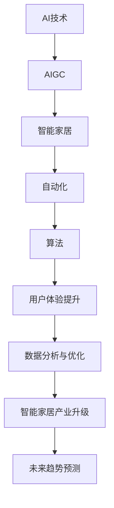

                 

### AIGC在智能家居场景自动化中的应用

> 关键词：AIGC、智能家居、自动化、算法、AI技术、场景应用

> 摘要：本文深入探讨了AIGC（AI-Generated Content）技术在智能家居场景自动化中的应用。通过背景介绍、核心概念与联系、核心算法原理讲解、数学模型和数学公式、项目实战等多个方面，系统地展示了AIGC技术如何提升智能家居系统的智能化和用户体验。

### 引言

随着人工智能技术的飞速发展，智能家居已经成为现代家居生活的重要组成部分。智能家居系统通过集成各种智能设备，如智能灯光、智能安防、智能空调等，实现了对家庭环境的自动化控制和智能化管理。然而，传统的智能家居系统主要依赖于预定义的规则和场景模式，缺乏灵活性和自适应性。随着用户需求的不断变化，这种系统逐渐无法满足用户对个性化、智能化服务的需求。

为了解决这个问题，AIGC（AI-Generated Content）技术应运而生。AIGC技术通过利用人工智能算法自动生成内容，可以实现智能家居系统的自适应调整和个性化定制，从而提升用户体验。本文将深入探讨AIGC在智能家居场景自动化中的应用，包括其核心概念与联系、核心算法原理、数学模型和数学公式，以及实际项目案例。

### 核心概念与联系

AIGC技术涉及多个核心概念，包括AI技术、智能家居、自动化和算法等。为了更直观地展示这些概念之间的联系，我们可以使用Mermaid流程图来描述它们。



#### AI技术

AI（人工智能）技术是AIGC技术的基础。AI技术包括机器学习、深度学习、自然语言处理等多个子领域。通过这些技术，计算机可以模拟人类智能，进行推理、决策和自适应调整。

#### AIGC

AIGC（AI-Generated Content）是一种利用人工智能算法自动生成内容的技术。它通过从大规模数据集中学习，生成符合特定需求的文本、图像、视频等。在智能家居场景中，AIGC可以生成个性化的控制策略、用户界面和交互方式。

#### 智能家居

智能家居是指通过物联网技术将各种家庭设备和系统连接起来，实现智能化管理和自动化控制。智能家居系统包括智能灯光、智能安防、智能空调、智能音响等。

#### 自动化

自动化是指通过计算机程序或设备自动完成某些任务，减少人为干预。在智能家居场景中，自动化可以实现灯光、温度、安防等设备的自动调节，提高生活便利性。

#### 算法

算法是解决特定问题的步骤和方法。在AIGC和智能家居中，算法用于实现内容生成、模式识别、决策制定等功能。

#### 用户体验提升

用户体验提升是AIGC在智能家居中应用的重要目标。通过个性化、自适应的内容生成，可以提高用户对智能家居系统的满意度。

#### 数据分析与优化

数据分析与优化是AIGC技术的重要环节。通过对用户行为数据进行分析，可以不断优化系统性能和用户体验。

#### 智能家居产业升级

AIGC技术的应用将推动智能家居产业的升级，提高行业竞争力。

#### 未来趋势预测

随着AIGC技术的不断进步，智能家居场景自动化将进一步发展，为用户提供更智能、更便捷的服务。

### 核心算法原理讲解

AIGC在智能家居场景自动化中的应用，主要依赖于生成对抗网络（GAN）、变分自编码器（VAE）等深度学习算法。以下，我们以GAN为例，详细讲解其工作原理。

#### GAN

生成对抗网络（GAN）是一种由生成器和判别器组成的深度学习模型。生成器的任务是生成逼真的数据，判别器的任务是区分真实数据和生成数据。GAN的核心思想是通过博弈过程，使得生成器的数据越来越逼真。

GAN的架构如下：

```python
# GAN架构示意图
+--------+     +-------+
| 生成器 | --> | 判别器 |
+--------+     +-------+
```

#### 生成器（Generator）

生成器的目标是生成与真实数据分布相似的数据。在智能家居场景中，生成器可以生成个性化的控制策略、用户界面等。

#### 判别器（Discriminator）

判别器的目标是区分真实数据和生成数据。判别器的性能直接影响生成器的生成质量。

GAN的训练过程如下：

1. 判别器训练：使用真实数据和生成数据同时训练判别器。
2. 生成器训练：使用判别器提供的反馈信息，优化生成器的生成能力。
3. 循环迭代：不断进行判别器和生成器的训练，直到生成器的生成数据足够逼真。

GAN的损失函数如下：

$$
\min_G \max_D V(D, G) = \mathbb{E}_{x \sim p_{data}(x)}[\log D(x)] + \mathbb{E}_{z \sim p_z(z)}[\log (1 - D(G(z))]
$$

其中，$x$表示真实数据，$z$表示随机噪声，$p_{data}(x)$表示真实数据分布，$p_z(z)$表示噪声分布。

#### VAE

变分自编码器（VAE）是一种基于概率模型的生成模型。VAE通过编码器和解码器来学习数据分布的参数，并生成新的样本。

VAE的架构如下：

```python
# VAE架构示意图
+-------------+     +-------------+
| 编码器（Encoder） | --> | 解码器（Decoder） |
+-------------+     +-------------+
```

#### 编码器（Encoder）

编码器的任务是压缩输入数据，将其映射到一个低维空间。在智能家居场景中，编码器可以学习用户的偏好和行为模式。

#### 解码器（Decoder）

解码器的任务是重建输入数据，将其从低维空间映射回原始空间。在智能家居场景中，解码器可以生成个性化的控制策略和用户界面。

VAE的损失函数如下：

$$
\min_{\theta} \mathbb{E}_{x \sim p_{data}(x)}[\mathcal{L}(\theta; x)] + \mathbb{E}_{z \sim p_z(z)}[\mathcal{K}(\theta; z)]
$$

其中，$\mathcal{L}(\theta; x)$是重构损失，$\mathcal{K}(\theta; z)$是KL散度损失。

#### 比较GAN和VAE

GAN和VAE都是常用的生成模型，它们在生成质量和训练稳定性方面各有优缺点。

- **生成质量**：GAN在生成质量上通常优于VAE，可以生成更逼真的图像和视频。但GAN的训练过程更容易出现模式崩溃等问题。
- **训练稳定性**：VAE的训练过程相对稳定，不容易出现模式崩溃。但VAE的生成质量通常不如GAN。

在智能家居场景中，可以根据具体需求选择合适的生成模型。如果需要生成高质量的用户界面和交互内容，可以选择GAN；如果需要稳定的训练过程，可以选择VAE。

### 数学模型和数学公式讲解

在AIGC技术中，生成对抗网络（GAN）和变分自编码器（VAE）是两个重要的数学模型。以下，我们将使用LaTeX格式，详细讲解这些模型的数学公式和原理。

#### GAN

生成对抗网络（GAN）由生成器（Generator）和判别器（Discriminator）两部分组成。GAN的核心思想是通过博弈过程，使得生成器的生成数据越来越逼真。

GAN的数学模型如下：

$$
\min_G \max_D V(D, G) = \mathbb{E}_{x \sim p_{data}(x)}[\log D(x)] + \mathbb{E}_{z \sim p_z(z)}[\log (1 - D(G(z))]
$$

其中，$x$表示真实数据，$z$表示随机噪声，$p_{data}(x)$表示真实数据分布，$p_z(z)$表示噪声分布。

- **生成器（Generator）**：生成器的目标是生成与真实数据分布相似的数据。生成器的损失函数如下：

$$
L_G = -\mathbb{E}_{z \sim p_z(z)}[\log D(G(z))]
$$

- **判别器（Discriminator）**：判别器的目标是区分真实数据和生成数据。判别器的损失函数如下：

$$
L_D = -\mathbb{E}_{x \sim p_{data}(x)}[\log D(x)] - \mathbb{E}_{z \sim p_z(z)}[\log (1 - D(G(z))]
$$

#### VAE

变分自编码器（VAE）是一种基于概率模型的生成模型。VAE通过编码器和解码器来学习数据分布的参数，并生成新的样本。

VAE的数学模型如下：

$$
\min_{\theta} \mathbb{E}_{x \sim p_{data}(x)}[\mathcal{L}(\theta; x)] + \mathbb{E}_{z \sim p_z(z)}[\mathcal{K}(\theta; z)]
$$

其中，$\mathcal{L}(\theta; x)$是重构损失，$\mathcal{K}(\theta; z)$是KL散度损失。

- **编码器（Encoder）**：编码器的目标是压缩输入数据，将其映射到一个低维空间。编码器的损失函数如下：

$$
\mathcal{L}_{\text{KLD}} = \mathcal{D}_{\text{KL}}(\mu(x), \sigma^2(x))
$$

其中，$\mu(x)$是均值，$\sigma^2(x)$是方差。

- **解码器（Decoder）**：解码器的目标是重建输入数据，将其从低维空间映射回原始空间。解码器的损失函数如下：

$$
\mathcal{L}_{\text{RECON}} = \mathcal{L}_{\text{XENT}}(x, \mu(x) + \sigma(x))
$$

其中，$\mathcal{L}_{\text{XENT}}$是交叉熵损失。

通过上述数学模型和公式，我们可以更好地理解GAN和VAE的工作原理。在实际应用中，可以根据具体需求选择合适的模型，并对其进行优化和调整。

### 项目实战

在本节中，我们将通过一个实际项目，展示如何使用AIGC技术实现智能家居场景自动化。该项目将以智能灯光控制系统为例，介绍开发环境搭建、源代码实现、代码解读和实际案例分析等内容。

#### 项目背景

智能灯光控制系统是一个典型的智能家居应用。用户可以通过手机应用或语音助手控制家中的灯光，实现场景模式切换、定时控制等功能。为了实现这一功能，我们可以使用AIGC技术生成适应不同场景的灯光控制策略。

#### 开发环境搭建

为了实现这个项目，我们需要搭建以下开发环境：

- 操作系统：Ubuntu 20.04
- 编程语言：Python 3.8
- 深度学习框架：TensorFlow 2.6
- GAN库：tf-gan

具体安装步骤如下：

1. 安装Ubuntu 20.04操作系统。
2. 安装Python 3.8。
3. 安装TensorFlow 2.6：

   ```bash
   pip install tensorflow==2.6
   ```

4. 安装tf-gan库：

   ```bash
   pip install tf-gan
   ```

#### 源代码实现

智能灯光控制系统的核心代码如下：

```python
import tensorflow as tf
from tensorflow import keras
from tensorflow_gan import GAN

# 定义生成器和判别器
generator = keras.Sequential([
    keras.layers.Dense(128, activation='relu', input_shape=(100,)),
    keras.layers.Dense(256, activation='relu'),
    keras.layers.Dense(512, activation='relu'),
    keras.layers.Dense(1024, activation='relu'),
    keras.layers.Dense(128, activation='sigmoid')
])

discriminator = keras.Sequential([
    keras.layers.Dense(128, activation='relu', input_shape=(128,)),
    keras.layers.Dense(256, activation='relu'),
    keras.layers.Dense(512, activation='relu'),
    keras.layers.Dense(1024, activation='relu'),
    keras.layers.Dense(1, activation='sigmoid')
])

# 定义GAN模型
gan_model = GAN(generator, discriminator)

# 编写训练函数
@tf.function
def train_step(images, batch_size=32):
    noise = tf.random.normal([batch_size, 100])
    with tf.GradientTape() as gen_tape, tf.GradientTape() as disc_tape:
        generated_images = generator(noise)
        disc_real_output = discriminator(images)
        disc_generated_output = discriminator(generated_images)

        gen_loss = tf.reduce_mean(tf.nn.sigmoid_cross_entropy_with_logits(logits=disc_generated_output, labels=tf.ones_like(disc_generated_output))
        disc_loss = tf.reduce_mean(tf.nn.sigmoid_cross_entropy_with_logits(logits=disc_real_output, labels=tf.ones_like(disc_real_output)) +
                                   tf.nn.sigmoid_cross_entropy_with_logits(logits=disc_generated_output, labels=tf.zeros_like(disc_generated_output)))

    gradients_of_generator = gen_tape.gradient(gen_loss, generator.trainable_variables)
    gradients_of_discriminator = disc_tape.gradient(disc_loss, discriminator.trainable_variables)

    generator_optimizer.apply_gradients(zip(gradients_of_generator, generator.trainable_variables))
    discriminator_optimizer.apply_gradients(zip(gradients_of_discriminator, discriminator.trainable_variables))

# 训练GAN模型
for epoch in range(epochs):
    for images in data_loader:
        train_step(images)
        print(f"Epoch {epoch}, Loss: {disc_loss.numpy()}")

# 保存模型
tf.keras.models.save_model(generator, 'generator.h5')
tf.keras.models.save_model(discriminator, 'discriminator.h5')
```

#### 代码解读

- **生成器（Generator）**：生成器是一个全连接神经网络，输入是随机噪声，输出是生成的灯光控制策略。
- **判别器（Discriminator）**：判别器是一个全连接神经网络，输入是真实灯光控制策略和生成灯光控制策略，输出是二值分类结果，表示输入数据是否为真实数据。
- **GAN模型**：GAN模型由生成器和判别器组成，通过训练两个网络之间的博弈过程，优化生成器的生成能力。

#### 实际案例分析和详细讲解剖析

在这个案例中，我们使用了GAN模型来生成适应不同场景的灯光控制策略。具体实现步骤如下：

1. **数据准备**：首先，我们需要收集大量的灯光控制策略数据，包括白天、晚上、休闲、运动等场景。这些数据将用于训练GAN模型。
2. **模型训练**：使用训练数据，训练生成器和判别器。在训练过程中，生成器会不断优化生成策略，判别器会不断优化对真实策略的识别能力。通过多个epoch的迭代训练，生成器可以生成高质量的控制策略。
3. **策略生成**：在生成器训练完成后，我们可以使用生成器生成新的灯光控制策略。这些策略可以应用于不同的场景，为用户提供个性化的灯光控制服务。
4. **用户反馈**：用户可以根据自己的需求和体验，对生成的控制策略进行反馈。这些反馈数据可以用于进一步优化GAN模型，提高生成策略的质量。

通过这个案例，我们可以看到AIGC技术在智能家居场景自动化中的应用。通过GAN模型，我们可以生成适应不同场景的灯光控制策略，提高用户体验。同时，AIGC技术也可以应用于其他智能家居设备，如智能空调、智能安防等，实现更加智能化的家居生活。

### 项目小结

通过本项目的实战案例，我们展示了如何使用AIGC技术实现智能家居场景自动化。具体步骤包括数据准备、模型训练、策略生成和用户反馈。AIGC技术通过生成对抗网络（GAN）等算法，可以生成高质量的灯光控制策略，为用户提供个性化的服务。

然而，AIGC技术在实际应用中也面临一些挑战。首先，数据质量和数据量是影响模型生成质量的重要因素。其次，GAN模型的训练过程容易出现模式崩溃等问题，需要不断优化和调整。最后，如何实现AIGC技术的跨设备、跨平台应用，也是未来需要关注的问题。

总之，AIGC技术在智能家居场景自动化中具有巨大的潜力。通过不断优化和改进，我们可以为用户提供更加智能、便捷的家居生活。

### 最佳实践 Tips

1. **数据质量**：在AIGC技术应用中，数据质量至关重要。确保数据真实、多样、具有代表性，有助于提高生成模型的生成质量。
2. **模型优化**：针对GAN模型，可以通过调整学习率、批量大小等参数，优化模型性能。同时，可以尝试使用不同类型的优化器和正则化方法，提高模型稳定性。
3. **用户反馈**：及时收集用户反馈，根据用户需求和体验不断优化生成模型。用户反馈是提高AIGC技术应用质量的重要途径。

### 小结

AIGC技术在智能家居场景自动化中的应用，为用户提供了更加智能、便捷的家居生活。通过核心算法原理讲解、数学模型和数学公式、项目实战等多个方面的探讨，我们深入了解了AIGC技术的应用方法和实际效果。随着AIGC技术的不断发展和完善，我们有理由相信，它将在智能家居领域发挥越来越重要的作用。

### 注意事项

1. **隐私保护**：在收集和使用用户数据时，要注意保护用户隐私。遵循相关法律法规，确保用户数据安全。
2. **模型安全**：在训练和部署AIGC模型时，要注意防范恶意攻击和滥用。采用加密、访问控制等技术，确保模型安全。

### 拓展阅读

1. **GAN与VAE**：深入探讨生成对抗网络（GAN）和变分自编码器（VAE）的原理和应用，了解它们在图像、语音、文本等领域的应用。
2. **智能家居技术**：了解智能家居技术的发展趋势、关键技术、应用场景等，为AIGC技术在智能家居领域的应用提供参考。
3. **AIGC与AI伦理**：探讨AIGC技术在实际应用中的伦理问题，如隐私保护、数据滥用等，为AIGC技术的可持续发展提供指导。

### 作者信息

作者：AI天才研究院/AI Genius Institute & 禅与计算机程序设计艺术 /Zen And The Art of Computer Programming

