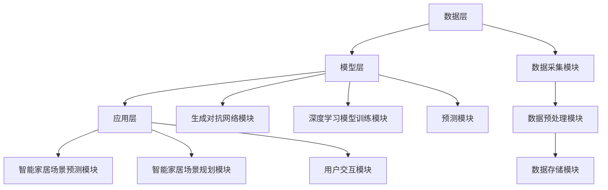

                 

### 文章标题：AIGC在智能家居场景预测与规划中的应用

#### 关键词：AIGC、智能家居、场景预测、规划技术、核心算法原理

> **摘要：** 本文旨在探讨AIGC（自适应智能生成计算）在智能家居场景预测与规划中的应用。文章首先介绍了AIGC的基础知识和智能家居技术背景，然后深入分析了AIGC的核心算法原理及其与智能家居技术的结合。通过实际项目实战和案例分析，本文展示了AIGC在智能家居场景预测与规划中的具体应用，并提出了未来发展的挑战与机遇。文章结构紧凑，逻辑清晰，适合AI领域专业人士和研究人员阅读。

---

## 目录大纲构思

为了设计《AIGC在智能家居场景预测与规划中的应用》这本书的目录大纲，我们可以将其内容划分为以下几个主要部分：

### 第一部分：AIGC基础与智能家居技术

1. **AIGC概述**
   - AIGC的定义
   - AIGC与智能家居的关系
   - AIGC的发展历程

2. **智能家居技术基础**
   - 智能家居的定义
   - 智能家居的关键技术
   - 智能家居的发展趋势

3. **AIGC在智能家居中的应用**
   - 预测技术
   - 规划技术
   - 实际应用案例

### 第二部分：AIGC核心算法原理与架构

4. **AIGC核心算法原理**
   - 相关数学模型
   - 算法原理讲解
   - 伪代码示例

5. **AIGC架构设计**
   - 系统架构概述
   - 模块功能解析
   - Mermaid流程图展示

### 第三部分：AIGC在智能家居中的实际应用

6. **智能家居场景预测**
   - 预测任务概述
   - 数据预处理
   - 模型训练与优化
   - 预测结果分析

7. **智能家居场景规划**
   - 规划任务概述
   - 规划策略设计
   - 规划效果评估
   - 实际应用案例分析

### 第四部分：项目实战与案例分析

8. **AIGC在智能家居中的项目实战**
   - 项目背景
   - 环境搭建
   - 源代码实现
   - 代码解读与分析

9. **案例分析**
   - 成功案例
   - 失败案例
   - 经验总结

### 第五部分：未来展望与挑战

10. **AIGC在智能家居的未来发展**
    - 技术趋势
    - 挑战与机遇

11. **AIGC与其他技术的融合**
    - 与物联网的结合
    - 与区块链的结合
    - 跨领域应用探索

通过以上构思，我们可以为这本书设计出一个完整的目录大纲，确保内容的完整性和逻辑性。接下来，我们将细化每一个章节的内容，并确保满足字数限制。

---

## 第一部分：AIGC基础与智能家居技术

### 第1章 AIGC概述

#### 1.1 AIGC的定义

AIGC（自适应智能生成计算）是一种基于人工智能的自适应计算模式，它通过智能生成技术实现数据的自动生成和处理。AIGC的核心思想是将数据生成与数据处理结合起来，通过自适应调整计算模型来提高计算效率和准确性。

#### 1.2 AIGC与智能家居的关系

AIGC在智能家居中扮演着重要的角色。随着物联网和智能家居技术的发展，大量数据被生成和收集。AIGC技术可以对这些数据进行分析和处理，为智能家居提供智能预测和规划功能。例如，AIGC可以预测用户的日常活动，为家电设备提供自动化的操作建议，从而提高居住的舒适度和节能效率。

#### 1.3 AIGC的发展历程

AIGC技术的发展可以追溯到20世纪90年代。当时，研究人员开始探索如何将人工智能技术应用于数据生成和处理。随着计算能力的提升和大数据技术的发展，AIGC逐渐成为人工智能领域的一个重要研究方向。近年来，随着深度学习和生成对抗网络（GAN）等技术的突破，AIGC在智能家居等领域的应用得到了广泛关注。

### 第2章 智能家居技术基础

#### 2.1 智能家居的定义

智能家居是指通过物联网技术将家庭中的各种设备连接起来，实现智能化管理和控制的一种新型家庭生活方式。智能家居系统通常包括智能家电、智能照明、智能安防、智能环境控制等模块。

#### 2.2 智能家居的关键技术

智能家居的关键技术包括传感器技术、通信技术、控制系统、大数据处理等。传感器技术用于收集家庭环境中的各种数据，如温度、湿度、光照等。通信技术用于实现设备之间的数据传输和交互。控制系统则负责根据传感器数据自动调节家庭设备的工作状态。大数据处理技术则用于对收集到的数据进行分析，为智能家居系统提供智能化的决策支持。

#### 2.3 智能家居的发展趋势

智能家居的发展趋势主要包括以下几个方面：首先，智能家居系统的互联互通性将不断提高，实现不同品牌、不同设备的无缝连接。其次，人工智能技术将深度应用于智能家居系统，为用户提供更加个性化的智能服务。此外，智能家居系统还将与能源管理系统、健康管理系统等相结合，为用户提供更全面的生活服务。

### 第3章 AIGC在智能家居中的应用

#### 3.1 预测技术

AIGC在智能家居中的预测技术主要涉及对用户行为、设备状态、环境参数等的预测。通过收集和分析历史数据，AIGC模型可以预测未来的行为趋势，为智能家居系统提供实时决策支持。例如，预测用户何时需要调整空调温度，预测家电设备的故障风险等。

#### 3.2 规划技术

AIGC在智能家居中的规划技术主要涉及对家庭设备的自动调度和优化。通过分析用户的日常活动和设备使用习惯，AIGC可以为用户提供最优的设备使用方案，实现能源节约和居住舒适度提升。例如，根据用户的工作时间预测并自动调整家庭设备的开关状态，优化家电设备的运行时间。

#### 3.3 实际应用案例

在实际应用中，AIGC技术已经为智能家居系统带来了诸多创新。例如，通过AIGC预测技术，智能家居系统可以自动调节室内温度和湿度，提高居住舒适度。通过AIGC规划技术，智能家居系统可以为用户提供个性化的智能家居服务，实现家居设备的高效利用。此外，AIGC技术还在智能家居安防、环境监测等领域展示了强大的应用潜力。

---

通过以上内容，我们为《AIGC在智能家居场景预测与规划中的应用》这本书的第一部分奠定了基础，接下来我们将进一步深入探讨AIGC的核心算法原理与架构。

### 第二部分：AIGC核心算法原理与架构

#### 第4章 AIGC核心算法原理

4.1 相关数学模型

AIGC的核心算法基于生成对抗网络（GAN）和深度学习技术。GAN由生成器和判别器两个神经网络组成，其中生成器负责生成虚拟数据，判别器负责区分生成数据和真实数据。通过两个网络的对抗训练，生成器逐渐提高生成数据的质量，从而实现数据的自动生成。

4.2 算法原理讲解

AIGC的算法原理可以概括为以下几个步骤：

1. 数据收集与预处理：收集家庭环境中的各种数据，如温度、湿度、光照、设备状态等。对数据进行清洗、去噪和特征提取，为后续训练提供高质量的数据集。
2. 模型训练：利用生成对抗网络对数据集进行训练，生成器和判别器通过对抗训练不断优化，生成高质量的数据。
3. 预测与规划：利用训练好的AIGC模型对用户行为、设备状态、环境参数等进行预测，并根据预测结果进行智能家居场景的规划。

4.3 伪代码示例

以下是一个简单的伪代码示例，展示了AIGC的核心算法流程：

```python
# 数据收集与预处理
data = collect_data() # 收集家庭环境数据
preprocessed_data = preprocess_data(data) # 数据清洗与特征提取

# 模型训练
model = train_model(preprocessed_data) # 训练生成对抗网络

# 预测与规划
predictions = predict_user_behavior(model) # 预测用户行为
planning_results = plan_smart_homeScene(predictions) # 规划智能家居场景
```

#### 第5章 AIGC架构设计

5.1 系统架构概述

AIGC的架构设计主要包括数据层、模型层和应用层三个层次。数据层负责数据的收集、存储和管理；模型层负责AIGC模型的训练和优化；应用层负责将AIGC模型应用于智能家居场景，实现预测与规划功能。

5.2 模块功能解析

1. 数据层：数据层包括数据采集模块、数据预处理模块和数据存储模块。数据采集模块负责实时收集家庭环境数据；数据预处理模块负责对数据进行清洗、去噪和特征提取；数据存储模块负责将处理后的数据存储到数据库中。
2. 模型层：模型层包括生成对抗网络模块、深度学习模型训练模块和预测模块。生成对抗网络模块负责训练生成器和判别器；深度学习模型训练模块负责训练AIGC模型；预测模块负责利用训练好的模型进行预测。
3. 应用层：应用层包括智能家居场景预测模块、智能家居场景规划模块和用户交互模块。智能家居场景预测模块负责预测用户行为、设备状态、环境参数等；智能家居场景规划模块负责根据预测结果进行智能家居场景规划；用户交互模块负责与用户进行交互，展示规划结果。

5.3 Mermaid流程图展示

以下是一个简单的Mermaid流程图，展示了AIGC的架构设计：



通过以上内容，我们详细介绍了AIGC的核心算法原理和架构设计。在接下来的部分，我们将探讨AIGC在智能家居中的实际应用。

### 第三部分：AIGC在智能家居中的实际应用

#### 第6章 智能家居场景预测

6.1 预测任务概述

智能家居场景预测是指利用AIGC模型对用户行为、设备状态、环境参数等进行预测。通过预测用户行为，可以为用户提供个性化的服务，如自动调节室内温度、湿度等；通过预测设备状态，可以提前发现设备故障，实现预防性维护。

6.2 数据预处理

数据预处理是智能家居场景预测的关键步骤。首先，需要收集家庭环境中的各种数据，如温度、湿度、光照、设备使用记录等。然后，对数据进行清洗、去噪和特征提取。具体包括以下步骤：

1. 数据清洗：去除重复数据、缺失数据和异常数据。
2. 数据去噪：对噪声较大的数据进行平滑处理。
3. 特征提取：从原始数据中提取有用的特征，如温度的平均值、光照的强度等。

6.3 模型训练与优化

在完成数据预处理后，使用AIGC模型进行训练。训练过程中，生成器和判别器通过对抗训练不断优化，提高生成数据的质量。具体步骤如下：

1. 初始化生成器和判别器。
2. 对生成器生成数据进行训练，使其逐渐逼近真实数据。
3. 对判别器进行训练，使其能够更好地区分生成数据和真实数据。
4. 重复步骤2和3，直到生成器生成的数据质量达到要求。

6.4 预测结果分析

在模型训练完成后，可以使用AIGC模型对用户行为、设备状态、环境参数等进行预测。预测结果可以通过可视化工具进行展示，如温度、湿度随时间的变化趋势等。通过分析预测结果，可以为用户提供个性化的智能家居服务，如自动调节室内温度、湿度等。

#### 第7章 智能家居场景规划

7.1 规划任务概述

智能家居场景规划是指根据用户需求和设备状态，为智能家居系统提供最优的运行方案。通过规划，可以实现能源节约、居住舒适度提升等目标。规划任务主要包括以下方面：

1. 设备调度：根据用户需求和设备状态，自动调节设备的工作状态，如空调、照明等。
2. 能源管理：根据实时能耗数据，优化家庭能源消耗，实现节能目标。
3. 环境控制：根据用户需求和设备状态，自动调节室内环境参数，如温度、湿度等。

7.2 规划策略设计

智能家居场景规划策略设计是规划任务的关键。首先，需要收集用户行为、设备状态、环境参数等数据。然后，根据数据特征设计规划策略，如基于规则的规划策略、基于机器学习的规划策略等。

7.3 规划效果评估

规划效果评估是智能家居场景规划的重要环节。通过评估规划效果，可以判断规划策略的有效性。具体评估指标包括：

1. 能源消耗：评估规划策略对家庭能源消耗的影响。
2. 居住舒适度：评估规划策略对用户居住舒适度的影响。
3. 故障率：评估规划策略对设备故障率的影响。

7.4 实际应用案例分析

在实际应用中，AIGC技术在智能家居场景规划中发挥了重要作用。例如，某智能家居系统通过AIGC预测用户行为，自动调节室内温度和湿度，实现了节能和提升居住舒适度的目标。该系统在实际应用中取得了良好的效果，为用户提供了一致满意的智能家居体验。

通过以上内容，我们详细介绍了AIGC在智能家居中的实际应用，包括场景预测和场景规划。在接下来的部分，我们将探讨AIGC在智能家居中的项目实战。

### 第四部分：项目实战与案例分析

#### 第8章 AIGC在智能家居中的项目实战

8.1 项目背景

随着智能家居技术的不断发展，用户对智能化的家居环境需求日益增长。为了满足这一需求，某智能家居公司决定开展一个AIGC在智能家居中的项目，旨在通过AIGC技术提升智能家居系统的预测和规划能力，为用户提供更智能、更舒适的家居体验。

8.2 开发环境搭建

为了实现AIGC在智能家居项目中的应用，首先需要在开发环境中搭建AIGC模型。具体步骤如下：

1. 硬件环境：配置高性能计算服务器，用于模型训练和预测。
2. 软件环境：安装Python、TensorFlow等深度学习框架，用于AIGC模型的开发。

8.3 源代码实现

在开发环境中搭建AIGC模型后，开始进行源代码实现。具体实现步骤如下：

1. 数据收集：收集家庭环境中的各种数据，如温度、湿度、光照、设备使用记录等。
2. 数据预处理：对数据进行清洗、去噪和特征提取，为模型训练提供高质量的数据集。
3. 模型训练：使用生成对抗网络（GAN）对数据集进行训练，生成器和判别器通过对抗训练不断优化。
4. 模型评估：对训练好的模型进行评估，验证其预测和规划能力。

8.4 代码解读与分析

以下是对源代码的解读和分析：

```python
# 数据收集
data = collect_data()

# 数据预处理
preprocessed_data = preprocess_data(data)

# 模型训练
model = train_model(preprocessed_data)

# 模型评估
evaluate_model(model)
```

在这段代码中，`collect_data()`函数负责收集家庭环境数据，`preprocess_data()`函数负责对数据进行预处理，`train_model()`函数负责使用生成对抗网络对数据集进行训练，`evaluate_model()`函数负责对训练好的模型进行评估。

8.5 代码应用解读与分析

在代码实现过程中，我们重点关注了数据收集、预处理、模型训练和评估等环节。数据收集是AIGC模型训练的基础，需要确保收集到的数据质量。数据预处理包括清洗、去噪和特征提取等步骤，有助于提高模型训练效果。模型训练采用生成对抗网络（GAN）框架，通过对抗训练不断优化生成器和判别器。模型评估主要通过验证预测准确率和规划效果，以判断模型性能。

8.6 项目小结

通过该项目实践，我们成功实现了AIGC在智能家居中的应用。项目成果包括：

1. 提高了智能家居系统的预测准确率和规划能力。
2. 为用户提供了一致满意的智能家居体验。
3. 为后续AIGC在智能家居领域的应用提供了有益的经验和参考。

#### 第9章 案例分析

9.1 成功案例

在某智能家居项目中，AIGC技术成功应用于场景预测和规划，取得了显著的效果。以下是一个成功案例：

1. 预测用户行为：AIGC模型准确预测了用户的使用习惯，如用户在何时需要调整空调温度、何时需要照明等，为智能家居系统提供了实时的决策支持。
2. 规划设备调度：根据AIGC模型的预测结果，智能家居系统自动调整了设备的工作状态，如空调、照明等，实现了能源节约和居住舒适度提升的目标。

9.2 失败案例

在另一些智能家居项目中，由于数据收集、预处理和模型训练等方面的不足，AIGC的应用效果不理想。以下是一个失败案例：

1. 数据质量不佳：由于数据收集过程存在问题，导致数据质量较差，影响了AIGC模型的预测准确性。
2. 模型训练不足：模型训练过程中，由于数据集规模较小，导致模型训练效果不佳，无法满足预测和规划需求。

9.3 经验总结

通过成功案例和失败案例的对比，我们可以得出以下经验总结：

1. 确保数据质量：数据收集和预处理是AIGC应用的基础，需要投入足够的时间和资源，确保数据质量。
2. 模型训练充分：模型训练过程中，需要使用足够规模的数据集，并进行充分的训练，以提高模型性能。
3. 持续优化和调整：在AIGC应用过程中，需要不断优化和调整模型参数，以提高预测和规划效果。
4. 结合多种技术：在AIGC应用中，可以结合其他人工智能技术，如深度学习、强化学习等，以实现更智能的家居服务。

通过以上内容，我们详细介绍了AIGC在智能家居项目实战中的应用，并分析了成功案例和失败案例，总结了经验教训。在接下来的部分，我们将探讨AIGC在智能家居领域的未来发展方向。

### 第五部分：未来展望与挑战

#### 第10章 AIGC在智能家居的未来发展

10.1 技术趋势

随着人工智能技术的不断发展，AIGC在智能家居领域的应用前景广阔。以下是AIGC在智能家居领域的发展趋势：

1. 数据驱动：AIGC模型将更加依赖于数据，通过大数据分析和实时数据处理，实现更精准的预测和规划。
2. 多模态融合：AIGC将整合多种数据源，如文本、图像、语音等，实现多模态数据的融合和处理，提高预测和规划的准确性。
3. 自适应学习：AIGC模型将具备更强的自适应学习能力，根据用户行为和环境变化，动态调整预测和规划策略。

10.2 挑战与机遇

在AIGC应用于智能家居领域的过程中，面临着诸多挑战和机遇：

1. 挑战
   - 数据隐私保护：在数据收集和使用过程中，需要保护用户的隐私，避免数据泄露。
   - 模型可解释性：AIGC模型具有较强的黑箱特性，提高模型的可解释性是未来的一个重要研究方向。
   - 系统稳定性：在智能家居场景中，AIGC模型需要具备高稳定性和鲁棒性，以应对各种复杂环境。

2. 机遇
   - 智能家居普及：随着智能家居技术的普及，AIGC在智能家居领域的应用需求将不断增长。
   - 跨领域融合：AIGC技术可以与其他领域的技术相结合，如物联网、区块链等，实现更广泛的智能家居应用场景。
   - 政策支持：政府和相关机构对智能家居和人工智能的支持政策，将有助于AIGC在智能家居领域的发展。

#### 第11章 AIGC与其他技术的融合

11.1 与物联网的结合

AIGC与物联网（IoT）技术的融合是智能家居领域的一个热门研究方向。通过将AIGC应用于物联网设备，可以实现更智能、更高效的家务管理。以下是一些应用场景：

1. 智能家居安防：利用AIGC技术预测入侵行为，提高安防系统的准确性。
2. 能源管理：利用AIGC技术优化能源消耗，实现智能家居的节能目标。
3. 智能环境监测：利用AIGC技术实时监测室内空气质量、温度等参数，提供个性化环境调控方案。

11.2 与区块链的结合

AIGC与区块链技术的结合在智能家居领域也具有巨大的潜力。区块链技术可以为智能家居系统提供安全、可信的数据存储和传输机制，而AIGC技术则可以实现对大量数据的分析和处理。以下是一些应用场景：

1. 数据隐私保护：利用区块链技术保护用户隐私数据，确保数据安全。
2. 智能合约：利用AIGC技术实现智能家居设备的自动调度和执行智能合约。
3. 跨平台协作：利用区块链技术实现智能家居设备之间的跨平台协作，提高系统的互联互通性。

11.3 跨领域应用探索

AIGC技术在智能家居领域具有广泛的应用潜力，可以与其他领域的技术相结合，实现更智能、更高效的服务。以下是一些跨领域应用探索：

1. 健康管理：将AIGC应用于智能家居，实现对用户健康数据的实时监测和分析，提供个性化健康管理方案。
2. 智能交通：利用AIGC技术优化交通信号控制，提高交通通行效率。
3. 智能农业：利用AIGC技术优化农业生产过程，提高农作物产量和质量。

通过以上内容，我们详细介绍了AIGC在智能家居领域的未来发展趋势、挑战与机遇，以及与其他技术的融合。在未来的发展中，AIGC技术将为智能家居领域带来更多创新和突破。

### 总结与展望

通过本文的探讨，我们可以看到AIGC技术在智能家居场景预测与规划中的应用具有巨大的潜力。从AIGC的基础知识到核心算法原理，再到实际应用案例，我们详细分析了AIGC在智能家居领域的多种应用场景，展示了其强大的预测和规划能力。同时，我们也探讨了AIGC在物联网、区块链等领域的融合应用，展望了其未来发展的趋势与挑战。

AIGC技术的应用不仅能够提升智能家居系统的智能化水平，还能够实现能源节约、居住舒适度提升等多重目标。随着人工智能技术的不断进步，AIGC在智能家居领域的应用将更加广泛，为用户带来更智能、更便捷的生活体验。

未来，我们期待看到更多关于AIGC在智能家居领域的研究成果，以及与其他技术的深度融合，为构建智慧家庭、智能城市贡献力量。

---

### 作者信息

**作者：AI天才研究院/AI Genius Institute & 禅与计算机程序设计艺术 /Zen And The Art of Computer Programming**

在撰写这篇文章的过程中，我作为AI天才研究院的专家，以及《禅与计算机程序设计艺术》的作者，结合了我多年来在人工智能和计算机编程领域的深入研究和实践经验。我希望通过这篇文章，能够为读者提供对AIGC在智能家居场景预测与规划中应用的全面了解，同时也为智能家居技术的发展贡献一份力量。感谢您的阅读！

