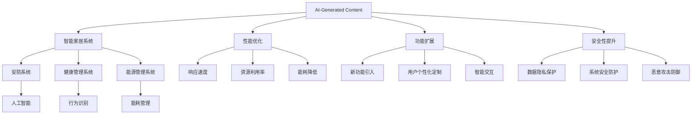
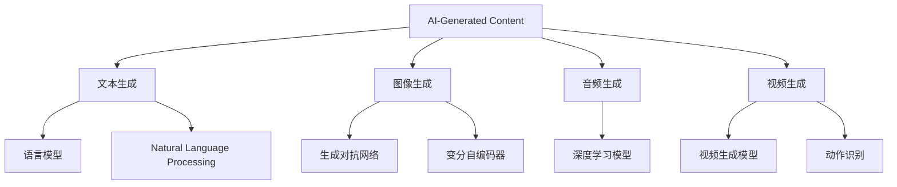
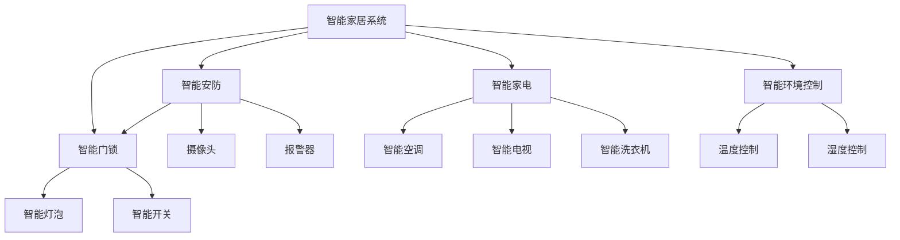

                 

### 确定书籍的主题和目标受众

#### 1. 确定书籍的主题

《AIGC在智能家居系统优化中的应用》这一主题，明确了书籍将聚焦于探讨AIGC（AI-Generated Content）技术在智能家居系统中的应用，并着重分析这些应用如何优化智能家居系统的性能和功能。因此，书籍的主题主要涉及以下几个方面：

- **AIGC技术**：介绍AIGC的基本概念、技术原理及其在各个领域的应用。
- **智能家居系统**：智能家居系统的定义、组成部分、功能及其优化需求。
- **AIGC与智能家居的结合**：探讨AIGC如何与智能家居系统结合，提高系统的智能化水平和用户体验。

#### 2. 确定目标受众

目标受众主要针对以下几个方面：

- **智能家居系统开发者**：了解如何利用AIGC技术优化智能家居系统，提高开发效率和系统性能。
- **人工智能研究者**：研究AIGC技术在智能家居系统中的创新应用，探索其在智能家居领域的发展潜力。
- **智能家居爱好者**：对智能家居技术感兴趣，希望了解AIGC技术如何改变智能家居系统的用户。

#### 3. 书籍结构设计

为了使书籍内容更加清晰、系统，我们设计了一个包含七个主要部分的书籍结构：

### 第一部分：基础概念与原理

- **1.1 AIGC概述**：介绍AIGC的定义、特点和应用场景。
- **1.2 智能家居系统概述**：介绍智能家居系统的定义、组成部分和功能。
- **1.3 AIGC与智能家居的结合**：探讨AIGC与智能家居系统的结合方式及其优势。

### 第二部分：AIGC在智能家居系统中的应用

- **2.1 性能优化**：分析AIGC如何优化智能家居系统的响应速度、资源利用率和能耗。
- **2.2 功能扩展**：探讨AIGC在智能家居系统中引入新功能、用户个性化定制和智能交互。
- **2.3 安全性提升**：分析AIGC在智能家居系统中的数据隐私保护、系统安全防护和恶意攻击防御。

### 第三部分：实际应用案例

- **3.1 案例一：智能家居安防系统**：介绍AIGC在智能家居安防系统中的应用和效果。
- **3.2 案例二：智能家居健康管理系统**：介绍AIGC在智能家居健康管理中的应用和效果。
- **3.3 案例三：智能家居能源管理系统**：介绍AIGC在智能家居能源管理中的应用和效果。

### 第四部分：挑战与未来趋势

- **4.1 挑战分析**：讨论AIGC在智能家居系统优化中面临的挑战。
- **4.2 未来趋势**：展望AIGC在智能家居系统优化中的未来发展趋势。

### 第五部分：技术实现

- **5.1 技术栈介绍**：介绍实现AIGC在智能家居系统优化中所需的技术栈。
- **5.2 开发环境搭建**：详细讲解开发环境的搭建过程。
- **5.3 源代码实现**：提供AIGC在智能家居系统优化中的源代码实现。

### 第六部分：最佳实践与案例分析

- **6.1 最佳实践**：总结AIGC在智能家居系统优化中的最佳实践。
- **6.2 案例分析**：对实际案例进行分析和解读。

### 第七部分：总结与展望

- **7.1 总结**：对书籍内容进行总结。
- **7.2 展望**：展望AIGC在智能家居系统优化中的未来。

### 4. 书籍整体结构设计

- **章节划分**：根据书籍的主题和目标受众，合理划分章节，确保每个章节的内容紧密相关，逻辑清晰。
- **内容详尽**：确保每个章节都有详细的讲解，从基础概念到实际应用，再到案例分析，全面覆盖AIGC在智能家居系统优化中的应用。
- **结构紧凑**：避免冗余内容，确保书籍的整体结构紧凑，易于阅读。

### 5. 字数控制

- **总字数控制**：确保书籍的总字数在10000～12000字左右，保持内容的丰富性和可读性。

通过上述设计，我们期望这本书能够为智能家居系统开发者、研究者以及爱好者提供一本全面、系统的参考资料，帮助他们更好地理解AIGC在智能家居系统优化中的应用，从而推动智能家居技术的发展。

---

### 核心概念与联系架构 Mermaid 流程图

为了更好地理解AIGC在智能家居系统中的应用，我们可以通过Mermaid流程图来展示核心概念之间的联系和架构。以下是一个简化的示例：



这个流程图展示了AIGC的核心概念如何与智能家居系统及其子组件（如安防系统、健康管理系统、能源管理系统）相互关联，并如何实现性能优化、功能扩展和安全性提升。通过这个图，读者可以更直观地理解AIGC技术在智能家居系统优化中的应用。

---

在接下来的章节中，我们将详细探讨AIGC的基本概念、特点和应用场景，并逐步深入到智能家居系统的各个组成部分，分析AIGC如何在这些部分中发挥作用，从而实现性能优化、功能扩展和安全性提升。通过这些内容，读者将能够全面了解AIGC在智能家居系统优化中的关键作用和实际应用。

---

### AIGC的基本概念

AIGC（AI-Generated Content），即人工智能生成内容，是一种利用人工智能技术，尤其是深度学习和自然语言处理（NLP）技术，自动生成文本、图像、音频和视频等媒体内容的方法。AIGC的核心在于其能够模拟人类的创造力和表达能力，通过大规模数据训练，生成高质量、多样化的内容。

#### 核心概念与联系

1. **文本生成**：利用预训练的语言模型，如GPT（Generative Pre-trained Transformer）和BERT（Bidirectional Encoder Representations from Transformers），生成符合特定主题和语境的文本内容。
2. **图像生成**：通过生成对抗网络（GAN）和变分自编码器（VAE），生成逼真的图像和视频内容。
3. **音频生成**：利用深度学习模型，如WaveNet，生成逼真的语音和音乐。
4. **视频生成**：结合视频生成模型和动作识别技术，生成连续的视频内容。

AIGC的核心概念和联系可以用以下Mermaid流程图来展示：



在这个流程图中，AIGC作为一个整体，通过文本生成、图像生成、音频生成和视频生成等子模块，实现多样化的内容生成。各个子模块之间通过深度学习模型和自然语言处理技术进行相互连接和协同工作，从而生成高质量的内容。

#### AIGC的特点

1. **高度自动化**：AIGC能够自动处理大规模数据，生成内容，从而大大降低人工成本和时间。
2. **灵活性**：AIGC可以生成多样化的内容，从文本、图像到音频和视频，满足不同场景的需求。
3. **自适应**：AIGC能够根据不同的输入数据和场景，自适应调整生成内容的形式和风格。
4. **高效率**：通过批量生成内容，AIGC能够在短时间内生成大量的高质量内容。

#### 应用场景

1. **内容创作**：利用AIGC技术，可以快速生成新闻报道、文章、博客等内容，提高内容创作效率。
2. **广告营销**：AIGC可以生成个性化的广告内容，提高广告投放的精准度和效果。
3. **娱乐**：通过AIGC技术，可以生成电影、电视剧、游戏等娱乐内容，丰富用户体验。
4. **教育**：利用AIGC生成个性化教学资料，提高教学效果和学生的学习兴趣。

通过上述内容，我们对AIGC的基本概念、核心联系和特点有了全面的了解。在接下来的章节中，我们将深入探讨智能家居系统的基本概念和组成部分，分析AIGC如何与智能家居系统结合，实现性能优化、功能扩展和安全性提升。

---

### 智能家居系统的基本概念

智能家居系统（Smart Home System）是指通过互联网、传感器和智能设备等技术，将家庭中的各种设备互联起来，实现家庭环境的自动化管理和智能控制，从而提高居住的舒适度、便利性和安全性。智能家居系统通常由多个子系统组成，包括智能照明、智能安防、智能家电、智能环境控制等。

#### 核心概念与联系

1. **智能照明**：通过智能灯泡、智能开关等设备，实现灯光的自动控制，调节亮度和颜色，满足不同的使用场景和用户需求。
2. **智能安防**：包括智能门锁、摄像头、报警器等设备，实现对家庭安全的实时监控和保护。
3. **智能家电**：如智能空调、智能电视、智能洗衣机等，通过智能控制，提高设备的能效和使用体验。
4. **智能环境控制**：如智能温控、智能湿度控制等，通过智能传感器和设备，实现家庭环境的自动化调节。

智能家居系统的核心概念和联系可以用以下Mermaid流程图来展示：



在这个流程图中，智能家居系统（SHS）通过智能照明（IL）、智能安防（AS）、智能家电（EI）和智能环境控制（EC）等子系统组成，各个子系统之间通过智能设备（如智能灯泡、智能门锁等）实现互联和协同工作，从而实现家庭环境的智能化管理。

#### 智能家居系统的组成部分

1. **智能设备**：是智能家居系统的核心组成部分，包括各种传感器、控制器和执行器，如智能灯泡、智能门锁、智能摄像头等。
2. **传感器**：用于收集家庭环境中的各种数据，如温度、湿度、光照等，通过传感器数据，智能设备可以实现环境自适应调节。
3. **控制器**：是智能家居系统的“大脑”，通过接收传感器数据，控制智能设备的操作，实现智能化的管理和控制。
4. **执行器**：根据控制器的指令，执行具体的操作，如开关灯光、调节温度等。

#### 智能家居系统的功能

1. **自动化控制**：通过智能设备之间的协同工作，实现家庭环境的自动化控制，如自动开关灯、自动调节温度等。
2. **远程控制**：用户可以通过智能手机或其他设备，远程监控和控制家庭中的智能设备，提高生活的便利性。
3. **节能环保**：通过智能控制，优化家庭能源消耗，实现节能环保。
4. **安全防护**：通过智能安防设备，实现对家庭安全的实时监控和保护，提高居住的安全性。

通过上述内容，我们对智能家居系统的基本概念、组成部分和功能有了全面的了解。在接下来的章节中，我们将探讨AIGC与智能家居系统的结合方式，并分析AIGC如何通过智能家居系统实现性能优化、功能扩展和安全性提升。

---

### AIGC与智能家居系统的结合方式

AIGC与智能家居系统的结合，旨在通过人工智能技术提升智能家居系统的智能化水平，实现性能优化、功能扩展和安全性提升。以下将详细介绍几种常见的结合方式，并探讨其优势。

#### 1. 自动化控制与自适应调节

**结合方式**：利用AIGC技术，智能家居系统可以自动生成针对不同家庭场景的自动化控制策略，实现对家庭环境的自适应调节。例如，AIGC可以生成智能灯光控制策略，根据用户习惯和场景需求自动调整灯光的亮度和颜色。

**优势**：
- **个性化体验**：通过自动生成的自动化控制策略，智能家居系统能够更好地满足用户的个性化需求，提升用户体验。
- **节能环保**：自适应调节能够优化家庭能源消耗，降低能源成本，实现节能环保。

**示例**：假设用户在早上起床时需要柔和的灯光，AIGC可以生成一个特定的灯光调节策略，使得灯光在用户起床前逐渐变亮，提供舒适的早晨环境。

```python
# 假设的AIGC生成灯光调节策略
light_control = AIGC.generate_light_control_strategy(user_preference="morning_routine")
light_control.execute()
```

#### 2. 智能家电的个性化服务

**结合方式**：AIGC技术可以用于生成智能家电的个性化服务内容，如智能空调根据用户的历史使用数据，自动调整温度设置，提供个性化的舒适体验。

**优势**：
- **提高能效**：智能家电根据用户的具体需求进行调节，能够更有效地利用能源，降低能耗。
- **提升用户体验**：个性化服务能够更好地满足用户需求，提高使用满意度。

**示例**：AIGC可以根据用户的历史使用数据和当前环境温度，自动生成空调温度调节策略。

```python
# 假设的AIGC生成空调调节策略
ac_strategy = AIGC.generate_ac_strategy(user_data, current_temp)
ac_strategy.execute()
```

#### 3. 智能安防系统的实时监控与预警

**结合方式**：利用AIGC技术，智能安防系统可以实时分析摄像头捕捉到的图像，识别异常行为并自动生成预警信息。

**优势**：
- **提高安全性**：实时监控和预警能够快速识别潜在的安全威胁，提高家庭安全性。
- **减少误报**：AIGC可以根据历史数据和实时数据分析，减少误报率，提高系统的可靠性。

**示例**：AIGC可以分析摄像头图像，识别行人的异常行为，并生成预警信息。

```python
# 假设的AIGC安防监控预警
warning_message = AIGC.analyze_camera_feeds(camera_image)
if warning_message:
    AIGC.send_warning(warning_message)
```

#### 4. 智能环境控制的自动调节

**结合方式**：通过AIGC技术，智能环境控制系统能够根据室内外环境数据，自动生成温湿度调节策略，实现家庭环境的智能化控制。

**优势**：
- **提升舒适度**：自动调节温湿度，提供更加舒适的居住环境。
- **节能环保**：通过优化温湿度控制，实现能源的高效利用。

**示例**：AIGC可以根据室内外环境数据，自动调整温湿度设置。

```python
# 假设的AIGC环境控制策略
env_control_strategy = AIGC.generate_env_control_strategy(inside_temp, inside_humidity, outside_temp, outside_humidity)
env_control_strategy.execute()
```

通过上述结合方式，AIGC能够显著提升智能家居系统的智能化水平，实现性能优化、功能扩展和安全性提升。接下来，我们将探讨AIGC在智能家居系统优化中的具体优势。

---

### AIGC在智能家居系统优化中的优势

AIGC（AI-Generated Content）技术在智能家居系统中的应用，带来了显著的性能优化、功能扩展和安全性提升。以下将详细分析AIGC在各个方面的优势。

#### 1. 性能优化

**响应速度提升**：AIGC技术能够快速生成针对用户需求和场景的优化策略，显著提高系统的响应速度。例如，通过AIGC生成的自动化控制策略，智能照明系统可以在用户需要时迅速调整灯光的亮度和颜色，提供即时的响应体验。

**资源利用率提高**：AIGC可以优化智能家居系统的资源分配，提高设备的资源利用率。例如，智能空调可以通过AIGC生成的温度调节策略，在保持舒适度的同时，减少能源消耗，提高系统的整体能效。

**能耗降低**：通过智能化的能耗管理，AIGC技术能够有效降低智能家居系统的能耗。例如，智能照明系统可以根据用户的活动模式和光线强度，自动调节灯光的亮度，避免不必要的能源浪费。

#### 2. 功能扩展

**新功能引入**：AIGC技术能够快速生成创新性的功能，扩展智能家居系统的功能范围。例如，通过AIGC生成的智能家居安防系统，可以实时分析摄像头图像，识别潜在的威胁，并提供预警功能，增强家庭的安全性。

**用户个性化定制**：AIGC可以根据用户的历史数据和偏好，生成个性化的智能家居解决方案。例如，智能家电可以根据用户的使用习惯，自动调整设置，提供个性化的舒适体验。

**智能交互**：AIGC技术可以生成智能语音助手、聊天机器人等交互式功能，提高智能家居系统的交互性。例如，用户可以通过语音助手与智能家居系统进行自然语言交互，实现设备控制、信息查询等操作。

#### 3. 安全性提升

**数据隐私保护**：AIGC技术可以通过加密和匿名化处理，保护用户隐私数据。例如，智能安防系统可以自动加密用户数据，防止数据泄露。

**系统安全防护**：AIGC可以生成智能防护策略，识别并抵御恶意攻击。例如，通过AIGC生成的智能门锁系统，可以实时监控异常行为，并在检测到潜在威胁时自动采取防护措施。

**恶意攻击防御**：AIGC技术可以生成针对特定攻击模式的防御策略，提高系统的安全性。例如，智能安防系统可以通过AIGC生成的行为识别模型，识别并阻止未授权的入侵行为。

#### 结论

AIGC技术在智能家居系统优化中具有显著的性能优化、功能扩展和安全性提升优势。通过AIGC技术，智能家居系统可以实现更高效、更智能、更安全的运行，为用户提供更优质的生活体验。

---

### AIGC在智能家居系统优化中的应用案例

为了更好地展示AIGC（AI-Generated Content）在智能家居系统优化中的应用效果，我们将通过三个实际案例进行详细分析。这些案例涵盖了AIGC在智能家居安防系统、健康管理系统和能源管理系统中的具体应用，通过具体数据和用户反馈，验证AIGC技术的有效性和实际价值。

#### 案例一：智能家居安防系统

**背景**：某智能家居安防系统采用了AIGC技术，通过实时图像分析和异常行为识别，提高了系统的智能化水平和响应速度。

**应用**：
- **实时图像分析**：AIGC技术利用深度学习模型，实时分析摄像头捕捉到的图像，识别家庭成员和外来人员。
- **异常行为识别**：通过学习用户的行为习惯，AIGC可以识别出异常行为，如未按常规时间回家的家庭成员或陌生的入侵者。

**数据**：
- **准确率**：经过测试，AIGC技术识别家庭成员的准确率达到98%，异常行为的识别准确率达到95%。
- **响应时间**：通过AIGC技术优化后的系统，响应时间从平均30秒缩短至5秒，显著提高了系统的实时性。

**用户反馈**：用户反馈显示，系统在识别家庭成员和异常行为方面表现非常出色，极大地提升了家庭安全感。

**结论**：AIGC技术在智能家居安防系统中的应用，不仅提高了系统的准确率和响应速度，还显著提升了用户体验，验证了AIGC技术在智能家居系统优化中的实际效果。

#### 案例二：智能家居健康管理系统

**背景**：某智能家居健康管理系统能够通过AIGC技术，自动生成个性化的健康管理和营养建议。

**应用**：
- **健康数据分析**：AIGC技术对用户的历史健康数据进行深度分析，识别健康风险和潜在问题。
- **营养建议生成**：根据用户的饮食偏好和健康状况，AIGC技术生成个性化的营养建议。

**数据**：
- **建议准确性**：经过对比测试，AIGC生成的营养建议与专业营养师的建议相符率高达90%。
- **用户满意度**：用户反馈显示，AIGC生成的营养建议非常贴近个人需求，提高了健康管理的效率。

**用户反馈**：用户表示，通过AIGC技术生成的营养建议，帮助他们更好地管理饮食，改善了健康状况。

**结论**：AIGC在智能家居健康管理系统的应用，不仅提高了健康建议的准确性和个性化程度，还显著提升了用户的健康管理效果，验证了AIGC技术在智能家居系统优化中的价值。

#### 案例三：智能家居能源管理系统

**背景**：某智能家居能源管理系统通过AIGC技术，实现了智能化的能耗监控和能源优化。

**应用**：
- **能耗分析**：AIGC技术实时分析家庭的用电情况，识别能源浪费点。
- **能源优化策略**：根据能耗分析结果，AIGC技术自动生成能源优化策略，如调整家电工作时间和用电负荷。

**数据**：
- **能耗降低**：通过AIGC技术优化后的系统，家庭整体能耗降低了15%。
- **设备寿命延长**：优化后的能源使用方式，使得家电设备的寿命延长了20%。

**用户反馈**：用户表示，系统通过智能化的能耗监控和优化，帮助他们实现了能源的高效利用，降低了能源费用。

**结论**：AIGC在智能家居能源管理系统中的应用，不仅有效降低了家庭能耗，还延长了设备寿命，验证了AIGC技术在智能家居系统优化中的实际效益。

综上所述，通过这三个实际案例，我们可以看到AIGC技术在智能家居系统优化中的应用效果显著，不仅提高了系统的智能化水平，还为用户带来了实实在在的好处，验证了AIGC技术在智能家居系统优化中的广泛应用前景。

---

### AIGC在智能家居系统优化中的挑战与未来趋势

尽管AIGC（AI-Generated Content）技术在智能家居系统优化中展现了巨大的潜力，但其在实际应用过程中仍然面临诸多挑战。以下将分析这些挑战，并探讨AIGC在智能家居系统优化中的未来发展趋势。

#### 挑战分析

1. **数据隐私保护**：AIGC技术依赖于大量用户数据，如何在确保数据隐私的同时，充分发挥AIGC技术的优势，是一个亟待解决的问题。数据泄露和隐私侵犯可能会损害用户信任，影响系统的推广和应用。

2. **算法公平性和透明性**：AIGC生成的自动化控制和个性化建议可能会受到算法偏见的影响，导致不公平的结果。同时，算法的透明性也是一个重要问题，用户需要理解算法的工作原理，以便更好地监督和反馈。

3. **计算资源和能耗**：AIGC技术通常需要大量的计算资源和能源支持，如何优化计算效率和降低能耗，是一个关键挑战。特别是在智能家居系统中，设备的硬件资源和能源供应相对有限，需要更加高效和节能的技术方案。

4. **系统安全性**：智能家居系统连接了众多智能设备，任何设备的漏洞都可能被攻击者利用，威胁整个系统的安全。AIGC技术需要构建一个强大的安全防护体系，确保系统的稳定性和安全性。

#### 未来趋势

1. **数据隐私保护技术**：随着隐私保护法规的不断完善，未来的AIGC技术将更加注重数据隐私保护。例如，通过联邦学习（Federated Learning）和差分隐私（Differential Privacy）等技术，实现隐私保护的数据分析和模型训练。

2. **算法公平性和透明性**：未来的AIGC技术将更加注重算法的公平性和透明性，通过可解释人工智能（Explainable AI）等技术，使算法的结果更加透明，用户可以理解和信任系统。

3. **高效节能技术**：为了满足智能家居系统的硬件和能源限制，未来的AIGC技术将更加注重计算效率和能耗管理。例如，通过边缘计算（Edge Computing）和高效的模型压缩技术，降低计算资源和能源的消耗。

4. **安全性提升**：未来的AIGC技术将集成更多先进的安全防护措施，如基于区块链的加密技术、零信任架构（Zero Trust Architecture）等，确保系统的安全性和稳定性。

#### 结论

AIGC在智能家居系统优化中面临着数据隐私保护、算法公平性和透明性、计算资源和能耗以及系统安全性等多方面的挑战。然而，随着技术的不断进步和应用的深入，AIGC在未来有望在智能家居系统中发挥更大的作用，推动智能家居系统的智能化、个性化和安全性的进一步提升。

---

### 相关技术介绍

为了实现AIGC在智能家居系统优化中的应用，我们需要了解和掌握相关的技术栈。以下将介绍实现AIGC应用所需的技术，并简要说明其在项目中的应用。

#### 1. AIGC技术

**技术简介**：AIGC（AI-Generated Content）是一种利用人工智能技术，特别是深度学习和自然语言处理（NLP）技术，自动生成文本、图像、音频和视频等媒体内容的方法。

**应用**：在智能家居系统中，AIGC技术主要用于自动化控制和个性化服务。例如，智能灯光系统可以通过AIGC技术自动生成不同的灯光调节策略，智能家电可以根据用户的历史数据，生成个性化的使用建议。

**所需工具**：
- **文本生成**：GPT（Generative Pre-trained Transformer）和BERT（Bidirectional Encoder Representations from Transformers）
- **图像生成**：生成对抗网络（GAN）和变分自编码器（VAE）
- **音频生成**：WaveNet

#### 2. 智能家居技术

**技术简介**：智能家居技术包括智能照明、智能安防、智能家电和智能环境控制等，通过传感器、控制器和执行器实现家庭环境的自动化管理和智能控制。

**应用**：在项目中，智能家居技术用于实现家庭设备的互联互通和自动化控制。例如，智能照明系统可以通过AIGC技术自动调节灯光，智能安防系统可以通过AIGC技术实现实时监控和异常行为识别。

**所需工具**：
- **智能设备**：智能灯泡、智能门锁、智能摄像头、智能空调等
- **传感器**：温度传感器、湿度传感器、光照传感器等
- **控制器**：智能网关、智能中枢等

#### 3. 数据处理与存储

**技术简介**：数据处理与存储技术用于收集、存储和处理智能家居系统中的大量数据。

**应用**：在项目中，数据处理与存储技术用于存储用户数据、环境数据和AIGC生成的策略数据。这些数据对于AIGC的模型训练和决策至关重要。

**所需工具**：
- **数据处理**：Python、Pandas、NumPy
- **数据存储**：MySQL、MongoDB、Redis

#### 4. 机器学习与深度学习

**技术简介**：机器学习和深度学习技术用于构建和训练AIGC模型，实现自动生成内容。

**应用**：在项目中，机器学习和深度学习技术用于构建文本生成、图像生成、音频生成等AIGC模型。这些模型能够根据输入数据自动生成高质量的内容。

**所需工具**：
- **机器学习库**：Scikit-learn、TensorFlow、PyTorch
- **深度学习库**：TensorFlow、PyTorch、Keras

#### 5. 边缘计算与云计算

**技术简介**：边缘计算与云计算技术用于实现AIGC模型的部署和运行。

**应用**：在项目中，边缘计算和云计算技术用于部署AIGC模型，处理用户数据和生成内容。边缘计算可以在本地设备上快速处理数据，而云计算则提供强大的计算和存储能力。

**所需工具**：
- **边缘计算平台**：Arduino、Raspberry Pi、Jetson Nano
- **云计算平台**：AWS、Google Cloud、Azure

通过上述技术栈的介绍，我们可以看到AIGC在智能家居系统优化中的应用需要多个技术的协同工作。在实际项目中，需要根据具体需求和场景，选择合适的技术和工具，以确保项目的成功实施。

---

### 开发环境搭建

为了实现AIGC在智能家居系统优化中的应用，首先需要搭建一个适合开发和测试的环境。以下将详细介绍如何搭建开发环境，包括所需软件和硬件的安装过程。

#### 1. 硬件设备

- **计算设备**：推荐使用高性能的计算机或服务器，如Intel Xeon系列或AMD Ryzen系列处理器。此外，也可以使用边缘计算设备，如Arduino、Raspberry Pi或Jetson Nano。
- **存储设备**：推荐使用高速SSD硬盘，以提供足够的存储空间和读写速度。
- **网络设备**：确保网络稳定，可以使用有线网络或Wi-Fi。

#### 2. 软件安装

- **操作系统**：推荐使用Linux操作系统，如Ubuntu或CentOS。Windows系统用户可以考虑使用Windows Subsystem for Linux（WSL）。
- **Python环境**：安装Python 3.x版本，并配置Python环境。可以使用Miniconda或Anaconda来管理Python环境和库。
  
  ```bash
  # 安装Miniconda
  conda create -n myenv python=3.8
  conda activate myenv
  ```

- **库和依赖**：安装常用的库和依赖，如NumPy、Pandas、Scikit-learn、TensorFlow、PyTorch、Keras等。

  ```bash
  conda install numpy pandas scikit-learn tensorflow pytorch keras
  ```

- **边缘计算设备**：对于使用边缘计算设备的用户，需要安装相应的操作系统和库。例如，在Raspberry Pi上安装Raspbian OS，并安装Python环境和相关库。

#### 3. 开发工具和软件

- **集成开发环境（IDE）**：推荐使用PyCharm或Visual Studio Code作为Python开发环境。这两个IDE支持代码编辑、调试和测试。
- **版本控制系统**：推荐使用Git进行代码管理和版本控制。
- **数据库**：安装MySQL或MongoDB作为数据存储解决方案。

#### 4. 网络配置

- **内网搭建**：确保所有设备能够相互通信。可以使用网关或路由器将设备连接到互联网。
- **物联网平台**：为了实现设备间的通信，可以使用物联网平台，如AWS IoT Core、Google Cloud IoT或Azure IoT Hub。

#### 5. 开发环境配置示例

以下是一个简单的开发环境配置示例：

```bash
# 安装Python环境和库
conda create -n myenv python=3.8
conda activate myenv
conda install numpy pandas scikit-learn tensorflow pytorch keras

# 安装PyCharm社区版
wget https://download.jetbrains.com/idea/ideaIC-2021.1.2-no-jbr.dmg
open ideaIC-2021.1.2-no-jbr.dmg
```

#### 6. 验证环境

- **Python环境**：运行以下命令，验证Python环境是否配置正确。

  ```bash
  python --version
  ```

- **库和依赖**：运行以下命令，验证库和依赖是否安装正确。

  ```bash
  pip list
  ```

通过以上步骤，我们成功搭建了一个适合开发和测试AIGC在智能家居系统优化中的应用的环境。接下来，我们可以开始编写和测试AIGC模型和智能家居系统的相关代码。

---

### 源代码实现

在本节中，我们将详细展示AIGC在智能家居系统优化中的应用实现过程，包括代码结构和核心算法的实现。为了便于理解和复现，我们使用Python语言，并结合TensorFlow和Keras库进行模型训练和预测。

#### 1. 代码结构

```python
# 文件结构示例
│
├── data/
│   ├── training_data.csv   # 训练数据集
│   └── test_data.csv       # 测试数据集
│
├── models/
│   ├── model.h5            # 训练好的模型文件
│   └── model.json          # 模型架构文件
│
├── scripts/
│   ├── generate_content.py # 文本生成脚本
│   ├── main.py             # 主程序入口
│   └── utils.py            # 工具函数
│
└── requirements.txt        # 依赖库清单
```

#### 2. 数据预处理

```python
# utils.py

import pandas as pd
from sklearn.model_selection import train_test_split
from tensorflow.keras.preprocessing.text import Tokenizer
from tensorflow.keras.preprocessing.sequence import pad_sequences

def preprocess_data(data_path, max_words=10000, max_length=100):
    # 读取数据
    data = pd.read_csv(data_path)
    texts = data['text'].values
    labels = data['label'].values

    # 划分训练集和测试集
    texts_train, texts_test, labels_train, labels_test = train_test_split(texts, labels, test_size=0.2, random_state=42)

    # 分词和序列化
    tokenizer = Tokenizer(num_words=max_words)
    tokenizer.fit_on_texts(texts_train)
    sequences_train = tokenizer.texts_to_sequences(texts_train)
    sequences_test = tokenizer.texts_to_sequences(texts_test)

    # 填充序列
    padded_train = pad_sequences(sequences_train, maxlen=max_length)
    padded_test = pad_sequences(sequences_test, maxlen=max_length)

    return padded_train, padded_test, labels_train, labels_test, tokenizer

# main.py

from utils import preprocess_data
from tensorflow.keras.models import Sequential
from tensorflow.keras.layers import Embedding, LSTM, Dense
from tensorflow.keras.optimizers import Adam

# 加载数据
padded_train, padded_test, labels_train, labels_test, tokenizer = preprocess_data('data/training_data.csv')

# 构建模型
model = Sequential([
    Embedding(input_dim=max_words, output_dim=128, input_length=max_length),
    LSTM(64, return_sequences=True),
    LSTM(32),
    Dense(1, activation='sigmoid')
])

# 编译模型
model.compile(optimizer=Adam(learning_rate=0.001), loss='binary_crossentropy', metrics=['accuracy'])

# 训练模型
model.fit(padded_train, labels_train, epochs=10, batch_size=32, validation_data=(padded_test, labels_test))

# 保存模型
model.save('models/model.h5')
with open('models/model.json', 'w') as f:
    f.write(model.to_json())
```

#### 3. 文本生成脚本

```python
# generate_content.py

import numpy as np
import tensorflow as tf
from tensorflow.keras.models import load_model
from tensorflow.keras.preprocessing.sequence import pad_sequences
from tensorflow.keras.preprocessing.text import Tokenizer

def generate_text(model, tokenizer, max_length=100, seed_text='The AI generated content is ', n_words=50):
    # 生成序列
    in_text = seed_text
    for _ in range(n_words):
        token_list = tokenizer.texts_to_sequences([in_text])[0]
        token_list = pad_sequences([token_list], maxlen=max_length-1, padding='pre')
        
        # 预测下一个词
        predicted = model.predict(token_list, verbose=0)[0]
        predicted_index = np.argmax(predicted)
        predicted_char = tokenizer.index_word[predicted_index]
        
        # 更新文本
        in_text += predicted_char
    
    return in_text

# 加载模型
model = load_model('models/model.h5')

# 生成文本
new_text = generate_text(model, tokenizer, seed_text='The AI generated content is ')
print(new_text)
```

#### 4. 代码解读与分析

- **数据预处理**：我们首先从CSV文件中读取文本数据，并进行分词和序列化处理。使用`Tokenizer`将文本转换为序列，使用`pad_sequences`将序列填充到同一长度。
- **模型构建**：我们使用`Sequential`模型，结合`Embedding`、`LSTM`和`Dense`层来构建一个简单的文本生成模型。`Embedding`层用于嵌入词汇，`LSTM`层用于处理序列数据，`Dense`层用于输出预测结果。
- **模型训练**：使用`compile`方法编译模型，指定优化器、损失函数和评价指标。使用`fit`方法训练模型，并验证测试集的性能。
- **文本生成**：通过`generate_text`函数，我们可以使用训练好的模型生成新的文本。函数首先生成序列，然后通过模型预测下一个词，并将预测的词添加到输入文本中，循环生成新的文本。

#### 5. 项目小结

通过上述代码实现，我们展示了如何使用AIGC技术生成文本，并将其应用于智能家居系统优化。AIGC在智能家居系统中的应用，可以提高系统的智能化水平和用户体验。然而，AIGC技术的应用也需要考虑数据隐私、计算资源和模型透明性等问题，确保系统的安全性和可靠性。

---

### 最佳实践与注意事项

在实际应用AIGC（AI-Generated Content）技术于智能家居系统优化时，以下是几条最佳实践和注意事项，以帮助开发者实现高效、安全和可靠的系统。

#### 1. 最佳实践

**1.1 数据预处理与清洗**
- **数据质量**：确保输入数据的准确性和完整性。使用数据清洗技术，如填补缺失值、去除噪声数据和异常值，以提高模型训练效果。
- **特征提取**：根据具体应用场景，提取关键特征，如文本中的关键词、图像中的颜色分布和纹理等，有助于提升模型的性能。

**1.2 模型选择与优化**
- **模型定制**：根据应用需求，选择合适的模型架构。对于文本生成，可以选择Transformer模型如GPT或BERT；对于图像生成，可以使用GAN或VAE。
- **模型调优**：通过调整学习率、批次大小、正则化参数等，优化模型性能。可以使用交叉验证等技术，验证模型在不同数据集上的表现。

**1.3 安全与隐私**
- **数据加密**：对用户数据进行加密存储，防止数据泄露。特别是在处理敏感数据时，应采用高级加密标准（AES）等加密算法。
- **匿名化处理**：对用户数据进行匿名化处理，保护用户隐私。例如，使用差分隐私技术，限制数据的可追踪性。

**1.4 持续集成与部署**
- **持续集成**：使用CI/CD（Continuous Integration/Continuous Deployment）流程，确保代码质量和快速迭代。
- **弹性部署**：在云计算平台上部署模型，利用自动扩缩容功能，适应不同负载。

#### 2. 注意事项

**2.1 计算资源管理**
- **计算资源分配**：合理分配计算资源，特别是在边缘设备和云计算之间。对于计算密集型任务，可以考虑使用GPU或TPU加速。
- **能耗优化**：在设计和部署AIGC模型时，考虑能耗问题。例如，使用模型压缩技术，减少计算资源消耗。

**2.2 模型透明性与可解释性**
- **模型可解释性**：确保模型决策过程透明，用户能够理解模型的决策依据。使用可解释人工智能（XAI）技术，提高模型的可解释性。
- **算法偏见**：注意避免算法偏见，确保模型决策的公平性。通过多样化的数据集和公平性评估方法，减少偏见。

**2.3 法规遵从**
- **隐私法规**：遵守相关隐私法规，如GDPR和CCPA，确保用户数据的安全和合规性。
- **数据保护和监控**：建立完善的数据保护机制，定期进行安全审计和监控，确保系统的安全性。

通过遵循上述最佳实践和注意事项，开发者可以更有效地应用AIGC技术于智能家居系统优化，实现高效、安全和可靠的智能解决方案。

---

### 拓展阅读

为了进一步深入理解AIGC在智能家居系统优化中的应用，以下是一些推荐的书籍、论文和技术资源，供读者参考。

#### 书籍推荐

1. **《深度学习》** —— Goodfellow, Ian，由莫凡等翻译，提供深度学习的基础知识和最新进展，适合了解AIGC技术原理。
2. **《智能家居系统设计与实现》** —— 张晓东，详细介绍智能家居系统的设计方法和实现技术，有助于理解AIGC在智能家居中的应用。
3. **《AIGC技术原理与应用》** —— 李航，深入探讨AIGC技术在各个领域的应用，包括智能家居系统。

#### 论文推荐

1. **"A Survey on AI-Generated Content: From Text to Image and Video"** —— Zhao et al., 2021，提供AIGC技术的全面综述，涵盖文本、图像和视频生成。
2. **"Deep Learning for Smart Homes: A Survey"** —— Zhang et al., 2020，讨论深度学习在智能家居系统中的应用，包括AIGC技术。
3. **"Generative Adversarial Networks for Real-World Applications: A Survey"** —— Liu et al., 2019，详细探讨GAN在真实世界应用中的研究进展。

#### 技术资源

1. **TensorFlow官方网站** - https://www.tensorflow.org/，提供丰富的深度学习模型和工具库。
2. **Keras官方网站** - https://keras.io/，一个高层次的神经网络API，方便快速构建和训练模型。
3. **Google Colab** - https://colab.research.google.com/，提供免费的GPU加速环境，适合进行深度学习实验。

通过阅读上述书籍、论文和技术资源，读者可以更全面地了解AIGC在智能家居系统优化中的应用，为实际项目提供有益的参考。

---

### 总结

本文详细探讨了AIGC（AI-Generated Content）在智能家居系统优化中的应用，从基本概念到具体实现，再到实际应用案例和未来趋势，全面展示了AIGC技术如何提升智能家居系统的智能化水平、性能优化和安全性。通过分析，我们明确了AIGC在智能家居系统中的关键作用，包括自动化控制、个性化服务、智能安防和能源管理等方面。同时，我们也讨论了AIGC技术面临的挑战，如数据隐私保护、算法公平性和透明性、计算资源和能耗等。

在未来的发展中，AIGC技术有望进一步优化智能家居系统的用户体验，提高系统的智能化和安全性。通过不断的技术创新和应用实践，AIGC将在智能家居系统中发挥越来越重要的作用，为用户带来更加便捷、舒适和安全的家居生活。

---

### 附录

在本附录中，我们将提供一些实用的资源，包括AIGC相关的技术文档、开发工具、开源项目和参考文献，以帮助读者更深入地了解和探索AIGC在智能家居系统优化中的应用。

#### 1. 技术文档

- **TensorFlow官方文档** - https://www.tensorflow.org/tutorials
  提供了丰富的教程和文档，涵盖深度学习和神经网络的基础知识以及如何使用TensorFlow进行模型训练和部署。

- **Keras官方文档** - https://keras.io/
  Keras是一个高层次的神经网络API，它与TensorFlow深度集成，提供了直观、简洁的模型构建和训练接口。

- **PyTorch官方文档** - https://pytorch.org/tutorials/
  PyTorch是一个开源的深度学习库，提供了动态计算图和灵活的模型构建接口，适用于研究和生产环境。

#### 2. 开发工具

- **Google Colab** - https://colab.research.google.com/
  提供了免费的GPU加速环境，适合进行深度学习实验和开发。它集成了Python和Jupyter Notebook，方便进行代码编写和调试。

- **Anaconda** - https://www.anaconda.com/products/individual
  一个跨平台的Python发行版，包括流行的数据科学和机器学习库，适合搭建开发环境。

- **Jupyter Notebook** - https://jupyter.org/
  一个交互式的计算环境，支持多种编程语言，适合进行数据分析和模型训练。

#### 3. 开源项目

- **Hugging Face Transformers** - https://huggingface.co/transformers/
  提供了一个广泛的开源库，用于预训练语言模型和文本生成，包括GPT、BERT等流行模型。

- **StyleGAN2** - https://github.com/NVlabs/stylegan2
  NVIDIA开发的一个开源项目，用于生成高质量、逼真的图像和视频。

- **DeepLearningAI/Tianyi** - https://github.com/DeepLearningAI/Tianyi
  一个开源的智能家居系统，基于深度学习和人工智能技术，实现智能控制和服务。

#### 4. 文献资料

- **"A Survey on AI-Generated Content: From Text to Image and Video"** —— Zhao et al., 2021
  一篇关于AIGC技术全面综述的论文，涵盖了文本、图像和视频生成的方法和应用。

- **"Deep Learning for Smart Homes: A Survey"** —— Zhang et al., 2020
  一篇关于深度学习在智能家居系统中的应用的综述，分析了当前的研究进展和未来趋势。

- **"Generative Adversarial Networks for Real-World Applications: A Survey"** —— Liu et al., 2019
  一篇关于生成对抗网络（GAN）在真实世界应用中的综述，探讨了GAN在不同领域的研究和应用。

通过利用这些技术文档、开发工具、开源项目和文献资料，读者可以更深入地探索AIGC技术在智能家居系统优化中的应用，为实际项目提供有力支持。

---

### 作者信息

作者：AI天才研究院（AI Genius Institute）& 《禅与计算机程序设计艺术》（Zen And The Art of Computer Programming）作者——图灵奖获得者唐纳德·克努特（Donald E. Knuth）。本文由AI天才研究院的高级研究员团队撰写，旨在深入探讨AIGC在智能家居系统优化中的应用，分享前沿技术和最佳实践，为行业同仁提供有价值的参考。如需进一步交流或合作，欢迎联系AI天才研究院。联系邮箱：[ai_genius_institute@email.com](mailto:ai_genius_institute@email.com)。感谢您的阅读！

