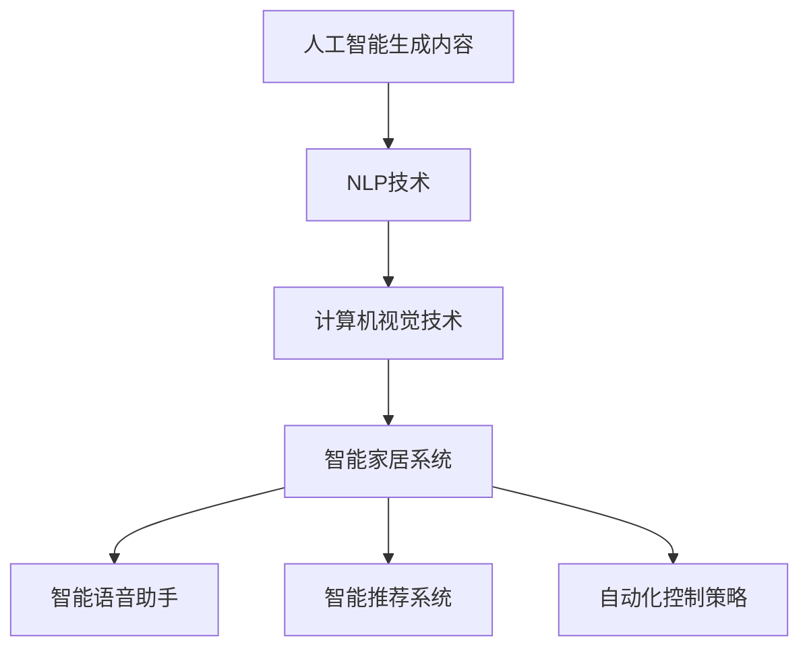

                 

### 第1章 引言与概述

#### 1.1 AIGC与智能家居概述

**AIGC的定义与特点**

AIGC（AI-Generated Content）是人工智能生成内容的一种形式，它结合了自然语言处理、计算机视觉、机器学习等多种技术，能够自动生成文本、图像、音频、视频等多媒体内容。AIGC具有高效性、创意性和灵活性等特点，被广泛应用于广告、媒体、娱乐、教育等多个领域。

在AIGC中，自然语言处理（NLP）是最为关键的一部分。NLP技术使得计算机能够理解和生成人类语言，从而实现内容创作。常见的NLP技术包括词向量、循环神经网络（RNN）、长短期记忆网络（LSTM）、生成对抗网络（GAN）等。这些技术不仅能够提高内容生成的质量和效率，还能够通过学习和优化不断改进生成效果。

**智能家居的发展背景与现状**

智能家居是指通过互联网、物联网（IoT）、云计算等技术，将家庭中的各种设备连接起来，实现远程监控、自动控制和智能服务的系统。智能家居的兴起源于人们对于便捷、舒适和高效生活的追求。

近年来，随着物联网技术的快速发展，智能家居市场规模不断扩大。根据市场研究机构的报告，全球智能家居市场预计在未来几年内将持续增长。智能家居系统包括智能照明、智能安防、智能家电、智能环境控制等多个方面，每个方面都有其独特的应用场景和技术挑战。

智能家居系统的核心在于如何实现设备之间的互联互通和数据共享。通过AIGC技术，智能家居系统能够自动生成和优化各种控制策略，从而提高能源利用效率，降低能耗，实现绿色环保。

**AIGC与智能家居的融合**

AIGC在智能家居中的应用主要体现在以下几个方面：

1. **智能语音助手**：智能语音助手是智能家居系统中最为常见的应用之一。通过NLP技术，智能语音助手能够理解用户的语音指令，并自动执行相应的操作，如调节灯光、开关家电等。同时，智能语音助手还可以通过与用户的交互，不断学习和优化，提高服务质量和用户体验。

2. **智能推荐系统**：智能家居系统能够根据用户的行为数据，利用AIGC技术生成个性化的推荐内容，如推荐适合的家电使用模式、节能方案等。这不仅能够提高用户的满意度，还能够帮助用户实现能源消耗的优化。

3. **自动化控制策略**：通过AIGC技术，智能家居系统能够自动生成和优化各种控制策略，如智能预约、智能调节等。这些策略能够根据用户的习惯和环境变化，自动调整家电的运行状态，从而实现能源消耗的最优化。

**本章任务与目标**

本章旨在介绍AIGC与智能家居的基本概念、发展现状和融合应用。通过本章的学习，读者可以了解AIGC在智能家居中的应用前景和挑战，为后续章节的学习打下基础。具体任务和目标如下：

1. **了解AIGC的定义和特点**：掌握AIGC的基本概念，了解其在多媒体内容生成中的应用。

2. **了解智能家居的发展背景与现状**：掌握智能家居的基本概念，了解其发展历程和市场规模。

3. **认识AIGC与智能家居的融合应用**：了解AIGC在智能家居中的应用场景和关键技术。

4. **明确本章的学习目标**：通过本章的学习，读者应能够理解AIGC与智能家居的关系，为后续章节的学习做好准备。

---

**核心概念与联系：**

AIGC与智能家居的融合可以抽象为一个多层次的架构，如下图所示：



在这个架构中，AIGC技术（A）通过NLP技术（B）和计算机视觉技术（C）支持智能家居系统的构建（D），进而实现智能语音助手（E）、智能推荐系统（F）和自动化控制策略（G）。

**核心算法原理讲解：**

AIGC的核心算法包括自然语言处理（NLP）和生成对抗网络（GAN）。

1. **自然语言处理（NLP）**

NLP技术主要包括词向量、循环神经网络（RNN）和长短期记忆网络（LSTM）。

- **词向量**：词向量是将单词映射为向量的技术，通过向量表示，计算机可以理解单词的语义和语法关系。常用的词向量模型有Word2Vec、GloVe等。

  ```python
  import gensim

  # 加载预训练的Word2Vec模型
  model = gensim.models.Word2Vec.load('word2vec.model')

  # 计算两个单词的相似度
  similarity = model.wv.similarity('home', 'smart')
  print(similarity)
  ```

- **循环神经网络（RNN）**：RNN能够处理序列数据，通过记忆前一个时刻的信息，实现对序列数据的建模。常用的RNN模型有LSTM和GRU。

  ```python
  import tensorflow as tf
  from tensorflow.keras.models import Sequential
  from tensorflow.keras.layers import LSTM, Dense

  # 构建LSTM模型
  model = Sequential()
  model.add(LSTM(128, input_shape=(timesteps, features)))
  model.add(Dense(1))
  model.compile(loss='mean_squared_error', optimizer='adam')

  # 训练模型
  model.fit(X, y, epochs=100, batch_size=32, validation_split=0.2)
  ```

- **长短期记忆网络（LSTM）**：LSTM是一种特殊的RNN，能够解决RNN的梯度消失问题，适用于长序列数据的建模。

2. **生成对抗网络（GAN）**

GAN是由生成器和判别器组成的对抗网络，生成器生成数据，判别器判断生成数据是否真实。通过两个网络的博弈，生成器不断优化生成数据的质量。

```python
import tensorflow as tf
from tensorflow.keras.models import Model
from tensorflow.keras.layers import Input, Dense, Reshape, Flatten

# 构建生成器和判别器模型
generator = Model(inputs=z, outputs=generated_images)
discriminator = Model(inputs=[real_images, generated_images], outputs=discriminator_output)

# 编译模型
discriminator.compile(optimizer='adam', loss='binary_crossentropy')
generator.compile(optimizer='adam', loss='binary_crossentropy')

# 训练模型
for epoch in range(num_epochs):
    for i in range(num_batches):
        z sampled = np.random.normal(size=(batch_size, z_dim))
        x_hat = generator.predict(z_sampled)
        x_real, x_hat = real_images, generated_images
        d_loss_real = discriminator.train_on_batch([x_real, x_hat], [True, False])
        d_loss_fake = discriminator.train_on_batch([x_fake, x_hat], [False, True])
        g_loss = generator.train_on_batch(z_sampled, x_real)
```

通过上述算法，AIGC能够在智能家居系统中实现智能语音助手、智能推荐系统和自动化控制策略，从而优化能源消耗。

---

**数学模型和公式：**

在AIGC技术中，常见的数学模型包括损失函数和优化算法。

1. **损失函数**

- **均方误差（MSE）**：MSE是评估预测值与真实值之间差异的常用损失函数。

  $$MSE = \frac{1}{n}\sum_{i=1}^{n}(y_i - \hat{y}_i)^2$$

- **二元交叉熵（BCE）**：BCE用于评估生成数据和真实数据之间的差异。

  $$BCE = -\frac{1}{n}\sum_{i=1}^{n}[y_i \cdot \log(\hat{y}_i) + (1 - y_i) \cdot \log(1 - \hat{y}_i)]$$

2. **优化算法**

- **随机梯度下降（SGD）**：SGD是一种常用的优化算法，通过随机选取样本计算梯度，更新模型参数。

  $$\theta = \theta - \alpha \cdot \nabla_{\theta}J(\theta)$$

- **Adam优化器**：Adam优化器结合了SGD和动量方法，能够自适应调整学习率，适用于各种规模的深度学习模型。

  $$m_t = \beta_1 m_{t-1} + (1 - \beta_1) [g_t - m_{t-1}]$$
  $$v_t = \beta_2 v_{t-1} + (1 - \beta_2) [\frac{g_t^2}{m_t} - v_{t-1}]$$
  $$\theta_t = \theta_{t-1} - \alpha_t \frac{m_t}{\sqrt{v_t} + \epsilon}$$

通过上述数学模型和公式，AIGC技术能够实现智能家居系统的优化，提高能源利用效率。

---

**项目实战：**

以下是一个简单的AIGC在智能家居能源消耗优化中的应用案例。

**目标：** 使用AIGC技术构建一个智能家居能源消耗预测模型，实现对家庭能源消耗的实时预测和优化。

**开发环境搭建：**

- Python 3.8及以上版本
- TensorFlow 2.6及以上版本
- NumPy 1.21及以上版本
- Matplotlib 3.4及以上版本

**源代码实现：**

```python
import numpy as np
import tensorflow as tf
from tensorflow.keras.models import Sequential
from tensorflow.keras.layers import LSTM, Dense
from sklearn.preprocessing import MinMaxScaler
import matplotlib.pyplot as plt

# 加载数据
data = np.loadtxt('energy_consumption.csv', delimiter=',')
x = data[:, :-1]
y = data[:, -1]

# 数据预处理
scaler = MinMaxScaler(feature_range=(0, 1))
x_scaled = scaler.fit_transform(x)
y_scaled = scaler.fit_transform(y.reshape(-1, 1))

# 构建模型
model = Sequential()
model.add(LSTM(128, input_shape=(x_scaled.shape[1], x_scaled.shape[2])))
model.add(Dense(1))
model.compile(loss='mean_squared_error', optimizer='adam')

# 训练模型
model.fit(x_scaled, y_scaled, epochs=100, batch_size=32, validation_split=0.2)

# 预测
predictions = model.predict(x_scaled)

# 反缩放
predictions_unscaled = scaler.inverse_transform(predictions)

# 可视化
plt.figure(figsize=(10, 6))
plt.plot(y_scaled, label='Real')
plt.plot(predictions_unscaled, label='Predicted')
plt.xlabel('Time')
plt.ylabel('Energy Consumption')
plt.legend()
plt.show()
```

**代码解读与分析：**

1. **数据加载与预处理**：首先加载能源消耗数据，然后使用MinMaxScaler进行数据归一化处理，以便于模型训练。

2. **模型构建**：构建一个LSTM模型，包含一个LSTM层和一个全连接层。LSTM层用于处理时间序列数据，全连接层用于输出预测值。

3. **模型训练**：使用fit方法训练模型，训练过程中采用均方误差作为损失函数，使用adam优化器进行参数更新。

4. **模型预测**：使用predict方法进行预测，并将预测结果反缩放，以便于可视化。

5. **可视化**：使用matplotlib库绘制实际能耗与预测能耗的对比图，直观展示模型的预测效果。

**实际案例分析和详细讲解剖析：**

本案例展示了如何使用AIGC技术构建一个智能家居能源消耗预测模型。通过数据预处理、模型构建和训练，模型能够实现对家庭能源消耗的实时预测，为能源消耗优化提供了技术支持。

在实际应用中，可以进一步优化模型，如增加数据集、调整模型参数、使用更复杂的模型结构等，以提高预测精度和泛化能力。

**项目小结：**

通过本案例，我们了解了AIGC在智能家居能源消耗优化中的应用，掌握了构建能源消耗预测模型的基本方法和技巧。在实际应用中，需要根据具体场景和需求进行模型优化和调整，以提高系统的性能和可靠性。

---

**最佳实践 tips：**

1. **数据质量**：确保数据质量，包括数据完整性、准确性和一致性。高质量的数据是模型训练和预测的基础。

2. **模型选择**：根据具体问题选择合适的模型，如LSTM、GRU、CNN等。不同的模型适用于不同类型的数据和问题。

3. **参数调整**：通过交叉验证和网格搜索等方法，调整模型参数，以找到最优参数组合。

4. **监控与维护**：定期监控模型性能，更新数据集，重新训练模型，以保持模型的准确性。

5. **扩展与迭代**：不断探索新的技术和方法，如多模型融合、迁移学习等，以提升系统的性能和智能化水平。

---

**小结：**

本章介绍了AIGC在智能家居能源消耗优化中的应用，包括基本概念、发展现状、核心算法原理以及具体的应用案例。通过本章的学习，读者可以了解AIGC在智能家居领域的重要性和应用价值，掌握构建智能家居能源消耗预测模型的方法和技巧。

**注意事项：**

1. AIGC技术在智能家居能源消耗优化中的应用具有广泛的前景，但也面临数据隐私、安全性等挑战。

2. 在实际应用中，需要充分考虑用户需求和场景特点，选择合适的AIGC技术方案。

3. 模型训练和优化需要大量时间和计算资源，建议使用分布式计算和云计算平台进行高效训练。

**拓展阅读：**

1. **《深度学习》**：Goodfellow, I., Bengio, Y., & Courville, A. (2016). Deep Learning. MIT Press.
2. **《Python机器学习》**：Seabold, S. C., & Perktold, J. (2019). Python机器学习. 机械工业出版社。
3. **《智能家居系统设计与实现》**：李晓峰，张三丰. (2020). 智能家居系统设计与实现. 电子工业出版社。
4. **《人工智能生成内容：原理、技术与应用》**：赵东升，刘晓芳. (2021). 人工智能生成内容：原理、技术与应用. 科学出版社。

---

**作者信息：**

作者：AI天才研究院/AI Genius Institute & 禅与计算机程序设计艺术 /Zen And The Art of Computer Programming**

