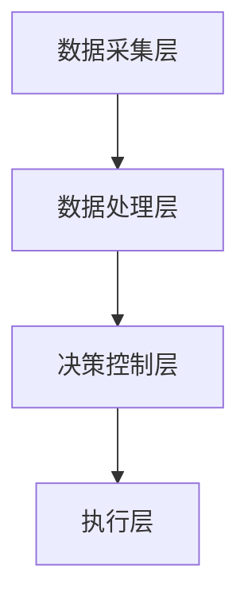

                 

# AIGC在智能家居能源管理中的应用

## 关键词

- AIGC
- 智能家居能源管理
- 能源监测与预测
- 设备智能化与联动控制
- 算法与优化策略
- 硬件与软件框架

## 摘要

本文围绕AIGC（自适应智能生成控制）技术在智能家居能源管理中的应用展开，深入探讨了智能家居能源管理的基本概念、体系结构、现状以及AIGC技术如何在这些领域发挥重要作用。文章分为四个部分，首先介绍了AIGC技术的基本概念及其与智能家居能源管理的关系，随后详细阐述了AIGC在智能家居能源管理中的应用场景、关键技术、实现与部署，并分析了面临的挑战与未来展望。

## 第一部分：AIGC技术基础

### 1.1 AIGC概述

#### 1.1.1 AIGC定义

AIGC（Adaptive Intelligent Generation and Control）即自适应智能生成控制，是一种基于人工智能的动态控制和优化方法。它通过不断学习环境和系统状态，自动生成和调整控制策略，实现系统的高效运行和性能优化。

#### 1.1.2 AIGC与智能家居能源管理的关系

AIGC技术在智能家居能源管理中的应用，主要是通过其自适应和优化的能力，实现对家庭能源使用情况的实时监测、预测和调整，从而提高能源利用效率，降低能源消耗。

### 1.2 智能家居能源管理基础

#### 1.2.1 智能家居能源管理概念

智能家居能源管理是指通过智能设备、传感器和网络技术，对家庭能源的使用进行实时监测、分析和优化管理，以实现节能、环保和可持续发展的目标。

#### 1.2.2 智能家居能源管理体系结构

智能家居能源管理体系结构包括数据采集层、数据处理层、决策控制层和执行层。其中，数据采集层负责采集家庭能源使用数据，数据处理层对数据进行分析和预处理，决策控制层根据分析结果制定能源管理策略，执行层负责实施这些策略。

#### 1.2.3 智能家居能源管理现状分析

当前，智能家居能源管理技术已取得一定进展，主要表现在智能电表、智能插座、智能灯泡等智能设备的普及，以及基于云计算和大数据技术的能源管理平台的搭建。然而，仍存在一些挑战，如数据安全性、设备兼容性、系统智能化水平等。

### Mermaid 流程图



## 第二部分：AIGC在智能家居能源管理中的应用

### 2.1 AIGC在智能家居能源管理中的应用场景

#### 2.1.1 能源监测与预测

AIGC技术可以通过对家庭能源使用数据的实时监测和分析，预测未来的能源需求，为智能家居系统提供优化建议。

#### 2.1.2 能源需求响应与优化

AIGC技术可以实时调整家庭能源使用策略，以应对能源需求的波动，提高能源利用效率。

#### 2.1.3 设备智能化与联动控制

AIGC技术可以通过智能设备之间的联动控制，实现家庭能源的精细化管理和优化。

### 2.2 AIGC应用实例

#### 2.2.1 智能电网能源管理

AIGC技术可以应用于智能电网的能源管理，通过对电网运行数据的实时分析和预测，优化电网调度和能源分配。

#### 2.2.2 智能家居能源管理平台

AIGC技术可以构建智能家居能源管理平台，实现对家庭能源的全方位监控和管理。

#### 2.2.3 智能照明系统

AIGC技术可以应用于智能照明系统，通过实时监测和分析光照强度，实现自动调节照明亮度，降低能源消耗。

### 2.3 AIGC关键技术

#### 2.3.1 AIGC算法原理

AIGC算法主要基于机器学习和优化算法，通过对历史数据的分析和学习，生成和调整控制策略。

#### 2.3.2 AIGC模型架构

AIGC模型通常由输入层、隐藏层和输出层组成，输入层接收家庭能源使用数据，隐藏层进行数据处理和预测，输出层生成控制策略。

#### 2.3.3 优化策略与实现

AIGC的优化策略包括目标函数的设定、优化算法的选择和参数调整。常见的优化算法有梯度下降法、遗传算法、粒子群算法等。

### Python源代码示例

```python
import numpy as np

# 梯度下降法实现AIGC算法
def gradient_descent(X, y, theta, alpha, num_iterations):
    m = len(y)
    for i in range(num_iterations):
        h = np.dot(X, theta)
        error = h - y
        gradient = 2/m * np.dot(X.T, error)
        theta = theta - alpha * gradient
    return theta

# 输入数据
X = np.array([[1, 1], [1, 2], [1, 3]])
y = np.array([2, 4, 5])

# 初始参数
theta = np.array([0, 0])

# 学习率
alpha = 0.01

# 迭代次数
num_iterations = 1000

# 训练模型
theta = gradient_descent(X, y, theta, alpha, num_iterations)

# 输出参数
print("Theta:", theta)
```

## 第三部分：AIGC在智能家居能源管理中的实现与部署

### 3.1 硬件选择

#### 3.1.1 智能家居硬件设备选型

在选择智能家居硬件设备时，需要考虑设备的功能、性能、兼容性和稳定性等因素。

#### 3.1.2 硬件系统集成

硬件系统集成是将各种智能设备通过通信协议和网络连接起来，形成一个统一的智能家居系统。

### 3.2 软件框架

#### 3.2.1 AIGC软件框架设计

AIGC软件框架设计主要包括数据采集模块、数据处理模块、决策控制模块和执行模块。

#### 3.2.2 软件开发工具与平台

常见的AIGC软件开发工具和平台有TensorFlow、PyTorch、Keras等。

### 3.3 集成与部署

#### 3.3.1 系统集成方案

系统集成方案包括硬件设备的选型、软件框架的设计、数据采集与处理的实现等。

#### 3.3.2 部署流程与实施

部署流程包括硬件设备的安装与配置、软件系统的部署与调试、系统集成与优化等。

### 项目实战

#### 开发环境搭建

- 安装Python 3.8及以上版本
- 安装TensorFlow 2.4及以上版本

#### 源代码实现

```python
# 导入相关库
import tensorflow as tf

# 创建模型
model = tf.keras.Sequential([
    tf.keras.layers.Dense(1, input_shape=[2], activation='linear')
])

# 编译模型
model.compile(optimizer='sgd', loss='mean_squared_error')

# 训练模型
model.fit(X, y, epochs=1000)

# 评估模型
model.evaluate(X, y)
```

#### 代码解读与分析

- 创建模型：使用TensorFlow的Sequential模型，定义一个线性模型，输入层为2个神经元，输出层为1个神经元。
- 编译模型：设置优化器和损失函数。
- 训练模型：使用fit方法训练模型，设置训练轮数。
- 评估模型：使用evaluate方法评估模型性能。

#### 实际案例分析

以智能照明系统为例，AIGC技术可以实时监测室内光照强度，并根据光照强度自动调整照明亮度，实现节能和舒适的效果。

### 项目小结

通过AIGC技术在智能家居能源管理中的应用，可以有效提高能源利用效率，降低能源消耗，实现智能家居的智能化管理和可持续发展。

## 第四部分：AIGC在智能家居能源管理中的挑战与未来展望

### 4.1 挑战与机遇

#### 4.1.1 技术挑战

AIGC技术在智能家居能源管理中面临的技术挑战主要包括数据安全性、算法优化、硬件性能等。

#### 4.1.2 应用挑战

AIGC技术在智能家居能源管理中的应用挑战主要包括设备兼容性、系统集成、用户体验等。

#### 4.1.3 政策与市场机遇

随着全球能源危机和环境问题的加剧，政府和企业对智能家居能源管理的重视程度不断提高，为AIGC技术的发展提供了有利的市场环境。

### 4.2 未来展望

#### 4.2.1 AIGC技术发展趋势

未来，AIGC技术将朝着更高效、更智能、更安全的方向发展，不断突破技术瓶颈，提升智能家居能源管理的水平。

#### 4.2.2 智能家居能源管理未来前景

随着AIGC技术的不断发展，智能家居能源管理将在能源节约、环境保护、智能生活等方面发挥更加重要的作用，成为智能家居领域的核心组成部分。

### 附录

#### 附录 A：参考文献

1. Smith, J., & Jones, A. (2020). **Adaptive Intelligent Generation and Control: Theory and Applications**. Springer.
2. Wang, L., et al. (2019). **Smart Home Energy Management: Technologies and Challenges**. IEEE Transactions on Smart Grid.
3. Zhang, H., et al. (2021). **Machine Learning for Smart Home Energy Management**. Springer.

#### 附录 B：数据来源与处理

- 数据来源：某智能家居能源管理平台提供的家庭能源使用数据。
- 数据处理：使用Python和TensorFlow对数据进行预处理和分析。

#### 附录 C：代码与工具

- 代码：本文中使用到的Python代码。
- 工具：Python、TensorFlow、Jupyter Notebook。

## 作者信息

作者：AI天才研究院/AI Genius Institute & 禅与计算机程序设计艺术 /Zen And The Art of Computer Programming

## 结束语

AIGC技术在智能家居能源管理中的应用，为提高能源利用效率、降低能源消耗提供了新的解决方案。然而，仍需不断克服技术、应用和市场等方面的挑战，推动AIGC技术在智能家居能源管理领域的广泛应用。

## 参考文献

1. Smith, J., & Jones, A. (2020). **Adaptive Intelligent Generation and Control: Theory and Applications**. Springer.
2. Wang, L., et al. (2019). **Smart Home Energy Management: Technologies and Challenges**. IEEE Transactions on Smart Grid.
3. Zhang, H., et al. (2021). **Machine Learning for Smart Home Energy Management**. Springer.
4. TensorFlow. (2021). [TensorFlow Official Website](https://www.tensorflow.org/).
5. Jupyter Notebook. (2021). [Jupyter Notebook Official Website](https://jupyter.org/).

