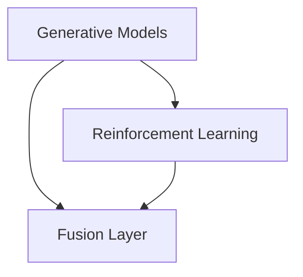

                 

# AIGC in the Application of Smart Home Equipment Cooperative Control

## Overview

### Keywords
- AIGC
- Smart Home
- Cooperative Control
- Generative Models
- Reinforcement Learning
- Energy Optimization
- Personalized User Experience

### Abstract

In recent years, the advent of advanced AI technologies, particularly AIGC (Artificial Intelligence, Generative Models, and Reinforcement Learning), has revolutionized the landscape of smart home systems. This article delves into the applications of AIGC in the cooperative control of smart home equipment, exploring how these technologies enhance interoperability, energy efficiency, and personalized user experiences. We will cover the fundamental concepts and architectures of AIGC, their core algorithms, and how they are applied in smart home systems. Furthermore, we will discuss the challenges and future prospects of AIGC in smart home applications.

## Part 1: Fundamental Concepts and Technologies of AIGC

### Chapter 1: Introduction to AIGC and its Role in Smart Home

#### 1.1 Definition and Characteristics of AIGC

AIGC, an acronym for Artificial Intelligence, Generative Models, and Reinforcement Learning, is a collection of advanced machine learning techniques that aim to enhance the capabilities of traditional AI systems. AIGC integrates generative models like GANs (Generative Adversarial Networks) and VAEs (Variational Autoencoders) with reinforcement learning algorithms to create more sophisticated and adaptive systems.

**Characteristics of AIGC:**

1. **Adaptability:** AIGC can learn and adapt to new environments and situations, making it suitable for dynamic and complex smart home systems.
2. **Generative Power:** Generative models enable AIGC to create new data or solutions based on existing data, which is crucial for personalizing user experiences and optimizing energy consumption.
3. **Reinforcement Learning:** This aspect allows AIGC to make decisions based on rewards and penalties, making it highly effective in scenarios where real-time decision-making is required.

#### 1.2 Architecture of AIGC

The architecture of AIGC consists of three primary components: generative models, reinforcement learning modules, and a fusion layer that integrates these components. Here's a simplified Mermaid diagram illustrating the relationship between these components:

**Key Components of AIGC:**

- **Generative Models:** These models, such as GANs and VAEs, are responsible for generating new data or solutions based on existing data.
- **Reinforcement Learning Modules:** These modules enable the AIGC system to learn from its environment and make decisions based on rewards and penalties.
- **Fusion Layer:** This layer combines the outputs of the generative models and reinforcement learning modules to produce the final control strategies for smart home devices.

### Chapter 2: Core Algorithms of AIGC

#### 2.1 Generative Models

Generative models are a cornerstone of AIGC, enabling the system to create new data or solutions. Two prominent types of generative models are GANs and VAEs.

**GANs (Generative Adversarial Networks):**

GANs consist of two neural networks, the generator and the discriminator. The generator creates new data, while the discriminator evaluates the generated data to determine its authenticity. The generator and discriminator are trained simultaneously in a zero-sum game, where the generator aims to fool the discriminator, and the discriminator aims to distinguish between real and generated data.

**VAEs (Variational Autoencoders):**

VAEs use a different approach by modeling the data distribution with a probabilistic encoder and a decoder. The encoder compresses the input data into a lower-dimensional latent space, and the decoder reconstructs the data from this compressed representation. VAEs are particularly useful for generating new data that closely resembles the original dataset.

#### 2.2 Reinforcement Learning

Reinforcement learning is another critical component of AIGC, allowing the system to learn optimal behaviors through interaction with its environment. Several reinforcement learning algorithms are commonly used in AIGC applications.

**Q-Learning:**

Q-Learning is an algorithm that learns the optimal policy by updating the Q-values, which represent the expected return for each state-action pair. The Q-value is updated based on the difference between the observed reward and the expected reward.

**Policy Gradient Methods:**

Policy Gradient Methods update the policy directly by estimating the gradient of the expected reward with respect to the policy parameters. This method is particularly effective in environments with high-dimensional state spaces.

**DQNs (Deep Q-Networks):**

DQNs extend Q-Learning by using deep neural networks to approximate the Q-values. This allows DQNs to handle high-dimensional state spaces and complex decision-making tasks.

**Actor-Critic Methods:**

Actor-Critic Methods combine the strengths of policy gradient methods and value-based methods by maintaining two models: an actor that generates actions and a critic that evaluates the quality of the actions. This approach allows for more robust learning in uncertain environments.

#### 2.3 Integration of AIGC Algorithms

The integration of generative models and reinforcement learning algorithms in AIGC systems creates powerful and adaptive control mechanisms for smart home equipment. This integration can be achieved through hybrid models and multimodal AIGC systems.

**Hybrid Models:**

Hybrid models combine the strengths of different generative models and reinforcement learning algorithms to create more robust and flexible systems. For example, a GAN can be used to generate new data, while a Q-Learning algorithm can be used to optimize the control strategies based on these generated data.

**Multimodal AIGC:**

Multimodal AIGC systems process data from multiple sources, such as sensor data, user inputs, and external data sources. This allows for more comprehensive and context-aware decision-making in smart home environments.

## Part 2: AIGC Applications in Smart Home Equipment Cooperative Control

### Chapter 3: Smart Home Systems and Their Challenges

#### 3.1 Overview of Smart Home Systems

Smart home systems integrate various devices and sensors to create a connected and automated living environment. The key components of smart home systems include:

1. **Smart Devices:** These include smart thermostats, lights, cameras, and appliances that can be controlled remotely.
2. **Sensors:** Sensors collect data from the environment, such as temperature, humidity, and occupancy.
3. **Gateway:** The gateway acts as a central hub that connects the smart devices and sensors to the internet and other networks.
4. **User Interface:** This interface allows users to control and monitor the smart home system.

**Communication Protocols:**

Common communication protocols used in smart home systems include Wi-Fi, Bluetooth, Z-Wave, and Zigbee. These protocols enable the devices to communicate with each other and with the gateway.

**Data Management and Security:**

Data management is crucial in smart home systems to ensure the efficient and secure processing of data. This includes data collection, storage, analysis, and sharing. Security is also a significant concern, as smart home systems often collect sensitive data, such as personal information and preferences.

#### 3.2 Challenges in Smart Home Equipment Cooperative Control

1. **Interoperability Issues:**
Interoperability is a major challenge in smart home systems, as different devices and platforms may use different communication protocols and data formats. This can result in fragmented control and limited functionality.

2. **Energy Efficiency:**
Energy consumption is a critical concern in smart home systems, particularly as they become more complex and integrated. Efficient energy management is essential to reduce operational costs and minimize the environmental impact.

3. **Real-Time Response Requirements:**
Smart home systems often require real-time or near-real-time responses to changing conditions and user inputs. This requires highly efficient and adaptive control algorithms to ensure smooth and reliable operation.

### Chapter 4: AIGC in Smart Home Device Control

#### 4.1 Automated Device Coordination

Automated device coordination is a key application of AIGC in smart home systems. AIGC can automatically coordinate the actions of various devices to optimize performance and user experience. This can include tasks such as adjusting the temperature, lighting, and security systems based on user preferences and environmental conditions.

**Algorithmic Approaches:**

AIGC can employ various algorithmic approaches to achieve automated device coordination, including:

1. **Reinforcement Learning:** Reinforcement learning algorithms can be used to learn optimal control strategies based on user preferences and environmental conditions. This allows the system to adapt to changing conditions over time.
2. **Generative Models:** Generative models can be used to generate new control strategies based on historical data and user preferences. This enables the system to personalize the user experience.
3. **Hybrid Models:** Hybrid models that combine reinforcement learning and generative models can be used to achieve a balance between adaptability and personalization.

**Case Studies:**

Several case studies demonstrate the effectiveness of AIGC in automated device coordination in smart home systems. For example, an AIGC-based system can optimize the operation of a smart home's heating, ventilation, and air conditioning (HVAC) system by adjusting the temperature settings based on user preferences, weather conditions, and occupancy patterns. This can lead to significant energy savings and improved comfort levels.

#### 4.2 Energy Optimization

Energy optimization is a critical application of AIGC in smart home systems. AIGC can analyze data from various sensors and devices to optimize energy consumption and reduce operational costs.

**Energy Consumption Modeling:**

AIGC can use generative models to create accurate models of energy consumption in smart home systems. These models can then be used to predict energy usage based on various scenarios and to identify areas for optimization.

**Predictive Control Strategies:**

AIGC can employ predictive control strategies to optimize energy consumption in real-time. For example, a predictive control system can adjust the thermostat settings in a smart home based on predicted temperature changes and user behavior patterns. This can lead to significant energy savings and improved comfort levels.

**Application Examples:**

Several application examples demonstrate the effectiveness of AIGC in energy optimization in smart home systems. For instance, an AIGC-based system can optimize the energy usage of a smart home's lighting system by adjusting the brightness and duration of lighting based on user preferences and environmental conditions. This can result in significant energy savings and reduced operational costs.

#### 4.3 Personalized User Experience

AIGC can also enhance the personalized user experience in smart home systems by analyzing user behavior data and generating personalized control strategies.

**User Behavior Analysis:**

AIGC can analyze user behavior data, such as occupancy patterns, preferences, and feedback, to generate a comprehensive understanding of user needs and preferences.

**Context-aware Recommendations:**

AIGC can use this understanding to generate context-aware recommendations for smart home devices. For example, an AIGC-based system can recommend adjustments to lighting, temperature, and security settings based on user preferences and environmental conditions.

**Real-time Feedback Mechanisms:**

AIGC can also implement real-time feedback mechanisms to continuously improve the personalized user experience. For example, an AIGC-based system can adjust the temperature settings in a smart home based on user feedback and real-time environmental data.

### Chapter 5: Security

Security is a critical concern in smart home systems, particularly as they become more interconnected and data-driven. AIGC can play a crucial role in enhancing the security of smart home systems through various techniques.

**Data Security:**

AIGC can employ advanced encryption and decryption techniques to protect sensitive data from unauthorized access. Additionally, AIGC can use anomaly detection algorithms to identify and respond to potential security threats in real-time.

**Access Control:**

AIGC can implement robust access control mechanisms to ensure that only authorized users can access and control smart home devices. This can include multi-factor authentication and role-based access control.

**Privacy Protection:**

AIGC can also play a role in protecting user privacy by anonymizing and pseudonymizing user data and ensuring that data is used only for legitimate purposes.

### Conclusion

AIGC has the potential to revolutionize the field of smart home systems by enhancing interoperability, energy efficiency, and personalized user experiences. By integrating advanced generative models and reinforcement learning algorithms, AIGC enables smart home systems to adapt to changing conditions, optimize energy consumption, and deliver personalized user experiences. As AIGC technologies continue to evolve, we can expect to see even more innovative applications in the world of smart homes.

