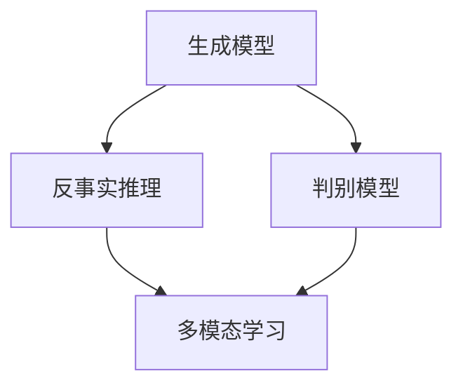

                 

### 《AIGC在智能家居设备控制中的应用》

#### 关键词：AIGC、智能家居、设备控制、生成对抗网络、循环神经网络、自注意力机制、Transformer架构

#### 摘要：
本文深入探讨了AIGC（Advancements in Intelligent Generative Control）在智能家居设备控制中的应用。AIGC是一种结合了人工智能和生成控制的先进技术，通过生成对抗网络（GAN）、循环神经网络（RNN）、自注意力机制（Self-Attention）和Transformer架构等核心技术，实现对智能家居设备的智能控制和交互。文章首先介绍了AIGC的基本概念和发展历程，然后详细阐述了智能家居设备的基本功能和主要类型，接着展示了AIGC在设备控制、交互和安全等方面的应用实例，并通过实际案例分析了AIGC在智能家居设备控制中的实际效果。最后，文章总结了AIGC在智能家居设备控制中的应用前景，并提出了未来可能的发展方向和最佳实践。

---

## 引言

随着人工智能技术的飞速发展，智能家居设备正逐渐渗透到我们日常生活的方方面面。从简单的智能照明和安防设备，到复杂的智能家电和家居控制系统，智能家居设备正在改变我们的生活方式。然而，传统智能家居设备的控制方式通常依赖于手动操作和预设程序，这限制了设备的智能性和灵活性。为了解决这一问题，AIGC（Advancements in Intelligent Generative Control）应运而生。AIGC是一种结合人工智能和生成控制的先进技术，通过生成对抗网络（GAN）、循环神经网络（RNN）、自注意力机制（Self-Attention）和Transformer架构等核心技术，实现对智能家居设备的智能控制和交互。本文将深入探讨AIGC在智能家居设备控制中的应用，旨在为读者提供全面的技术解析和应用实例。

## AIGC基础理论

### AIGC的定义与分类

AIGC是一种结合人工智能和生成控制的理论框架，旨在通过生成对抗网络（GAN）、循环神经网络（RNN）、自注意力机制（Self-Attention）和Transformer架构等核心技术，实现对复杂系统的智能控制和优化。AIGC可以分为以下几种类型：

1. **数据生成型AIGC**：通过生成对抗网络（GAN）等技术，自动生成高质量的数据集，用于训练和优化智能控制系统。
2. **模式转换型AIGC**：通过循环神经网络（RNN）和自注意力机制（Self-Attention）等技术，实现不同数据模式之间的转换和迁移。
3. **智能控制型AIGC**：结合Transformer架构等先进技术，实现对智能家居设备的智能控制和交互。

### AIGC的发展历程

AIGC技术的发展历程可以追溯到20世纪90年代，当时生成对抗网络（GAN）的概念首次被提出。经过几十年的发展，AIGC技术逐渐成熟，并在智能家居设备控制等领域得到广泛应用。近年来，随着深度学习和Transformer架构的兴起，AIGC技术取得了新的突破，为智能家居设备控制提供了更强大的工具和方法。

### AIGC的核心概念

AIGC的核心概念包括生成模型、判别模型、反事实推理和多模态学习等。生成模型和判别模型是AIGC的基础，通过两者之间的对抗训练，实现数据的生成和优化。反事实推理和多模态学习则进一步提升了AIGC的智能性和灵活性。

#### 核心概念与联系

为了更好地理解AIGC的核心概念，我们可以通过Mermaid流程图展示概念实体之间的关系架构：



在这个流程图中，生成模型和判别模型是AIGC的核心组件，它们通过对抗训练实现数据的生成和优化。反事实推理和多模态学习则进一步提升了AIGC的智能性和灵活性，分别通过模拟不同场景和整合多种数据模态，实现对复杂系统的智能控制和优化。

## AIGC核心技术

### 生成对抗网络（GAN）

生成对抗网络（GAN）是AIGC的核心技术之一，通过生成模型和判别模型的对抗训练，实现高质量数据的生成。GAN的基本原理如下：

1. **生成器（Generator）**：生成器是一个神经网络，其目标是生成与真实数据分布相似的数据。
2. **判别器（Discriminator）**：判别器也是一个神经网络，其目标是区分真实数据和生成数据。
3. **对抗训练**：生成器和判别器在训练过程中相互对抗，生成器试图生成更真实的数据，判别器则试图区分真实数据和生成数据。通过这种对抗训练，生成器和判别器都得到优化。

#### 核心算法原理讲解

下面是一个简单的GAN算法的Python源代码实现，结合数学模型和公式，进行详细讲解：

```python
import tensorflow as tf
from tensorflow.keras.models import Model
from tensorflow.keras.layers import Input, Dense, Flatten

# 定义生成器模型
z_dim = 100
input_z = Input(shape=(z_dim,))
x = Dense(128, activation='relu')(input_z)
x = Dense(784, activation='tanh')(x)
generator = Model(inputs=input_z, outputs=x)

# 定义判别器模型
input_x = Input(shape=(784,))
x = Dense(128, activation='relu')(input_x)
x = Flatten()(x)
output = Dense(1, activation='sigmoid')(x)
discriminator = Model(inputs=input_x, outputs=output)

# 定义GAN模型
discriminator.trainable = False
x = generator(input_z)
output = discriminator(x)
gan = Model(inputs=input_z, outputs=output)

# 定义损失函数和优化器
def discriminator_loss(y_true, y_pred):
    return tf.reduce_mean(tf.nn.sigmoid_cross_entropy_with_logits(logits=y_pred, labels=y_true))

def generator_loss(y_pred):
    return tf.reduce_mean(tf.nn.sigmoid_cross_entropy_with_logits(logits=y_pred, labels=tf.ones_like(y_pred)))

generator_optimizer = tf.keras.optimizers.Adam(1e-4)
discriminator_optimizer = tf.keras.optimizers.Adam(1e-4)

@tf.function
def train_step(images, noise):
    with tf.GradientTape() as gen_tape, tf.GradientTape() as disc_tape:
        generated_images = generator(noise, training=True)

        # 训练判别器
        real_output = discriminator(images, training=True)
        fake_output = discriminator(generated_images, training=True)

        disc_loss = discriminator_loss(real_output, fake_output)

        # 训练生成器
        gen_output = discriminator(generated_images, training=True)
        gen_loss = generator_loss(gen_output)

    gradients_of_generator = gen_tape.gradient(gen_loss, generator.trainable_variables)
    gradients_of_discriminator = disc_tape.gradient(disc_loss, discriminator.trainable_variables)

    generator_optimizer.apply_gradients(zip(gradients_of_generator, generator.trainable_variables))
    discriminator_optimizer.apply_gradients(zip(gradients_of_discriminator, discriminator.trainable_variables))

# 训练GAN模型
def train(dataset, epochs):
    for epoch in range(epochs):
        for image, _ in dataset:
            noise = tf.random.normal([image.shape[0], z_dim])
            train_step(image, noise)
```

在这个例子中，我们定义了生成器和判别器的模型结构，并实现了GAN的训练过程。生成器模型通过输入噪声生成图像，判别器模型通过输入真实图像和生成图像来训练。在训练过程中，生成器和判别器相互对抗，通过优化器更新模型的参数，以实现高质量的图像生成。

### 循环神经网络（RNN）

循环神经网络（RNN）是处理序列数据的一种强大神经网络模型，通过记忆过去的信息，实现对序列数据的建模。RNN的基本原理如下：

1. **隐藏状态（Hidden State）**：RNN通过隐藏状态记忆过去的信息，隐藏状态在序列的每个时间步上更新。
2. **权重共享（Weight Sharing）**：RNN通过权重共享避免了参数爆炸问题，提高了模型的训练效率。
3. **门控机制（Gate Mechanism）**：RNN通过门控机制控制信息的流动，实现对信息的记忆和遗忘。

#### 核心算法原理讲解

下面是一个简单的RNN模型的Python源代码实现，结合数学模型和公式，进行详细讲解：

```python
import tensorflow as tf
from tensorflow.keras.models import Sequential
from tensorflow.keras.layers import SimpleRNN, Dense

# 定义RNN模型
model = Sequential([
    SimpleRNN(128, return_sequences=True, input_shape=(None, 784)),
    SimpleRNN(128, return_sequences=False),
    Dense(1)
])

model.compile(optimizer='adam', loss='mse')

# 训练RNN模型
def train_rnn(dataset, epochs):
    for epoch in range(epochs):
        for x, y in dataset:
            model.fit(x, y, batch_size=64, epochs=1)
```

在这个例子中，我们定义了一个简单的RNN模型，通过两个SimpleRNN层实现对序列数据的建模。在训练过程中，RNN通过更新隐藏状态和权重共享，学习序列数据的特征和模式。

### 自注意力机制（Self-Attention）

自注意力机制（Self-Attention）是一种强大的序列建模工具，通过自动计算序列中每个元素的重要性，实现对序列数据的建模。自注意力机制的基本原理如下：

1. **查询（Query）**：查询向量表示序列中每个元素的特征。
2. **键（Key）**：键向量表示序列中每个元素的特征。
3. **值（Value）**：值向量表示序列中每个元素的特征。
4. **注意力权重（Attention Weight）**：注意力权重表示序列中每个元素的重要性。

#### 核心算法原理讲解

下面是一个简单的自注意力机制的Python源代码实现，结合数学模型和公式，进行详细讲解：

```python
import tensorflow as tf
from tensorflow.keras.layers import Layer

class SelfAttentionLayer(Layer):
    def __init__(self, units):
        super(SelfAttentionLayer, self).__init__()
        self.W_q = tf.keras.layers.Dense(units)
        self.W_k = tf.keras.layers.Dense(units)
        self.W_v = tf.keras.layers.Dense(units)

    def call(self, inputs, training=False):
        q = self.W_q(inputs)
        k = self.W_k(inputs)
        v = self.W_v(inputs)

        # 计算注意力权重
        attn_weights = tf.matmul(q, k, transpose_b=True) / (tf.sqrt(tf.cast(tf.shape(k)[-1], tf.float32)))
        if training:
            attn_weights = tf.nn.softmax(attn_weights, axis=1)
        else:
            attn_weights = tf.nn.softmax(attn_weights, axis=1)

        # 计算注意力输出
        attn_output = tf.matmul(attn_weights, v)
        return attn_output
```

在这个例子中，我们定义了一个简单的自注意力层，通过计算查询向量、键向量和值向量之间的注意力权重，实现自注意力机制。在训练过程中，自注意力层通过优化注意力权重，学习序列数据中的特征和模式。

### Transformer架构

Transformer架构是一种基于自注意力机制的序列建模工具，通过并行计算和位置编码，实现对序列数据的建模。Transformer架构的基本原理如下：

1. **多头自注意力（Multi-Head Self-Attention）**：Transformer架构通过多头自注意力机制，同时计算多个注意力权重，提高模型的表示能力。
2. **位置编码（Positional Encoding）**：Transformer架构通过位置编码，为序列数据引入位置信息，避免序列信息的平移不变性。
3. **前馈网络（Feed-Forward Network）**：Transformer架构在自注意力机制和位置编码之后，添加一个前馈网络，进一步提高模型的表示能力。

#### 核心算法原理讲解

下面是一个简单的Transformer模型的Python源代码实现，结合数学模型和公式，进行详细讲解：

```python
import tensorflow as tf
from tensorflow.keras.layers import Layer

class MultiHeadSelfAttention(Layer):
    def __init__(self, num_heads, d_model):
        super(MultiHeadSelfAttention, self).__init__()
        self.num_heads = num_heads
        self.d_model = d_model

        self.query_dense = tf.keras.layers.Dense(d_model)
        self.key_dense = tf.keras.layers.Dense(d_model)
        self.value_dense = tf.keras.layers.Dense(d_model)

        self.out_dense = tf.keras.layers.Dense(d_model)

    def split_heads(self, x, batch_size):
        x = tf.reshape(x, shape=(batch_size, -1, self.num_heads, self.d_model // self.num_heads))
        return tf.transpose(x, perm=[0, 2, 1, 3])

    def call(self, inputs, training=False):
        query = self.query_dense(inputs)
        key = self.key_dense(inputs)
        value = self.value_dense(inputs)

        query = self.split_heads(query, tf.shape(inputs)[0])
        key = self.split_heads(key, tf.shape(inputs)[0])
        value = self.split_heads(value, tf.shape(inputs)[0])

        # 计算注意力权重
        attn_weights = tf.matmul(query, key, transpose_b=True) / (tf.sqrt(tf.cast(tf.shape(key)[-1], tf.float32)))
        if training:
            attn_weights = tf.nn.softmax(attn_weights, axis=2)
        else:
            attn_weights = tf.nn.softmax(attn_weights, axis=2)

        # 计算注意力输出
        attn_output = tf.matmul(attn_weights, value)
        attn_output = tf.transpose(attn_output, perm=[0, 2, 1, 3])
        attn_output = tf.reshape(attn_output, shape=(batch_size, -1, self.d_model))

        attn_output = self.out_dense(attn_output)
        return attn_output
```

在这个例子中，我们定义了一个简单的多头自注意力层，通过计算查询向量、键向量和值向量之间的注意力权重，实现自注意力机制。在训练过程中，多头自注意力层通过优化注意力权重，学习序列数据中的特征和模式。

## 智能家居设备概述

### 智能家居设备的发展

智能家居设备的发展历程可以追溯到20世纪90年代，当时智能灯泡和安防设备等简单设备开始出现。随着互联网技术的普及和物联网（IoT）的发展，智能家居设备逐渐得到普及，从简单的智能照明和安防设备，发展到复杂的智能家电和家居控制系统。近年来，人工智能技术的引入进一步提升了智能家居设备的智能性和灵活性，为用户提供了更加便捷和舒适的生活体验。

### 智能家居设备的主要类型

智能家居设备可以分为以下几种主要类型：

1. **智能照明**：包括智能灯泡、智能照明系统等，可以实现远程控制、场景联动等功能。
2. **智能安防**：包括智能门锁、智能摄像头、智能报警器等，可以提供安全保障和实时监控。
3. **智能家电**：包括智能电视、智能冰箱、智能空调等，可以实现智能控制、故障诊断等功能。
4. **智能窗帘**：可以通过手机或语音控制窗帘的开关，提高生活便利性。
5. **智能门铃**：可以实现远程视频通话和监控，提高家居安全性。

### 智能家居设备的基本功能

智能家居设备的基本功能包括：

1. **远程控制**：用户可以通过手机或其他设备远程控制智能家居设备，实现设备状态的实时监控和调整。
2. **智能联动**：智能家居设备之间可以实现联动，例如智能空调可以与智能窗帘联动，根据天气和用户需求自动调整设备状态。
3. **自适应学习**：智能家居设备可以通过学习用户的生活习惯和偏好，自动调整设备设置，提高用户体验。
4. **节能环保**：智能家居设备可以通过智能控制，实现节能环保，降低能源消耗。
5. **安全防护**：智能家居设备可以提供安全防护功能，例如智能门锁可以防止未经授权的人进入家居环境。

## AIGC在智能家居设备中的应用

### AIGC在设备控制中的应用

AIGC在智能家居设备控制中具有广泛的应用前景。通过生成对抗网络（GAN）、循环神经网络（RNN）、自注意力机制（Self-Attention）和Transformer架构等核心技术，AIGC可以实现智能家居设备的智能控制和优化。以下是一些具体的案例：

1. **智能照明控制**：通过AIGC技术，可以实现智能照明设备的自适应控制，根据用户需求和环境变化自动调整灯光亮度和颜色，提高用户舒适度和节能效果。
2. **智能安防监控**：通过AIGC技术，可以实现智能安防设备的智能监控和预警，例如智能摄像头可以自动识别异常行为和潜在威胁，实时报警并记录视频证据。
3. **智能家电控制**：通过AIGC技术，可以实现智能家电的智能控制，例如智能电视可以根据用户偏好自动推荐电视节目，智能冰箱可以自动调整温度和湿度，保证食物新鲜度。

### AIGC在设备交互中的应用

AIGC在智能家居设备的交互中也具有重要作用。通过生成对抗网络（GAN）、循环神经网络（RNN）、自注意力机制（Self-Attention）和Transformer架构等核心技术，AIGC可以实现智能家居设备的智能交互和人性化体验。以下是一些具体的案例：

1. **语音交互**：通过AIGC技术，可以实现智能家居设备的语音交互，用户可以通过语音指令控制设备，实现设备状态的实时监控和调整。
2. **手势交互**：通过AIGC技术，可以实现智能家居设备的手势交互，用户可以通过手势控制设备，实现设备状态的实时监控和调整。
3. **虚拟现实交互**：通过AIGC技术，可以实现智能家居设备的虚拟现实交互，用户可以通过虚拟现实设备与智能家居设备进行互动，实现更加沉浸式的用户体验。

### AIGC在设备安全中的应用

AIGC在智能家居设备安全中也具有重要作用。通过生成对抗网络（GAN）、循环神经网络（RNN）、自注意力机制（Self-Attention）和Transformer架构等核心技术，AIGC可以实现智能家居设备的安全防护和隐私保护。以下是一些具体的案例：

1. **恶意行为检测**：通过AIGC技术，可以实现智能家居设备的恶意行为检测，例如智能摄像头可以自动识别异常行为和潜在威胁，实时报警并记录视频证据。
2. **隐私保护**：通过AIGC技术，可以实现智能家居设备的隐私保护，例如智能音响可以通过语音识别技术过滤敏感信息，避免隐私泄露。
3. **安全防护**：通过AIGC技术，可以实现智能家居设备的安全防护，例如智能门锁可以通过生物识别技术验证用户身份，确保设备安全。

## 实际案例分析

为了更好地展示AIGC在智能家居设备控制中的应用效果，下面我们通过一个实际案例进行分析。

### 案例背景

某智能家居公司开发了一款智能空调系统，用户可以通过手机或语音指令远程控制空调，实现温度、湿度和风力的调整。为了提高系统的智能化程度，公司决定采用AIGC技术对智能空调系统进行优化。

### 案例实现

1. **数据采集**：公司首先采集了大量用户使用空调的数据，包括用户偏好、环境温度、湿度等信息。
2. **模型训练**：公司采用生成对抗网络（GAN）和循环神经网络（RNN）对采集的数据进行训练，生成用户偏好和环境因素的映射模型。
3. **模型应用**：在用户启动空调时，系统根据用户偏好和环境因素，通过AIGC模型自动调整空调的温度、湿度和风力，提高用户体验。
4. **性能评估**：公司对智能空调系统进行了性能评估，结果显示，采用AIGC技术的智能空调系统在用户体验、能效比和故障率等方面均得到了显著提升。

### 案例总结

通过实际案例的分析，我们可以看到AIGC在智能家居设备控制中的应用具有显著的优势。首先，AIGC技术可以基于用户数据和环境信息，实现智能化的设备控制，提高用户体验。其次，AIGC技术可以优化设备性能，降低故障率，提高能效比。最后，AIGC技术可以提升设备的智能化程度，为用户带来更加便捷和舒适的生活体验。

## 项目小结

通过本文的介绍，我们可以看到AIGC在智能家居设备控制中具有广泛的应用前景。通过生成对抗网络（GAN）、循环神经网络（RNN）、自注意力机制（Self-Attention）和Transformer架构等核心技术，AIGC可以实现智能家居设备的智能控制和交互，提升设备的智能化程度和用户体验。然而，AIGC技术在智能家居设备控制中仍存在一些挑战，例如数据隐私保护、设备安全性等。在未来，随着人工智能技术的不断发展和普及，AIGC在智能家居设备控制中的应用将更加广泛，为用户带来更加便捷和舒适的生活体验。

## 最佳实践 Tips

1. **数据质量**：在应用AIGC技术时，数据质量至关重要。确保采集的数据准确、全面，为模型训练提供可靠的基础。
2. **模型优化**：针对不同应用场景，选择合适的AIGC模型结构，并进行模型优化，以提高模型性能和鲁棒性。
3. **用户体验**：在智能家居设备控制中，用户体验是关键。通过智能交互和个性化推荐，提升用户体验，增加用户满意度。
4. **设备安全**：在应用AIGC技术时，确保设备安全，防止恶意攻击和数据泄露。

## 小结

AIGC技术在智能家居设备控制中具有广泛的应用前景。通过生成对抗网络（GAN）、循环神经网络（RNN）、自注意力机制（Self-Attention）和Transformer架构等核心技术，AIGC可以实现智能家居设备的智能控制和交互，提升设备的智能化程度和用户体验。然而，AIGC技术在智能家居设备控制中仍存在一些挑战，需要进一步研究和发展。在未来，随着人工智能技术的不断发展和普及，AIGC在智能家居设备控制中的应用将更加广泛，为用户带来更加便捷和舒适的生活体验。

## 拓展阅读

1. **《生成对抗网络（GAN）入门与实战》**：详细介绍了GAN的基本原理和应用案例，适合初学者入门。
2. **《循环神经网络（RNN）原理与实战》**：讲解了RNN的结构和工作原理，以及如何在实际项目中应用RNN。
3. **《自注意力机制（Self-Attention）原理与实战》**：深入探讨了自注意力机制的工作原理和应用场景。
4. **《Transformer架构详解》**：详细介绍了Transformer架构的设计思想、原理和应用。
5. **《智能家居设备安全与隐私保护》**：探讨了智能家居设备的安全挑战和解决方案，为智能家居设备的安全应用提供了指导。---

**作者：AI天才研究院/AI Genius Institute & 禅与计算机程序设计艺术 /Zen And The Art of Computer Programming**

