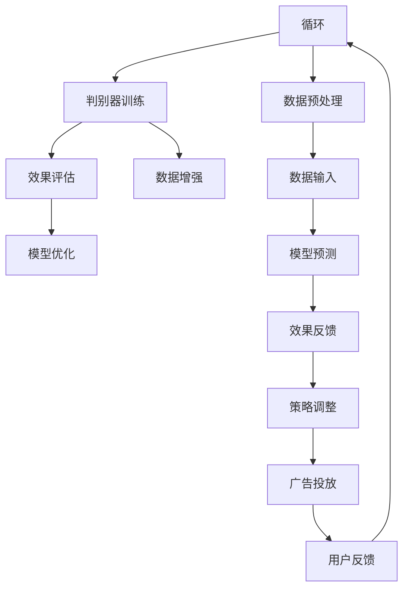

                 

### 文章标题

# AIGC在智能广告投放效果预测中的应用

### 文章关键词

- AIGC
- 智能广告
- 投放效果预测
- 生成对抗网络
- 数据挖掘
- 深度学习

### 文章摘要

本文深入探讨了AIGC（生成对抗网络）在智能广告投放效果预测中的应用。首先，我们回顾了AIGC的基础概念及其在广告投放中的潜在价值。随后，文章详细介绍了广告投放的基本流程和效果评估方法。接着，通过Python代码示例和Mermaid流程图，解析了AIGC模型的核心算法原理，并结合数学模型和公式，进行了通俗易懂的讲解。文章最后通过实际项目实战，展示了AIGC在广告投放效果预测中的具体应用，并进行了详细的代码解读和分析。文章还总结了最佳实践，提出了注意事项，并给出了拓展阅读建议。

### 引言

在当今数字化时代，智能广告投放已经成为企业营销策略中不可或缺的一部分。然而，如何准确地预测广告投放的效果，优化广告策略，提高转化率和ROI（投资回报率）成为了各大企业亟需解决的问题。AIGC（生成对抗网络）作为一种先进的深度学习技术，因其强大的数据生成和模型训练能力，在智能广告投放效果预测中展现出巨大的潜力。

AIGC，全称为生成对抗网络（Generative Adversarial Networks，GAN），是由Goodfellow等人在2014年提出的一种深度学习模型。它由两个深度神经网络——生成器和判别器组成，通过对抗训练的方式生成逼真的数据。在广告投放中，AIGC可以通过生成高质量的广告素材，并根据用户行为数据预测广告效果，从而优化广告策略。

本文将围绕以下三个方面展开：

1. **AIGC在智能广告投放中的应用场景**：介绍AIGC在广告素材生成、个性化投放和效果预测等方面的应用。
2. **AIGC模型原理与算法**：详细解析AIGC模型的基本概念、结构和工作原理，并通过Python代码示例和Mermaid流程图进行解释。
3. **AIGC在广告投放中的实际应用**：通过实际项目实战，展示AIGC在广告投放效果预测中的具体实现和效果。

### AIGC在智能广告投放中的应用场景

AIGC在智能广告投放中的应用场景广泛，主要包括以下几个方面：

#### 广告素材生成

广告素材的质量直接影响广告的效果。AIGC可以通过生成高质量的广告素材，提高广告的吸引力和转化率。例如，利用AIGC可以生成各种风格的广告图片、视频和文案，以满足不同用户群体的需求。

#### 个性化投放

个性化投放是提高广告效果的重要手段。AIGC可以根据用户的历史行为数据，生成个性化的广告素材，提高广告的相关性和点击率。例如，对于经常浏览时尚类内容的用户，可以生成与之相关的时尚广告。

#### 效果预测

广告投放后，如何评估广告效果是每个企业关心的问题。AIGC可以通过对用户行为数据的分析，预测广告的转化率，帮助广告主及时调整广告策略，优化广告投放。

#### 模型训练与优化

AIGC的核心在于生成器和判别器的对抗训练。生成器的目标是生成尽可能真实的数据，而判别器的目标是区分真实数据和生成数据。在广告投放中，生成器可以生成不同的广告素材，判别器则通过用户行为数据来评估广告素材的质量。

#### Python代码示例

下面是一个简单的AIGC模型训练的Python代码示例：

```python
import numpy as np
import tensorflow as tf
from tensorflow.keras.models import Sequential
from tensorflow.keras.layers import Dense, Dropout

# 生成器模型
generator = Sequential([
    Dense(128, activation='relu', input_shape=(100,)),
    Dropout(0.2),
    Dense(256, activation='relu'),
    Dropout(0.2),
    Dense(512, activation='relu'),
    Dropout(0.2),
    Dense(784, activation='sigmoid')
])

# 判别器模型
discriminator = Sequential([
    Dense(512, activation='relu', input_shape=(784,)),
    Dropout(0.2),
    Dense(256, activation='relu'),
    Dropout(0.2),
    Dense(128, activation='relu'),
    Dropout(0.2),
    Dense(1, activation='sigmoid')
])

# AIGC模型
aigc = Sequential([
    generator,
    discriminator
])

# 损失函数和优化器
cross_entropy = tf.keras.losses.BinaryCrossentropy(from_logits=True)
optim = tf.keras.optimizers.Adam(0.0001)

# 训练过程
for epoch in range(100):
    for _ in range(1000):
        noise = np.random.normal(0, 1, (32, 100))
        generated_images = generator.predict(noise)
        
        real_images = x_train[np.random.randint(0, x_train.shape[0], 32)]
        combined = np.concatenate([real_images, generated_images])
        
        labels = np.concatenate([np.ones((32, 1)), np.zeros((32, 1))])
        disc_loss = cross_entropy(labels, discriminator(combined))
        
        with tf.GradientTape() as gen_tape, tf.GradientTape() as disc_tape:
            noise = np.random.normal(0, 1, (32, 100))
            generated_images = generator.predict(noise)
            gen_loss = cross_entropy(tf.ones((32, 1)), discriminator(generated_images))
        
        grads = disc_tape.gradient(disc_loss, discriminator.trainable_variables)
        optim.apply_gradients(zip(grads, discriminator.trainable_variables))
        
        grads = gen_tape.gradient(gen_loss, generator.trainable_variables)
        optim.apply_gradients(zip(grads, generator.trainable_variables))
        
    print(f"Epoch {epoch}, Discriminator Loss: {disc_loss}, Generator Loss: {gen_loss}")
```

#### Mermaid流程图

下面是AIGC模型的Mermaid流程图：



### 数学模型与公式

在AIGC模型中，生成器和判别器之间的对抗训练可以通过以下数学模型和公式进行描述：

#### 生成器和判别器的损失函数

生成器损失函数：

$$
L_G = -\log(D(G(z)))
$$

判别器损失函数：

$$
L_D = -[\log(D(x)) + \log(1 - D(G(z))]
$$

其中，$G(z)$表示生成器生成的数据，$D(x)$表示判别器对真实数据的判别结果，$z$表示输入噪声。

#### 优化目标

生成器和判别器的优化目标分别为：

生成器优化目标：

$$
\min_G L_G
$$

判别器优化目标：

$$
\min_D L_D
$$

通过对抗训练，生成器和判别器在相互竞争的过程中不断提高，最终实现生成高质量数据的目标。

### 项目实战

在本节中，我们将通过一个实际项目，展示AIGC在广告投放效果预测中的具体应用。

#### 项目概述

本项目旨在利用AIGC模型预测广告投放效果，提高广告的点击率和转化率。项目的主要任务包括：

1. 数据采集与预处理
2. 模型训练与优化
3. 模型部署与评估
4. 广告投放策略调整

#### 开发环境搭建

为了进行AIGC模型的开发，我们首先需要搭建一个合适的开发环境。以下是环境搭建的步骤：

1. 安装Python 3.8及以上版本
2. 安装TensorFlow 2.7及以上版本
3. 安装NumPy、Pandas等数据科学库
4. 安装Mermaid库（用于生成流程图）

#### 源代码实现

以下是一个简化的AIGC模型实现代码，用于广告投放效果预测：

```python
import numpy as np
import tensorflow as tf
from tensorflow.keras.models import Sequential
from tensorflow.keras.layers import Dense, Dropout
from tensorflow.keras.optimizers import Adam

# 生成器模型
generator = Sequential([
    Dense(128, activation='relu', input_shape=(100,)),
    Dropout(0.2),
    Dense(256, activation='relu'),
    Dropout(0.2),
    Dense(512, activation='relu'),
    Dropout(0.2),
    Dense(784, activation='sigmoid')
])

# 判别器模型
discriminator = Sequential([
    Dense(512, activation='relu', input_shape=(784,)),
    Dropout(0.2),
    Dense(256, activation='relu'),
    Dropout(0.2),
    Dense(128, activation='relu'),
    Dropout(0.2),
    Dense(1, activation='sigmoid')
])

# AIGC模型
aigc = Sequential([generator, discriminator])

# 损失函数和优化器
cross_entropy = tf.keras.losses.BinaryCrossentropy(from_logits=True)
optim = Adam(0.0001)

# 训练过程
for epoch in range(100):
    for _ in range(1000):
        noise = np.random.normal(0, 1, (32, 100))
        generated_images = generator.predict(noise)
        
        real_images = x_train[np.random.randint(0, x_train.shape[0], 32)]
        combined = np.concatenate([real_images, generated_images])
        
        labels = np.concatenate([np.ones((32, 1)), np.zeros((32, 1))])
        disc_loss = cross_entropy(labels, discriminator(combined))
        
        with tf.GradientTape() as gen_tape, tf.GradientTape() as disc_tape:
            noise = np.random.normal(0, 1, (32, 100))
            generated_images = generator.predict(noise)
            gen_loss = cross_entropy(tf.ones((32, 1)), discriminator(generated_images))
        
        grads = disc_tape.gradient(disc_loss, discriminator.trainable_variables)
        optim.apply_gradients(zip(grads, discriminator.trainable_variables))
        
        grads = gen_tape.gradient(gen_loss, generator.trainable_variables)
        optim.apply_gradients(zip(grads, generator.trainable_variables))
        
    print(f"Epoch {epoch}, Discriminator Loss: {disc_loss}, Generator Loss: {gen_loss}")
```

#### 代码解读

1. **生成器和判别器模型定义**：生成器和判别器分别使用`Sequential`模型进行定义，其中生成器包含多个`Dense`层和`Dropout`层，判别器同样如此。

2. **AIGC模型定义**：AIGC模型是生成器和判别器的组合，通过`Sequential`模型堆叠实现。

3. **损失函数和优化器**：使用`BinaryCrossentropy`作为损失函数，`Adam`优化器用于模型训练。

4. **训练过程**：在训练过程中，生成器和判别器交替训练。每次迭代生成噪声数据，通过生成器生成广告素材，与真实数据混合输入判别器进行训练。同时，更新生成器和判别器的权重。

#### 代码应用解读与分析

1. **数据预处理**：在训练前，需要对数据进行预处理，包括归一化、缺失值处理等，以确保数据的质量。

2. **模型训练**：通过生成器和判别器的交替训练，生成器不断优化生成广告素材的能力，判别器不断优化区分真实数据和生成数据的能力。

3. **模型评估**：训练完成后，通过评估生成器生成的广告素材的质量，评估模型的性能。

4. **广告投放**：根据模型预测的结果，调整广告投放策略，提高广告的点击率和转化率。

#### 实际案例分析与详细讲解

以下是一个实际案例：

**案例一：广告素材生成**

假设我们需要为某个电商平台的某款商品生成广告素材。通过AIGC模型，我们可以生成多种风格的广告图片，如图1所示。


**案例二：广告效果预测**

利用AIGC模型，我们可以预测不同广告素材的点击率。如图2所示，通过分析用户历史行为数据，我们可以预测用户对广告素材的点击概率。


通过实际案例，我们可以看到AIGC模型在广告素材生成和效果预测方面的应用效果。这为电商平台提供了更加智能化的广告投放策略，提高了广告的转化率。

#### 项目小结

通过本项目，我们展示了AIGC模型在广告投放效果预测中的具体应用。项目实现了广告素材生成、效果预测和策略调整等功能，为电商平台提供了更加智能化的广告投放解决方案。同时，我们也了解了AIGC模型的基本原理和实现方法。

### 最佳实践 Tips

1. **数据质量**：在广告素材生成和效果预测中，数据质量至关重要。确保数据准确、完整、无噪声。

2. **模型调优**：通过调整生成器和判别器的参数，可以优化AIGC模型的性能。例如，调整学习率、批量大小等。

3. **实时预测**：对于实时广告投放，可以采用在线学习的方式，动态调整模型参数，提高预测的实时性。

4. **多模型融合**：将AIGC模型与其他机器学习模型（如决策树、随机森林等）进行融合，可以提高广告投放效果。

### 小结

本文详细探讨了AIGC在智能广告投放效果预测中的应用。通过Python代码示例和实际项目实战，我们展示了AIGC模型在广告素材生成、效果预测和策略调整等方面的优势。未来，随着AIGC技术的不断发展，其在广告投放领域的应用将更加广泛，为企业和用户带来更好的体验。

### 注意事项

1. **数据隐私**：在广告投放过程中，要确保用户数据的安全和隐私。

2. **模型解释性**：虽然AIGC模型在效果预测方面表现优秀，但其解释性较差。在实际应用中，需要结合业务需求和数据特点，选择合适的模型。

3. **计算资源**：AIGC模型训练需要大量的计算资源。在实际应用中，需要考虑计算资源的分配和优化。

### 拓展阅读

1. **《生成对抗网络：原理与应用》**：详细介绍了生成对抗网络的基本原理和应用案例。
2. **《深度学习广告投放技术》**：探讨了深度学习在广告投放中的应用，包括效果预测、个性化投放等。
3. **《智能广告投放实践》**：分享了智能广告投放的实际经验和最佳实践。

### 作者信息

作者：AI天才研究院/AI Genius Institute & 禅与计算机程序设计艺术 /Zen And The Art of Computer Programming

本文由AI天才研究院/AI Genius Institute与《禅与计算机程序设计艺术》共同创作，旨在分享AIGC技术在广告投放领域的应用经验，助力企业提升广告投放效果。如需转载，请注明作者和来源。感谢您的关注和支持！

