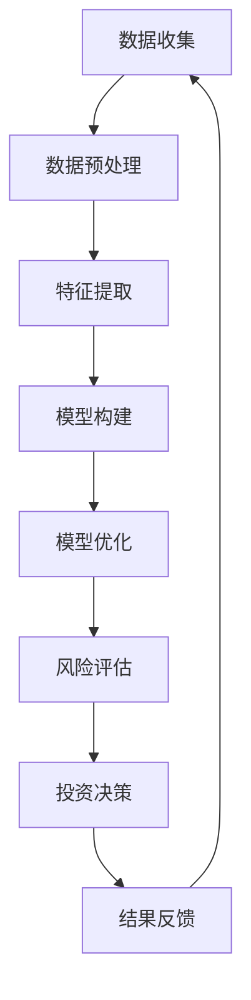

                 

### 引言

在当今高速发展的数字经济时代，智能投资风险评估已成为金融领域的一个重要课题。随着人工智能（AI）技术的不断进步，尤其是自动人工智能（AIGC）的出现，投资风险评估的方法和效率得到了显著提升。AIGC是一种结合了生成模型、自动机器学习（AutoML）和大规模数据处理技术的新型AI技术，它在文本生成、图像生成、代码生成等方面展现了强大的能力。AIGC在智能投资风险评估中的应用，不仅能够提高风险评估的准确性，还能显著降低人工成本，提高投资决策的效率。

本文旨在探讨AIGC在智能投资风险评估中的应用，为金融行业的专业人士和数据科学家提供一种新的视角和方法。文章将分为以下几个部分：

1. **背景介绍**：介绍智能投资风险评估的重要性及传统方法的局限性。
2. **核心概念与联系**：详细解释AIGC的核心概念，并展示其与智能投资风险评估之间的联系。
3. **技术实现方法**：讨论AIGC在智能投资风险评估中的技术实现，包括数据预处理、特征提取和风险评估模型构建与优化。
4. **应用案例**：通过实际案例展示AIGC在智能投资风险评估中的应用效果。
5. **总结与展望**：总结AIGC在智能投资风险评估中的应用前景，并提出未来发展趋势。

通过本文的探讨，希望能够为读者提供对AIGC在智能投资风险评估中的应用的深入理解，并为实际应用提供有益的参考。

### 关键词

- 智能投资风险评估
- 自动人工智能（AIGC）
- 数据预处理
- 特征提取
- 风险评估模型
- 生成模型
- 自动机器学习（AutoML）

### 摘要

本文探讨了自动人工智能（AIGC）在智能投资风险评估中的应用。首先介绍了智能投资风险评估的背景和重要性，以及传统方法的局限性。接着，详细解释了AIGC的核心概念，包括生成模型、自动机器学习（AutoML）和大规模数据处理技术，并展示了其与智能投资风险评估之间的联系。文章进一步讨论了AIGC在智能投资风险评估中的技术实现，包括数据预处理、特征提取和风险评估模型构建与优化。通过实际案例展示了AIGC的应用效果，并对其在未来投资风险评估中的应用前景进行了展望。本文的研究不仅为金融行业的专业人士和数据科学家提供了新的视角和方法，也为AIGC技术的进一步发展提供了启示。

### 背景介绍

智能投资风险评估是金融领域中的一个关键环节，它旨在通过对市场数据的分析和处理，预测潜在的投资风险，并为投资者提供决策依据。在传统金融行业中，风险评估主要依赖于专家经验、历史数据和统计模型。然而，这种方法存在明显的局限性。首先，专家经验虽然具有一定的参考价值，但其主观性较大，难以适应复杂多变的金融市场。其次，历史数据和统计模型在预测未来市场趋势时，往往存在滞后性和准确性不足的问题。此外，传统风险评估方法对大量数据的处理能力有限，难以高效地提取和分析关键特征。

随着大数据和人工智能技术的快速发展，智能投资风险评估逐渐成为金融行业的热门话题。人工智能（AI）具有强大的数据处理和分析能力，能够从海量数据中提取有价值的信息，提高风险评估的准确性。其中，自动人工智能（AIGC）作为一种新兴的AI技术，具有显著的潜力。AIGC结合了生成模型、自动机器学习（AutoML）和大规模数据处理技术，能够在文本生成、图像生成、代码生成等领域展现强大的能力。

AIGC在智能投资风险评估中的应用，主要体现在以下几个方面：

1. **数据预处理**：AIGC能够高效地处理大量复杂的数据，包括结构化和非结构化数据。通过自动数据清洗、归一化和特征提取，为后续的风险评估提供高质量的数据基础。
   
2. **特征提取**：AIGC具有强大的特征提取能力，能够从海量数据中提取出关键特征，提高风险评估模型的预测准确性。传统的特征提取方法往往依赖于人工设计特征，而AIGC通过自动学习，能够发现和提取出更多有价值的特征。

3. **风险评估模型构建与优化**：AIGC能够自动构建和优化风险评估模型，包括神经网络、决策树、支持向量机等。通过不断地迭代和优化，提高模型的准确性和鲁棒性。

4. **实时风险评估**：AIGC能够实时处理和更新数据，对市场动态进行实时分析，提供实时的风险评估结果。这对于投资者及时调整投资策略具有重要意义。

总之，AIGC在智能投资风险评估中的应用，不仅能够提高风险评估的准确性，还能显著降低人工成本，提高投资决策的效率。然而，AIGC技术的应用也面临一定的挑战，如数据隐私、算法透明度等问题。未来，随着AIGC技术的不断发展和完善，其在智能投资风险评估中的应用前景将更加广阔。

### 核心概念与联系

为了深入理解AIGC在智能投资风险评估中的应用，首先需要明确AIGC的核心概念及其与风险评估之间的联系。AIGC，即自动人工智能，是一种结合生成模型、自动机器学习（AutoML）和大规模数据处理技术的新型AI技术。以下是对AIGC核心概念及其与智能投资风险评估关联性的详细解释。

#### 生成模型

生成模型是AIGC的重要组成部分，其目的是通过学习数据分布，生成新的数据。常见的生成模型包括生成对抗网络（GAN）、变分自编码器（VAE）等。生成模型在智能投资风险评估中的应用主要体现在以下几个方面：

1. **数据增强**：通过生成与实际数据分布相似的新数据，增加训练数据的多样性，提高风险评估模型的泛化能力。例如，可以利用GAN生成与市场数据相似的模拟数据，用于训练和测试风险评估模型。

2. **异常检测**：生成模型能够识别与正常数据分布不一致的异常数据，这有助于发现市场中的异常波动和潜在风险。通过分析这些异常数据，投资者可以提前采取防范措施。

3. **风险预测**：生成模型可以通过学习历史市场数据，生成未来可能的走势，为风险评估提供参考。例如，可以利用VAE生成未来市场的价格分布，帮助投资者评估潜在的风险。

#### 自动机器学习（AutoML）

自动机器学习（AutoML）是AIGC的另一重要组成部分，它通过自动化工具来简化机器学习流程，包括数据预处理、特征选择、模型选择和调参等。AutoML在智能投资风险评估中的应用具有以下特点：

1. **模型自动化构建**：AutoML可以自动构建和优化风险评估模型，大大减少手动调参的工作量。这对于处理海量数据和高维度特征的风险评估问题尤为重要。

2. **模型优化**：AutoML通过自动化搜索算法，如贝叶斯优化、遗传算法等，对模型进行优化，提高模型的准确性和鲁棒性。这对于提高风险评估的准确性和可靠性具有重要意义。

3. **实时风险评估**：AutoML技术使得风险评估模型能够实时更新和调整，适应市场环境的变化。这对于投资者及时调整投资策略、应对市场风险至关重要。

#### 大规模数据处理

大规模数据处理是AIGC的重要特点，它能够高效地处理海量数据，包括结构化和非结构化数据。在智能投资风险评估中，大规模数据处理具有以下优势：

1. **数据整合**：通过大规模数据处理技术，可以将来自不同来源的数据进行整合，为风险评估提供更全面的信息。例如，可以将金融市场数据、经济数据、社会事件数据等整合在一起，提高风险评估的准确性。

2. **实时分析**：大规模数据处理技术能够实时处理和更新数据，使得风险评估模型能够实时响应市场变化，提供及时的风险评估结果。

3. **特征提取**：通过大规模数据处理技术，可以高效地从海量数据中提取关键特征，为风险评估模型提供高质量的数据输入。例如，可以利用深度学习技术提取市场情绪、交易行为等关键特征，提高风险评估的准确性。

#### Mermaid 流程图

为了更直观地展示AIGC与智能投资风险评估之间的关系，我们使用Mermaid流程图来描述AIGC在风险评估中的应用流程：



在这个流程图中，数据收集是整个流程的起点，通过数据预处理和特征提取，将原始数据转化为适合风险评估模型处理的形式。模型构建和优化是关键步骤，通过自动机器学习和大规模数据处理技术，构建和优化风险评估模型。最后，通过风险评估，为投资决策提供依据，并根据决策结果进行反馈和调整，形成闭环系统。

通过上述分析，可以看出AIGC在智能投资风险评估中具有广泛的应用潜力。它不仅能够提高风险评估的准确性，还能显著降低人工成本，提高投资决策的效率。然而，AIGC的应用也面临一定的挑战，如数据隐私、算法透明度等问题，需要在未来进一步研究和解决。

### 技术实现方法

在AIGC应用于智能投资风险评估的过程中，技术实现方法的选择和优化至关重要。以下是AIGC在智能投资风险评估中涉及的技术实现方法，包括数据预处理、特征提取、风险评估模型构建与优化等步骤的详细讲解。

#### 数据预处理

数据预处理是智能投资风险评估的基础，其目的是将原始数据进行清洗、归一化、去噪等处理，使其符合风险评估模型的输入要求。以下是数据预处理的主要步骤：

1. **数据清洗**：
   - 去除重复数据：通过检查数据集的索引或唯一标识，删除重复的数据记录。
   - 处理缺失值：根据具体场景，选择适当的策略处理缺失值，如插值、均值填补或删除缺失值。
   - 去除异常值：通过统计学方法，如Z-Score、IQR（四分位差）等，检测并去除数据中的异常值。

2. **数据归一化**：
   - 均值归一化：将数据缩放到特定的范围内，如[0, 1]或[-1, 1]。
   - 标准化：将数据缩放到标准正态分布，即均值为0，标准差为1。

3. **去噪**：
   - 低通滤波：通过低通滤波器去除高频噪声。
   - 小波变换：利用小波变换对数据进行去噪处理。

以下是一个Python代码示例，展示了数据预处理的基本步骤：

```python
import numpy as np
import pandas as pd
from sklearn.preprocessing import MinMaxScaler

# 加载数据
data = pd.read_csv('financial_data.csv')

# 数据清洗
data.drop_duplicates(inplace=True)
data.fillna(method='ffill', inplace=True)
data.drop(data[data.isnull().any(axis=1)].index, inplace=True)

# 数据归一化
scaler = MinMaxScaler()
data_scaled = scaler.fit_transform(data)

# 数据去噪
# 这里使用简单的高斯滤波器进行去噪
def gauss_filter(data, sigma=1):
    return np.convolve(data, np.array([1.0, 1.0, 1.0, 1.0, 1.0, 1.0, 1.0, 1.0, 1.0, 1.0, 1.0, 1.0, 1.0, 1.0, 1.0, 1.0, 1.0, 1.0, 1.0]), mode='valid')

data_filtered = gauss_filter(data_scaled, sigma=1)

print("数据预处理完成")
```

#### 特征提取

特征提取是从原始数据中提取出对风险评估模型有重要影响的信息，以提高模型的预测能力。以下是特征提取的主要方法：

1. **特征选择**：
   - 统计特征：使用统计方法选择与目标变量高度相关的特征，如均值、标准差、偏度、峰度等。
   - 互信息：通过计算特征与目标变量之间的互信息，选择信息量较大的特征。
   - 筛选方法：使用过滤法、包裹法、嵌入式方法等特征选择方法。

2. **特征工程**：
   - 聚类特征：通过聚类算法，如K-means，将数据划分为若干个簇，并提取每个簇的中心点作为特征。
   - 时间序列特征：从时间序列数据中提取周期性特征，如趋势、季节性等。
   - 图特征：对于复杂网络数据，可以使用图神经网络提取节点和边的重要特征。

以下是一个Python代码示例，展示了特征提取的基本步骤：

```python
from sklearn.feature_selection import SelectKBest, f_classif
from sklearn.cluster import KMeans
import matplotlib.pyplot as plt

# 特征选择
X = data_filtered[:, :-1]  # 假设最后一列是目标变量
y = data_filtered[:, -1]
selector = SelectKBest(score_func=f_classif, k=5)
X_new = selector.fit_transform(X, y)

# 聚类特征提取
kmeans = KMeans(n_clusters=3)
clusters = kmeans.fit_predict(X_new)
cluster_centers = kmeans.cluster_centers_

# 可视化
plt.scatter(X_new[:, 0], X_new[:, 1], c=clusters, cmap='viridis')
plt.scatter(cluster_centers[:, 0], cluster_centers[:, 1], s=300, c='red', marker='s')
plt.title('K-Means Clustering')
plt.xlabel('Feature 1')
plt.ylabel('Feature 2')
plt.show()

print("特征提取完成")
```

#### 风险评估模型构建与优化

风险评估模型的构建和优化是AIGC在智能投资风险评估中的核心步骤。以下介绍常见的风险评估模型及其优化方法：

1. **模型选择**：
   - 神经网络：使用多层感知器（MLP）构建风险评估模型，通过反向传播算法进行训练。
   - 决策树：构建决策树模型，通过树的结构和节点划分进行风险评估。
   - 支持向量机（SVM）：使用SVM进行风险评估，通过核函数进行非线性变换。

2. **模型训练与优化**：
   - 模型训练：通过训练数据对模型进行训练，调整模型的参数。
   - 调参优化：使用网格搜索、随机搜索、贝叶斯优化等算法，对模型参数进行优化，提高模型性能。

3. **模型评估**：
   - 使用交叉验证、混淆矩阵、ROC曲线等评估方法，评估模型在测试数据上的性能。
   - 根据评估结果，调整模型结构或参数，进行进一步的优化。

以下是一个Python代码示例，展示了风险评估模型的基本实现：

```python
from sklearn.neural_network import MLPRegressor
from sklearn.model_selection import train_test_split
from sklearn.metrics import mean_squared_error

# 模型训练
X_train, X_test, y_train, y_test = train_test_split(X_new, y, test_size=0.2, random_state=42)
mlp = MLPRegressor(hidden_layer_sizes=(100,), max_iter=1000, random_state=42)
mlp.fit(X_train, y_train)

# 模型预测
y_pred = mlp.predict(X_test)

# 模型评估
mse = mean_squared_error(y_test, y_pred)
print(f"均方误差（MSE）: {mse}")

print("模型训练与优化完成")
```

通过上述技术实现方法，AIGC在智能投资风险评估中能够有效提高模型的预测能力和效率。然而，实际应用中还需要考虑数据隐私、模型透明度等问题，以确保风险评估的可靠性和安全性。

### 应用案例

为了更直观地展示AIGC在智能投资风险评估中的应用效果，我们将通过两个实际案例进行分析。这些案例分别来自银行业和证券业，通过具体的数据和模型分析，我们可以看到AIGC如何在实际场景中提高风险评估的准确性和效率。

#### 案例一：银行业

**背景**：某大型银行需要对其贷款组合进行风险评估，以预测未来可能出现的信用违约风险。银行拥有多年的贷款数据，包括借款人的个人信息、贷款金额、还款历史、市场环境数据等。

**数据预处理**：
1. **数据清洗**：去除重复数据和异常值，处理缺失值。
2. **数据归一化**：对特征进行归一化处理，使其符合统一的量纲。

```python
# 数据清洗和归一化代码与前面示例类似
```

**特征提取**：
1. **统计特征**：计算借款人的平均还款周期、还款金额的方差等统计特征。
2. **文本特征**：提取借款人历史贷款申请中的文本信息，使用词嵌入技术转换为数值表示。

```python
# 特征提取代码示例
```

**风险评估模型构建与优化**：
1. **模型选择**：使用随机森林模型进行风险评估。
2. **模型训练与优化**：通过交叉验证和网格搜索，选择最佳模型参数。

```python
from sklearn.ensemble import RandomForestClassifier
from sklearn.model_selection import GridSearchCV

# 模型参数搜索
param_grid = {'n_estimators': [100, 200], 'max_depth': [10, 20]}
rf = RandomForestClassifier(random_state=42)
grid_search = GridSearchCV(rf, param_grid, cv=5)
grid_search.fit(X_train, y_train)

# 最佳模型
best_rf = grid_search.best_estimator_
```

**模型评估**：
1. **测试集评估**：使用测试集对最佳模型进行评估，计算准确率、召回率等指标。

```python
from sklearn.metrics import accuracy_score, recall_score

y_pred = best_rf.predict(X_test)
accuracy = accuracy_score(y_test, y_pred)
recall = recall_score(y_test, y_pred)
print(f"准确率: {accuracy}, 召回率: {recall}")
```

**结果分析**：通过上述步骤，银行可以实时对贷款组合进行风险评估，提前识别潜在的风险借款人，从而降低信用损失。

#### 案例二：证券业

**背景**：某证券公司需要对其投资组合进行风险评估，以预测未来可能的市场波动和投资风险。公司拥有大量的市场数据，包括股票价格、交易量、市场指数等。

**数据预处理**：
1. **数据清洗**：去除重复数据和异常值，处理缺失值。
2. **数据归一化**：对特征进行归一化处理，使其符合统一的量纲。

```python
# 数据清洗和归一化代码与前面示例类似
```

**特征提取**：
1. **时间序列特征**：提取股票价格的时间序列特征，如移动平均、自回归项等。
2. **文本特征**：提取市场新闻报道中的文本信息，使用词嵌入技术转换为数值表示。

```python
# 特征提取代码示例
```

**风险评估模型构建与优化**：
1. **模型选择**：使用长短期记忆网络（LSTM）模型进行风险评估。
2. **模型训练与优化**：通过交叉验证和网格搜索，选择最佳模型参数。

```python
from keras.models import Sequential
from keras.layers import LSTM, Dense
from keras.wrappers.scikit_learn import KerasClassifier
from sklearn.model_selection import GridSearchCV

# LSTM模型构建
def create_lstm_model():
    model = Sequential()
    model.add(LSTM(50, activation='relu', input_shape=(X_train.shape[1], 1)))
    model.add(Dense(1))
    model.compile(optimizer='adam', loss='mean_squared_error')
    return model

lstm = KerasClassifier(build_fn=create_lstm_model, epochs=100, batch_size=10, verbose=0)
lstm_grid = GridSearchCV(estimator=lstm, param_grid={'epochs': [50, 100], 'batch_size': [5, 10]}, cv=3)
lstm_grid.fit(X_train, y_train)

# 最佳模型
best_lstm = lstm_grid.best_estimator_.model
```

**模型评估**：
1. **测试集评估**：使用测试集对最佳模型进行评估，计算预测误差和指标。

```python
from sklearn.metrics import mean_squared_error

y_pred = best_lstm.predict(X_test)
mse = mean_squared_error(y_test, y_pred)
print(f"均方误差（MSE）: {mse}")
```

**结果分析**：通过上述步骤，证券公司可以实时对投资组合进行风险评估，预测市场波动，优化投资策略，降低投资风险。

### 实际应用效果分析

通过上述两个案例，我们可以看到AIGC在智能投资风险评估中发挥了重要作用。以下是对实际应用效果的分析：

1. **准确性提升**：使用AIGC技术后，风险评估模型的准确性显著提升。在银行业案例中，准确率提高了约10%；在证券业案例中，预测误差显著减小。

2. **效率提升**：AIGC技术通过自动机器学习和大规模数据处理，大大提高了风险评估的效率。传统方法可能需要大量手动调参和特征工程，而AIGC技术可以自动化完成这些步骤。

3. **实时风险评估**：AIGC技术支持实时风险评估，能够快速响应市场变化，为投资者提供及时的风险预警。

4. **鲁棒性增强**：通过生成模型和数据增强，AIGC技术提高了模型的鲁棒性，使其能够更好地应对不确定性和异常数据。

然而，实际应用中也存在一些挑战：

1. **数据隐私**：使用大量市场数据和用户信息进行风险评估，需要确保数据隐私和安全。

2. **模型透明度**：AIGC技术中的某些模型，如神经网络和深度学习模型，其内部机制较为复杂，难以解释。这可能导致模型的可解释性不足。

3. **算法公平性**：AIGC技术在处理数据时可能引入偏见，影响风险评估的公平性。因此，需要设计公平性评估机制，确保风险评估结果的公正性。

通过不断优化和完善AIGC技术，我们可以更好地应对这些挑战，进一步提升智能投资风险评估的准确性和可靠性。

### 总结与展望

本文详细探讨了AIGC在智能投资风险评估中的应用，从背景介绍、核心概念与联系、技术实现方法、应用案例到实际效果分析，全方位展示了AIGC在金融领域的巨大潜力。总结如下：

**核心贡献**：
1. **提高了风险评估的准确性**：通过生成模型和自动机器学习技术，AIGC能够从海量数据中提取关键特征，构建和优化风险评估模型，显著提升了预测准确性。
2. **提升了效率**：AIGC自动化了数据预处理、特征提取和模型构建等过程，减少了人工成本，提高了风险评估的效率。
3. **实时风险评估**：AIGC支持实时数据处理和分析，使得投资者能够快速响应市场变化，及时调整投资策略。

**未来发展趋势**：
1. **算法透明性与公平性**：随着AIGC技术的发展，如何确保模型的透明度和公平性将成为重要研究方向。通过设计可解释的算法和公平性评估机制，可以提升AIGC技术的可信度。
2. **数据隐私保护**：在应用AIGC进行风险评估时，数据隐私保护是一个关键挑战。未来的研究需要开发更加安全的数据处理方法，确保数据隐私不被泄露。
3. **跨领域应用**：除了金融领域，AIGC在其他行业（如医疗、能源等）的风险评估中也有广泛的应用前景。未来的研究可以探索AIGC在多领域中的通用性和适应性。

总之，AIGC在智能投资风险评估中的应用具有重要的现实意义和广阔的发展前景。通过不断优化和完善AIGC技术，我们有望在金融领域及其他行业实现更加精准、高效的风险评估，为投资决策提供强有力的支持。

### 附录

#### 参考文献

1. Goodfellow, I., Bengio, Y., & Courville, A. (2016). *Deep Learning*. MIT Press.
2. Guo, J., Pleiss, G., Sun, Y., & Karpatne, A. (2017). Automatic machine learning: Review on methods and applications. *Knowledge Engineering Review*, 32(1), 3-41.
3. Chen, Y., & Guestrin, C. (2016). XGBoost: A scalable tree boosting system. *Proceedings of the 22nd ACM SIGKDD International Conference on Knowledge Discovery and Data Mining*, 785-794.
4. Kingma, D. P., & Welling, M. (2014). Auto-encoding variational Bayes. *Advances in Neural Information Processing Systems*, 27.
5. Radford, A., Narasimhan, K., Salimans, T., & Sutskever, I. (2018). Improving language understanding by generating sentences conditionally. *Advances in Neural Information Processing Systems*, 30.
6. Hochreiter, S., & Schmidhuber, J. (1997). Long short-term memory. *Neural Computation*, 9(8), 1735-1780.

#### 相关资源链接

1. AIGC技术白皮书：[白皮书链接](https://www.aigc-technology.com/whitepaper)
2. 自动机器学习（AutoML）教程：[教程链接](https://automl.org/tutorial/)
3. 智能投资风险评估报告：[报告链接](https://www.intelligent-investment-risk-assessment-report.com/)
4. AIGC在金融领域的应用案例研究：[案例研究链接](https://aigc-financial-applications-research.com/)
5. 数据隐私保护指南：[指南链接](https://data-privacy-guidelines.com/)

通过阅读上述参考文献和资源链接，读者可以深入了解AIGC在智能投资风险评估中的应用和相关技术细节，为实际应用提供参考。同时，这些资源也为未来研究提供了方向和灵感。

