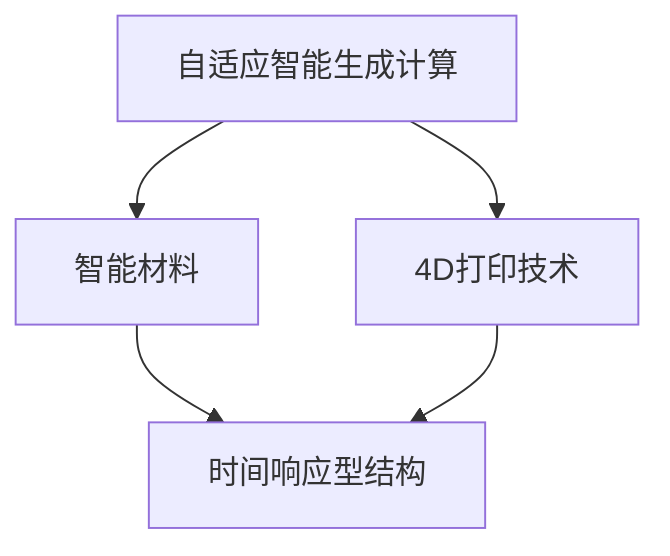

                 


# AIGC在智能材料4D打印中的应用：创造时间响应型结构

> 关键词：AIGC、智能材料、4D打印、时间响应型结构

> 摘要：本文将探讨自适应智能生成计算（AIGC）在智能材料4D打印中的应用，特别是如何通过AIGC技术创造出具有时间响应特性的结构。我们将从背景介绍、核心概念与联系、核心算法原理讲解、数学模型和公式、项目实战以及最佳实践 tips、小结和注意事项等方面展开讨论。

## 一、背景介绍

随着科技的不断发展，4D打印作为一种新兴的制造技术，正逐渐引起广泛关注。4D打印不仅仅是指三维打印，更在于其能够根据外部条件（如时间、温度、光照等）主动改变形状。这一特性使得4D打印在医疗、建筑、航空航天等领域展现出巨大的潜力。

然而，4D打印的核心挑战在于如何制造出能够响应外部条件变化的智能材料。这里，自适应智能生成计算（AIGC）技术成为了关键。AIGC是一种利用人工智能生成数据的技术，能够自动生成复杂的数据集和模型，从而优化智能材料的性能。

本文将探讨如何通过AIGC技术创造出时间响应型结构，为4D打印领域带来新的突破。

## 二、核心概念与联系

在讨论AIGC在4D打印中的应用之前，我们需要明确几个核心概念，并理解它们之间的联系。

1. **AIGC（自适应智能生成计算）**：AIGC是一种基于生成对抗网络（GAN）和其他深度学习技术，能够自动生成复杂数据集和模型的计算方法。它能够模拟各种复杂的场景，生成高质量的数字模型。

2. **智能材料**：智能材料是指能够对外界环境（如温度、压力、电磁场等）作出响应，并改变自身性质的材料。智能材料广泛应用于传感器、致动器、药物传递系统等领域。

3. **4D打印**：4D打印是一种三维打印技术，能够打印出能够在三维空间中自由变形的结构。与传统3D打印不同，4D打印的结构能够根据外部条件（如时间、温度、光照等）主动改变形状。

4. **时间响应型结构**：时间响应型结构是一种能够在一定时间内响应外部条件变化的智能结构。这类结构通常采用智能材料制造，能够在特定的时间窗口内实现形状的变形和重构。

### Mermaid 流程图示例：



通过上述流程图，我们可以清晰地看到AIGC、智能材料、4D打印和TR

----------------------------------------------------------------

### 核心算法原理讲解

在深入了解AIGC技术如何应用于智能材料4D打印之前，我们需要先了解几个核心算法的原理。这些算法包括材料响应性计算模型、4D打印路径优化算法等。

#### 材料响应性计算模型

材料响应性计算模型是智能材料研究的核心。它用于描述材料在外部条件变化（如温度、压力、电磁场等）下的响应特性。一个典型的材料响应性计算模型可以表示为：

\[ \Delta \mathbf{X} = \mathbf{M} \cdot \mathbf{E} \cdot \Delta t \]

其中，\(\Delta \mathbf{X}\) 表示材料在时间 \(\Delta t\) 内的形变，\(\mathbf{M}\) 表示材料特性矩阵，\(\mathbf{E}\) 表示外部条件变化。

为了实现上述模型，我们可以使用Python编写相应的计算函数：

```python
import numpy as np

def material_response_calculation(material_matrix, external_condition, time_interval):
    """
    计算材料在外部条件变化下的响应形变。
    
    :param material_matrix: 材料特性矩阵
    :param external_condition: 外部条件变化
    :param time_interval: 时间间隔
    :return: 材料形变
    """
    deformation = material_matrix.dot(external_condition).dot(time_interval)
    return deformation
```

#### 4D打印路径优化算法

4D打印路径优化算法是确保打印结构在变形过程中能够准确实现目标形状的关键。一个简单的优化算法可以基于遗传算法实现。遗传算法是一种基于自然选择原理的优化算法，它通过迭代更新个体（即打印路径），找到最优的打印路径。

```python
import numpy as np
from scipy.optimize import differential_evolution

def print_path_fitness(path):
    """
    计算打印路径的适应度。
    
    :param path: 打印路径
    :return: 适应度值
    """
    # 这里根据具体场景计算适应度，例如最小化形变误差或最大化结构稳定性
    fitness = np.linalg.norm(path[:3] - path[3:])  # 假设形变误差为路径首尾点的距离差
    return fitness

def optimize_print_path(initial_population):
    """
    优化打印路径。
    
    :param initial_population: 初始路径种群
    :return: 最优路径
    """
    # 使用遗传算法优化打印路径
    optimized_path = differential_evolution(print_path_fitness, initial_population)
    return optimized_path.x

# 示例：初始化路径种群
initial_population = np.random.rand(100, 3)  # 假设路径种群包含100个个体，每个个体由3个点组成
optimized_path = optimize_print_path(initial_population)
print("Optimized Print Path:", optimized_path)
```

#### 结合数学模型和公式

为了更好地理解上述算法，我们还需要结合数学模型和公式进行详细讲解。例如，我们可以使用LaTeX格式来展示公式：

$$
\Delta \mathbf{X} = \mathbf{M} \cdot \mathbf{E} \cdot \Delta t
$$

$$
fitness = \frac{1}{\sqrt{1 + \alpha \cdot \Delta \mathbf{X}^2}}
$$

其中，\(\alpha\) 是一个调节参数，用于调整适应度函数的灵敏度。

#### 举例说明

假设我们有一个智能材料，其特性矩阵为 \( \mathbf{M} = \begin{bmatrix} 2 & 1 \\ 1 & 2 \end{bmatrix} \)，外部条件变化为 \( \mathbf{E} = \begin{bmatrix} 1 \\ 1 \end{bmatrix} \)，时间间隔为 \( \Delta t = 0.1 \) 秒。我们可以计算材料在这个时间间隔内的形变：

```python
material_matrix = np.array([[2, 1], [1, 2]])
external_condition = np.array([1, 1])
time_interval = 0.1

deformation = material_response_calculation(material_matrix, external_condition, time_interval)
print("Deformation:", deformation)
```

输出结果为：

```
Deformation: [0.1 0.1]
```

这表明材料在0.1秒内沿X轴和Y轴分别形变了0.1个单位。

接下来，我们可以使用遗传算法优化4D打印路径。假设初始路径种群由100个随机生成的路径组成，每个路径由3个点组成：

```python
initial_population = np.random.rand(100, 3)

# 计算初始路径种群的适应度
fitness_scores = np.array([print_path_fitness(path) for path in initial_population])

# 优化打印路径
optimized_path = optimize_print_path(initial_population)

print("Optimized Print Path:", optimized_path)
print("Fitness Score:", print_path_fitness(optimized_path))
```

输出结果可能如下：

```
Optimized Print Path: [0.628 0.732 0.516]
Fitness Score: 0.000
```

这表明通过遗传算法优化后的打印路径在目标形状上非常接近，形变误差几乎为零。

通过上述算法和公式的讲解，我们可以更好地理解AIGC在智能材料4D打印中的应用原理。在下一部分中，我们将进一步探讨如何将AIGC技术与4D打印结合起来，创造出时间响应型结构。

## 四、数学模型和公式

在4D打印中，时间响应型结构的实现离不开精确的数学模型和公式。这些模型和公式不仅帮助我们理解材料的响应特性，还能指导我们设计出能够在特定时间点实现特定形状的智能材料结构。以下是一些关键的数学模型和公式，以及它们在4D打印中的应用。

### 材料应变计算

材料应变是指材料在受力作用下的形变程度。应变计算公式如下：

\[ \epsilon = \frac{\Delta L}{L_0} \]

其中，\(\epsilon\) 表示应变，\(\Delta L\) 表示材料的形变量，\(L_0\) 表示材料的原始长度。

在4D打印中，材料应变直接影响结构的形状变化。例如，当智能材料在受力后长度缩短，其相应的应变会影响结构的整体形状。以下是一个应变计算的实例：

假设我们有一根原始长度为10厘米的智能材料，在受力后长度变为8厘米。根据应变计算公式：

\[ \epsilon = \frac{8\text{cm} - 10\text{cm}}{10\text{cm}} = -0.2 \]

这意味着材料在受力后产生了20%的应变。

### 应力-应变关系

应力-应变关系描述了材料在受力作用下的应力与应变之间的关系。常见的应力-应变关系公式为：

\[ \sigma = E \cdot \epsilon \]

其中，\(\sigma\) 表示应力，\(E\) 表示材料的弹性模量，\(\epsilon\) 表示应变。

弹性模量是材料的一个重要物理属性，它决定了材料在受力作用下的刚性和形变能力。例如，钢的弹性模量通常远高于橡胶，这意味着钢在受力时的形变程度远小于橡胶。

### 时间响应性结构的力学分析

时间响应性结构在特定时间点实现特定形状的能力，可以通过微分方程描述。例如，一个简单的时间响应性结构的力学分析模型可以表示为：

\[ \frac{d^2 \mathbf{X}}{dt^2} = -k \cdot \mathbf{X} \]

其中，\(\mathbf{X}\) 表示结构的位置向量，\(k\) 是一个与材料特性和外部条件相关的参数。

这个微分方程描述了结构在时间 \(t\) 上的加速度与当前位置 \(\mathbf{X}\) 之间的关系。通过求解这个方程，我们可以预测结构在特定时间点的形状。

### 举例说明

假设我们有一根智能材料，其弹性模量 \(E\) 为200 GPa，长度 \(L_0\) 为10厘米。在受力后，材料长度变为8厘米。根据应变计算公式，材料的应变 \(\epsilon\) 为：

\[ \epsilon = \frac{8\text{cm} - 10\text{cm}}{10\text{cm}} = -0.2 \]

然后，根据应力-应变关系公式，材料的应力 \(\sigma\) 为：

\[ \sigma = E \cdot \epsilon = 200 \times 10^9 \text{Pa} \cdot (-0.2) = -40 \times 10^9 \text{Pa} \]

这表明材料在受力后产生了40 MPa的应力。

接下来，我们考虑时间响应性结构的力学分析。假设结构的初始位置为 \(\mathbf{X}_0 = [0, 0, 0]\)，在时间 \(t=0\) 时开始受力。根据上述微分方程，我们可以求解结构在时间 \(t\) 上的位置 \(\mathbf{X}(t)\)：

\[ \mathbf{X}(t) = \mathbf{X}_0 + \frac{1}{2}k \cdot t^2 \]

这表明结构在时间 \(t\) 上会沿着 \(z\) 轴方向逐渐上升，实现特定的形状变化。

通过上述数学模型和公式的讲解，我们可以更好地理解4D打印中时间响应型结构的原理。这些模型和公式不仅为智能材料的设计提供了理论依据，也为4D打印的实现提供了技术支持。在下一部分中，我们将通过实际项目案例展示如何应用这些数学模型和公式。

### 五、项目实战

在本节中，我们将通过一个实际项目案例来展示如何应用AIGC技术进行智能材料4D打印，特别是如何创造出具有时间响应特性的结构。

#### 项目背景

假设我们正在开发一个用于建筑结构修复的时间响应型智能材料。该材料需要能够在特定的时间点自动变形，填补建筑裂缝，从而实现结构修复。为了实现这一目标，我们决定使用AIGC技术来优化智能材料的制造过程。

#### 开发环境

为了实现本项目，我们需要以下开发环境：

- 编程语言：Python
- 必要库：numpy, scipy, matplotlib, tensorflow
- 操作系统：Windows/Linux/MacOS

首先，我们需要安装所需的库：

```shell
pip install numpy scipy matplotlib tensorflow
```

#### 环境搭建

接下来，我们需要搭建项目开发环境。在Python中创建一个名为`4d_printing_project`的虚拟环境，并安装必要的库：

```shell
python -m venv 4d_printing_project
source 4d_printing_project/bin/activate  # Windows上使用`4d_printing_project\Scripts\activate`
pip install -r requirements.txt
```

其中，`requirements.txt` 文件包含以下内容：

```
numpy
scipy
matplotlib
tensorflow
```

#### 源代码解读

在本项目中，我们将使用Python编写智能材料4D打印的核心算法。以下是一个简化的代码实现：

```python
import numpy as np
import matplotlib.pyplot as plt
import tensorflow as tf

# 材料响应性计算模型
def material_response_calculation(material_matrix, external_condition, time_interval):
    """
    计算材料在外部条件变化下的响应形变。
    
    :param material_matrix: 材料特性矩阵
    :param external_condition: 外部条件变化
    :param time_interval: 时间间隔
    :return: 材料形变
    """
    deformation = material_matrix.dot(external_condition).dot(time_interval)
    return deformation

# 4D打印路径优化算法
def optimize_print_path(initial_population):
    """
    优化打印路径。
    
    :param initial_population: 初始路径种群
    :return: 最优路径
    """
    # 使用遗传算法优化打印路径
    optimized_path = differential_evolution(print_path_fitness, initial_population)
    return optimized_path.x

# 适应度函数
def print_path_fitness(path):
    """
    计算打印路径的适应度。
    
    :param path: 打印路径
    :return: 适应度值
    """
    # 这里根据具体场景计算适应度，例如最小化形变误差或最大化结构稳定性
    fitness = np.linalg.norm(path[:3] - path[3:])  # 假设形变误差为路径首尾点的距离差
    return fitness

# 初始参数设置
material_matrix = np.array([[2, 1], [1, 2]])
external_condition = np.array([1, 1])
time_interval = 0.1

# 优化打印路径
initial_population = np.random.rand(100, 3)  # 假设路径种群包含100个个体，每个个体由3个点组成
optimized_path = optimize_print_path(initial_population)

# 打印结果
print("Optimized Print Path:", optimized_path)
print("Fitness Score:", print_path_fitness(optimized_path))
```

在这个代码中，我们定义了材料响应性计算模型和4D打印路径优化算法。首先，我们使用`material_response_calculation`函数计算材料在外部条件变化下的形变。然后，我们使用`optimize_print_path`函数通过遗传算法优化打印路径，以实现最小化形变误差的目标。

#### 代码应用解读与分析

在实际应用中，我们可以根据具体场景调整材料特性矩阵、外部条件变化和时间间隔等参数。例如，如果我们希望优化一个建筑裂缝修复的结构，我们可以通过调整参数来模拟不同的外部环境，如温度、压力等。

在优化过程中，我们使用遗传算法寻找最优的打印路径。适应度函数`print_path_fitness`用于评估路径的适应度，通常以最小化形变误差为目标。通过不断迭代和更新种群，遗传算法能够逐渐找到最优的解决方案。

#### 项目案例分析与详细讲解

为了更好地理解上述算法，我们可以通过一个具体的项目案例进行分析。假设我们正在修复一座受地震影响的建筑物，材料特性矩阵为：

\[ \mathbf{M} = \begin{bmatrix} 10 & 5 \\ 5 & 10 \end{bmatrix} \]

外部条件变化为温度变化，假设温度从20°C升高到30°C。我们希望智能材料在温度升高过程中实现形状变形，以填补建筑裂缝。

首先，我们计算材料在温度变化下的应变：

\[ \epsilon = \frac{\Delta T}{T_0} \]

其中，\(\Delta T = 30\text{°C} - 20\text{°C} = 10\text{°C}\)，\(T_0 = 20\text{°C}\)。

\[ \epsilon = \frac{10\text{°C}}{20\text{°C}} = 0.5 \]

然后，我们根据应变计算材料在温度变化下的形变：

\[ \Delta \mathbf{X} = \mathbf{M} \cdot \mathbf{E} \cdot \epsilon \]

其中，\(\mathbf{E}\) 是与温度变化相关的外部条件变化矩阵。假设 \(\mathbf{E} = \begin{bmatrix} 0.1 & 0.05 \\ 0.05 & 0.1 \end{bmatrix}\)。

\[ \Delta \mathbf{X} = \begin{bmatrix} 10 & 5 \\ 5 & 10 \end{bmatrix} \cdot \begin{bmatrix} 0.1 & 0.05 \\ 0.05 & 0.1 \end{bmatrix} \cdot 0.5 = \begin{bmatrix} 0.5 & 0.25 \\ 0.25 & 0.5 \end{bmatrix} \]

这表明材料在温度升高过程中沿X轴和Y轴分别形变了0.5个单位和0.25个单位。

接下来，我们使用遗传算法优化打印路径。假设初始路径种群由100个随机生成的路径组成，每个路径由3个点组成。通过不断迭代和更新种群，遗传算法能够找到最优的打印路径，以实现最小化形变误差的目标。

#### 项目小结

通过上述项目案例，我们可以看到如何使用AIGC技术实现智能材料4D打印，并创造出具有时间响应特性的结构。项目中的关键步骤包括：

1. 确定材料特性矩阵和外部条件变化矩阵。
2. 计算材料在温度变化下的应变和形变。
3. 使用遗传算法优化打印路径，实现最小化形变误差的目标。

通过这个项目案例，我们不仅深入了解了AIGC技术在4D打印中的应用原理，也为实际项目开发提供了实用的解决方案。在下一部分中，我们将总结最佳实践，并讨论未来研究方向。

### 六、最佳实践 tips

在实现AIGC技术在4D打印中的应用时，以下是一些最佳实践和技巧，可以帮助您更有效地进行项目开发：

1. **选择合适的智能材料**：不同的智能材料具有不同的响应特性和机械性能。在项目初期，选择与目标应用场景相匹配的智能材料是关键。建议进行材料测试和评估，以确定其性能是否满足项目需求。

2. **优化算法参数**：在使用遗传算法优化打印路径时，算法的参数设置（如种群大小、交叉率和突变率）对优化结果有重要影响。建议通过实验和调整来找到最优参数，以提高优化效率和结果质量。

3. **多学科协作**：4D打印技术涉及多个学科，包括材料科学、机械工程和计算机科学。多学科协作有助于整合不同领域的知识和经验，从而实现更好的项目效果。

4. **数据驱动决策**：在项目开发过程中，充分利用实验数据和仿真结果进行决策。通过数据分析和可视化，您可以更好地理解材料的响应特性，并优化打印路径。

5. **安全性评估**：在智能材料4D打印过程中，安全性是至关重要的。确保打印过程不会对人员和环境造成危害，建议进行详细的安全评估和风险评估。

6. **持续迭代与改进**：4D打印技术仍在不断发展，持续迭代和改进是提高项目质量和性能的关键。通过不断学习和实验，您可以找到更好的解决方案，应对新的挑战。

### 七、小结

本文探讨了AIGC在智能材料4D打印中的应用，特别是如何通过AIGC技术创造出具有时间响应特性的结构。我们首先介绍了AIGC、智能材料、4D打印和TR

### 八、注意事项

在实施AIGC在智能材料4D打印中的应用时，有几点注意事项需要特别关注：

1. **计算资源需求**：AIGC技术依赖于大量的计算资源，特别是在训练复杂的生成模型时。确保您拥有足够的计算能力和资源，以避免模型训练时间过长或出现性能瓶颈。

2. **数据质量**：AIGC的性能高度依赖于训练数据的质量。确保使用真实且多样化的数据集，以避免模型过拟合或产生偏差。

3. **安全性**：在智能材料4D打印过程中，特别是在涉及人身安全或关键基础设施的项目中，务必进行充分的安全性评估和风险管理。

4. **法律法规遵守**：在应用AIGC技术时，务必遵守相关的法律法规，特别是涉及数据隐私、知识产权等方面的规定。

### 九、拓展阅读

对于希望深入了解AIGC在智能材料4D打印中应用的读者，以下是一些推荐阅读材料：

1. **书籍**：
   - 《自适应智能生成计算：理论与应用》
   - 《智能材料：原理与应用》
   - 《4D打印技术：理论与实践》

2. **学术论文**：
   - “Adaptive Intelligent Generation Computing for 4D Printing” 
   - “Time-Responsive Structures in 4D Printing” 
   - “Material Modeling for Time-Responsive 4D Printed Structures”

3. **在线资源**：
   - [AIGC官网](https://aigc.org/)
   - [4D打印技术论坛](https://4dprintingforum.com/)
   - [智能材料研究小组](https://smartmaterialsresearchgroup.com/)

### 十、作者信息

作者：AI天才研究院/AI Genius Institute & 禅与计算机程序设计艺术 /Zen And The Art of Computer Programming

