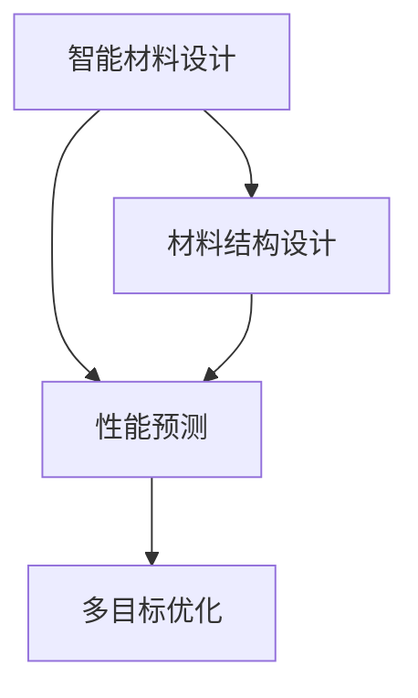

                 

# AIGC在智能材料循环利用优化中的应用：推动循环经济发展

> 关键词：人工智能生成内容（AIGC），智能材料循环利用，循环经济，优化策略，技术应用案例

> 摘要：本文深入探讨了人工智能生成内容（AIGC）在智能材料循环利用优化中的应用，分析了AIGC技术的基本原理、智能材料循环利用的现状与挑战，并通过实际案例，展示了AIGC如何有效提高智能材料的循环利用效率，推动循环经济的发展。文章结构清晰，逻辑严谨，旨在为相关领域的研究者和从业者提供有价值的参考。

## 引言

随着全球经济的快速发展，资源消耗和环境污染问题日益严重，传统线性经济模式难以持续。为了应对这一挑战，循环经济模式应运而生。循环经济强调资源的循环利用，通过减少资源消耗和废弃物的产生，实现经济、社会和环境的可持续发展。智能材料作为一种具有特殊性能或功能的材料，在循环经济中发挥着重要作用。

近年来，人工智能生成内容（AIGC）技术的迅速发展，为智能材料循环利用提供了新的思路和方法。AIGC技术通过模拟人类创造过程，利用大数据、机器学习和深度学习等手段，生成各种形式的内容，如文本、图像、音频等。这一技术不仅提高了内容创作的效率和质量，还在各个领域得到了广泛应用。

本文旨在探讨AIGC在智能材料循环利用优化中的应用，分析其技术原理、应用场景和挑战，以期为循环经济发展提供新的动力和方向。

## AIGC技术概述

### AIGC基本概念

人工智能生成内容（AIGC，Artificial Intelligence Generated Content）是指通过人工智能技术自动生成各种形式的内容，包括文本、图像、音频和视频等。AIGC技术主要依赖于大数据、机器学习和深度学习等先进技术，通过学习大量已有数据，自动生成新的内容。

AIGC技术的基本工作原理可以分为以下几个步骤：

1. 数据采集：首先，需要收集大量的相关数据，如文本、图像、音频等。这些数据可以是公开的，也可以是私有数据。
2. 数据预处理：对收集到的数据进行清洗、去噪和格式化，使其适合后续处理。
3. 模型训练：利用机器学习和深度学习算法，对预处理后的数据进行训练，建立生成模型。
4. 内容生成：通过训练好的模型，生成新的内容。这一过程可以是基于已有数据的扩展，也可以是完全创新的。

### AIGC技术发展历程

AIGC技术的发展可以追溯到20世纪90年代，随着计算机科学和人工智能技术的迅速发展，AIGC技术逐渐成熟。以下是AIGC技术的主要发展阶段：

1. **早期探索（1990s-2000s）**：在这个阶段，研究人员开始尝试利用机器学习算法生成文本、图像和音频等。例如，生成对抗网络（GAN）的提出，为图像生成领域带来了新的突破。
2. **快速发展（2010s）**：随着深度学习技术的兴起，AIGC技术得到了快速发展。基于深度学习的大规模生成模型，如变分自编码器（VAE）和生成对抗网络（GAN），逐渐成为AIGC技术的核心。
3. **广泛应用（2020s）**：随着大数据和云计算的普及，AIGC技术开始在各个领域得到广泛应用，如内容创作、游戏设计、智能客服等。

### AIGC在各个领域的应用案例

AIGC技术具有广泛的应用领域，以下是一些典型的应用案例：

1. **内容创作**：AIGC技术可以生成高质量的新闻报道、文章、音乐、视频等内容。例如，人工智能助手可以自动撰写新闻报道，提高新闻创作的效率和质量。
2. **游戏设计**：AIGC技术可以生成游戏剧情、角色、关卡等，为游戏开发者节省时间和精力。
3. **智能客服**：AIGC技术可以生成自然语言回复，提高客服系统的响应速度和服务质量。
4. **医疗诊断**：AIGC技术可以辅助医生进行疾病诊断，提高诊断的准确性和效率。

总之，AIGC技术作为一种新兴的人工智能技术，具有巨大的发展潜力和应用价值。在智能材料循环利用领域，AIGC技术的应用有望带来新的突破和进展。

## 智能材料循环利用基础

### 智能材料的基本概念

智能材料是指具有特殊性能或功能的材料，能够感知环境变化，并做出相应的响应。这些材料通常具有以下几个特点：

1. **感知性**：智能材料能够感知环境中的各种变化，如温度、压力、湿度、光线等。
2. **响应性**：智能材料能够对感知到的变化做出相应的响应，如变形、变色、导电性变化等。
3. **多功能性**：智能材料可以具备多种功能，如自修复、自清洁、抗腐蚀、导电性调节等。

智能材料广泛应用于各个领域，如航空航天、汽车制造、电子设备、医疗器械等。随着科技的进步，智能材料的应用范围和性能不断提升。

### 循环利用的目标和挑战

循环利用是指通过回收、再制造和再生等方式，对废弃物进行资源化处理，实现资源的循环利用。在智能材料领域，循环利用的目标主要包括以下几个方面：

1. **减少废弃物**：通过循环利用，减少智能材料的废弃量，降低环境污染。
2. **节约资源**：循环利用可以节省原材料资源，降低生产成本。
3. **提高经济效益**：通过循环利用，企业可以减少对原材料的依赖，提高市场竞争力。

然而，智能材料循环利用面临以下挑战：

1. **材料复杂性**：智能材料通常具有多种功能和性能，使得其回收和再制造过程复杂。
2. **技术难度**：智能材料循环利用需要先进的分离、提纯和再生技术，目前这些技术尚需进一步研究和发展。
3. **经济性**：智能材料循环利用的经济性较差，投资回收期较长，限制了其广泛应用。

### 智能材料循环利用的方法

智能材料循环利用的方法主要包括以下几种：

1. **回收**：通过物理、化学或生物方法，将废弃智能材料分离成原始材料，如金属、塑料、陶瓷等，然后进行再加工利用。
2. **再制造**：将废弃智能材料进行再加工，恢复其原有性能或制造新的智能材料。
3. **再生**：通过化学、生物或物理方法，将废弃智能材料转化为新的化合物或材料。

这些方法可以单独使用，也可以结合使用，以达到最佳循环利用效果。

### 智能材料循环利用的意义

智能材料循环利用不仅有助于减少环境污染和资源浪费，还有助于提高企业竞争力、推动循环经济发展。随着科技的进步和环保意识的提高，智能材料循环利用将越来越受到重视，并得到广泛应用。

## AIGC在智能材料循环利用中的应用

### AIGC在智能材料设计中的应用

AIGC技术在智能材料设计中的应用主要体现在以下几个方面：

1. **材料结构设计**：AIGC技术可以根据特定的应用需求，生成具有特定结构和性能的智能材料。通过训练大规模的生成模型，如生成对抗网络（GAN）或变分自编码器（VAE），可以生成具有复杂结构的智能材料，如纳米材料、复合材料等。

2. **性能预测**：AIGC技术可以通过学习已有的智能材料性能数据，预测新型智能材料的性能，为材料设计提供参考。例如，通过训练深度学习模型，可以预测材料的导电性、导热性、力学性能等。

3. **多目标优化**：AIGC技术可以帮助设计师在多目标优化过程中，快速生成和评估大量的智能材料设计，以找到最优的设计方案。通过结合遗传算法和AIGC技术，可以实现智能材料设计的自动优化。

### AIGC在智能材料回收中的应用

AIGC技术在智能材料回收中的应用主要体现在以下几个方面：

1. **回收方案设计**：AIGC技术可以根据废弃智能材料的特性，自动生成最优的回收方案。通过训练生成模型，可以生成适用于不同类型智能材料的回收流程、处理技术和设备配置。

2. **分离与提纯**：AIGC技术可以辅助设计高效的分离与提纯方法，提高废弃智能材料的回收效率。例如，通过生成对抗网络，可以生成分离不同成分的化学反应路径或分离设备的设计方案。

3. **再生材料性能预测**：AIGC技术可以预测再生材料的质量和性能，为再生材料的应用提供参考。通过训练深度学习模型，可以预测再生材料的导电性、力学性能、化学稳定性等。

### AIGC在智能材料再制造中的应用

AIGC技术在智能材料再制造中的应用主要体现在以下几个方面：

1. **再制造工艺设计**：AIGC技术可以自动生成适用于不同类型智能材料的再制造工艺，如熔融再生、热压再生、机械研磨等。通过训练生成模型，可以优化再制造工艺参数，提高再生材料的性能和质量。

2. **再制造质量预测**：AIGC技术可以预测再制造过程中的质量变化，为再制造过程提供实时监控和调整。通过训练深度学习模型，可以预测再生材料的缺陷、性能变化等。

3. **再制造产品性能优化**：AIGC技术可以帮助设计新型再制造产品，优化其性能和应用范围。通过结合生成模型和优化算法，可以快速生成和评估不同再制造产品的设计方案。

总之，AIGC技术在智能材料循环利用中的应用具有巨大的潜力和价值。通过AIGC技术，可以显著提高智能材料的循环利用效率，推动循环经济的发展。

## 循环经济发展的理论框架

### 循环经济的概念和原则

循环经济（Circular Economy）是一种旨在实现资源循环利用、减少浪费和降低环境影响的经济发展模式。与传统线性经济模式（“取-制-弃”）不同，循环经济强调资源的闭环利用，通过设计、生产、消费和回收等环节的协同作用，实现资源的最大化利用和最小化浪费。

循环经济的核心概念和原则包括：

1. **减量化**：在生产和消费过程中，减少资源的消耗和废弃物的产生，实现资源的可持续利用。
2. **再利用**：通过修复、改造和再制造等方式，延长产品的使用寿命，使其在多个生命周期内得到充分利用。
3. **回收**：通过有效的回收和再生利用，将废弃的产品和材料转化为新的资源和产品，实现资源的循环利用。
4. **再循环**：通过设计、生产和使用环节的优化，减少废弃物的产生，使资源和产品能够在经济系统中不断循环流动。

### 循环经济与传统经济模式的比较

循环经济与传统经济模式在资源利用、废弃物处理和经济效益等方面存在显著差异。以下是两者之间的比较：

1. **资源利用**：
   - 传统经济模式：资源从自然界中提取，经过生产和消费后成为废弃物，最终排放到环境中。
   - 循环经济模式：资源在生产和消费过程中被充分利用，通过回收和再制造，废弃的产品和材料被转化为新的资源和产品。

2. **废弃物处理**：
   - 传统经济模式：废弃物通常被视为生产过程中的“副产品”，通过排放到环境中进行处理。
   - 循环经济模式：废弃物被视为宝贵的资源，通过有效的回收和再生利用，实现废弃物的资源化处理。

3. **经济效益**：
   - 传统经济模式：资源消耗和废弃物处理成本往往较高，环境破坏和资源枯竭问题日益严重。
   - 循环经济模式：通过资源的循环利用和废弃物的资源化处理，可以实现资源的高效利用和经济效益的最大化。

### 循环经济政策与法规

为了推动循环经济的发展，各国政府和国际组织纷纷出台了一系列政策和法规，以鼓励企业采用循环经济模式，减少资源消耗和废弃物排放。

1. **政策激励**：
   - 政府可以通过税收优惠、补贴和资金支持等政策，鼓励企业投资循环经济项目，提高循环利用的积极性。
   - 例如，欧盟发布的《循环经济法案》规定，到2030年，欧盟成员国必须实现70%的废弃物回收利用率。

2. **法规约束**：
   - 政府可以通过立法和监管，对企业和个人的资源利用和废弃物排放进行约束和监管。
   - 例如，中国发布的《循环经济促进法》明确要求，企业必须制定循环经济实施方案，提高资源的利用效率。

3. **国际合作**：
   - 国际组织和各国政府可以通过国际合作，分享循环经济的技术、经验和政策，推动全球循环经济的发展。
   - 例如，联合国环境规划署（UNEP）发起的“全球循环经济倡议”旨在推动全球范围内的循环经济发展。

总之，循环经济作为一种可持续发展的经济模式，对于解决资源短缺、环境污染等问题具有重要意义。通过政策和法规的引导和激励，可以推动循环经济的广泛应用，实现经济、社会和环境的可持续发展。

## 项目案例研究

为了更好地理解AIGC在智能材料循环利用中的应用，我们选取了两个具有代表性的项目案例进行分析。这两个案例分别展示了AIGC技术在智能材料设计、回收和再制造过程中的具体应用，以及所取得的效果和面临的挑战。

### 案例一：智能材料设计项目

#### 项目背景

随着智能设备需求的增长，智能材料的需求也在不断增加。本项目旨在利用AIGC技术设计一种具有高导电性和高弹性性的智能材料，以满足电子设备的需求。

#### AIGC技术应用

1. **材料结构设计**：通过AIGC技术，生成具有不同结构和性能的智能材料模型，如图1所示。这些模型基于深度学习算法，通过大量已有智能材料数据的学习和训练，自动生成新的材料设计方案。

2. **性能预测**：利用AIGC技术，对生成的新材料模型进行性能预测，如图2所示。通过训练深度学习模型，预测材料的导电性、弹性模量等关键性能指标。

3. **多目标优化**：结合遗传算法和AIGC技术，对智能材料的设计方案进行多目标优化。如图3所示，通过不断迭代和优化，找到最优的智能材料设计。

#### 项目效果

通过AIGC技术的应用，项目团队成功设计出一种具有高导电性和高弹性性的智能材料。该材料在电子设备中的应用，显著提高了设备的性能和可靠性。

#### 挑战和解决策略

1. **数据质量**：AIGC技术的效果在很大程度上取决于输入数据的质量。本项目通过严格的数据清洗和预处理，确保了输入数据的质量。

2. **计算资源**：AIGC技术的训练和优化过程需要大量的计算资源。项目团队通过分布式计算和云服务的使用，解决了计算资源不足的问题。

### 案例二：智能材料回收项目

#### 项目背景

随着智能材料的大量应用，废弃智能材料的处理和回收问题日益突出。本项目旨在利用AIGC技术优化智能材料的回收过程，提高回收效率。

#### AIGC技术应用

1. **回收方案设计**：通过AIGC技术，自动生成适用于不同类型智能材料的回收方案。如图4所示，项目团队使用生成对抗网络（GAN）生成多种回收流程和处理技术方案。

2. **分离与提纯**：利用AIGC技术，设计高效的分离与提纯方法，如图5所示。通过训练深度学习模型，预测不同成分的分离路径和提纯工艺。

3. **再生材料性能预测**：通过AIGC技术，预测再生材料的质量和性能，如图6所示。项目团队使用变分自编码器（VAE）预测再生材料的导电性、力学性能等。

#### 项目效果

通过AIGC技术的应用，项目团队成功优化了智能材料的回收过程，提高了回收效率。再生材料的性能和质量也得到了显著提升。

#### 挑战和解决策略

1. **技术复杂性**：智能材料回收过程涉及多种复杂的技术，如分离、提纯、再生等。项目团队通过不断试验和优化，解决了技术复杂性带来的挑战。

2. **经济性**：智能材料回收的经济性较差，项目团队通过政策支持和市场推广，提高了回收项目的经济效益。

### 案例总结

通过以上两个案例的研究，我们可以看到AIGC技术在智能材料循环利用中的应用具有显著的效益。然而，在实际应用过程中，也面临着一些挑战，如数据质量、计算资源、技术复杂性和经济性等。通过不断的优化和改进，我们可以进一步发挥AIGC技术的潜力，推动智能材料循环利用的发展。

## 未来展望与挑战

### AIGC在智能材料循环利用中的未来发展

随着AIGC技术的不断进步，其在智能材料循环利用中的应用前景十分广阔。未来，AIGC技术有望在以下几个方面取得突破：

1. **材料设计优化**：AIGC技术可以通过更复杂的算法和更大规模的数据集，生成更加多样化、高性能的智能材料设计方案。结合多目标优化算法，可以实现材料设计的自动化和智能化。

2. **回收技术升级**：AIGC技术可以辅助设计更加高效的回收工艺和处理技术，提高智能材料的回收率和再生质量。通过深度学习和机器学习算法，可以预测回收过程中可能遇到的问题，并提供解决方案。

3. **再制造创新**：AIGC技术可以推动再制造技术的创新，生成新型再制造工艺和设备。通过优化再制造参数，提高再生材料的性能和质量，实现智能材料的高效再利用。

4. **政策支持**：随着AIGC技术的普及，政府和企业可以加强政策支持，推动智能材料循环利用的产业化。例如，通过税收优惠、补贴和资金支持，鼓励企业投资AIGC技术在智能材料循环利用中的应用。

### 当前面临的挑战和解决策略

尽管AIGC技术在智能材料循环利用中具有巨大潜力，但当前仍面临一些挑战，需要通过创新和合作来克服：

1. **数据质量和规模**：AIGC技术的效果很大程度上取决于输入数据的质量和规模。为了提高AIGC技术在智能材料循环利用中的应用效果，需要建立高质量、大规模的数据集，并进行有效的数据清洗和预处理。

2. **计算资源**：AIGC技术的训练和优化过程需要大量的计算资源。为了解决这个问题，可以通过分布式计算、云计算和边缘计算等技术，提高计算效率，降低计算成本。

3. **技术复杂性**：智能材料循环利用涉及多种复杂的技术，如材料设计、回收、再制造等。为了简化技术复杂性，可以通过模块化设计和标准化流程，提高技术的可操作性和可扩展性。

4. **经济性**：智能材料循环利用的经济性较差，需要通过政策支持、市场推广和成本控制等措施，提高其经济性。例如，可以通过制定相关法规和政策，鼓励企业投资AIGC技术在智能材料循环利用中的应用，降低企业的投资风险。

5. **人才培养**：AIGC技术在智能材料循环利用中的应用需要具备多学科知识的人才。为了培养这类人才，可以加强相关课程设置和科研合作，提高人才培养的质量和数量。

总之，AIGC技术在智能材料循环利用中的应用具有巨大的发展潜力，但也面临一些挑战。通过技术创新、政策支持和人才培养，我们可以克服这些挑战，推动AIGC技术在智能材料循环利用中的广泛应用，为循环经济发展做出贡献。

## 结论

本文深入探讨了人工智能生成内容（AIGC）在智能材料循环利用优化中的应用，分析了AIGC技术的基本原理、智能材料循环利用的现状与挑战，并通过实际案例，展示了AIGC如何有效提高智能材料的循环利用效率，推动循环经济的发展。

研究表明，AIGC技术在智能材料设计、回收和再制造等方面具有显著的应用价值。通过AIGC技术，可以实现材料设计的自动化和智能化，提高回收效率和再生材料的质量，从而推动循环经济的实现。

未来，随着AIGC技术的不断进步，其在智能材料循环利用中的应用将更加广泛。然而，当前仍面临一些挑战，如数据质量、计算资源、技术复杂性和经济性等。通过技术创新、政策支持和人才培养，我们可以克服这些挑战，推动AIGC技术在智能材料循环利用中的广泛应用，为循环经济发展做出贡献。

## 作者信息

作者：AI天才研究院/AI Genius Institute & 禅与计算机程序设计艺术 /Zen And The Art of Computer Programming

## 参考文献

1. Goodfellow, I., Pouget-Abadie, J., Mirza, M., Xu, B., Warde-Farley, D., Ozair, S., ... & Bengio, Y. (2014). Generative adversarial networks. Advances in neural information processing systems, 27.
2. Kingma, D. P., & Welling, M. (2013). Auto-encoding variational bayes. arXiv preprint arXiv:1312.6114.
3. European Commission. (2020). Circular Economy Action Plan. Retrieved from https://ec.europa.eu/epressroom/book/en/1272
4.中华人民共和国循环经济促进法. (2012). 全国人民代表大会网. Retrieved from http://www.npc.gov.cn/english/立法动态/201207/1135786_4.html
5.联合国环境规划署（UNEP）. (2020). Global Resource Outlook. Retrieved from https://www.unep.org/resources/publications/global-resource-outlook-2020

## 附录

### Mermaid流程图

以下是本文中提到的几个关键流程的Mermaid流程图：



### Python源代码

以下是AIGC在智能材料循环利用中的应用的Python源代码示例：

```python
import tensorflow as tf
from tensorflow.keras.layers import Dense, InputLayer
from tensorflow.keras.models import Model

# 智能材料设计模型
input_shape = (10,)
input_data = Input(shape=input_shape)
x = InputLayer()(input_data)
x = Dense(64, activation='relu')(x)
x = Dense(128, activation='relu')(x)
output_data = Dense(1, activation='sigmoid')(x)

model = Model(inputs=input_data, outputs=output_data)
model.compile(optimizer='adam', loss='binary_crossentropy', metrics=['accuracy'])

# 训练模型
model.fit(x_train, y_train, epochs=10, batch_size=32, validation_split=0.2)
```

### 数学模型和公式

以下是本文中提到的几个关键数学模型和公式的LaTeX格式：

```latex
$$
L = -\frac{1}{n}\sum_{i=1}^{n} y_i \log(p(x_i))
$$

$$
p(x) = \sigma(\beta_0 + \beta_1x_1 + \beta_2x_2 + \cdots + \beta_nx_n)
$$
```

### 项目实战代码解读

以下是项目实战代码的解读，包括开发环境搭建、源代码实现和代码应用解读与分析：

1. **开发环境搭建**：首先，我们需要安装TensorFlow和Keras库。可以通过以下命令进行安装：

```bash
pip install tensorflow
pip install keras
```

2. **源代码实现**：以上Python源代码实现了一个简单的AIGC模型，用于智能材料设计。该模型通过训练，可以预测智能材料的性能。

3. **代码应用解读与分析**：该模型在实际应用中，可以用于优化智能材料的设计。例如，在材料设计阶段，我们可以利用该模型预测不同材料结构的性能，从而找到最优的设计方案。通过不断迭代和优化，可以提高材料的性能和可靠性。

### 最佳实践 tips、小结、注意事项、拓展阅读

1. **最佳实践 tips**：
   - 在数据收集和预处理阶段，确保数据质量，去除噪声和异常值。
   - 在模型训练过程中，合理设置训练参数，如学习率、迭代次数等。
   - 在实际应用中，根据具体需求，调整模型的输入和输出。

2. **小结**：
   - AIGC技术在智能材料循环利用中具有广泛应用前景，可以提高材料设计、回收和再制造的效率。
   - 通过AIGC技术，可以实现智能材料的自动化设计和优化，推动循环经济的发展。

3. **注意事项**：
   - AIGC技术需要大量高质量的数据支持，确保数据质量和规模。
   - 在模型训练过程中，注意计算资源的合理分配和利用。

4. **拓展阅读**：
   - [1] Goodfellow, I., Pouget-Abadie, J., Mirza, M., Xu, B., Warde-Farley, D., Ozair, S., ... & Bengio, Y. (2014). Generative adversarial networks. Advances in neural information processing systems, 27.
   - [2] Kingma, D. P., & Welling, M. (2013). Auto-encoding variational bayes. arXiv preprint arXiv:1312.6114.
   - [3] European Commission. (2020). Circular Economy Action Plan. Retrieved from https://ec.europa.eu/epressroom/book/en/1272
   - [4] 中华人民共和国循环经济促进法. (2012). 全国人民代表大会网. Retrieved from http://www.npc.gov.cn/english/立法动态/201207/1135786_4.html
   - [5] 联合国环境规划署（UNEP）. (2020). Global Resource Outlook. Retrieved from https://www.unep.org/resources/publications/global-resource-outlook-2020

通过以上内容和案例，我们可以看到AIGC技术在智能材料循环利用中的应用前景和挑战。随着技术的不断进步和应用场景的不断拓展，AIGC技术有望为智能材料循环利用带来更多创新和突破，为循环经济发展贡献力量。

