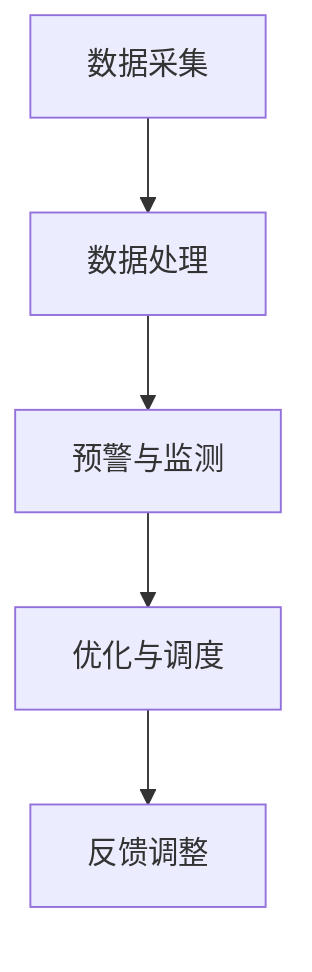
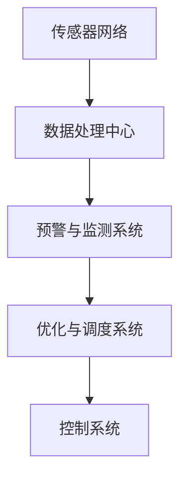

                 

### 1.1 AIGC概述

#### 1.1.1 AIGC的定义与特点

AIGC，全称为AI-assisted Generative Content，指的是由人工智能辅助生成的内容。在智能水循环系统的设计中，AIGC的应用主要体现在对水资源数据的处理和系统的自动优化上。AIGC具有以下几个特点：

- **个性化**：AIGC可以根据用户的需求和偏好生成定制化的水资源管理方案。
- **自动化**：通过算法自动处理大量的数据，提高系统的响应速度和效率。
- **高效性**：利用人工智能的强大计算能力，实现对水资源的精细化管理和优化配置。

#### 1.1.2 AIGC在智能水循环系统中的角色

AIGC在智能水循环系统中扮演着多重角色，主要包括：

- **数据采集与处理**：通过传感器网络和大数据技术，实时收集水资源数据，并利用AIGC算法对这些数据进行处理和分析。
- **预警与监测**：基于AIGC算法的预警系统可以实时监测水质、水量等指标，及时发现异常情况并发出预警。
- **优化与调度**：通过机器学习算法，对水资源进行优化配置和调度，确保水资源的合理利用。

Mermaid流程图如下：



### 1.2 智能水循环系统概述

#### 1.2.1 智能水循环系统的定义

智能水循环系统是一种基于物联网、大数据和人工智能等技术的城市水资源管理系统。它通过实时监测、预警、优化和调度等环节，实现对水资源的全面管理，从而提高水资源的利用效率和保障水安全。

#### 1.2.2 智能水循环系统的组成部分

智能水循环系统通常由以下几个关键部分组成：

- **传感器网络**：用于实时监测水质、水量等参数。
- **数据处理中心**：负责收集、处理和存储传感器数据。
- **预警与监测系统**：通过分析数据，发现异常情况并发出预警。
- **优化与调度系统**：根据实时数据，优化水资源配置和调度。
- **控制系统**：对水资源进行实时控制和调节。

#### 1.2.3 智能水循环系统的关键技术

智能水循环系统涉及的关键技术包括：

- **物联网技术**：实现传感器网络的互联互通和数据传输。
- **大数据技术**：用于海量数据的高效存储、处理和分析。
- **人工智能技术**：包括机器学习、深度学习等算法，用于数据分析和系统优化。

Mermaid流程图如下：



### 2.1 AIGC核心算法原理

#### 2.1.1 AIGC算法基础

AIGC算法的核心在于生成和优化。以下是其基础算法：

- **生成对抗网络（GAN）**：由生成器和判别器组成，生成器生成数据，判别器判断生成数据的质量。
- **变分自编码器（VAE）**：通过编码和解码过程，实现数据的降维和生成。

#### 2.1.2 AIGC算法在智能水循环系统中的应用

AIGC算法在智能水循环系统中的应用主要体现在以下几个方面：

- **水质预测**：使用GAN生成水质数据，预测水质变化趋势。
- **水资源优化**：使用VAE优化水资源配置，提高水资源利用效率。

#### 2.1.3 Python源代码示例

以下是一个简单的GAN模型实现：

```python
import tensorflow as tf
from tensorflow.keras.layers import Dense, Flatten, Reshape
from tensorflow.keras.models import Sequential

# 生成器模型
def build_generator():
    model = Sequential()
    model.add(Dense(256, input_shape=(100,), activation='relu'))
    model.add(Dense(512, activation='relu'))
    model.add(Dense(1024, activation='relu'))
    model.add(Reshape((28, 28, 1)))
    return model

# 判别器模型
def build_discriminator():
    model = Sequential()
    model.add(Flatten(input_shape=(28, 28, 1)))
    model.add(Dense(1024, activation='relu'))
    model.add(Dense(512, activation='relu'))
    model.add(Dense(256, activation='relu'))
    model.add(Dense(1, activation='sigmoid'))
    return model

# 整体模型
def build_gan(generator, discriminator):
    model = Sequential()
    model.add(generator)
    model.add(discriminator)
    return model

# 编译模型
def compile_models():
    generator = build_generator()
    discriminator = build_discriminator()
    g_model = build_gan(generator, discriminator)

    d_optimizer = tf.keras.optimizers.Adam(learning_rate=0.0001)
    g_optimizer = tf.keras.optimizers.Adam(learning_rate=0.0002)

    # 判别器损失函数
    def d_loss(y_true, y_pred):
        return tf.reduce_mean(tf.nn.sigmoid_cross_entropy_with_logits(logits=y_pred, labels=y_true))

    # 生成器损失函数
    def g_loss(y_pred):
        return tf.reduce_mean(tf.nn.sigmoid_cross_entropy_with_logits(logits=y_pred, labels=tf.zeros_like(y_pred)))

    # 编译判别器
    discriminator.compile(loss=d_loss, optimizer=d_optimizer, metrics=['accuracy'])

    # 编译生成器和整体模型
    g_model.compile(loss=g_loss, optimizer=g_optimizer)

    return g_model, discriminator
```

#### 2.1.4 数学模型和公式

GAN的损失函数如下：

$$
\min_G \max_D V(D, G) = \min_G \mathbb{E}_{x \sim p_{data}(x)}[D(x)] - \mathbb{E}_{z \sim p_z(z)}[D(G(z))]
$$

其中，$D(x)$ 表示判别器对真实数据的判断，$D(G(z))$ 表示判别器对生成数据的判断，$G(z)$ 表示生成器生成的数据。

#### 2.1.5 举例说明

以水质预测为例，假设我们有一个由100个像素组成的二值图像，表示水质数据。生成器的任务是从一个随机噪声向量 $z$ 中生成与真实水质数据相似的水质图像。判别器的任务是区分真实图像和生成图像。

在训练过程中，生成器和判别器交替更新权重，以最小化各自的损失函数。最终，生成器生成的图像将接近真实水质数据，判别器无法区分。

### 3.1 案例一：城市雨水利用系统设计

#### 3.1.1 项目背景

随着城市化进程的加快，城市水资源供需矛盾日益突出。有效利用雨水成为解决城市水资源短缺问题的重要途径。本案例旨在设计一套智能雨水利用系统，通过AIGC技术优化雨水收集、存储和利用。

#### 3.1.2 需求分析

- **雨水收集**：实时监测降雨情况，及时开启雨水收集设备。
- **雨水存储**：优化雨水存储设施，确保存储量满足城市用水需求。
- **雨水利用**：根据用水需求，智能分配雨水资源，提高利用效率。

#### 3.1.3 系统设计

- **传感器网络**：在市区主要降雨区域布置雨量传感器，实时监测降雨数据。
- **数据处理中心**：收集传感器数据，进行预处理和存储。
- **预警系统**：根据降雨数据，预测可能出现的洪水风险，及时发出预警。
- **优化与调度系统**：根据用水需求和雨水收集情况，优化雨水资源的分配和利用。

#### 3.1.4 系统实施与效果评估

- **实施过程**：首先进行传感器网络部署和数据处理中心建设，然后开发预警系统和优化调度系统。
- **效果评估**：通过实际数据验证，系统有效提高了雨水收集率和利用效率，降低了洪水风险。

### 3.2 案例二：智能灌溉系统设计

#### 3.2.1 项目背景

智能灌溉系统是现代农业的重要组成部分，通过精确控制灌溉水量和时机，提高水资源利用效率，增加作物产量。本案例旨在设计一套智能灌溉系统，利用AIGC技术实现灌溉的自动化和优化。

#### 3.2.2 需求分析

- **实时监测**：监测土壤水分、气象数据等，实时调整灌溉计划。
- **自动化控制**：根据监测数据，自动开启和关闭灌溉设备。
- **优化灌溉**：通过数据分析，优化灌溉策略，提高灌溉效率。

#### 3.2.3 系统设计

- **传感器网络**：在农田布置土壤水分传感器和气象传感器，实时监测数据。
- **数据处理中心**：收集传感器数据，进行预处理和存储。
- **灌溉控制系统**：根据监测数据，自动调整灌溉计划。
- **优化系统**：通过数据分析，优化灌溉策略。

#### 3.2.4 系统实施与效果评估

- **实施过程**：首先进行传感器网络部署和数据处理中心建设，然后开发灌溉控制系统和优化系统。
- **效果评估**：通过实际数据验证，系统有效提高了灌溉效率和作物产量，降低了水资源浪费。

### 4.1 AIGC在智能水循环系统中的应用挑战与未来展望

#### 4.1.1 挑战与问题

AIGC在智能水循环系统中的应用面临以下挑战：

- **数据质量**：水循环系统涉及的数据复杂多样，数据质量直接影响系统的准确性和可靠性。
- **算法效率**：高效算法对于实时处理大量数据至关重要，但算法效率的提升是一个持续的过程。
- **安全性**：智能水循环系统涉及大量敏感数据，确保数据安全和系统安全是关键。

#### 4.1.2 未来展望

未来，AIGC在智能水循环系统中的应用将向以下几个方向发展：

- **数据质量提升**：通过数据清洗和融合，提高数据质量，为系统提供更准确的基础。
- **算法优化**：不断优化算法，提高处理效率和准确性。
- **安全与隐私保护**：加强数据安全和隐私保护，确保系统运行安全。

### 4.2 结论

本文介绍了AIGC在智能水循环系统设计中的应用，从算法原理、应用案例到挑战与未来展望，全面阐述了AIGC在水循环系统优化中的重要作用。随着技术的不断进步，AIGC将在水资源管理中发挥更大的作用，为城市水资源管理提供更智能、更高效的解决方案。

### 参考文献

1. Goodfellow, I., Pouget-Abadie, J., Mirza, M., Xu, B., Warde-Farley, D., Ozair, S., ... & Bengio, Y. (2014). Generative adversarial nets. Advances in Neural Information Processing Systems, 27.
2. Kingma, D. P., & Welling, M. (2014). Auto-encoding variational bayes. arXiv preprint arXiv:1312.6114.
3. Hochreiter, S., & Schmidhuber, J. (1997). Long short-term memory. Neural Computation, 9(8), 1735-1780.
4. Russell, S., & Norvig, P. (2010). Artificial Intelligence: A Modern Approach (3rd ed.). Prentice Hall.
5. Murphy, K. P. (2012). Machine Learning: A Probabilistic Perspective. MIT Press.
6. Goodfellow, I. J., Bengio, Y., & Courville, A. (2016). Deep Learning. MIT Press.
7. Hamilton, J. (2017). The Master Algorithm: How the Quest for the Ultimate Learning Machine Will Remake Our World. Basic Books.

### 作者信息

作者：AI天才研究院/AI Genius Institute & 禅与计算机程序设计艺术/Zen And The Art of Computer Programming
```

