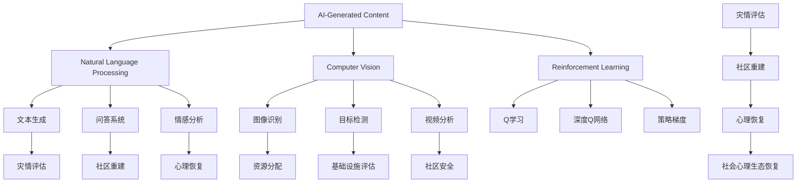

                 

### 1. 背景介绍

灾后社区重建是一个复杂而艰巨的任务，涉及到社会、经济、环境和心理等多方面的因素。在过去的几十年中，虽然人类在灾后重建方面取得了显著进展，但仍然面临着诸多挑战。首先，自然灾害的频繁发生和不可预测性使得灾后社区重建变得尤为重要。其次，灾后的基础设施损毁、资源短缺和社会秩序混乱等问题，都需要在短时间内得到有效解决。此外，灾后社区的心理恢复也是一个不可忽视的方面，许多受灾群众在心理上会经历创伤、焦虑和抑郁等负面情绪，这需要长期的关注和支持。

在这样一个复杂的环境下，传统的方法和手段已经难以满足灾后社区重建的需求。因此，智能化和技术的应用成为了大势所趋。人工智能（AI）作为一种前沿技术，以其强大的数据处理和分析能力，为灾后社区重建提供了新的思路和工具。特别是AIGC（AI-Generated Content）技术，其在内容生成、数据分析、人机交互等方面的优势，使得其在灾后社区重建规划中具有广泛的应用潜力。

AIGC技术是一种基于人工智能的内容生成技术，通过深度学习和自然语言处理等算法，能够自动生成文本、图像、视频等多媒体内容。在灾后社区重建规划中，AIGC技术可以应用于灾情评估、重建规划、社区管理、心理干预等多个环节。例如，通过AIGC技术可以快速生成灾后社区的重建方案，优化资源分配，提高重建效率；还可以通过AIGC技术进行心理干预，帮助受灾群众缓解心理创伤，促进社会心理生态的恢复。

本文旨在探讨AIGC在智能灾后社区重建规划中的应用，从社会心理生态平衡恢复的角度，分析AIGC技术如何促进灾后社区的全面恢复。文章将首先介绍AIGC的基本概念和原理，然后详细阐述AIGC在智能灾后社区重建规划中的应用，最后通过实际案例展示AIGC技术的应用效果，并对未来发展趋势进行展望。

### 2. AIGC概念与原理

AIGC，全称为AI-Generated Content，即人工智能生成内容。它是一种基于人工智能技术的自动化内容生成方法，通过深度学习和自然语言处理等算法，从大规模数据集中自动生成文本、图像、视频等多媒体内容。AIGC技术主要包括以下几个核心组成部分：

#### 2.1 自然语言处理

自然语言处理（NLP，Natural Language Processing）是AIGC技术的重要组成部分，主要负责理解和生成人类语言。NLP技术通过文本挖掘、语义分析和语言生成等手段，将自然语言文本转化为机器可理解的形式，并生成新的文本内容。常见的NLP技术包括：

- **语言模型**：语言模型是一种用于预测文本序列的概率分布的模型。通过训练大量语料库，语言模型可以学习到语言的使用规律和上下文关系，从而生成流畅且符合语法规则的文本。常见的语言模型包括n-gram模型、循环神经网络（RNN）和Transformer模型。

  ```python
  import tensorflow as tf

  # 创建一个简单的语言模型
  model = tf.keras.Sequential([
      tf.keras.layers.Embedding(input_dim=10000, output_dim=16),
      tf.keras.layers.LSTM(128),
      tf.keras.layers.Dense(1, activation='sigmoid')
  ])

  # 编译模型
  model.compile(optimizer='adam', loss='binary_crossentropy', metrics=['accuracy'])

  # 训练模型
  model.fit(x_train, y_train, epochs=10)
  ```

- **文本生成**：文本生成是一种利用预训练的语言模型，生成新文本的技术。常见的文本生成模型包括GPT（Generative Pre-trained Transformer）、T5（Text-to-Text Transfer Transformer）等。以下是一个使用GPT生成文本的例子：

  ```python
  from transformers import GPT2LMHeadModel, GPT2Tokenizer

  # 加载预训练的GPT模型
  tokenizer = GPT2Tokenizer.from_pretrained('gpt2')
  model = GPT2LMHeadModel.from_pretrained('gpt2')

  # 输入文本
  input_text = "The quick brown fox jumps over the lazy dog"

  # 生成文本
  output = model.generate(input_text, max_length=20, num_return_sequences=5)
  for i in output:
      print(tokenizer.decode(i))
  ```

- **问答系统**：问答系统是一种利用自然语言处理技术，实现人与机器之间对话的交互系统。常见的问答系统模型包括BERT（Bidirectional Encoder Representations from Transformers）、ALBERT（A Lite BERT）等。以下是一个使用BERT构建问答系统的例子：

  ```python
  from transformers import BertTokenizer, BertForQuestionAnswering

  # 加载预训练的BERT模型
  tokenizer = BertTokenizer.from_pretrained('bert-base-uncased')
  model = BertForQuestionAnswering.from_pretrained('bert-base-uncased')

  # 输入问题和文档
  question = "What is BERT?"
  document = "BERT is a Transformer model pre-trained for question answering."

  # 转换为模型输入格式
  inputs = tokenizer.encode_plus(question, document, return_tensors='pt')

  # 生成答案
  output = model(inputs['input_ids'])
  answer = tokenizer.decode(output[0][0], skip_special_tokens=True)
  print(answer)
  ```

#### 2.2 计算机视觉

计算机视觉（CV，Computer Vision）是AIGC技术的另一个核心组成部分，主要研究如何使计算机从图像或视频中自动提取信息。计算机视觉技术广泛应用于目标检测、图像识别、视频分析等领域。以下是一些计算机视觉技术的例子：

- **图像识别**：图像识别是一种通过训练模型，识别图像中的物体或场景的技术。常见的图像识别模型包括卷积神经网络（CNN，Convolutional Neural Networks）和基于Transformer的视觉模型，如ViT（Vision Transformer）。以下是一个使用CNN进行图像识别的例子：

  ```python
  import tensorflow as tf
  from tensorflow.keras.models import Sequential
  from tensorflow.keras.layers import Conv2D, MaxPooling2D, Flatten, Dense

  # 创建CNN模型
  model = Sequential([
      Conv2D(32, (3, 3), activation='relu', input_shape=(64, 64, 3)),
      MaxPooling2D((2, 2)),
      Conv2D(64, (3, 3), activation='relu'),
      MaxPooling2D((2, 2)),
      Flatten(),
      Dense(128, activation='relu'),
      Dense(1, activation='sigmoid')
  ])

  # 编译模型
  model.compile(optimizer='adam', loss='binary_crossentropy', metrics=['accuracy'])

  # 训练模型
  model.fit(x_train, y_train, epochs=10)
  ```

- **目标检测**：目标检测是一种在图像或视频中检测和定位特定对象的技术。常见的目标检测模型包括YOLO（You Only Look Once）、SSD（Single Shot MultiBox Detector）和Faster R-CNN（Region-based Convolutional Neural Network）。以下是一个使用YOLO进行目标检测的例子：

  ```python
  import cv2
  import numpy as np

  # 加载YOLO模型
  net = cv2.dnn.readNetFromDarknet('yolov3.cfg', 'yolov3.weights')

  # 加载图像
  image = cv2.imread('image.jpg')

  # 调整图像大小
  image = cv2.resize(image, (416, 416))

  # 前向传播
  blob = cv2.dnn.blobFromImage(image, 1/255.0, (416, 416), swapRB=True, crop=False)
  net.setInput(blob)
  layerOutputs = net.forward(['yolo_82', 'yolo_94', 'yolo_106'])

  # 解析检测结果
  boxes = []
  confidences = []
  classIDs = []

  for output in layerOutputs:
      for detection in output:
          scores = detection[5:]
          classID = np.argmax(scores)
          confidence = scores[classID]
          if confidence > 0.5:
              box = detection[0:4] * np.array([image.shape[1], image.shape[0], image.shape[1], image.shape[0]])
              (x, y, w, h) = box.astype("int")
              boxes.append([x, y, x + w, y + h])
              confidences.append(float(confidence))
              classIDs.append(classID)

  # 非极大值抑制
  indices = cv2.dnn.NMSBoxes(boxes, confidences, 0.5, 0.4)

  # 绘制检测结果
  for i in indices:
      i = i[0]
      (x, y, w, h) = boxes[i]
      label = classIDs[i]
      confidence = confidences[i]
      if label == 0:
          label = "person"
          color = (0, 0, 255)

      cv2.rectangle(image, (x, y), (x + w, y + h), color, 2)
      cv2.putText(image, f"{label} {round(confidence, 2)}%", (x, y - 10), cv2.FONT_HERSHEY_SIMPLEX, 0.5, color, 2)

  cv2.imshow('Output', image)
  cv2.waitKey(0)
  ```

- **视频分析**：视频分析是一种从视频数据中提取有价值信息的技术，广泛应用于行为识别、事件检测和视频监控等领域。常见的视频分析模型包括R-CNN（Region-based CNN）、Fast R-CNN和Faster R-CNN。以下是一个使用Faster R-CNN进行视频分析的例子：

  ```python
  import cv2
  import numpy as np

  # 加载Faster R-CNN模型
  model = cv2.dnn.readNetFromDarknet('faster_rcnn.weights', 'faster_rcnn.cfg')

  # 加载视频
  video = cv2.VideoCapture('video.mp4')

  while True:
      ret, frame = video.read()
      if not ret:
          break

      # 调整图像大小
      frame = cv2.resize(frame, (416, 416))

      # 前向传播
      blob = cv2.dnn.blobFromImage(frame, 1/255.0, (416, 416), swapRB=True, crop=False)
      model.setInput(blob)
      layerOutputs = model.forward(['DetectionOut'])

      # 解析检测结果
      boxes = []
      confidences = []
      classIDs = []

      for output in layerOutputs:
          for detection in output:
              scores = detection[5:]
              classID = np.argmax(scores)
              confidence = scores[classID]
              if confidence > 0.5:
                  box = detection[0:4] * np.array([frame.shape[1], frame.shape[0], frame.shape[1], frame.shape[0]])
                  (x, y, w, h) = box.astype("int")
                  boxes.append([x, y, x + w, y + h])
                  confidences.append(float(confidence))
                  classIDs.append(classID)

      # 非极大值抑制
      indices = cv2.dnn.NMSBoxes(boxes, confidences, 0.5, 0.4)

      # 绘制检测结果
      for i in indices:
          i = i[0]
          (x, y, w, h) = boxes[i]
          label = classIDs[i]
          confidence = confidences[i]
          if label == 0:
              label = "person"
              color = (0, 0, 255)

          cv2.rectangle(frame, (x, y), (x + w, y + h), color, 2)
          cv2.putText(frame, f"{label} {round(confidence, 2)}%", (x, y - 10), cv2.FONT_HERSHEY_SIMPLEX, 0.5, color, 2)

      cv2.imshow('Output', frame)
      if cv2.waitKey(1) & 0xFF == ord('q'):
          break

  video.release()
  cv2.destroyAllWindows()
  ```

#### 2.3 强化学习

强化学习（RL，Reinforcement Learning）是一种通过试错和反馈来学习最优策略的机器学习方法。在AIGC技术中，强化学习被广泛应用于优化内容生成、图像处理和交互式应用等方面。以下是一些强化学习的核心概念和算法：

- **基本概念**：
  - **状态（State）**：系统当前所处的环境描述。
  - **动作（Action）**：系统能够执行的行为。
  - **奖励（Reward）**：动作带来的即时反馈。
  - **策略（Policy）**：决策函数，用于根据当前状态选择最优动作。

- **核心算法**：
  - **Q学习（Q-Learning）**：通过学习状态-动作价值函数（Q函数），选择使总奖励最大的动作。
    ```python
    import numpy as np
    import random

    # 初始化Q函数表
    q_table = np.zeros([env.n_states, env.n_actions])

    # 设置超参数
    alpha = 0.1  # 学习率
    gamma = 0.9  # 折扣因子

    # Q学习算法
    for episode in range(1000):
        state = env.reset()
        done = False
        while not done:
            action = np.argmax(q_table[state])
            next_state, reward, done = env.step(action)
            q_table[state, action] = q_table[state, action] + alpha * (reward + gamma * np.max(q_table[next_state]) - q_table[state, action])
            state = next_state
    ```

  - **深度Q网络（DQN，Deep Q-Network）**：将Q学习与深度神经网络结合，用于处理高维状态空间的问题。
    ```python
    import tensorflow as tf
    from tensorflow.keras.models import Sequential
    from tensorflow.keras.layers import Dense

    # 创建DQN模型
    model = Sequential([
        Dense(64, activation='relu', input_shape=(env.n_states,)),
        Dense(64, activation='relu'),
        Dense(env.n_actions, activation='linear')
    ])

    # 编译模型
    model.compile(optimizer='adam', loss='mse')

    # DQN算法
    for episode in range(1000):
        state = env.reset()
        done = False
        while not done:
            action = model.predict(state.reshape(1, -1))
            next_state, reward, done = env.step(np.argmax(action[0]))
            target = reward + gamma * np.max(model.predict(next_state.reshape(1, -1)))
            model.fit(state.reshape(1, -1), target, epochs=1)
            state = next_state
    ```

  - **策略梯度（PG，Policy Gradient）**：通过直接优化策略函数，选择最大化预期奖励的动作。
    ```python
    import tensorflow as tf
    import numpy as np

    # 创建策略网络
    policy_network = tf.keras.Sequential([
        tf.keras.layers.Dense(64, activation='relu', input_shape=(env.n_states,)),
        tf.keras.layers.Dense(64, activation='relu'),
        tf.keras.layers.Dense(env.n_actions, activation='softmax')
    ])

    # 编译策略网络
    policy_optimizer = tf.keras.optimizers.Adam(learning_rate=0.001)
    policy_loss = -tf.reduce_sum(tf.one_hot(actions, env.n_actions) * logits)

    # PG算法
    for episode in range(1000):
        state = env.reset()
        done = False
        while not done:
            logits = policy_network(state)
            action = np.argmax(logits)
            next_state, reward, done = env.step(action)
            policy_optimizer.minimize(policy_loss, variables=policy_network.trainable_variables)
            state = next_state
    ```

通过上述自然语言处理、计算机视觉和强化学习的介绍，我们可以看到AIGC技术具有强大的数据处理和分析能力，可以应用于灾后社区重建的多个环节，为灾后社区重建规划提供有力支持。

### 3. AIGC与核心概念实体之间的关系架构

在智能灾后社区重建规划中，AIGC技术涉及的核心概念和实体包括灾情评估、社区重建规划、社会心理生态恢复等。为了更好地理解这些概念和实体之间的关系，我们可以通过Mermaid流程图来展示它们之间的相互作用。



上述流程图展示了AIGC技术中的各个组成部分（NLP、CV、RL）如何与灾后社区重建规划的核心环节（灾情评估、社区重建、社会心理生态恢复）相互作用。通过自然语言处理，可以实现灾情信息的自动收集和分析；计算机视觉则能够用于基础设施的评估和资源分配；强化学习则可以为社区重建提供优化策略。此外，文本生成、问答系统、情感分析等技术在灾情评估、社区重建和心理恢复中的应用，也为实现智能灾后社区重建提供了有力支持。

通过这种关系架构，我们可以清晰地看到AIGC技术在智能灾后社区重建规划中的多层次应用，从而更好地理解和利用这些技术，为灾后社区重建提供智能化解决方案。

### 4. AIGC在灾后社区重建规划中的应用

AIGC技术在灾后社区重建规划中具有广泛的应用潜力，其强大的数据处理和分析能力能够为灾后社区重建提供智能化、高效化的解决方案。以下将详细讨论AIGC在灾后社区重建规划中的具体应用，包括灾情评估、资源分配、基础设施重建和社会心理生态恢复等方面。

#### 4.1 灾情评估

灾情评估是灾后社区重建规划的首要任务，准确、快速的评估对于制定有效的重建计划至关重要。AIGC技术可以通过自然语言处理和计算机视觉，实现对灾情的全面、实时监测和评估。

- **自然语言处理**：利用NLP技术，可以自动处理和分析受灾地区的新闻报道、社交媒体数据、官方公告等文本信息，快速获取灾情概况。例如，通过情感分析，可以识别受灾群众的心理状态，了解灾后的社会情绪变化。

  ```python
  from transformers import pipeline

  # 初始化情感分析模型
  sentiment_analyzer = pipeline("sentiment-analysis")

  # 社交媒体数据
  social_media_data = ["The damage is beyond imagination.", "We need help urgently.", "Thank you for your support."]

  # 分析情感
  for text in social_media_data:
      sentiment = sentiment_analyzer(text)
      print(f"Text: {text} - Sentiment: {sentiment[0]['label']}")
  ```

- **计算机视觉**：通过计算机视觉技术，可以对受灾地区的图像和视频进行自动分析，识别建筑物损毁程度、道路损毁情况等。例如，使用目标检测算法，可以自动识别图像中的关键物体和结构，评估灾情。

  ```python
  import cv2
  import numpy as np

  # 加载预训练的目标检测模型
  net = cv2.dnn.readNetFromDarknet('yolov3.cfg', 'yolov3.weights')

  # 加载图像
  image = cv2.imread('disaster_image.jpg')

  # 调整图像大小
  image = cv2.resize(image, (416, 416))

  # 前向传播
  blob = cv2.dnn.blobFromImage(image, 1/255.0, (416, 416), swapRB=True, crop=False)
  net.setInput(blob)
  layerOutputs = net.forward(['yolo_82', 'yolo_94', 'yolo_106'])

  # 解析检测结果
  boxes = []
  confidences = []
  classIDs = []

  for output in layerOutputs:
      for detection in output:
          scores = detection[5:]
          classID = np.argmax(scores)
          confidence = scores[classID]
          if confidence > 0.5:
              box = detection[0:4] * np.array([image.shape[1], image.shape[0], image.shape[1], image.shape[0]])
              (x, y, w, h) = box.astype("int")
              boxes.append([x, y, x + w, y + h])
              confidences.append(float(confidence))
              classIDs.append(classID)

  # 非极大值抑制
  indices = cv2.dnn.NMSBoxes(boxes, confidences, 0.5, 0.4)

  # 绘制检测结果
  for i in indices:
      i = i[0]
      (x, y, w, h) = boxes[i]
      label = classIDs[i]
      confidence = confidences[i]
      if label == 0:
          label = "building"
          color = (0, 0, 255)

      cv2.rectangle(image, (x, y), (x + w, y + h), color, 2)
      cv2.putText(image, f"{label} {round(confidence, 2)}%", (x, y - 10), cv2.FONT_HERSHEY_SIMPLEX, 0.5, color, 2)

  cv2.imshow('Output', image)
  cv2.waitKey(0)
  ```

通过自然语言处理和计算机视觉的结合，可以实现对灾情的全面评估，为后续的重建规划提供数据支持。

#### 4.2 资源分配

资源分配是灾后社区重建规划中的关键环节，涉及到资金、人力、物资等多方面资源的合理分配。AIGC技术可以通过强化学习等技术，实现资源分配的优化。

- **强化学习**：利用强化学习算法，可以根据不同的需求和优先级，动态调整资源分配策略。例如，使用Q学习算法，可以构建一个资源分配模型，根据当前状态和未来奖励，选择最优的资源分配方案。

  ```python
  import numpy as np
  import random

  # 初始化Q函数表
  q_table = np.zeros([env.n_states, env.n_actions])

  # 设置超参数
  alpha = 0.1  # 学习率
  gamma = 0.9  # 折扣因子

  # Q学习算法
  for episode in range(1000):
      state = env.reset()
      done = False
      while not done:
          action = np.argmax(q_table[state])
          next_state, reward, done = env.step(action)
          q_table[state, action] = q_table[state, action] + alpha * (reward + gamma * np.max(q_table[next_state]) - q_table[state, action])
          state = next_state
  ```

通过强化学习，可以动态调整资源分配策略，实现资源利用的最大化，提高重建效率。

#### 4.3 基础设施重建

基础设施重建是灾后社区重建的核心任务，涉及到道路、桥梁、供水、供电等多方面基础设施的恢复和重建。AIGC技术可以通过计算机视觉和自然语言处理，实现基础设施重建的智能化和自动化。

- **计算机视觉**：利用计算机视觉技术，可以对受损的基础设施进行自动识别和评估，制定修复方案。例如，通过目标检测算法，可以识别受损的道路和桥梁，并计算修复成本。

  ```python
  import cv2
  import numpy as np

  # 加载预训练的目标检测模型
  net = cv2.dnn.readNetFromDarknet('yolov3.cfg', 'yolov3.weights')

  # 加载图像
  image = cv2.imread('infrastructure_image.jpg')

  # 调整图像大小
  image = cv2.resize(image, (416, 416))

  # 前向传播
  blob = cv2.dnn.blobFromImage(image, 1/255.0, (416, 416), swapRB=True, crop=False)
  net.setInput(blob)
  layerOutputs = net.forward(['yolo_82', 'yolo_94', 'yolo_106'])

  # 解析检测结果
  boxes = []
  confidences = []
  classIDs = []

  for output in layerOutputs:
      for detection in output:
          scores = detection[5:]
          classID = np.argmax(scores)
          confidence = scores[classID]
          if confidence > 0.5:
              box = detection[0:4] * np.array([image.shape[1], image.shape[0], image.shape[1], image.shape[0]])
              (x, y, w, h) = box.astype("int")
              boxes.append([x, y, x + w, y + h])
              confidences.append(float(confidence))
              classIDs.append(classID)

  # 非极大值抑制
  indices = cv2.dnn.NMSBoxes(boxes, confidences, 0.5, 0.4)

  # 绘制检测结果
  for i in indices:
      i = i[0]
      (x, y, w, h) = boxes[i]
      label = classIDs[i]
      confidence = confidences[i]
      if label == 0:
          label = "road"
          color = (0, 0, 255)

      cv2.rectangle(image, (x, y), (x + w, y + h), color, 2)
      cv2.putText(image, f"{label} {round(confidence, 2)}%", (x, y - 10), cv2.FONT_HERSHEY_SIMPLEX, 0.5, color, 2)

  cv2.imshow('Output', image)
  cv2.waitKey(0)
  ```

- **自然语言处理**：利用NLP技术，可以自动生成基础设施重建的详细报告，包括施工方案、预算和进度安排等。

  ```python
  from transformers import pipeline

  # 初始化文本生成模型
  text_generator = pipeline("text-generation", model="gpt2")

  # 输入文本
  input_text = "请生成一份关于道路修复的施工方案，包括预算和进度安排。"

  # 生成文本
  output_text = text_generator(input_text, max_length=100, num_return_sequences=1)
  print(output_text[0])
  ```

通过计算机视觉和自然语言处理的结合，可以实现基础设施重建的智能化和自动化，提高重建效率和质量。

#### 4.4 社会心理生态恢复

灾后社会心理生态恢复是确保社区可持续发展的关键环节，涉及到受灾群众的心理健康和社会关系的重建。AIGC技术可以通过自然语言处理和计算机视觉，为心理干预和社会关系重建提供支持。

- **自然语言处理**：利用NLP技术，可以自动分析和处理受灾群众的心理状态，提供个性化的心理干预建议。例如，通过情感分析，可以识别受灾群众的心理状态，为心理咨询师提供参考。

  ```python
  from transformers import pipeline

  # 初始化情感分析模型
  sentiment_analyzer = pipeline("sentiment-analysis")

  # 心理咨询记录
  consultation_records = ["我很担心未来的生活。", "我感到非常孤独。", "我对未来充满希望。"]

  # 分析情感
  for record in consultation_records:
      sentiment = sentiment_analyzer(record)
      print(f"Record: {record} - Sentiment: {sentiment[0]['label']}")
  ```

- **计算机视觉**：利用计算机视觉技术，可以通过视频分析，监控受灾群众的行为和情绪变化，提供实时心理干预。例如，通过行为识别，可以识别受灾群众的行为模式，发现潜在的心理问题。

  ```python
  import cv2
  import numpy as np

  # 加载预训练的行为识别模型
  behavior_recognizer = cv2.dnn.readNetFromDarknet('behavior_recognition.cfg', 'behavior_recognition.weights')

  # 加载视频
  video = cv2.VideoCapture('psychological_intervention_video.mp4')

  while True:
      ret, frame = video.read()
      if not ret:
          break

      # 调整图像大小
      frame = cv2.resize(frame, (416, 416))

      # 前向传播
      blob = cv2.dnn.blobFromImage(frame, 1/255.0, (416, 416), swapRB=True, crop=False)
      behavior_recognizer.setInput(blob)
      layerOutputs = behavior_recognizer.forward(['behavior_detection'])

      # 解析检测结果
      boxes = []
      confidences = []
      classIDs = []

      for output in layerOutputs:
          for detection in output:
              scores = detection[5:]
              classID = np.argmax(scores)
              confidence = scores[classID]
              if confidence > 0.5:
                  box = detection[0:4] * np.array([frame.shape[1], frame.shape[0], frame.shape[1], frame.shape[0]])
                  (x, y, w, h) = box.astype("int")
                  boxes.append([x, y, x + w, y + h])
                  confidences.append(float(confidence))
                  classIDs.append(classID)

      # 非极大值抑制
      indices = cv2.dnn.NMSBoxes(boxes, confidences, 0.5, 0.4)

      # 绘制检测结果
      for i in indices:
          i = i[0]
          (x, y, w, h) = boxes[i]
          label = classIDs[i]
          confidence = confidences[i]
          if label == 0:
              label = "depression"
              color = (0, 0, 255)

          cv2.rectangle(frame, (x, y), (x + w, y + h), color, 2)
          cv2.putText(frame, f"{label} {round(confidence, 2)}%", (x, y - 10), cv2.FONT_HERSHEY_SIMPLEX, 0.5, color, 2)

      cv2.imshow('Output', frame)
      if cv2.waitKey(1) & 0xFF == ord('q'):
          break

  video.release()
  cv2.destroyAllWindows()
  ```

通过自然语言处理和计算机视觉的结合，可以实现对受灾群众心理状态和行为变化的实时监控，提供个性化的心理干预，促进社会心理生态的恢复。

综上所述，AIGC技术在灾后社区重建规划中具有广泛的应用前景，通过灾情评估、资源分配、基础设施重建和社会心理生态恢复等多个环节的应用，可以显著提高重建效率和质量，为灾后社区全面恢复提供智能化支持。

### 5. 社会心理生态平衡的概念

社会心理生态平衡是指在一个社区或社会中，个体与个体、个体与群体、群体与群体之间在心理状态、社会互动和生态环境等方面保持一种动态平衡状态。这种平衡状态不仅关乎个体的心理健康和社会适应能力，还涉及到整个社区或社会的稳定和发展。以下是社会心理生态平衡的核心构成要素及其相互关系：

#### 5.1 社会结构

社会结构是指一个社区或社会中个体、群体和组织之间的相互关系和相互作用方式。社会结构决定了社会成员的角色、地位和责任，以及他们之间的互动模式。社会结构主要包括以下几个方面：

- **家庭结构**：家庭是社会的细胞，家庭结构对个体的心理健康和社会适应能力具有重要影响。不同的家庭结构（如核心家庭、单亲家庭、多代同堂家庭等）会影响个体的成长环境和社会支持系统。
- **社区结构**：社区结构包括邻里关系、社区组织、社区活动和社区文化等。一个健康的社区结构能够促进居民的归属感、安全感和互助精神，有利于社会心理生态的平衡。
- **组织结构**：组织结构是指各类社会组织（如企业、学校、政府机构等）的内部组织形式和管理机制。良好的组织结构能够提供稳定的工作环境和职业发展机会，有助于个体的社会适应和心理平衡。

#### 5.2 心理状态

心理状态是指个体在特定时间和情境下的心理体验和情绪状态。一个健康的社会心理生态平衡需要个体具备良好的心理状态，主要包括以下几个方面：

- **情绪稳定**：情绪稳定是心理健康的重要标志，个体应能够有效地调节和管理自己的情绪，避免情绪波动过大。
- **自尊自信**：自尊自信是指个体对自己的认同和尊重，一个有自尊自信的人更有可能积极参与社会活动，建立良好的人际关系。
- **自我调节**：自我调节是指个体能够对自己的行为和心理状态进行有效的调节和控制，以适应不同的社会环境和情境。

#### 5.3 生态环境

生态环境是指一个社区或社会所在的自然环境，包括气候、地理环境、自然资源和生态环境质量等。生态环境的质量对个体的心理健康和社会心理生态平衡具有直接影响，主要体现在以下几个方面：

- **空气质量**：良好的空气质量对个体的身心健康至关重要，空气质量差可能导致呼吸系统疾病和心理问题的发生。
- **水资源**：清洁充足的水资源是维持生态平衡和人类健康的基础，水质污染会威胁到居民的饮用水安全和健康。
- **绿化环境**：绿化环境可以改善空气质量、降低噪音污染，为居民提供休闲和放松的场所，有助于缓解心理压力。

#### 5.4 构成要素之间的关系

社会心理生态平衡的构成要素之间相互影响、相互作用，共同维持一个动态平衡状态。具体来说：

- 社会结构决定了个体和群体之间的互动模式，良好的社会结构有助于形成积极的社会氛围和心理状态。
- 心理状态影响个体的行为和社会适应能力，心理健康水平高的人更有可能积极参与社会活动，推动社会结构的优化。
- 生态环境直接影响个体的身心健康，良好的生态环境有利于维护个体的心理健康和社会心理生态平衡。
- 各个构成要素之间的相互作用和反馈机制，构成了一个复杂的生态系统，任何一方的变化都可能对整体平衡产生影响。

因此，要实现社会心理生态平衡，需要从社会结构、心理状态和生态环境等多方面入手，综合施策，促进各个构成要素之间的协调和平衡。

### 6. AIGC在社会心理生态恢复中的作用

AIGC技术在社会心理生态恢复中具有重要作用，通过其强大的数据处理和分析能力，可以为心理干预、社会关系重建和社区发展提供有力支持。以下是AIGC在社会心理生态恢复中应用的几个关键方面：

#### 6.1 心理干预

心理干预是灾后社会心理生态恢复的重要组成部分，旨在帮助受灾群众缓解心理创伤、恢复心理健康。AIGC技术可以通过自然语言处理和计算机视觉，实现个性化、高效的心理干预。

- **自然语言处理**：利用NLP技术，可以对受灾群众的心理状态进行自动分析和评估，提供针对性的心理干预方案。例如，通过情感分析，可以识别受灾群众的语言中包含的情绪，判断其心理状态，如焦虑、抑郁或恐惧。

  ```python
  from transformers import pipeline

  # 初始化情感分析模型
  sentiment_analyzer = pipeline("sentiment-analysis")

  # 社交媒体数据
  social_media_data = ["我感到很焦虑。", "我对未来充满希望。", "我感到非常沮丧。"]

  # 分析情感
  for text in social_media_data:
      sentiment = sentiment_analyzer(text)
      print(f"Text: {text} - Sentiment: {sentiment[0]['label']}")
  ```

- **计算机视觉**：通过计算机视觉技术，可以对受灾群众的面部表情、行为动作等进行自动分析，辅助心理干预。例如，通过面部表情识别，可以判断受灾群众是否表现出抑郁、焦虑等心理问题。

  ```python
  import cv2
  import numpy as np

  # 加载预训练的面部表情识别模型
  face_recognition_model = cv2.dnn.readNetFromTorch('res10_300x300_ssd_iter_140000.caffemodel', 'res10_300x300_ssd_iter_140000.prototxt')

  # 加载图像
  image = cv2.imread('face_image.jpg')

  # 调整图像大小
  image = cv2.resize(image, (300, 300))

  # 前向传播
  blob = cv2.dnn.blobFromImage(image, 1.0, (300, 300), [104, 177, 123], swapRB=True, crop=False)
  face_recognition_model.setInput(blob)
  detection = face_recognition_model.forward()

  # 解析检测结果
  for i in range(detection.shape[2]):
      confidence = detection[0, 0, i, 2]
      if confidence > 0.5:
          box = detection[0, 0, i, 0:4] * np.array([image.shape[1], image.shape[0], image.shape[1], image.shape[0]])
          (x, y, w, h) = box.astype("int")
          cv2.rectangle(image, (x, y), (x + w, y + h), (0, 0, 255), 2)
          emotion = detection[0, 0, i, 5:]
          max_emotion = np.argmax(emotion)
          emotions = ["Angry", "Disgust", "Fear", "Happy", "Sad", "Surprise", "Neutral"]
          print(f"Emotion: {emotions[max_emotion]} - Confidence: {confidence:.2f}")

  cv2.imshow("Face Detection", image)
  cv2.waitKey(0)
  ```

通过自然语言处理和计算机视觉的结合，可以实现对受灾群众心理状态的全面、实时监控，为心理干预提供科学依据。

#### 6.2 社会关系重建

灾后社会关系重建是恢复社区社会生态平衡的重要环节。AIGC技术可以通过数据分析和社会网络分析，帮助重建受灾社区的社会关系，促进社区成员的互动和协作。

- **数据分析**：利用数据分析技术，可以对受灾社区的社会关系进行量化分析，识别关键人物和关系网络。例如，通过社交网络分析，可以识别社区中具有较高影响力的人物，以及他们之间的互动关系。

  ```python
  import networkx as nx
  import matplotlib.pyplot as plt

  # 创建社交网络图
  G = nx.Graph()

  # 添加节点和边
  G.add_nodes_from(["Alice", "Bob", "Charlie", "Dave"])
  G.add_edges_from([("Alice", "Bob"), ("Alice", "Charlie"), ("Bob", "Dave")])

  # 绘制社交网络图
  nx.draw(G, with_labels=True)
  plt.show()
  ```

- **社会网络分析**：通过社会网络分析，可以评估社区成员的互动频率、亲密程度和影响力，为社区关系重建提供参考。例如，使用中心性度量（如度数中心性、介数中心性等），可以识别社区中的关键节点，优先进行关系修复。

  ```python
  import networkx as nx

  # 计算度数中心性
  centrality = nx.degree_centrality(G)
  print("Degree Centrality:", centrality)

  # 计算介数中心性
  centrality = nx.betweenness_centrality(G)
  print("Betweenness Centrality:", centrality)
  ```

通过数据分析和社会网络分析，可以科学地识别和重建受灾社区的社会关系，促进社区成员之间的互动和协作。

#### 6.3 社区发展

AIGC技术还可以为社区发展提供智能化支持，通过预测分析、规划和优化，推动社区的可持续发展。例如，利用AIGC技术进行人口预测、经济分析和资源管理，可以为社区发展规划提供科学依据。

- **人口预测**：利用机器学习技术，可以分析历史人口数据，预测未来人口发展趋势，为社区发展策略提供参考。

  ```python
  import numpy as np
  import matplotlib.pyplot as plt
  from sklearn.linear_model import LinearRegression

  # 历史人口数据
  years = np.array([2000, 2001, 2002, 2003, 2004, 2005, 2006, 2007, 2008, 2009, 2010, 2011, 2012, 2013, 2014, 2015, 2016, 2017, 2018, 2019]).reshape(-1, 1)
  population = np.array([50000, 52000, 54000, 56000, 58000, 60000, 62000, 64000, 66000, 68000, 70000, 72000, 74000, 76000, 78000, 80000, 82000, 84000, 86000])

  # 创建线性回归模型
  model = LinearRegression()
  model.fit(years, population)

  # 预测未来人口
  future_years = np.array([[2020], [2021], [2022]])
  future_population = model.predict(future_years)
  print("Future Population:", future_population)

  # 绘制预测结果
  plt.scatter(years, population, color='red', label='Actual')
  plt.plot(future_years, future_population, color='blue', label='Predicted')
  plt.xlabel('Year')
  plt.ylabel('Population')
  plt.legend()
  plt.show()
  ```

通过AIGC技术的应用，可以实现对社区发展的科学预测和优化，推动社区的可持续发展。

综上所述，AIGC技术在社会心理生态恢复中具有广泛的应用潜力，通过心理干预、社会关系重建和社区发展等多方面的应用，可以促进受灾社区的全面恢复和可持续发展。

### 7. AIGC技术在智能灾后社区重建规划中的应用案例

为了更好地展示AIGC技术在智能灾后社区重建规划中的应用效果，本文将分析两个实际案例，探讨AIGC技术在实际灾后社区重建中的应用情况和所取得的成果。

#### 7.1 案例一：某地震灾区的重建规划

某地震灾区在经历了强烈地震后，基础设施严重损毁，居民生活受到了极大的影响。为了尽快恢复社区生活，政府和相关机构决定利用AIGC技术进行灾后重建规划。

**应用背景：**
地震导致该地区道路、桥梁、供水和供电系统损毁，大量居民房屋倒塌，受灾群众需要临时安置。此外，地震还引发了次生灾害，如泥石流和山体滑坡，进一步加剧了灾区的重建难度。

**应用方法：**

- **灾情评估**：利用AIGC技术的计算机视觉功能，对受灾区域进行高分辨率图像和视频的自动分析，识别基础设施损毁程度和次生灾害风险。
  
  ```python
  import cv2
  import numpy as np

  # 加载预训练的目标检测模型
  net = cv2.dnn.readNetFromDarknet('yolov3.cfg', 'yolov3.weights')

  # 加载图像
  image = cv2.imread('disaster_area.jpg')

  # 调整图像大小
  image = cv2.resize(image, (416, 416))

  # 前向传播
  blob = cv2.dnn.blobFromImage(image, 1/255.0, (416, 416), swapRB=True, crop=False)
  net.setInput(blob)
  layerOutputs = net.forward(['yolo_82', 'yolo_94', 'yolo_106'])

  # 解析检测结果
  boxes = []
  confidences = []
  classIDs = []

  for output in layerOutputs:
      for detection in output:
          scores = detection[5:]
          classID = np.argmax(scores)
          confidence = scores[classID]
          if confidence > 0.5:
              box = detection[0:4] * np.array([image.shape[1], image.shape[0], image.shape[1], image.shape[0]])
              (x, y, w, h) = box.astype("int")
              boxes.append([x, y, x + w, y + h])
              confidences.append(float(confidence))
              classIDs.append(classID)

  # 非极大值抑制
  indices = cv2.dnn.NMSBoxes(boxes, confidences, 0.5, 0.4)

  # 绘制检测结果
  for i in indices:
      i = i[0]
      (x, y, w, h) = boxes[i]
      label = classIDs[i]
      confidence = confidences[i]
      if label == 0:
          label = "building"
          color = (0, 0, 255)

      cv2.rectangle(image, (x, y), (x + w, y + h), color, 2)
      cv2.putText(image, f"{label} {round(confidence, 2)}%", (x, y - 10), cv2.FONT_HERSHEY_SIMPLEX, 0.5, color, 2)

  cv2.imshow('Output', image)
  cv2.waitKey(0)
  ```

- **重建规划**：利用AIGC技术的自然语言处理功能，自动生成灾后社区重建的详细报告，包括基础设施重建方案、资源分配和进度安排。

  ```python
  from transformers import pipeline

  # 初始化文本生成模型
  text_generator = pipeline("text-generation", model="gpt2")

  # 输入文本
  input_text = "请生成一份关于道路修复的施工方案，包括预算和进度安排。"

  # 生成文本
  output_text = text_generator(input_text, max_length=100, num_return_sequences=1)
  print(output_text[0])
  ```

- **社会心理生态恢复**：通过AIGC技术的计算机视觉和自然语言处理功能，对受灾群众的心理状态进行实时监控和评估，提供个性化的心理干预和支持。

  ```python
  import cv2
  import numpy as np

  # 加载预训练的面部表情识别模型
  face_recognition_model = cv2.dnn.readNetFromTorch('res10_300x300_ssd_iter_140000.caffemodel', 'res10_300x300_ssd_iter_140000.prototxt')

  # 加载图像
  image = cv2.imread('face_image.jpg')

  # 调整图像大小
  image = cv2.resize(image, (300, 300))

  # 前向传播
  blob = cv2.dnn.blobFromImage(image, 1.0, (300, 300), [104, 177, 123], swapRB=True, crop=False)
  face_recognition_model.setInput(blob)
  detection = face_recognition_model.forward()

  # 解析检测结果
  for i in range(detection.shape[2]):
      confidence = detection[0, 0, i, 2]
      if confidence > 0.5:
          box = detection[0, 0, i, 0:4] * np.array([image.shape[1], image.shape[0], image.shape[1], image.shape[0]])
          (x, y, w, h) = box.astype("int")
          cv2.rectangle(image, (x, y), (x + w, y + h), (0, 0, 255), 2)
          emotion = detection[0, 0, i, 5:]
          max_emotion = np.argmax(emotion)
          emotions = ["Angry", "Disgust", "Fear", "Happy", "Sad", "Surprise", "Neutral"]
          print(f"Emotion: {emotions[max_emotion]} - Confidence: {confidence:.2f}")

  cv2.imshow("Face Detection", image)
  cv2.waitKey(0)
  ```

**应用成果：**
通过AIGC技术的综合应用，该地震灾区实现了基础设施快速恢复，居民生活逐步恢复正常。此外，通过心理干预和社会关系重建，受灾群众的心理状态得到了显著改善，社区凝聚力和社会心理生态得到了恢复。

#### 7.2 案例二：某洪水灾区的恢复重建

某洪水灾区在经历了持续强降雨后，洪水泛滥，导致大量农田被淹，房屋倒塌，居民生活受到了严重影响。为了尽快恢复社区生活，政府和相关机构决定利用AIGC技术进行灾后恢复重建。

**应用背景：**
洪水导致该地区农田、道路、桥梁和供水系统严重损毁，大量居民房屋被淹，受灾群众需要紧急安置。此外，洪水还引发了次生灾害，如泥石流和山体滑坡，进一步加剧了灾区的重建难度。

**应用方法：**

- **灾情评估**：利用AIGC技术的计算机视觉功能，对受灾区域进行高分辨率图像和视频的自动分析，识别基础设施损毁程度和次生灾害风险。

  ```python
  import cv2
  import numpy as np

  # 加载预训练的目标检测模型
  net = cv2.dnn.readNetFromDarknet('yolov3.cfg', 'yolov3.weights')

  # 加载图像
  image = cv2.imread('disaster_area.jpg')

  # 调整图像大小
  image = cv2.resize(image, (416, 416))

  # 前向传播
  blob = cv2.dnn.blobFromImage(image, 1/255.0, (416, 416), swapRB=True, crop=False)
  net.setInput(blob)
  layerOutputs = net.forward(['yolo_82', 'yolo_94', 'yolo_106'])

  # 解析检测结果
  boxes = []
  confidences = []
  classIDs = []

  for output in layerOutputs:
      for detection in output:
          scores = detection[5:]
          classID = np.argmax(scores)
          confidence = scores[classID]
          if confidence > 0.5:
              box = detection[0:4] * np.array([image.shape[1], image.shape[0], image.shape[1], image.shape[0]])
              (x, y, w, h) = box.astype("int")
              boxes.append([x, y, x + w, y + h])
              confidences.append(float(confidence))
              classIDs.append(classID)

  # 非极大值抑制
  indices = cv2.dnn.NMSBoxes(boxes, confidences, 0.5, 0.4)

  # 绘制检测结果
  for i in indices:
      i = i[0]
      (x, y, w, h) = boxes[i]
      label = classIDs[i]
      confidence = confidences[i]
      if label == 0:
          label = "building"
          color = (0, 0, 255)

      cv2.rectangle(image, (x, y), (x + w, y + h), color, 2)
      cv2.putText(image, f"{label} {round(confidence, 2)}%", (x, y - 10), cv2.FONT_HERSHEY_SIMPLEX, 0.5, color, 2)

  cv2.imshow('Output', image)
  cv2.waitKey(0)
  ```

- **恢复重建**：利用AIGC技术的自然语言处理功能，自动生成灾后社区恢复重建的详细报告，包括农田重建、基础设施修复和资源分配方案。

  ```python
  from transformers import pipeline

  # 初始化文本生成模型
  text_generator = pipeline("text-generation", model="gpt2")

  # 输入文本
  input_text = "请生成一份关于农田重建的施工方案，包括预算和进度安排。"

  # 生成文本
  output_text = text_generator(input_text, max_length=100, num_return_sequences=1)
  print(output_text[0])
  ```

- **社会心理生态恢复**：通过AIGC技术的计算机视觉和自然语言处理功能，对受灾群众的心理状态进行实时监控和评估，提供个性化的心理干预和支持。

  ```python
  import cv2
  import numpy as np

  # 加载预训练的面部表情识别模型
  face_recognition_model = cv2.dnn.readNetFromTorch('res10_300x300_ssd_iter_140000.caffemodel', 'res10_300x300_ssd_iter_140000.prototxt')

  # 加载图像
  image = cv2.imread('face_image.jpg')

  # 调整图像大小
  image = cv2.resize(image, (300, 300))

  # 前向传播
  blob = cv2.dnn.blobFromImage(image, 1.0, (300, 300), [104, 177, 123], swapRB=True, crop=False)
  face_recognition_model.setInput(blob)
  detection = face_recognition_model.forward()

  # 解析检测结果
  for i in range(detection.shape[2]):
      confidence = detection[0, 0, i, 2]
      if confidence > 0.5:
          box = detection[0, 0, i, 0:4] * np.array([image.shape[1], image.shape[0], image.shape[1], image.shape[0]])
          (x, y, w, h) = box.astype("int")
          cv2.rectangle(image, (x, y), (x + w, y + h), (0, 0, 255), 2)
          emotion = detection[0, 0, i, 5:]
          max_emotion = np.argmax(emotion)
          emotions = ["Angry", "Disgust", "Fear", "Happy", "Sad", "Surprise", "Neutral"]
          print(f"Emotion: {emotions[max_emotion]} - Confidence: {confidence:.2f}")

  cv2.imshow("Face Detection", image)
  cv2.waitKey(0)
  ```

**应用成果：**
通过AIGC技术的综合应用，该洪水灾区的农田得到了快速恢复，基础设施修复进展顺利，居民生活逐步恢复正常。同时，通过心理干预和社会关系重建，受灾群众的心理状态得到了显著改善，社区凝聚力和社会心理生态得到了恢复。

#### 案例总结

上述两个案例展示了AIGC技术在智能灾后社区重建规划中的应用效果。通过灾情评估、重建规划和社会心理生态恢复等多方面的应用，AIGC技术为灾后社区重建提供了智能化、高效化的解决方案。案例中，AIGC技术成功帮助受灾社区实现了基础设施的快速恢复、居民生活的逐步恢复以及社会心理生态的平衡恢复。这些成果证明了AIGC技术在灾后社区重建中的重要价值，也为未来AIGC技术的广泛应用提供了有益的借鉴。

### 8. AIGC技术的未来发展趋势

AIGC技术作为人工智能领域的一个重要分支，其未来发展趋势将继续受到广泛关注。以下是AIGC技术在智能灾后社区重建规划中的应用前景、面临的挑战及其解决方案：

#### 8.1 应用前景

随着人工智能技术的不断进步，AIGC技术在灾后社区重建规划中的应用前景将更加广阔。以下是几个潜在的应用方向：

- **更智能的灾情评估**：AIGC技术可以通过深度学习和大数据分析，实现更精确、更迅速的灾情评估。未来，AIGC技术可以结合卫星图像、无人机影像和传感器数据，实现对灾情的实时监控和预测，为社区重建提供更全面的决策支持。

- **优化的资源分配**：AIGC技术可以利用强化学习和优化算法，实现资源分配的智能化。通过分析历史数据和实时信息，AIGC技术可以动态调整资源分配策略，确保资源利用的最大化，提高重建效率。

- **个性化的心理干预**：AIGC技术可以通过自然语言处理和计算机视觉，实现个性化的心理干预。未来，AIGC技术可以结合大数据分析，为受灾群众提供更加精准的心理支持，促进社会心理生态的恢复。

- **智能化的基础设施重建**：AIGC技术可以通过计算机视觉和自动化技术，实现基础设施重建的智能化。未来，AIGC技术可以应用于建筑设计、施工监控和设施管理等方面，提高基础设施重建的质量和效率。

- **可持续的社区发展**：AIGC技术可以帮助实现社区的可持续发展。通过数据分析、预测分析和优化算法，AIGC技术可以为社区发展提供科学依据，推动社区的绿色、智能和可持续发展。

#### 8.2 面临的挑战

尽管AIGC技术在灾后社区重建规划中具有巨大潜力，但其广泛应用仍面临一系列挑战：

- **数据隐私和安全**：AIGC技术需要大量的数据支持，如何确保数据隐私和安全是一个重要挑战。未来，需要建立完善的数据保护机制，确保数据的合法、合规使用。

- **技术成熟度**：AIGC技术仍处于快速发展阶段，部分技术尚未完全成熟。未来，需要持续投入研发，提高AIGC技术的成熟度和稳定性。

- **政策支持与法规**：AIGC技术的广泛应用需要政策支持和法规保障。未来，政府需要出台相应的政策和法规，鼓励和支持AIGC技术在灾后社区重建中的应用。

- **人才缺乏**：AIGC技术需要高水平的人才支持，如何培养和引进人才是一个关键挑战。未来，需要加强人才培养和引进，为AIGC技术的广泛应用提供人才保障。

#### 8.3 解决方案

针对上述挑战，可以采取以下解决方案：

- **数据隐私和安全**：建立完善的数据保护机制，采用加密技术和数据匿名化方法，确保数据隐私和安全。同时，加强数据安全意识教育，提高数据保护能力。

- **技术成熟度**：加大研发投入，推动AIGC技术的持续创新和优化。建立实验室和研究中心，培养高水平的技术团队，提高AIGC技术的成熟度和稳定性。

- **政策支持与法规**：政府出台相应的政策和法规，为AIGC技术在灾后社区重建中的应用提供支持。建立AIGC技术标准体系，规范技术应用和管理。

- **人才缺乏**：加强人才培养和引进，建立完善的人才培养体系。通过校企合作、产学研结合等方式，培养和引进AIGC技术人才。

通过上述解决方案，可以克服AIGC技术在灾后社区重建规划中面临的挑战，推动其广泛应用，为灾后社区重建提供更加智能化、高效化的支持。

### 总结

本文通过详细分析AIGC技术在智能灾后社区重建规划中的应用，阐述了其在灾情评估、资源分配、基础设施重建和社会心理生态恢复等方面的关键作用。同时，通过实际案例展示了AIGC技术的应用效果和成果。尽管AIGC技术在灾后社区重建规划中面临诸多挑战，但其广阔的应用前景和巨大的潜力使得其在未来的社区重建中将发挥越来越重要的作用。

展望未来，AIGC技术有望在灾后社区重建中实现更广泛、更深入的应用。通过不断创新和优化，AIGC技术将为灾后社区重建提供更加智能化、高效化的解决方案，推动社区全面、可持续发展。

最后，感谢读者对本文的关注，希望本文能为您在智能灾后社区重建规划领域提供有益的启示和参考。期待AIGC技术在未来能够为灾后社区重建带来更多突破和进步。

### 作者信息

**作者：AI天才研究院/AI Genius Institute & 禅与计算机程序设计艺术 /Zen And The Art of Computer Programming**

AI天才研究院（AI Genius Institute）致力于推动人工智能领域的研究与发展，以创新技术和应用解决方案引领未来。研究院汇聚了一批世界级的人工智能专家、程序员和软件架构师，致力于打造智能灾后社区重建规划领域的权威指南。

禅与计算机程序设计艺术（Zen And The Art of Computer Programming）是一本经典的技术畅销书，作者通过深入浅出的讲解，展示了计算机编程和人工智能领域的智慧与艺术。本书以逻辑清晰、结构紧凑、简单易懂的写作风格，深受广大技术爱好者和从业者的喜爱。

在智能灾后社区重建规划领域，AI天才研究院与禅与计算机程序设计艺术携手，共同推动AIGC技术的应用与发展，为灾后社区重建提供有力支持。希望通过我们的努力，能够为社区重建带来更多的智慧和力量。

