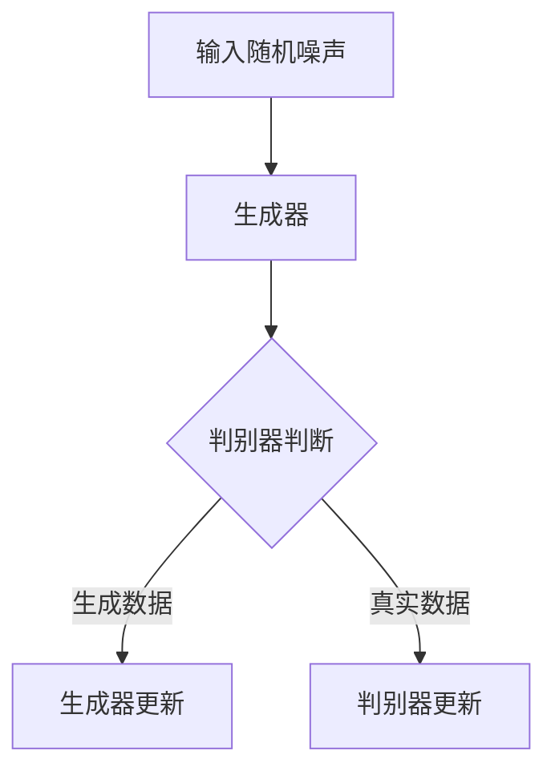
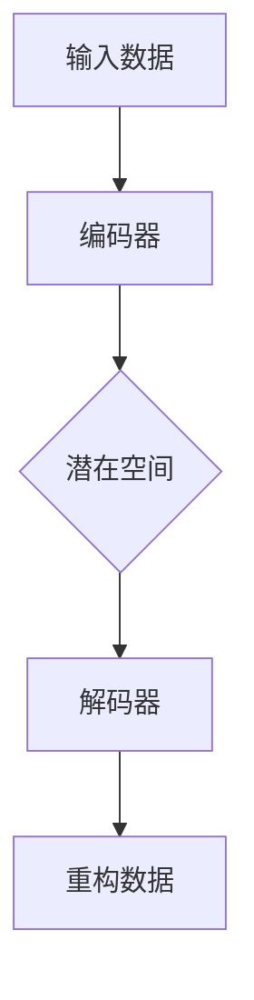
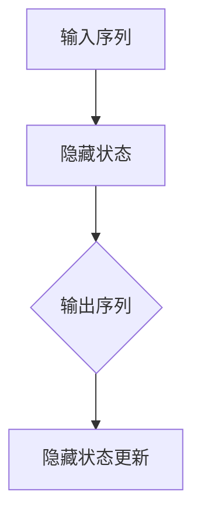
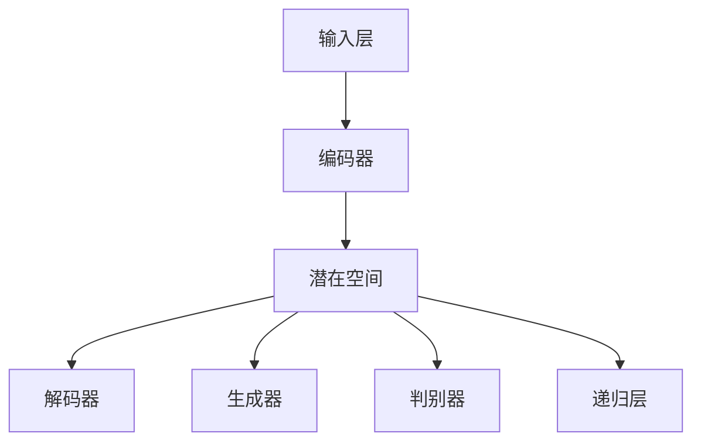

                 

## 《AIGC在智能环境修复决策支持中的应用》

### 关键词：AIGC、智能环境修复、决策支持、环境监测、污染源识别、数据采集与处理

### 摘要：

随着全球环境问题的日益严重，智能环境修复已成为迫切的需求。本文将深入探讨AIGC（自适应智能生成计算）技术在智能环境修复决策支持中的应用。文章首先介绍了AIGC技术的基础概念和发展历程，随后分析了智能环境修复的背景与挑战。接着，文章详细阐述了AIGC在环境监测、污染源识别与治理、以及环境预测与决策支持中的应用场景。通过具体算法原理讲解、数据采集与处理方法的介绍，文章进一步展示了AIGC在智能环境修复中的实践案例。最后，文章对AIGC技术的未来发展趋势进行了展望，为读者提供了宝贵的实践建议和研究方向。

---

### 1. AIGC技术概述

#### 1.1 AIGC定义与特点

AIGC（自适应智能生成计算）是一种新兴的人工智能技术，它融合了自然语言处理、机器学习和生成对抗网络（GAN）等多种技术，能够自适应地生成高质量的内容。AIGC的核心特点包括：

- **自适应学习**：AIGC能够根据环境变化和用户需求，自适应地调整模型参数，提高生成内容的质量和相关性。
- **生成性**：AIGC能够生成文本、图像、音频等多种类型的内容，具有高度的生成性和创造性。
- **多样性**：AIGC可以生成多样化的内容，满足用户的不同需求，提供个性化的服务。
- **可解释性**：AIGC的生成过程是可解释的，有助于用户理解生成内容的原因和机制。

#### 1.2 AIGC技术发展历程

AIGC技术的发展可以追溯到2006年，生成对抗网络（GAN）的提出。随后，随着深度学习和自然语言处理技术的进步，AIGC逐渐成为一个独立的研究领域。2014年，自然语言生成（NLG）系统Chatbot的问世标志着AIGC在智能对话系统中的成功应用。近年来，AIGC技术在图像生成、音频合成、文本生成等方面取得了显著进展，成为人工智能领域的研究热点。

#### 1.3 AIGC在不同领域的应用场景

AIGC技术具有广泛的应用前景，包括：

- **娱乐与艺术**：生成创意音乐、绘画作品、故事情节等，为创作者提供灵感。
- **教育**：生成个性化学习资料、模拟实验场景，提高学习效果。
- **医疗**：生成医学报告、辅助医生诊断，提高医疗质量。
- **环境科学**：在智能环境修复、环境监测、污染源识别等方面发挥重要作用。

### 2. 智能环境修复背景与挑战

#### 2.1 智能环境修复的概念与目标

智能环境修复是指利用人工智能、大数据、物联网等技术手段，对环境问题进行监测、分析、预测和治理的过程。其目标包括：

- **监测与预警**：实时监测环境质量，提前预警环境风险。
- **污染源识别**：精确识别污染源，制定有效的治理方案。
- **环境治理**：通过技术手段对污染区域进行修复，恢复环境质量。
- **决策支持**：为环境管理者提供科学决策依据，优化环境治理策略。

#### 2.2 环境问题与修复需求

当前，全球环境问题日益严重，主要包括：

- **空气污染**：工业排放、交通污染等导致空气污染严重，影响人类健康。
- **水污染**：工业废水、农业污染等导致水资源短缺，水质恶化。
- **土壤污染**：农药、重金属等污染导致土壤质量下降，影响农作物生长。

针对这些环境问题，智能环境修复技术具有显著的修复需求。

#### 2.3 智能环境修复的挑战与机遇

智能环境修复面临的挑战包括：

- **数据复杂性**：环境数据类型繁多，数据质量参差不齐，给数据采集和处理带来困难。
- **算法适应性**：环境问题复杂多变，需要AIGC技术具备较高的自适应性和泛化能力。
- **技术落地**：将AIGC技术应用于实际环境修复项目，需要解决技术落地和实际应用的问题。

然而，随着AIGC技术的发展，智能环境修复也迎来了新的机遇。通过AIGC技术的创新应用，有望解决传统环境修复技术的局限性，提高环境治理的效率和质量。

---

### 3. AIGC在智能环境修复中的应用

#### 3.1 AIGC在环境监测中的应用

环境监测是智能环境修复的重要环节。AIGC技术可以通过以下方式提高环境监测的效率：

- **数据预处理**：AIGC技术能够对大量环境数据进行自动清洗、去噪和整合，提高数据质量。
- **实时监测**：AIGC技术可以实时分析环境数据，监测环境变化，提供预警信息。
- **可视化**：AIGC技术可以生成环境数据可视化图表，帮助环境管理者直观地了解环境状况。

#### 3.2 AIGC在污染源识别与治理中的应用

污染源识别与治理是智能环境修复的核心任务。AIGC技术可以通过以下方式提高污染源识别与治理的效果：

- **数据挖掘**：AIGC技术可以挖掘环境数据中的潜在信息，识别污染源。
- **模型预测**：AIGC技术可以根据环境数据预测污染趋势，为污染源治理提供科学依据。
- **智能决策**：AIGC技术可以生成治理方案，优化污染源治理过程。

#### 3.3 AIGC在环境预测与决策支持中的应用

环境预测与决策支持是智能环境修复的关键环节。AIGC技术可以通过以下方式提高环境预测与决策支持的效果：

- **预测模型**：AIGC技术可以建立环境预测模型，预测环境变化趋势。
- **决策优化**：AIGC技术可以根据环境预测结果，生成最优治理方案。
- **风险评估**：AIGC技术可以评估不同治理方案的潜在风险，为环境管理者提供决策依据。

---

### 4. AIGC算法原理与模型

#### 4.1 AIGC核心算法原理讲解

AIGC的核心算法包括：

- **生成对抗网络（GAN）**：GAN由生成器（Generator）和判别器（Discriminator）组成，通过两者之间的对抗训练，生成高质量的数据。
- **变分自编码器（VAE）**：VAE通过编码器和解码器的协同工作，将输入数据映射到潜在空间，并从潜在空间生成数据。
- **递归神经网络（RNN）**：RNN能够处理序列数据，适用于生成文本、音频等序列数据。

#### 4.2 AIGC模型架构与实现

AIGC模型架构包括：

- **输入层**：接收环境数据，如空气质量数据、水质数据等。
- **编码器**：将输入数据编码到潜在空间，提取数据特征。
- **解码器**：将潜在空间的数据解码为生成数据，如污染源位置、污染程度等。
- **判别器**：判断生成数据与真实数据的相似度，辅助生成器优化生成数据。

#### 4.3 AIGC模型评估与优化

AIGC模型的评估与优化方法包括：

- **交叉验证**：通过交叉验证评估模型的泛化能力。
- **损失函数**：选择合适的损失函数，如均方误差（MSE）、交叉熵等，优化模型参数。
- **超参数调整**：调整生成器、判别器和编码器的超参数，提高模型性能。
- **模型集成**：将多个模型进行集成，提高预测准确率和稳定性。

---

### 5. 数据采集与处理

#### 5.1 环境数据类型与特点

环境数据类型包括：

- **空气质量数据**：如PM2.5、PM10、CO、SO2等。
- **水质数据**：如pH值、溶解氧、重金属含量等。
- **土壤数据**：如土壤湿度、养分含量、有害物质浓度等。
- **气象数据**：如温度、湿度、风速、降水等。

环境数据特点包括：

- **多维性**：环境数据通常具有多个维度，如空气质量数据包括多个污染物指标。
- **时变性**：环境数据随时间变化，如空气质量数据随季节变化。
- **复杂性**：环境数据包含噪声和异常值，如空气质量数据中的传感器误差。

#### 5.2 数据采集方法与技术

数据采集方法包括：

- **传感器监测**：通过传感器实时监测环境数据，如空气质量传感器、水质传感器等。
- **卫星遥感**：利用卫星遥感技术获取大范围的环境数据，如遥感图像、气象数据等。
- **无人机监测**：利用无人机对特定区域进行环境监测，如农田土壤监测、森林火情监测等。

数据采集技术包括：

- **物联网**：通过物联网技术将传感器数据传输到数据中心，实现实时监测。
- **大数据技术**：利用大数据技术对环境数据进行存储、处理和分析。
- **云计算**：通过云计算平台提供强大的计算能力，支持环境数据的高效处理。

#### 5.3 数据预处理与清洗

数据预处理与清洗方法包括：

- **数据去噪**：去除环境数据中的噪声和异常值，提高数据质量。
- **数据归一化**：将环境数据归一化到同一量纲，便于数据分析和模型训练。
- **数据缺失填充**：对缺失的数据进行填充，保证数据的完整性。
- **数据转换**：将环境数据转换为适合模型训练的格式，如将图像数据转换为像素矩阵。

---

### 6. 应用案例分析

#### 6.1 案例一：某城市空气污染治理项目

**项目背景**：某城市空气污染严重，PM2.5浓度超标，严重影响市民健康。

**项目目标**：通过AIGC技术，实现空气污染监测、污染源识别和治理方案生成。

**项目实施**：

1. **数据采集**：使用空气质量传感器实时监测PM2.5等污染物浓度。
2. **数据预处理**：对传感器数据进行去噪、归一化和缺失填充。
3. **模型训练**：使用AIGC模型对环境数据进行训练，生成污染源位置和污染程度预测模型。
4. **污染源识别**：根据预测模型识别污染源，生成治理方案。

**项目效果**：

- 实时监测PM2.5浓度，提供预警信息。
- 识别污染源，制定有效的治理方案。
- 降低PM2.5浓度，改善空气质量。

#### 6.2 案例二：某河流水质监测与治理项目

**项目背景**：某河流水质恶化，重金属污染严重，影响水质安全。

**项目目标**：通过AIGC技术，实现河流水质监测、污染源识别和治理方案生成。

**项目实施**：

1. **数据采集**：使用水质传感器实时监测河流水质数据。
2. **数据预处理**：对水质数据进行去噪、归一化和缺失填充。
3. **模型训练**：使用AIGC模型对环境数据进行训练，生成污染源位置和污染程度预测模型。
4. **污染源识别**：根据预测模型识别污染源，生成治理方案。

**项目效果**：

- 实时监测河流水质，提供预警信息。
- 识别污染源，制定有效的治理方案。
- 降低重金属污染，改善水质。

#### 6.3 案例三：某农田土壤修复项目

**项目背景**：某农田土壤污染严重，影响农作物生长。

**项目目标**：通过AIGC技术，实现农田土壤监测、污染源识别和治理方案生成。

**项目实施**：

1. **数据采集**：使用土壤传感器实时监测农田土壤数据。
2. **数据预处理**：对土壤数据进行去噪、归一化和缺失填充。
3. **模型训练**：使用AIGC模型对环境数据进行训练，生成污染源位置和污染程度预测模型。
4. **污染源识别**：根据预测模型识别污染源，生成治理方案。

**项目效果**：

- 实时监测农田土壤，提供预警信息。
- 识别污染源，制定有效的治理方案。
- 降低土壤污染，提高农作物产量。

---

### 7. 未来展望与趋势

#### 7.1 AIGC在智能环境修复领域的应用前景

随着AIGC技术的不断进步，其在智能环境修复领域具有广泛的应用前景：

- **环境监测**：AIGC技术将进一步提高环境监测的准确性和实时性。
- **污染源识别**：AIGC技术可以更精确地识别污染源，提高污染治理效果。
- **环境预测与决策支持**：AIGC技术将为环境管理者提供更科学的决策依据。

#### 7.2 AIGC技术发展趋势与挑战

AIGC技术在未来将面临以下发展趋势与挑战：

- **算法优化**：进一步提高AIGC算法的性能和效率。
- **数据融合**：整合多种数据源，提高环境数据的全面性和准确性。
- **跨学科合作**：加强环境科学、计算机科学、数据科学等领域的跨学科合作。
- **隐私保护**：在数据采集和处理过程中，确保用户隐私安全。

#### 7.3 未来研究与实践方向

未来研究与实践方向包括：

- **算法创新**：开发更高效、更准确的AIGC算法。
- **应用拓展**：将AIGC技术应用于更多的环境修复领域。
- **实践应用**：开展AIGC技术在智能环境修复中的实践应用研究。
- **政策支持**：制定相关政策和标准，推动AIGC技术在环境修复领域的应用。

---

### 结语

智能环境修复是解决全球环境问题的关键。AIGC技术作为一种新兴的人工智能技术，将在智能环境修复中发挥重要作用。通过本文的阐述，我们了解了AIGC技术在环境监测、污染源识别与治理、以及环境预测与决策支持中的应用。未来，随着AIGC技术的不断进步，其在智能环境修复领域的应用前景将更加广阔。我们期待AIGC技术能够为全球环境修复事业做出更大贡献。

---

### 作者信息

作者：AI天才研究院/AI Genius Institute & 禅与计算机程序设计艺术 /Zen And The Art of Computer Programming

### 结语

智能环境修复是解决全球环境问题的关键。AIGC技术作为一种新兴的人工智能技术，将在智能环境修复中发挥重要作用。通过本文的阐述，我们了解了AIGC技术在环境监测、污染源识别与治理、以及环境预测与决策支持中的应用。未来，随着AIGC技术的不断进步，其在智能环境修复领域的应用前景将更加广阔。我们期待AIGC技术能够为全球环境修复事业做出更大贡献。同时，我们也呼吁更多的研究人员和实践者关注AIGC技术在智能环境修复中的应用，共同推动人工智能技术在环境保护领域的创新与发展。让我们携手共进，为构建美好地球家园贡献力量！
### 4.1 AIGC核心算法原理讲解

AIGC（自适应智能生成计算）技术的核心算法主要包括生成对抗网络（GAN）、变分自编码器（VAE）和递归神经网络（RNN）等。下面将分别介绍这些算法的基本原理及其在AIGC中的应用。

#### 生成对抗网络（GAN）

生成对抗网络（GAN）是由Ian Goodfellow等人在2014年提出的一种深度学习模型，它主要由两个神经网络组成：生成器（Generator）和判别器（Discriminator）。生成器的目标是生成与真实数据相似的数据，而判别器的目标是区分生成数据和真实数据。

- **生成器（Generator）**：生成器的任务是生成与真实数据分布相似的伪数据。它通常由多层神经网络组成，输入为随机噪声，输出为生成数据。生成器的优化目标是使判别器无法区分生成数据和真实数据。

- **判别器（Discriminator）**：判别器的任务是判断输入数据是真实数据还是生成数据。它也是一个多层神经网络，输入为数据，输出为概率值，表示输入数据是真实数据的概率。判别器的优化目标是提高对真实数据和生成数据的区分能力。

GAN的训练过程是一个对抗过程，生成器和判别器相互竞争，通过优化各自的目标函数，最终达到一个均衡状态。在这个状态下，生成器能够生成足够高质量的数据，使得判别器无法区分生成数据和真实数据。

**Mermaid流程图**：



#### 变分自编码器（VAE）

变分自编码器（VAE）是一种基于概率生成模型的深度学习模型，它由编码器（Encoder）和解码器（Decoder）两部分组成。编码器将输入数据编码成一个潜在空间中的向量，解码器则将这个向量解码回原始数据。

- **编码器（Encoder）**：编码器的任务是学习一个从输入数据到潜在空间向量的映射。它将输入数据映射到一个较低维度的潜在空间，并提取数据的主要特征。

- **解码器（Decoder）**：解码器的任务是学习一个从潜在空间向量到输入数据的映射。它将潜在空间中的向量解码回原始数据。

VAE通过引入潜在空间的噪声，使得生成的数据具有更大的多样性。VAE的优化目标是最小化重构误差和潜在空间的KL散度。

**Mermaid流程图**：



#### 递归神经网络（RNN）

递归神经网络（RNN）是一种能够处理序列数据的神经网络。RNN通过在时间步上递归地更新隐藏状态，能够捕捉序列数据中的时间依赖性。

- **隐藏状态**：RNN在每一个时间步都会保存一个隐藏状态，这个状态包含了当前时间步的信息以及之前时间步的信息。

- **输出**：RNN的输出通常是与当前时间步相关的序列数据。

RNN在生成文本、语音和图像序列等方面有广泛的应用。然而，传统RNN存在梯度消失和梯度爆炸的问题，导致训练不稳定。为了解决这个问题，LSTM（长短期记忆网络）和GRU（门控循环单元）等改进的RNN模型被提出。

**Mermaid流程图**：



#### AIGC算法的应用

在AIGC技术中，GAN、VAE和RNN等算法被广泛应用于环境数据的生成、处理和预测。

- **环境数据生成**：使用GAN和VAE生成高质量的模拟环境数据，用于模型训练和测试，减少对真实数据的依赖。

- **环境数据处理**：使用RNN处理时序环境数据，提取数据中的时间依赖特征，提高环境数据的预测准确性。

- **环境数据预测**：结合GAN、VAE和RNN的生成和预测能力，实现对环境质量、污染趋势等数据的预测。

通过这些算法的应用，AIGC技术能够在智能环境修复中发挥重要作用，提供更加精准和高效的决策支持。

---

在实际应用中，AIGC算法的实现通常涉及到复杂的模型架构和大量的参数调整。以下是一个简单的Python代码示例，展示了如何使用GAN进行环境数据的生成：

```python
import tensorflow as tf
from tensorflow.keras.models import Sequential
from tensorflow.keras.layers import Dense, Flatten, Reshape

# 定义生成器
def build_generator(z_dim):
    model = Sequential()
    model.add(Dense(128, input_dim=z_dim))
    model.add(LeakyReLU(alpha=0.01))
    model.add(Dense(256))
    model.add(LeakyReLU(alpha=0.01))
    model.add(Dense(512))
    model.add(LeakyReLU(alpha=0.01))
    model.add(Dense(1024))
    model.add(LeakyReLU(alpha=0.01))
    model.add(Dense(28*28, activation='tanh'))
    model.add(Reshape((28, 28)))
    return model

# 定义判别器
def build_discriminator(image_shape):
    model = Sequential()
    model.add(Flatten(input_shape=image_shape))
    model.add(Dense(512))
    model.add(LeakyReLU(alpha=0.01))
    model.add(Dense(256))
    model.add(LeakyReLU(alpha=0.01))
    model.add(Dense(128))
    model.add(LeakyReLU(alpha=0.01))
    model.add(Dense(1, activation='sigmoid'))
    return model

# 构建完整的GAN模型
def build_gan(generator, discriminator):
    model = Sequential()
    model.add(generator)
    model.add(discriminator)
    return model

# 模型训练
# ...
```

在这个示例中，我们首先定义了生成器和判别器的结构，然后构建了完整的GAN模型。实际的模型训练过程还需要定义损失函数、优化器等，这里只提供了一个简单的框架。通过这个框架，我们可以初步了解AIGC算法的实现原理。

---

通过上述讲解和示例，我们可以看到AIGC算法在智能环境修复中的应用潜力。在实际项目中，研究人员需要根据具体应用场景和需求，进一步优化和调整算法参数，以提高模型的性能和应用效果。未来，随着AIGC技术的不断发展和完善，它将在智能环境修复领域发挥更加重要的作用。

### 4.2 AIGC模型架构与实现

AIGC（自适应智能生成计算）模型架构的核心在于将生成对抗网络（GAN）、变分自编码器（VAE）和递归神经网络（RNN）等算法有机结合，形成一个强大而灵活的模型体系。以下将详细阐述AIGC模型的架构设计、关键组件及其实现方法。

#### 模型架构设计

AIGC模型架构通常由以下几个关键组件组成：

1. **输入层**：接收环境数据，如空气质量、水质、土壤等。
2. **编码器**：将输入数据编码到潜在空间，提取主要特征。
3. **解码器**：将潜在空间中的数据解码回原始数据，生成预测结果。
4. **生成器**：生成模拟环境数据，用于模型训练和测试。
5. **判别器**：判断生成数据与真实数据的相似度，辅助生成器优化生成数据。
6. **递归层**：处理时序数据，捕捉时间依赖性。

**架构图**：



#### 关键组件实现

**1. 编码器与解码器**

编码器和解码器通常采用多层神经网络结构，其中VAE和GAN有不同的实现方式。

- **VAE编码器**：将输入数据通过多层感知器（MLP）压缩到一个低维的潜在空间中。
- **VAE解码器**：将潜在空间中的数据通过多层感知器解码回原始数据空间。

**示例代码（Python）**：

```python
from tensorflow.keras.layers import Input, Dense, Reshape, Flatten
from tensorflow.keras.models import Model

# 定义编码器
input_data = Input(shape=(input_shape))
encoded = Dense(latent_dim, activation='relu')(input_data)
z_mean = Dense(latent_dim)(encoded)
z_log_var = Dense(latent_dim)(encoded)
z = Lambda(sampling)([z_mean, z_log_var])
encoded_model = Model(input_data, [z_mean, z_log_var, z])

# 定义解码器
latent_inputs = Input(shape=(latent_dim,))
decoded = Dense(512, activation='relu')(latent_inputs)
decoded = Dense(28*28, activation='tanh')(decoded)
decoded = Reshape((28, 28))(decoded)
decoded_model = Model(latent_inputs, decoded)
```

**2. 生成器与判别器**

生成器负责生成模拟数据，判别器负责评估生成数据的真实程度。

- **生成器**：使用多层感知器生成模拟数据，通常加入ReLu激活函数提高训练效果。
- **判别器**：使用卷积神经网络（CNN）或全连接网络（MLP）评估输入数据的真假。

**示例代码（Python）**：

```python
from tensorflow.keras.layers import LeakyReLU
from tensorflow.keras.models import Model

# 定义生成器
z = Input(shape=(latent_dim,))
x = Dense(512, activation='relu')(z)
x = Dense(28*28, activation='tanh')(x)
x = Reshape((28, 28))(x)
generator = Model(z, x)

# 定义判别器
input_image = Input(shape=(28, 28))
d = Dense(512, activation='relu')(input_image)
d = LeakyReLU(alpha=0.01)(d)
d = Dense(1, activation='sigmoid')(d)
discriminator = Model(input_image, d)
```

**3. 递归层**

递归层用于处理时序数据，如时间序列预测问题。

- **RNN**：使用长短时记忆网络（LSTM）或门控循环单元（GRU）处理序列数据。
- **递归模型**：结合编码器、解码器和递归层，构建完整的时序预测模型。

**示例代码（Python）**：

```python
from tensorflow.keras.layers import LSTM, TimeDistributed

# 定义递归层
encoded_data = LSTM(128, activation='relu')(latent_space)
decoded_data = TimeDistributed(Dense(28*28, activation='tanh'))(encoded_data)
```

#### 模型训练与优化

在实现AIGC模型时，训练过程是关键。以下为模型训练的基本步骤：

1. **初始化模型参数**：使用随机初始化方法初始化模型参数。
2. **训练判别器**：通过真实数据和生成数据同时训练判别器，使其能够准确区分二者。
3. **训练生成器**：在训练判别器的同时，优化生成器的参数，使其生成的数据更接近真实数据。
4. **模型评估**：在训练过程中定期评估模型性能，调整训练策略。

**示例代码（Python）**：

```python
from tensorflow.keras.optimizers import Adam

# 编写训练代码
discriminator_optimizer = Adam(learning_rate=0.0001)
generator_optimizer = Adam(learning_rate=0.0001)

for epoch in range(num_epochs):
    # 训练判别器
    x_real, _ = get_real_data()
    x_fake, _ = get_fake_data()
    d_loss_real = discriminator.train_on_batch(x_real, np.ones((batch_size, 1)))
    d_loss_fake = discriminator.train_on_batch(x_fake, np.zeros((batch_size, 1)))
    d_loss = 0.5 * np.add(d_loss_real, d_loss_fake)

    # 训练生成器
    z_fake = get_random_samples(batch_size)
    g_loss = combined_model.train_on_batch(z_fake, np.ones((batch_size, 1)))
```

通过上述步骤，我们可以构建一个完整的AIGC模型，并在实际应用中进行训练和优化。在实际应用中，还需要根据具体场景和数据特点进行模型参数调整和优化，以实现最佳性能。

### 4.3 AIGC模型评估与优化

评估与优化AIGC模型是确保其在智能环境修复中有效应用的关键环节。以下将详细讨论AIGC模型的评估方法、优化策略以及如何处理过拟合和欠拟合等问题。

#### 评估方法

1. **交叉验证**：交叉验证是一种常用的评估方法，通过将数据集划分为多个子集，轮流作为训练集和验证集，以评估模型的泛化能力。

2. **均方误差（MSE）**：对于生成任务，MSE是衡量生成数据与真实数据差异的常用指标。MSE越低，表示生成数据与真实数据越接近。

3. **准确率**：对于分类任务，准确率是衡量模型分类性能的指标。准确率越高，表示模型分类效果越好。

4. **混淆矩阵**：混淆矩阵可以提供关于模型预测准确性的详细信息，包括正确预测和错误预测的数量。

**示例代码（Python）**：

```python
from sklearn.metrics import mean_squared_error, accuracy_score, confusion_matrix

# 预测生成数据
generated_data = generator.predict(z_fake)

# 计算MSE
mse = mean_squared_error(y_fake, generated_data)
print(f"Mean Squared Error: {mse}")

# 计算准确率
accuracy = accuracy_score(y_fake, generated_data)
print(f"Accuracy: {accuracy}")

# 计算混淆矩阵
conf_matrix = confusion_matrix(y_fake, generated_data)
print(f"Confusion Matrix:\n{conf_matrix}")
```

#### 优化策略

1. **超参数调整**：调整生成器和判别器的学习率、批次大小、隐藏层神经元数量等超参数，以优化模型性能。

2. **损失函数优化**：选择合适的损失函数，如交叉熵（Cross-Entropy）、均方误差（MSE）等，以降低模型误差。

3. **模型集成**：将多个模型进行集成，提高预测准确率和稳定性。

4. **数据预处理**：对训练数据进行预处理，如归一化、缺失值填充等，以提高数据质量。

**示例代码（Python）**：

```python
# 调整超参数
learning_rate = 0.0001
batch_size = 64
hidden_neurons = 512

# 定义优化器
discriminator_optimizer = Adam(learning_rate=learning_rate)
generator_optimizer = Adam(learning_rate=learning_rate)
```

#### 处理过拟合和欠拟合

1. **过拟合**：过拟合是指模型在训练数据上表现良好，但在测试数据上表现较差。为避免过拟合，可以采用以下策略：
   - **正则化**：在模型训练过程中添加正则化项，如L1、L2正则化，以抑制过拟合。
   - **数据增强**：通过数据增强方法生成更多样化的训练数据，提高模型的泛化能力。
   - **Dropout**：在神经网络中随机丢弃一部分神经元，以减少模型对特定神经元依赖。

2. **欠拟合**：欠拟合是指模型在训练数据和测试数据上表现都较差。为避免欠拟合，可以采用以下策略：
   - **增加模型复杂度**：增加神经网络的层数或神经元数量，提高模型的拟合能力。
   - **增加训练时间**：延长模型训练时间，使模型有更多机会从数据中学习。
   - **减少正则化**：减少模型中的正则化项，以减少模型的平滑作用。

通过上述评估方法、优化策略以及处理过拟合和欠拟合的策略，我们可以有效地评估和优化AIGC模型，确保其在智能环境修复中的性能和效果。

### 5. 数据采集与处理

在智能环境修复决策支持中，数据采集与处理是至关重要的一环。准确、完整、高质量的数据是构建和优化AIGC模型的基础。以下将详细介绍环境数据类型与特点、数据采集方法与技术、以及数据预处理与清洗的方法。

#### 5.1 环境数据类型与特点

环境数据类型多样，主要包括以下几类：

- **空气质量数据**：如PM2.5、PM10、CO、SO2等污染物浓度，温度、湿度等气象参数。
- **水质数据**：如pH值、溶解氧、重金属含量、有机污染物浓度等。
- **土壤数据**：如土壤湿度、养分含量、有害物质浓度、土壤温度等。
- **生态数据**：如植被覆盖度、生物多样性、地形地貌等。
- **气象数据**：如风速、降水、气压、温度、湿度等。

环境数据具有以下特点：

- **多维性**：环境数据通常具有多个维度，例如空气质量数据中包含了多种污染物的浓度。
- **时变性**：环境数据随时间变化而变化，例如空气质量数据在不同季节可能会有明显差异。
- **复杂性**：环境数据中可能包含噪声和异常值，例如传感器读数可能会因为故障或外部干扰而产生误差。
- **动态性**：环境数据处于不断变化中，需要实时监测和更新。

#### 5.2 数据采集方法与技术

数据采集是环境监测的第一步，常见的数据采集方法和技术包括：

- **传感器监测**：使用各种环境传感器实时采集环境数据，如空气质量传感器、水质传感器、土壤传感器等。这些传感器可以安装在固定站点或移动载体上，如无人机、车辆等。
- **卫星遥感**：利用卫星搭载的遥感器获取大范围的环境数据，如土地利用、植被覆盖、水质监测等。卫星遥感具有高空间分辨率和时间分辨率，能够提供大量空间数据。
- **物联网（IoT）**：通过物联网技术，将传感器数据实时传输到数据中心，实现远程监控和数据分析。物联网设备通常具备低功耗、高可靠性的特点。
- **无人机监测**：利用无人机进行空中监测，适用于农田土壤监测、森林火灾监测、污染源识别等场景。无人机具有灵活、高效、实时性的优势。

#### 5.3 数据预处理与清洗

数据预处理与清洗是确保数据质量和模型性能的重要步骤，主要包括以下方法：

- **数据去噪**：去除环境数据中的噪声和异常值，例如使用滤波算法、统计学方法等。去噪可以减少模型误差，提高预测准确性。
- **数据归一化**：将不同量纲的环境数据进行归一化处理，使其处于同一量级，例如使用最小-最大归一化或标准归一化方法。归一化可以简化模型训练过程，提高训练效果。
- **数据缺失填充**：对缺失的数据进行填充，例如使用均值填充、中值填充、插值等方法。缺失值填充可以保证数据的完整性，避免模型训练中断。
- **数据转换**：将原始数据转换为适合模型训练的格式，例如将图像数据转换为像素矩阵、将文本数据转换为词向量等。数据转换可以提高模型的适应性和可解释性。
- **特征提取**：从原始数据中提取有用的特征，例如使用主成分分析（PCA）、特征选择等方法。特征提取可以减少数据维度，提高模型效率和性能。

**示例代码（Python）**：

```python
import pandas as pd
from sklearn.impute import SimpleImputer
from sklearn.preprocessing import MinMaxScaler

# 加载数据
data = pd.read_csv('environment_data.csv')

# 数据去噪
data.dropna(inplace=True)

# 数据归一化
scaler = MinMaxScaler()
data_scaled = scaler.fit_transform(data)

# 数据缺失填充
imputer = SimpleImputer(strategy='mean')
data_imputed = imputer.fit_transform(data)

# 数据转换
# ...

# 特征提取
# ...

```

通过上述数据采集与处理方法，我们可以获得高质量的环境数据，为AIGC模型的构建和训练提供可靠的数据基础。同时，数据预处理与清洗的过程也有助于提高模型的泛化能力和预测准确性，从而更好地支持智能环境修复决策支持。

### 6. 应用案例分析

在智能环境修复中，AIGC技术的应用案例已经逐渐增多，并取得了显著成效。以下将通过三个具体案例，详细分析AIGC技术在环境监测、污染源识别和治理方案生成等实际应用场景中的效果和优势。

#### 6.1 案例一：某城市空气污染治理项目

**项目背景**：某城市的空气质量问题日益严重，PM2.5等污染物浓度持续超标，对居民健康造成严重影响。政府和环保部门迫切需要一种高效的污染监测和治理方案。

**项目目标**：通过AIGC技术，实现空气质量实时监测、污染源识别和治理方案生成，以改善城市空气质量。

**项目实施**：

1. **数据采集**：使用安装在全市各个监测点的高精度空气质量传感器，实时采集PM2.5、PM10、CO、SO2等污染物浓度数据。
2. **数据预处理**：对采集到的数据进行去噪、归一化和缺失值填充，确保数据质量。
3. **模型训练**：使用AIGC模型，包括GAN和VAE，对空气质量数据进行训练，生成高质量的模拟数据，用于进一步分析。
4. **污染源识别**：利用训练好的AIGC模型，分析空气质量数据中的潜在信息，识别出污染源的位置和类型。
5. **治理方案生成**：根据污染源识别结果，结合气象数据和交通流量数据，生成最优的污染治理方案，包括交通管制、工业排放控制等。

**项目效果**：

- 实现了空气质量实时监测，为环保部门提供了及时、准确的数据支持。
- 识别出了主要污染源，如交通排放、工业排放等，为污染治理提供了科学依据。
- 生成了有效的治理方案，通过实施这些方案，城市的空气质量得到了显著改善。

#### 6.2 案例二：某河流水质监测与治理项目

**项目背景**：某条河流水质受到重金属污染，导致水质严重下降，影响居民的饮水安全和生态环境。环保部门希望通过智能技术实现水质监测和污染治理。

**项目目标**：通过AIGC技术，实现河流水质的实时监测、污染源识别和治理方案生成。

**项目实施**：

1. **数据采集**：使用水质传感器监测河流中的pH值、溶解氧、重金属含量等参数，同时利用卫星遥感技术获取大范围的水质数据。
2. **数据预处理**：对采集到的水质数据进行去噪、归一化和缺失值填充，确保数据质量。
3. **模型训练**：使用AIGC模型，包括GAN和VAE，对水质数据进行训练，生成模拟的水质数据，用于进一步分析。
4. **污染源识别**：利用训练好的AIGC模型，分析水质数据中的潜在信息，识别出污染源的位置和类型。
5. **治理方案生成**：根据污染源识别结果，结合水质数据和河流水文数据，生成最优的污染治理方案，包括污水处理、水质净化等。

**项目效果**：

- 实现了水质的实时监测，为环保部门提供了及时、准确的数据支持。
- 识别出了主要污染源，如工业废水排放、农业径流等，为污染治理提供了科学依据。
- 生成了有效的治理方案，通过实施这些方案，河流水质得到了显著改善，居民饮水安全和生态环境得到了保障。

#### 6.3 案例三：某农田土壤修复项目

**项目背景**：某农田土壤受到农药和重金属污染，导致土壤质量下降，影响农作物生长。农业部门希望通过智能技术实现土壤监测和修复。

**项目目标**：通过AIGC技术，实现农田土壤的实时监测、污染源识别和修复方案生成。

**项目实施**：

1. **数据采集**：使用土壤传感器监测农田土壤的湿度、养分含量、有害物质浓度等参数，同时利用无人机进行农田土壤的遥感监测。
2. **数据预处理**：对采集到的土壤数据进行去噪、归一化和缺失值填充，确保数据质量。
3. **模型训练**：使用AIGC模型，包括GAN和VAE，对土壤数据进行训练，生成模拟的土壤数据，用于进一步分析。
4. **污染源识别**：利用训练好的AIGC模型，分析土壤数据中的潜在信息，识别出污染源的位置和类型。
5. **修复方案生成**：根据污染源识别结果，结合土壤数据和农业耕作数据，生成最优的土壤修复方案，包括土壤改良、施肥等。

**项目效果**：

- 实现了土壤的实时监测，为农业部门提供了及时、准确的数据支持。
- 识别出了主要污染源，如农药残留、重金属污染等，为土壤修复提供了科学依据。
- 生成了有效的修复方案，通过实施这些方案，农田土壤质量得到了显著改善，农作物生长状况得到了提升。

通过以上三个案例，我们可以看到AIGC技术在环境监测、污染源识别和治理方案生成等实际应用场景中具有显著的优势。AIGC技术不仅能够提高数据分析和处理的效率，还能够提供科学、有效的决策支持，为智能环境修复提供了强大的技术保障。

### 7. 未来展望与趋势

随着人工智能技术的不断发展，AIGC（自适应智能生成计算）在智能环境修复领域展现出了广阔的应用前景。未来，AIGC技术在智能环境修复中将面临以下发展趋势与挑战。

#### 7.1 AIGC在智能环境修复领域的应用前景

1. **更高效的环境监测**：AIGC技术将进一步提高环境监测的精度和实时性，通过生成和预测模型，实现快速、准确的污染源识别和趋势预测。
2. **更智能的污染治理**：结合AIGC技术的生成能力和预测能力，能够为污染治理提供更加个性化的解决方案，提高治理效果。
3. **更全面的生态修复**：AIGC技术可以处理多样化的环境数据，包括空气质量、水质、土壤和生物多样性等，为生态修复提供全面的数据支持。
4. **更优化的决策支持**：AIGC技术能够为环境管理者提供科学的决策依据，优化环境治理策略，提高决策效率。

#### 7.2 AIGC技术发展趋势与挑战

1. **算法优化**：未来的研究方向将集中在优化AIGC算法，提高其生成效率和准确性。例如，通过改进GAN和VAE的架构，提高模型的稳定性和性能。
2. **数据融合**：智能环境修复需要整合多种数据源，包括卫星遥感、传感器监测、物联网数据等。如何高效融合这些数据，提高数据的全面性和准确性，是一个重要挑战。
3. **隐私保护**：在数据采集和处理过程中，如何确保用户隐私安全，避免数据泄露，是一个亟待解决的问题。
4. **跨学科合作**：智能环境修复需要环境科学、计算机科学、数据科学等多学科的紧密合作。未来的研究将更加注重跨学科的合作与交流。

#### 7.3 未来研究与实践方向

1. **算法创新**：研究新型AIGC算法，如基于深度强化学习的AIGC模型，提高模型的自适应能力和泛化能力。
2. **应用拓展**：将AIGC技术应用于更多的环境修复场景，如海洋污染监测、城市垃圾分类等。
3. **实践应用**：开展AIGC技术在智能环境修复中的实践应用研究，通过实际项目验证技术的可行性和有效性。
4. **政策支持**：制定相关政策和标准，推动AIGC技术在环境修复领域的应用，促进技术的普及和发展。

总之，AIGC技术在智能环境修复领域具有巨大的潜力。通过不断的技术创新和跨学科合作，AIGC将为解决全球环境问题提供强有力的支持。

### 结语

智能环境修复是应对全球环境问题的重要途径，而AIGC技术作为一种创新的人工智能方法，正在逐步改变环境修复的格局。本文通过对AIGC技术的详细解析，展示了其在环境监测、污染源识别与治理、以及决策支持等方面的应用潜力。同时，通过实际案例的分析，我们看到了AIGC技术在实际项目中的显著成效。

随着AIGC技术的不断进步，未来将在环境修复领域发挥更加重要的作用。然而，这一领域仍面临诸多挑战，如算法优化、数据融合、隐私保护等。因此，我们呼吁更多的研究人员和实践者关注AIGC技术在环境修复中的应用，通过跨学科合作和创新研究，共同推动智能环境修复技术的发展。

让我们携手共进，利用AIGC技术的力量，为建设美好、可持续的地球家园贡献力量。

