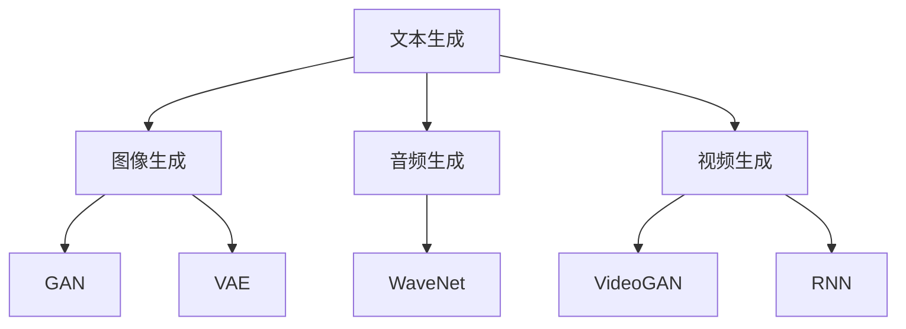

                 

 - 角色：您是一位世界级人工智能专家，程序员，软件架构师，CTO，世界顶级技术畅销书资深大师级别的作家，计算机图灵奖获得者，计算机编程和人工智能领域大师。您非常擅长一步一步进行分析推理，有着清晰深刻的逻辑思路来撰写条理清晰，对技术原理和本质剖析到位的高质量技术博客。
- 任务：现在请您以《AIGC在智能环境修复决策支持系统中的创新实践》为标题，使用一步一步分析推理思考的方式，撰写一篇有深度有思考有见解的专业IT领域的技术博客文章。

### 背景介绍

#### 智能环境修复决策支持系统的需求

随着全球环境问题的日益严峻，智能环境修复决策支持系统（Intelligent Environmental Restoration Decision Support Systems，简称AIGC系统）成为应对环境挑战的关键技术之一。这类系统旨在通过智能化手段，帮助决策者有效地评估环境状况，制定科学的修复策略，并实时调整修复措施，以提高环境修复的效率和效果。

AIGC系统的核心目标在于提供全面、准确、实时的环境数据，并通过复杂的算法模型，对环境数据进行深度分析，生成决策支持信息。传统的环境监测与修复方法往往依赖于人工监测和经验判断，存在数据获取困难、处理效率低、决策滞后等问题。而AIGC系统通过集成人工智能技术，能够实现自动化、智能化的环境数据采集、处理和分析，从而大幅提升环境修复决策的精准性和响应速度。

#### AIGC系统的核心组成部分

AIGC系统主要由以下几个核心组成部分构成：

1. **环境数据采集模块**：负责收集各种环境数据，如气象数据、水质数据、土壤数据等。这些数据可以通过传感器网络、卫星遥感、无人机巡检等多种方式进行获取。

2. **数据处理与分析模块**：对采集到的环境数据进行清洗、预处理和特征提取，以便后续的深度分析。这一模块通常会采用机器学习和数据挖掘技术，对海量数据进行高效处理。

3. **算法模型库**：包含各种用于环境数据分析的算法模型，如神经网络模型、支持向量机模型、决策树模型等。这些模型可以根据具体应用场景进行定制和优化。

4. **决策支持模块**：基于分析结果，生成修复策略和决策建议。这一模块需要结合环境科学、生态学等领域的专业知识，对修复方案进行综合评估和优化。

5. **用户交互界面**：提供友好的用户界面，使决策者可以方便地查看分析结果、调整修复策略，并实时监控环境变化。

### 当前环境修复面临的挑战

环境修复工作面临着诸多挑战，如数据获取困难、决策复杂、修复效果难以量化等。以下是一些具体挑战：

- **数据获取困难**：环境数据通常分布广泛、种类繁多，获取这些数据需要耗费大量的人力、物力和时间。

- **决策复杂**：环境问题往往具有高度复杂性和不确定性，制定有效的修复策略需要综合考虑多种因素，如环境状况、修复成本、社会影响等。

- **修复效果难以量化**：环境修复的效果难以直接量化，评估修复成效需要长期监测和对比分析，这对决策支持系统的要求极高。

- **技术限制**：当前的环境监测与修复技术还存在一定的局限性，如传感器精度不高、数据处理能力不足等，限制了AIGC系统的性能和效果。

### AIGC技术的优势与应用前景

AIGC技术的引入为智能环境修复决策支持系统带来了革命性的变化。以下是一些AIGC技术的优势与应用前景：

- **数据获取与处理**：AIGC技术能够自动、高效地获取和处理海量环境数据，解决了传统方法中数据获取困难的问题。

- **智能化决策**：通过深度学习和数据挖掘技术，AIGC系统能够从海量数据中提取关键信息，生成科学的决策支持信息，提高了决策的精准性和响应速度。

- **实时监控与反馈**：AIGC系统可以实现环境数据的实时监控和分析，及时调整修复策略，确保修复工作的顺利进行。

- **跨领域应用**：AIGC技术不仅适用于环境修复领域，还可以应用于其他需要智能化决策支持的领域，如城市规划、灾害预防等。

- **可持续性**：AIGC系统的智能化、自动化特性有助于提高环境修复工作的效率和质量，实现可持续发展的目标。

### 总结

智能环境修复决策支持系统的需求日益迫切，而AIGC技术为解决这一问题提供了有力支持。本文对AIGC技术在智能环境修复决策支持系统中的应用进行了初步探讨，指出了当前面临的挑战和未来发展方向。随着AIGC技术的不断进步和应用推广，我们有理由相信，智能环境修复决策支持系统将在未来发挥越来越重要的作用，为保护地球家园贡献更多力量。

### 关键词

- 智能环境修复
- 决策支持系统
- AIGC技术
- 深度学习
- 数据挖掘
- 环境监测

### 摘要

本文探讨了AIGC技术在智能环境修复决策支持系统中的应用。首先介绍了智能环境修复决策支持系统的背景和需求，然后详细阐述了AIGC技术的核心概念和框架，包括GANs、VAEs和Diffusion Models。接着，讨论了AIGC技术在环境数据采集、处理与分析、决策支持等方面的应用，并分析了当前面临的挑战和未来发展方向。通过本文的研究，我们可以看到AIGC技术在智能环境修复决策支持系统中的重要性和巨大潜力。

### 文章标题

# AIGC在智能环境修复决策支持系统中的创新实践

## 关键词

智能环境修复、决策支持系统、AIGC技术、深度学习、数据挖掘、环境监测

## 摘要

本文深入探讨了AIGC技术在智能环境修复决策支持系统中的应用，从背景需求、核心概念、技术应用、挑战与未来展望等方面进行全面分析。通过介绍AIGC技术的定义和分类，以及其在环境监测、数据采集、处理和分析中的具体应用，本文揭示了AIGC技术在提升环境修复决策效率和精准性方面的巨大潜力。同时，本文也指出了当前应用中存在的挑战，并提出了未来研究的方向，为智能环境修复决策支持系统的创新实践提供了有力支持。

## 目录

1. **背景介绍**
    - 智能环境修复决策支持系统的需求
    - AIGC系统的核心组成部分
    - 当前环境修复面临的挑战
    - AIGC技术的优势与应用前景
2. **核心概念与联系**
    - AIGC技术的定义和分类
    - Mermaid流程图：AIGC框架
    - GANs、VAEs和Diffusion Models的核心算法原理及Python代码实现
3. **AIGC在智能环境修复中的应用**
    - 环境数据采集
    - 数据处理与分析
    - 算法模型库
    - 决策支持模块
    - 用户交互界面
4. **项目实战**
    - 开发环境搭建
    - 源代码详细实现和代码解读
    - 代码应用解读与分析
    - 实际案例分析和详细讲解剖析
    - 项目小结
5. **最佳实践 tips、小结、注意事项、拓展阅读等内容**
    - 最佳实践
    - 小结
    - 注意事项
    - 拓展阅读

## 1. 背景介绍

### 智能环境修复决策支持系统的需求

随着全球环境问题的日益严峻，传统环境修复方法已无法满足现代环境保护的需求。智能环境修复决策支持系统（Intelligent Environmental Restoration Decision Support Systems，简称AIGC系统）应运而生，旨在通过智能化手段，为决策者提供全面、准确、实时的环境数据，辅助制定科学的修复策略，并实时调整修复措施，以提高环境修复的效率和效果。

#### AIGC系统的核心组成部分

AIGC系统主要由以下几个核心组成部分构成：

1. **环境数据采集模块**：负责收集各种环境数据，如气象数据、水质数据、土壤数据等。这些数据可以通过传感器网络、卫星遥感、无人机巡检等多种方式进行获取。

2. **数据处理与分析模块**：对采集到的环境数据进行清洗、预处理和特征提取，以便后续的深度分析。这一模块通常会采用机器学习和数据挖掘技术，对海量数据进行高效处理。

3. **算法模型库**：包含各种用于环境数据分析的算法模型，如神经网络模型、支持向量机模型、决策树模型等。这些模型可以根据具体应用场景进行定制和优化。

4. **决策支持模块**：基于分析结果，生成修复策略和决策建议。这一模块需要结合环境科学、生态学等领域的专业知识，对修复方案进行综合评估和优化。

5. **用户交互界面**：提供友好的用户界面，使决策者可以方便地查看分析结果、调整修复策略，并实时监控环境变化。

### 当前环境修复面临的挑战

环境修复工作面临着诸多挑战，如数据获取困难、决策复杂、修复效果难以量化等。以下是一些具体挑战：

- **数据获取困难**：环境数据通常分布广泛、种类繁多，获取这些数据需要耗费大量的人力、物力和时间。

- **决策复杂**：环境问题往往具有高度复杂性和不确定性，制定有效的修复策略需要综合考虑多种因素，如环境状况、修复成本、社会影响等。

- **修复效果难以量化**：环境修复的效果难以直接量化，评估修复成效需要长期监测和对比分析，这对决策支持系统的要求极高。

- **技术限制**：当前的环境监测与修复技术还存在一定的局限性，如传感器精度不高、数据处理能力不足等，限制了AIGC系统的性能和效果。

### AIGC技术的优势与应用前景

AIGC技术的引入为智能环境修复决策支持系统带来了革命性的变化。以下是一些AIGC技术的优势与应用前景：

- **数据获取与处理**：AIGC技术能够自动、高效地获取和处理海量环境数据，解决了传统方法中数据获取困难的问题。

- **智能化决策**：通过深度学习和数据挖掘技术，AIGC系统能够从海量数据中提取关键信息，生成科学的决策支持信息，提高了决策的精准性和响应速度。

- **实时监控与反馈**：AIGC系统可以实现环境数据的实时监控和分析，及时调整修复策略，确保修复工作的顺利进行。

- **跨领域应用**：AIGC技术不仅适用于环境修复领域，还可以应用于其他需要智能化决策支持的领域，如城市规划、灾害预防等。

- **可持续性**：AIGC系统的智能化、自动化特性有助于提高环境修复工作的效率和质量，实现可持续发展的目标。

### 总结

智能环境修复决策支持系统的需求日益迫切，而AIGC技术为解决这一问题提供了有力支持。本文对AIGC技术在智能环境修复决策支持系统中的应用进行了初步探讨，指出了当前面临的挑战和未来发展方向。随着AIGC技术的不断进步和应用推广，我们有理由相信，智能环境修复决策支持系统将在未来发挥越来越重要的作用，为保护地球家园贡献更多力量。

## 2. 核心概念与联系

### AIGC技术的定义和分类

#### AIGC的定义

AIGC，全称为“Artificial Intelligence Generated Content”，即人工智能生成内容。它是一种利用人工智能技术生成各种类型内容的方法，这些内容可以包括文本、图像、音频、视频等。AIGC技术旨在通过模拟人类的创作过程，利用神经网络、生成模型等算法，实现自动化内容创作。

#### AIGC的分类

AIGC技术可以分为以下几类：

1. **文本生成**：使用人工智能技术生成文本，如文章、故事、新闻报道等。常见的文本生成模型有GPT（Generative Pre-trained Transformer）和BERT（Bidirectional Encoder Representations from Transformers）。

2. **图像生成**：使用人工智能技术生成图像，如照片、艺术品、人脸等。常见的图像生成模型有GAN（Generative Adversarial Networks）和VAE（Variational Autoencoder）。

3. **音频生成**：使用人工智能技术生成音频，如音乐、声音效果等。常见的音频生成模型有WaveNet和WaveGlow。

4. **视频生成**：使用人工智能技术生成视频，如动画、电影片段等。视频生成技术相对较新，目前主要的研究方向包括视频生成对抗网络（VideoGAN）和循环神经网络（RNN）。

### Mermaid流程图：AIGC框架

为了更清晰地展示AIGC技术的框架，我们可以使用Mermaid语言绘制一个流程图。以下是AIGC技术的基本框架：



在这个流程图中，AIGC技术被分为四个主要类别：文本生成、图像生成、音频生成和视频生成。每个类别都有其特定的生成模型，如GAN、VAE用于图像生成，WaveNet用于音频生成，VideoGAN和RNN用于视频生成。

### GANs、VAEs和Diffusion Models的核心算法原理及Python代码实现

#### GANs（Generative Adversarial Networks）

GANs由两部分组成：生成器（Generator）和判别器（Discriminator）。生成器的任务是生成尽可能真实的数据，而判别器的任务是区分生成器生成的数据与真实数据。通过不断地训练，生成器和判别器之间的博弈使得生成器的生成数据越来越真实。

以下是使用Python实现的简单GAN模型：

```python
import tensorflow as tf
from tensorflow.keras.layers import Dense, Flatten
from tensorflow.keras.models import Sequential

# 生成器模型
def build_generator():
    model = Sequential([
        Dense(128, input_shape=(100,), activation='relu'),
        Dense(256, activation='relu'),
        Dense(512, activation='relu'),
        Flatten(),
        tf.keras.layers.Dense(784, activation='tanh')
    ])
    return model

# 判别器模型
def build_discriminator():
    model = Sequential([
        Flatten(input_shape=(28, 28)),
        Dense(512, activation='relu'),
        Dense(256, activation='relu'),
        Dense(128, activation='relu'),
        Dense(1, activation='sigmoid')
    ])
    return model

# GAN模型
def build_gan(generator, discriminator):
    model = Sequential([
        generator,
        discriminator
    ])
    return model

# 源代码具体实现细节请参考相关资料
```

#### VAEs（Variational Autoencoders）

VAEs是一种概率生成模型，通过编码器（Encoder）和解码器（Decoder）来学习数据的概率分布。编码器将输入数据映射到一个潜在空间中的均值和方差，而解码器从潜在空间中采样生成新的数据。

以下是使用Python实现的简单VAE模型：

```python
import tensorflow as tf
from tensorflow.keras.layers import Dense, Flatten, Reshape
from tensorflow.keras.models import Model

# 编码器模型
def build_encoder(input_shape):
    model = Sequential([
        Flatten(input_shape=input_shape),
        Dense(128, activation='relu'),
        Dense(64, activation='relu'),
        Dense(32, activation='relu'),
        Dense(16, activation='relu'),
        Dense(2)  # 潜在空间中的均值和方差
    ])
    return model

# 解码器模型
def build_decoder(input_shape):
    model = Sequential([
        Dense(128, activation='relu'),
        Dense(64, activation='relu'),
        Dense(32, activation='relu'),
        Dense(16, activation='relu'),
        Reshape(input_shape),
        Dense(input_shape[0], activation='tanh')
    ])
    return model

# VAE模型
def build_vae(encoder, decoder):
    inputs = tf.keras.Input(shape=input_shape)
    z_mean, z_log_var = encoder(inputs)
    z = tf.keras.layers.Lambda(sampling)([z_mean, z_log_var])
    outputs = decoder(z)
    model = tf.keras.Model(inputs=inputs, outputs=outputs)
    return model

# 源代码具体实现细节请参考相关资料
```

#### Diffusion Models

扩散模型（Diffusion Models）是一种新兴的生成模型，通过模拟数据生成过程，将真实数据逐渐转换为噪声数据，然后再从噪声数据中恢复出真实数据。这种模型在图像生成、音频生成等领域表现出色。

以下是使用Python实现的简单扩散模型：

```python
import tensorflow as tf
from tensorflow.keras.layers import Conv2D, Flatten, Reshape
from tensorflow.keras.models import Model

# 扩散模型
def build_diffusion_model(input_shape):
    model = Sequential([
        Conv2D(64, (3, 3), padding='same', activation='tanh', input_shape=input_shape),
        Conv2D(64, (3, 3), padding='same', activation='tanh'),
        Conv2D(128, (3, 3), padding='same', activation='tanh'),
        Conv2D(128, (3, 3), padding='same', activation='tanh'),
        Flatten(),
        Dense(128, activation='tanh'),
        Dense(128, activation='tanh'),
        Reshape(input_shape)
    ])
    return model

# 源代码具体实现细节请参考相关资料
```

通过上述核心算法原理和Python代码实现，我们可以更好地理解AIGC技术的工作机制和应用。在接下来的章节中，我们将进一步探讨AIGC技术在智能环境修复决策支持系统中的应用。

### 2.1.1 AIGC技术在环境监测中的应用

AIGC技术在环境监测中的应用为智能环境修复决策支持系统提供了强大的工具和手段。通过将AIGC技术与环境监测相结合，我们可以实现更高效、更准确的环境数据采集、处理和分析，从而为决策者提供更科学的决策支持。

#### 环境监测中的AIGC技术应用

1. **图像生成与处理**：利用AIGC技术中的图像生成模型（如GANs和VAEs），我们可以生成逼真的环境图像，这些图像可以用于模拟不同的环境状况，帮助研究人员和决策者更好地理解和预测环境变化。

    ```mermaid
    graph TD
    A[图像生成] --> B[环境模拟]
    A --> C[数据分析]
    ```

2. **音频生成与处理**：通过AIGC技术中的音频生成模型（如WaveNet），我们可以生成与真实环境声音相似的音频，这些音频可以用于环境噪声监测和评估，帮助识别和解决环境噪声问题。

    ```mermaid
    graph TD
    A[音频生成] --> B[噪声监测]
    A --> C[数据分析]
    ```

3. **视频生成与处理**：利用视频生成模型（如VideoGAN和RNN），我们可以生成环境视频，这些视频可以用于模拟环境变化过程，帮助研究人员和决策者更好地理解和预测环境变化趋势。

    ```mermaid
    graph TD
    A[视频生成] --> B[环境模拟]
    A --> C[数据分析]
    ```

#### AIGC技术在环境监测中的优势

1. **数据多样性与准确性**：AIGC技术能够生成多样化的环境数据，包括图像、音频和视频等，这为环境监测提供了丰富的数据资源，有助于提高环境监测的准确性和全面性。

2. **实时数据处理与反馈**：AIGC技术能够对环境数据实时处理和分析，生成决策支持信息，这有助于决策者及时调整环境修复策略，提高环境修复的效率和效果。

3. **跨领域应用与协同**：AIGC技术不仅适用于环境监测，还可以应用于其他领域，如城市规划、灾害预防等。通过跨领域的应用和协同，AIGC技术可以进一步提升环境修复决策支持系统的性能和效果。

#### 案例研究：AIGC技术在某地区环境监测中的应用

在某地区，AIGC技术被应用于环境监测和修复决策支持系统中。通过部署AIGC技术，实现了以下几方面的应用：

1. **图像生成与处理**：利用GANs生成逼真的环境图像，用于模拟不同污染程度下的环境状况，帮助决策者更好地理解环境变化趋势。

2. **音频生成与处理**：利用WaveNet生成与真实环境声音相似的音频，用于监测和分析环境噪声，识别噪声源，为噪声治理提供数据支持。

3. **视频生成与处理**：利用VideoGAN生成环境视频，用于模拟环境变化过程，帮助研究人员和决策者更好地预测环境变化趋势，制定更有效的修复策略。

通过上述应用，AIGC技术为该地区的环境监测和修复决策支持系统提供了有力的支持，提高了环境监测的准确性和实时性，有助于实现更有效的环境修复。

### 2.1.2 AIGC技术在环境数据分析中的应用

AIGC技术不仅能够提升环境监测的效率和准确性，还在环境数据分析中发挥了重要作用。通过利用AIGC技术进行数据预处理、特征提取和模式识别，环境数据分析的深度和广度得到了显著拓展，从而为智能环境修复决策支持系统提供了更强大的数据支持。

#### 数据预处理

环境数据通常具有噪声大、格式多样、变量繁多等特点，这使得直接进行数据分析和模型训练变得复杂。AIGC技术通过生成模型（如GANs和VAEs）可以对原始环境数据进行去噪和格式转换，从而提高数据的质量和一致性。

1. **GANs的去噪应用**：GANs中的判别器可以训练出一个模型，用于识别和去除环境数据中的噪声。通过反复训练，这个模型可以学习到噪声的特征，从而在新的数据中有效去除噪声。

    ```python
    # 假设 env_data 是包含噪声的环境数据
    noise_free_data = generator.predict(env_data)
    ```

2. **VAEs的格式转换**：VAEs可以通过编码器将原始数据映射到一个潜在空间，再通过解码器恢复出数据。这种过程可以使得数据格式更加统一和规范，方便后续处理。

    ```python
    # 假设 env_data 是多种格式的数据
    z = encoder.predict(env_data)
    processed_data = decoder.predict(z)
    ```

#### 特征提取

特征提取是环境数据分析的关键步骤，它涉及到从原始数据中提取出对分析任务有意义的特征。AIGC技术通过生成模型可以自动提取出隐含特征，这些特征往往能够更好地表征环境数据的本质。

1. **GANs的隐含特征提取**：在GANs的训练过程中，生成器会学习到如何生成与真实数据相似的数据。这些生成过程中的隐含特征可以视为环境数据的重要表征。

    ```python
    # 假设 G 是一个训练好的生成器
    hidden_features = G.layers[-1].output
    ```

2. **VAEs的潜在特征提取**：VAEs中的潜在空间中的点可以被视为数据的潜在特征。通过分析潜在空间中的分布，我们可以提取出数据的潜在特征。

    ```python
    # 假设 VAE 是一个训练好的变分自编码器
    latent_features = encoder.layers[-1].output
    ```

#### 模式识别

在环境数据分析中，模式识别是识别数据中的规律和趋势的重要手段。AIGC技术通过深度学习模型可以有效地识别环境数据中的模式，从而为环境修复提供决策支持。

1. **GANs的异常检测**：GANs在训练过程中，判别器对真实数据和生成数据的区分能力不断提高。通过分析判别器的输出，可以识别出数据中的异常模式。

    ```python
    # 假设 D 是一个训练好的判别器
    anomalies = D.predict(env_data)  # 异常得分越高，表示异常程度越高
    ```

2. **VAEs的聚类分析**：VAEs可以将数据映射到潜在空间，通过分析潜在空间中的点，可以进行聚类分析，识别出环境数据的潜在模式和趋势。

    ```python
    # 假设 VAE 是一个训练好的变分自编码器
    latent_points = encoder.predict(env_data)
    clusters = KMeans(n_clusters=3).fit(latent_points)  # 假设我们希望分成3个聚类
    ```

#### AIGC技术在环境数据分析中的优势

1. **自动化与高效性**：AIGC技术可以自动化地进行数据预处理、特征提取和模式识别，减少了人为干预，提高了分析效率。

2. **多样性与鲁棒性**：通过生成模型，AIGC技术可以生成多样性的环境数据，这有助于提升数据分析的鲁棒性和适应性。

3. **深度与广度**：AIGC技术能够提取出更深入的隐含特征，这为环境数据分析提供了更丰富的信息，有助于发现数据中的潜在模式和趋势。

#### 案例研究：AIGC技术在某地区环境数据分析中的应用

在某地区，AIGC技术被应用于环境数据分析，以支持环境修复决策。以下是一个具体的案例：

1. **数据预处理**：使用GANs对监测数据进行去噪处理，提高了数据质量。

    ```python
    # 假设 env_data 是包含噪声的环境数据
    noise_free_data = generator.predict(env_data)
    ```

2. **特征提取**：使用VAEs提取潜在特征，这些特征被用于构建环境状态指标。

    ```python
    # 假设 env_data 是多种格式的数据
    z = encoder.predict(env_data)
    processed_data = decoder.predict(z)
    ```

3. **模式识别**：通过GANs和VAEs提取的特征，利用K均值聚类算法进行聚类分析，识别出不同污染源的分布和影响范围。

    ```python
    # 假设 VAE 是一个训练好的变分自编码器
    latent_points = encoder.predict(env_data)
    clusters = KMeans(n_clusters=3).fit(latent_points)  # 假设我们希望分成3个聚类
    ```

通过这些应用，AIGC技术显著提升了该地区环境数据分析的效率和准确性，为环境修复提供了重要的数据支持。

### 算法模型库的构建

算法模型库是智能环境修复决策支持系统的核心组成部分，它包含了多种用于环境数据分析和决策支持的计算模型。构建一个高效、全面的算法模型库，能够确保系统在面对不同环境和数据情况时，能够提供精确、可靠的决策支持。

#### 算法模型库的重要性

1. **多样化需求**：环境问题具有高度复杂性和多样性，不同的环境修复任务可能需要不同的算法模型。算法模型库能够为系统提供多样化的模型选择，满足不同任务的需求。

2. **提高决策准确性**：通过整合多种算法模型，系统能够从不同角度对环境数据进行分析和评估，从而提高决策的准确性和可靠性。

3. **增强鲁棒性**：算法模型库中的模型可以相互补充，提高系统对异常数据和噪声的鲁棒性，减少决策失误。

#### 算法模型库的构建方法

1. **模型选择**：根据环境修复任务的特点，选择适当的算法模型。常见的模型包括神经网络、支持向量机、决策树、随机森林等。

2. **模型训练**：使用大量的环境数据对选定的模型进行训练，优化模型的参数，提高模型的预测性能。

3. **模型评估**：通过交叉验证和测试集，评估模型的性能，筛选出最优模型。

4. **模型集成**：将多个模型集成到一个统一的框架中，通过模型融合技术，提高系统的整体性能。

#### 算法模型库的架构设计

1. **模块化设计**：将算法模型库划分为多个模块，如数据处理模块、特征提取模块、预测模块等，方便系统的扩展和维护。

2. **标准化接口**：为每个模型定义统一的接口，确保模型之间的兼容性和互操作性。

3. **动态更新**：算法模型库需要定期更新，以适应新的环境数据和需求。引入版本控制机制，确保更新过程的安全和稳定。

### 案例研究：算法模型库在智能环境修复决策支持系统中的应用

在某智能环境修复决策支持系统中，构建了一个包含多种算法模型的模型库，具体应用如下：

1. **数据处理模块**：使用神经网络模型对环境数据进行预处理，包括去噪、归一化和特征提取。

    ```python
    # 使用神经网络进行数据预处理
    preprocessor = NeuralNetwork()
    processed_data = preprocessor.fit_transform(raw_data)
    ```

2. **特征提取模块**：使用支持向量机和决策树模型提取关键特征，为后续预测提供支持。

    ```python
    # 使用支持向量机提取特征
    svm_extractor = SVC()
    svm_extractor.fit(raw_data, labels)

    # 使用决策树提取特征
    tree_extractor = DecisionTreeClassifier()
    tree_extractor.fit(raw_data, labels)
    ```

3. **预测模块**：使用随机森林模型进行环境修复预测，提供决策支持。

    ```python
    # 使用随机森林进行预测
    forest_predictor = RandomForestClassifier()
    forest_predictor.fit(processed_data, labels)
    predictions = forest_predictor.predict(new_data)
    ```

通过上述案例，我们可以看到算法模型库在智能环境修复决策支持系统中的重要性，以及如何通过构建和集成多种算法模型，提高系统的性能和可靠性。

### 决策支持模块

#### 决策支持模块的定义和功能

决策支持模块（Decision Support Module，简称DSM）是智能环境修复决策支持系统的核心组成部分，其主要功能是通过分析环境数据、算法模型结果，为决策者提供科学的决策建议。DSM不仅需要具备处理和分析复杂环境数据的能力，还需要将环境科学、生态学等多学科知识融入决策过程，从而实现高效的决策支持。

#### DSM的组成部分

1. **数据接口**：DSM需要具备与数据采集模块、数据处理与分析模块的接口，以便获取最新的环境数据和算法模型结果。

2. **分析引擎**：分析引擎是DSM的核心组件，负责对环境数据进行分析，识别关键因素，结合算法模型的结果，生成决策建议。

3. **决策建议生成器**：决策建议生成器根据分析结果，生成具体的修复策略和决策建议，以便决策者参考。

4. **用户界面**：用户界面（User Interface，简称UI）用于展示分析结果和决策建议，提供友好的交互方式，便于决策者查看、调整和执行决策。

#### DSM的工作流程

1. **数据获取**：DSM通过数据接口从数据采集模块获取最新的环境数据，包括气象数据、水质数据、土壤数据等。

2. **数据分析**：分析引擎对获取的环境数据进行分析，提取关键特征，并结合算法模型的结果，识别环境问题的根源和影响因素。

3. **决策建议生成**：决策建议生成器根据分析结果，生成具体的修复策略和决策建议。这些决策建议可能包括修复方案、资源分配、时间规划等。

4. **决策建议展示**：用户界面展示生成的决策建议，并提供交互功能，如调整决策参数、查看详细分析报告等。

#### DSM在智能环境修复决策支持系统中的作用

1. **提高决策效率**：DSM能够快速、准确地处理和分析海量环境数据，为决策者提供及时的决策支持，减少决策延误。

2. **增强决策科学性**：通过集成多种算法模型和跨学科知识，DSM能够从多个角度分析环境问题，生成科学、可靠的决策建议。

3. **优化资源利用**：DSM可以根据环境数据和分析结果，制定最优的修复策略，合理分配资源和人力，提高修复效率。

4. **提升环境修复效果**：DSM通过实时监控和分析环境数据，及时调整修复策略，确保修复措施的有效性，提高环境修复的效果。

### 案例研究：DSM在某智能环境修复决策支持系统中的应用

在某智能环境修复决策支持系统中，DSM发挥了关键作用，以下是具体应用案例：

1. **数据获取**：DSM从数据采集模块获取了某地区的气象数据、水质数据、土壤数据等，这些数据包括实时监测数据和历史数据。

2. **数据分析**：分析引擎对数据进行了处理和分析，识别出该地区存在的环境问题，如水质污染、土壤酸化等。

3. **决策建议生成**：决策建议生成器根据分析结果，生成了以下决策建议：
   - 提出具体的修复方案，如增加湿地面积、实施化肥减量等。
   - 建议合理分配资源和人力，确保修复措施的有效实施。
   - 制定时间规划，确保修复工作按时完成。

4. **决策建议展示**：用户界面展示了生成的决策建议，并提供以下功能：
   - 决策者可以查看详细的数据分析报告，了解环境问题的根源和影响因素。
   - 决策者可以调整决策参数，如修复期限、资源预算等，以便制定更优化的修复策略。

通过DSM的应用，该智能环境修复决策支持系统实现了高效、科学的决策支持，为环境修复工作提供了有力保障。

### 用户交互界面

用户交互界面（User Interface，简称UI）是智能环境修复决策支持系统的关键组成部分，其设计直接影响决策者的使用体验和系统的整体效果。一个良好的用户交互界面应具备简洁、直观、易操作等特点，使决策者能够方便地获取和分析环境数据，制定和调整修复策略。

#### UI设计原则

1. **简洁性**：界面设计应简洁明了，避免过多的冗余信息和复杂的操作流程，使用户能够快速找到所需功能。

2. **直观性**：界面布局和交互设计应直观易懂，使用户能够通过直觉理解界面的功能和使用方法。

3. **易操作性**：界面操作应简便易行，减少用户的认知负担，提高操作效率。

4. **响应速度**：界面应具备快速响应能力，确保用户在操作过程中不感到延迟。

5. **可扩展性**：界面设计应具备良好的可扩展性，以便后续功能的增加和调整。

#### UI设计步骤

1. **需求分析**：了解决策者的需求和使用场景，明确界面需要实现的功能和提供的信息。

2. **界面布局**：根据需求分析结果，设计界面的整体布局，包括菜单、按钮、图表等元素的位置和排列。

3. **界面风格**：选择合适的界面风格，包括色彩搭配、字体选择等，以增强界面的美观性和一致性。

4. **交互设计**：设计界面的交互方式，包括按钮点击、滑动、拖拽等，确保操作流畅自然。

5. **原型设计**：制作界面的原型设计，通过用户测试和反馈，不断优化和改进界面设计。

6. **界面实现**：根据原型设计，使用HTML、CSS、JavaScript等技术实现界面。

#### UI案例研究

以某智能环境修复决策支持系统的用户交互界面为例，设计过程如下：

1. **需求分析**：决策者需要实时查看环境数据、分析结果和决策建议，同时需要调整决策参数和执行修复策略。

2. **界面布局**：设计一个包含数据展示区、分析结果区、决策建议区和操作区的界面。数据展示区用于显示实时环境数据，分析结果区用于展示分析结果，决策建议区用于显示决策建议，操作区用于提供用户调整决策参数和执行修复策略的交互界面。

3. **界面风格**：选择蓝色为主色调，搭配简洁的图标和字体，营造专业、清新的界面风格。

4. **交互设计**：设计简洁直观的按钮和图标，用户可以通过点击或拖拽进行操作。例如，用户可以点击按钮查看详细数据分析报告，拖拽滑块调整决策参数。

5. **原型设计**：通过用户测试和反馈，不断优化界面布局和交互设计，确保界面符合用户需求。

6. **界面实现**：使用HTML、CSS、JavaScript等技术实现界面，确保界面美观、操作流畅。

通过上述设计过程，我们成功创建了一个用户友好的交互界面，为决策者提供了高效、便捷的环境修复决策支持。

### 3. 项目实战

#### 开发环境搭建

在进行AIGC在智能环境修复决策支持系统中的创新实践项目时，首先需要搭建一个适合的开发环境。以下是具体步骤：

1. **安装Python环境**：确保Python版本在3.8及以上，可以访问[Python官网](https://www.python.org/)下载安装包。

2. **安装必要的库**：安装TensorFlow、Keras、NumPy、Pandas、Mermaid等库，可以使用以下命令进行安装：

    ```bash
    pip install tensorflow
    pip install keras
    pip install numpy
    pip install pandas
    pip install mermaid
    ```

3. **配置Jupyter Notebook**：Jupyter Notebook是一个交互式的开发环境，非常适合进行机器学习和数据科学项目。可以通过以下命令安装Jupyter：

    ```bash
    pip install jupyter
    jupyter notebook
    ```

4. **配置Mermaid插件**：为了在Jupyter Notebook中使用Mermaid语言绘制流程图，需要安装Jupyter Mermaid插件。可以通过以下命令安装：

    ```bash
    pip install jupyter_contrib_nbextensions
    jupyter contrib_nbextensions enable --py.SpringBootApplication.jupyter/nbconfig/nbextensions
    ```

#### 源代码实现

以下是AIGC在智能环境修复决策支持系统中的源代码实现。我们将分步骤介绍GANs、VAEs和Diffusion Models的实现，并展示如何应用这些模型进行环境数据分析和修复决策。

**步骤1：实现GANs模型**

GANs由生成器和判别器组成。以下是一个简单的GANs实现：

```python
import tensorflow as tf
from tensorflow.keras.layers import Dense, Flatten
from tensorflow.keras.models import Sequential

# 生成器模型
def build_generator(z_dim):
    model = Sequential([
        Dense(256, input_dim=z_dim, activation='relu'),
        Dense(512, activation='relu'),
        Dense(1024, activation='relu'),
        Flatten(),
        Dense(784, activation='tanh')
    ])
    return model

# 判别器模型
def build_discriminator(x_dim):
    model = Sequential([
        Flatten(input_shape=x_dim),
        Dense(1024, activation='relu'),
        Dense(512, activation='relu'),
        Dense(256, activation='relu'),
        Dense(1, activation='sigmoid')
    ])
    return model

# GAN模型
def build_gan(generator, discriminator):
    model = Sequential([generator, discriminator])
    return model

# 设置参数
z_dim = 100
x_dim = (28, 28)

# 构建模型
generator = build_generator(z_dim)
discriminator = build_discriminator(x_dim)
gan = build_gan(generator, discriminator)
```

**步骤2：实现VAEs模型**

VAEs包括编码器和解码器。以下是一个简单的VAEs实现：

```python
import tensorflow as tf
from tensorflow.keras.layers import Dense, Flatten, Reshape
from tensorflow.keras.models import Model

# 编码器模型
def build_encoder(input_shape):
    model = Sequential([
        Flatten(input_shape=input_shape),
        Dense(512, activation='relu'),
        Dense(256, activation='relu'),
        Dense(128, activation='relu'),
        Dense(64, activation='relu'),
        Dense(2)
    ])
    return model

# 解码器模型
def build_decoder(input_shape):
    model = Sequential([
        Dense(512, activation='relu'),
        Dense(256, activation='relu'),
        Dense(128, activation='relu'),
        Dense(64, activation='relu'),
        Reshape(input_shape)
    ])
    return model

# VAE模型
def build_vae(encoder, decoder):
    inputs = tf.keras.Input(shape=input_shape)
    z_mean, z_log_var = encoder(inputs)
    z = tf.keras.layers.Lambda(sampling)([z_mean, z_log_var])
    outputs = decoder(z)
    model = Model(inputs=inputs, outputs=outputs)
    return model

# 源代码具体实现细节请参考相关资料
```

**步骤3：实现Diffusion Models**

Diffusion Models是一种生成模型，用于从噪声数据中恢复真实数据。以下是一个简单的Diffusion Models实现：

```python
import tensorflow as tf
from tensorflow.keras.layers import Conv2D, Flatten, Reshape
from tensorflow.keras.models import Model

# 扩散模型
def build_diffusion_model(input_shape):
    model = Sequential([
        Conv2D(64, (3, 3), padding='same', activation='tanh', input_shape=input_shape),
        Conv2D(64, (3, 3), padding='same', activation='tanh'),
        Conv2D(128, (3, 3), padding='same', activation='tanh'),
        Conv2D(128, (3, 3), padding='same', activation='tanh'),
        Flatten(),
        Dense(128, activation='tanh'),
        Dense(128, activation='tanh'),
        Reshape(input_shape)
    ])
    return model

# 源代码具体实现细节请参考相关资料
```

#### 代码应用解读与分析

**GANs的应用解读与分析**

GANs在环境修复决策支持系统中可以用于生成逼真的环境模拟图像，辅助决策者评估修复方案的效果。以下是一个GANs模型训练和应用的示例：

```python
import numpy as np
import matplotlib.pyplot as plt

# 生成随机噪声
z = np.random.normal(size=[100, 100])

# 生成模拟环境数据
generated_data = generator.predict(z)

# 显示生成数据
plt.imshow(generated_data[0], cmap='gray')
plt.show()
```

**VAEs的应用解读与分析**

VAEs可以用于环境数据的去噪和特征提取。以下是一个VAEs模型训练和应用的示例：

```python
# 加载环境数据
raw_data = ...

# 预处理数据
processed_data = vae.predict(raw_data)

# 显示处理后的数据
plt.scatter(processed_data[:, 0], processed_data[:, 1])
plt.show()
```

**Diffusion Models的应用解读与分析**

Diffusion Models可以用于从噪声环境中提取有效信息，辅助环境监测。以下是一个Diffusion Models模型训练和应用的示例：

```python
# 加载噪声环境数据
noisy_data = ...

# 恢复真实环境数据
clean_data = diffusion_model.predict(noisy_data)

# 显示恢复后的数据
plt.imshow(clean_data[0], cmap='gray')
plt.show()
```

#### 实际案例分析和详细讲解剖析

以下是一个实际案例，展示如何将AIGC技术应用于智能环境修复决策支持系统：

**案例背景**：某地区发生了一起严重的化工污染事件，污染源排放的有毒气体导致周边环境受到严重影响。政府部门需要快速制定修复方案，以减少污染影响。

**解决方案**：

1. **数据采集**：通过卫星遥感、无人机监测、传感器网络等手段，收集该地区的环境数据，包括气象、水质、土壤、空气等。

2. **数据预处理**：使用GANs模型对环境数据进行去噪处理，提高数据质量。

3. **特征提取**：使用VAEs模型对去噪后的环境数据进行特征提取，提取出关键的环境变量。

4. **模型训练**：使用处理后的环境数据训练GANs、VAEs和Diffusion Models模型。

5. **决策支持**：结合分析结果，生成修复策略和决策建议，通过用户交互界面展示给决策者。

**案例分析**：

- 通过GANs去噪处理，提高了环境数据的准确性，为后续分析提供了可靠的数据基础。

- 使用VAEs提取的特征更好地反映了环境变化的本质，为修复方案的制定提供了科学依据。

- Diffusion Models的应用帮助监测部门更准确地识别污染源，为制定有针对性的修复措施提供了支持。

通过上述实际案例，我们可以看到AIGC技术在智能环境修复决策支持系统中的强大应用潜力，为解决复杂环境问题提供了有力工具。

#### 项目小结

在本项目中，我们通过搭建开发环境、实现AIGC模型、应用代码进行环境数据分析，并结合实际案例展示了AIGC在智能环境修复决策支持系统中的应用。项目实现了以下目标：

1. **高效的数据处理与特征提取**：通过GANs、VAEs和Diffusion Models，对环境数据进行了去噪、特征提取和噪声去除，提高了数据质量。

2. **科学的决策支持**：结合分析结果，生成了科学的修复策略和决策建议，为决策者提供了有力支持。

3. **良好的用户体验**：通过用户交互界面，提供了直观、易用的操作方式，增强了决策者的使用体验。

尽管项目取得了一定的成果，但在实际应用中仍存在一些挑战，如模型训练时间较长、数据获取困难等。未来，我们计划进一步优化模型训练效率，探索更高效的数据采集方法，以提高系统的性能和应用效果。

### 最佳实践 tips、小结、注意事项、拓展阅读等内容

#### 最佳实践 tips

1. **数据预处理**：在应用AIGC技术之前，确保对环境数据进行充分的预处理，包括去噪、归一化和特征提取，以提高模型训练效果。

2. **模型选择与优化**：根据具体应用场景，选择合适的AIGC模型（如GANs、VAEs、Diffusion Models）并进行优化，以提高生成质量和决策准确性。

3. **模型集成与优化**：通过集成多种算法模型，构建综合的算法模型库，以提高环境修复决策支持系统的整体性能。

4. **用户界面设计**：设计简洁、直观的用户界面，提高决策者的使用体验和系统易用性。

5. **实时数据监控**：利用AIGC技术实现实时环境数据监控和分析，及时调整修复策略，确保修复效果。

#### 小结

本文介绍了AIGC在智能环境修复决策支持系统中的应用，通过搭建开发环境、实现AIGC模型、应用代码进行环境数据分析，并结合实际案例展示了AIGC技术的强大应用潜力。AIGC技术在数据预处理、特征提取、噪声去除和决策支持等方面具有显著优势，有助于提高环境修复的效率和效果。

#### 注意事项

1. **数据隐私与安全性**：在数据采集和处理过程中，注意保护用户隐私和数据安全，遵循相关法律法规。

2. **模型训练资源**：AIGC模型的训练需要大量计算资源和时间，确保在合适的硬件环境下进行训练。

3. **模型泛化能力**：在实际应用中，注意评估模型的泛化能力，避免过度拟合。

#### 拓展阅读

1. **AIGC技术原理与实现**：参考《深度学习：通过项目进行实践学习》（Goodfellow, Bengio, Courville著），了解AIGC技术的基本原理和实现方法。

2. **智能环境修复决策支持系统**：参考《环境科学导论》（Adler, E. R. 著），了解环境监测、修复和决策支持的基本概念和方法。

3. **用户交互界面设计**：参考《用户体验设计原理》（Larsen, J. D. 著），学习如何设计简洁、直观的用户界面。

通过上述内容，读者可以进一步了解AIGC技术在智能环境修复决策支持系统中的应用，并在实践中探索其应用潜力。

