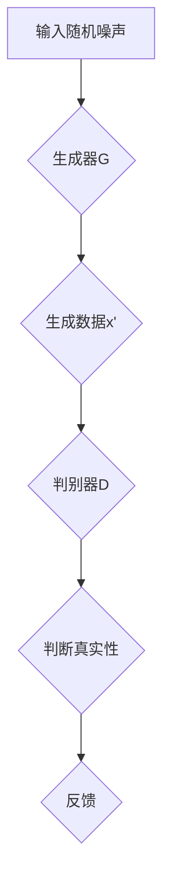

                 

### AIGC在智能纳米机器人群体控制中的应用

> 关键词：AIGC，智能纳米机器人，群体控制，生成对抗网络，深度学习

> 摘要：本文探讨了自动生成内容（AIGC）技术在智能纳米机器人群体控制中的应用。通过引入生成对抗网络（GAN）等深度学习模型，实现了对纳米机器人行为的智能调控，提升了群体控制的效率与灵活性。文章介绍了AIGC和智能纳米机器人的基本概念，详细分析了AIGC在智能纳米机器人群体控制中的技术原理和实现方法，并讨论了相关的安全和伦理问题。

---

#### 引言

在科技飞速发展的今天，人工智能（AI）已经渗透到我们生活的方方面面。从语音助手到自动驾驶，AI技术正不断推动社会的进步。其中，自动生成内容（AIGC，AI-Generated Content）作为一种新兴的AI技术，正逐步应用于图像、文本、音频等多种领域。AIGC技术利用深度学习模型，如生成对抗网络（GAN）和变分自编码器（VAE），能够生成高质量的数据，为各种应用场景提供了新的可能性。

智能纳米机器人作为一种具有高精度、高效率的微型机器人，在医疗、制造、环境监测等领域具有广泛的应用前景。然而，智能纳米机器人在实际应用中面临的一个关键挑战是如何实现对大量机器人的高效群体控制。传统的控制方法通常依赖于预先设定的规则和算法，无法适应动态变化的环境和复杂的任务需求。

本文旨在探讨AIGC技术在智能纳米机器人群体控制中的应用，通过引入AIGC技术，实现对机器人行为的智能调控，提高群体控制的效率和灵活性。文章将首先介绍AIGC和智能纳米机器人的基本概念，然后详细分析AIGC在智能纳米机器人群体控制中的技术原理和实现方法，并讨论相关的安全和伦理问题。

#### 核心概念与联系

##### AIGC

AIGC，全称为“自动生成内容”，是指利用人工智能技术生成文本、图像、音频等多种形式的内容。AIGC的核心在于利用深度学习模型，尤其是生成对抗网络（GAN）和变分自编码器（VAE），实现数据的自动生成。

- **生成对抗网络（GAN）**：由生成器和判别器组成，生成器旨在生成逼真的数据，判别器则用于区分生成数据和真实数据。通过这种对抗训练，生成器不断提高生成质量，从而生成高度逼真的数据。
- **变分自编码器（VAE）**：通过概率模型进行数据的编码和解码，能够生成具有多样化特征的数据。

##### 智能纳米机器人

智能纳米机器人是指尺寸在微米或纳米级别的机器人，具备高精度、高效率的操控能力。它们在医疗、制造、环境监测等领域具有广泛的应用潜力。

- **设计原理**：智能纳米机器人通常采用纳米材料、微型机械系统和人工智能算法进行设计，实现其高精度、高效率的操控能力。
- **控制方法**：智能纳米机器人的控制通常依赖于基于模型的控制算法和群体控制策略，通过实时监测和反馈调整机器人的行为。

##### 群体控制

群体控制是指通过协调多个机器人的行为，实现特定任务的目标。智能纳米机器人群体控制的核心在于如何高效地调度和协调机器人的行动，以应对动态变化的环境和复杂任务需求。

- **算法设计**：群体控制算法通常包括分布式算法和基于模型的算法。分布式算法通过分散的计算和通信，实现机器人的协调行动；基于模型的算法则通过建立模型，对机器人的行为进行预测和控制。
- **挑战与优化**：智能纳米机器人群体控制面临的主要挑战包括通信延迟、环境复杂性和任务多样性。通过优化算法和模型，可以提高群体控制的效率和灵活性。

#### 第2章 AIGC基础

##### 2.1 AIGC技术概述

AIGC技术是基于深度学习模型的数据生成技术。它能够生成高质量的文本、图像、音频等多种类型的数据，为各个领域的应用提供了新的可能性。

- **AIGC的定义与核心概念**：AIGC是指利用人工智能技术生成内容，主要包括文本生成、图像生成、音频生成等。
- **AIGC的应用场景**：AIGC技术已广泛应用于游戏开发、广告创意、教育、医疗等领域，通过生成高质量的数据，提高内容创作的效率和效果。

##### 2.2 生成模型介绍

AIGC技术主要依赖于生成模型，如生成对抗网络（GAN）和变分自编码器（VAE）等。这些模型通过深度学习训练，能够生成高质量的数据。

- **GAN模型原理与流程图**：GAN由生成器和判别器组成，通过对抗训练，生成器生成数据，判别器判断数据的真实性。流程图如下：



- **VAE模型原理与流程图**：VAE通过编码和解码过程，实现数据的生成。流程图如下：

```mermaid
graph TD
A[输入数据x] --> B{编码器\(\mu, \sigma\)}
B --> C{编码z}
C --> D{解码器G(z)}
D --> E{生成数据x'}
```

##### 2.3 AIGC应用场景分析

AIGC技术在多个领域具有广泛的应用。以下是一些典型的应用场景：

- **文本生成**：利用AIGC技术生成新闻文章、小说、对话等。例如，使用GPT-3生成高质量的文章。
- **图像生成**：利用AIGC技术生成艺术作品、照片、场景等。例如，使用StyleGAN生成逼真的图像。
- **音频生成**：利用AIGC技术生成音乐、语音、声音效果等。例如，使用WaveNet生成自然的语音。

#### 第3章 智能纳米机器人基础

##### 3.1 智能纳米机器人概述

智能纳米机器人是一种尺寸在微米或纳米级别的微型机器人，具备高精度、高效率的操控能力。它们在医疗、制造、环境监测等领域具有广泛的应用前景。

- **智能纳米机器人的定义与特点**：智能纳米机器人是指采用纳米技术、人工智能算法和微型机械系统设计的微型机器人。它们具备高精度、高效率、自主决策和协作能力等特点。
- **智能纳米机器人的应用领域**：智能纳米机器人在医疗、制造、环境监测、国防等领域具有广泛的应用。例如，在医疗领域，智能纳米机器人可用于癌症治疗、细胞操作等。

##### 3.2 机器人设计与控制方法

智能纳米机器人的设计与控制是确保其高效运行的关键。以下介绍智能纳米机器人的设计与控制方法：

- **机器人硬件设计**：智能纳米机器人的硬件设计主要包括纳米材料、微型机械系统和传感器等。硬件设计需要考虑机器人的尺寸、形状、操控能力和能源供应等因素。
- **机器人控制算法**：智能纳米机器人的控制算法主要包括基于模型的控制和基于学习的方法。基于模型的控制方法通过建立数学模型，对机器人的行为进行预测和控制；基于学习的方法则通过机器学习算法，对机器人的行为进行优化和调整。

#### 第4章 群体控制算法

##### 4.1 算法设计原理

智能纳米机器人的群体控制是指通过协调多个机器人的行为，实现特定任务的目标。群体控制算法的设计需要考虑通信延迟、环境复杂性和任务多样性等因素。

- **群体控制的定义与核心问题**：群体控制是指通过协调多个机器人的行为，实现特定任务的目标。核心问题包括通信、同步、协调和决策等。
- **群体控制算法的设计思路**：群体控制算法的设计思路主要包括分布式算法和基于模型的算法。分布式算法通过分散的计算和通信，实现机器人的协调行动；基于模型的算法则通过建立模型，对机器人的行为进行预测和控制。

##### 4.2 具体算法介绍

以下介绍几种常见的群体控制算法：

- **分布式算法**：分布式算法通过在各个机器人上执行本地计算和通信，实现机器人的协调行动。例如，基于博弈论的分布式控制算法通过博弈过程，实现机器人的协同行为。

- **基于模型的算法**：基于模型的算法通过建立数学模型，对机器人的行为进行预测和控制。例如，基于动态系统的控制算法通过建立机器人的动力学模型，实现对机器人的实时控制。

- **其他类型算法介绍**：除了分布式算法和基于模型的算法，还有其他类型的群体控制算法，如基于机器学习的算法和基于神经网络的算法。这些算法通过学习和预测，实现对机器人的智能控制。

##### 4.3 算法实现与分析

以下是一个简单的分布式算法实现示例：

```python
# 分布式算法实现示例
class Robot:
    def __init__(self, position):
        self.position = position

    def move(self, direction, distance):
        new_position = self.position + direction * distance
        self.position = new_position

    def communicate(self, other_robot):
        # 实现机器人之间的通信
        pass

class Controller:
    def __init__(self, robots):
        self.robots = robots

    def control(self):
        for robot in self.robots:
            robot.communicate()
            # 根据本地信息和全局信息，调整机器人的行为

# 实例化机器人
robots = [Robot(position) for position in range(10)]

# 实例化控制器
controller = Controller(robots)

# 执行控制过程
controller.control()
```

算法性能分析：

- **性能指标**：算法的性能指标包括响应时间、控制精度、能耗等。
- **性能分析**：通过模拟实验和实际应用，对算法的性能进行评估和分析，以确定算法的适用性和优化方向。

#### 第5章 AIGC在智能纳米机器人中的应用

##### 5.1 实际应用案例介绍

以下介绍几个AIGC在智能纳米机器人中的应用案例：

- **医疗领域应用**：利用AIGC技术生成个性化的手术方案，提高手术的精准度和成功率。例如，利用GAN生成与患者病情相似的患者病例，为医生提供参考。
- **制造领域应用**：利用AIGC技术生成高效的制造流程和机器人控制策略，提高生产效率和产品质量。例如，利用VAE生成与实际生产需求相似的机器人运动轨迹。

##### 5.2 应用效果评估与优化

应用效果评估主要包括以下几个方面：

- **评价指标**：评价指标包括任务完成时间、机器人能耗、控制精度等。
- **效果分析**：通过实际应用和模拟实验，对AIGC技术在智能纳米机器人群体控制中的应用效果进行评估和分析。

优化策略：

- **算法优化**：通过改进算法模型和参数设置，提高群体控制的效率和稳定性。
- **硬件优化**：通过优化机器人硬件设计和材料，提高机器人的性能和稳定性。
- **系统优化**：通过优化系统架构和通信协议，提高系统的响应速度和可靠性。

#### 第6章 安全性与伦理

##### 6.1 AIGC应用中的安全挑战

AIGC技术在智能纳米机器人群体控制中的应用面临以下安全挑战：

- **数据安全**：AIGC技术生成的内容可能包含敏感信息，需要确保数据的隐私和安全。
- **系统安全**：AIGC技术的应用可能面临网络攻击、恶意软件等安全威胁。

##### 6.2 伦理问题讨论

AIGC技术在智能纳米机器人群体控制中的应用也引发了一系列伦理问题：

- **安全伦理**：如何确保AIGC技术生成的内容和行为符合安全标准和道德规范。
- **隐私伦理**：如何保护用户的隐私权和数据安全。

#### 第7章 未来展望

AIGC技术在智能纳米机器人群体控制中的应用具有广阔的前景。随着技术的不断进步，未来将在以下几个方面取得突破：

- **技术创新**：开发更高效、更稳定的AIGC技术，提高智能纳米机器人的群体控制能力。
- **应用扩展**：将AIGC技术应用于更多领域，如农业、能源等，实现智能化的群体控制。

##### 7.2 未来研究方向与挑战

未来研究方向：

- **算法优化**：研究更高效的群体控制算法，提高机器人群体行为的灵活性和适应性。
- **硬件提升**：研究新型纳米材料和微型机械系统，提高智能纳米机器人的性能和可靠性。
- **系统集成**：研究如何将AIGC技术与其他先进技术（如5G、物联网等）进行集成，实现更智能的群体控制。

挑战：

- **算法复杂性**：群体控制算法的复杂度较高，需要研究更简单、更有效的算法。
- **资源限制**：智能纳米机器人通常受限于计算资源和能源供应，需要研究如何在有限资源下实现高效的群体控制。

#### 作者信息

作者：AI天才研究院/AI Genius Institute & 禅与计算机程序设计艺术 /Zen And The Art of Computer Programming

---

本文以清晰的结构和逻辑，详细探讨了AIGC在智能纳米机器人群体控制中的应用。从核心概念、技术原理到实际应用，本文提供了全面的解析，为读者提供了深入了解该领域的机会。随着技术的发展，AIGC在智能纳米机器人群体控制中的应用前景将更加广阔，本文的研究也为未来的研究提供了有益的参考。

