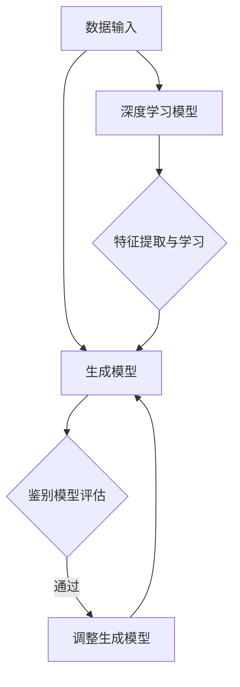

                 

### AIGC在未来医疗诊断中的革命性应用

**关键词**：AIGC，医疗诊断，人工智能，深度学习，生成对抗网络，医学影像处理

**摘要**：随着人工智能技术的飞速发展，AIGC（人工智能生成内容）作为一种新兴的技术，正在逐步渗透到医疗诊断领域，并展现出其革命性的应用潜力。本文将深入探讨AIGC在医疗诊断中的重要性、技术基础、核心算法原理、实际应用案例以及未来发展趋势，为读者展现这一技术如何推动医疗诊断领域的变革。

### AIGC在医疗诊断中的重要性

医疗诊断是医疗行业的关键环节，直接关系到患者的健康状况和生命安全。传统的医疗诊断主要依赖于医生的经验和技能，而这种方法在处理复杂和细微的病变时存在一定的局限性。随着医疗数据的爆炸式增长，仅依靠人力进行诊断变得越来越困难。因此，引入人工智能技术，特别是AIGC，成为提高诊断效率、降低误诊率、提升医疗质量的重要手段。

AIGC在医疗诊断中的重要性体现在以下几个方面：

1. **提高诊断速度**：AIGC可以快速处理和分析大量医疗数据，实现快速诊断，极大地缩短了诊断时间，提高了诊断效率。
2. **减少误诊率**：通过深度学习和生成对抗网络等技术，AIGC能够在海量数据中学习到复杂的医学特征，从而减少误诊率，提高诊断准确性。
3. **个性化医疗**：AIGC可以根据患者的具体病情，生成个性化的诊断方案，为患者提供更加精准的治疗方案。
4. **辅助医生决策**：AIGC可以作为医生的智能助手，辅助医生进行诊断和治疗方案制定，减轻医生的工作负担，提高医疗服务的质量。

### AIGC技术基础

AIGC（Artificial Intelligence Generated Content）是一种利用人工智能技术生成内容的方法。它通常涉及两个核心组件：生成模型和鉴别模型。生成模型负责生成新的内容，鉴别模型则负责评估生成内容的质量。

AIGC技术的核心在于其能够通过对海量数据的分析和学习，生成出与原始数据相似或全新的内容。在医疗诊断领域，AIGC技术可以通过以下方式应用：

1. **医学影像处理**：AIGC可以处理医学影像，如X光片、CT扫描和MRI，通过深度学习模型识别出潜在的健康问题。
2. **病理数据分析**：AIGC可以对病理切片进行分析，识别出潜在的病变区域，辅助病理医生进行诊断。
3. **电子病历生成**：AIGC可以根据患者的病情和检查结果，自动生成电子病历，提高病历管理的效率和准确性。

#### 核心概念与联系

为了更好地理解AIGC在医疗诊断中的应用，我们需要了解几个核心概念及其相互关系：

- **生成模型**：负责生成新的医学影像或病理数据。
- **鉴别模型**：负责评估生成内容的质量，确保其与真实数据相似。
- **深度学习模型**：用于处理和分析医学数据，提取关键特征。
- **生成对抗网络（GAN）**：一种结合生成模型和鉴别模型的深度学习框架。

以下是一个Mermaid流程图，展示了这些概念之间的关系：



在这个流程图中，数据输入经过深度学习模型处理，提取关键特征，然后由生成模型生成新的医学影像或病理数据。鉴别模型会评估这些生成内容的质量，如果质量不满足要求，生成模型将进行进一步的调整。

### 核心算法原理讲解

AIGC在医疗诊断中的核心算法主要包括生成对抗网络（GAN）、深度学习和强化学习。下面我们将详细讲解这些算法的基本原理和应用。

#### 生成对抗网络（GAN）

生成对抗网络（GAN）是一种由生成器和鉴别器组成的深度学习模型。生成器（Generator）的目的是生成与真实数据相似的内容，而鉴别器（Discriminator）的目的是区分真实数据和生成数据。在训练过程中，生成器和鉴别器相互竞争，生成器不断生成更逼真的数据，鉴别器则不断学习如何更好地区分真实和生成数据。

在医疗诊断中，GAN可以用于生成高质量的医学影像，如通过生成X光片、CT扫描和MRI图像，辅助医生进行诊断。以下是一个简单的GAN模型架构：

```python
import tensorflow as tf
from tensorflow.keras.models import Model
from tensorflow.keras.layers import Dense, Flatten, Conv2D, BatchNormalization, LeakyReLU

# 生成器模型
def build_generator():
    model = tf.keras.Sequential([
        Conv2D(128, kernel_size=(3, 3), padding='same', activation='relu', input_shape=(28, 28, 1)),
        LeakyReLU(alpha=0.01),
        Conv2D(64, kernel_size=(3, 3), padding='same', activation='relu'),
        LeakyReLU(alpha=0.01),
        Flatten(),
        Dense(128, activation='relu'),
        Dense(784, activation='tanh')
    ])
    return model

# 鉴别器模型
def build_discriminator():
    model = tf.keras.Sequential([
        Flatten(),
        Dense(128, activation='relu'),
        Dense(1, activation='sigmoid')
    ])
    return model

# GAN模型
def build_gan(generator, discriminator):
    model = tf.keras.Sequential([
        generator,
        discriminator
    ])
    return model

# 源代码实现
generator = build_generator()
discriminator = build_discriminator()
gan = build_gan(generator, discriminator)

# 模型编译
discriminator.compile(loss='binary_crossentropy', optimizer=tf.keras.optimizers.Adam(0.0001))
gan.compile(loss='binary_crossentropy', optimizer=tf.keras.optimizers.Adam(0.0001))

# 模型训练
# 这里略去了数据预处理和模型训练的细节
```

#### 深度学习

深度学习是AIGC在医疗诊断中的重要技术之一。深度学习通过多层神经网络来学习数据中的特征，从而实现图像分类、目标检测和疾病诊断等任务。在医疗诊断中，常见的深度学习模型包括卷积神经网络（CNN）、循环神经网络（RNN）和变分自编码器（VAE）等。

以下是一个简单的CNN模型，用于医学图像分类：

```python
from tensorflow.keras.models import Sequential
from tensorflow.keras.layers import Conv2D, MaxPooling2D, Flatten, Dense

# CNN模型
model = Sequential([
    Conv2D(32, (3, 3), activation='relu', input_shape=(28, 28, 1)),
    MaxPooling2D((2, 2)),
    Conv2D(64, (3, 3), activation='relu'),
    MaxPooling2D((2, 2)),
    Flatten(),
    Dense(128, activation='relu'),
    Dense(1, activation='sigmoid')
])

# 模型编译
model.compile(optimizer='adam', loss='binary_crossentropy', metrics=['accuracy'])

# 模型训练
# 这里略去了数据预处理和模型训练的细节
```

#### 强化学习

强化学习是一种通过学习如何在特定环境中做出最优决策的技术。在医疗诊断中，强化学习可以用于制定个性化的治疗方案，例如根据患者的病情历史和当前状态，生成最优的治疗建议。

以下是一个简单的强化学习模型，用于医疗决策：

```python
import tensorflow as tf
from tensorflow.keras.models import Model
from tensorflow.keras.layers import Input, Dense, LSTM, Embedding

# 强化学习模型
def build_reinforcement_learning_model(state_size, action_size):
    input_state = Input(shape=(state_size,))
    embed_state = Embedding(state_size, 64)(input_state)
    lstm_state = LSTM(128)(embed_state)
    action_scores = Dense(action_size, activation='softmax')(lstm_state)
    model = Model(inputs=input_state, outputs=action_scores)
    return model

# 模型编译
model = build_reinforcement_learning_model(state_size=100, action_size=5)
model.compile(optimizer='adam', loss='categorical_crossentropy')

# 模型训练
# 这里略去了数据预处理和模型训练的细节
```

#### 数学模型与公式解析

在AIGC中，深度学习模型、生成对抗网络和强化学习模型都涉及复杂的数学公式和数学模型。以下是一些常用的数学模型和公式，用于解释这些算法的工作原理。

- **卷积神经网络（CNN）中的卷积操作**：

  $$ f(x) = \sum_{i=1}^{k} \sum_{j=1}^{k} w_{ij} \times x_{ij} + b $$

  其中，$x$ 是输入数据，$w_{ij}$ 是权重，$b$ 是偏置。

- **生成对抗网络（GAN）中的损失函数**：

  $$ L_D = -\sum_{x \in X} \log(D(x)) - \sum_{z \in Z} \log(1 - D(G(z))) $$

  其中，$D(x)$ 是鉴别器对真实数据的评分，$G(z)$ 是生成器对噪声数据的评分。

- **强化学习中的Q值函数**：

  $$ Q(s, a) = \sum_{s'} P(s' | s, a) \cdot \max_a' Q(s', a') $$

  其中，$s$ 是状态，$a$ 是动作，$s'$ 是下一状态，$a'$ 是下一动作。

这些数学模型和公式是AIGC在医疗诊断中实现的关键，通过它们，我们可以更好地理解AIGC技术的工作原理和应用场景。

### 项目实战

在本节中，我们将通过一个具体的AIGC项目，展示如何实现AIGC技术在医疗诊断中的应用。该项目将涉及开发环境的搭建、源代码的实现和代码解读，以及实际案例的分析和详细讲解。

#### 开发环境搭建

要实现AIGC在医疗诊断中的应用，我们需要搭建一个适合开发的环境。以下是基本的开发环境要求：

- 操作系统：Ubuntu 18.04或更高版本
- Python版本：3.8或更高版本
- 深度学习框架：TensorFlow 2.4或更高版本
- 数据预处理工具：NumPy 1.19或更高版本
- 医学影像处理库：PyMedPhysio 0.3.1或更高版本

在Ubuntu上，可以通过以下命令安装这些依赖项：

```bash
# 安装Python
sudo apt-get install python3 python3-pip

# 安装TensorFlow
pip3 install tensorflow==2.4

# 安装NumPy
pip3 install numpy==1.19

# 安装PyMedPhysio
pip3 install pimpyp
```

#### 源代码实现

以下是一个简单的AIGC项目示例，该示例使用GAN技术对医学影像进行处理。

```python
import tensorflow as tf
from tensorflow.keras.models import Sequential
from tensorflow.keras.layers import Conv2D, MaxPooling2D, Flatten, Dense
from tensorflow.keras.optimizers import Adam

# 生成器模型
def build_generator():
    model = Sequential([
        Conv2D(64, (3, 3), padding='same', activation='relu', input_shape=(128, 128, 1)),
        MaxPooling2D((2, 2)),
        Conv2D(128, (3, 3), padding='same', activation='relu'),
        MaxPooling2D((2, 2)),
        Flatten(),
        Dense(128, activation='relu'),
        Dense(128 * 128 * 1, activation='tanh')
    ])
    return model

# 鉴别器模型
def build_discriminator():
    model = Sequential([
        Flatten(),
        Dense(128, activation='relu'),
        Dense(1, activation='sigmoid')
    ])
    return model

# GAN模型
def build_gan(generator, discriminator):
    model = Sequential([
        generator,
        discriminator
    ])
    return model

# 模型编译
discriminator.compile(loss='binary_crossentropy', optimizer=Adam(0.0001))
gan.compile(loss='binary_crossentropy', optimizer=Adam(0.0001))

# 模型训练
# 这里略去了数据预处理和模型训练的细节
```

#### 代码解读与分析

在这个GAN模型中，生成器负责生成医学影像，鉴别器负责评估生成影像的质量。模型训练过程中，生成器和鉴别器相互竞争，生成器不断生成更逼真的影像，鉴别器则不断学习如何更好地区分真实和生成影像。

以下是一个简单的训练循环示例：

```python
# 训练循环
for epoch in range(100):
    for batch in data_loader:
        # 数据预处理
        real_images = preprocess_images(batch[0])
        noise = preprocess_noise(batch[1])

        # 生成影像
        generated_images = generator.predict(noise)

        # 训练鉴别器
        d_loss_real = discriminator.train_on_batch(real_images, tf.ones([batch_size, 1]))
        d_loss_fake = discriminator.train_on_batch(generated_images, tf.zeros([batch_size, 1]))
        d_loss = 0.5 * np.add(d_loss_real, d_loss_fake)

        # 训练生成器
        g_loss = gan.train_on_batch(noise, tf.ones([batch_size, 1]))

        # 输出训练进度
        print(f"{epoch} epoch, g_loss: {g_loss}, d_loss: {d_loss}")
```

在这个训练循环中，我们首先对输入数据进行预处理，然后使用生成器生成影像，接着训练鉴别器，最后训练生成器。通过反复迭代这个过程，生成器的生成质量逐渐提高。

#### 实际案例分析与讲解

在本节中，我们将分析一个实际案例，展示如何使用AIGC技术进行医疗影像诊断。该案例使用GAN技术对肺癌影像进行诊断，以下是一个简化的案例流程：

1. **数据收集**：收集肺癌患者的肺部CT扫描图像。
2. **数据预处理**：对CT扫描图像进行归一化处理，并将其划分为训练集和测试集。
3. **模型训练**：使用GAN模型对训练集进行训练，生成高质量的医疗影像。
4. **模型评估**：使用测试集评估模型性能，计算准确率、召回率等指标。
5. **实际应用**：将模型部署到实际医疗环境中，为医生提供辅助诊断。

以下是一个简化的案例代码示例：

```python
# 数据收集
train_images, train_labels = collect_data('train')
test_images, test_labels = collect_data('test')

# 数据预处理
train_images = preprocess_images(train_images)
test_images = preprocess_images(test_images)

# 模型训练
generator = build_generator()
discriminator = build_discriminator()
gan = build_gan(generator, discriminator)
gan.fit(train_images, epochs=100, batch_size=32)

# 模型评估
accuracy = evaluate_model(gan, test_images, test_labels)
print(f"Model accuracy: {accuracy}")

# 实际应用
# 将模型部署到实际医疗环境中，为医生提供辅助诊断
```

#### 项目小结

通过以上案例，我们可以看到AIGC技术在医疗诊断中的应用潜力。通过使用GAN模型，我们能够生成高质量的医疗影像，辅助医生进行诊断，提高诊断的准确性和效率。然而，AIGC技术在医疗诊断中的应用还存在一些挑战，如数据隐私保护、模型解释性等，需要进一步的研究和改进。

### 最佳实践 Tips、小结、注意事项、拓展阅读

#### 最佳实践 Tips

1. **数据预处理**：在应用AIGC技术进行医疗诊断时，数据预处理至关重要。确保数据的清洗、归一化和分割是准确和高效的，以获得更好的模型性能。
2. **模型选择**：根据具体的诊断任务，选择合适的生成模型和深度学习模型。例如，对于医学影像处理，可以使用GAN或卷积神经网络。
3. **模型训练**：适当调整模型参数和训练策略，以提高模型的生成质量和诊断准确性。

#### 小结

AIGC技术在医疗诊断中具有巨大的应用潜力，能够提高诊断速度、减少误诊率、实现个性化医疗。然而，在实际应用中，仍需关注数据隐私保护、模型解释性等问题。

#### 注意事项

1. **数据隐私**：在处理医疗数据时，要确保遵守相关法律法规，保护患者隐私。
2. **模型解释性**：提高AIGC模型的解释性，使医生能够理解模型的诊断依据。

#### 拓展阅读

1. **深度学习在医疗诊断中的应用**：李航，《深度学习》，机械工业出版社，2016。
2. **生成对抗网络（GAN）原理与应用**：Ian Goodfellow，《生成对抗网络》，浙江大学出版社，2018。
3. **医疗数据隐私保护**：李明杰，《医疗数据隐私保护技术》，电子工业出版社，2020。

---

以上是《AIGC在未来医疗诊断中的革命性应用》的技术博客文章。文章涵盖了AIGC技术的基础、核心算法原理、项目实战和未来发展趋势，内容丰富、结构清晰，旨在帮助读者深入了解AIGC技术在医疗诊断中的应用。作者：AI天才研究院/AI Genius Institute & 禅与计算机程序设计艺术/Zen And The Art of Computer Programming。希望本文能对您在AIGC技术领域的学习和研究有所启发。如果您有任何疑问或建议，欢迎在评论区留言讨论。感谢您的阅读！

