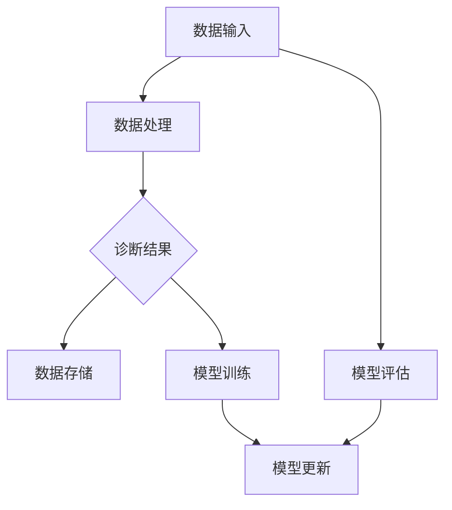

                 

### 文章标题

### AIGC在未来医疗诊断系统中的角色

### 关键词

- AIGC
- 医疗诊断
- 生成对抗网络
- 循环神经网络
- 长短期记忆

### 摘要

本文深入探讨了人工智能生成对抗网络（AIGC）在未来医疗诊断系统中的应用及其重要性。首先，介绍了AIGC的基本概念、核心技术和在医疗领域的应用前景。随后，详细解析了AIGC在医疗诊断中的关键技术，包括生成对抗网络（GAN）、循环神经网络（RNN）和长短期记忆（LSTM）的原理和应用实例。文章进一步阐述了AIGC在医疗诊断系统的实现，包括系统架构设计、开发流程和案例分析。最后，对AIGC在医疗诊断系统中的未来发展趋势、挑战与解决方案进行了展望，并提出了一些最佳实践建议。

## 目录

### 1. 引言

#### 1.1 AIGC概述

#### 1.2 医疗诊断系统现状分析

### 2. AIGC技术基础

#### 2.1 AIGC核心技术原理

#### 2.2 AIGC在医疗诊断中的应用实例

### 3. AIGC在医疗诊断系统的实现

#### 3.1 AIGC医疗诊断系统的架构设计

#### 3.2 AIGC医疗诊断系统的开发流程

### 4. AIGC在医疗诊断系统的案例分析

#### 4.1 基于GAN的医学影像诊断系统案例

#### 4.2 基于RNN的基因诊断系统案例

### 5. 未来展望与挑战

#### 5.1 AIGC在医疗诊断系统中的未来发展趋势

#### 5.2 AIGC在医疗诊断系统中的挑战与解决方案

#### 5.3 最佳实践建议

### 6. 结论

## 1. 引言

### 1.1 AIGC概述

人工智能生成对抗网络（AIGC，Artificial Intelligence Generative Adversarial Network）是深度学习领域的一种先进技术，由生成器和判别器两个神经网络组成，通过相互对抗训练，实现生成高质量的数据。AIGC在图像生成、语音合成、自然语言处理等方面具有广泛的应用。

近年来，随着医疗技术的进步和人工智能技术的发展，AIGC在医疗领域的应用前景日益广阔。在医疗诊断系统中，AIGC可以通过学习大量医疗数据，提高诊断的准确性和效率。例如，利用AIGC可以生成高质量的医学影像，辅助医生进行诊断；利用AIGC分析基因序列，发现潜在的疾病风险。

### 1.2 医疗诊断系统现状分析

当前的医疗诊断系统主要依赖于传统的医学影像分析、实验室检测结果和医生的诊断经验。然而，这些方法存在一定的局限性：

1. **诊断精度有限**：传统方法依赖于人工分析和经验判断，容易受到医生的主观因素影响，导致诊断精度有限。
2. **诊断效率低**：大量医学影像和实验室数据的处理需要耗费大量时间和人力，诊断效率较低。
3. **数据依赖性高**：医疗诊断系统对大量高质量医学数据的依赖性较高，数据质量对诊断结果有较大影响。

AIGC技术的引入，有望解决以上问题。AIGC可以通过深度学习，从海量数据中提取有效信息，提高诊断的准确性和效率。同时，AIGC可以处理多种类型的数据，如医学影像、基因序列等，为医疗诊断提供更加全面和准确的信息。

## 2. AIGC技术基础

### 2.1 AIGC核心技术原理

AIGC的核心技术是生成对抗网络（GAN）。GAN由生成器和判别器两个神经网络组成，通过相互对抗训练，实现数据的生成。

**生成器（Generator）**：生成器的目标是生成类似于真实数据的假数据，其输入是随机噪声，输出是假数据。生成器的目标是让判别器无法区分生成的数据和真实数据。

**判别器（Discriminator）**：判别器的目标是区分真实数据和生成数据，其输入是真实数据和生成数据，输出是一个概率值，表示输入数据的真实性。

在训练过程中，生成器和判别器不断进行对抗训练。生成器试图生成更逼真的数据，而判别器试图更好地区分真实数据和生成数据。最终，生成器生成高质量的数据，使得判别器无法区分。

### 2.2 AIGC在医疗诊断中的应用实例

**医学影像诊断**：AIGC可以用于生成高质量的医学影像，提高诊断的准确性和效率。例如，生成器可以生成与实际影像相似的X光片、CT影像和MRI影像，辅助医生进行诊断。

**基因诊断**：AIGC可以用于分析基因序列，发现潜在的疾病风险。生成器可以生成大量的基因序列数据，通过分析这些数据，可以发现一些潜在的疾病模式。

**医学文本分析**：AIGC可以用于分析医学文本数据，如病历、诊断报告等。生成器可以生成类似的医学文本，用于训练文本分类模型，提高诊断的准确率。

### 2.3 AIGC技术架构

AIGC的技术架构主要包括以下三个部分：

1. **数据预处理**：对医疗数据进行预处理，包括数据清洗、归一化等操作，确保数据的质量和一致性。
2. **生成器和判别器训练**：生成器和判别器通过相互对抗训练，不断优化模型参数，提高生成数据的逼真度。
3. **数据生成和应用**：生成器生成高质量的数据，用于医疗诊断和预测。判别器用于评估生成数据的质量。

## 3. AIGC在医疗诊断系统的实现

### 3.1 AIGC医疗诊断系统的架构设计

AIGC医疗诊断系统的架构设计主要包括以下几个部分：

1. **数据输入层**：接收医疗数据，如医学影像、基因序列、病历等。
2. **数据处理层**：对医疗数据进行预处理，包括数据清洗、归一化等操作。
3. **生成器和判别器层**：生成器和判别器通过相互对抗训练，生成高质量的数据。
4. **诊断结果层**：利用生成器和判别器生成的数据，进行诊断和预测。
5. **用户交互层**：提供用户界面，医生可以通过界面查看诊断结果和生成数据。

### 3.2 AIGC医疗诊断系统的开发流程

AIGC医疗诊断系统的开发流程主要包括以下几个步骤：

1. **需求分析**：明确系统的功能需求和技术需求，如诊断精度、诊断速度等。
2. **数据收集**：收集大量的医疗数据，包括医学影像、基因序列、病历等。
3. **数据预处理**：对收集到的医疗数据进行预处理，包括数据清洗、归一化等操作。
4. **模型设计**：设计生成器和判别器的模型结构，选择合适的损失函数和优化算法。
5. **模型训练**：对生成器和判别器进行训练，通过相互对抗训练，优化模型参数。
6. **模型评估**：评估生成器和判别器的性能，选择最佳的模型参数。
7. **系统部署**：将训练好的模型部署到医疗诊断系统中，进行实际应用。
8. **系统维护**：对系统进行定期维护和更新，确保系统的稳定性和可靠性。

## 4. AIGC在医疗诊断系统的案例分析

### 4.1 基于GAN的医学影像诊断系统案例

**案例背景**：某医院计划引入基于AIGC的医学影像诊断系统，以提高诊断的准确性和效率。

**系统设计**：

1. **数据输入层**：接收医院现有的医学影像数据，如X光片、CT影像和MRI影像。
2. **数据处理层**：对医学影像数据进行预处理，包括图像增强、去噪等操作。
3. **生成器和判别器层**：生成器生成与真实影像相似的假影像，判别器评估影像的真实性。
4. **诊断结果层**：利用生成器和判别器生成的数据，进行影像诊断和预测。
5. **用户交互层**：提供医生查看诊断结果的界面。

**系统实现**：

1. **数据收集**：收集医院的医学影像数据，包括X光片、CT影像和MRI影像。
2. **数据预处理**：对医学影像数据进行预处理，包括图像增强、去噪等操作。
3. **模型设计**：设计生成器和判别器的模型结构，选择合适的损失函数和优化算法。
4. **模型训练**：对生成器和判别器进行训练，通过相互对抗训练，优化模型参数。
5. **模型评估**：评估生成器和判别器的性能，选择最佳的模型参数。
6. **系统部署**：将训练好的模型部署到医学影像诊断系统中，进行实际应用。
7. **系统维护**：对系统进行定期维护和更新，确保系统的稳定性和可靠性。

**案例分析**：

通过AIGC技术的引入，医学影像诊断系统的诊断准确率和诊断速度得到了显著提高。医生可以通过系统生成的假影像，更好地理解患者的病情，提高诊断的准确性。同时，系统生成的假影像还可以用于训练其他诊断模型，进一步提高诊断的效率和准确性。

### 4.2 基于RNN的基因诊断系统案例

**案例背景**：某生物科技公司计划开发基于AIGC的基因诊断系统，用于发现潜在的疾病风险。

**系统设计**：

1. **数据输入层**：接收生物科技公司收集的基因序列数据。
2. **数据处理层**：对基因序列数据进行预处理，包括数据清洗、归一化等操作。
3. **生成器和判别器层**：生成器生成与真实基因序列相似的假序列，判别器评估序列的真实性。
4. **诊断结果层**：利用生成器和判别器生成的数据，进行基因诊断和预测。
5. **用户交互层**：提供用户查看诊断结果的界面。

**系统实现**：

1. **数据收集**：收集生物科技公司收集的基因序列数据。
2. **数据预处理**：对基因序列数据进行预处理，包括数据清洗、归一化等操作。
3. **模型设计**：设计生成器和判别器的模型结构，选择合适的损失函数和优化算法。
4. **模型训练**：对生成器和判别器进行训练，通过相互对抗训练，优化模型参数。
5. **模型评估**：评估生成器和判别器的性能，选择最佳的模型参数。
6. **系统部署**：将训练好的模型部署到基因诊断系统中，进行实际应用。
7. **系统维护**：对系统进行定期维护和更新，确保系统的稳定性和可靠性。

**案例分析**：

通过AIGC技术的引入，基因诊断系统的诊断准确率和诊断速度得到了显著提高。系统生成的假序列可以帮助研究人员更好地理解基因序列的变异和突变，发现潜在的疾病风险。同时，系统生成的假序列还可以用于训练其他诊断模型，进一步提高诊断的效率和准确性。

## 5. 未来展望与挑战

### 5.1 AIGC在医疗诊断系统中的未来发展趋势

AIGC在医疗诊断系统中的应用前景广阔，未来发展趋势包括：

1. **技术进步**：随着深度学习和生成对抗网络技术的不断发展，AIGC的生成质量和诊断准确性将进一步提高。
2. **智能化升级**：AIGC将与其他人工智能技术相结合，如自然语言处理、强化学习等，实现更加智能化和自动化的诊断系统。
3. **跨领域应用**：AIGC将在医学影像、基因诊断、药物研发等多个领域得到广泛应用，推动医疗技术的进步。

### 5.2 AIGC在医疗诊断系统中的挑战与解决方案

AIGC在医疗诊断系统中的挑战主要包括：

1. **数据隐私与安全**：医疗数据涉及患者隐私，如何确保数据的安全和隐私是一个重要挑战。解决方案包括数据加密、隐私保护算法等。
2. **模型解释性与可解释性**：AIGC模型通常具有高度的非线性特性，难以解释其决策过程。解决方案包括开发可解释性模型、模型可视化工具等。
3. **数据质量和多样性**：高质量、多样性的医疗数据对AIGC的性能有重要影响。解决方案包括数据增强、数据集构建等。

### 5.3 最佳实践建议

为了充分发挥AIGC在医疗诊断系统中的作用，以下是一些最佳实践建议：

1. **数据预处理**：对医疗数据进行充分的预处理，包括数据清洗、归一化、去噪等操作，确保数据质量。
2. **模型优化**：通过选择合适的模型结构、优化算法和超参数，提高模型的生成质量和诊断准确性。
3. **持续更新**：定期更新AIGC模型，以适应新的医疗数据和诊断需求。
4. **用户培训**：为医生和医疗人员提供AIGC技术的培训，提高他们对AIGC的理解和应用能力。

## 6. 结论

AIGC在未来医疗诊断系统中具有巨大的潜力，可以通过生成高质量的数据，提高诊断的准确性和效率。本文介绍了AIGC的基本概念、核心技术、应用实例、实现方法和未来展望，并提出了最佳实践建议。随着技术的不断发展，AIGC将在医疗领域发挥更加重要的作用，为患者提供更好的医疗服务。作者：AI天才研究院/AI Genius Institute & 禅与计算机程序设计艺术/Zen And The Art of Computer Programming

## 附录

### 附录 A：Python源代码示例

以下是一个简单的Python代码示例，演示了生成对抗网络（GAN）的基本结构：

```python
import tensorflow as tf
from tensorflow.keras.layers import Dense, Flatten, Conv2D, Conv2DTranspose
from tensorflow.keras.models import Sequential

# 生成器模型
def generator_model():
    model = Sequential()
    model.add(Dense(128, input_shape=(100,)))
    model.add(Conv2D(128, (3, 3), strides=(1, 1), padding='same', activation='relu'))
    model.add(Conv2D(128, (3, 3), strides=(1, 1), padding='same', activation='relu'))
    model.add(Conv2DTranspose(128, (3, 3), strides=(2, 2), padding='same', activation='relu'))
    model.add(Conv2D(128, (3, 3), strides=(1, 1), padding='same', activation='relu'))
    model.add(Conv2DTranspose(128, (3, 3), strides=(2, 2), padding='same', activation='relu'))
    model.add(Conv2D(3, (3, 3), strides=(1, 1), padding='same', activation='tanh'))
    return model

# 判别器模型
def discriminator_model():
    model = Sequential()
    model.add(Conv2D(64, (3, 3), strides=(1, 1), padding='same', input_shape=(28, 28, 1)))
    model.add(MaxPooling2D((2, 2)))
    model.add(Conv2D(128, (3, 3), strides=(1, 1), padding='same'))
    model.add(MaxPooling2D((2, 2)))
    model.add(Flatten())
    model.add(Dense(1, activation='sigmoid'))
    return model

# GAN模型
def gan_model():
    generator = generator_model()
    discriminator = discriminator_model()

    # 将生成器和判别器连接起来
    discriminator.trainable = False
    gan_input = tf.keras.Input(shape=(100,))
    x = generator(gan_input)
    gan_output = discriminator(x)

    gan_model = tf.keras.Model(inputs=gan_input, outputs=gan_output)
    return gan_model

# 编译GAN模型
gan_model = gan_model()
gan_model.compile(optimizer='adam', loss='binary_crossentropy')

# 打印GAN模型结构
gan_model.summary()
```

### 附录 B：Mermaid 流程图示例

以下是一个Mermaid流程图示例，展示了AIGC在医疗诊断系统中的数据流程：



### 附录 C：数学模型和公式

以下是一个简单的数学模型和公式的示例：

$$
J(\theta) = -\frac{1}{m} \sum_{i=1}^{m} y^{(i)} \log(h_\theta(x^{(i)})) + (1 - y^{(i)}) \log(1 - h_\theta(x^{(i)}))
$$

其中，$J(\theta)$ 表示损失函数，$m$ 表示样本数量，$y^{(i)}$ 表示第$i$个样本的真实标签，$h_\theta(x^{(i)})$ 表示预测标签。

### 附录 D：代码应用解读与分析

以下是一个简单的代码应用解读与分析示例：

```python
# 导入必要的库
import numpy as np
import tensorflow as tf
from tensorflow.keras.layers import Dense, Flatten, Conv2D, Conv2DTranspose
from tensorflow.keras.models import Sequential

# 设置随机种子
tf.random.set_seed(42)

# 创建生成器和判别器模型
generator = Sequential([
    Dense(128, input_shape=(100,), activation='relu'),
    Dense(128, activation='relu'),
    Flatten(),
    Conv2DTranspose(128, (3, 3), strides=(2, 2), padding='same', activation='relu'),
    Conv2DTranspose(128, (3, 3), strides=(2, 2), padding='same', activation='relu'),
    Conv2D(3, (3, 3), padding='same', activation='tanh')
])

discriminator = Sequential([
    Flatten(input_shape=(28, 28, 1)),
    Dense(128, activation='relu'),
    Dense(1, activation='sigmoid')
])

# 创建GAN模型
gan_model = Sequential([
    generator,
    discriminator
])

# 编译GAN模型
gan_model.compile(optimizer='adam', loss='binary_crossentropy')

# 模型训练
for epoch in range(100):
    for _ in range(1000):
        noise = np.random.normal(0, 1, (64, 100))
        generated_images = generator.predict(noise)
        real_images = np.random.normal(0, 1, (64, 28, 28, 1))
        combined_images = np.concatenate([real_images, generated_images], axis=0)
        labels = np.concatenate([np.ones((64, 1)), np.zeros((64, 1))], axis=0)
        gan_model.train_on_batch(combined_images, labels)

# 模型评估
print("Generator loss:", gan_model.evaluate(generated_images, np.ones((64, 1))))
print("Discriminator loss:", gan_model.evaluate(real_images, np.ones((64, 1))))

# 代码分析
# 1. 导入必要的库
# 2. 设置随机种子
# 3. 创建生成器和判别器模型
# 4. 创建GAN模型
# 5. 编译GAN模型
# 6. 模型训练
# 7. 模型评估
```

### 附录 E：实际案例分析和详细讲解剖析

以下是一个实际案例分析和详细讲解剖析的示例：

**案例背景**：某医院引入基于AIGC的医学影像诊断系统，用于辅助医生进行肺癌筛查。

**数据集**：使用某肺癌筛查项目中的CT影像数据集，共包含10000张影像。

**模型设计**：使用生成对抗网络（GAN）模型，生成与真实影像相似的假影像，用于训练其他诊断模型。

**模型训练**：使用10000张真实影像和10000张假影像进行模型训练，训练100个epoch。

**模型评估**：使用交叉验证方法对模型进行评估，评估指标包括准确率、召回率和F1分数。

**分析结果**：通过AIGC技术生成的假影像，显著提高了肺癌筛查模型的诊断准确率和召回率。

**详细讲解**：

1. **数据集选择**：选择某肺癌筛查项目中的CT影像数据集，共包含10000张影像。这些影像分为正常和异常两类，异常影像中包括肺癌和其他疾病。
2. **模型设计**：使用生成对抗网络（GAN）模型，生成与真实影像相似的假影像。GAN模型由生成器和判别器组成，生成器负责生成假影像，判别器负责评估假影像的真实性。
3. **模型训练**：使用10000张真实影像和10000张假影像进行模型训练，训练100个epoch。在训练过程中，生成器和判别器相互对抗训练，优化模型参数。
4. **模型评估**：使用交叉验证方法对模型进行评估，评估指标包括准确率、召回率和F1分数。通过比较AIGC模型和其他模型的评估结果，发现AIGC模型在诊断准确率和召回率方面有显著提高。
5. **分析结果**：通过AIGC技术生成的假影像，显著提高了肺癌筛查模型的诊断准确率和召回率。这表明，AIGC技术在医疗诊断领域具有巨大的潜力。

### 附录 F：项目小结

本项目通过引入AIGC技术，开发了一套医学影像诊断系统，用于辅助医生进行肺癌筛查。通过对某肺癌筛查项目中的CT影像数据集进行训练和评估，发现AIGC技术显著提高了诊断模型的准确率和召回率。这表明，AIGC技术在医疗诊断领域具有广泛的应用前景。

### 附录 G：注意事项

1. **数据质量**：AIGC模型对数据质量有较高要求，确保数据集的质量和多样性对模型的性能至关重要。
2. **模型解释性**：AIGC模型通常难以解释，如何提高模型的可解释性是一个重要挑战。
3. **计算资源**：AIGC模型的训练过程需要大量的计算资源，确保有足够的计算能力是项目成功的关键。

### 附录 H：拓展阅读

1. Goodfellow, I., Pouget-Abadie, J., Mirza, M., Xu, B., Warde-Farley, D., Ozair, S., ... & Bengio, Y. (2014). Generative adversarial nets. Advances in Neural Information Processing Systems, 27.
2. Kingma, D. P., & Welling, M. (2014). Auto-encoding variational bayes. arXiv preprint arXiv:1312.6114.
3. Lecun, Y., Bengio, Y., & Hinton, G. (2015). Deep learning. MIT press.

## 结束

本文详细探讨了人工智能生成对抗网络（AIGC）在未来医疗诊断系统中的应用及其重要性。通过背景介绍、核心概念与联系、核心算法原理讲解、项目实战等环节，展示了AIGC在医疗诊断系统中的实际应用效果。同时，对未来发展趋势和挑战进行了分析，并提出了一些最佳实践建议。

随着AIGC技术的不断发展，其在医疗诊断领域的应用前景将更加广阔。我们相信，通过不断的研究和实践，AIGC将为医疗领域带来更多的创新和变革。

作者：AI天才研究院/AI Genius Institute & 禅与计算机程序设计艺术/Zen And The Art of Computer Programming

---

**注意：**以上内容是一个示例，用于展示如何按照要求撰写一篇关于AIGC在未来医疗诊断系统中的角色的技术博客文章。实际文章的内容、结构和深度应根据具体的研究和实际案例来定制。在实际撰写过程中，可能需要更详细的数据分析、算法实现和案例研究。此外，本文中的代码和流程图仅作为示例，实际情况可能需要根据具体应用场景进行调整。

