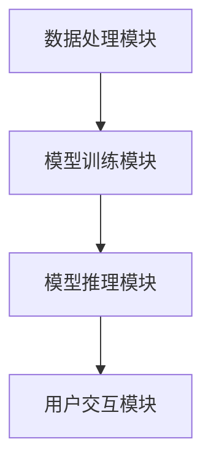

                 

### AIGC在未来工作场景中的角色

关键词：AIGC、未来工作场景、AI、自动内容生成、交互式AI、办公自动化、客户服务、创意设计、开发实战、挑战与展望

摘要：本文旨在探讨AIGC（AI Generated Content）在未来工作场景中的角色与影响。随着人工智能技术的不断进步，AIGC已经成为一项重要的技术趋势。它不仅能够自动化生成各种类型的内容，还能够实现与用户的交互，从而提升工作效率、优化用户体验。本文将从AIGC的定义、技术基础、核心概念与架构、算法原理、实际应用、开发实战以及面临的挑战和未来展望等方面进行详细分析，以期帮助读者全面了解AIGC在未来的工作场景中可能扮演的角色。

## 第1章: AIGC概述

### 1.1 AIGC的定义与特点

AIGC，全称AI Generated Content，即人工智能生成内容。它是指利用人工智能技术，特别是生成模型（如生成对抗网络GAN、变分自编码器VAE等）来生成文字、图像、音频等多种类型的内容。AIGC具有以下几个主要特点：

1. **自动生成**：AIGC能够自动生成大量内容，无需人工干预，从而大幅提高生产效率。
2. **多样性**：AIGC可以生成丰富多样、风格各异的内容，满足不同用户的需求。
3. **个性化和定制化**：AIGC可以根据用户的需求和偏好，生成个性化、定制化的内容。
4. **高质量**：通过大规模数据训练，AIGC生成的内容质量较高，能够满足专业级的要求。

### 1.2 AIGC的技术基础

AIGC的技术基础主要包括以下三个方面：

#### 自然语言处理（NLP）

自然语言处理是AIGC的核心技术之一，它涉及到文本的生成、理解、翻译等任务。NLP技术主要包括词向量、文本生成模型（如GPT）、机器翻译模型（如Transformer）等。

#### 生成对抗网络（GAN）

生成对抗网络是AIGC的核心算法之一，它通过生成器和判别器的对抗训练，实现高质量图像、文本等内容的生成。GAN主要包括生成器（Generator）、判别器（Discriminator）和损失函数（Loss Function）等组成部分。

#### 强化学习（RL）

强化学习是AIGC的一种重要技术，它通过学习如何在环境中做出最优决策，从而实现智能体的自主学习和优化。强化学习在虚拟导购、自动化新闻生成等领域具有广泛应用。

### 1.3 AIGC的发展历程与现状

#### 发展历程

AIGC的发展历程可以追溯到20世纪80年代，随着计算机技术和人工智能技术的不断进步，AIGC技术逐渐成熟并得到广泛应用。

#### 研究热点

当前，AIGC的研究热点主要集中在以下几个方面：

1. **大规模预训练模型**：如GPT、BERT等，这些模型通过在海量数据上进行预训练，能够生成高质量、多样化、个性化的内容。
2. **多模态生成**：如何将文字、图像、音频等多种类型的内容进行有效融合，生成更具表现力的内容。
3. **交互式生成**：如何实现AIGC与用户的交互，提升用户体验。

#### 应用现状

AIGC已经在多个领域得到广泛应用，如：

1. **办公自动化**：自动化文档处理、智能助手等。
2. **客户服务**：智能客服系统、虚拟导购等。
3. **创意设计**：自动化图像生成、音乐与文本创作等。

## 第2章: AIGC的核心概念与架构

### 2.1 AIGC的核心概念

AIGC的核心概念主要包括：

#### 自动内容生成（ACG）

自动内容生成是指利用AIGC技术自动生成文字、图像、音频等多种类型的内容。它能够大幅提高内容生成效率，满足多样化的需求。

#### 交互式AI

交互式AI是指AIGC与用户的交互能力，通过自然语言处理等技术，实现与用户的对话、问答等互动，提升用户体验。

#### 大规模数据训练

大规模数据训练是指利用海量数据对AIGC模型进行训练，以提高其生成质量和多样性。数据质量直接影响AIGC的效果。

### 2.2 AIGC的架构设计

AIGC的架构设计主要包括以下几个模块：

#### 数据处理模块

数据处理模块主要负责数据收集、预处理和存储。它需要保证数据的准确性和多样性，以满足AIGC的需求。

#### 模型训练模块

模型训练模块负责对AIGC模型进行训练，包括生成器、判别器等。训练过程通常涉及大规模数据、优化算法和超参数调整。

#### 模型推理模块

模型推理模块负责将训练好的AIGC模型应用到实际场景中，生成用户所需的内容。它通常涉及快速的模型推理和优化。

#### 用户交互模块

用户交互模块负责处理用户输入，实现AIGC与用户的交互。它通常涉及自然语言处理、对话系统等技术。

### 2.3 AIGC的Mermaid流程图



## 第3章: AIGC算法原理详解

### 3.1 生成对抗网络（GAN）

#### GAN的基本原理

生成对抗网络（GAN）是一种由生成器和判别器组成的对抗性模型。生成器（Generator）负责生成虚假数据，判别器（Discriminator）负责区分真实数据和虚假数据。通过生成器和判别器的对抗训练，生成器不断优化，生成越来越逼真的数据。

#### GAN的架构

GAN的架构主要包括：

1. **生成器（Generator）**：输入随机噪声，生成虚假数据。
2. **判别器（Discriminator）**：输入真实数据和虚假数据，输出概率，判断数据是真实还是虚假。
3. **损失函数**：通常使用二元交叉熵损失函数。

#### GAN的训练过程

GAN的训练过程主要包括以下几个步骤：

1. **初始化生成器和判别器**：随机初始化生成器和判别器。
2. **生成器训练**：生成器生成虚假数据，判别器更新模型参数。
3. **判别器训练**：判别器更新模型参数，使其能够更准确地判断真实数据和虚假数据。
4. **重复迭代**：不断重复以上步骤，直到生成器生成的高质量虚假数据接近真实数据。

### 3.2 自注意力机制（Self-Attention）

#### 自注意力机制的基本原理

自注意力机制是一种用于处理序列数据的注意力机制。它通过计算序列中每个元素与其他元素的相关性，为每个元素分配不同的权重，从而实现序列的建模。

#### 自注意力机制在NLP中的应用

自注意力机制在NLP中广泛应用于文本生成、机器翻译、情感分析等任务。例如，在文本生成任务中，自注意力机制可以帮助模型更好地理解文本的上下文信息。

#### 自注意力机制的扩展

自注意力机制有多种扩展形式，如多头自注意力（Multi-Head Self-Attention）和变换自注意力（Transformers）。这些扩展形式在处理复杂序列数据时具有更高的效果。

### 3.3 强化学习（RL）

#### 强化学习的基本原理

强化学习是一种通过试错和反馈机制来学习最优策略的机器学习方法。它主要包括四个组成部分：环境（Environment）、代理（Agent）、状态（State）和动作（Action）。

#### Q-learning算法

Q-learning是一种基于值函数的强化学习算法。它通过学习状态-动作值函数，找到最优动作序列。Q-learning算法的基本原理是更新Q值，即状态-动作值函数，使其更加接近真实值。

#### Policy-based算法

Policy-based算法是一种基于策略的强化学习算法。它直接学习最优策略，而不是值函数。Policy-based算法主要包括REINFORCE算法和PPO算法等。

## 第4章: AIGC在未来的工作场景中的应用

### 4.1 AIGC在办公自动化中的应用

#### 自动化文档处理

AIGC能够自动生成各种类型的文档，如报告、合同、邮件等。通过自然语言处理和生成对抗网络等技术，AIGC可以理解用户的需求，生成高质量、个性化的文档。

#### 智能助手与虚拟员工

智能助手和虚拟员工是AIGC在办公自动化中的典型应用。它们能够理解用户的指令，自动完成各种任务，如日程管理、文件共享、问题解答等，从而提高工作效率。

### 4.2 AIGC在客户服务中的应用

#### 智能客服系统

智能客服系统是AIGC在客户服务中的重要应用。通过自然语言处理和生成对抗网络等技术，智能客服系统能够理解用户的问题，生成合适的回答，提供高质量的客户服务。

#### 虚拟导购

虚拟导购是AIGC在电商和零售领域的重要应用。通过自然语言处理和图像生成技术，虚拟导购可以为用户提供个性化的购物建议，提升用户的购物体验。

### 4.3 AIGC在创意设计中的应用

#### 自动化图像生成

自动化图像生成是AIGC在创意设计中的重要应用。通过生成对抗网络等技术，自动化图像生成可以生成高质量、多样化的图像，满足设计师的需求。

#### 音乐与文本创作

音乐与文本创作是AIGC在艺术创作中的重要应用。通过生成对抗网络和强化学习等技术，AIGC可以生成音乐和文本，为艺术家提供灵感。

## 第5章: AIGC开发实战

### 5.1 AIGC开发环境搭建

#### 计算机硬件配置

为了满足AIGC的开发需求，计算机硬件配置需要较高。通常需要配备高性能的CPU、GPU和内存等硬件设备。

#### 软件环境配置

AIGC的开发需要配置相应的软件环境，包括Python、TensorFlow、PyTorch等。此外，还需要安装必要的库和工具，如NumPy、Pandas、Matplotlib等。

### 5.2 AIGC项目实战

#### 自动化新闻生成

自动化新闻生成是一个典型的AIGC项目。该项目利用自然语言处理和生成对抗网络等技术，自动生成新闻文章。

```python
import tensorflow as tf
from tensorflow.keras.preprocessing.text import Tokenizer
from tensorflow.keras.preprocessing.sequence import pad_sequences

# 加载预训练模型
model = tf.keras.models.load_model('pretrained_model.h5')

# 准备数据
texts = ['This is an example of a news article.', 'Another example of a news article.']
sequences = tokenizer.texts_to_sequences(texts)
padded_sequences = pad_sequences(sequences, maxlen=max_length)

# 生成新闻文章
predictions = model.predict(padded_sequences)
decoded_predictions = tokenizer.sequences_to_texts(predictions)

# 输出生成的新闻文章
for prediction in decoded_predictions:
    print(prediction)
```

#### 虚拟员工对话系统

虚拟员工对话系统是一个交互式AIGC项目。该项目利用自然语言处理和生成对抗网络等技术，实现虚拟员工与用户的对话。

```python
import tensorflow as tf
from tensorflow.keras.preprocessing.sequence import pad_sequences
from tensorflow.keras.preprocessing.text import Tokenizer

# 加载预训练模型
model = tf.keras.models.load_model('pretrained_model.h5')

# 准备数据
texts = ['What is your name?', 'Can you help me with this task?']
sequences = tokenizer.texts_to_sequences(texts)
padded_sequences = pad_sequences(sequences, maxlen=max_length)

# 生成对话
predictions = model.predict(padded_sequences)
decoded_predictions = tokenizer.sequences_to_texts(predictions)

# 输出生成的对话
for prediction in decoded_predictions:
    print(prediction)
```

## 第6章: AIGC面临的挑战与未来展望

### 6.1 AIGC的技术挑战

#### 数据隐私保护

AIGC在生成内容时需要大量数据，如何保护用户的隐私和数据安全是一个重要的技术挑战。

#### 道德与伦理问题

AIGC生成的内容可能会涉及道德和伦理问题，如虚假信息传播、侵犯知识产权等，如何解决这些问题也是一个重要挑战。

### 6.2 AIGC的未来发展趋势

#### AIGC与区块链技术的结合

AIGC与区块链技术的结合可以实现去中心化的内容生成和分发，提高内容的安全性和可信度。

#### AIGC在智能城市中的应用

AIGC在智能城市中的应用，如智慧交通、智慧医疗、智慧教育等，将为城市管理和居民生活带来更多便利。

## 第7章: 案例分析

### 7.1 AIGC在电商领域的应用案例

#### 自动化商品推荐系统

自动化商品推荐系统利用AIGC技术，根据用户的兴趣和行为，自动生成个性化的商品推荐列表。

#### 智能客服系统

智能客服系统利用AIGC技术，自动生成回答用户问题的文本，提供高效、智能的客户服务。

### 7.2 AIGC在医疗健康领域的应用案例

#### 自动化病历生成

自动化病历生成系统利用AIGC技术，根据医生的诊断和病历记录，自动生成病历文档。

#### 虚拟医生助手

虚拟医生助手利用AIGC技术，与用户进行对话，提供医学咨询和健康管理服务。

## 附录

### 附录 A: AIGC开发资源

#### 开源框架与库

- TensorFlow
- PyTorch
- Keras

#### AIGC研究论文与报告

- "Generative Adversarial Nets"
- "Seq2Seq Learning Models for Language Generation"
- "Pre-Trained Language Models for Language Understanding and Generation"

#### 相关网站与论坛

- arXiv
- GitHub
- AI Generated Content Conference

作者：AI天才研究院/AI Genius Institute & 禅与计算机程序设计艺术 /Zen And The Art of Computer Programming

以上是《AIGC在未来工作场景中的角色》的主要内容，通过对AIGC的定义、技术基础、核心概念与架构、算法原理、实际应用、开发实战以及面临的挑战和未来展望等方面的详细分析，本文旨在帮助读者全面了解AIGC在未来工作场景中的角色和影响。随着人工智能技术的不断进步，AIGC将在各个领域发挥越来越重要的作用，为人类创造更多价值。未来，我们需要关注AIGC在隐私保护、道德与伦理等方面的挑战，以及如何实现AIGC与区块链、智能城市等技术的结合，为构建更美好的世界贡献力量。

