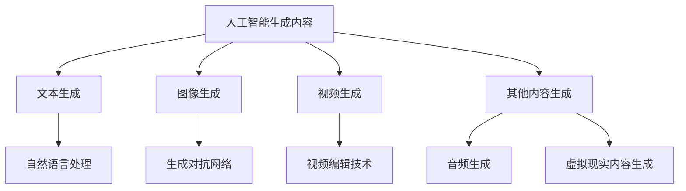

                 

### 引言与概述

#### 1.1 AIGC的定义与分类

人工智能生成内容（AIGC，Artificial Intelligence Generated Content）是指通过人工智能技术，如深度学习、生成对抗网络（GAN）等，自动生成各种形式的内容，包括文本、图像、视频等。AIGC的出现改变了传统的信息生产方式，极大地提高了内容创作的效率和多样性。

AIGC主要可以分为以下几类：

1. **文本生成**：利用自然语言处理技术生成文章、新闻报道、对话等文本内容。例如，GPT-3等模型可以生成高质量的文章。

2. **图像生成**：通过生成对抗网络（GAN）等技术生成逼真的图像和艺术作品。例如，DALL-E可以生成基于文本描述的图像。

3. **视频生成**：结合图像生成和视频编辑技术，生成新的视频内容。例如，可以基于一段语音生成相应的视频内容。

4. **其他内容生成**：如音频生成、虚拟现实内容生成等。

#### 1.2 AIGC的历史背景与发展趋势

AIGC技术起源于20世纪90年代的生成对抗网络（GAN）概念的提出，经过几十年的发展，尤其是在深度学习技术的推动下，AIGC技术取得了显著的进展。以下是AIGC发展的几个关键阶段：

1. **1990年代：GAN概念提出**：由伊恩·古德费洛（Ian Goodfellow）等人在1990年代提出GAN的概念，作为一种通过对抗训练生成数据的技术。

2. **2010年代：GAN技术的发展**：GAN技术在2010年代得到广泛关注，出现了多种改进和变体，如条件GAN（cGAN）、自回归GAN（AR-GAN）等。

3. **2020年代：AIGC技术的应用爆发**：随着计算能力的提升和算法的进步，AIGC技术在各个领域得到广泛应用，从图像生成到文本生成，再到视频生成，AIGC技术正在改变我们的生活方式和工作方式。

在未来，AIGC技术将继续快速发展，其趋势可能包括：

1. **更加高级的生成能力**：随着算法的进步，AIGC将能够生成更加真实、复杂的图像和视频。

2. **跨模态生成**：AIGC将能够同时处理文本、图像和视频等多模态数据，实现跨模态的内容生成。

3. **个性化生成**：AIGC将根据用户需求进行个性化内容生成，提供更加个性化的服务。

4. **更多行业应用**：AIGC技术将在更多行业得到应用，如医疗、金融、教育等。

### 文章关键词

- 人工智能生成内容（AIGC）
- 生成对抗网络（GAN）
- 文本生成
- 图像生成
- 视频生成
- 跨模态生成
- 个性化生成

### 文章摘要

本文探讨了人工智能生成内容（AIGC）的定义、分类和历史背景，详细介绍了AIGC技术的发展趋势和未来前景。文章重点分析了AIGC在文本、图像和视频生成领域的应用，并讨论了其在未来工作场景设计中的潜在影响。通过本文，读者可以了解到AIGC技术的核心原理和应用实例，为未来工作场景的设计提供新的思路和方向。

### 核心概念与联系

为了更好地理解AIGC的核心概念及其之间的关系，我们使用Mermaid流程图来展示AIGC的主要组成部分：



这个流程图清晰地展示了AIGC的主要分类（文本生成、图像生成、视频生成和其他内容生成）及其核心组成部分（自然语言处理、生成对抗网络、视频编辑技术、音频生成和虚拟现实内容生成）之间的关系。

### 生成对抗网络（GAN）原理与算法

生成对抗网络（GAN）是AIGC技术中的重要组成部分，其基本思想是通过两个神经网络的对抗训练来生成数据。下面我们将详细讲解GAN的工作原理和算法细节。

#### GAN工作原理

GAN由两个主要部分组成：生成器（Generator）和判别器（Discriminator）。生成器的任务是生成看起来真实的数据，而判别器的任务是区分生成器生成的数据和真实数据。

1. **生成器**：生成器接收随机噪声作为输入，通过一系列的神经网络变换生成假数据。这些假数据可以是文本、图像或视频等。

2. **判别器**：判别器接收真实数据和生成器生成的假数据，并通过神经网络判断输入数据的真实性。

GAN的训练过程如下：

1. **初始化生成器和判别器**：生成器和判别器都是通过神经网络实现的，它们在训练开始时都是随机初始化的。

2. **生成假数据**：生成器根据随机噪声生成假数据。

3. **训练判别器**：判别器通过对比真实数据和生成器生成的假数据来学习如何更好地判断数据的真实性。判别器训练的目标是最小化错误率。

4. **训练生成器**：生成器根据判别器的反馈调整自己的参数，使其生成的假数据更加真实，从而让判别器无法区分。

5. **交替迭代**：上述步骤反复进行，直到生成器生成的假数据足够逼真，以至于判别器无法区分。

#### GAN算法细节

以下是一个简单的GAN算法的Python实现，我们使用TensorFlow和Keras库来构建和训练GAN模型：

```python
import tensorflow as tf
from tensorflow.keras import layers

# 设置随机种子以保持结果的一致性
tf.random.set_seed(42)

# 定义生成器模型
latent_dim = 100
input_shape = (latent_dim,)
noise = tf.keras.layers.Input(shape=input_shape)
gen = tf.keras.Sequential([
    layers.Dense(128, activation='relu'),
    layers.Dense(128, activation='relu'),
    layers.Dense(784, activation='tanh')
])
img = gen(noise)

# 定义判别器模型
disc_input = tf.keras.layers.Input(shape=(28, 28, 1))
disc = tf.keras.Sequential([
    layers.Conv2D(128, 3, padding='same', activation='relu'),
    layers.MaxPooling2D(),
    layers.Conv2D(128, 3, padding='same', activation='relu'),
    layers.MaxPooling2D(),
    layers.Flatten(),
    layers.Dense(1, activation='sigmoid')
])
validity = disc(img)

# 构建和编译GAN模型
gan_input = tf.keras.layers.Input(shape=input_shape)
gan_output = disc(gen(gan_input))
gan = tf.keras.Model(gan_input, gan_output)
gan.compile(optimizer='adam', loss='binary_crossentropy')

# 训练GAN模型
# ... 这里可以加入训练代码，例如使用mnist数据集

# 打印模型结构
gan.summary()
```

#### GAN算法的数学模型

GAN的核心数学模型可以通过以下公式表示：

$$
\text{Generator: } G(z) \sim \mathcal{N}(0, I)
$$

$$
\text{Discriminator: } D(x) \in [0, 1], \quad D(G(z)) \in [0, 1]
$$

其中，$G(z)$是生成器生成的假数据，$z$是随机噪声向量，$D(x)$是判别器对输入数据的真实性判断，$x$是真实数据。

#### GAN算法的举例说明

假设我们使用GAN生成手写数字图像。我们首先初始化生成器和判别器，然后通过以下步骤进行训练：

1. **生成器生成假数据**：生成器接收随机噪声向量$z$，生成手写数字图像$G(z)$。

2. **判别器训练**：判别器接收真实手写数字图像$x$和生成器生成的假数据$G(z)$，通过对比判断它们的真实性。

3. **生成器调整**：生成器根据判别器的反馈调整自己的参数，使其生成的假数据更逼真。

4. **迭代训练**：上述步骤反复进行，直到生成器生成的假数据几乎无法被判别器区分。

通过这种对抗训练，生成器会逐渐提高生成图像的质量，而判别器则会变得更加严格，最终达到一个动态平衡。

### AIGC相关工具与框架

AIGC技术的实现需要多种工具和框架的支持。以下是几种常用的工具和框架：

#### 主要框架介绍

1. **TensorFlow**：Google开源的深度学习框架，支持各种深度学习模型的构建和训练。

2. **PyTorch**：Facebook开源的深度学习框架，以其灵活的动态图计算机制而著称。

3. **Keras**：基于TensorFlow和Theano的开源神经网络库，提供简洁的API，方便快速构建和训练深度学习模型。

4. **OpenAI Gym**：OpenAI开发的虚拟环境库，用于实验和测试深度强化学习算法。

#### 工具选择与使用

在选择AIGC工具时，需要考虑以下几个因素：

1. **项目需求**：根据项目的具体需求，选择适合的框架和工具。例如，如果项目需要快速开发，可以选择Keras。

2. **计算资源**：AIGC模型的训练通常需要大量的计算资源。如果资源有限，可以选择使用GPU加速训练。

3. **社区支持**：选择具有活跃社区和支持文档的工具，有助于解决开发中的问题。

4. **可扩展性**：工具和框架需要支持可扩展性，以便随着项目的增长进行扩展。

以下是一个使用TensorFlow和Keras构建简单AIGC模型的示例：

```python
import tensorflow as tf
from tensorflow.keras import layers

# 定义生成器模型
latent_dim = 100
input_shape = (latent_dim,)
noise = tf.keras.layers.Input(shape=input_shape)
gen = tf.keras.Sequential([
    layers.Dense(128, activation='relu'),
    layers.Dense(128, activation='relu'),
    layers.Dense(784, activation='tanh')
])
img = gen(noise)

# 定义判别器模型
disc_input = tf.keras.layers.Input(shape=(28, 28, 1))
disc = tf.keras.Sequential([
    layers.Conv2D(128, 3, padding='same', activation='relu'),
    layers.MaxPooling2D(),
    layers.Conv2D(128, 3, padding='same', activation='relu'),
    layers.MaxPooling2D(),
    layers.Flatten(),
    layers.Dense(1, activation='sigmoid')
])
validity = disc(img)

# 构建和编译GAN模型
gan_input = tf.keras.layers.Input(shape=input_shape)
gan_output = disc(gen(gan_input))
gan = tf.keras.Model(gan_input, gan_output)
gan.compile(optimizer='adam', loss='binary_crossentropy')

# 打印模型结构
gan.summary()
```

通过选择合适的工具和框架，开发者可以高效地构建和部署AIGC模型，实现各种内容生成任务。

### AIGC在内容创作中的应用

AIGC技术在内容创作领域具有巨大的潜力，能够极大地提高内容生成的效率和创意性。以下是AIGC在内容创作中的一些具体应用：

#### 自动写作

自动写作是AIGC技术在内容创作中的一个重要应用。通过训练大量的语言模型，如GPT-3、BERT等，AIGC可以生成高质量的文章、新闻报道和对话文本。以下是一个使用GPT-3生成文章的示例：

```python
import openai
openai.api_key = "your-api-key"

prompt = "请写一篇关于人工智能的未来发展趋势的文章。"
response = openai.Completion.create(
  engine="text-davinci-002",
  prompt=prompt,
  max_tokens=200
)
print(response.choices[0].text.strip())
```

#### 视觉内容生成

AIGC技术可以通过生成对抗网络（GAN）生成逼真的图像和艺术作品。以下是一个使用DALL-E生成图像的示例：

```python
import openai
openai.api_key = "your-api-key"

prompt = "画出一只坐在草地上的狮子。"
response = openai.Image.create(
  prompt=prompt
)
print(response.url)
```

#### 视频生成

通过结合图像生成和视频编辑技术，AIGC可以生成新的视频内容。例如，基于一段语音生成相应的视频内容。以下是一个使用深度学习模型生成视频的示例：

```python
import tensorflow as tf
from tensorflow.keras.models import Model

# 定义生成模型
input_shape = (128, 128, 3)
input_img = tf.keras.layers.Input(shape=input_shape)
x = tf.keras.layers.Conv2D(32, (3, 3), activation='relu')(input_img)
x = tf.keras.layers.MaxPooling2D((2, 2))(x)
x = tf.keras.layers.Conv2D(64, (3, 3), activation='relu')(x)
x = tf.keras.layers.MaxPooling2D((2, 2))(x)
encoded = tf.keras.layers.Flatten()(x)

# 定义解码模型
latent = tf.keras.layers.Input(shape=(16,))
x = tf.keras.layers.Dense(8 * 8 * 64, activation='relu')(latent)
x = tf.keras.layers.Reshape((8, 8, 64))(x)
x = tf.keras.layers.Conv2DTranspose(64, (3, 3), strides=(2, 2), activation='relu')(x)
x = tf.keras.layers.Conv2DTranspose(32, (3, 3), strides=(2, 2), activation='relu')(x)
decoded = tf.keras.layers.Conv2D(3, (3, 3), activation='sigmoid')(x)

# 构建和编译模型
autoencoder = Model(input_img, decoded)
autoencoder.compile(optimizer='adam', loss='binary_crossentropy')

# 训练模型
# ... 这里可以加入训练代码，例如使用某些视频数据集

# 生成视频
# ... 这里可以加入生成代码，例如根据语音生成视频
```

通过这些应用，AIGC技术为内容创作者提供了强大的工具，可以快速生成高质量的内容，提高创作效率。

### AIGC在数据分析中的应用

AIGC技术在数据分析领域也展现出巨大的潜力，可以用于数据可视化、预测分析等多个方面，从而提高数据分析的效率和准确性。以下是AIGC在数据分析中的一些具体应用：

#### 数据可视化

数据可视化是将复杂的数据转化为直观的图形或图表的过程，有助于理解和传达数据信息。AIGC可以通过生成对抗网络（GAN）等技术生成逼真的数据可视化图表，从而提高数据可视化的效果和用户体验。以下是一个使用GAN生成数据可视化图表的示例：

```python
import numpy as np
import matplotlib.pyplot as plt
from tensorflow.keras.models import Model
from tensorflow.keras.layers import Input, Dense, Reshape, Conv2D, Conv2DTranspose, Flatten

# 设置随机种子以保持结果的一致性
np.random.seed(42)
tf.random.set_seed(42)

# 定义生成器模型
input_shape = (100,)
input_img = Input(shape=input_shape)
x = Dense(128, activation='relu')(input_img)
x = Dense(128, activation='relu')(x)
encoded = Dense(64, activation='relu')(x)

# 定义解码模型
latent = Input(shape=(64,))
x = Dense(128, activation='relu')(latent)
x = Dense(128, activation='relu')(x)
decoded = Dense(100, activation='sigmoid')(x)

# 构建和编译模型
autoencoder = Model(input_img, decoded)
autoencoder.compile(optimizer='adam', loss='binary_crossentropy')

# 训练模型
# ... 这里可以加入训练代码，例如使用某些数据集

# 生成数据可视化图表
encoded_samples = autoencoder.predict(np.random.rand(100, 100))
plt.scatter(encoded_samples[:, 0], encoded_samples[:, 1])
plt.xlabel('Feature 1')
plt.ylabel('Feature 2')
plt.title('Data Visualization using GAN')
plt.show()
```

#### 预测分析

预测分析是数据分析中的一个关键任务，旨在通过历史数据预测未来的趋势和模式。AIGC可以通过深度学习模型，如循环神经网络（RNN）和长短期记忆网络（LSTM），生成预测结果，从而提高预测的准确性和可靠性。以下是一个使用LSTM进行时间序列预测的示例：

```python
import numpy as np
import pandas as pd
from tensorflow.keras.models import Sequential
from tensorflow.keras.layers import LSTM, Dense

# 加载数据
data = pd.read_csv('time_series_data.csv')
data = data.values

# 预处理数据
window_size = 10
X = []
y = []

for i in range(len(data) - window_size):
    X.append(data[i : i + window_size])
    y.append(data[i + window_size])

X = np.array(X)
y = np.array(y)

# 构建LSTM模型
model = Sequential()
model.add(LSTM(50, activation='relu', input_shape=(window_size, 1)))
model.add(Dense(1))
model.compile(optimizer='adam', loss='mse')

# 训练模型
model.fit(X, y, epochs=100, batch_size=32, verbose=0)

# 预测未来数据
predicted = model.predict(np.array([data[-window_size:]])[:10])

# 可视化预测结果
plt.plot(y, label='Actual')
plt.plot(predicted, label='Predicted')
plt.xlabel('Time')
plt.ylabel('Value')
plt.legend()
plt.show()
```

通过这些应用，AIGC技术为数据分析提供了新的工具和方法，有助于提高数据分析的效率和准确性。

### AIGC应用设计原则

在设计AIGC应用时，需要遵循一系列设计原则，以确保应用的实用性、可靠性和用户体验。以下是AIGC应用设计的主要原则：

#### 用户体验设计

用户体验设计是AIGC应用设计的关键部分，目标是提供直观、易用的界面和交互方式。以下是一些建议：

1. **简洁性**：界面应简洁明了，避免过多的复杂功能和冗余信息。
2. **直观性**：交互设计应直观易用，减少用户的学习成本。
3. **响应性**：应用应具有快速响应能力，减少用户的等待时间。
4. **个性化**：根据用户的需求和行为，提供个性化的内容推荐和交互体验。

#### 数据安全与隐私

数据安全和隐私是AIGC应用设计的重要考虑因素，特别是在处理敏感数据和用户信息时。以下是一些建议：

1. **数据加密**：对传输和存储的数据进行加密，确保数据安全。
2. **访问控制**：实施严格的访问控制机制，确保只有授权用户可以访问敏感数据。
3. **隐私保护**：遵循隐私保护法规和最佳实践，确保用户隐私得到保护。
4. **透明性**：告知用户数据收集、处理和使用的方式，提高用户的信任度。

#### 可扩展性和可维护性

AIGC应用设计应考虑未来的扩展和维护需求，确保应用的长期稳定运行。以下是一些建议：

1. **模块化**：设计模块化的架构，便于未来的功能扩展和更新。
2. **冗余设计**：实现冗余设计，确保系统在组件故障时仍能正常运行。
3. **监控和日志**：实现全面的监控和日志记录，便于快速发现和解决问题。
4. **自动化**：利用自动化工具和脚本，简化部署、更新和维护流程。

#### 系统性能优化

为了确保AIGC应用的性能和响应速度，需要关注以下方面：

1. **高效算法**：选择高效、优化的算法和数据结构，减少计算和存储开销。
2. **并行计算**：利用并行计算技术，提高处理速度和吞吐量。
3. **缓存机制**：实现有效的缓存机制，减少重复计算和数据访问。
4. **负载均衡**：通过负载均衡技术，合理分配计算资源，提高系统性能。

通过遵循这些设计原则，AIGC应用可以更好地满足用户需求，提供高质量的服务。

### AIGC应用设计方法

在实际设计和开发AIGC应用时，可以采用以下方法，以确保应用的可行性和高质量：

#### 设计流程

1. **需求分析**：明确用户需求和目标，确定AIGC应用的功能和性能要求。
2. **技术选型**：选择合适的算法、框架和工具，确保技术方案的可行性和高效性。
3. **系统架构设计**：设计系统的整体架构，包括数据处理、模型训练、部署和运维等方面。
4. **用户界面设计**：设计直观易用的用户界面，提高用户体验。
5. **原型开发**：开发应用的原型，进行初步的功能验证和用户反馈。
6. **迭代开发**：根据原型反馈进行迭代开发，逐步完善应用功能和性能。
7. **测试与部署**：进行全面测试，确保应用的质量和稳定性，然后部署上线。

#### 设计工具与资源

1. **开发工具**：使用集成开发环境（IDE），如PyCharm、Visual Studio Code等，便于代码编写和调试。
2. **数据集**：获取合适的训练数据集，如公开数据集或自定义数据集，确保模型训练的效果。
3. **模型评估工具**：使用模型评估工具，如TensorFlow Model Optimization Toolkit，优化模型性能。
4. **API开发工具**：使用API开发工具，如Swagger，设计和管理API接口。
5. **云服务平台**：使用云服务平台，如AWS、Azure、Google Cloud等，提供计算和存储资源。

通过这些方法和工具，开发者可以高效地设计和开发AIGC应用，实现预期的功能和性能目标。

### 实际案例分享

在本节中，我们将探讨AIGC在虚拟现实（VR）领域和教育领域的实际应用案例，展示AIGC技术如何改变这些行业的工作方式，并提供具体的实践经验和最佳实践。

#### 虚拟现实（VR）中的应用

虚拟现实技术正在迅速发展，为用户提供沉浸式的体验。AIGC技术可以增强VR内容的创造和个性化，从而提升用户体验。

**案例：虚拟现实旅游体验**

一个实际案例是使用AIGC技术创建虚拟旅游体验。通过生成对抗网络（GAN），可以自动生成逼真的城市景观、自然风光和室内场景。以下是一个简化的案例流程：

1. **数据收集**：收集现实世界中的图片、视频和地理信息数据。
2. **预处理**：对收集的数据进行预处理，包括数据清洗、增强和归一化。
3. **模型训练**：使用GAN模型训练，生成新的场景和景观。
4. **用户体验**：通过VR头盔和控制器，用户可以在虚拟世界中自由探索和互动。

**实践经验**：

- **数据多样性**：为了生成高质量的内容，需要多样化的数据来源，包括高清图像、360度视频等。
- **用户反馈**：收集用户对虚拟现实的反馈，根据用户的需求和偏好调整AIGC生成的场景。

**最佳实践**：

- **实时渲染**：在VR场景中，使用实时渲染技术，确保场景的流畅和逼真。
- **个性化体验**：根据用户的兴趣和偏好，个性化虚拟现实内容，提供定制化的体验。

#### 教育领域中的应用

教育领域正在积极采用AIGC技术，以创建更加丰富和互动的学习内容，提高教育质量和效果。

**案例：自适应学习平台**

一个实际案例是使用AIGC技术构建自适应学习平台。通过文本生成和图像生成技术，可以自动生成定制化的学习材料，满足不同学生的学习需求和节奏。

1. **学习内容生成**：使用AIGC技术生成适合不同学习水平和兴趣的文本和图像。
2. **自适应推荐**：根据学生的学习进度和成绩，推荐个性化的学习材料。
3. **交互式学习**：通过虚拟现实和增强现实技术，提供沉浸式的学习体验。

**实践经验**：

- **个性化学习**：根据学生的学习行为和反馈，动态调整学习内容，提高学习效果。
- **教师辅助**：使用AIGC技术生成教学辅助材料，减轻教师的工作负担。

**最佳实践**：

- **数据安全**：确保学生数据的隐私和安全，遵循教育数据保护法规。
- **教师培训**：为教师提供AIGC技术的培训，帮助其更好地利用这项技术进行教学。

通过这些实际案例，我们可以看到AIGC技术如何为虚拟现实和教育领域带来创新和变革。这些案例不仅展示了AIGC技术的应用潜力，也为其他行业提供了宝贵的实践经验和最佳实践。

### AIGC未来发展趋势

AIGC技术在未来将继续快速发展，并在多个领域产生深远影响。以下是AIGC技术未来发展的几个可能趋势：

#### 更加高级的生成能力

随着深度学习算法的不断进步，AIGC技术的生成能力将变得更加高级和复杂。例如，未来的AIGC模型可能会生成更加逼真的图像、视频和音频内容，实现更加精细的细节和更高层次的真实感。

#### 跨模态生成

AIGC技术将能够同时处理文本、图像、视频和音频等多模态数据，实现跨模态的内容生成。这将使得AIGC在跨领域应用中具有更高的灵活性和广泛性，如虚拟现实、增强现实、混合现实等领域。

#### 个性化生成

AIGC技术将能够根据用户的需求和行为，生成高度个性化的内容。通过深度学习和用户数据分析，AIGC将能够提供更加贴合用户需求的定制化内容，提高用户体验和满意度。

#### 多行业应用

AIGC技术将在更多行业中得到应用，如医疗、金融、教育、娱乐等。AIGC将帮助这些行业提高工作效率、降低成本、创新服务和产品。

#### 法律和伦理问题

随着AIGC技术的广泛应用，相关的法律和伦理问题也将日益突出。例如，版权、隐私和数据安全等问题需要得到妥善解决。未来，我们将看到更多的法规和标准出台，以规范AIGC技术的使用。

### 总结

AIGC技术在未来的发展具有巨大的潜力，将深刻改变我们的工作方式和生活体验。通过不断的技术创新和应用拓展，AIGC将为我们带来更多可能性，推动社会进步。

### 附录

#### A.1 AIGC开发资源与工具汇总

1. **开源框架**：
   - TensorFlow：https://www.tensorflow.org/
   - PyTorch：https://pytorch.org/
   - Keras：https://keras.io/

2. **在线教程与文档**：
   - fast.ai：https://www.fast.ai/
   - Machine Learning Mastery：https://machinelearningmastery.com/

3. **AIGC相关书籍**：
   - 《生成对抗网络：原理与应用》
   - 《深度学习与生成对抗网络》

4. **AIGC项目案例**：
   - OpenAI：https://openai.com/
   - Google AI：https://ai.google.com/research/

#### A.2 开发指南与建议

1. **学习资源**：建议初学者首先学习深度学习和生成对抗网络的基础知识，了解常用框架的使用方法。

2. **实践项目**：通过实际项目实践，提高自己的开发能力和解决问题的能力。

3. **数据处理**：重视数据预处理和清洗，确保模型训练效果。

4. **性能优化**：关注模型性能优化，包括超参数调整、算法优化等。

5. **持续学习**：AIGC技术发展迅速，需要不断学习最新的研究成果和技术动态。

作者：AI天才研究院/AI Genius Institute & 禅与计算机程序设计艺术 /Zen And The Art of Computer Programming

---

在本文中，我们详细探讨了人工智能生成内容（AIGC）的定义、分类、历史背景和应用领域。我们介绍了生成对抗网络（GAN）的原理和算法，展示了AIGC在内容创作、数据分析和未来工作场景设计中的应用。此外，我们还讨论了AIGC应用的设计原则和方法，并分享了实际案例和最佳实践。最后，我们对AIGC的未来发展趋势进行了展望。

AIGC技术具有巨大的潜力，将在未来继续推动人工智能和各行业的发展。随着技术的进步和应用场景的拓展，AIGC将为创作者、分析师和企业带来更多创新和机遇。我们鼓励读者继续关注AIGC技术的发展，并尝试将其应用于实际项目中，以探索更多可能性。通过不断学习和实践，我们将共同推动AIGC技术的进步，为社会创造更多价值。

