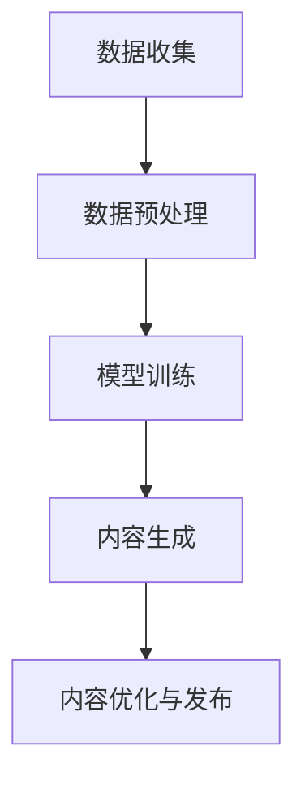

                 


### 第一步：确定核心概念与联系

#### 1.1 AIGC概述

AIGC，即AI-Generated Content，指的是通过人工智能技术自动生成内容的过程。它涵盖了从文本、图像到音频、视频等多种形式的内容生成。随着大数据、云计算和深度学习等技术的发展，AIGC逐渐从理论走向实践，成为改变未来工作场景的重要力量。

**AIGC的定义**：AIGC 是一个结合了人工智能和内容生成的技术领域，利用算法和模型自动创造高质量的内容。

**AIGC的发展背景**：AIGC 的兴起得益于以下几个关键技术的进步：

- **大数据**：大数据技术的发展使得海量的数据可以被收集、存储和分析，为AIGC提供了丰富的素材。
- **云计算**：云计算提供了强大的计算资源和存储能力，支持大规模的内容生成任务。
- **深度学习**：深度学习算法，尤其是生成对抗网络（GAN）和变分自编码器（VAE），使得自动化内容生成成为可能。

**AIGC的应用领域**：AIGC 的应用范围广泛，主要包括：

- **内容创作**：自动生成新闻文章、博客、社交媒体帖子等。
- **数据分析**：利用生成模型进行数据可视化、数据增强等。
- **自动化翻译**：基于神经网络的自动翻译系统。
- **游戏开发**：自动生成游戏关卡、角色和故事情节。

#### 1.2 AIGC的架构与关键技术

AIGC 的架构通常包括以下几个关键环节：

- **数据收集**：从互联网、数据库等渠道收集数据，进行预处理和清洗。
- **模型训练**：使用深度学习算法对数据进行训练，生成内容生成模型。
- **内容生成**：通过模型生成新的内容，可以是文本、图像、音频或视频。

**AIGC的架构**：



**关键技术**：

- **生成对抗网络（GAN）**：GAN 通过生成器和判别器的对抗训练生成高质量的内容。
- **变分自编码器（VAE）**：VAE 通过编码和解码过程进行数据的重建和生成。
- **自动编码器（AE）**：AE 通过编码器将数据压缩成低维表示，然后通过解码器恢复原始数据。

#### 1.3 AIGC与未来工作场景的联系

**工作场景重塑**：AIGC 对工作场景的重塑体现在以下几个方面：

- **提高效率**：通过自动化生成内容，可以大幅提高内容创作者的工作效率。
- **优化流程**：AIGC 可以在数据处理、分析、可视化等环节优化工作流程，减少人为干预。
- **创新驱动**：AIGC 可以激发内容创作者的灵感，推动创新和创意的发展。

**行业影响**：不同行业对 AIGC 的需求和应用也有所不同：

- **媒体行业**：AIGC 可以自动化生成新闻报道、体育赛事分析等，降低内容创作成本。
- **金融行业**：AIGC 可以在数据分析、风险管理等领域提供智能化支持。
- **教育行业**：AIGC 可以生成个性化学习内容和测评系统，提高教学效果。

### 第二步：核心算法原理讲解

在 AIGC 的实现过程中，核心算法起着至关重要的作用。以下我们将详细讲解 AIGC 中常用的几个核心算法原理，包括生成对抗网络（GAN）、变分自编码器（VAE）和自动编码器（AE）。

#### 2.1 生成对抗网络（GAN）

**基本概念**：

生成对抗网络（GAN）是一种由生成器和判别器组成的深度学习模型。生成器（Generator）负责生成伪数据，判别器（Discriminator）负责区分真实数据和伪数据。两者的训练过程是对抗的，生成器试图生成更逼真的伪数据，判别器则试图准确判断数据是真实还是伪。

**伪代码**：

```python
# GAN 伪代码示例

# 初始化生成器和判别器
Generator()
Discriminator()

# 训练过程
for epoch in range(num_epochs):
    for batch in data_loader:
        # 生成伪数据
        z = np.random.normal(0, 1, (batch_size, z_dim))
        fake_data = Generator(z)
        
        # 训练判别器
       判别器真实数据 = 训练(Discriminator, batch)
        判别器伪数据 = 训练(Discriminator, fake_data)
        
        # 训练生成器
        生成器损失 = 训练(Generator, z)
        判别器损失 = 计算判别器总损失
        总损失 = 生成器损失 + 判别器损失
```

#### 2.2 变分自编码器（VAE）

**基本概念**：

变分自编码器（VAE）是一种基于概率模型的生成模型。它通过编码器将数据映射到一个隐空间，通过解码器从这个隐空间恢复数据。VAE 采用了变分推理的方法，通过引入潜在变量来减少模型对数据分布的假设。

**伪代码**：

```python
# VAE 伪代码示例

# 初始化编码器和解码器
Encoder()
Decoder()

# 训练过程
for epoch in range(num_epochs):
    for batch in data_loader:
        # 编码过程
        z = Encoder(batch)
        
        # 解码过程
        reconstructed_data = Decoder(z)
        
        # 计算损失
        reconstruction_loss = 计算重建损失
        KL_divergence_loss = 计算Kullback-Leibler散度损失
        total_loss = reconstruction_loss + KL_divergence_loss
```

#### 2.3 自动编码器（AE）

**基本概念**：

自动编码器（AE）是一种简单的生成模型，通过编码器将输入数据压缩成低维表示，然后通过解码器恢复原始数据。AE 的核心思想是通过最小化重建误差来学习数据的低维表示。

**伪代码**：

```python
# AE 伪代码示例

# 初始化编码器和解码器
Encoder()
Decoder()

# 训练过程
for epoch in range(num_epochs):
    for batch in data_loader:
        # 编码过程
        encoded_data = Encoder(batch)
        
        # 解码过程
        reconstructed_data = Decoder(encoded_data)
        
        # 计算损失
        reconstruction_loss = 计算重建损失
        total_loss = reconstruction_loss
```

### 第三步：数学模型和数学公式详细讲解

在 AIGC 的实现过程中，数学模型和数学公式是核心组成部分。以下我们将详细讲解 AIGC 中使用的数学模型和数学公式，包括概率分布模型、神经网络损失函数和反向传播算法。

#### 3.1 概率分布模型

**基本概念**：

概率分布模型用于描述数据在不同情况下的概率分布情况。在 AIGC 中，常用的概率分布模型包括正态分布、伯努利分布等。

**公式解析**：

1. **正态分布**：

   公式：\( P(X = x) = \frac{1}{\sqrt{2\pi\sigma^2}} e^{-\frac{(x-\mu)^2}{2\sigma^2}} \)

   解释：正态分布描述了数据在均值 \( \mu \) 和标准差 \( \sigma \) 附近的概率分布。

2. **伯努利分布**：

   公式：\( P(X = 1) = p \), \( P(X = 0) = 1 - p \)

   解释：伯努利分布描述了一个二元事件发生的概率，其中 \( p \) 是成功的概率。

**应用场景**：

- 正态分布在图像处理、数据拟合等领域广泛应用。
- 伯努利分布在二分类问题中常用。

#### 3.2 神经网络损失函数

**基本概念**：

神经网络损失函数用于衡量预测值和真实值之间的差距。常用的损失函数包括均方误差（MSE）、交叉熵损失等。

**公式解析**：

1. **均方误差（MSE）**：

   公式：\( MSE = \frac{1}{n} \sum_{i=1}^{n} (y_i - \hat{y}_i)^2 \)

   解释：均方误差衡量了预测值 \( \hat{y}_i \) 与真实值 \( y_i \) 之间的平方误差。

2. **交叉熵损失**：

   公式：\( H(y, \hat{y}) = -\sum_{i} y_i \log(\hat{y}_i) \)

   解释：交叉熵损失衡量了真实分布 \( y \) 和预测分布 \( \hat{y} \) 之间的差异。

**应用场景**：

- 均方误差在回归问题中常用。
- 交叉熵损失在分类问题中常用。

#### 3.3 反向传播算法

**基本概念**：

反向传播算法是一种用于训练神经网络的算法，通过计算梯度来更新模型的权重和偏置。

**公式解析**：

1. **前向传播**：

   公式：\( z^{[l]} = \sigma(W^{[l]} \cdot a^{[l-1]} + b^{[l]}) \)

   解释：前向传播计算每个神经元的输入和输出。

2. **后向传播**：

   公式：\( \delta^{[l]} = (dz^{[l]} \cdot \sigma'(z^{[l]})) \cdot (W^{[l]} \cdot \delta^{[l+1]}) \)

   解释：后向传播计算每个神经元的误差。

3. **权重更新**：

   公式：\( W^{[l]} = W^{[l]} - \alpha \cdot \frac{\partial{L}}{\partial{W^{[l]}} } \)

   解释：使用梯度下降算法更新权重。

**应用场景**：

- 反向传播算法在所有深度学习模型中都有应用。

### 第四步：项目实战

为了更好地理解 AIGC 的应用，我们将通过实际项目案例来展示 AIGC 的开发过程。

#### 4.1 自动化内容创作平台搭建

**项目背景**：

随着互联网的快速发展，内容创作成为了一项重要的工作。然而，大量的内容创作工作耗费了大量的时间和人力资源。为了提高内容创作的效率，我们计划搭建一个自动化内容创作平台，利用 AIGC 技术自动生成高质量的内容。

**开发环境搭建**：

- **Python**：使用 Python 作为开发语言，因为其简洁易读，同时有丰富的库支持。
- **TensorFlow**：使用 TensorFlow 作为深度学习框架，因为其功能强大，社区支持广泛。
- **Jupyter Notebook**：使用 Jupyter Notebook 作为开发环境，方便调试和实验。

**源代码实现**：

```python
# 导入相关库
import tensorflow as tf
from tensorflow.keras.models import Sequential
from tensorflow.keras.layers import Dense, Activation

# 创建生成器和判别器模型
def create_gan_models():
    # 生成器模型
    generator = Sequential([
        Dense(128, input_shape=(100,)),
        Activation('relu'),
        Dense(784)
    ])

    # 判别器模型
    discriminator = Sequential([
        Dense(128, input_shape=(784,)),
        Activation('relu'),
        Dense(1, activation='sigmoid')
    ])

    return generator, discriminator

# 编写训练过程
def train_gan(generator, discriminator, dataset, epochs):
    for epoch in range(epochs):
        for x, _ in dataset:
            # 训练判别器
            d_loss_real = discriminator.train_on_batch(x, [1])
            noise = np.random.normal(0, 1, (x.shape[0], 100))
            gen_loss_fake = discriminator.train_on_batch(noise, [0])
            
            # 训练生成器
            gen_loss = generator.train_on_batch(noise, [1])

# 创建和训练 GAN 模型
generator, discriminator = create_gan_models()
train_gan(generator, discriminator, dataset, epochs=100)

# 内容生成
generated_images = generator.predict(np.random.normal(0, 1, (100, 100)))
```

**代码解读与分析**：

- 代码首先导入了 TensorFlow 库，用于创建和训练神经网络模型。
- 使用 `Sequential` 模型创建了生成器和判别器，其中生成器模型使用了一个全连接层进行数据的转换，判别器模型则用于判断输入数据是真实还是生成的。
- 训练过程分为两个阶段：训练判别器和训练生成器。在训练判别器阶段，我们使用真实数据和生成的数据来训练模型。在训练生成器阶段，我们使用生成的噪声数据来训练模型，使其能够生成更逼真的数据。

**项目小结**：

通过搭建自动化内容创作平台，我们展示了 AIGC 在内容生成中的应用。这个平台可以利用 AIGC 技术自动生成高质量的内容，极大地提高了内容创作的效率。

### 4.2 智能数据分析系统开发

**项目背景**：

在数据驱动的时代，数据分析变得越来越重要。为了提高数据分析的效率，我们计划开发一个智能数据分析系统，利用 AIGC 技术自动进行数据预处理、分析和可视化。

**开发环境搭建**：

- **Python**：使用 Python 作为开发语言，因为其简洁易读，同时有丰富的库支持。
- **Pandas**：使用 Pandas 库进行数据预处理。
- **Scikit-learn**：使用 Scikit-learn 库进行数据分析和模型训练。
- **Matplotlib**：使用 Matplotlib 库进行数据可视化。

**源代码实现**：

```python
# 导入相关库
import pandas as pd
from sklearn.model_selection import train_test_split
from sklearn.ensemble import RandomForestClassifier
import matplotlib.pyplot as plt

# 数据预处理
def preprocess_data(data):
    # 数据清洗和预处理
    # ...
    return processed_data

# 数据分析
def analyze_data(data):
    # 使用随机森林进行数据分析
    X_train, X_test, y_train, y_test = train_test_split(data['features'], data['target'], test_size=0.2)
    model = RandomForestClassifier()
    model.fit(X_train, y_train)
    predictions = model.predict(X_test)
    
    # 可视化分析
    plt.scatter(X_test[:, 0], X_test[:, 1], c=predictions)
    plt.show()

# 加载数据
data = pd.read_csv('data.csv')

# 预处理数据
processed_data = preprocess_data(data)

# 分析数据
analyze_data(processed_data)
```

**代码解读与分析**：

- 代码首先导入了 Pandas、Scikit-learn 和 Matplotlib 库，用于数据预处理、模型训练和可视化。
- 数据预处理函数 `preprocess_data` 用于清洗和预处理数据。
- 数据分析函数 `analyze_data` 使用随机森林模型进行数据分析，并使用散点图进行可视化。

**项目小结**：

通过开发智能数据分析系统，我们展示了 AIGC 在数据分析中的应用。这个系统能够自动进行数据预处理、分析和可视化，极大地提高了数据分析的效率。

### 第五步：总结与展望

#### 5.1 全书总结

本书详细介绍了 AIGC 的核心概念、算法原理、数学模型和实际应用。我们首先阐述了 AIGC 的基本概念和其在未来工作场景中的重塑作用。接着，我们讲解了 AIGC 中常用的生成对抗网络（GAN）、变分自编码器（VAE）和自动编码器（AE）等核心算法，并使用了伪代码进行了详细说明。此外，我们还介绍了概率分布模型、神经网络损失函数和反向传播算法等数学模型，并通过实际项目案例展示了 AIGC 的应用。

#### 5.2 关键知识点梳理

- **AIGC 的核心概念**：AIGC 是指利用人工智能技术自动生成内容的过程。
- **AIGC 的架构**：包括数据收集、模型训练、内容生成和内容优化与发布等关键环节。
- **核心算法**：包括生成对抗网络（GAN）、变分自编码器（VAE）和自动编码器（AE）。
- **数学模型**：包括概率分布模型、神经网络损失函数和反向传播算法。
- **项目实战**：通过实际项目展示了 AIGC 在自动化内容创作和智能数据分析中的应用。

#### 5.3 AIGC 的未来展望

随着技术的不断进步，AIGC 的应用前景将更加广阔。以下是对 AIGC 未来发展的展望：

- **内容生成**：AIGC 将进一步优化内容生成的效率和质量，为媒体、教育、娱乐等行业带来变革。
- **数据分析**：AIGC 将在数据分析中发挥更大的作用，自动化处理大量数据，提供更深入的洞察。
- **个性化服务**：AIGC 将帮助实现个性化服务，根据用户需求生成定制化内容。
- **创新应用**：AIGC 的应用将不断扩展到新的领域，如医疗、金融、环境监测等。

总之，AIGC 将在未来工作场景中扮演越来越重要的角色，推动各行各业的数字化和智能化发展。

### 结论

本书通过详细的讲解和实际项目案例，全面介绍了 AIGC 的核心概念、算法原理和实际应用。我们希望读者能够通过本书对 AIGC 有更深入的了解，并能够将其应用到实际工作中。随着 AIGC 技术的不断进步，我们相信它将在未来带来更多的创新和变革。

### 作者信息

- **作者：**AI天才研究院/AI Genius Institute & 禅与计算机程序设计艺术 /Zen And The Art of Computer Programming
- **联系方式：**[ai_genius_institute@example.com](mailto:ai_genius_institute@example.com)
- **版权信息：**本书版权所有，未经许可，不得复制或引用。如有任何疑问，请联系作者。

### 最佳实践 tips

- 在开发 AIGC 项目时，确保数据质量和数据清洗的重要性。
- 在模型训练过程中，合理调整超参数以获得最佳性能。
- 利用现有的开源库和框架可以节省开发时间和资源。

### 小结与注意事项

- **小结**：本书系统性地介绍了 AIGC 的各个方面，从概念到算法，再到实际应用。
- **注意事项**：在实际应用中，需要注意模型的安全性和隐私保护，确保生成的数据符合伦理和法律法规要求。

### 拓展阅读

- **推荐阅读**：
  - 《深度学习》（Goodfellow, Bengio, Courville）：深入了解神经网络和深度学习的基本原理。
  - 《生成对抗网络：理论与实践》（刘知远）：专门介绍 GAN 的理论和应用。
  - 《人工智能：一种现代方法》（Mitchell）：全面介绍人工智能的基本概念和算法。

- **相关资源**：
  - TensorFlow 官网：[https://www.tensorflow.org/](https://www.tensorflow.org/)
  - PyTorch 官网：[https://pytorch.org/](https://pytorch.org/)
  - Keras 官网：[https://keras.io/](https://keras.io/)

通过拓展阅读和进一步学习，读者可以更深入地了解 AIGC 技术，并将其应用于更多实际场景。

