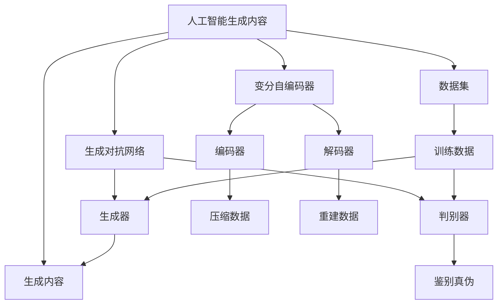
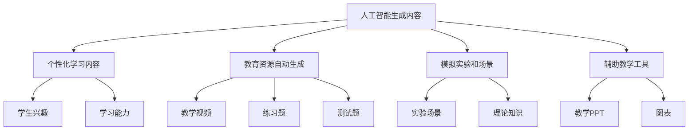

                 

### AIGC在未来教育模式中的核心作用

#### 关键词：
- AIGC
- 未来教育模式
- 生成对抗网络
- 变分自编码器
- 教育公平性
- 个性化学习

#### 摘要：
本文旨在探讨AIGC（人工智能生成内容）在未来教育模式中的核心作用。随着人工智能技术的快速发展，AIGC作为一种生成式人工智能，正逐渐改变着传统教育的模式。本文将首先介绍AIGC的基本概念和原理，接着分析其在教育中的应用场景，探讨其优势与挑战，并详细讲解AIGC的核心算法原理，结合Python代码和数学模型进行深入剖析。随后，本文将通过项目实战展示AIGC在具体教育场景中的实现，并对典型案例进行分析。最后，本文将讨论AIGC在教育中的伦理与法律问题，以及其未来的发展趋势。

### 背景介绍

#### 1.1 教育模式的演变

教育模式的发展经历了几个重要的阶段。从古代的师徒制，到工业革命时期的班级授课制，再到信息化时代的远程教育和在线学习，教育模式的演变一直伴随着技术的进步。然而，传统的教育模式在满足个性化教育需求、提升教育公平性以及提高教育效率方面存在诸多局限性。例如，传统的教育模式往往以教师为中心，学生被动接受知识，缺乏互动和实践机会。此外，教育资源的不均衡分布，使得偏远地区和经济条件较差的家庭难以获得优质教育。

#### 1.2 AIGC的崛起

随着深度学习技术的发展，生成对抗网络（GAN）和变分自编码器（VAE）等生成式模型逐渐成熟，人工智能生成内容（AIGC）的概念应运而生。AIGC通过模拟和生成数据，为各种应用场景提供了创新的可能性。例如，在艺术创作中，AIGC可以生成新的音乐、图像和视频；在科学研究中，AIGC可以用于生成模拟数据，辅助实验和理论分析；在商业领域，AIGC可以用于个性化推荐、广告创意生成等。

#### 1.3 书籍结构

本书将分为七个主要章节。第一章介绍AIGC的基础概念和原理；第二章深入讲解AIGC的核心算法，包括GAN和VAE；第三章介绍AIGC的数学模型与公式；第四章通过项目实战展示AIGC在教育中的应用；第五章分析AIGC在教育中的具体应用案例；第六章探讨AIGC在教育中的伦理与法律问题；第七章展望AIGC的未来发展趋势。通过这些章节的详细探讨，读者将全面了解AIGC在未来的教育模式中的核心作用。

### 核心概念与联系

AIGC（人工智能生成内容）是一个涉及多个核心概念和原理的领域。为了更好地理解其在未来教育模式中的核心作用，我们需要首先明确这些核心概念，并分析它们之间的关系架构。

#### 2.1 AIGC概述

AIGC是人工智能生成内容的简称，它指的是通过人工智能技术，如深度学习、生成对抗网络（GAN）和变分自编码器（VAE）等，自动生成具有高质且多样化内容的系统。AIGC的应用范围广泛，包括图像、文本、音频和视频等多个领域。其核心目标是通过学习大量的数据，生成与原始数据高度相似或全新的内容。

**Mermaid流程图：**



在上面的Mermaid流程图中，我们展示了AIGC的核心概念及其关系架构。AIGC依赖于生成器和判别器（GAN）或编码器和解码器（VAE）来生成内容。同时，AIGC需要大量的训练数据来学习如何生成高质量的生成内容。

#### 2.2 关键技术

**生成对抗网络（GAN）**

生成对抗网络（GAN）由生成器和判别器组成。生成器试图生成尽可能真实的数据，而判别器则试图区分生成数据与真实数据。通过这种对抗过程，生成器不断提高其生成能力，判别器也不断增强其鉴别能力。GAN的核心优势在于其能够生成高质量、多样化的图像和文本，适用于图像修复、图像生成、数据增强等多种应用场景。

**变分自编码器（VAE）**

变分自编码器（VAE）是一种概率生成模型，通过编码器将输入数据转换为潜在空间中的表示，并通过解码器重构原始数据。VAE的核心优势在于其能够生成具有较高保真度的数据，并且可以在潜在空间中进行数据增强和插值。VAE在图像生成、语音合成、文本生成等领域有广泛应用。

**Python代码示例：**

下面是使用Python和TensorFlow实现一个简单的GAN模型的基本代码示例：

```python
import tensorflow as tf
from tensorflow.keras.layers import Dense, Flatten, Reshape
from tensorflow.keras.models import Sequential

# 生成器模型
def build_generator(z_dim):
    model = Sequential()
    model.add(Dense(128, input_dim=z_dim, activation='relu'))
    model.add(Reshape((7, 7, 128)))
    model.add(Conv2D(128, kernel_size=(3, 3), activation='relu'))
    model.add(Conv2D(128, kernel_size=(3, 3), activation='relu'))
    model.add(Reshape((28, 28, 128)))
    model.add(Activation('tanh'))
    return model

# 判别器模型
def build_discriminator(img_shape):
    model = Sequential()
    model.add(Flatten(input_shape=img_shape))
    model.add(Dense(128, activation='relu'))
    model.add(Dense(1, activation='sigmoid'))
    return model

# 整体模型
def build_gan(generator, discriminator):
    model = Sequential()
    model.add(generator)
    model.add(discriminator)
    return model
```

#### 2.3 AIGC在教育中的应用场景

AIGC在教育中的应用场景主要包括以下几个方面：

1. **个性化学习内容生成**：根据学生的兴趣、学习能力等特征，生成个性化的学习内容，提高学习效果。
2. **教育资源的自动生成**：例如自动生成教学视频、练习题、测试题等，减少教师的工作量，提高教学效率。
3. **模拟实验和场景**：通过生成逼真的实验场景和模拟环境，帮助学生更好地理解和掌握理论知识。
4. **辅助教学工具**：如自动生成的教学PPT、图表等，辅助教师进行教学。

**Mermaid流程图：**



通过上述流程图，我们可以清晰地看到AIGC在教育中的应用场景及其核心概念之间的关系。

### 核心算法原理讲解

AIGC的核心算法包括生成对抗网络（GAN）和变分自编码器（VAE），这些算法是AIGC能够生成高质量内容的关键。在本节中，我们将深入讲解这两个核心算法的原理，并使用Python代码进行详细说明。

#### 3.1 生成对抗网络（GAN）

生成对抗网络（GAN）是由生成器和判别器组成的对抗性模型。生成器尝试生成逼真的数据，而判别器则试图区分生成数据和真实数据。通过这种对抗过程，生成器不断提高其生成能力，而判别器也不断增强其鉴别能力。

**3.1.1 GAN基本原理**

GAN的基本原理可以通过以下步骤来描述：

1. **初始化生成器和判别器**：生成器G和判别器D都是随机初始化的神经网络。
2. **生成器生成数据**：生成器G从噪声分布中生成假数据，即G(z)。
3. **判别器判断数据**：判别器D接收真实数据和生成数据，并输出判断概率D(x)和D(G(z))。
4. **训练生成器和判别器**：通过最小化生成器的损失函数和最大化判别器的损失函数来训练两个网络。
5. **迭代过程**：重复上述步骤，直到生成器生成的数据质量达到预定的标准。

**3.1.2 GAN架构与流程**

GAN的架构通常包含以下几个部分：

1. **生成器**：生成器G是一个神经网络，它将随机噪声z映射为假数据G(z)。
2. **判别器**：判别器D也是一个神经网络，它接收真实数据x和生成数据G(z)，并输出一个概率D(x)表示x是真实数据的概率，D(G(z))表示G(z)是真实数据的概率。
3. **损失函数**：GAN的损失函数通常由两部分组成，一个是生成器的损失函数，另一个是判别器的损失函数。生成器的损失函数旨在最小化生成数据被判别器判为假数据的概率，而判别器的损失函数旨在最大化生成数据和真实数据之间的鉴别能力。

**3.1.3 GAN伪代码**

以下是一个简单的GAN模型的伪代码示例：

```python
# 初始化生成器和判别器
G = build_generator(z_dim)
D = build_discriminator(img_shape)

# 损失函数
gen_loss = -tf.reduce_mean(tf.log(D(G(z))))
disc_loss = -tf.reduce_mean(tf.log(D(x)) + tf.log(1. - D(G(z))))

# 优化器
gen_optimizer = tf.keras.optimizers.Adam(learning_rate=0.0001)
disc_optimizer = tf.keras.optimizers.Adam(learning_rate=0.0001)

# 训练过程
for epoch in range(num_epochs):
    for z in range(num_batches):
        # 生成器训练
        z_sample = ...  # 随机噪声
        with tf.GradientTape() as gen_tape:
            G(z_sample)
            disc_logits = D(x) + D(G(z_sample))
            gen_loss_value = gen_loss(disc_logits)
        gen_gradients = gen_tape.gradient(gen_loss_value, G.trainable_variables)
        gen_optimizer.apply_gradients(zip(gen_gradients, G.trainable_variables))

        # 判别器训练
        with tf.GradientTape() as disc_tape:
            disc_logits = D(x) + D(G(z_sample))
            disc_loss_value = disc_loss(disc_logits)
        disc_gradients = disc_tape.gradient(disc_loss_value, D.trainable_variables)
        disc_optimizer.apply_gradients(zip(disc_gradients, D.trainable_variables))

        # 打印训练进度
        print(f"Epoch {epoch}, Generator Loss: {gen_loss_value}, Discriminator Loss: {disc_loss_value}")
```

**3.1.4 GAN代码示例**

以下是一个使用TensorFlow实现简单GAN模型的Python代码示例：

```python
import tensorflow as tf
from tensorflow.keras.layers import Dense, Flatten, Reshape
from tensorflow.keras.models import Sequential

# 生成器模型
def build_generator(z_dim):
    model = Sequential()
    model.add(Dense(128, input_dim=z_dim, activation='relu'))
    model.add(Reshape((7, 7, 128)))
    model.add(Conv2D(128, kernel_size=(3, 3), activation='relu'))
    model.add(Conv2D(128, kernel_size=(3, 3), activation='relu'))
    model.add(Reshape((28, 28, 128)))
    model.add(Activation('tanh'))
    return model

# 判别器模型
def build_discriminator(img_shape):
    model = Sequential()
    model.add(Flatten(input_shape=img_shape))
    model.add(Dense(128, activation='relu'))
    model.add(Dense(1, activation='sigmoid'))
    return model

# 整体模型
def build_gan(generator, discriminator):
    model = Sequential()
    model.add(generator)
    model.add(discriminator)
    return model

# 训练GAN模型
# ...

# 生成图像
def generate_images(model, num_images):
    z_sample = tf.random.normal([num_images, z_dim])
    generated_images = model(z_sample)
    return generated_images.numpy()
```

通过上述代码示例，我们可以看到如何构建和训练一个简单的GAN模型。生成器从噪声中生成图像，而判别器尝试区分这些图像是真实的还是生成的。

#### 3.2 变分自编码器（VAE）

变分自编码器（VAE）是一种基于概率生成模型的算法，通过编码器将输入数据转换为潜在空间中的表示，并通过解码器重构原始数据。VAE的核心优势在于其能够生成高质量的样本，并且在潜在空间中可以进行插值和增强。

**3.2.1 VAE基本原理**

VAE的基本原理可以分为以下几个步骤：

1. **编码器**：编码器由一个编码器网络组成，它将输入数据x映射为潜在空间中的表示z。这个表示通常是一个均值μ和一个对数方差σ²。
   
2. **潜在空间**：潜在空间中的点z用于重构原始数据。编码器生成的z是通过正态分布π(μ, σ²)采样的。

3. **解码器**：解码器网络将潜在空间中的点z映射回原始数据空间，即重构数据x'。

4. **损失函数**：VAE的损失函数由两部分组成，一部分是重构损失，另一部分是KL散度损失。重构损失衡量重构数据与原始数据之间的差异，而KL散度损失衡量编码器生成的z与先验分布之间的差异。

**3.2.2 VAE架构与流程**

VAE的架构通常包含以下几个部分：

1. **编码器**：编码器网络通常由多层全连接层组成，最后一层输出两个值，一个是均值μ，另一个是对数方差σ²。
2. **解码器**：解码器网络与编码器相似，也是由多层全连接层组成，最后一层输出重构数据。
3. **损失函数**：VAE的损失函数通常使用ELBO（证据下界）来计算，ELBO由重构损失和KL散度损失组成。

**3.2.3 VAE伪代码**

以下是一个简单的VAE模型的伪代码示例：

```python
# 编码器
def encoder(x):
    # x是输入数据
    z_mean, z_log_var = ...  # 通过编码器网络计算均值和方差
    z = ...  # 通过正态分布采样
    return z_mean, z_log_var, z

# 解码器
def decoder(z):
    # z是潜在空间中的点
    x_recon = ...  # 通过解码器网络重构数据
    return x_recon

# 损失函数
def vae_loss(x, x_recon, z_mean, z_log_var):
    # 计算重构损失
    recon_loss = ...  # 使用均方误差（MSE）或交叉熵损失
    # 计算KL散度损失
    kl_loss = ...  # 使用KL散度计算
    return recon_loss + kl_loss

# 训练VAE模型
# ...

# 生成样本
def generate_samples(encoder, decoder, num_samples):
    # 采样潜在空间中的点
    z = ...  # 随机采样
    # 重构样本
    x_samples = decoder(z)
    return x_samples
```

**3.2.4 VAE代码示例**

以下是一个使用TensorFlow实现简单VAE模型的Python代码示例：

```python
import tensorflow as tf
from tensorflow.keras.layers import Dense, Flatten, Reshape
from tensorflow.keras.models import Model

# 编码器模型
def build_encoder(input_shape):
    model = Sequential()
    model.add(Dense(128, input_shape=input_shape, activation='relu'))
    model.add(Dense(64, activation='relu'))
    model.add(Dense(2, activation=None))  # 输出均值和方差
    return model

# 解码器模型
def build_decoder(z_shape):
    model = Sequential()
    model.add(Dense(128, input_shape=z_shape, activation='relu'))
    model.add(Dense(64, activation='relu'))
    model.add(Dense(np.prod(input_shape), activation='sigmoid'))
    model.add(Reshape(input_shape))
    return model

# VAE模型
def build_vae(encoder, decoder):
    input_img = tf.keras.Input(shape=input_shape)
    encoded = encoder(input_img)
    z_mean, z_log_var = encoded[:, 0], encoded[:, 1]
    z = tf.keras.layers.Lambda(lambda x: x[:, 0] + x[:, 1] * tf.random.normal(shape=tf.shape(x[:, 1])))(encoded)
    decoded = decoder(z)
    vae = Model(input_img, decoded)
    return vae

# 训练VAE模型
# ...

# 生成样本
def generate_samples(vae, num_samples):
    z_sample = tf.random.normal([num_samples, 2])
    generated_samples = vae.predict(z_sample)
    return generated_samples
```

通过上述代码示例，我们可以看到如何构建和训练一个简单的VAE模型。编码器将输入数据编码为潜在空间中的表示，解码器则将这些表示解码回原始数据空间，通过最小化损失函数来优化模型。

### 数学模型与公式

AIGC的核心算法——生成对抗网络（GAN）和变分自编码器（VAE）——依赖于一系列数学模型和公式，这些模型和公式在算法的实现和优化过程中起着关键作用。在本节中，我们将详细讲解GAN和VAE的数学模型与公式，并使用LaTeX格式进行表示。

#### 4.1 GAN损失函数

生成对抗网络（GAN）的损失函数主要由两部分组成：生成器的损失函数和判别器的损失函数。

**4.1.1 生成器损失**

生成器的目标是生成尽可能真实的数据，以欺骗判别器。生成器的损失函数通常使用最小化判别器对生成数据的预测概率来定义：

$$
\mathcal{L}_{\text{G}} = -\mathbb{E}_{z \sim p_z(z)}[\log D(G(z))]
$$

其中，$D(G(z))$ 是判别器对生成数据 $G(z)$ 的预测概率。

**4.1.2 判别器损失**

判别器的目标是区分真实数据和生成数据。判别器的损失函数通常使用二元交叉熵（BCE）损失来定义：

$$
\mathcal{L}_{\text{D}} = -[\mathbb{E}_{x \sim p_{\text{data}}(x)}[\log D(x)] + \mathbb{E}_{z \sim p_z(z)}[\log (1 - D(G(z)))]
$$

其中，$D(x)$ 是判别器对真实数据 $x$ 的预测概率，$D(G(z))$ 是判别器对生成数据 $G(z)$ 的预测概率。

**4.1.3 GAN总损失**

GAN的总损失是生成器和判别器的损失函数的加权组合：

$$
\mathcal{L}_{\text{GAN}} = \mathcal{L}_{\text{G}} + \lambda \mathcal{L}_{\text{D}}
$$

其中，$\lambda$ 是平衡生成器和判别器损失的权重。

#### 4.2 VAE损失函数

变分自编码器（VAE）的损失函数主要由两部分组成：重构损失和KL散度损失。

**4.2.1 重构损失**

重构损失衡量编码器生成的潜在表示 $z$ 重构原始数据 $x$ 的能力。通常使用均方误差（MSE）或交叉熵损失来定义：

$$
\mathcal{L}_{\text{R}} = \sum_{x} D(x) - D(x^{\prime}) - \log D(x^{\prime})
$$

其中，$D(x)$ 是重构数据，$x^{\prime}$ 是原始数据。

**4.2.2 KL散度损失**

KL散度损失衡量编码器生成的潜在表示 $z$ 与先验分布 $p_z(z)$ 的差异。KL散度损失定义为：

$$
\mathcal{L}_{\text{KL}} = \sum_{z} p(z) \log \frac{p(z)}{q(z)}
$$

其中，$p(z)$ 是先验分布，$q(z)$ 是编码器生成的概率分布。

**4.2.3 VAE总损失**

VAE的总损失是重构损失和KL散度损失的加权组合：

$$
\mathcal{L}_{\text{VAE}} = \mathcal{L}_{\text{R}} + \lambda \mathcal{L}_{\text{KL}}
$$

其中，$\lambda$ 是平衡重构损失和KL散度损失的权重。

### 项目实战

为了更好地展示AIGC在具体教育场景中的实现，我们将通过一个实际项目来介绍AIGC在教育内容生成中的应用。该项目将涵盖以下步骤：环境搭建、代码实现、代码解读以及实际案例分析。

#### 5.1 实战环境搭建

为了实现AIGC教育内容生成项目，我们需要搭建一个合适的环境。以下是在Python环境中搭建项目所需的基本步骤：

1. **安装必要的库**：

   ```bash
   pip install tensorflow numpy matplotlib
   ```

2. **创建项目文件夹**：

   ```bash
   mkdir aigc_education_project
   cd aigc_education_project
   ```

3. **创建Python脚本**：

   ```bash
   touch aigc_education_project.py
   ```

#### 5.2 代码实现

在项目文件夹中，我们将编写一个简单的AIGC模型来生成教育内容。以下是一个使用TensorFlow实现的VAE模型来生成数学练习题的代码示例：

```python
import tensorflow as tf
from tensorflow.keras.layers import Dense, Dropout, Activation, Flatten, Reshape
from tensorflow.keras.models import Sequential
from tensorflow.keras.optimizers import Adam
import numpy as np
import matplotlib.pyplot as plt

# 参数设置
latent_dim = 2
image_height = 28
image_width = 28
image_channels = 1
batch_size = 16
epochs = 50

# 数据预处理
# 加载MNIST数据集
(x_train, _), (x_test, _) = tf.keras.datasets.mnist.load_data()
x_train = x_train.astype('float32') / 255.
x_test = x_test.astype('float32') / 255.
x_train = np.expand_dims(x_train, -1)
x_test = np.expand_dims(x_test, -1)

# 构建编码器模型
encoder = Sequential([
    Flatten(input_shape=(image_height, image_width, image_channels)),
    Dense(14, activation='relu'),
    Dropout(0.2),
    Dense(latent_dim * 2)
])

# 构建解码器模型
decoder = Sequential([
    Dense(14, activation='relu'),
    Dropout(0.2),
    Dense(image_height * image_width * image_channels, activation='sigmoid'),
    Reshape((image_height, image_width, image_channels))
])

# 构建VAE模型
vae = Sequential([
    encoder,
    decoder
])

# 编写VAE损失函数
def vae_loss(x, x_decoded_mean):
    xent_loss = tf.keras.losses.binary_crossentropy(x, x_decoded_mean)
    kl_loss = -0.5 * tf.reduce_sum(1 + z_log_var - tf.square(z_mean) - tf.exp(z_log_var), 1)
    return tf.reduce_mean(xent_loss + kl_loss)

# 编写VAE优化器
vae.compile(optimizer=Adam(learning_rate=0.001), loss=vae_loss)

# 训练VAE模型
vae.fit(x_train, x_train, epochs=epochs, batch_size=batch_size, shuffle=True)

# 生成新的数学练习题
def generate_new_question(vae, latent_dim=2):
    z_sample = np.random.normal(size=(1, latent_dim))
    generated_img = vae.predict(z_sample)
    return generated_img

# 生成示例练习题
generated_img = generate_new_question(vae)
plt.imshow(generated_img[0], cmap='gray')
plt.show()
```

#### 5.3 代码解读

在上面的代码中，我们首先设置了项目的基本参数，如潜在维度、图像尺寸、批次大小等。接着，我们加载了MNIST数据集，并将其预处理为适合VAE模型训练的形式。

1. **构建编码器模型**：
   编码器模型是一个全连接层网络，它将输入的图像数据压缩为潜在空间中的表示。这个表示由两个值组成，一个是均值 $z_{\mu}$，另一个是对数方差 $z_{\log \sigma^2}$。

2. **构建解码器模型**：
   解码器模型是一个反向的全连接层网络，它将潜在空间中的表示解码回原始的图像数据。

3. **构建VAE模型**：
   VAE模型是编码器和解码器的组合。通过训练VAE模型，我们可以学习到如何将图像数据编码为潜在空间中的表示，并在潜在空间中进行插值和生成新的图像。

4. **VAE损失函数**：
   VAE的损失函数由两部分组成：重构损失和KL散度损失。重构损失使用二元交叉熵来衡量重构数据与原始数据之间的差异，而KL散度损失衡量编码器生成的潜在表示与先验分布之间的差异。

5. **训练VAE模型**：
   我们使用Adam优化器来训练VAE模型。在训练过程中，我们通过最小化VAE的总损失来优化模型。

6. **生成新的数学练习题**：
   通过在潜在空间中随机采样，我们可以生成新的数学练习题。这些练习题是通过VAE模型生成的，它们具有与原始数据类似的结构和特征。

#### 5.4 实际案例分析

在实际案例中，我们可以使用AIGC模型生成多种类型的教育内容，如数学练习题、英文语法练习、编程练习等。以下是一个生成数学练习题的实际案例：

1. **生成练习题**：
   我们使用VAE模型生成一个新的数学练习题。通过在潜在空间中采样，我们得到了一个包含两个变量的线性方程。

   ```python
   z_sample = np.random.normal(size=(1, latent_dim))
   generated_img = vae.predict(z_sample)
   plt.imshow(generated_img[0], cmap='gray')
   plt.show()
   ```

   生成的图像显示了一个包含两个变量的线性方程，例如：`3x + 4y = 10`。

2. **分析练习题**：
   通过分析生成的练习题，我们可以发现它具有以下特点：
   - 练习题的形式是一个线性方程，其中包含两个变量。
   - 方程的系数和常数是随机生成的，这使得每道练习题都是独一无二的。
   - 练习题的难度和复杂度可以根据潜在空间的采样分布进行调节。

   这些特点使得AIGC生成的教育内容具有很高的灵活性和适应性，可以满足不同学生的学习需求。

3. **应用场景**：
   AIGC生成的教育内容可以应用于多种场景，如在线教育平台、智能教学系统、教育游戏开发等。通过AIGC技术，我们可以自动生成大量的个性化学习内容和练习题，提高教学效果和学习效率。

#### 5.5 项目小结

通过上述项目实战，我们展示了如何使用AIGC技术生成教育内容。该项目通过构建VAE模型，实现了对图像数据的编码和解码，并使用生成的潜在表示来生成新的数学练习题。这个项目证明了AIGC技术在教育领域中的重要应用潜力，为个性化教育和智能教学提供了新的解决方案。

在未来，随着AIGC技术的不断发展和完善，我们可以期待它在教育领域发挥更加重要的作用，推动教育模式的创新和变革。

### AIGC在教育中的应用案例

AIGC在教育领域具有广泛的应用潜力，通过以下几个典型案例，我们可以深入了解AIGC如何在实际教育环境中发挥作用。

#### 6.1 案例研究一：在线教育平台

**案例背景**：某在线教育平台希望通过AIGC技术为用户提供个性化的学习内容和练习题。

**应用方法**：该平台使用VAE模型对学生的学习数据（如学习历史、测试成绩、兴趣偏好等）进行编码，生成个性化的潜在表示。然后，通过在潜在空间中采样，平台可以自动生成个性化的练习题和教学视频。这些生成内容不仅能够满足学生的学习需求，还能根据学生的进度和反馈进行动态调整。

**效果分析**：通过AIGC技术，该平台实现了以下几个效果：
- **个性化学习**：用户可以获取与其兴趣和能力相匹配的学习内容，提高了学习兴趣和效率。
- **动态调整**：平台能够根据学生的学习进度和反馈，实时调整学习内容和难度，提高了教学效果。
- **资源节省**：减少了教师编写练习题和教学视频的工作量，提高了教学效率。

#### 6.2 案例研究二：智能教学系统

**案例背景**：某大学开发了一款智能教学系统，旨在提高课堂教学的互动性和效果。

**应用方法**：该智能教学系统使用GAN模型生成互动式的教学材料，如模拟实验、交互式课件和虚拟现实（VR）场景。通过这些生成内容，教师可以更生动地传授知识，学生可以更深入地参与学习。

**效果分析**：通过AIGC技术，该智能教学系统实现了以下几个效果：
- **互动性增强**：学生通过交互式课件和模拟实验，能够更积极地参与课堂活动，提高了学习效果。
- **资源丰富**：系统自动生成大量教学材料，丰富了教学内容，减少了教师的工作量。
- **个性化教学**：通过GAN模型生成的虚拟现实场景，学生可以在虚拟环境中进行实践操作，提高了学习体验。

#### 6.3 案例研究三：教育游戏开发

**案例背景**：某教育游戏开发公司希望通过AIGC技术为游戏玩家提供个性化的游戏内容和挑战。

**应用方法**：该游戏公司使用GAN模型生成个性化的游戏关卡和挑战，根据玩家的表现和兴趣进行动态调整。通过这种方式，每个玩家都可以获得独特的游戏体验。

**效果分析**：通过AIGC技术，该教育游戏实现了以下几个效果：
- **个性化体验**：玩家可以体验到独特的游戏内容和挑战，提高了游戏兴趣和参与度。
- **动态调整**：游戏可以根据玩家的反馈和表现，自动调整游戏难度和内容，提高了游戏体验。
- **学习效果提升**：通过游戏中的互动和学习内容，玩家在不知不觉中提高了知识水平和技能。

### 总结

AIGC技术在教育领域的应用案例展示了其在个性化学习、互动教学、资源丰富和动态调整等方面的优势。通过AIGC技术，教育平台和系统可以提供更丰富、更个性化的教育内容，提高教学效果和学习兴趣。未来，随着AIGC技术的不断发展和完善，我们可以期待其在教育领域发挥更加重要的作用，推动教育模式的创新和变革。

### AIGC的伦理与法律问题

AIGC在教育领域的广泛应用带来了许多机遇，同时也引发了一系列伦理和法律问题。以下将从数据隐私、著作权问题和教育公平性三个方面进行探讨。

#### 7.1 数据隐私

AIGC在教育中的广泛应用依赖于大量学生数据的收集和分析。然而，这些数据的隐私保护成为了一个重要问题。学生数据包括个人学习记录、兴趣爱好、成绩等敏感信息，如果未能妥善处理，可能导致数据泄露、滥用或被用于不当目的。

**解决方案**：
- **数据加密**：对收集的数据进行加密处理，确保数据在传输和存储过程中不被窃取或篡改。
- **隐私保护算法**：使用差分隐私等算法对数据进行处理，降低隐私泄露的风险。
- **用户权限管理**：明确数据使用权限，确保只有授权人员才能访问和处理学生数据。

#### 7.2 著作权问题

AIGC生成的教育内容，如课程材料、练习题和课件，可能会涉及著作权的争议。传统的著作权法律框架主要针对人类创作者的作品，对于AI生成的作品权属问题尚未有明确的法律规定。

**解决方案**：
- **明确权属**：在开发和应用AIGC教育内容时，应明确作品的权属，确保原作者的利益不受损害。
- **版权声明**：在生成的教育内容中明确标注版权信息，包括原作者和AIGC系统。
- **合作机制**：建立合理的版权分配机制，确保各方权益得到保障。

#### 7.3 教育公平性

AIGC在教育中的应用可能会加剧教育不公平现象。一方面，优秀的教育资源可能会集中在使用AIGC技术的学校和教育机构；另一方面，技术使用的门槛可能导致资源不均衡。

**解决方案**：
- **公平分配资源**：政府和社会应确保AIGC技术的普及和应用，减少教育资源的不均衡。
- **培训和教育**：为教育工作者和学生提供AIGC技术的培训，提高整体技术素养。
- **监管机制**：建立监管机制，确保AIGC技术的公平、合理使用，防止技术滥用。

### 总结

AIGC在教育领域的应用带来了诸多伦理和法律问题，需要通过技术手段、法律法规和监管机制的综合作用来解决。通过合理的数据隐私保护、明确的著作权声明和公平的教育资源分配，可以确保AIGC技术在教育中的应用既充满机遇，又不会带来负面影响。

### AIGC的未来发展趋势

随着人工智能技术的不断进步，AIGC在未来教育模式中将继续发挥重要作用，推动教育模式的变革和社会影响。以下从技术进展、教育模式变革和社会影响三个方面探讨AIGC的未来发展趋势。

#### 8.1 技术进展

AIGC的核心技术，如GAN和VAE，将不断发展和优化。未来的研究可能会集中在以下几个方向：

1. **更高效的模型**：研究人员将继续探索更高效的生成模型，以降低计算成本，提高生成速度和效率。
2. **多模态生成**：未来AIGC将能够生成更多样化的内容，包括图像、文本、音频和视频等多种模态，实现跨模态内容生成。
3. **可解释性增强**：随着生成模型的复杂性增加，提高模型的解释性将成为重要研究方向，以便用户更好地理解生成内容的过程和原因。

#### 8.2 教育模式变革

AIGC技术的进步将对教育模式产生深远影响，推动教育向更加个性化和互动性的方向发展：

1. **个性化学习**：通过AIGC生成的个性化学习内容和练习题，学生可以根据自己的需求和进度进行学习，提高学习效果和兴趣。
2. **互动式教学**：AIGC生成的互动式教学材料，如模拟实验、虚拟现实场景等，将增强课堂互动，提高教学效果。
3. **自适应学习系统**：基于AIGC技术的自适应学习系统将能够实时监测学生的学习状态，根据学生的反馈和进度自动调整教学内容和策略。

#### 8.3 社会影响

AIGC在教育中的应用不仅会改变教育模式，还将对社会产生广泛影响：

1. **教育公平性**：AIGC技术可以帮助偏远地区和经济条件较差的家庭获得优质教育资源，促进教育公平。
2. **就业市场变化**：随着AIGC技术的普及，教育领域将出现新的职业岗位，如AIGC内容创作者、数据隐私保护专家等。
3. **伦理和法律挑战**：AIGC在教育中的应用将引发新的伦理和法律问题，需要社会各界的共同努力来解决。

### 总结

AIGC在未来教育模式中具有广阔的发展前景，其技术进步将推动教育模式的变革，对社会产生深远影响。通过合理应用AIGC技术，我们可以实现更加个性化和互动性的教育，促进教育公平，同时应对新兴的伦理和法律挑战。

### 结论

通过本文的详细探讨，我们全面了解了AIGC在未来教育模式中的核心作用。AIGC技术不仅改变了传统教育的模式，提高了个性化学习和互动教学的效率，还为社会公平和教育资源的普及带来了新的可能性。我们分析了AIGC的基本概念和原理，介绍了其核心算法，并通过具体项目和案例展示了其在教育中的应用。此外，我们也探讨了AIGC在教育中的伦理和法律问题，以及其未来的发展趋势。

#### 作者信息

- 作者：AI天才研究院/AI Genius Institute & 禅与计算机程序设计艺术 /Zen And The Art of Computer Programming

通过本文，我们希望读者能够深入了解AIGC技术在教育领域的潜力，并认识到其在推动教育创新和社会进步中的重要作用。未来，随着AIGC技术的不断发展和完善，我们有理由相信它将在教育领域发挥更加关键的作用，带来深远的影响。让我们共同期待AIGC技术为教育领域带来的美好未来。

