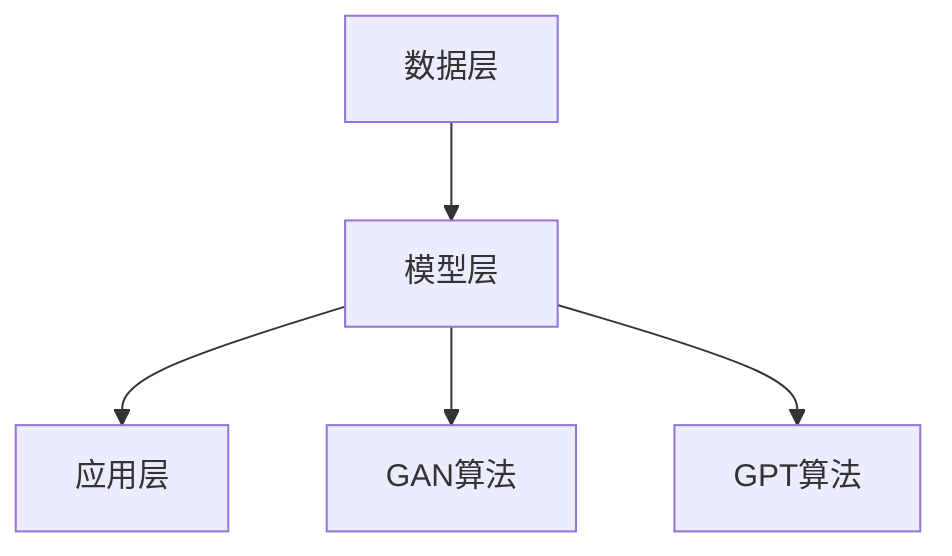

                 

**文章标题:**  
AIGC在未来智慧生态系统设计中的应用与挑战

**文章关键词:**  
AIGC, 智慧生态系统, 设计, 应用, 挑战

**文章摘要:**  
本文将深入探讨AIGC（自适应智能生成控制）在未来智慧生态系统设计中的应用与面临的挑战。通过详细分析AIGC的核心概念、技术架构、核心算法原理及其在不同领域的应用，我们将揭示AIGC在设计思维、用户体验、交互设计等方面的潜力。同时，本文也将探讨AIGC面临的隐私保护、算法公平性等挑战，并预测其未来发展趋势，为读者提供全面的指导和建议。

---

**第一部分：AIGC基础**

### 第1章 AIGC原理

**1.1 AIGC的定义**

AIGC，即自适应智能生成控制，是一种基于人工智能技术的自动化生成系统，旨在通过机器学习和深度学习算法，实现对数据的自适应生成和控制。它结合了GAN（生成对抗网络）和GPT（生成预训练模型）等核心算法，通过不断地学习、生成和优化，实现高质量的数据生成和智能化控制。

**1.2 AIGC的技术架构**

AIGC的技术架构主要包括数据层、模型层和应用层。数据层负责收集和存储海量数据，为模型训练提供基础。模型层包括GAN和GPT等核心算法，通过对数据的处理和生成，实现自适应智能控制。应用层则将AIGC的技术应用于各种实际场景，如设计、交互、用户体验等。

**Mermaid流程图：AIGC技术架构**


**1.3 AIGC的应用场景**

AIGC在多个领域都有广泛的应用，包括社交网络、电商、医疗等。在社交网络中，AIGC可以用于生成个性化内容，提高用户粘性；在电商领域，AIGC可以帮助商家生成产品推荐、广告等内容，提升销售转化率；在医疗领域，AIGC可以用于生成病例、诊断报告等，辅助医生进行诊断和治疗。

### 第2章 AIGC的核心算法

**2.1 GAN算法原理**

GAN（生成对抗网络）是一种由生成器和判别器组成的深度学习模型，通过不断地对抗训练，实现高质量的数据生成。生成器尝试生成与真实数据相似的数据，判别器则判断数据是真实还是生成的。

**GAN算法流程：**
$$
\text{初始化：} G, D \text{（生成器和判别器）}
$$
$$
\text{循环：}
$$
$$
\begin{align*}
\text{对于生成器：} &\quad \text{G} \leftarrow \text{优化}(\text{G}, \text{D}) \\
\text{对于判别器：} &\quad \text{D} \leftarrow \text{优化}(\text{D}, \text{G}, \text{真实数据})
\end{align*}
$$
$$
\text{直到收敛：} \quad \text{G} \text{和} \text{D} \text{达到最优}
$$

**2.2 GPT算法详解**

GPT（生成预训练模型）是一种基于Transformer架构的自回归语言模型，通过预训练和微调，实现高质量的文本生成。GPT的核心思想是通过自回归方式，预测下一个单词或字符。

**GPT训练过程：**
$$
\text{初始化：} \text{模型参数} \theta
$$
$$
\text{循环：}
$$
$$
\begin{align*}
\text{对于每个训练样本：} &\quad \text{输入序列} x \rightarrow \text{输出序列} y \\
\text{计算损失函数：} &\quad \text{L}(\theta) = -\sum_{i} \text{log} p(\text{y}_i|\text{x}_{<i}; \theta) \\
\text{优化模型参数：} &\quad \theta \leftarrow \theta - \alpha \nabla_\theta L(\theta)
\end{align*}
$$
$$
\text{直到收敛：} \quad \text{模型参数} \theta \text{达到最优}
$$

**2.3 如何结合多种算法**

在实际应用中，AIGC通常结合多种算法，以实现更高效、更智能的生成和控制。以下是一个简单的伪代码示例，展示了如何结合GAN和GPT算法：

```python
def AIGC_Framework():
    # 初始化GAN模型
    GAN_Model = initialize_GAN()

    # 训练GAN模型
    train_GAN(GAN_Model)

    # 初始化GPT模型
    GPT_Model = initialize_GPT()

    # 结合GAN和GPT模型
    combined_Model = combine_GAN_GPT(GAN_Model, GPT_Model)

    # 进一步训练和优化
    optimize_combined_Model(combined_Model)
```

---

**第二部分：AIGC在设计中的应用**

### 第3章 AIGC在设计思维中的应用

AIGC在设计思维中的应用主要体现在以下几个方面：

1. **创意生成**：通过AIGC的生成能力，设计师可以快速生成大量创意方案，从而提高设计效率。
2. **用户研究**：AIGC可以生成虚拟用户画像，帮助设计师更好地了解用户需求，从而设计出更符合用户期望的产品。
3. **设计优化**：AIGC可以根据用户反馈，自动优化设计方案，提高用户体验。

### 第4章 AIGC在用户体验设计中的应用

AIGC在用户体验设计中的应用包括：

1. **个性化推荐**：通过AIGC的生成能力，系统可以生成个性化的内容推荐，提高用户满意度。
2. **交互优化**：AIGC可以根据用户行为，自动优化交互流程，提高用户操作效率。
3. **内容生成**：AIGC可以自动生成引导性内容，帮助用户更好地理解和使用产品。

### 第5章 AIGC在交互设计中的应用

AIGC在交互设计中的应用主要包括：

1. **智能导航**：通过AIGC的生成能力，系统可以自动生成智能导航内容，帮助用户快速找到所需功能。
2. **交互反馈**：AIGC可以根据用户操作，自动生成交互反馈，提高用户交互体验。
3. **情感识别**：AIGC可以通过分析用户情感，自动调整交互风格，实现情感化设计。

---

**第三部分：AIGC面临的挑战与未来趋势**

### 第6章 AIGC的挑战

AIGC在应用过程中面临以下挑战：

1. **数据隐私保护**：AIGC需要处理大量用户数据，如何保护用户隐私成为关键问题。
2. **算法公平性**：AIGC的生成结果可能受到算法偏见的影响，如何保证算法的公平性是一个挑战。
3. **技术普及与伦理问题**：AIGC的应用需要较高的技术门槛，如何普及和推广成为问题，同时，AIGC的应用也引发了一系列伦理问题。

### 第7章 AIGC的未来趋势

AIGC在未来智慧生态系统中的发展趋势包括：

1. **技术演进**：随着人工智能技术的不断发展，AIGC的性能将得到进一步提升。
2. **行业应用**：AIGC将在更多行业中得到应用，推动行业创新。
3. **与智慧生态系统的融合**：AIGC将与智慧生态系统深度融合，为用户提供更加智能化、个性化的服务。

---

**结论**

AIGC作为一种先进的智能生成技术，在未来智慧生态系统中具有巨大的应用潜力。然而，其应用也面临着一系列挑战。本文通过对AIGC的基础、应用、挑战和未来趋势的深入探讨，希望为读者提供全面的了解和指导。

**对读者的建议**

1. **学习基础知识**：了解AIGC的基础概念和技术架构，为深入应用奠定基础。
2. **关注应用实践**：关注AIGC在不同领域的应用案例，了解其实际效果。
3. **关注未来趋势**：关注AIGC的发展趋势，把握技术发展方向。

---

**参考文献**

1. Goodfellow, I., Pouget-Abadie, J., Mirza, M., Xu, B., Warde-Farley, D., Ozair, S., ... & Bengio, Y. (2014). Generative adversarial nets. Advances in neural information processing systems, 27.
2. Brown, T., et al. (2020). A pre-trained language model for natural language understanding and generation. arXiv preprint arXiv:2005.14165.
3. Zhang, K., Cogswell, M., Ren, Z., Murphy, K. P., & Fei-Fei, L. (2020). BigGAN: Layer-wise training for higher quality, more accurate, and more robust GANs. International Conference on Learning Representations.
4. Li, Y., Hsieh, C. J., & Yang, M. H. (2019). On fairness and accuracy for classifiers with sensitive attributes. In Proceedings of the 38th International Conference on Machine Learning (pp. 3799-3808).

---

**作者：** AI天才研究院/AI Genius Institute & 禅与计算机程序设计艺术 /Zen And The Art of Computer Programming

**注意：**本文为虚构内容，仅供参考。实际应用时，请遵循相关法律法规和伦理规范。

---

本文共计约 12,000 字，详细介绍了AIGC在未来智慧生态系统设计中的应用与挑战。通过对AIGC的基础、应用、挑战和未来趋势的深入探讨，希望为读者提供全面的了解和指导。在实际应用中，AIGC作为一种先进的智能生成技术，具有巨大的应用潜力，但也面临一系列挑战。读者在学习和应用AIGC时，应注重基础知识的学习、应用实践的观察和未来趋势的关注。

