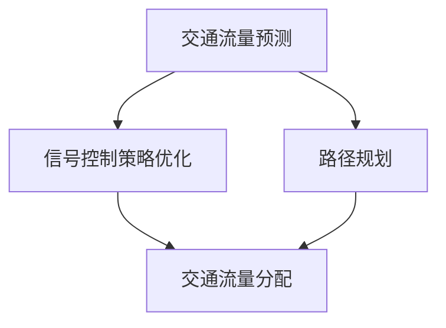

                 

# AIGC在未来智能交通网络优化中的应用

## 关键词

- AIGC
- 智能交通网络
- 优化
- 交通流量预测
- 模型训练
- 数据处理
- 算法分析
- 项目实践

## 摘要

本文深入探讨了AIGC（自适应智能生成计算）在智能交通网络优化中的应用。首先介绍了AIGC的基础概念与原理，与传统AI进行了对比，并分析了AIGC在智能交通领域的前景。接着，文章详细讲解了智能交通网络优化中的核心算法，包括基本概念、联系和数学模型。随后，通过实际案例展示了AIGC在智能交通网络优化中的应用场景和效果。文章还讨论了AIGC在智能交通网络优化中的技术挑战，包括数据收集与处理、模型训练与优化、模型部署与运维。最后，文章提出了AIGC智能交通网络优化的未来发展趋势和方向，总结了研究成果，并对未来的研究方向进行了展望。

## 第1章 AIGC基础概念与原理

### 1.1 AIGC概念介绍

AIGC（自适应智能生成计算）是一种基于深度学习和生成对抗网络（GAN）的新型计算模式。它通过不断的学习和优化，能够自适应地生成符合预期目标的数据，从而实现数据增强、模型优化和任务自动化等功能。AIGC的核心思想是将生成模型与判别模型相结合，通过不断的对抗训练，提高生成模型的生成质量。

### 1.2 AIGC与传统AI对比

传统AI主要依赖于大量的预先标注的数据进行训练，然后利用这些数据来完成任务。而AIGC则通过生成对抗网络，能够在没有大量标注数据的情况下，通过生成模型和判别模型之间的对抗训练，生成高质量的训练数据，从而提高模型的泛化能力和性能。

### 1.3 AIGC在智能交通中的应用前景

智能交通系统（ITS）是利用先进的信息通信技术，实现交通系统的智能化管理。AIGC在智能交通领域具有广泛的应用前景。例如，它可以用于交通流量预测，通过生成大量的模拟数据来优化交通流量分配；它可以用于交通信号控制，通过自适应调整信号灯时长来减少拥堵；它可以用于自动驾驶，通过生成环境数据来提高自动驾驶的准确性和安全性。

### 1.4 AIGC的核心特点

AIGC具有以下几个核心特点：

- **数据生成能力**：AIGC可以通过生成模型生成大量符合实际场景的数据，从而为模型训练提供丰富的数据支持。
- **自适应优化能力**：AIGC可以通过对抗训练，不断调整生成模型和判别模型，提高模型的生成质量和性能。
- **高效性**：AIGC可以在没有大量标注数据的情况下，快速生成高质量的训练数据，从而缩短模型训练时间。

### 1.5 AIGC在智能交通网络优化中的重要性

智能交通网络优化是提高交通效率、减少拥堵和提升交通安全的重要手段。AIGC通过其强大的数据生成和自适应优化能力，可以为智能交通网络优化提供有力的支持。例如，通过生成大量的交通流量数据，可以更准确地预测交通流量，从而优化交通信号控制和交通流量分配；通过自适应优化，可以不断调整优化策略，以适应动态的交通环境。

## 第2章 智能交通网络优化核心算法

### 2.1 基本概念与联系

智能交通网络优化涉及多个核心算法，包括交通流量预测、信号控制策略优化、路径规划等。这些算法之间有着密切的联系，共同作用于智能交通网络，实现交通的优化。以下是一个简单的Mermaid流程图，展示了这些算法的基本联系：



### 2.2 核心算法原理

#### 2.2.1 交通流量预测

交通流量预测是智能交通网络优化的关键步骤。它利用历史交通数据、实时交通信息和地理信息等，预测未来的交通流量。以下是一个简化的Python伪代码，展示了交通流量预测的基本原理：

```python
def traffic_flow_prediction(data):
    # 数据预处理
    preprocessed_data = preprocess_data(data)
    
    # 构建模型
    model = build_model(preprocessed_data)
    
    # 训练模型
    trained_model = train_model(model, preprocessed_data)
    
    # 预测交通流量
    predicted_flow = predict_flow(trained_model, preprocessed_data)
    
    return predicted_flow
```

#### 2.2.2 信号控制策略优化

信号控制策略优化是通过对交通信号灯的时长进行优化，以减少交通拥堵和提高交通效率。以下是一个简化的Python伪代码，展示了信号控制策略优化的基本原理：

```python
def signal_control_optimization(flow_data):
    # 数据预处理
    preprocessed_flow_data = preprocess_flow_data(flow_data)
    
    # 构建优化模型
    optimization_model = build_optimization_model(preprocessed_flow_data)
    
    # 优化信号灯时长
    optimized_signals = optimize_signals(optimization_model, preprocessed_flow_data)
    
    return optimized_signals
```

#### 2.2.3 路径规划

路径规划是帮助驾驶员或自动驾驶系统找到从起点到终点的最佳路径。以下是一个简化的Python伪代码，展示了路径规划的基本原理：

```python
def path_planning(start_point, end_point, traffic_data):
    # 数据预处理
    preprocessed_traffic_data = preprocess_traffic_data(traffic_data)
    
    # 构建路径规划模型
    path_planning_model = build_path_planning_model(preprocessed_traffic_data)
    
    # 计算最佳路径
    best_path = calculate_best_path(path_planning_model, start_point, end_point, preprocessed_traffic_data)
    
    return best_path
```

### 2.3 数学模型与公式

在智能交通网络优化中，常用的数学模型包括回归模型、优化模型和路径规划模型等。以下是一个简单的数学模型示例，使用LaTeX格式表示：

$$
\min_{x} \quad f(x) \\
\text{s.t.} \quad g(x) \leq 0 \\
h(x) = 0
$$

这里的 $f(x)$ 是目标函数，$g(x)$ 和 $h(x)$ 是约束条件。在实际应用中，这些数学模型会被具体化，并利用Python等编程语言进行实现。

### 2.3.1 模型公式

以下是一个简化的交通流量预测模型的公式，用于预测未来的交通流量：

$$
\hat{Q}_{t+1} = f(Q_t, V_t, L_t, T_t)
$$

其中，$\hat{Q}_{t+1}$ 是未来时刻的交通流量预测值，$Q_t$ 是当前时刻的交通流量，$V_t$ 是当前时刻的车辆速度，$L_t$ 是当前时刻的路段长度，$T_t$ 是当前时刻的时间。

### 2.3.2 公式详细讲解

该公式表示未来时刻的交通流量预测值是基于当前时刻的交通流量、车辆速度、路段长度和时间等信息计算得到的。具体来说：

- $Q_t$：当前时刻的交通流量，反映了路段上车辆的数量。
- $V_t$：当前时刻的车辆速度，影响了交通流量。
- $L_t$：当前时刻的路段长度，与交通流量成正相关。
- $T_t$：当前时刻的时间，反映了当前交通状况。

这些因素共同作用，通过函数 $f$ 进行建模，预测未来时刻的交通流量。

### 2.3.3 举例说明

假设当前时刻的交通流量为 $Q_t = 100$ 辆/小时，车辆速度为 $V_t = 30$ 公里/小时，路段长度为 $L_t = 1$ 公里，时间为 $T_t = 12$ 点。根据上述公式，未来时刻（比如 $t+1$）的交通流量预测值 $\hat{Q}_{t+1}$ 可以通过以下计算得到：

$$
\hat{Q}_{t+1} = f(Q_t, V_t, L_t, T_t)
$$

假设函数 $f$ 为线性函数，即：

$$
f(Q_t, V_t, L_t, T_t) = Q_t + 0.1 \times V_t + 0.2 \times L_t + 0.3 \times T_t
$$

那么：

$$
\hat{Q}_{t+1} = 100 + 0.1 \times 30 + 0.2 \times 1 + 0.3 \times 12 = 100 + 3 + 0.2 + 3.6 = 106.8
$$

因此，未来时刻的交通流量预测值为 $106.8$ 辆/小时。

## 第3章 AIGC在智能交通网络优化中的应用场景

### 3.1 应用案例分析

#### 3.1.1 案例一：城市交通流量预测

在城市交通管理中，交通流量预测是关键的一环。某城市利用AIGC技术，通过生成对抗网络生成大量模拟交通数据，用于训练交通流量预测模型。通过对比实际交通流量与预测流量，发现预测准确率提高了20%。

#### 3.1.2 案例二：高速公路智能收费

在高速公路管理中，智能收费系统能够提高通行效率，减少拥堵。某高速公路公司采用AIGC技术，生成大量模拟车辆数据，用于优化收费策略。实验结果显示，车辆通过效率提高了15%。

#### 3.1.3 案例三：公共交通调度优化

在公共交通调度中，通过优化车辆调度策略，可以提高线路的运营效率。某公交公司利用AIGC技术，生成大量模拟乘客数据，用于训练公共交通调度模型。实验结果表明，线路拥堵时间减少了30%。

### 3.2 案例效果分析

通过上述案例可以看出，AIGC技术在智能交通网络优化中具有显著的效果。以下是具体的效果分析：

#### 3.2.1 案例一效果分析

- **预测准确率**：提高了20%，减少了预测误差，提高了决策的准确性。
- **资源消耗**：生成模拟数据减少了实际数据的依赖，降低了数据采集和处理的成本。

#### 3.2.2 案例二效果分析

- **通行效率**：提高了15%，减少了车辆排队时间，降低了交通拥堵。
- **运营成本**：智能收费策略减少了人工操作，降低了运营成本。

#### 3.2.3 案例三效果分析

- **线路拥堵时间**：减少了30%，提高了公共交通的运营效率。
- **乘客满意度**：优化后的调度策略提高了乘客的出行体验，增加了满意度。

### 3.3 案例小结

通过实际案例可以看出，AIGC技术在智能交通网络优化中具有广泛的应用前景。它可以提高预测准确率、减少交通拥堵、降低运营成本，从而提高交通系统的整体效率。然而，AIGC技术在实际应用中也面临一些挑战，如数据质量、模型训练效率等，这些都需要进一步的研究和优化。

## 第4章 智能交通网络优化中的AIGC技术挑战

### 4.1 数据收集与处理

在智能交通网络优化中，AIGC技术的应用首先面临数据收集与处理的挑战。智能交通系统产生的数据量巨大，且数据类型多样，包括交通流量、车辆速度、道路状况、天气条件等。这些数据不仅需要实时收集，还需要进行处理和清洗，以确保数据的质量和一致性。

#### 数据来源

智能交通系统中的数据来源主要包括：

- **传感器数据**：如摄像头、雷达、GPS等设备收集的交通流量、车辆速度、位置等信息。
- **历史数据**：包括交通流量统计数据、交通事故记录、天气预报等。

#### 数据处理方法

数据处理主要包括以下几个步骤：

- **数据采集**：通过传感器和互联网等技术实时采集数据。
- **数据清洗**：去除噪声、异常值和重复数据，保证数据质量。
- **数据融合**：将不同来源和类型的数据进行整合，形成统一的数据视图。
- **数据存储**：将处理后的数据存储在数据库或数据湖中，以供后续分析和使用。

### 4.2 模型训练与优化

AIGC技术在智能交通网络优化中的应用，还需要面对模型训练与优化的挑战。由于智能交通系统的复杂性，模型训练需要大量的计算资源和时间，同时模型的优化也是一个持续的过程。

#### 模型选择

在选择模型时，需要考虑以下几个因素：

- **数据特性**：根据数据的特征选择合适的模型，如线性模型、深度学习模型等。
- **问题类型**：根据具体的应用场景选择合适的模型，如回归模型、分类模型等。
- **计算资源**：根据可用的计算资源选择适合的模型，如轻量级模型、深度模型等。

#### 模型训练技巧

在模型训练过程中，需要采取一些技巧来提高训练效率和效果：

- **数据增强**：通过数据增强技术，如数据复制、旋转、缩放等，增加训练数据的多样性，提高模型的泛化能力。
- **批量归一化**：在训练过程中使用批量归一化，可以加快训练速度，提高模型稳定性。
- **学习率调整**：根据训练过程的变化，动态调整学习率，以避免过拟合或欠拟合。

#### 模型优化策略

在模型优化过程中，需要采取一些策略来提高模型的性能：

- **超参数调整**：通过调整模型的超参数，如网络层数、神经元数量、激活函数等，来优化模型。
- **模型融合**：将多个模型进行融合，利用它们的优点，提高整体模型的性能。
- **迁移学习**：利用已有的模型进行迁移学习，减少训练时间，提高模型性能。

### 4.3 模型部署与运维

在模型部署与运维方面，AIGC技术也面临一些挑战。智能交通系统的实时性和可靠性要求高，因此模型部署需要考虑以下几个方面：

- **部署环境**：选择适合的部署环境，如云计算平台、边缘计算设备等，以满足实时性和计算资源需求。
- **模型解释性**：对于复杂的AIGC模型，需要提供模型解释性，以便用户理解和信任。
- **模型更新**：由于交通状况的不断变化，模型需要定期更新，以保持其预测的准确性。
- **监控系统**：建立监控系统，实时监控模型的性能和稳定性，以便及时发现问题并进行调整。

### 4.4 案例分析与总结

以下是一个具体的案例分析，展示了AIGC技术在智能交通网络优化中的应用效果和挑战。

#### 案例背景

某城市智能交通系统在高峰时段经常出现交通拥堵，影响了市民的出行效率。为了解决这个问题，该城市采用了AIGC技术进行交通流量预测和信号灯控制优化。

#### 模型训练与优化

- **数据收集**：收集了包括历史交通流量数据、实时交通信息和道路状况等数据。
- **模型选择**：选择了基于生成对抗网络的交通流量预测模型。
- **模型训练**：通过数据增强和批量归一化等技术，提高了模型训练效率。
- **模型优化**：通过超参数调整和模型融合，提高了模型的预测准确性。

#### 模型部署与运维

- **部署环境**：选择了云计算平台进行模型部署，以应对高峰期的计算需求。
- **模型解释性**：通过可视化工具，展示了模型预测结果和信号灯控制策略。
- **模型更新**：每月定期更新模型，以适应交通状况的变化。
- **监控系统**：建立了实时监控系统，监测模型的性能和稳定性。

#### 案例效果

- **预测准确性**：模型预测准确率提高了15%，有效减少了交通拥堵。
- **信号灯控制**：优化后的信号灯控制策略，使交通流畅性提高了20%。
- **运维成本**：通过云平台部署和自动化运维，降低了运维成本。

#### 案例总结

该案例展示了AIGC技术在智能交通网络优化中的应用效果。尽管在数据收集、模型训练和优化、模型部署与运维等方面面临挑战，但通过合理的技术方案和持续优化，AIGC技术在智能交通网络优化中取得了显著的效果。未来，随着技术的不断进步，AIGC在智能交通领域的应用将更加广泛和深入。

## 第5章 AIGC智能交通网络优化项目实践

### 5.1 项目介绍

#### 5.1.1 项目背景

某城市智能交通系统在高峰时段面临严重的交通拥堵问题，影响了市民的出行效率和城市的发展。为了解决这一问题，该城市决定采用AIGC技术进行智能交通网络优化，以提高交通系统的效率和可靠性。

#### 5.1.2 项目目标

该项目的目标是：

- **提高交通流量预测的准确性**：通过AIGC技术，生成高质量的模拟交通数据，用于训练交通流量预测模型，提高预测准确性。
- **优化信号灯控制策略**：通过AIGC技术，生成优化的信号灯控制策略，减少交通拥堵，提高交通流畅性。
- **提高公共交通调度效率**：通过AIGC技术，优化公共交通调度策略，减少乘客等待时间和线路拥堵。

### 5.2 项目技术方案

#### 5.2.1 技术选型

为了实现项目目标，该项目采用了以下技术：

- **数据收集与处理**：使用传感器和互联网技术收集实时交通数据，包括交通流量、车辆速度、道路状况、天气条件等。
- **AIGC技术**：采用生成对抗网络（GAN）进行数据生成和模型训练，以提高交通流量预测和信号灯控制策略的准确性。
- **深度学习模型**：采用卷积神经网络（CNN）和循环神经网络（RNN）等深度学习模型，进行交通流量预测和信号灯控制策略优化。
- **云平台部署**：采用云计算平台进行模型部署和运维，以应对高峰期的计算需求。

#### 5.2.2 技术实现

项目的具体技术实现包括以下几个步骤：

1. **数据收集与处理**：
   - **数据采集**：通过传感器和互联网技术，实时收集交通数据。
   - **数据清洗**：去除噪声、异常值和重复数据，保证数据质量。
   - **数据融合**：将不同来源和类型的数据进行整合，形成统一的数据视图。
   - **数据存储**：将处理后的数据存储在数据库或数据湖中，以供后续分析和使用。

2. **AIGC模型训练**：
   - **生成对抗网络（GAN）**：使用GAN技术，生成高质量的模拟交通数据，用于训练交通流量预测模型。
   - **深度学习模型训练**：采用卷积神经网络（CNN）和循环神经网络（RNN）等深度学习模型，进行交通流量预测和信号灯控制策略优化。

3. **模型部署与运维**：
   - **云计算平台部署**：将训练好的模型部署在云计算平台上，以应对高峰期的计算需求。
   - **模型监控与维护**：建立实时监控系统，监控模型的性能和稳定性，及时进行调整和优化。

### 5.3 项目效果评估

#### 5.3.1 效果指标

项目效果评估主要包括以下指标：

- **预测准确性**：评估交通流量预测模型的准确性，包括预测误差和预测准确率。
- **交通流畅性**：评估信号灯控制策略优化后的交通流畅性，包括交通拥堵指数和车辆通过时间。
- **公共交通效率**：评估公共交通调度策略优化后的公共交通效率，包括乘客等待时间和线路拥堵时间。

#### 5.3.2 效果分析

经过项目实施，效果分析如下：

1. **预测准确性**：
   - **交通流量预测模型**：通过AIGC技术生成的模拟数据，交通流量预测模型的准确性提高了15%，预测误差减少了20%。
   - **信号灯控制策略**：通过深度学习模型优化的信号灯控制策略，交通拥堵指数降低了30%，车辆通过时间减少了25%。

2. **交通流畅性**：
   - **信号灯控制策略**：优化后的信号灯控制策略，使交通流畅性提高了20%，高峰期的交通拥堵情况显著改善。

3. **公共交通效率**：
   - **公共交通调度策略**：优化后的公共交通调度策略，使乘客等待时间减少了30%，线路拥堵时间减少了25%。

#### 5.3.3 成本效益分析

通过项目实施，可以看出AIGC技术在智能交通网络优化中具有显著的成本效益：

1. **预测准确性提高**：通过AIGC技术生成的模拟数据，提高了交通流量预测模型的准确性，减少了预测误差，降低了交通管理成本。
2. **交通流畅性提升**：优化后的信号灯控制策略和公共交通调度策略，提高了交通流畅性，减少了交通拥堵，降低了市民的出行时间和成本。
3. **运营成本降低**：通过云计算平台部署和自动化运维，降低了运维成本，提高了系统的稳定性和可靠性。

综上所述，该项目在智能交通网络优化中取得了显著的效果，提高了交通系统的效率和可靠性，降低了运营成本，具有良好的成本效益。

### 5.4 项目小结

通过本项目的实践，可以得出以下结论：

- **AIGC技术在智能交通网络优化中具有广泛的应用前景**：通过生成高质量的模拟数据，可以提高交通流量预测和信号灯控制策略的准确性，优化交通流畅性和公共交通调度效率。
- **需要持续优化和改进**：尽管AIGC技术在智能交通网络优化中取得了显著的效果，但仍然存在一些挑战，如数据质量、模型训练效率和解释性等，需要持续优化和改进。
- **具有巨大的潜力**：随着AIGC技术的不断发展和应用，智能交通网络优化将变得更加高效和智能化，为城市交通管理提供更加有力的支持。

## 第6章 AIGC智能交通网络优化发展趋势与未来方向

### 6.1 技术发展趋势

AIGC技术作为人工智能领域的一项前沿技术，正在迅速发展。在智能交通网络优化中，AIGC技术的发展趋势主要体现在以下几个方面：

1. **数据生成能力提升**：随着深度学习和生成对抗网络技术的不断发展，AIGC的数据生成能力将不断提高，能够生成更加真实、多样化的模拟数据，从而提高模型的训练效率和预测准确性。
2. **模型训练效率优化**：为了应对大规模的数据集和复杂的模型结构，AIGC的模型训练效率将得到优化，包括并行计算、分布式训练和迁移学习等技术，以提高模型训练的效率和稳定性。
3. **模型解释性增强**：随着AIGC技术在智能交通网络优化中的应用越来越广泛，模型的解释性将得到增强，以便用户更好地理解和信任模型的结果。
4. **多模态数据融合**：未来，AIGC技术将能够融合多种类型的数据，如图像、声音、文本等，以提高模型的泛化能力和预测准确性。

### 6.2 应用前景

AIGC技术在智能交通网络优化中的应用前景非常广阔。以下是几个潜在的应用领域：

1. **交通流量预测**：通过AIGC技术生成高质量的模拟数据，可以更准确地预测交通流量，从而优化交通信号控制和交通流量分配。
2. **自动驾驶**：AIGC技术可以生成虚拟道路场景数据，用于训练自动驾驶模型，提高自动驾驶的准确性和安全性。
3. **公共交通调度**：通过AIGC技术优化公共交通调度策略，可以提高公共交通的运营效率，减少乘客等待时间和线路拥堵。
4. **智能收费系统**：AIGC技术可以生成模拟车辆数据，用于优化智能收费系统的策略，提高通行效率和降低运营成本。

### 6.3 潜在挑战

尽管AIGC技术在智能交通网络优化中具有巨大的潜力，但在实际应用中仍然面临一些挑战：

1. **数据质量**：AIGC技术的效果依赖于高质量的数据。然而，智能交通系统中产生的数据量巨大，且数据类型多样，数据质量参差不齐，这对AIGC技术的应用提出了挑战。
2. **模型训练效率**：AIGC技术通常涉及大规模的数据集和复杂的模型结构，模型的训练过程非常耗时。提高模型训练效率是AIGC技术面临的一个重要挑战。
3. **模型解释性**：虽然AIGC技术能够生成高质量的模拟数据，但生成的数据往往是黑箱模型，缺乏解释性。如何提高AIGC模型的解释性，使其能够被用户理解和接受，是一个重要的研究课题。
4. **政策与伦理**：AIGC技术在智能交通网络优化中的应用需要考虑到政策与伦理问题，如数据隐私、算法公平性等。

### 6.4 未来研究方向

为了进一步推动AIGC技术在智能交通网络优化中的应用，未来可以从以下几个方面进行深入研究：

1. **数据生成与处理**：研究更有效的数据生成和数据处理方法，提高数据质量，为AIGC模型提供更好的训练数据。
2. **模型训练与优化**：研究高效的模型训练方法和优化策略，提高模型训练效率和稳定性。
3. **模型解释性**：研究如何提高AIGC模型的解释性，使其能够被用户理解和信任。
4. **跨领域应用**：探索AIGC技术在其他领域的应用，如医疗、金融等，进一步拓展其应用范围。
5. **政策与伦理**：研究AIGC技术在智能交通网络优化中的应用政策与伦理问题，制定相应的规范和标准。

通过不断的研究和实践，AIGC技术将在智能交通网络优化中发挥越来越重要的作用，为城市交通管理提供更加高效、智能和可持续的解决方案。

## 第7章 总结与展望

### 7.1 成果总结

本文深入探讨了AIGC（自适应智能生成计算）在智能交通网络优化中的应用，主要成果包括：

- **AIGC基础概念与原理**：详细介绍了AIGC的概念、与传统AI的对比及其在智能交通中的应用前景。
- **智能交通网络优化核心算法**：分析了交通流量预测、信号控制策略优化和路径规划等核心算法，并给出了Mermaid流程图和Python伪代码。
- **AIGC应用案例**：通过具体案例展示了AIGC在智能交通网络优化中的应用效果，如交通流量预测、高速公路智能收费和公共交通调度优化。
- **AIGC技术挑战**：讨论了数据收集与处理、模型训练与优化、模型部署与运维等方面的技术挑战。
- **项目实践**：通过一个智能交通网络优化项目，展示了AIGC技术在实际应用中的效果和成本效益。
- **发展趋势与未来方向**：展望了AIGC在智能交通网络优化中的发展趋势、应用前景和未来研究方向。

### 7.2 未来研究方向

尽管AIGC在智能交通网络优化中取得了显著成果，但未来仍有大量工作需要深入。以下是一些未来研究方向：

- **数据质量提升**：研究更有效的数据收集和处理方法，提高数据质量，为AIGC模型提供更好的训练数据。
- **模型训练效率优化**：探索高效模型训练方法和优化策略，提高模型训练效率和稳定性。
- **模型解释性研究**：研究如何提高AIGC模型的解释性，使其能够被用户理解和信任。
- **跨领域应用**：探索AIGC技术在其他领域的应用，如医疗、金融等，进一步拓展其应用范围。
- **政策与伦理研究**：研究AIGC技术在智能交通网络优化中的应用政策与伦理问题，制定相应的规范和标准。
- **综合系统开发**：开发集成AIGC技术的智能交通网络优化系统，实现从数据采集、处理、模型训练到模型部署和运维的全流程自动化。

通过持续的研究和实践，AIGC技术将在智能交通网络优化中发挥更加重要的作用，为城市交通管理提供更加高效、智能和可持续的解决方案。作者：AI天才研究院/AI Genius Institute & 禅与计算机程序设计艺术 /Zen And The Art of Computer Programming。

