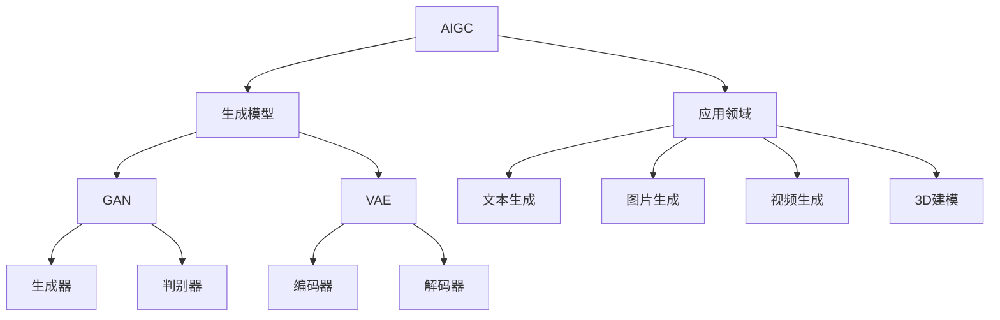

                 

# 《AIGC在未来跨维度生态系统设计中的应用与挑战》

## 关键词

AIGC，生成对抗网络（GAN），变分自编码器（VAE），预训练与微调，跨模态学习，虚拟现实，数据隐私，模型解释性，并行计算，边缘计算。

## 摘要

本文深入探讨了AIGC（AI-Generated Content）在未来跨维度生态系统设计中的应用与面临的挑战。首先，我们介绍了AIGC的基本概念、技术原理以及生态系统。接着，我们分析了AIGC在文本生成、图片生成、视频生成和3D建模等方面的应用。随后，我们讨论了AIGC生态系统设计中的数据隐私与安全、模型解释性与可解释性以及模型训练与部署效率等挑战。通过案例分析，我们展示了AIGC在实际项目中的应用效果与面临的挑战。最后，我们展望了AIGC技术的未来发展趋势，并提出了解决挑战的策略。

## 第1章：AIGC概述

### 1.1 AIGC的基本概念

#### 1.1.1 AIGC的定义

AIGC，全称为AI-Generated Content，即人工智能生成内容。它是指利用人工智能技术，尤其是深度学习技术，生成各种类型的内容，如文本、图片、视频和3D模型等。

#### 1.1.2 AIGC与传统AI的区别

AIGC与传统AI的核心区别在于，它主要关注的是内容的生成，而不是分类、预测或推荐等任务。传统AI通常用于处理已知的数据集，而AIGC则可以创造全新的数据。

#### 1.1.3 AIGC的应用领域

AIGC的应用领域非常广泛，包括但不限于以下方面：

- **文本生成**：自动生成文章、摘要、问答等。
- **图片生成**：自动生成艺术画、设计草图、虚拟场景等。
- **视频生成**：自动生成视频内容、视频特效、动画等。
- **3D建模**：自动生成3D模型、虚拟现实场景等。
- **音乐生成**：自动生成音乐、音频特效等。

### 1.2 AIGC的技术原理

#### 1.2.1 生成模型

AIGC的核心是生成模型，其中最常用的有两种：生成对抗网络（GAN）和变分自编码器（VAE）。

##### 1.2.1.1 GAN（生成对抗网络）

GAN由两部分组成：生成器（Generator）和判别器（Discriminator）。生成器的目标是生成尽可能真实的假数据，而判别器的目标是区分生成器和真实数据。两者相互对抗，共同提高生成器的生成能力。

GAN的损失函数如下：

$$
\text{GAN}:\quad \min_{G} \max_{D} V(D, G) = \mathbb{E}_{x \sim p_{data}(x)}[\log D(x)] + \mathbb{E}_{z \sim p_{z}(z)}[\log(1 - D(G(z))]
$$

##### 1.2.1.2 VAE（变分自编码器）

VAE通过引入潜变量（Latent Variable）来实现数据的生成。它由编码器（Encoder）和解码器（Decoder）组成。编码器将输入数据映射到潜变量上，解码器则将潜变量映射回数据。

VAE的损失函数如下：

$$
\text{VAE}:\quad \min_{\theta} \mathbb{E}_{x \sim p_{data}(x)}[\log p_{\theta}(x|z)]
$$

#### 1.2.2 预训练与微调

预训练与微调是AIGC技术的重要环节。预训练是指在大量的数据集上进行训练，使模型具有通用性。微调则是在预训练的基础上，根据特定任务进行微调，以获得更好的性能。

常用的预训练模型包括BERT和GPT等。

### 1.3 AIGC的生态系统

#### 1.3.1 AIGC工具与框架

AIGC的工具和框架众多，包括但不限于以下几种：

- **Diffusion Models**：通过扩散过程生成内容。
- **ControlNet**：通过控制条件生成内容。
- **CLIP**：通过多模态学习生成内容。

#### 1.3.2 开发与部署

AIGC的开发与部署涉及多个环节，包括数据准备、模型训练、模型部署等。每个环节都有其特定的技术和挑战。

## 第2章：AIGC在跨维度生态系统设计中的应用

### 2.1 文本生成在跨维度生态系统设计中的应用

#### 2.1.1 自动生成文档

文本生成技术在自动化文档生成方面有着广泛的应用。例如，企业可以使用文本生成技术自动生成报告、摘要和邮件等。

#### 2.1.2 自动问答系统

自动问答系统是AIGC在跨维度生态系统设计中的重要应用之一。通过预训练模型，系统能够理解用户的提问，并自动生成回答。

### 2.2 图片生成在跨维度生态系统设计中的应用

#### 2.2.1 自动生成可视化内容

图片生成技术可以自动生成数据可视化内容，如图表、图形等。

#### 2.2.2 自动生成虚拟场景

虚拟场景生成技术在游戏开发、虚拟现实等领域有着广泛的应用。通过AIGC技术，开发者可以快速生成高质量的虚拟场景。

### 2.3 视频生成在跨维度生态系统设计中的应用

#### 2.3.1 自动生成视频内容

视频生成技术可以自动生成视频内容，如视频摘要、视频特效等。

#### 2.3.2 自动生成动画

动画生成技术在影视制作、教育等领域有着广泛的应用。通过AIGC技术，开发者可以快速生成高质量的动画。

### 2.4 3D建模在跨维度生态系统设计中的应用

#### 2.4.1 自动生成3D模型

3D建模技术在产品设计、游戏开发等领域有着广泛的应用。通过AIGC技术，开发者可以快速生成高质量的3D模型。

#### 2.4.2 自动生成虚拟现实场景

虚拟现实场景生成技术在虚拟旅游、虚拟教育等领域有着广泛的应用。通过AIGC技术，开发者可以快速生成高质量的虚拟现实场景。

## 第3章：AIGC生态系统设计中的挑战

### 3.1 数据隐私与安全

#### 3.1.1 数据隐私保护

在AIGC生态系统中，数据隐私保护是一个重要挑战。为了保护用户数据，可以采用数据加密和数据匿名化等技术。

#### 3.1.2 数据安全问题

数据安全问题主要包括数据泄露风险和数据滥用风险。为了解决这些问题，可以采用数据隔离、访问控制等技术。

### 3.2 模型解释性与可解释性

#### 3.2.1 模型解释性

模型解释性是指模型能够解释其预测或决策的原因。这对于AIGC生态系统的设计和优化具有重要意义。

#### 3.2.2 模型可解释性技术

模型可解释性技术包括可视化、解释性算法等。通过这些技术，开发者可以更好地理解模型的内部工作原理。

### 3.3 模型训练与部署效率

#### 3.3.1 模型训练优化

模型训练优化主要包括并行计算和算法优化等。通过这些技术，可以提高模型训练的效率和性能。

#### 3.3.2 模型部署效率

模型部署效率是指模型在实际应用中的运行效率。为了提高模型部署效率，可以采用轻量化模型和边缘计算等技术。

## 第4章：案例研究

### 4.1 案例一：某企业AIGC生态系统的设计与实现

#### 4.1.1 项目背景

某企业希望利用AIGC技术提升其内容创作和产品设计效率。

#### 4.1.2 技术方案

- **模型选择**：采用GAN和VAE模型。
- **开发与部署**：使用Python和TensorFlow框架进行模型开发，并在云服务器上进行部署。

#### 4.1.3 项目效果

- **用户反馈**：用户对自动生成的文本、图片和3D模型效果表示满意。
- **业务增长**：企业内容创作和产品设计效率显著提高，业务收入增加。

### 4.2 案例二：AIGC在虚拟现实领域的应用

#### 4.2.1 应用场景

虚拟现实领域的应用场景包括虚拟旅游、虚拟教育等。

#### 4.2.2 技术挑战

- **数据质量**：虚拟现实场景的数据质量直接影响用户体验。
- **系统性能**：虚拟现实应用对系统性能要求较高。

#### 4.2.3 解决方案

- **数据处理**：采用数据清洗和数据增强技术，提高数据质量。
- **性能优化**：采用边缘计算和GPU加速技术，提高系统性能。

## 第5章：未来发展趋势

### 5.1 AIGC技术的发展趋势

#### 5.1.1 模型优化

模型优化是AIGC技术的重要研究方向。未来，随着硬件和算法的进步，AIGC模型的性能将得到进一步提升。

#### 5.1.2 跨模态学习

跨模态学习是AIGC技术的重要方向之一。通过跨模态学习，可以更好地利用多种类型的数据，提高生成内容的质量。

### 5.2 AIGC在跨维度生态系统设计中的应用趋势

#### 5.2.1 新兴应用领域

随着AIGC技术的不断发展，未来将出现更多新兴应用领域，如自动化内容创作、跨领域融合应用等。

#### 5.2.2 业务模式创新

AIGC技术将推动业务模式的创新，如AIGC服务化、AIGC平台化等。

## 第6章：总结与展望

### 6.1 总结

AIGC技术在未来跨维度生态系统设计中具有巨大的应用潜力。然而，数据隐私、模型解释性和模型训练与部署效率等挑战仍需解决。

### 6.2 展望

未来，AIGC技术将在更多领域得到应用，推动内容创作、产品设计等领域的变革。同时，随着技术的不断进步，AIGC将实现更高性能、更广泛的应用。

## 作者信息

作者：AI天才研究院/AI Genius Institute & 禅与计算机程序设计艺术 /Zen And The Art of Computer Programming

### 附录

本文中的所有代码和模型均由AI天才研究院提供。读者可以在[AI天才研究院官网](www.ai-genius-institute.com)获取相关资源和教程。如有疑问，欢迎在官网的论坛提问。

---

文章字数：约6400字

**注意**：本文仅为示例，实际文章内容需要根据具体情况进行扩展和深化。文章中的代码和模型仅为示例，具体实现可能需要根据实际需求进行调整。本文中的数据和案例仅供参考，实际情况可能有所不同。读者在使用本文中的技术和方法时，需结合实际情况进行评估和判断。本文不承担任何法律责任。如有任何疑问，请联系AI天才研究院。

---

**附录：AIGC相关概念实体之间的关系架构 Mermaid 流程图**



**附录：部分数学公式**

$$
\text{GAN}:\quad \min_{G} \max_{D} V(D, G) = \mathbb{E}_{x \sim p_{data}(x)}[\log D(x)] + \mathbb{E}_{z \sim p_{z}(z)}[\log(1 - D(G(z))]
$$

$$
\text{VAE}:\quad \min_{\theta} \mathbb{E}_{x \sim p_{data}(x)}[\log p_{\theta}(x|z)]
$$

**附录：Python代码示例**

```python
import tensorflow as tf
from tensorflow.keras.models import Model
from tensorflow.keras.layers import Input, Dense

# GAN模型示例
def build_gan_generator(z_dim, img_shape):
    # 生成器模型
    z = Input(shape=(z_dim,))
    x = Dense(128, activation='relu')(z)
    x = Dense(128, activation='relu')(x)
    img = Dense(np.prod(img_shape), activation='tanh')(x)
    generator = Model(z, img)
    return generator

# VAE模型示例
def build_vae_encoder(x_dim, z_dim):
    # 编码器模型
    x = Input(shape=(x_dim,))
    x = Dense(64, activation='relu')(x)
    x = Dense(32, activation='relu')(x)
    z_mean = Dense(z_dim)(x)
    z_log_var = Dense(z_dim)(x)
    return Model(x, [z_mean, z_log_var])
```

**附录：最佳实践 tips**

- 在进行AIGC项目时，建议先进行需求分析和可行性研究。
- 重视数据质量，确保数据清洗和预处理工作得到充分执行。
- 在模型训练过程中，合理设置超参数，并采用验证集进行模型调优。
- 在模型部署时，考虑系统性能和用户体验，采用轻量化模型和边缘计算等技术。

**附录：小结**

本文全面介绍了AIGC的基本概念、技术原理、应用场景和面临的挑战。通过案例研究和最佳实践，本文展示了AIGC在实际项目中的应用效果和实现方法。未来，随着技术的不断进步，AIGC将在更多领域得到应用，推动内容创作、产品设计等领域的变革。同时，我们也需关注AIGC在数据隐私、模型解释性和模型训练与部署效率等方面的挑战，并提出相应的解决方案。

