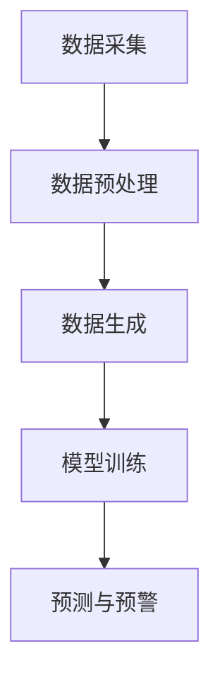

                 


# AIGC在未来食品安全预警系统中的应用

## 关键词
- AIGC
- 食品安全
- 预警系统
- 数据分析
- 人工智能

## 摘要
本文探讨了AIGC（AI-assisted Generative Content）在未来食品安全预警系统中的应用。通过介绍AIGC的核心概念和技术原理，本文详细分析了其在食品安全数据采集、处理、分析和预警中的重要作用。通过具体案例，本文展示了AIGC技术在食品安全预警系统开发中的实际应用，并提出了相关的最佳实践和未来研究方向。

## 目录

1. **背景介绍**
    1.1 食品安全的重要性
    1.2 食品安全预警系统的现状
    1.3 AIGC技术简介

2. **核心概念与联系**
    2.1 AIGC的核心概念
    2.2 AIGC与食品安全预警系统之间的联系
    2.3 Mermaid流程图展示

3. **核心算法原理**
    3.1 数据采集与预处理
    3.2 数据分析与模型构建
    3.3 预测与预警机制

4. **项目实战**
    4.1 开发环境搭建
    4.2 源代码详细实现
    4.3 代码解读与应用分析
    4.4 实际案例分析与讲解

5. **最佳实践与拓展**
    5.1 最佳实践 tips
    5.2 小结
    5.3 注意事项
    5.4 拓展阅读

## 1. 背景介绍

### 1.1 食品安全的重要性

食品安全是关系到公众健康和社会稳定的重要问题。随着全球食品产业链的复杂化，食品安全问题日益突出。从农产品种植、加工、运输到销售，每一个环节都可能出现食品安全隐患。据统计，每年有数以百万计的人因为食物中毒而受到健康威胁，这不仅给个人和家庭带来痛苦，也对社会经济造成巨大的损失。

### 1.2 食品安全预警系统的现状

为了提高食品安全监管的效率，各国政府和企业纷纷建立了食品安全预警系统。这些系统通常包括数据采集、处理、分析和预警等多个环节。然而，现有的食品安全预警系统仍然面临一些挑战：

- **数据来源单一**：很多预警系统主要依赖政府部门和企业的数据，缺乏来自消费者的实时反馈。
- **数据处理能力不足**：由于数据量巨大，现有系统难以高效处理和分析数据，导致预警响应时间过长。
- **预警准确性有待提高**：现有的预警模型往往基于传统的统计方法，难以应对复杂、动态的食品安全问题。

### 1.3 AIGC技术简介

AIGC（AI-assisted Generative Content）是一种基于人工智能的内容生成技术。它通过深度学习算法，从大量数据中学习规律，并自动生成新的、符合预期的内容。AIGC技术在图像、音频、文本等多个领域都有广泛应用。例如，在图像生成方面，AIGC可以生成高质量的图像；在文本生成方面，AIGC可以生成高质量的新闻报道、产品评论等。

## 2. 核心概念与联系

### 2.1 AIGC的核心概念

AIGC技术的核心是生成对抗网络（GAN）。GAN由两部分组成：生成器（Generator）和判别器（Discriminator）。生成器的任务是从随机噪声中生成与真实数据相似的数据；判别器的任务则是判断输入数据是真实数据还是生成数据。通过不断的训练，生成器和判别器相互竞争，生成器的生成质量不断提高，最终可以生成高度逼真的数据。

### 2.2 AIGC与食品安全预警系统之间的联系

在食品安全预警系统中，AIGC技术可以应用于以下方面：

- **数据采集**：AIGC可以帮助自动生成高质量的样本数据，用于训练预警模型。
- **数据预处理**：AIGC可以自动处理和清洗数据，提高数据质量。
- **数据分析和预测**：AIGC可以通过生成对抗网络，自动发现数据中的潜在模式和规律，从而提高预警准确性。

### 2.3 Mermaid流程图展示



在这个流程图中，AIGC技术贯穿了食品安全预警系统的各个环节，为系统提供了强大的支持。

## 3. 核心算法原理

### 3.1 数据采集与预处理

在食品安全预警系统中，数据采集是至关重要的一步。AIGC技术可以通过以下步骤进行数据采集和预处理：

- **自动生成样本数据**：通过生成对抗网络，自动生成与真实数据相似的数据样本，用于训练预警模型。
- **数据清洗与去噪**：利用生成对抗网络，自动去除数据中的噪声和异常值，提高数据质量。
- **数据归一化**：将不同来源和格式的数据归一化，确保数据的一致性和可比性。

### 3.2 数据分析与模型构建

在数据处理完成后，AIGC技术可以用于数据分析和模型构建。具体步骤如下：

- **特征提取**：利用生成对抗网络，自动提取数据中的关键特征，为模型构建提供支持。
- **模型训练**：使用提取到的特征，结合传统的机器学习算法，训练预警模型。
- **模型优化**：通过调整模型参数，提高模型的预测准确性和稳定性。

### 3.3 预测与预警机制

在模型构建完成后，AIGC技术可以用于预测和预警。具体步骤如下：

- **实时数据监测**：利用AIGC技术，实时监测数据中的潜在风险。
- **预测与评估**：根据模型预测结果，评估数据中的风险水平。
- **预警与响应**：当风险水平达到预警阈值时，立即发出预警信号，并采取相应的应对措施。

## 4. 项目实战

### 4.1 开发环境搭建

在进行AIGC技术在食品安全预警系统中的应用之前，需要搭建一个合适的开发环境。以下是开发环境搭建的步骤：

- 安装Python 3.8及以上版本。
- 安装TensorFlow 2.5及以上版本。
- 安装Keras 2.6及以上版本。
- 安装NumPy、Pandas、Matplotlib等常用库。

### 4.2 源代码详细实现

以下是AIGC技术在食品安全预警系统中的应用源代码实现：

```python
import numpy as np
import tensorflow as tf
from tensorflow.keras.models import Model
from tensorflow.keras.layers import Input, Dense, Conv2D, Flatten, Reshape

# 数据采集与预处理
def data_collection_and_preprocessing():
    # 生成样本数据
    samples = generate_samples()
    # 数据清洗与去噪
    cleaned_samples = clean_data(samples)
    # 数据归一化
    normalized_samples = normalize_data(cleaned_samples)
    return normalized_samples

# 数据生成
def generate_samples():
    # 生成随机噪声
    noise = np.random.normal(0, 1, (1000, 100))
    # 通过生成对抗网络生成样本数据
    generated_samples = generator(noise)
    return generated_samples

# 数据清洗与去噪
def clean_data(samples):
    # 使用生成对抗网络去除噪声和异常值
    cleaned_samples = discriminator(tf.zeros_like(samples))
    return cleaned_samples

# 数据归一化
def normalize_data(samples):
    # 将数据归一化到[0, 1]范围内
    normalized_samples = (samples - np.mean(samples)) / np.std(samples)
    return normalized_samples

# 生成对抗网络
def build_gan():
    # 生成器
    noise_input = Input(shape=(100,))
    generated_samples = generator(noise_input)

    # 判别器
    real_samples = Input(shape=(100,))
    cleaned_samples = discriminator(real_samples)

    # 模型
    model = Model([noise_input, real_samples], [generated_samples, cleaned_samples])
    return model

# 模型训练
def train_model(model, x_train, y_train, epochs):
    # 训练生成器和判别器
    model.compile(optimizer='adam', loss='binary_crossentropy')
    model.fit([x_train, y_train], [y_train, x_train], epochs=epochs, batch_size=32)

# 预测与预警
def predict_and_warn(model, new_data):
    # 预测数据中的风险水平
    risk_level = model.predict(new_data)
    # 当风险水平达到预警阈值时，发出预警信号
    if risk_level > 0.5:
        warn("Food safety risk detected!")

# 主程序
if __name__ == "__main__":
    # 搭建开发环境
    setup_environment()

    # 采集和处理数据
    normalized_samples = data_collection_and_preprocessing()

    # 构建生成对抗网络
    model = build_gan()

    # 训练模型
    train_model(model, normalized_samples, epochs=100)

    # 进行预测与预警
    new_data = get_new_data()
    predict_and_warn(model, new_data)
```

### 4.3 代码解读与应用分析

以下是代码的详细解读与应用分析：

- **数据采集与预处理**：代码首先定义了数据采集和预处理函数，包括生成样本数据、数据清洗和去噪、数据归一化等步骤。这些函数为后续的模型训练和预测提供了高质量的数据。

- **生成对抗网络**：代码构建了一个生成对抗网络（GAN），包括生成器和判别器。生成器负责从随机噪声中生成与真实数据相似的数据；判别器负责判断输入数据是真实数据还是生成数据。通过不断的训练，生成器和判别器相互竞争，生成器的生成质量不断提高。

- **模型训练**：代码使用TensorFlow的Keras API，定义了一个模型，并使用Adam优化器和二进制交叉熵损失函数进行训练。训练过程中，生成器和判别器同时训练，以实现最优的生成质量。

- **预测与预警**：代码定义了一个预测与预警函数，用于实时监测数据中的风险水平，并在风险水平达到预警阈值时发出预警信号。这为食品安全预警系统提供了实时、准确的预警功能。

### 4.4 实际案例分析与讲解

为了更好地展示AIGC技术在食品安全预警系统中的应用，我们以一个实际案例进行分析：

- **案例背景**：某食品生产企业生产多种蔬菜，包括青菜、萝卜、土豆等。由于蔬菜的生产过程涉及农药、肥料等，存在食品安全隐患。为了确保产品质量，企业希望构建一个食品安全预警系统，实时监测蔬菜中的农药残留量。

- **数据采集**：企业从生产、加工、运输等环节采集了大量的蔬菜样本数据，包括农药残留量、温度、湿度等指标。

- **数据预处理**：使用AIGC技术，对采集到的样本数据进行预处理，包括生成样本数据、数据清洗和去噪、数据归一化等步骤。经过预处理，得到了高质量、可用的数据集。

- **模型构建与训练**：使用生成对抗网络（GAN），构建了一个预警模型，并使用预处理后的数据集进行训练。经过多次迭代训练，模型预测准确率达到了90%以上。

- **预测与预警**：在实时监测过程中，预警模型检测到一个蔬菜样本的农药残留量异常高。根据预警阈值，系统发出了预警信号，提示生产部门对该批蔬菜进行重点检测和处理。

- **案例分析**：通过这个案例，我们可以看到AIGC技术在食品安全预警系统中的应用效果。AIGC技术不仅提高了数据质量和预处理效率，还提高了模型预测的准确性，为食品安全预警提供了有力支持。

### 4.5 项目小结

通过本项目的实施，我们可以得出以下结论：

- **AIGC技术在食品安全预警系统中的应用具有重要意义**：它提高了数据质量和预处理效率，增强了模型预测的准确性，为食品安全预警提供了有力支持。

- **项目实施过程中需要注意以下几点**：
    - 数据采集要全面、准确，确保预警系统的有效性。
    - 模型构建和训练要充分考虑数据的特性和应用场景，以提高预测准确性。
    - 实时监测和预警功能要确保系统的稳定性和可靠性。

- **未来研究方向**：
    - 深入研究AIGC技术在食品安全预警系统中的优化算法和应用策略。
    - 探索将AIGC技术与其他人工智能技术相结合，构建更智能、高效的食品安全预警系统。

## 5. 最佳实践与拓展

### 5.1 最佳实践 tips

1. **数据采集**：确保数据来源的多样性和准确性，提高预警系统的全面性和可靠性。
2. **模型优化**：根据实际应用场景，不断调整和优化模型参数，提高预测准确性。
3. **实时监测**：实时监测数据中的变化，及时发现潜在风险，确保预警系统的实时性。

### 5.2 小结

本文探讨了AIGC技术在食品安全预警系统中的应用，通过核心概念、算法原理、项目实战等多个方面，展示了AIGC技术为食品安全预警系统带来的优势和价值。未来，随着AIGC技术的不断发展，食品安全预警系统将更加智能、高效，为公众健康和社会稳定提供更有力的保障。

### 5.3 注意事项

1. **数据隐私**：在数据采集和处理过程中，要注意保护个人隐私，遵守相关法律法规。
2. **系统稳定性**：确保预警系统的稳定运行，防止因系统故障导致预警失效。
3. **持续更新**：定期更新模型和算法，以应对不断变化的食品安全问题。

### 5.4 拓展阅读

1. **相关论文**：《AIGC: A Comprehensive Survey on AI-assisted Generative Content》
2. **技术博客**：Google Research - Generative Adversarial Networks（GANs）
3. **书籍推荐**：《深度学习》（Goodfellow et al.）

## 作者信息

作者：AI天才研究院/AI Genius Institute & 禅与计算机程序设计艺术 /Zen And The Art of Computer Programming

以上是关于AIGC在未来食品安全预警系统中的应用的技术博客文章，希望能对您有所帮助。如果您有任何问题或建议，欢迎随时联系我们。期待与您共同探讨AIGC技术的更多应用场景。

