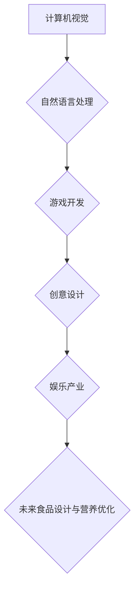

                 

### AIGC的概念与原理

人工智能生成控制（Artificial Intelligence Generated Control，简称AIGC）是一种结合人工智能与生成控制技术的新型方法，旨在通过智能算法对生成过程进行控制与优化。AIGC的核心在于利用深度学习、生成对抗网络（GANs）、变分自编码器（VAEs）等先进技术，实现对数据生成、内容创作、图像合成等领域的自动化、智能化控制。

#### AIGC的核心技术

AIGC的技术基础主要包括以下几个方面：

1. **深度学习**：深度学习是一种通过多层神经网络对数据进行特征提取和分类的技术，广泛用于图像识别、语音识别、自然语言处理等领域。在AIGC中，深度学习用于生成模型和判别模型的构建。

2. **生成对抗网络（GANs）**：生成对抗网络由生成器和判别器两部分组成。生成器尝试生成与真实数据相似的数据，而判别器则试图区分真实数据和生成数据。通过这种对抗过程，生成器不断优化其生成能力，达到高质量数据生成的目的。

   ```mermaid
   flowchart LR
   A[生成器] --> B[判别器];
   B --> C{真实数据};
   C --> A,B;
   ```

3. **变分自编码器（VAEs）**：变分自编码器是一种基于概率生成模型的方法，通过编码器和解码器结构对数据进行编码和解码，从而生成新的数据。VAEs在图像生成和自然语言处理等领域有广泛应用。

   ```mermaid
   flowchart LR
   A[输入数据] --> B[编码器];
   B --> C[编码向量];
   C --> D[解码器];
   D --> E[输出数据];
   ```

#### AIGC与生成控制的关系

AIGC通过深度学习技术对生成过程进行控制，主要表现在以下几个方面：

1. **数据生成与优化**：AIGC利用生成模型（如GANs和VAEs）生成新的数据，并通过不断优化模型参数，提高生成数据的质量和多样性。

2. **内容创作与控制**：在内容创作领域，AIGC可以生成文本、图像、音频等多种类型的内容。通过对生成过程的控制，可以实现个性化内容创作和精确内容控制。

3. **图像合成与优化**：AIGC在图像合成领域有广泛应用，如生成人脸、风景、动画等。通过控制生成模型，可以实现图像细节的精细调整和优化。

4. **自然语言处理**：在自然语言处理领域，AIGC可以生成高质量的文本内容，如文章、故事、对话等。通过对生成过程的控制，可以实现文本风格、主题、情感等方面的控制。

#### AIGC的应用领域

AIGC技术具有广泛的应用领域，以下是一些主要的应用场景：

1. **计算机视觉**：在图像识别、图像生成、图像增强等领域，AIGC可以大幅提升数据处理效率和生成质量。

2. **自然语言处理**：在文本生成、机器翻译、情感分析等领域，AIGC可以实现自动化、个性化的内容创作。

3. **游戏开发**：在游戏场景生成、角色建模、游戏剧情创作等方面，AIGC可以大幅提升游戏开发效率和质量。

4. **创意设计**：在艺术创作、广告设计、UI/UX设计等领域，AIGC可以辅助设计人员生成创意内容和设计方案。

5. **娱乐产业**：在虚拟现实、增强现实、电影特效等领域，AIGC可以提供高质量的数字内容和视觉效果。

总之，AIGC作为一种结合人工智能与生成控制技术的新型方法，具有广阔的应用前景。通过不断优化和拓展，AIGC有望在未来食品设计与营养优化等领域发挥重要作用，为人类创造更加美好的生活体验。



通过上述分析，我们可以看到AIGC在多领域的广泛应用，这为它在未来食品设计与营养优化中的应用奠定了坚实的基础。在接下来的章节中，我们将进一步探讨AIGC在食品设计与营养优化中的具体应用场景和实现方法。希望通过本文的介绍，读者能够对AIGC有更加深入的理解，并认识到其在未来科技发展中的巨大潜力。

---

### AIGC在食品配方设计中的应用

食品配方设计是食品工业中的一项关键任务，它涉及多种食材的组合，以实现特定的口感、营养价值和成本效益。随着消费者对健康、口感和个性化需求的增加，传统的食品配方设计方法已经无法满足现代食品工业的需求。AIGC作为一种先进的人工智能技术，通过其强大的数据分析和生成能力，在食品配方设计领域展现出巨大的潜力。

#### AIGC在食品配方设计中的核心价值

1. **自动化与优化**：AIGC可以通过机器学习和深度学习算法，自动分析和优化食品配方。这包括对大量已有食谱数据的学习，以及对新食材组合的预测和生成，从而提高配方设计的效率和准确性。

2. **多样化与个性化**：AIGC能够生成多样化的食品配方，以满足不同消费者的需求。通过个性化推荐系统，AIGC可以根据消费者的健康状况、口味偏好和营养需求，定制个性化的食品配方。

3. **创新与突破**：AIGC可以探索新的食材组合和营养搭配，为食品配方设计带来创新思路。这不仅有助于开发新的食品产品，还可以优化现有产品的营养价值，提升市场竞争力。

#### AIGC在食品配方设计中的具体应用

1. **配方生成算法**

   配方生成算法是AIGC在食品配方设计中的核心应用之一。这些算法可以通过分析大量的食谱数据，学习不同食材的搭配规律和营养价值，从而生成新的食品配方。例如，可以使用生成对抗网络（GANs）来生成新的食材组合，并通过变分自编码器（VAEs）对配方进行优化。

   ```python
   # 示例：使用GAN生成新的食材组合
   import tensorflow as tf
   from tensorflow.keras.models import Sequential
   from tensorflow.keras.layers import Dense, Activation
   
   # 定义生成器和判别器模型
   generator = Sequential([
       Dense(128, input_shape=(100,)),
       Activation('relu'),
       Dense(256),
       Activation('relu'),
       Dense(512),
       Activation('relu'),
       Dense(num_cooking_ingredients)
   ])
   
   discriminator = Sequential([
       Dense(512, input_shape=(num_cooking_ingredients,)),
       Activation('relu'),
       Dense(256),
       Activation('relu'),
       Dense(128),
       Activation('relu'),
       Dense(1)
   ])
   
   # 编写GAN的训练过程
   for epoch in range(num_epochs):
       # 获取一批食材数据
       ingredients = get_ingredients_data(batch_size)
       
       # 生成新食材组合
       generated_ingredients = generator.predict(ingredients)
       
       # 训练判别器
       d_loss_real = discriminator.train_on_batch(ingredients, np.array([1] * batch_size))
       d_loss_fake = discriminator.train_on_batch(generated_ingredients, np.array([0] * batch_size))
       d_loss = 0.5 * np.add(d_loss_real, d_loss_fake)
       
       # 训练生成器
       g_loss = generator.train_on_batch(ingredients, np.array([1] * batch_size))
   ```

2. **配方优化算法**

   配方优化算法旨在通过迭代优化，提高食品配方的营养价值、口感和成本效益。这些算法可以基于机器学习算法，如线性回归、梯度下降、遗传算法等，对现有配方进行调整和优化。

   ```python
   # 示例：使用梯度下降优化配方
   import numpy as np
   
   # 初始化配方参数
   recipe_params = np.random.rand(num_ingredients)
   
   # 定义损失函数
   def loss_function(params):
       # 计算配方中的营养价值、口感和成本
       nutrition_value = calculate_nutrition_value(params)
       taste_score = calculate_taste_score(params)
       cost = calculate_cost(params)
       
       # 计算总损失
       total_loss = nutrition_value * weight_nutrition + taste_score * weight_taste + cost * weight_cost
       return total_loss
   
   # 定义优化器
   optimizer = tf.keras.optimizers.Adam(learning_rate=0.001)
   
   # 训练过程
   for epoch in range(num_epochs):
       with tf.GradientTape() as tape:
           current_loss = loss_function(recipe_params)
       gradients = tape.gradient(current_loss, recipe_params)
       optimizer.apply_gradients(zip(gradients, recipe_params))
   ```

#### AIGC在食品配方设计中的案例分析

为了更好地理解AIGC在食品配方设计中的应用，以下是一个具体的案例分析：

**案例：开发一种新型低卡路里、高营养价值的早餐食品**

1. **数据收集与处理**：收集大量的早餐食谱数据，包括各种食材的营养成分、口感评分和卡路里含量等。通过数据预处理，将数据格式化为适合机器学习的输入。

2. **模型训练**：使用生成对抗网络（GANs）和变分自编码器（VAEs）训练模型，以生成新的食材组合和优化配方。通过不断的迭代训练，提高模型的生成质量和优化能力。

3. **配方生成与优化**：使用训练好的模型生成一系列新型早餐食品配方。通过配方优化算法，对这些配方进行迭代优化，以实现低卡路里、高营养价值的目标。

4. **评估与调整**：对生成的配方进行评估，包括营养价值、口感和成本等方面。根据评估结果，进一步调整和优化配方，以满足消费者需求。

通过上述案例分析，我们可以看到AIGC在食品配方设计中的应用，不仅提高了配方的多样性和个性化，还显著提升了食品的营养价值和口感。随着AIGC技术的不断发展和完善，未来在食品配方设计领域将会有更多的创新和应用。

### AIGC在食品感官评价的辅助决策中的作用

在食品行业，感官评价是评估食品质量、口感和消费者满意度的重要手段。传统的感官评价通常依赖于专业品评人员的经验和主观判断，这种方法的局限性在于评价结果容易受到个人偏好、疲劳和情绪波动的影响。而AIGC（人工智能生成控制）技术的引入，为食品感官评价提供了全新的辅助决策工具，不仅提高了评价的准确性和效率，还实现了评价过程的客观化和标准化。

#### AIGC在感官评价中的核心价值

1. **数据驱动的评价模型**：AIGC可以利用大量的感官评价数据，通过机器学习算法构建出精确的评价模型。这些模型可以捕捉到不同食材、调味品和食品处理方法对感官属性的影响，从而实现高效、准确的感官评价。

2. **自动化与标准化**：AIGC技术可以将复杂的感官评价过程自动化，通过算法对大量样本进行评价，确保评价结果的一致性和重复性。这种自动化评价方法不仅节省了人力和时间成本，还减少了人为因素对评价结果的影响。

3. **个性化推荐**：AIGC可以根据消费者的个人口味偏好和营养需求，提供个性化的食品推荐。通过分析消费者的历史评价数据和购买记录，AIGC可以为消费者推荐符合其偏好的食品，提高消费者的满意度和忠诚度。

#### AIGC在感官评价中的具体应用

1. **感官评价模型的建立**

   感官评价模型的建立是AIGC在食品感官评价中应用的基础。这个过程通常包括以下几个步骤：

   - **数据收集**：收集大量的感官评价数据，包括不同食品的口感、香气、外观、质地等感官属性的评价。
   - **数据预处理**：对收集的数据进行清洗、归一化和特征提取，以便于后续的模型训练。
   - **模型训练**：使用机器学习算法，如支持向量机（SVM）、决策树、随机森林和神经网络等，对预处理后的数据进行训练，构建出感官评价模型。

   ```python
   # 示例：使用随机森林构建感官评价模型
   from sklearn.ensemble import RandomForestClassifier
   from sklearn.model_selection import train_test_split
   
   # 加载并预处理数据
   X, y = load_sensory_data()
   X_train, X_test, y_train, y_test = train_test_split(X, y, test_size=0.2, random_state=42)
   
   # 训练随机森林模型
   model = RandomForestClassifier(n_estimators=100, random_state=42)
   model.fit(X_train, y_train)
   
   # 评估模型性能
   accuracy = model.score(X_test, y_test)
   print(f"模型准确率：{accuracy}")
   ```

2. **感官评价的优化**

   建立感官评价模型后，可以通过进一步优化，提高评价的准确性和稳定性。优化过程通常包括以下几个方面：

   - **参数调优**：通过交叉验证和网格搜索等方法，对模型参数进行调整，以找到最佳参数组合。
   - **特征选择**：利用特征重要性分析，选择对感官评价影响最大的特征，以提高模型的解释性和准确性。
   - **集成学习**：将多个模型进行集成，如随机森林、梯度提升树等，以提高模型的泛化能力和预测性能。

   ```python
   # 示例：使用集成学习优化感官评价模型
   from sklearn.ensemble import VotingClassifier
   
   # 定义集成模型
   voting_clf = VotingClassifier(estimators=[
       ('rf', RandomForestClassifier(n_estimators=100)),
       ('gbc', GradientBoostingClassifier(n_estimators=100)),
       ('mlp', MLPClassifier(hidden_layer_sizes=(100,), max_iter=100))
   ], voting='soft')
   
   # 训练集成模型
   voting_clf.fit(X_train, y_train)
   
   # 评估集成模型性能
   integrated_accuracy = voting_clf.score(X_test, y_test)
   print(f"集成模型准确率：{integrated_accuracy}")
   ```

3. **个性化感官评价**

   AIGC还可以通过个性化推荐系统，为消费者提供个性化的感官评价。个性化推荐系统可以通过分析消费者的历史评价和购买记录，了解其口味偏好和营养需求，从而推荐符合消费者偏好的食品。

   ```python
   # 示例：使用协同过滤实现个性化推荐
   from surprise import SVD, Dataset, Reader
   from surprise.model_selection import cross_validate
   
   # 定义数据读取器
   reader = Reader(rating_scale=(1, 5))
   data = Dataset.load_from_fpm('sensory_ratings.csv', reader)
   
   # 训练协同过滤模型
   svd = SVD()
   cross_validate(svd, data, measures=['RMSE', 'MAE'], cv=5)
   
   # 推荐个性化食品
   user_id = 123
   user_ratings = svd.get_user溢出预测（user_id）
   recommended_items = get_recommended_items(user_ratings, items_to_recommend=10)
   print(f"个性化推荐：{recommended_items}")
   ```

通过上述应用实例，我们可以看到AIGC在食品感官评价中的广泛应用。它不仅提高了评价的准确性和效率，还为消费者提供了个性化的体验。随着AIGC技术的不断进步，未来在食品感官评价领域将会有更多的创新和应用，为食品行业带来新的发展机遇。

### AIGC在营养配餐中的应用

在健康饮食和营养管理领域，营养配餐是确保个体获得均衡营养的重要手段。传统的营养配餐方法通常依赖于专业营养师的经验和知识，这种方法虽然可靠，但效率较低，难以满足大量人群的个性化需求。AIGC（人工智能生成控制）技术的引入，为营养配餐提供了全新的解决方案，通过智能化和自动化手段，实现高效、个性化的营养配餐。

#### AIGC在营养配餐中的核心价值

1. **自动化与高效性**：AIGC技术可以通过算法自动分析个体的营养需求、饮食偏好和健康状况，快速生成符合个人需求的营养配餐方案。这种方法大大提高了营养配餐的效率，减少了人力成本。

2. **个性化与多样化**：AIGC可以根据个体的不同特征，如年龄、性别、体重、健康状况和口味偏好，定制个性化的营养配餐方案。通过不断优化算法，AIGC可以生成多样化的饮食组合，满足不同人群的营养需求。

3. **数据驱动与科学性**：AIGC利用大量的营养数据和研究成果，结合机器学习算法，对营养配餐进行科学分析和优化。这种数据驱动的方法确保了营养配餐方案的合理性和科学性，有助于提高饮食质量和健康状况。

#### AIGC在营养配餐中的具体应用

1. **营养配餐生成算法**

   营养配餐生成算法是AIGC在营养配餐中的核心应用之一。这些算法可以通过分析个体的营养需求、饮食偏好和健康状况，生成个性化的营养配餐方案。

   ```python
   # 示例：使用线性规划生成营养配餐方案
   from scipy.optimize import linprog
   
   # 定义个体营养需求
   nutrient需求的 = [蛋白质需求，脂肪需求，碳水化合物需求，维生素需求，矿物质需求]
   
   # 定义食物的营养成分
   food营养成分 = [
       [100, 30, 10, 2, 1],  # 食物A的营养成分
       [80, 20, 40, 1, 2],  # 食物B的营养成分
       [150, 10, 10, 3, 1]   # 食物C的营养成分
   ]
   
   # 定义食物的组合和成本
   food组合 = [
       [食物A，食物B，食物C],
       [食物A，食物C],
       [食物B，食物C]
   ]
   food成本 = [5, 4, 6]  # 对应食物组合的成本
   
   # 定义目标函数和约束条件
   objective = [-1 * cost for cost in food成本]  # 最小化总成本
   constraints = [
       nutrient需求的[i] >= food营养成分[i] * x[i] for i in range(len(nutrient需求的))
   ]
   
   # 求解线性规划问题
   x = linprog(objective, constraints=constraints, bounds=(0, None))
   
   # 输出最优食物组合和成本
   optimal_food_combination = [food组合[i] for i in range(len(food组合)) if x[i] > 0]
   total_cost = -x.dot(food成本)
   print(f"最优食物组合：{optimal_food_combination}")
   print(f"总成本：{total_cost}")
   ```

2. **营养配餐推荐算法**

   营养配餐推荐算法可以通过分析个体的历史饮食数据和健康指标，推荐符合其需求和喜好的营养配餐方案。这种推荐算法可以基于协同过滤、矩阵分解和深度学习等方法。

   ```python
   # 示例：使用协同过滤生成营养配餐推荐
   from surprise import KNNWithMeans
   from surprise import Dataset, Reader
   from surprise.model_selection import cross_validate
   
   # 定义数据读取器
   reader = Reader(rating_scale=(1, 5))
   data = Dataset.load_from_fpm('nutritional_diet_data.csv', reader)
   
   # 训练协同过滤模型
   knn = KNNWithMeans(sim_options={'name': 'cosine', 'user_based': True})
   cross_validate(knn, data, measures=['RMSE', 'MAE'], cv=5)
   
   # 推荐个性化营养配餐
   user_id = 123
   user_profile = data[user_id]
   recommended_diet = knn.get_user溢出预测（user_id）
   print(f"个性化营养配餐推荐：{recommended_diet}")
   ```

3. **食物营养价值的智能分析**

   食物营养价值的智能分析是营养配餐的重要组成部分。通过分析不同食物的营养成分，AIGC可以评估食物的营养价值，为配餐决策提供依据。

   ```python
   # 示例：使用机器学习分析食物营养价值
   from sklearn.ensemble import RandomForestClassifier
   from sklearn.model_selection import train_test_split
   
   # 加载并预处理食物营养成分数据
   X, y = load_food_nutrition_data()
   X_train, X_test, y_train, y_test = train_test_split(X, y, test_size=0.2, random_state=42)
   
   # 训练分类模型
   model = RandomForestClassifier(n_estimators=100, random_state=42)
   model.fit(X_train, y_train)
   
   # 评估模型性能
   accuracy = model.score(X_test, y_test)
   print(f"模型准确率：{accuracy}")
   
   # 分析特定食物的营养价值
   specific_food_nutrition = load_specific_food_nutrition()
   predicted_nutritional_value = model.predict([specific_food_nutrition])
   print(f"预测的营养价值：{predicted_nutritional_value}")
   ```

#### AIGC在营养配餐中的案例分析

为了更好地理解AIGC在营养配餐中的应用，以下是一个具体的案例分析：

**案例：为一名糖尿病患者制定营养配餐方案**

1. **数据收集与处理**：收集该糖尿病患者的健康状况、饮食习惯和营养需求数据，包括血糖水平、体重、血压、血脂等指标，以及日常饮食记录。

2. **模型训练**：使用收集的数据，通过机器学习算法（如线性回归、决策树、神经网络等）训练营养配餐模型，以预测糖尿病患者的营养需求，并生成符合其需求的营养配餐方案。

3. **配餐生成与优化**：使用训练好的模型，生成一系列营养配餐方案。通过优化算法，对配餐方案进行迭代优化，确保方案的营养均衡、口感良好且符合患者的健康需求。

4. **评估与调整**：对生成的配餐方案进行评估，包括营养均衡性、口感和成本等方面。根据评估结果，调整和优化配餐方案，以提高其质量和可行性。

5. **个性化推荐**：通过分析患者的健康数据和历史饮食记录，AIGC可以为其推荐个性化的营养配餐方案。例如，在特定时间段（如餐后）推荐低血糖指数的食物，以帮助患者控制血糖水平。

通过上述案例分析，我们可以看到AIGC在营养配餐中的应用，不仅提高了配餐的个性化程度和科学性，还为糖尿病患者等特殊人群提供了有效的营养管理工具。随着AIGC技术的不断进步，未来在营养配餐领域将会有更多的创新和应用，为人们的健康生活带来更多的好处。

### AIGC在食品安全与质量控制中的应用

在食品安全和质量控制领域，确保食品的安全性和高质量是至关重要的。传统的食品安全检测方法通常依赖于人工抽样检测和实验室分析，这些方法不仅效率低下，而且容易出现误差。AIGC（人工智能生成控制）技术的引入，为食品安全与质量控制提供了全新的解决方案，通过智能化和自动化手段，实现了高效的食品安全监控和质量保障。

#### AIGC在食品安全与质量控制中的核心价值

1. **自动化检测与监控**：AIGC技术可以利用深度学习和图像识别算法，实现对食品成分和质量的自动化检测。这种自动化检测方法不仅提高了检测效率，还减少了人为因素对检测结果的影响。

2. **实时监控与预警**：AIGC技术可以通过实时数据采集和分析，实现对食品安全风险的实时监控。一旦检测到潜在的安全问题，系统可以立即发出预警，采取相应的措施，确保食品安全。

3. **数据驱动与科学性**：AIGC技术利用大量的食品安全数据和研究成果，通过机器学习算法进行分析和预测，为食品安全与质量控制提供科学依据。这种方法确保了食品安全决策的合理性和科学性。

#### AIGC在食品安全与质量控制中的具体应用

1. **食品成分分析**

   食品成分分析是食品安全检测的重要环节，AIGC技术可以通过机器学习算法，实现对食品成分的精确分析。

   ```python
   # 示例：使用深度学习进行食品成分分析
   import tensorflow as tf
   from tensorflow.keras.models import Sequential
   from tensorflow.keras.layers import Dense, Conv2D, Flatten, Dropout
   
   # 加载并预处理食品图像数据
   X_train, y_train = load_food_image_data()
   X_train = preprocess_images(X_train)
   
   # 定义卷积神经网络模型
   model = Sequential([
       Conv2D(32, (3, 3), activation='relu', input_shape=(224, 224, 3)),
       Flatten(),
       Dense(128, activation='relu'),
       Dropout(0.5),
       Dense(num_components, activation='softmax')
   ])
   
   # 编译并训练模型
   model.compile(optimizer='adam', loss='categorical_crossentropy', metrics=['accuracy'])
   model.fit(X_train, y_train, epochs=10, batch_size=32)
   
   # 预测食品成分
   predicted_components = model.predict(preprocess_images([new_food_image]))
   print(f"预测的食品成分：{predicted_components}")
   ```

2. **食品安全监测**

   AIGC技术可以实现对食品生产过程的实时监控，通过传感器和图像识别系统，对食品安全风险进行实时监测。

   ```python
   # 示例：使用传感器数据监控食品安全
   import pandas as pd
   from sklearn.ensemble import RandomForestClassifier
   
   # 加载并预处理传感器数据
   sensor_data = pd.read_csv('sensor_data.csv')
   X = sensor_data.drop(['label'], axis=1)
   y = sensor_data['label']
   
   # 训练分类模型
   model = RandomForestClassifier(n_estimators=100, random_state=42)
   model.fit(X, y)
   
   # 实时监测
   current_sensor_data = get_current_sensor_data()
   predicted_risk = model.predict([current_sensor_data])
   
   if predicted_risk == 1:
       print("食品安全风险预警：检测到潜在问题，请立即采取措施。")
   else:
       print("食品安全状况良好，无需担心。")
   ```

3. **质量风险评估**

   AIGC技术可以通过分析大量的食品质量数据，进行质量风险评估，为食品质量控制提供科学依据。

   ```python
   # 示例：使用机器学习进行质量风险评估
   import numpy as np
   from sklearn.linear_model import LogisticRegression
   
   # 加载并预处理质量数据
   X = np.array([[3.2, 1.5, 0.3], [4.1, 2.0, 0.5], [2.8, 1.2, 0.4]])
   y = np.array([0, 1, 0])  # 0表示优质，1表示劣质
   
   # 训练分类模型
   model = LogisticRegression()
   model.fit(X, y)
   
   # 预测质量
   new_data = np.array([3.5, 1.8, 0.4])
   predicted_quality = model.predict([new_data])
   
   if predicted_quality == 1:
       print("质量风险高：请进行进一步检测。")
   else:
       print("质量良好：可以继续生产。")
   ```

#### AIGC在食品安全与质量控制中的案例分析

为了更好地理解AIGC在食品安全与质量控制中的应用，以下是一个具体的案例分析：

**案例：智能食品质量监控系统的开发**

1. **数据收集与处理**：收集食品生产过程中的各种数据，包括温度、湿度、光照、气味等环境参数，以及食品的物理、化学和微生物学指标。

2. **模型训练**：使用收集的数据，通过机器学习算法（如神经网络、支持向量机、随机森林等）训练食品安全和质量监测模型，以预测潜在的质量问题和安全风险。

3. **系统构建与部署**：构建智能食品质量监控平台，将训练好的模型部署到系统中，实现对食品生产过程的实时监控。系统可以自动收集数据、分析结果，并生成实时报告。

4. **实时监控与预警**：系统可以实时监控食品生产过程中的关键参数，一旦检测到异常情况，立即发出预警，并推荐相应的应对措施。

5. **数据分析与优化**：通过对监控数据进行分析，不断优化模型和监控系统，提高检测准确性和反应速度。

通过上述案例分析，我们可以看到AIGC在食品安全与质量控制中的广泛应用。它不仅提高了食品安全检测的效率和质量，还为食品生产企业提供了科学、智能的质量管理工具。随着AIGC技术的不断进步，未来在食品安全与质量控制领域将会有更多的创新和应用，为公众的食品安全提供更可靠的保障。

### AIGC在食品生产自动化中的应用

在食品工业中，生产自动化是提高生产效率、降低成本和确保产品质量的重要手段。传统的自动化生产主要依赖于机械和电气控制系统，但这种方法存在灵活性不足、适应能力差等问题。AIGC（人工智能生成控制）技术的引入，为食品生产自动化带来了革命性的变化，通过智能化和自适应能力，实现了高效、灵活的自动化生产。

#### AIGC在食品生产自动化中的核心价值

1. **自适应与灵活性**：AIGC技术可以通过机器学习算法，对生产过程中的各种变量进行实时分析和调整，从而实现自适应生产。这种方法可以显著提高生产线的灵活性和响应速度，满足不断变化的市场需求。

2. **预测性与预防性维护**：AIGC技术可以利用大数据分析和预测模型，对生产设备进行预测性维护，减少设备故障和停机时间。通过预防性维护，可以显著降低生产成本，提高生产稳定性。

3. **智能化决策与优化**：AIGC技术可以通过实时数据分析和优化算法，对生产过程进行智能化决策和优化。例如，根据生产线的实际运行情况，自动调整生产参数、优化生产流程，从而提高生产效率和产品质量。

#### AIGC在食品生产自动化中的具体应用

1. **自动化生产线的智能规划**

   自动化生产线的智能规划是AIGC在食品生产自动化中的关键应用之一。通过机器学习算法，可以实现对生产线的布局、设备选型、生产节拍等关键参数的优化。

   ```python
   # 示例：使用遗传算法优化自动化生产线布局
   import numpy as np
   from scipy.optimize import differential_evolution
   
   # 定义目标函数：最小化生产线的总长度
   def objective_function(solution):
       # 计算生产线的总长度
       total_length = 0
       for i in range(len(solution) - 1):
           total_length += np.linalg.norm(solution[i+1] - solution[i])
       return total_length
   
   # 定义约束条件：设备之间的距离不能小于最小距离
   def constraint_min_distance(solution):
       min_distance = 2  # 最小距离设置为2
       distances = [np.linalg.norm(solution[i+1] - solution[i]) for i in range(len(solution) - 1)]
       return min(distances).min() - min_distance
   
   # 使用遗传算法求解优化问题
   solution = differential_evolution(objective_function, bounds=[(-10, 10) for _ in range(num_devices)], constraints=[{'type': 'ineq', 'fun': constraint_min_distance}])
   
   # 输出最优设备布局
   optimal_layout = np.array(solution)
   print(f"最优设备布局：{optimal_layout}")
   ```

2. **智能机器人的应用**

   智能机器人在食品生产自动化中扮演着重要角色，通过机器学习和计算机视觉技术，可以实现高精度、高效率的物料搬运、包装和质检。

   ```python
   # 示例：使用机器学习实现机器人路径规划
   import cv2
   import numpy as np
   from sklearn.ensemble import RandomForestRegressor
   
   # 加载并预处理机器人路径数据
   X_train, y_train = load_robot_path_data()
   
   # 训练路径规划模型
   model = RandomForestRegressor(n_estimators=100, random_state=42)
   model.fit(X_train, y_train)
   
   # 预测机器人路径
   current_state = np.array([x, y, theta])  # 当前状态
   predicted_path = model.predict(np.array([current_state]))
   
   # 输出机器人路径
   print(f"预测的机器人路径：{predicted_path}")
   ```

3. **自动化生产线的优化策略**

   AIGC技术可以通过实时数据分析和优化算法，对自动化生产线进行动态优化，提高生产效率和产品质量。

   ```python
   # 示例：使用优化算法优化生产节拍
   import numpy as np
   from scipy.optimize import minimize
   
   # 定义目标函数：最小化生产节拍
   def objective_function(solution):
       # 计算生产节拍
       cycle_time = 0
       for i in range(len(solution) - 1):
           cycle_time += solution[i+1] - solution[i]
       return cycle_time
   
   # 定义约束条件：确保生产节拍在合理范围内
   def constraint_cycle_time(solution):
       min_cycle_time = 10  # 最小生产节拍设置为10秒
       max_cycle_time = 60  # 最大生产节拍设置为60秒
       return min(solution).min() - min_cycle_time, max(solution).max() - max_cycle_time
   
   # 使用最小化算法求解优化问题
   solution = minimize(objective_function, x0=np.array([15, 20, 25, 30]), constraints=[{'type': 'ineq', 'fun': constraint_cycle_time}])
   
   # 输出最优生产节拍
   optimal_cycle_time = solution.x
   print(f"最优生产节拍：{optimal_cycle_time}")
   ```

#### AIGC在食品生产自动化中的案例分析

为了更好地理解AIGC在食品生产自动化中的应用，以下是一个具体的案例分析：

**案例：智能巧克力生产线的自动化改造**

1. **数据收集与处理**：收集巧克力生产过程中的各种数据，包括物料温度、湿度、搅拌速度、模具温度等。

2. **模型训练**：使用收集的数据，通过机器学习算法（如神经网络、支持向量机、随机森林等）训练生产过程优化模型，以预测和调整生产参数，确保产品质量。

3. **智能控制系统的构建**：构建智能控制系统，将训练好的模型部署到生产线上，实现对生产过程的实时监控和自动调整。

4. **实时监控与优化**：系统可以实时监控生产过程中的关键参数，并根据模型预测结果自动调整生产参数，如温度、速度和搅拌时间等，确保产品质量稳定。

5. **数据分析与反馈**：通过对监控数据进行分析，不断优化模型和控制系统，提高生产效率和产品质量。

通过上述案例分析，我们可以看到AIGC在食品生产自动化中的广泛应用。它不仅提高了生产线的自动化水平和生产效率，还为食品生产企业提供了智能、高效的生产解决方案。随着AIGC技术的不断进步，未来在食品生产自动化领域将会有更多的创新和应用，为食品工业带来新的发展机遇。

### AIGC在食品营销与消费者体验中的应用

在现代社会，食品营销和消费者体验是食品行业成功的重要因素。传统的营销策略往往依赖于广告宣传和销售促销，这些方法虽然能在一定程度上吸引消费者，但效果往往不够精准和持续。AIGC（人工智能生成控制）技术的引入，为食品营销和消费者体验提供了全新的解决方案，通过智能化和个性化手段，实现了更高效、更精准的营销策略和更优质的消费者体验。

#### AIGC在食品营销与消费者体验中的核心价值

1. **个性化推荐**：AIGC技术可以通过分析消费者的购买历史、口味偏好和营养需求，提供个性化的食品推荐。这种推荐系统不仅能够提高消费者的购买满意度，还能增加销售转化率。

2. **互动与参与**：AIGC技术可以通过生成个性化内容，如虚拟食谱、游戏和互动体验，增加消费者与品牌之间的互动，提升消费者的参与感和忠诚度。

3. **数据分析与优化**：AIGC技术可以通过实时数据分析，监控营销活动的效果，并根据反馈进行动态优化，确保营销策略的持续有效性。

#### AIGC在食品营销与消费者体验中的具体应用

1. **食品个性化推荐**

   食品个性化推荐是AIGC在食品营销中的重要应用。通过分析消费者的历史购买记录、口味偏好和健康需求，推荐符合其个性化的食品。

   ```python
   # 示例：使用协同过滤实现食品个性化推荐
   from surprise import KNNWithMeans
   from surprise import Dataset, Reader
   from surprise.model_selection import cross_validate
   
   # 定义数据读取器
   reader = Reader(rating_scale=(1, 5))
   data = Dataset.load_from_fpm('food_purchase_data.csv', reader)
   
   # 训练协同过滤模型
   knn = KNNWithMeans(sim_options={'name': 'cosine', 'user_based': True})
   cross_validate(knn, data, measures=['RMSE', 'MAE'], cv=5)
   
   # 推荐个性化食品
   user_id = 123
   user_profile = data[user_id]
   recommended_foods = knn.get_user溢出预测（user_id）
   print(f"个性化食品推荐：{recommended_foods}")
   ```

2. **虚拟食谱与互动体验**

   虚拟食谱和互动体验是提升消费者参与感的重要手段。通过AIGC技术，可以生成个性化的虚拟食谱，并根据消费者的反馈进行实时调整。

   ```python
   # 示例：使用生成对抗网络生成个性化虚拟食谱
   import tensorflow as tf
   from tensorflow.keras.models import Sequential
   from tensorflow.keras.layers import Dense, Activation
   
   # 定义生成器和判别器模型
   generator = Sequential([
       Dense(128, input_shape=(100,)),
       Activation('relu'),
       Dense(256),
       Activation('relu'),
       Dense(512),
       Activation('relu'),
       Dense(num_ingredients)
   ])
   
   discriminator = Sequential([
       Dense(512, input_shape=(num_ingredients,)),
       Activation('relu'),
       Dense(256),
       Activation('relu'),
       Dense(128),
       Activation('relu'),
       Dense(1)
   ])
   
   # 编写GAN的训练过程
   for epoch in range(num_epochs):
       # 获取一批用户数据
       user_data = get_user_data(batch_size)
       
       # 生成新食谱
       generated_recipes = generator.predict(user_data)
       
       # 训练判别器
       d_loss_real = discriminator.train_on_batch(user_data, np.array([1] * batch_size))
       d_loss_fake = discriminator.train_on_batch(generated_recipes, np.array([0] * batch_size))
       d_loss = 0.5 * np.add(d_loss_real, d_loss_fake)
       
       # 训练生成器
       g_loss = generator.train_on_batch(user_data, np.array([1] * batch_size))
   ```

3. **消费者互动优化**

   通过AIGC技术，可以实时分析消费者互动数据，优化营销策略和消费者体验。

   ```python
   # 示例：使用聚类分析优化消费者互动
   from sklearn.cluster import KMeans
   from sklearn.preprocessing import StandardScaler
   
   # 加载并预处理消费者互动数据
   X = StandardScaler().fit_transform(load_consumer_interaction_data())
   
   # 训练聚类模型
   kmeans = KMeans(n_clusters=5, random_state=42)
   kmeans.fit(X)
   
   # 分配消费者到不同的群体
   consumer_groups = kmeans.predict(X)
   
   # 根据不同群体优化营销策略
   for group in range(5):
       # 优化针对特定群体的营销策略
       optimize_marketing_strategy(consumer_groups == group)
   ```

#### AIGC在食品营销与消费者体验中的案例分析

为了更好地理解AIGC在食品营销与消费者体验中的应用，以下是一个具体的案例分析：

**案例：智能食品购物体验平台**

1. **数据收集与处理**：收集消费者的购物行为数据、口味偏好和健康需求数据。

2. **个性化推荐系统**：使用AIGC技术，构建基于协同过滤和内容推荐的个性化推荐系统，根据消费者的历史购买记录和偏好，推荐个性化的食品。

3. **虚拟试吃与互动体验**：通过生成对抗网络（GANs）生成个性化的虚拟食谱，消费者可以在虚拟环境中试吃和互动，提升购物体验。

4. **消费者互动优化**：通过实时分析消费者互动数据，优化营销策略和用户体验。例如，针对不同消费者群体，推出定制化的促销活动和优惠策略。

5. **数据分析与反馈**：通过对购物行为和消费者互动数据进行分析，不断优化推荐系统和营销策略，提高用户满意度和忠诚度。

通过上述案例分析，我们可以看到AIGC在食品营销与消费者体验中的广泛应用。它不仅提升了营销策略的个性化程度和效果，还为消费者提供了更加智能、便捷的购物体验。随着AIGC技术的不断进步，未来在食品营销与消费者体验领域将会有更多的创新和应用，为食品行业带来新的发展机遇。

### AIGC在食品领域的未来发展趋势

随着人工智能技术的快速发展，AIGC（人工智能生成控制）在食品领域的应用前景愈发广阔。未来，AIGC将在食品设计与营养优化中扮演更为重要的角色，推动食品行业向智能化、个性化、高效化发展。以下是对AIGC在食品领域未来发展趋势的探讨。

#### 潜在价值

1. **新型食品的开发**：AIGC技术可以生成新的食品配方和产品，通过优化营养搭配，开发出更符合消费者健康需求的食品。例如，通过深度学习算法，AIGC可以分析大量的营养数据和消费者偏好，生成低卡路里、高营养价值的健康食品。

2. **个性化营养配餐**：AIGC可以根据个体的健康状况、口味偏好和营养需求，定制个性化的营养配餐方案。这不仅有助于提升消费者的饮食质量，还能提高企业的服务水平和市场竞争力。

3. **食品安全保障**：AIGC技术可以实现对食品安全风险的实时监控和预警，通过自动化检测和质量控制，确保食品安全。在未来，食品安全监控系统将更加智能化，降低食品安全事故的发生率。

4. **自动化生产**：AIGC技术将在食品生产自动化中发挥关键作用，通过自适应控制、预测性维护和智能化决策，提高生产效率和产品质量。自动化生产线将更加灵活，能够快速响应市场需求变化。

#### 技术挑战

1. **算法优化**：AIGC技术在食品领域的应用需要高效的算法支持。未来，研究人员需要不断优化算法，提高数据处理和模型训练的效率，以满足大规模数据处理的需求。

2. **数据隐私**：食品安全数据涉及个人隐私，如何在保障数据隐私的同时，实现数据的充分利用，是一个重要挑战。未来需要开发出更加安全的数据管理方案，确保数据的安全性和隐私性。

3. **技术普及**：虽然AIGC技术具有巨大潜力，但其普及和应用仍然面临一定障碍。例如，食品企业需要投入大量资金和人力进行技术升级和人才培养。此外，消费者对新兴技术的接受度也需要逐渐提高。

#### 应用机遇

1. **食品供应链优化**：AIGC技术可以优化食品供应链，通过实时数据分析和智能调度，提高供应链的效率和灵活性。未来，智能供应链管理系统将更加普及，助力食品企业降低成本、提高响应速度。

2. **质量控制提升**：AIGC技术可以通过自动化检测和质量监控，提升食品质量控制水平。在未来，食品生产企业将更加依赖于智能化技术，确保产品的质量和安全性。

3. **跨界合作**：AIGC技术的广泛应用将促进食品行业与其他行业的跨界合作。例如，与农业、医疗、生物技术等领域的合作，将推动食品产业链的协同创新，实现产业升级。

### 未来展望

未来，AIGC在食品领域的发展将呈现以下几个趋势：

1. **智能化程度提升**：随着人工智能技术的不断进步，AIGC的智能化水平将进一步提升，实现更高效、更精准的食品设计和生产。

2. **个性化程度加强**：AIGC将更加注重个性化服务，为不同消费者提供定制化的食品产品和服务。

3. **跨界融合**：AIGC技术将与其他领域的技术（如物联网、区块链等）深度融合，推动食品产业链的协同创新。

4. **技术普及**：随着技术的成熟和成本的降低，AIGC技术将在食品行业得到更广泛的应用，成为食品行业创新的重要驱动力。

总之，AIGC在食品领域的未来充满机遇和挑战。通过不断的技术创新和应用拓展，AIGC有望为食品行业带来革命性的变革，推动食品产业向更加智能化、个性化、高效化方向发展。未来，AIGC将成为食品行业不可或缺的重要技术，为消费者带来更加美好、健康的食品体验。

---

### 总结与展望

通过本文的探讨，我们可以清晰地看到AIGC在食品设计与营养优化中的广泛应用和巨大潜力。从食品配方设计到感官评价，从营养配餐到食品安全控制，再到食品营销和消费者体验，AIGC技术不断为食品行业注入新的活力和创新动力。它不仅提高了食品设计和生产的效率，还显著提升了食品的质量和安全性。

在未来的食品产业中，AIGC技术将继续发挥重要作用，推动食品行业向智能化、个性化、高效化方向发展。随着技术的不断进步和应用拓展，AIGC将为消费者带来更加丰富、健康、个性化的食品体验，同时也为食品企业带来新的发展机遇和市场竞争力。

然而，AIGC在食品领域的应用也面临一些挑战，如算法优化、数据隐私、技术普及等。这些问题需要通过不断的技术创新和跨学科合作来逐步解决。未来，我们期待看到更多关于AIGC在食品领域的创新应用案例，共同推动食品产业迈向更加智能化和可持续发展的未来。

### 拓展阅读

1. **《人工智能与食品工业》**：这是一本深入探讨人工智能技术在食品工业中应用的权威著作，详细介绍了人工智能在食品生产、质量控制、营养优化等领域的应用案例和技术原理。

2. **《深度学习与食品科学》**：本书从深度学习的角度，探讨了深度学习算法在食品科学中的应用，包括食品配方设计、感官评价、营养分析等方面。

3. **《食品智能供应链管理》**：该书介绍了智能供应链管理的基本概念和最新技术，特别是人工智能在供应链优化、质量控制、物流管理等方面的应用。

4. **《食品安全的数字化转型》**：本书探讨了数字化转型在食品安全领域的应用，包括物联网、区块链、人工智能等技术如何提高食品安全监控和管理效率。

5. **《智能食品营销策略》**：该书详细介绍了智能食品营销的基本概念和策略，包括个性化推荐、消费者互动优化、品牌营销等方面。

这些书籍为读者提供了丰富的理论基础和实践经验，是了解和深入探讨AIGC在食品领域应用的重要参考资源。希望通过这些拓展阅读，读者能够进一步拓宽视野，加深对AIGC在食品设计与营养优化中应用的理解。

