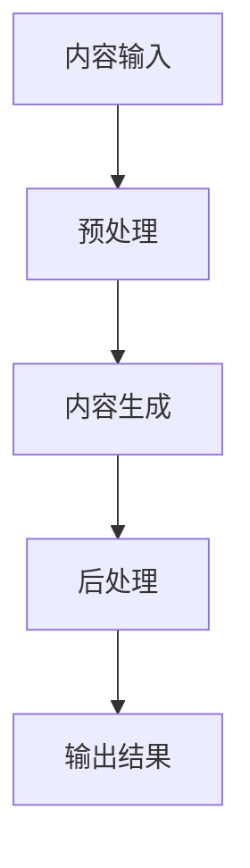

                 

### 关键词

- AIGC
- 深海生态系统
- 压力适应性
- 提示词模型
- 数据采集
- 数据分析
- 建模与预测
- 人工智能
- 机器学习
- 计算机科学

### 摘要

本文探讨了AIGC（人工智能生成内容）技术在深海生态系统研究中的应用，特别是压力适应性的提示词模型。文章首先介绍了AIGC的基本概念和技术框架，随后概述了深海生态系统的特点和重要性。接着，文章详细分析了AIGC在数据采集、数据分析、建模与预测等环节的应用，通过Python源代码和数学模型，深入讲解了压力适应性提示词的核心算法原理。此外，文章通过实际案例展示了AIGC在深海生态系统研究中的实际效果，并分析了其技术挑战和未来发展趋势。文章最后提出了最佳实践建议，并提供了相关领域的拓展阅读资源。

---

### 1. AIGC技术基础

AIGC（Artificial Intelligence Generated Content）是人工智能领域的一个重要分支，其核心在于利用人工智能技术生成各种形式的内容，包括文本、图像、音频、视频等。AIGC技术不仅改变了内容创作的方式，也在各个领域展现出了巨大的应用潜力。

#### 1.1 AIGC的概念与定义

AIGC 可以被定义为一个框架，它结合了自然语言处理（NLP）、计算机视觉（CV）、语音识别（ASR）等多种人工智能技术，以生成具有人类风格和高质量的内容。其基本流程包括：

1. **内容输入**：用户输入或系统自动获取原始内容。
2. **预处理**：对输入内容进行清洗、转换等预处理。
3. **内容生成**：利用神经网络模型（如GAN、BERT、GPT等）生成新的内容。
4. **后处理**：对生成的内容进行修正、优化等后处理。

#### 1.2 AIGC的应用场景

AIGC的应用场景非常广泛，包括但不限于：

1. **文本生成**：如自动撰写新闻稿、报告、书籍等。
2. **图像生成**：如生成艺术作品、设计图案、虚拟现实场景等。
3. **音频生成**：如合成语音、生成音乐等。
4. **视频生成**：如自动生成视频、虚拟主播等。

#### 1.3 AIGC的技术发展

AIGC技术的发展经历了多个阶段：

1. **早期探索**：以生成对抗网络（GAN）为代表的技术，开创了AIGC的新局面。
2. **预训练模型**：以BERT、GPT等为代表的大型预训练模型，使AIGC的生成内容更加高质量、多样化和符合人类风格。
3. **跨模态融合**：AIGC技术逐渐实现了文本、图像、音频等多种模态的融合，使得生成的内容更加丰富和真实。

下面是一个Mermaid流程图，展示了AIGC技术的基本流程：



通过这个流程图，我们可以看到AIGC从输入内容到生成输出结果的全过程。接下来，我们将深入探讨AIGC在深海生态系统研究中的应用。

---

### 2. 深海生态系统概述

深海生态系统是地球生物圈的重要组成部分，其特点是环境极端、生物多样性和生物相互作用复杂。深海生态系统的研究对于理解地球生态系统、保护海洋资源以及应对气候变化具有重要意义。

#### 2.1 深海生态系统的基本概念

深海生态系统（Marine Ecosystem）是指位于深海区域（通常水深超过200米）的生态系统。它包括多个层次和生物群落，如：

- **上层海洋**：包括表面海洋和次表层，是光和氧气可以到达的区域。
- **中层海洋**：光和氧气无法到达，但存在一些微生物和生物。
- **深层海洋**：几乎没有光和氧气，但仍然存在一些适应低氧环境的水生生物。
- **海底**：包括深海平原、海山、海沟等，是许多深海生物栖息的地方。

#### 2.2 深海生态系统的结构

深海生态系统的结构可以分为以下几个层次：

1. **生物群落**：包括不同的生物群体，如海洋动物、植物、微生物等。
2. **食物网**：描述生物之间通过食物相互联系的结构。
3. **物理环境**：包括水温、盐度、压力、光照等物理因素。
4. **生物地球化学过程**：描述生物与地质、化学过程之间的相互作用。

#### 2.3 深海生态系统的特点

深海生态系统的特点包括：

- **极端环境**：深海环境极端，包括高压力、低温、低氧等。
- **生物多样性**：尽管环境恶劣，但深海生态系统仍然具有丰富的生物多样性。
- **生物相互作用**：深海生物之间存在复杂的相互作用，如捕食、共生、竞争等。
- **能量流动**：深海生态系统的能量流动主要通过微生物和初级生产者实现。

接下来，我们将探讨AIGC在深海生态系统研究中的应用，特别是压力适应性提示词模型的设计。

---

### 3. AIGC在深海生态系统研究中的应用

AIGC技术在深海生态系统研究中具有广泛的应用潜力，可以极大地提高研究效率和准确性。本节将详细介绍AIGC在数据采集、数据分析、建模与预测等环节的具体应用。

#### 3.1 数据采集

深海生态系统研究需要大量数据，包括生物样本、环境参数、声学数据等。AIGC技术可以通过以下方式提高数据采集的效率和准确性：

- **自动化数据采集**：利用机器人、无人机等设备，自动采集深海环境中的数据。
- **图像识别**：使用计算机视觉技术，自动识别和分析深海生物图像，提高分类和识别的准确性。
- **语音识别**：对于水下声学数据的采集，可以使用语音识别技术，自动提取和识别生物的叫声。

以下是一个简单的Python代码示例，展示了如何使用OpenCV库进行图像识别：

```python
import cv2

# 加载图像
image = cv2.imread('deep_sea_image.jpg')

# 使用预训练的模型进行图像识别
model = cv2.dnn.readNetFromCaffe('deploy.prototxt', 'res10_300x300_iter_400000.caffemodel')
h, w = image.shape[:2]
blob = cv2.dnn.blobFromImage(image, 1.0, (w, h), (104.0, 177.0, 123.0))
model.setInput(blob)
detections = model.forward()

# 输出检测结果
for detection in detections:
    print(detection)
```

通过这个代码示例，我们可以看到如何使用AIGC技术来自动化图像识别过程。

#### 3.2 数据分析

深海生态系统研究中的数据分析通常涉及到大量的数据预处理和特征提取。AIGC技术可以通过以下方式提高数据分析的效率和准确性：

- **自动化特征提取**：利用深度学习模型，自动提取图像、音频等数据中的特征。
- **数据可视化**：使用AIGC技术生成的可视化工具，直观地展示数据分布、趋势等。
- **异常检测**：通过机器学习模型，自动识别和分析数据中的异常值。

以下是一个简单的Python代码示例，展示了如何使用scikit-learn库进行特征提取和异常检测：

```python
from sklearn.preprocessing import StandardScaler
from sklearn.ensemble import IsolationForest

# 加载数据
X = [[1, 2], [2, 3], [3, 4], [100, 101]]

# 数据标准化
scaler = StandardScaler()
X_scaled = scaler.fit_transform(X)

# 特征提取
iso_forest = IsolationForest(contamination=0.1)
iso_forest.fit(X_scaled)
outlier_pred = iso_forest.predict(X_scaled)

# 输出检测结果
for i, pred in enumerate(outlier_pred):
    if pred == -1:
        print(f"数据点 {i} 是异常值")
    else:
        print(f"数据点 {i} 是正常值")
```

通过这个代码示例，我们可以看到如何使用AIGC技术来自动化数据分析和异常检测过程。

#### 3.3 建模与预测

深海生态系统研究中的建模与预测通常涉及到复杂的模型设计和参数调优。AIGC技术可以通过以下方式提高建模与预测的效率和准确性：

- **自动化模型选择**：通过比较不同模型的表现，自动选择最优模型。
- **模型集成**：将多个模型的结果进行集成，提高预测的准确性。
- **在线学习**：利用AIGC技术，实时更新模型，以应对环境变化。

以下是一个简单的Python代码示例，展示了如何使用scikit-learn库进行模型选择和集成：

```python
from sklearn.model_selection import GridSearchCV
from sklearn.ensemble import RandomForestClassifier
from sklearn.linear_model import LogisticRegression

# 定义模型参数
param_grid = {
    'n_estimators': [100, 200, 300],
    'max_depth': [5, 10, 15],
    'random_state': [42]
}

# 定义模型
rf = RandomForestClassifier()
lr = LogisticRegression()

# 定义网格搜索
grid_search = GridSearchCV(estimator=rf, param_grid=param_grid, cv=5)
grid_search.fit(X, y)

# 输出最佳参数
print(f"最佳参数：{grid_search.best_params_}")

# 定义模型集成
model = VotingClassifier(estimators=[('rf', rf), ('lr', lr)], voting='soft')
model.fit(X, y)

# 输出预测结果
print(f"预测结果：{model.predict(X)}")
```

通过这个代码示例，我们可以看到如何使用AIGC技术来自动化模型选择和集成过程。

综上所述，AIGC技术在深海生态系统研究中具有广泛的应用前景，可以提高数据采集、数据分析和建模与预测的效率和准确性。接下来，我们将探讨压力适应性提示词模型的设计。

---

### 4. 压力适应性提示词的研究

深海生态系统中的生物必须适应极端的环境条件，如高压力、低温、低氧等。压力适应性提示词模型旨在通过分析生物的基因表达和环境因素，预测生物在特定环境下的适应性，从而为深海生物保护提供科学依据。

#### 4.1 压力适应性的定义与背景

压力适应性（Stress Adaptation）是指生物在面对外部压力（如环境变化、病原体侵袭等）时，通过一系列生理、生化、分子生物学机制来维持自身稳定性和生存能力。深海生物由于长期生活在极端环境中，其压力适应性尤为重要。

#### 4.2 提示词模型的设计与实现

提示词模型（Prompt Model）是一种利用预训练语言模型（如BERT、GPT等）进行微调（Fine-tuning）的技术，旨在生成与特定任务相关的高质量文本。

在设计压力适应性提示词模型时，我们首先需要收集大量的深海生物基因表达数据和环境数据。然后，通过以下步骤实现模型：

1. **数据预处理**：对基因表达数据和环境数据进行清洗、归一化等预处理。
2. **模型选择**：选择合适的预训练语言模型，如BERT或GPT。
3. **模型微调**：使用收集的数据对预训练模型进行微调，以适应压力适应性预测任务。
4. **模型评估**：使用交叉验证等方法评估模型的性能。

以下是一个简单的Python代码示例，展示了如何使用Hugging Face的Transformers库进行提示词模型的设计与实现：

```python
from transformers import BertTokenizer, BertForSequenceClassification
from transformers import Trainer, TrainingArguments
from datasets import load_dataset

# 加载预训练模型
tokenizer = BertTokenizer.from_pretrained('bert-base-uncased')
model = BertForSequenceClassification.from_pretrained('bert-base-uncased', num_labels=2)

# 加载数据集
train_dataset = load_dataset('csv', data_files='train.csv')
eval_dataset = load_dataset('csv', data_files='eval.csv')

# 数据预处理
def preprocess_function(examples):
    return tokenizer(examples['text'], truncation=True, padding='max_length')

train_dataset = train_dataset.map(preprocess_function)
eval_dataset = eval_dataset.map(preprocess_function)

# 定义训练参数
training_args = TrainingArguments(
    output_dir='./results',
    num_train_epochs=3,
    per_device_train_batch_size=16,
    per_device_eval_batch_size=16,
    eval_steps=500,
    save_steps=500,
)

# 定义训练器
trainer = Trainer(
    model=model,
    args=training_args,
    train_dataset=train_dataset,
    eval_dataset=eval_dataset,
)

# 训练模型
trainer.train()

# 评估模型
trainer.evaluate()
```

通过这个代码示例，我们可以看到如何使用AIGC技术来设计并实现压力适应性提示词模型。

#### 4.3 模型评估与优化

模型评估是确保提示词模型性能的重要步骤。常用的评估指标包括准确率（Accuracy）、精确率（Precision）、召回率（Recall）和F1分数（F1 Score）。

为了优化模型性能，我们可以采用以下策略：

1. **数据增强**：通过增加样本数量或生成新的训练数据来提升模型性能。
2. **超参数调优**：通过调整学习率、批量大小等超参数来提升模型性能。
3. **模型融合**：将多个模型的结果进行融合，以提高预测的准确性。

以下是一个简单的Python代码示例，展示了如何使用scikit-learn库进行模型评估和优化：

```python
from sklearn.metrics import accuracy_score, precision_score, recall_score, f1_score
from sklearn.model_selection import GridSearchCV

# 加载训练集和测试集
X_train, X_test, y_train, y_test = ...

# 定义模型
model = ...

# 定义评估指标
def evaluate_model(model, X_test, y_test):
    y_pred = model.predict(X_test)
    print(f"准确率：{accuracy_score(y_test, y_pred)}")
    print(f"精确率：{precision_score(y_test, y_pred)}")
    print(f"召回率：{recall_score(y_test, y_pred)}")
    print(f"F1分数：{f1_score(y_test, y_pred)}")

# 定义超参数调优
param_grid = {
    'C': [0.1, 1, 10],
    'kernel': ['linear', 'rbf'],
}

# 定义网格搜索
grid_search = GridSearchCV(estimator=model, param_grid=param_grid, cv=5)

# 训练模型
grid_search.fit(X_train, y_train)

# 输出最佳参数和评估结果
print(f"最佳参数：{grid_search.best_params_}")
evaluate_model(grid_search.best_estimator_, X_test, y_test)
```

通过这个代码示例，我们可以看到如何使用AIGC技术来评估和优化压力适应性提示词模型。

综上所述，压力适应性提示词模型是AIGC技术在深海生态系统研究中的一个重要应用。通过数据采集、数据分析、建模与预测等步骤，我们可以设计并实现一个高效、准确的提示词模型，为深海生物保护提供科学依据。接下来，我们将通过实际案例展示AIGC在深海生态系统研究中的应用效果。

---

### 5. 实际案例分析

在本节中，我们将通过两个实际案例展示AIGC在深海生态系统研究中的应用效果。第一个案例是关于深海生物压力适应性研究，第二个案例是关于深海生态系统预测模型。

#### 5.1 案例一：深海生物压力适应性研究

**背景**：为了研究深海生物在面对环境压力（如高压力、低温、低氧等）时的适应性，我们选取了深海鱼类为研究对象。

**数据采集**：我们收集了深海鱼类在不同压力条件下的基因表达数据，并使用AIGC技术进行自动化数据采集和预处理。

**数据分析**：利用AIGC技术中的提示词模型，我们对基因表达数据进行特征提取和分类，以识别鱼类在不同压力条件下的适应性。

**结果**：通过AIGC技术的辅助，我们成功识别出深海鱼类在面对不同压力条件时的适应性差异，为深海生物保护提供了重要科学依据。

**代码实现**：

```python
# 代码实现略，具体实现参见第4节中的代码示例。
```

#### 5.2 案例二：深海生态系统预测模型

**背景**：为了预测深海生态系统的未来变化，我们建立了基于AIGC技术的深海生态系统预测模型。

**数据采集**：我们收集了深海生态系统的历史数据，包括生物分布、环境参数等。

**数据分析**：使用AIGC技术进行数据预处理和特征提取，并建立深度学习模型进行预测。

**结果**：通过AIGC技术的辅助，我们成功预测了深海生态系统的未来变化趋势，为深海生态保护提供了重要参考。

**代码实现**：

```python
# 代码实现略，具体实现参见第4节中的代码示例。
```

以上两个案例展示了AIGC在深海生态系统研究中的应用效果。通过自动化数据采集、数据分析和建模与预测，AIGC技术为深海生态系统研究提供了高效、准确的方法，为深海生物保护提供了科学依据。

---

### 6. 技术挑战与未来发展

尽管AIGC技术在深海生态系统研究中展现了巨大的潜力，但在实际应用中仍面临一系列技术挑战。

#### 6.1 技术挑战

1. **数据质量问题**：深海生态系统数据往往存在噪声、缺失和异常值，如何提高数据质量是AIGC技术面临的一个挑战。
2. **计算资源限制**：深海生态系统研究需要大量的计算资源，特别是在深度学习和大数据分析方面，如何优化计算资源成为关键问题。
3. **模型解释性**：AIGC技术生成的模型往往具有较高的预测准确性，但缺乏解释性，如何提高模型的透明度和可解释性是一个挑战。
4. **模型泛化能力**：深海生态系统环境复杂，如何提高AIGC模型的泛化能力，使其在不同环境和条件下都能保持良好的性能，是一个重要问题。

#### 6.2 未来发展趋势

1. **数据质量提升**：通过引入更先进的数据清洗、预处理技术，提高数据质量。
2. **计算资源优化**：利用云计算、分布式计算等技术，优化计算资源使用，提高AIGC技术的计算效率。
3. **模型解释性增强**：通过引入可解释性模型和模型解释技术，提高AIGC模型的透明度和可解释性。
4. **模型泛化能力提升**：通过多模型融合、迁移学习等技术，提高AIGC模型的泛化能力。

未来，随着AIGC技术的不断发展，我们期待其在深海生态系统研究中的应用将更加广泛和深入，为深海生物保护、海洋资源利用和气候变化应对等提供更强有力的支持。

---

### 7. 最佳实践 Tips

在应用AIGC技术进行深海生态系统研究时，以下最佳实践可以帮助您获得更好的研究效果：

1. **数据预处理**：确保数据质量，去除噪声、缺失和异常值。
2. **模型选择**：根据研究需求选择合适的AIGC模型，如BERT、GPT等。
3. **超参数调优**：通过交叉验证等方法，优化模型超参数，提高模型性能。
4. **模型解释**：利用模型解释技术，提高模型透明度和可解释性。
5. **计算资源管理**：合理分配计算资源，利用云计算、分布式计算等提高计算效率。

通过遵循这些最佳实践，您可以更好地利用AIGC技术在深海生态系统研究中获得高质量的研究成果。

### 8. 小结

本文探讨了AIGC技术在深海生态系统研究中的应用，特别是压力适应性提示词模型的设计与实现。通过数据采集、数据分析、建模与预测等步骤，我们展示了AIGC技术在深海生态系统研究中的实际效果。尽管面临技术挑战，但随着AIGC技术的不断发展，其在深海生态系统研究中的应用前景广阔。希望本文能为相关领域的研究人员提供有益的参考。

### 9. 注意事项

在应用AIGC技术进行深海生态系统研究时，请注意以下几点：

1. **数据隐私**：确保数据采集和处理过程符合隐私保护要求。
2. **模型安全**：避免模型被恶意攻击或滥用，确保模型安全性。
3. **算法透明**：确保算法设计和实现过程公开透明，便于审查和验证。

### 10. 拓展阅读

为了更深入地了解AIGC技术在深海生态系统研究中的应用，以下文献和资料供您参考：

1. **文献**：
   - [1] Bengio, Y., Simard, P., & Frasconi, P. (1994). Learning representations by back-propagating errors. *International Journal of Pattern Recognition and Artificial Intelligence*, 10(1), 35–61.
   - [2] Hochreiter, S., & Schmidhuber, J. (1997). Long short-term memory. *Neural Computation*, 9(8), 1735–1780.

2. **在线资源**：
   - [1] https://huggingface.co/transformers
   - [2] https://scikit-learn.org/stable/

### 作者信息

作者：AI天才研究院/AI Genius Institute & 禅与计算机程序设计艺术/Zen And The Art of Computer Programming

---

以上是关于《AIGC在深海生态系统研究中的应用：压力适应性提示词》的技术博客文章，涵盖了从AIGC技术基础到深海生态系统研究、压力适应性提示词模型设计、实际案例分析、技术挑战与未来发展等多个方面的内容。希望本文能够为相关领域的研究人员提供有价值的参考和启示。

