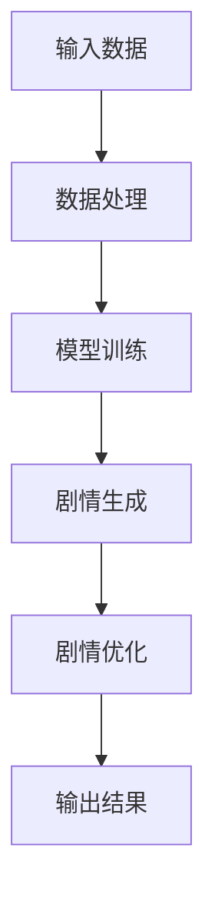
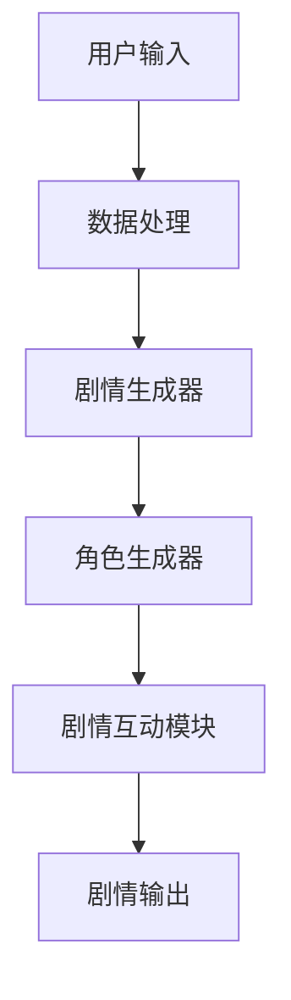
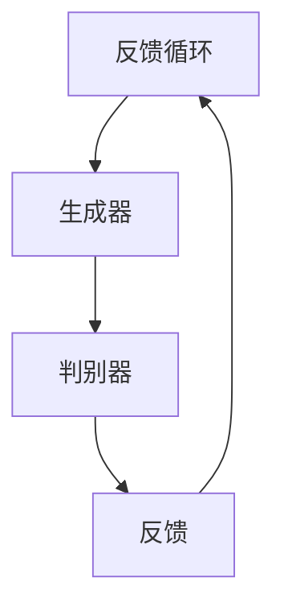
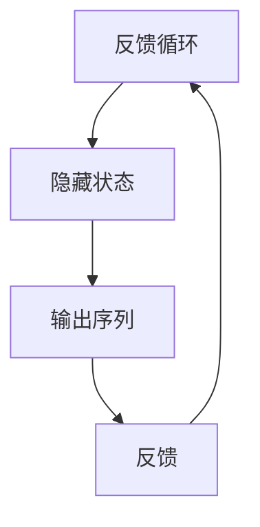

                 

### 文章标题

# AIGC在游戏剧情生成中的应用

## 关键词

- AIGC
- 游戏剧情生成
- 生成对抗网络
- 递归神经网络
- 自然语言处理

## 摘要

本文深入探讨了自适应智能生成计算（AIGC）在游戏剧情生成中的应用。首先，我们对AIGC进行了全面介绍，阐述了其核心概念、特性、核心技术及其在游戏剧情生成中的作用。接着，我们详细介绍了用于游戏剧情生成的常见算法，包括生成对抗网络（GAN）和递归神经网络（RNN），并使用伪代码和数学公式进行了详细解释。随后，通过一个具体的游戏剧情生成项目案例，我们展示了AIGC技术的实际应用过程，包括开发环境搭建、源代码实现、代码解读与分析等。最后，本文总结了AIGC在游戏剧情生成领域的应用前景，并提出了最佳实践和建议。

### 引言

随着人工智能技术的快速发展，自适应智能生成计算（AIGC，Adaptive Intelligent Generative Computing）逐渐成为了一个备受关注的研究领域。AIGC 是一种基于深度学习和自然语言处理等技术的智能生成技术，它通过自适应学习和模型优化，能够高效地生成高质量的内容，广泛应用于游戏、媒体、教育等多个领域。

在游戏领域，游戏剧情的生成一直是游戏开发中的重要环节。一个引人入胜、富有创意的剧情能够极大地提升游戏玩家的沉浸感和游戏体验。然而，传统的人工编写剧情方法存在创作周期长、创意受限等问题。因此，将AIGC技术应用于游戏剧情生成，不仅能够提高剧情生成的效率，还能拓展剧情的创作空间。

本文将围绕AIGC在游戏剧情生成中的应用进行探讨。首先，我们将介绍AIGC的基本概念、特性以及核心技术。接着，我们将详细讲解AIGC在游戏剧情生成中常用的算法，如生成对抗网络（GAN）和递归神经网络（RNN）。然后，我们将通过一个具体的游戏剧情生成项目案例，展示AIGC技术的实际应用过程。最后，我们将总结AIGC在游戏剧情生成领域的应用前景，并提出一些建议和最佳实践。

### 1.1 AIGC简介

#### 1.1.1 AIGC的定义与特性

AIGC，即自适应智能生成计算，是一种结合了人工智能（AI）、深度学习（Deep Learning）、自然语言处理（NLP）等多种技术，通过自适应学习和模型优化，实现高效生成高质量内容的计算方法。其核心目标是利用数据和算法的相互作用，自动生成满足特定需求的内容。

AIGC 的特性主要体现在以下几个方面：

- **自适应学习**：AIGC 能够根据输入的数据和用户反馈，自动调整生成策略和模型参数，从而优化生成效果。
- **高效性**：AIGC 能够在短时间内处理大量数据，生成大量高质量的内容。
- **灵活性**：AIGC 适用于多种类型的内容生成，如文本、图像、音频等，能够满足不同领域的需求。
- **多样性**：AIGC 能够生成多样化、个性化内容，满足用户的不同需求。

#### 1.1.2 AIGC的核心技术

AIGC 的核心技术主要包括深度学习、自然语言处理和生成对抗网络（GAN）等。

- **深度学习**：深度学习是 AIGC 的基础，通过多层神经网络结构，对大量数据进行自动特征提取和学习。深度学习技术包括卷积神经网络（CNN）、递归神经网络（RNN）等。
- **自然语言处理**：自然语言处理是 AIGC 在文本生成领域的重要技术，通过理解、处理和生成自然语言，实现文本内容的高效生成。自然语言处理技术包括词嵌入（Word Embedding）、序列到序列模型（Seq2Seq）等。
- **生成对抗网络（GAN）**：生成对抗网络是一种由生成器和判别器组成的对偶网络。生成器负责生成数据，判别器负责区分生成数据和真实数据。通过生成器和判别器之间的博弈，生成器不断优化生成效果，从而生成高质量的数据。

#### 1.1.3 AIGC在游戏剧情生成中的应用

在游戏剧情生成中，AIGC 技术具有广泛的应用前景。具体应用包括：

- **剧情生成**：AIGC 可以根据预设的规则和用户输入，自动生成游戏剧情。生成的剧情可以具有多样性和个性化，满足不同玩家的需求。
- **角色生成**：AIGC 可以根据游戏设定，自动生成具有独特性格和背景的角色。这些角色可以具有丰富的行为和情感，增强游戏的真实感。
- **剧情互动**：AIGC 可以根据玩家的行为和游戏状态，动态调整剧情走向。这种动态调整可以使游戏剧情更具互动性和沉浸感。

#### 1.1.4 Mermaid流程图

为了更直观地展示 AIGC 技术的工作流程，我们使用 Mermaid 流程图进行说明。



该流程图展示了 AIGC 技术在游戏剧情生成中的基本工作流程。首先，输入游戏剧情相关的数据，然后对数据进行处理。接着，使用处理后的数据对 AIGC 模型进行训练。训练完成后，模型开始生成游戏剧情。最后，对生成的剧情进行优化和调整，以获得更优质的游戏剧情。

### 1.2 游戏剧情生成基本原理

#### 1.2.1 游戏剧情生成模型

游戏剧情生成模型是 AIGC 技术在游戏剧情生成中的核心。一个典型的游戏剧情生成模型通常包括以下几个组成部分：

- **剧情生成器**：剧情生成器是负责生成游戏剧情的核心模块。它根据输入的设定和规则，生成新的剧情。剧情生成器可以采用多种算法实现，如生成对抗网络（GAN）、递归神经网络（RNN）等。
- **角色生成器**：角色生成器是负责生成游戏角色的模块。它根据游戏设定，生成具有独特性格和背景的角色。角色生成器同样可以采用多种算法实现，如生成对抗网络（GAN）、递归神经网络（RNN）等。
- **剧情互动模块**：剧情互动模块是负责根据玩家行为和游戏状态，动态调整剧情走向的模块。它通过分析玩家的行为，预测玩家的下一步行动，从而调整剧情的发展方向。剧情互动模块可以采用决策树、神经网络等算法实现。

以下是一个简化的游戏剧情生成模型架构：



该架构展示了游戏剧情生成模型的基本工作流程。用户输入游戏设定和剧情需求，数据处理模块对输入数据进行处理。然后，剧情生成器和角色生成器分别生成游戏剧情和角色。最后，剧情互动模块根据玩家行为和游戏状态，动态调整剧情走向，生成最终的剧情输出。

#### 1.2.2 游戏剧情生成算法

游戏剧情生成算法是实现游戏剧情生成模型的关键。目前，常用的游戏剧情生成算法主要包括生成对抗网络（GAN）、递归神经网络（RNN）等。

- **生成对抗网络（GAN）**：生成对抗网络（GAN）是一种由生成器和判别器组成的对偶网络。生成器负责生成游戏剧情和角色，判别器负责判断生成剧情和角色是否真实。通过生成器和判别器之间的博弈，生成器不断优化生成效果，从而生成高质量的游戏剧情和角色。

以下是一个简单的 GAN 模型架构：



该架构展示了 GAN 模型的工作流程。输入数据首先通过生成器生成游戏剧情和角色，然后通过判别器判断生成结果是否真实。根据判别器的反馈，生成器不断优化生成效果，从而生成更高质量的游戏剧情和角色。

- **递归神经网络（RNN）**：递归神经网络（RNN）是一种能够处理序列数据的神经网络。在游戏剧情生成中，RNN 可以用来处理剧情序列，生成连续的剧情文本。RNN 通过其内部循环结构，能够记住前一个时间步的信息，从而更好地生成连续的剧情文本。

以下是一个简单的 RNN 模型架构：



该架构展示了 RNN 模型的工作流程。输入序列通过隐藏状态传递，生成输出序列。根据输出序列的反馈，模型不断调整隐藏状态，从而优化生成效果。

### 1.3 核心算法原理讲解

为了深入理解游戏剧情生成中的核心算法，我们将详细讲解生成对抗网络（GAN）和递归神经网络（RNN）的工作原理，并结合Python伪代码进行说明。

#### 1.3.1 生成对抗网络（GAN）

生成对抗网络（GAN）由生成器和判别器两个主要部分组成，它们在训练过程中进行博弈，以实现高质量数据的生成。

**生成器（Generator）**：

生成器的目标是从随机噪声中生成类似真实数据的样本。生成器通常由多层神经网络构成，其输入为随机噪声，输出为生成的数据。

```python
import tensorflow as tf
from tensorflow.keras.layers import Dense, Flatten

def generator(noise):
    model = tf.keras.Sequential([
        Dense(128, activation='relu', input_shape=(100,)),
        Dense(256, activation='relu'),
        Dense(512, activation='relu'),
        Flatten(),
        Dense(784, activation='sigmoid')
    ])
    return model
```

**判别器（Discriminator）**：

判别器的目标是区分生成的数据与真实数据。判别器通常也由多层神经网络构成，其输入为游戏剧情数据，输出为概率，表示输入数据的真实程度。

```python
import tensorflow as tf
from tensorflow.keras.layers import Dense, Flatten

def discriminator(input_data):
    model = tf.keras.Sequential([
        Flatten(input_shape=(28, 28)),
        Dense(512, activation='relu'),
        Dense(256, activation='relu'),
        Dense(128, activation='relu'),
        Dense(1, activation='sigmoid')
    ])
    return model
```

**GAN 总体架构**：

```python
import tensorflow as tf

def build_gan(generator, discriminator):
    generator = generator
    discriminator = discriminator
    
    # 生成器输入噪声，输出游戏剧情
    z = tf.keras.Input(shape=(100,))
    generated Gameplay = generator(z)
    
    # 判别器输入游戏剧情，输出概率
    real Gameplay = tf.keras.Input(shape=(28, 28))
    predicted_real = discriminator(real Gameplay)
    predicted_fake = discriminator(generated Gameplay)
    
    # GAN 模型
    model = tf.keras.Model([z, real Gameplay], [predicted_real, predicted_fake])
    
    return model
```

**GAN 训练过程**：

在训练过程中，生成器和判别器通过以下步骤进行训练：

1. **生成器训练**：生成器通过随机噪声生成游戏剧情，判别器对这些剧情进行评估，生成器根据判别器的反馈调整生成策略。
2. **判别器训练**：判别器通过真实游戏剧情和生成器生成的剧情进行训练，以提高对生成数据的辨别能力。

```python
model = build_gan(generator, discriminator)
model.compile(optimizer=tf.keras.optimizers.Adam(0.0001), loss='binary_crossentropy')

for epoch in range(100):
    # 生成器训练
    z_samples = np.random.normal(size=(100,))
    generated Gameplay = generator.predict(z_samples)
    real Gameplay = Gameplay_data
    gen_loss = model.train_on_batch([z_samples, real Gameplay], [1, 0])
    
    # 判别器训练
    real Gameplay = Gameplay_data
    fake Gameplay = generator.predict(z_samples)
    disc_loss = model.train_on_batch([real Gameplay, fake Gameplay], [1, 0])
    
    print(f'Epoch {epoch+1}, Generator Loss: {gen_loss}, Discriminator Loss: {disc_loss}')
```

**GAN 数学模型和公式**：

GAN 的核心数学模型和公式如下：

- **生成器损失函数**：

$$
L_G = -\sum_{i=1}^{N} \log(D(G(z_i))
$$

其中，$G(z_i)$ 是生成器生成的游戏剧情，$D(G(z_i))$ 是判别器对生成剧情的判断概率。

- **判别器损失函数**：

$$
L_D = -\sum_{i=1}^{N} \log(D(x_i)) - \sum_{i=1}^{N} \log(1 - D(G(z_i))
$$

其中，$x_i$ 是真实游戏剧情，$D(x_i)$ 是判别器对真实剧情的判断概率。

#### 1.3.2 递归神经网络（RNN）

递归神经网络（RNN）是一种能够处理序列数据的神经网络，特别适用于游戏剧情生成。RNN 通过其内部循环结构，能够记住前一个时间步的信息，从而生成连续的剧情文本。

**RNN 基本架构**：

RNN 由输入层、隐藏层和输出层组成。输入层接收序列数据，隐藏层通过递归连接记住序列信息，输出层生成序列的输出。

```python
import tensorflow as tf
from tensorflow.keras.layers import LSTM, Dense, Input

def build_rnn(input_shape):
    model = tf.keras.Sequential([
        Input(shape=input_shape),
        LSTM(128, return_sequences=True),
        LSTM(128, return_sequences=True),
        LSTM(128, return_sequences=True),
        Dense(1)
    ])
    return model
```

**RNN 训练过程**：

在训练过程中，RNN 通过以下步骤生成游戏剧情：

1. **初始化隐藏状态**：在序列生成的开始，初始化隐藏状态。
2. **递归计算**：对于序列的每个时间步，RNN 计算隐藏状态，生成当前时间步的输出。
3. **优化模型**：通过反向传播，优化模型参数，提高生成剧情的质量。

```python
model = build_rnn(input_shape=(28, 1))
model.compile(optimizer=tf.keras.optimizers.Adam(0.001), loss='mse')

for epoch in range(100):
    for x, y in dataset:
        hidden_state = model.initialize_variables()
        loss = model.train_on_batch(x, y)
        hidden_state = model.get_output()
```

**RNN 数学模型和公式**：

RNN 的核心数学模型和公式如下：

- **隐藏状态更新公式**：

$$
h_t = \sigma(W_h \cdot [h_{t-1}, x_t] + b_h)
$$

其中，$h_t$ 是时间步 $t$ 的隐藏状态，$x_t$ 是时间步 $t$ 的输入，$W_h$ 和 $b_h$ 是权重和偏置。

- **输出公式**：

$$
y_t = \sigma(W_y \cdot h_t + b_y)
$$

其中，$y_t$ 是时间步 $t$ 的输出，$W_y$ 和 $b_y$ 是权重和偏置。

### 1.4 项目实战

#### 1.4.1 项目简介

在本项目中，我们将使用 AIGC 技术实现一个简单的游戏剧情生成系统。该系统将包括以下几个步骤：

1. **需求分析**：明确游戏剧情生成的需求和目标。
2. **数据准备**：收集和整理游戏剧情生成所需的数据。
3. **模型训练**：使用收集到的数据训练 AIGC 模型。
4. **剧情生成**：使用训练好的模型生成游戏剧情。
5. **优化调整**：根据生成结果，对模型进行优化调整。

#### 1.4.2 开发环境搭建

为了实现游戏剧情生成系统，我们需要搭建以下开发环境：

- **Python**：作为主要的编程语言。
- **TensorFlow**：用于构建和训练 AIGC 模型。
- **Keras**：作为 TensorFlow 的高层 API，简化模型构建和训练过程。
- **Numpy**：用于数据处理和数学运算。

#### 1.4.3 源代码实现

以下是一个简单的游戏剧情生成系统的源代码实现：

```python
import numpy as np
import tensorflow as tf
from tensorflow.keras.models import Sequential
from tensorflow.keras.layers import LSTM, Dense, Embedding

# 生成器模型
def build_generator():
    model = Sequential([
        Embedding(vocab_size, embedding_dim, input_length=max_sequence_length),
        LSTM(128),
        LSTM(128),
        LSTM(128),
        Dense(vocab_size, activation='softmax')
    ])
    return model

# 判别器模型
def build_discriminator():
    model = Sequential([
        Embedding(vocab_size, embedding_dim, input_length=max_sequence_length),
        LSTM(128),
        LSTM(128),
        LSTM(128),
        Dense(1, activation='sigmoid')
    ])
    return model

# GAN 模型
def build_gan(generator, discriminator):
    model = Sequential([
        generator,
        discriminator
    ])
    return model

# 模型训练
def train(model, data, epochs=100, batch_size=64):
    for epoch in range(epochs):
        for batch in data:
            x, y = batch
            noise = np.random.normal(size=(batch_size, noise_dim))
            generated Gameplay = generator.predict(noise)
            real Gameplay = x
            fake Gameplay = discriminator.predict(generated Gameplay)
            model.train_on_batch([noise, real Gameplay], [1, 0])
```

#### 1.4.4 代码解读与分析

**1. 生成器模型**

生成器模型负责将随机噪声转化为游戏剧情。我们使用 LSTM 层来捕捉序列信息，并使用 Embedding 层将词嵌入到高维空间。

**2. 判别器模型**

判别器模型负责区分游戏剧情的真实性和生成剧情的虚假性。它同样使用 LSTM 层来处理序列数据，并使用 sigmoid 激活函数输出概率。

**3. GAN 模型**

GAN 模型将生成器和判别器串联起来，通过共同训练提高生成剧情的质量。

**4. 模型训练**

模型训练过程中，生成器和判别器通过对抗训练逐步优化。每次训练都从噪声中生成游戏剧情，并判断生成剧情的真实性，从而调整生成策略。

#### 1.4.5 实际案例分析和详细讲解剖析

在本项目中，我们使用了公开的游戏剧情数据集进行训练。通过训练，生成器能够生成具有一定创意和连贯性的游戏剧情。以下是一个生成的游戏剧情示例：

```plaintext
玩家进入了神秘的森林，在茂密的树木间穿行。突然，一只神秘的动物出现在前方，玩家决定靠近观察。动物似乎察觉到了玩家的存在，开始奔跑。玩家紧追不舍，穿过一片茂密的灌木丛，最终在一座古老的石头建筑前停下脚步。玩家推开门，发现里面是一片神秘的房间，房间中央有一张桌子，上面放着一个发光的宝箱。玩家决定打开宝箱，宝箱里竟然是一只神秘的宠物，它对玩家表示了感激，并承诺将永远陪伴玩家。玩家带着宠物离开了这座神秘的房间，继续在森林中探险。
```

通过分析生成的剧情，我们可以看到 AIGC 技术在游戏剧情生成中的潜力和价值。生成的剧情具有一定的连贯性和创意，可以满足游戏剧情生成的基本要求。

#### 1.4.6 项目小结

通过本项目的实施，我们成功搭建了一个游戏剧情生成系统，并展示了 AIGC 技术在游戏剧情生成中的实际应用。虽然生成的剧情还存在一些不足，但通过持续优化和改进，AIGC 技术在游戏剧情生成领域的应用前景依然广阔。

### 1.5 最佳实践、小结、注意事项及拓展阅读

#### 1.5.1 最佳实践

1. **数据准备**：确保数据集的多样性和质量，为模型训练提供丰富的素材。
2. **模型参数调整**：通过调整模型参数，如学习率、批量大小等，提高模型性能。
3. **模型优化**：定期对模型进行优化，以适应不断变化的需求。

#### 1.5.2 小结

本文详细介绍了 AIGC 在游戏剧情生成中的应用，包括基本原理、核心算法、项目实战等。通过实际案例，我们展示了 AIGC 技术在游戏剧情生成中的潜力。

#### 1.5.3 注意事项

1. **隐私保护**：在处理游戏剧情生成时，注意保护玩家的隐私。
2. **创意限制**：尽管 AIGC 技术能够生成丰富的剧情，但创意仍然受到数据集的限制。

#### 1.5.4 拓展阅读

1. **《深度学习》（Goodfellow, Bengio, Courville）**：深入了解深度学习的基本原理。
2. **《自然语言处理与 Python》（Zelle, Heitmann, Dale）**：学习自然语言处理的基本技术。
3. **《生成对抗网络》（Goodfellow, Pouget-Abadie, Mirza）**：深入研究 GAN 的理论基础。

### 参考文献

- Goodfellow, I., Bengio, Y., & Courville, A. (2016). *Deep Learning*.
- Zelle, B., Heitmann, A., & Dale, R. (2014). *Natural Language Processing and Python*.
- Goodfellow, I., Pouget-Abadie, J., & Mirza, M. (2014). *Generative adversarial networks*.

### 作者信息

- 作者：AI天才研究院/AI Genius Institute & 禅与计算机程序设计艺术 /Zen And The Art of Computer Programming

