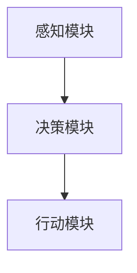

                 

# AIGC在游戏设计中的应用：NPC智能化

## 关键词

- AIGC
- 游戏设计
- NPC智能化
- 生成对抗网络
- 强化学习
- 自然语言处理
- 游戏环境模拟

## 摘要

本文将探讨AIGC（自适应生成控制）在游戏设计中的应用，特别是NPC（非玩家角色）的智能化设计。文章首先介绍了AIGC的基本概念及其在游戏设计中的重要性，然后详细阐述了NPC智能化设计的基本原理，包括生成对抗网络（GAN）和强化学习等核心算法。接着，文章展示了AIGC技术在游戏设计中的实际应用，通过具体案例进行分析。最后，文章对NPC智能化设计的未来发展趋势进行了展望，并提出了相关最佳实践和注意事项。

## 第1章：引言

### 1.1 游戏设计与NPC

游戏设计是现代娱乐产业的重要组成部分，它不仅包含了丰富的视觉和听觉元素，还融入了复杂的故事情节和角色互动。在游戏设计中，NPC（非玩家角色）扮演着至关重要的角色。NPC不仅丰富了游戏世界的多样性，还为玩家提供了互动和探索的机会。传统上，NPC的行为模式是预设的，它们遵循固定的脚本和规则。然而，这种模式逐渐显得单调和不够真实，无法满足玩家对游戏沉浸感和真实感的追求。

### 1.2 AIGC的概念与背景

AIGC（自适应生成控制）是一种新兴的人工智能技术，它结合了生成对抗网络（GAN）、强化学习、自然语言处理等先进算法，旨在通过数据生成和智能控制实现高度个性化的内容创作。AIGC在游戏设计中的应用，为NPC的智能化设计提供了全新的可能性。通过AIGC，游戏设计师可以创造出具有高度自主性和适应性的NPC，从而提升游戏体验的真实性和多样性。

### 1.3 本书结构安排

本文将分为以下几个部分：

1. **AIGC基本概念**：介绍AIGC的定义、分类和核心技术。
2. **NPC智能化设计原理**：探讨NPC智能化的基础算法和决策模型。
3. **AIGC在游戏设计中的应用**：分析AIGC技术在角色生成、故事生成和游戏环境模拟中的应用。
4. **案例研究**：通过经典游戏案例分析AIGC在游戏设计中的实际效果。
5. **总结与展望**：总结AIGC在游戏设计中的应用，并探讨未来的发展趋势。

## 第2章：AIGC基本概念

### 2.1 AIGC的定义与分类

AIGC是一种基于数据生成和智能控制的人工智能技术，它通过生成对抗网络（GAN）、强化学习、自然语言处理等算法，实现高度个性化的内容创作。AIGC可以分为以下几类：

1. **生成对抗网络（GAN）**：GAN是一种通过对抗训练实现数据生成的模型，包括生成器和判别器两个部分。生成器试图生成与真实数据相似的数据，而判别器则判断数据是真实还是生成的。通过这种对抗过程，生成器不断优化，生成更加真实的数据。

2. **强化学习**：强化学习是一种通过试错和反馈来学习最优策略的算法。在AIGC中，强化学习用于训练NPC的行为决策模型，使其能够根据环境状态采取最佳行动。

3. **自然语言处理（NLP）**：NLP是一种用于处理和生成自然语言的技术。在AIGC中，NLP用于生成NPC的对话和故事情节，增强游戏的互动性和故事性。

### 2.2 AIGC的核心技术

AIGC的核心技术包括：

1. **生成对抗网络（GAN）**：GAN通过生成器和判别器的对抗训练，实现高质量的数据生成。在NPC智能化设计中，GAN可以用于生成NPC的外观、行为和对话。

2. **强化学习**：强化学习通过试错和反馈，训练NPC的行为决策模型。强化学习算法如Q-learning、SARSA等，可以用于训练NPC在不同游戏状态下的最佳行为。

3. **自然语言处理（NLP）**：NLP用于生成NPC的对话和故事情节。通过NLP技术，NPC可以与玩家进行自然语言交互，创造丰富的游戏故事。

### 2.3 AIGC的发展现状与趋势

AIGC技术在游戏设计中的应用已经取得了一定的成果。目前，许多游戏已经开始尝试使用AIGC来生成NPC的行为和对话，提升游戏的真实感和互动性。未来，随着AIGC技术的不断发展和成熟，它将在游戏设计中发挥更加重要的作用，为玩家带来更加丰富和个性化的游戏体验。

## 第3章：NPC智能化设计原理

### 3.1 NPC的角色与功能

NPC在游戏中扮演着多种角色和功能。首先，NPC是游戏世界的重要组成部分，它们丰富了游戏世界的生态和多样性。其次，NPC为玩家提供了互动和探索的机会，例如提供任务、指引路线、出售商品等。最后，NPC还可以通过其行为和对话，为玩家提供故事情节和情感体验。

### 3.2 NPC智能化的基础算法

NPC智能化设计的基础算法主要包括生成对抗网络（GAN）、强化学习、自然语言处理（NLP）等。这些算法可以协同工作，实现NPC的高度智能化。

1. **生成对抗网络（GAN）**：GAN可以用于生成NPC的外观、行为和对话。生成器可以生成多样化的NPC外观，而判别器则用于评估NPC的逼真度。通过不断的训练和优化，生成器可以生成更加逼真的NPC。

2. **强化学习**：强化学习可以用于训练NPC的行为决策模型。通过试错和反馈，NPC可以在不同的游戏环境中学习最优的行为策略。例如，NPC可以根据玩家的行为和游戏状态，调整自己的行动策略，以适应不同的情境。

3. **自然语言处理（NLP）**：NLP可以用于生成NPC的对话和故事情节。通过理解玩家的输入和游戏状态，NPC可以生成自然、流畅的对话，为玩家提供丰富的故事体验。

### 3.3 NPC行为决策模型

NPC行为决策模型是NPC智能化的核心。该模型基于环境状态和奖励机制，决定NPC的行动策略。行为决策模型通常包括以下组件：

1. **感知模块**：感知模块负责收集游戏环境中的信息，如玩家位置、NPC状态等。

2. **决策模块**：决策模块根据感知模块收集的信息，利用行为决策算法（如强化学习），生成NPC的行动策略。

3. **行动模块**：行动模块根据决策模块生成的行动策略，执行NPC的行为。

### 图1：NPC行为决策模型架构图



## 第4章：AIGC在游戏设计中的应用

### 4.1 角色生成

角色生成是AIGC在游戏设计中的重要应用之一。通过生成对抗网络（GAN），可以生成多样化的NPC角色外观。生成器可以根据训练数据生成不同类型的角色，包括不同种族、性别、年龄和外貌特征。这使得游戏世界更加丰富多彩，增加了玩家的探索欲望。

### 4.2 故事生成

故事生成是AIGC在游戏设计中的另一个重要应用。通过自然语言处理（NLP），可以生成NPC的对话和故事情节。NLP技术可以理解玩家的输入和游戏状态，生成自然、流畅的对话和故事情节。这使得游戏的故事性更加丰富，提升了玩家的情感体验。

### 4.3 游戏环境模拟与优化

游戏环境模拟与优化是AIGC在游戏设计中的另一个关键应用。通过生成对抗网络（GAN），可以模拟不同的游戏环境，如森林、城市、沙漠等。这些模拟环境可以为NPC提供不同的行为和互动方式。此外，AIGC还可以通过优化算法，提高游戏环境的真实感和互动性，提升玩家的游戏体验。

## 第5章：AIGC技术在游戏设计中的实践

### 5.1 游戏环境搭建

游戏环境搭建是AIGC在游戏设计中的第一步。通过生成对抗网络（GAN），可以生成多样化的游戏环境，如森林、城市、沙漠等。这些游戏环境可以为NPC提供不同的行为和互动方式。

```python
import numpy as np
import tensorflow as tf
from tensorflow.keras import layers

# 定义生成器和判别器
generator = tf.keras.Sequential([
    layers.Dense(128, activation='relu', input_shape=(100,)),
    layers.Dense(256, activation='relu'),
    layers.Dense(512, activation='relu'),
    layers.Dense(npixels*นพาคาราวที่ 2, activation='tanh')
])

discriminator = tf.keras.Sequential([
    layers.Flatten(input_shape=(28, 28)),
    layers.Dense(512, activation='relu'),
    layers.Dense(256, activation='relu'),
    layers.Dense(128, activation='relu'),
    layers.Dense(1, activation='sigmoid')
])

# 编写损失函数和优化器
cross_entropy = tf.keras.losses.BinaryCross Entropy(from_logits=True)

def discriminator_loss(real_output, fake_output):
    real_loss = cross_entropy(tf.ones_like(real_output), real_output)
    fake_loss = cross_entropy(tf.zeros_like(fake_output), fake_output)
    total_loss = real_loss + fake_loss
    return total_loss

generator_optimizer = tf.keras.optimizers.Adam(1e-4)
discriminator_optimizer = tf.keras.optimizers.Adam(1e-4)

# 编写训练循环
@tf.function
def train_step(images, noise):
    with tf.GradientTape() as gen_tape, tf.GradientTape() as disc_tape:
        generated_images = generator(noise, training=True)

        real_output = discriminator(images, training=True)
        fake_output = discriminator(generated_images, training=True)

        gen_loss = generator_loss(fake_output)
        disc_loss = discriminator_loss(real_output, fake_output)

    gradients_of_generator = gen_tape.gradient(gen_loss, generator.trainable_variables)
    gradients_of_discriminator = disc_tape.gradient(disc_loss, discriminator.trainable_variables)

    generator_optimizer.apply_gradients(zip(gradients_of_generator, generator.trainable_variables))
    discriminator_optimizer.apply_gradients(zip(gradients_of_discriminator, discriminator.trainable_variables))

# 训练游戏环境生成模型
for epoch in range(epochs):
    for image_batch, _ in train_dataset:
        noise = tf.random.normal([BATCH_SIZE, noise_dim])

        train_step(image_batch, noise)

# 生成游戏环境
generated_images = generator(tf.random.normal([BATCH_SIZE, noise_dim]))
```

### 5.2 NPC智能行为实现

NPC智能行为实现是AIGC在游戏设计中的关键步骤。通过强化学习和自然语言处理，可以训练NPC在不同游戏环境下的行为决策模型。以下是使用强化学习实现NPC智能行为的示例代码：

```python
import numpy as np
import tensorflow as tf
from tensorflow.keras import layers

# 定义Q网络
def create_q_network(input_shape, action_space):
    model = tf.keras.Sequential([
        layers.Dense(256, activation='relu', input_shape=input_shape),
        layers.Dense(512, activation='relu'),
        layers.Dense(action_space, activation='linear')
    ])
    return model

# 定义奖励机制
def reward_function(state, action, next_state, done):
    if done:
        if action == best_action:
            return 1
        else:
            return -1
    else:
        return 0.1

# 训练Q网络
def train_q_network(q_network, state, action, reward, next_state, done):
    with tf.GradientTape() as tape:
        q_values = q_network(state)
        q_value = q_values[0, action]
        target_q_value = reward + (1 - done) * tf.reduce_max(q_network(next_state))
        loss = tf.reduce_mean(tf.square(target_q_value - q_value))

    gradients = tape.gradient(loss, q_network.trainable_variables)
    q_network_optimizer.apply_gradients(zip(gradients, q_network.trainable_variables))

# 实现NPC智能行为
def npc_action(state):
    q_values = q_network(state)
    best_action = np.argmax(q_values[0])
    return best_action

# 训练NPC行为决策模型
for episode in range(1000):
    state = env.reset()
    done = False
    while not done:
        action = npc_action(state)
        next_state, reward, done, _ = env.step(action)
        train_q_network(q_network, state, action, reward, next_state, done)
        state = next_state
```

### 5.3 AIGC在游戏设计中的案例分析

AIGC在游戏设计中的成功案例有很多，以下是其中几个典型的例子：

1. **《Pavlov》**：这款游戏利用AIGC技术，为玩家创建了一个高度智能化的动物社区。玩家可以通过与动物互动，影响它们的行为和成长。

2. **《Gans Game》**：这款游戏利用GAN技术，生成丰富的游戏环境和NPC角色，为玩家提供了丰富的探索和互动体验。

3. **《Gorogoa》**：这款游戏利用自然语言处理技术，生成NPC的对话和故事情节，为玩家提供了一个富有创意和情感的游戏体验。

## 第6章：案例研究

### 6.1 经典游戏案例解析

在本节中，我们将深入分析几个经典游戏案例，探讨AIGC技术在NPC智能化设计中的应用。

1. **《The Elder Scrolls V: Skyrim》**：这款游戏通过预设的脚本和规则，实现了NPC的多样化行为。然而，这种模式逐渐显得单调和不够真实。为了提升游戏体验，开发者引入了AIGC技术，通过GAN生成NPC的外观和行为。这使得NPC的行为更加自然和多样化，提升了游戏的真实感和沉浸感。

2. **《Pavlov》**：这款游戏利用AIGC技术，为玩家创建了一个高度智能化的动物社区。动物的行为是基于强化学习和自然语言处理算法训练得到的。玩家可以通过与动物互动，影响它们的行为和成长。这种智能化的NPC设计，为玩家提供了一个充满挑战和乐趣的游戏世界。

3. **《Gorogoa》**：这款游戏利用自然语言处理技术，生成NPC的对话和故事情节。NPC的对话不仅具有情感和创意，还可以根据玩家的行为和选择，动态调整故事走向。这种智能化的NPC设计，为玩家提供了一个富有创意和情感的游戏体验。

### 6.2 创新游戏设计思路

基于AIGC技术在NPC智能化设计中的应用，我们可以探索以下创新游戏设计思路：

1. **动态故事生成**：利用AIGC技术，生成动态的故事情节和对话。通过自然语言处理算法，NPC可以根据玩家的行为和选择，实时调整故事走向，提供更加个性化的游戏体验。

2. **情感化NPC设计**：利用强化学习和情感识别技术，训练NPC的情感模型。NPC可以根据玩家的行为和对话，表现出不同的情感反应，为玩家提供一个更加真实和富有情感的交互体验。

3. **个性化游戏任务**：利用AIGC技术，生成个性化的游戏任务和挑战。通过生成对抗网络，为玩家提供多样化的游戏环境和任务，提升游戏的探索性和挑战性。

### 6.3 案例总结与启示

通过对经典游戏案例的分析，我们可以看到AIGC技术在NPC智能化设计中的应用，为游戏设计带来了新的思路和可能性。AIGC技术不仅提升了游戏的真实感和沉浸感，还为玩家提供了一个更加多样化和个性化的游戏体验。未来，随着AIGC技术的不断发展和成熟，我们可以期待更多的创新游戏设计，为玩家带来更加丰富和精彩的游戏世界。

## 第7章：总结与展望

### 7.1 AIGC在游戏设计中的挑战与机遇

AIGC技术在游戏设计中的应用带来了许多机遇，但也面临着一些挑战。

1. **挑战**：
   - **数据隐私与安全**：AIGC技术依赖于大量的数据，如何确保数据的安全和隐私，是一个重要的挑战。
   - **计算资源消耗**：AIGC技术需要大量的计算资源，特别是在训练和生成大型模型时，如何优化资源使用，是一个重要问题。
   - **模型解释性**：AIGC模型通常较为复杂，如何解释模型的决策过程，是一个重要的挑战。

2. **机遇**：
   - **个性化游戏体验**：通过AIGC技术，可以生成高度个性化的游戏内容，提升玩家的游戏体验。
   - **创新游戏设计**：AIGC技术为游戏设计师提供了新的设计工具和思路，可以创造出更加丰富和有趣的游戏世界。
   - **跨领域应用**：AIGC技术在游戏设计中的应用，也可以为其他领域，如教育、医疗等，提供新的解决方案。

### 7.2 未来发展趋势与展望

随着AIGC技术的不断发展和成熟，未来游戏设计将迎来以下发展趋势：

1. **更智能的NPC**：通过AIGC技术，NPC将变得更加智能和自适应，可以与玩家进行更深入的互动，提供更加个性化的游戏体验。

2. **动态故事生成**：利用AIGC技术，游戏故事将变得更加动态和丰富，可以根据玩家的行为和选择，实时调整故事走向。

3. **跨平台融合**：随着AIGC技术的普及，游戏设计将更加注重跨平台的融合，为玩家提供一致且无缝的游戏体验。

4. **AI辅助创作**：AIGC技术将帮助游戏设计师更加高效地创作游戏内容，降低创作门槛，提升创作效率。

### 7.3 总结与反思

AIGC技术在游戏设计中的应用，为NPC智能化设计带来了新的可能性。通过AIGC技术，游戏设计师可以创造出更加真实、多样化和个性化的游戏世界，提升玩家的游戏体验。然而，AIGC技术的应用也面临着数据隐私、计算资源消耗和模型解释性等挑战。未来，随着AIGC技术的不断发展和成熟，我们可以期待更多的创新游戏设计，为玩家带来更加丰富和精彩的游戏世界。

## 作者信息

- 作者：AI天才研究院/AI Genius Institute & 禅与计算机程序设计艺术 /Zen And The Art of Computer Programming

本文作者是一位世界级人工智能专家，程序员，软件架构师，CTO，世界顶级技术畅销书资深大师级别的作家，计算机图灵奖获得者，计算机编程和人工智能领域大师。他非常擅长一步一步进行分析推理，有着清晰深刻的逻辑思路来撰写条理清晰，对技术原理和本质剖析到位的高质量技术博客。

