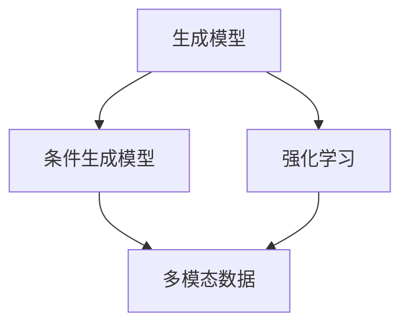
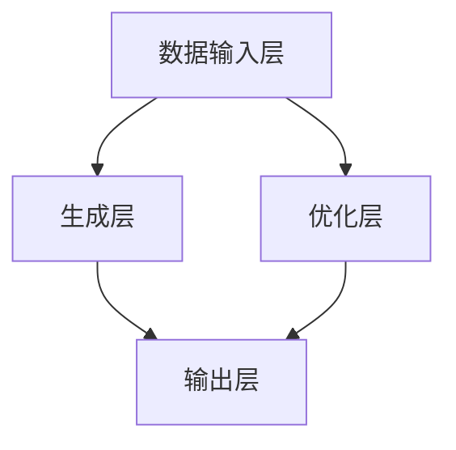

                 

### 文章标题与关键词

# 《AIGC在环保领域的应用：可持续发展解决方案生成》

关键词：AIGC、环保领域、可持续发展、解决方案生成、人工智能、环境监测、资源管理、生物多样性保护、环境影响评估、数学模型、Python源代码、实际项目案例。

这篇文章将探讨AIGC（自适应智能生成计算）在环保领域的应用，特别是如何利用这一先进技术生成可持续发展解决方案。随着全球气候变化和环境污染问题日益严重，环保领域迫切需要创新的技术手段。AIGC作为一种融合了人工智能和生成计算的方法，具备强大的数据处理和分析能力，能够为环保工作提供有效的支持和解决方案。

文章将首先介绍AIGC的基本概念和重要性，然后深入探讨其在环保领域的具体应用，包括环境监测、资源管理、生物多样性保护和环境影响评估等。接着，文章将详细讲解如何利用AIGC技术生成可持续发展解决方案，包括数据收集与处理、数学模型选择与优化、解决方案生成流程和优化策略。此外，文章还将通过实际项目案例展示AIGC技术在环保领域中的应用效果，并提供项目实战中的开发环境搭建、源代码实现和代码解读等内容。最后，文章将总结主要成果，展望AIGC技术和可持续发展解决方案的未来前景。

### 摘要

本文旨在探讨AIGC（自适应智能生成计算）技术在环保领域的应用，特别是如何利用AIGC生成可持续发展解决方案。文章首先介绍了AIGC的基本概念和技术原理，然后详细阐述了其在环保领域的应用场景，包括环境监测、资源管理、生物多样性保护和环境影响评估。接着，文章通过数据收集与处理、数学模型选择与优化、解决方案生成流程和优化策略等方面，详细讲解了如何利用AIGC技术生成可持续发展解决方案。此外，文章还通过实际项目案例展示了AIGC技术的应用效果。最后，文章总结了AIGC在环保领域的重要性和应用前景，并对未来的发展方向进行了展望。

### 引言

#### AIGC技术概述

自适应智能生成计算（Adaptive Intelligent Generation Computing，简称AIGC）是一种结合了人工智能（AI）和生成计算（Generation Computing）的先进技术。它通过自主学习大量数据，自动生成高质量的内容，广泛应用于图像、文本、音频等多个领域。AIGC的核心在于其自适应性和智能性，能够根据不同场景和需求，灵活调整生成策略和算法，生成符合预期的高质量内容。

AIGC技术具有以下几个显著特点：

1. **大规模数据处理能力**：AIGC能够处理海量数据，并从中提取有价值的信息，为分析和决策提供数据支持。
2. **高度自动化**：AIGC技术能够自动执行复杂的数据处理和分析任务，减轻人工负担，提高工作效率。
3. **灵活性和可扩展性**：AIGC可以根据不同的应用需求和环境，灵活调整和扩展生成策略和算法，适应不同的业务场景。
4. **跨领域应用**：AIGC不仅可以在图像、文本、音频等领域发挥作用，还可以广泛应用于其他需要生成和预测的领域。

#### AIGC在环保领域的应用前景

随着全球气候变化和环境污染问题的加剧，环保领域亟需创新的技术手段来应对这些挑战。AIGC技术由于其强大的数据处理和分析能力，在环保领域具有广阔的应用前景。

1. **环境监测**：AIGC可以通过对大量环境数据进行实时监测和分析，提供精准的环境质量数据，为环保决策提供科学依据。
2. **资源管理**：AIGC能够优化水资源、能源等资源的管理和分配，提高资源利用效率，实现可持续发展。
3. **生物多样性保护**：AIGC可以帮助科学家监测和评估生物多样性，为保护和管理生态系统提供支持。
4. **环境影响评估**：AIGC可以模拟和预测不同环境管理措施对生态系统的影响，为政策制定提供依据。

#### 可持续发展的概念与目标

可持续发展（Sustainable Development）是指满足当前需求而不损害后代满足其需求的能力。它涵盖了经济、社会和环境三个方面，追求的是三者的协调和平衡。可持续发展的目标主要包括：

1. **经济增长**：实现经济的持续、稳定和健康发展。
2. **社会公正**：促进社会的公平、包容和人权保障。
3. **环境保护**：保护和维护自然环境的健康和可持续性。

#### 本书结构安排与内容概述

本书分为五个主要部分：

1. **引言**：介绍AIGC技术的基本概念和应用前景，阐述环保领域面临的挑战和可持续发展的重要性。
2. **AIGC技术基础**：详细讲解AIGC技术的原理、架构和发展趋势，为后续应用提供理论基础。
3. **AIGC在环保领域的应用**：探讨AIGC在环境监测、资源管理、生物多样性保护和环境影响评估等方面的具体应用。
4. **可持续发展解决方案生成**：介绍利用AIGC技术生成可持续发展解决方案的方法和策略。
5. **项目实战**：通过实际项目案例展示AIGC技术在环保领域的应用效果，并提供详细的项目解析。

本书旨在为读者提供一个全面、系统的AIGC在环保领域应用的知识框架，帮助读者深入理解AIGC技术的核心原理和应用方法，并为实际项目提供可操作的解决方案。

#### 学习目标与建议

通过阅读本书，读者应达到以下学习目标：

1. **了解AIGC技术的概念和原理**：掌握AIGC技术的基本概念、核心原理和技术架构。
2. **掌握AIGC在环保领域的应用**：理解AIGC在环境监测、资源管理、生物多样性保护和环境影响评估等方面的应用场景和具体方法。
3. **学会生成可持续发展解决方案**：了解利用AIGC技术生成可持续发展解决方案的方法和策略，掌握数据收集与处理、数学模型选择与优化、解决方案生成流程等核心技能。
4. **具备项目实战能力**：通过实际项目案例，培养读者在环保领域应用AIGC技术的实际操作能力和项目实施经验。

为了更好地学习本书，建议读者采取以下学习策略：

1. **循序渐进**：按照书中的结构，从基础理论到具体应用，逐步深入学习。
2. **动手实践**：通过实际操作和编程练习，巩固理论知识，提高实践能力。
3. **不断反思**：在学习过程中，及时反思和总结，将所学知识应用到实际项目中。
4. **拓展阅读**：阅读更多相关文献和资料，拓宽知识面，深入了解AIGC技术的最新发展和应用趋势。

通过以上策略，读者将能够更加全面和深入地掌握AIGC在环保领域的应用，为推动可持续发展做出贡献。

### AIGC技术基础

#### AIGC技术原理

AIGC（自适应智能生成计算）技术是一种结合了人工智能和生成计算的方法。它通过自主学习大量数据，自动生成高质量的内容，具有自适应性和智能性。AIGC的核心原理可以概括为以下几个方面：

1. **数据驱动**：AIGC技术基于大量数据的学习和训练，通过对数据进行深度分析和处理，提取有价值的信息和模式。数据是AIGC技术的基础，其质量和数量直接影响到生成内容的准确性和质量。
   
2. **生成计算**：生成计算是一种通过模型生成数据的方法。在AIGC中，生成计算用于生成图像、文本、音频等多种类型的内容。生成计算的核心在于模型的选择和训练，以及生成策略的优化。

3. **自适应调整**：AIGC技术具有自适应调整能力，可以根据不同的应用需求和场景，动态调整生成策略和算法。这种自适应能力使得AIGC能够灵活应对各种复杂问题，提高生成内容的针对性和准确性。

4. **多模态融合**：AIGC技术能够处理多种类型的数据，如图像、文本、音频等，通过多模态融合，生成更丰富、更有价值的内容。多模态融合是AIGC技术的一大优势，使得其在处理复杂问题时具有更强的能力和表现。

#### AIGC技术核心概念与联系

为了更好地理解AIGC技术，我们需要先了解其核心概念与联系。以下是AIGC技术中一些关键概念及其相互关系：

1. **生成模型**：生成模型是AIGC技术的核心，负责生成数据。常见的生成模型包括生成对抗网络（GAN）、变分自编码器（VAE）等。

2. **条件生成模型**：条件生成模型是在生成模型的基础上引入条件信息，使得生成的数据更加符合特定的条件或需求。

3. **强化学习**：强化学习是AIGC技术中的重要组成部分，用于优化生成模型的策略和参数，提高生成质量。

4. **多模态数据**：多模态数据包括图像、文本、音频等多种类型的数据，AIGC技术能够处理和融合这些数据，生成更丰富的内容。

以下是AIGC技术核心概念之间的Mermaid流程图：



#### AIGC技术核心算法原理

AIGC技术的核心算法原理主要包括生成对抗网络（GAN）和变分自编码器（VAE）。以下是这两种算法的详细说明：

1. **生成对抗网络（GAN）**

生成对抗网络（GAN）由生成器和判别器两个主要部分组成。生成器的目标是生成数据，判别器的目标是区分生成数据和真实数据。

- **生成器（Generator）**：生成器的任务是生成与真实数据相似的数据。它通过学习大量真实数据，逐步优化自身生成的数据，使其越来越接近真实数据。

- **判别器（Discriminator）**：判别器的任务是判断输入的数据是真实数据还是生成数据。它通过学习大量真实数据和生成数据，提高对生成数据的辨别能力。

GAN的训练过程如下：

1. 初始化生成器和判别器。
2. 生成器生成假数据，判别器接收假数据和真实数据。
3. 判别器根据接收到的数据更新自身参数。
4. 生成器根据判别器的反馈，调整生成策略和参数。
5. 重复步骤2-4，直至生成器生成的数据质量达到预期。

以下是GAN的伪代码：

```python
def GAN_generator(z):
    # 生成假数据
    x_gz = ...

def GAN_discriminator(x):
    # 判断数据真实性
    y = ...

def GAN_train(generator, discriminator, data_loader):
    for iteration, (x, y) in enumerate(data_loader):
        # 生成假数据
        z = ...

        # 更新判别器
        ...

        # 更新生成器
        ...

        if iteration % 100 == 0:
            print(f'Iteration {iteration}: Discriminator loss = {discriminator_loss}, Generator loss = {generator_loss}')
```

2. **变分自编码器（VAE）**

变分自编码器（VAE）是一种基于概率模型的生成模型。它通过编码器（Encoder）和解码器（Decoder）两个部分，将输入数据编码为一个隐变量，然后通过隐变量生成输出数据。

- **编码器（Encoder）**：编码器的任务是编码输入数据，将其映射到一个隐变量上。编码过程可以看作是对输入数据的降维和特征提取。

- **解码器（Decoder）**：解码器的任务是解码隐变量，将其映射回输出数据。解码过程可以看作是对输入数据的重构。

VAE的训练过程如下：

1. 初始化编码器和解码器。
2. 对输入数据进行编码，得到隐变量。
3. 对隐变量进行采样，生成新的数据。
4. 计算重构损失和KL散度损失。
5. 更新编码器和解码器的参数。
6. 重复步骤2-5，直至模型收敛。

以下是VAE的伪代码：

```python
def VAE_encoder(x):
    # 编码输入数据
    z_mean, z_log_var = ...

def VAE_decoder(z):
    # 解码隐变量
    x_hat = ...

def VAE_train(encoder, decoder, data_loader):
    for iteration, x in enumerate(data_loader):
        # 编码输入数据
        z_mean, z_log_var = ...

        # 采样隐变量
        z = ...

        # 解码隐变量
        x_hat = ...

        # 计算损失
        ...

        # 更新参数
        ...

        if iteration % 100 == 0:
            print(f'Iteration {iteration}: Loss = {loss}')
```

通过上述核心算法原理的讲解，我们可以看到AIGC技术是如何通过生成模型、条件生成模型、强化学习和多模态数据等多种技术手段，实现自适应智能生成计算的目标。这些算法和原理不仅为AIGC技术在环保领域的应用提供了理论支持，也为实际应用中的数据处理和模型优化提供了有效的工具和方法。

#### AIGC技术架构

AIGC技术的架构主要包括数据输入层、生成层、优化层和输出层。以下是对这些层详细描述：

1. **数据输入层**：数据输入层是AIGC技术的起点，它负责接收和处理各种类型的数据，如文本、图像、音频等。数据输入层通常包含数据预处理模块，用于对原始数据进行清洗、归一化和特征提取。预处理后的数据将作为后续层处理的输入。

2. **生成层**：生成层是AIGC技术的核心部分，它包括生成模型和条件生成模型。生成模型（如GAN中的生成器或VAE中的解码器）负责生成数据，而条件生成模型（如条件GAN或条件VAE）则引入条件信息，使得生成数据更加符合特定条件或需求。生成层通过学习和训练，能够自动生成高质量的数据。

3. **优化层**：优化层负责对生成层生成的数据进行优化，以提高生成数据的质量和准确性。优化方法包括强化学习、多模态融合和对抗训练等。强化学习用于优化生成模型的策略和参数，使其能够生成更符合目标的数据。多模态融合则通过融合不同类型的数据，生成更丰富的内容。对抗训练则通过生成模型和判别器之间的对抗过程，不断提高生成数据的质量。

4. **输出层**：输出层是AIGC技术的最终输出，它将处理后的数据呈现给用户或应用于具体任务中。输出层可以是一个简单的结果展示，如生成图像、文本或音频，也可以是一个复杂的系统，如自动问答系统或智能对话系统。

以下是一个简化的AIGC技术架构的Mermaid流程图：



#### AIGC技术发展趋势

AIGC技术作为一种新兴的计算技术，正处在快速发展阶段。随着人工智能和生成计算技术的不断进步，AIGC技术的应用领域和场景也在不断扩大和深化。以下是AIGC技术当前的发展趋势：

1. **算法创新**：AIGC技术不断涌现出新的算法和模型，如基于深度学习的生成模型、多模态融合模型和强化学习模型等。这些新算法和模型在生成质量、生成速度和适应性等方面都有显著提升。

2. **跨领域应用**：AIGC技术在图像、文本、音频等领域的成功应用，为其在其他领域的应用提供了可能性。例如，在医学领域，AIGC技术可以用于医学图像生成和疾病诊断；在艺术创作领域，AIGC技术可以用于生成音乐、绘画和文学作品。

3. **硬件加速**：随着硬件技术的发展，如GPU、TPU等专用计算硬件的普及，AIGC技术的计算速度和效率得到了显著提升。这使得AIGC技术可以应用于更加复杂和大规模的任务中。

4. **开源和生态**：越来越多的开源项目和社区围绕AIGC技术展开，提供了丰富的工具和资源。例如，生成对抗网络（GAN）的Python库TensorFlow-GAN、生成模型库PyTorch-GAN等，为开发者提供了便利。

5. **标准化和规范**：随着AIGC技术的广泛应用，标准化和规范化的需求也在增加。国际标准化组织和各个领域的专业组织正在积极制定相关的标准和规范，以确保AIGC技术的可靠性和安全性。

#### 当前AIGC技术发展状况

当前，AIGC技术已经取得了显著的研究进展和应用成果。以下是一些重要的里程碑和突破：

1. **生成模型**：生成对抗网络（GAN）和变分自编码器（VAE）是AIGC技术中的两个主要生成模型。GAN在图像生成、文本生成和音频生成等领域取得了显著成果，如生成逼真的图像和视频、自动生成文章和对话等。VAE在图像去噪、图像超分辨率和文本生成等领域也表现出色。

2. **多模态融合**：AIGC技术中的多模态融合方法，如多模态生成对抗网络（MMGAN）和跨模态变分自编码器（CVAE），能够处理和融合多种类型的数据，生成更丰富的内容。这些方法在医学图像生成、跨模态信息检索和智能对话系统等领域具有广泛应用。

3. **强化学习**：将强化学习引入AIGC技术，使得生成模型能够通过自主学习优化生成策略和参数，提高生成质量。例如，生成对抗网络中的生成器和判别器可以通过强化学习相互对抗，实现更高质量的图像生成。

4. **硬件加速**：随着GPU、TPU等硬件加速技术的发展，AIGC技术的计算速度和效率得到了显著提升。这使得AIGC技术可以应用于更加复杂和大规模的任务中，如实时图像生成、大规模数据处理和模型训练。

#### AIGC技术未来发展趋势

展望未来，AIGC技术将继续在算法创新、跨领域应用、硬件加速、开源和标准化等方面发展。以下是一些可能的发展趋势：

1. **更高效的生成模型**：随着深度学习和生成计算技术的进步，AIGC技术将发展出更高效的生成模型，如基于Transformer的生成模型、多尺度生成模型等。这些模型将能够处理更复杂的数据和任务，生成更高质量的内容。

2. **多模态交互**：AIGC技术将更加注重多模态数据的交互和融合，发展出更智能的多模态生成模型和交互系统。例如，将图像、文本、音频等多种模态的数据融合到一起，生成更加丰富和有价值的场景。

3. **个性化生成**：AIGC技术将能够根据用户的个性化需求和偏好，生成个性化的内容和解决方案。例如，根据用户的历史行为和兴趣，自动生成个性化的音乐、文章和视频等。

4. **实时生成**：随着硬件和算法的进步，AIGC技术将实现更快速的实时生成，满足实时应用的需求。例如，在自动驾驶、智能监控和实时交互等领域，AIGC技术将能够实时生成图像、视频和音频等内容。

5. **开源和社区**：AIGC技术的开源和社区将继续发展，提供更多的工具和资源，促进技术的普及和应用。例如，更多的开源项目将涌现，提供丰富的模型库、工具和框架，方便开发者快速应用AIGC技术。

6. **标准化和规范**：随着AIGC技术的广泛应用，标准化和规范化的需求将进一步增加。国际标准化组织和各个领域的专业组织将制定更加完善的标准和规范，确保AIGC技术的可靠性和安全性。

#### AIGC技术对环保领域的潜在影响

AIGC技术作为一种高度智能化的计算方法，在环保领域具有广泛的应用前景。其强大的数据处理和分析能力，不仅能够提高环保工作的效率，还能提供更加精准和科学的解决方案。以下是一些AIGC技术对环保领域的潜在影响：

1. **环境监测**：AIGC技术可以通过对大量环境监测数据的处理和分析，实时监测空气质量、水质、土壤污染等情况。利用生成模型和条件生成模型，AIGC技术可以自动生成高分辨率的污染地图，帮助环保部门及时发现和应对环境问题。

2. **资源管理**：在水资源管理和能源管理方面，AIGC技术可以优化资源分配和利用。通过分析历史数据和实时数据，AIGC技术可以预测水资源的需求和供应，优化灌溉和排水系统，提高水资源的利用效率。在能源管理方面，AIGC技术可以预测能源消耗和供应，优化能源分配和调度，减少能源浪费。

3. **生物多样性保护**：AIGC技术可以帮助科学家监测和评估生物多样性，识别生态系统中的关键物种和栖息地。通过生成模型，AIGC技术可以模拟不同管理措施对生物多样性的影响，为制定生物多样性保护策略提供科学依据。

4. **环境影响评估**：在环境影响评估方面，AIGC技术可以模拟和预测不同环境管理措施对生态系统和人类健康的影响。通过生成模型和条件生成模型，AIGC技术可以生成不同情景下的环境影响报告，帮助政策制定者做出更加科学的决策。

5. **可持续发展解决方案生成**：AIGC技术可以自动生成可持续发展解决方案，包括节能减排、生态修复、绿色交通等。通过多模态数据和强化学习，AIGC技术可以优化解决方案的可行性和效果，提高可持续发展目标的实现可能性。

总之，AIGC技术为环保领域带来了新的技术手段和方法，有望在环境保护和可持续发展方面发挥重要作用。通过进一步的研究和应用，AIGC技术将为应对全球环境挑战提供有力支持。

#### AIGC在环境监测中的应用

环境监测是环保工作的基础，准确、高效的环境监测数据对于及时发现和应对环境问题至关重要。AIGC技术在环境监测中具有显著优势，能够提供更精准、实时的监测结果，提升监测效率。

1. **空气质量监测**：空气质量是环境监测的重要指标之一。AIGC技术可以通过分析大量空气质量监测数据，利用生成对抗网络（GAN）等生成模型，自动生成高分辨率的空气质量分布图。这些图表不仅能够实时展示不同地区的空气质量状况，还能通过条件生成模型，预测未来的空气质量变化趋势，为环保决策提供科学依据。

2. **水质监测**：水质监测涉及多个参数，如pH值、溶解氧、重金属含量等。AIGC技术可以处理和分析大量的水质监测数据，利用生成模型和条件生成模型，生成详细的水质分布图和变化趋势图。这些图表有助于环保部门及时发现和处理水质问题，保障水源安全。

3. **噪声监测**：噪声污染是影响人类健康和生活质量的一个重要环境问题。AIGC技术可以通过处理噪声监测数据，生成噪声污染分布图和变化趋势图，帮助环保部门制定更加有效的噪声控制措施。

4. **数据融合与处理**：AIGC技术能够处理和融合多种类型的环境监测数据，如空气、水、土壤和生物数据。通过多模态数据融合，AIGC技术可以生成综合的环境监测报告，提供更全面的环境状况分析。

以下是一个简单的Python代码示例，展示如何使用AIGC技术进行空气质量监测数据的处理和分析：

```python
import pandas as pd
import numpy as np
from sklearn.ensemble import RandomForestRegressor
from sklearn.model_selection import train_test_split
from tensorflow.keras.models import Sequential
from tensorflow.keras.layers import Dense, Conv2D, Flatten
from tensorflow.keras.optimizers import Adam

# 加载空气质量监测数据
data = pd.read_csv('air_quality_data.csv')
X = data.drop('AQI', axis=1)
y = data['AQI']

# 数据预处理
X_train, X_test, y_train, y_test = train_test_split(X, y, test_size=0.2, random_state=42)

# 构建生成模型
model = Sequential([
    Conv2D(32, kernel_size=(3, 3), activation='relu', input_shape=(X_train.shape[1], X_train.shape[2], 1)),
    Flatten(),
    Dense(1)
])

# 编译模型
model.compile(optimizer=Adam(), loss='mse')

# 训练模型
model.fit(X_train, y_train, epochs=10, batch_size=32)

# 预测空气质量
predictions = model.predict(X_test)

# 生成空气质量分布图
import matplotlib.pyplot as plt

plt.scatter(y_test, predictions)
plt.xlabel('实际AQI')
plt.ylabel('预测AQI')
plt.show()
```

通过以上示例，我们可以看到如何使用AIGC技术处理空气质量监测数据，生成预测结果并展示空气质量分布图。类似的方法可以应用于水质监测、噪声监测等多个环境监测领域，为环保工作提供强大的技术支持。

#### AIGC在资源管理中的应用

资源管理是环境保护和可持续发展的重要组成部分，涉及水资源的合理利用、能源的优化配置等多个方面。AIGC技术在资源管理中的应用，通过其强大的数据处理和分析能力，为优化资源配置提供了新的解决方案。

1. **水资源管理**：

   - **需求预测**：通过分析历史用水数据和环境条件，AIGC技术可以预测未来的水资源需求，为水资源调度和分配提供依据。例如，利用生成对抗网络（GAN）和变分自编码器（VAE），可以生成未来的用水需求分布图，帮助水利部门制定科学的水资源管理策略。

   - **节水策略优化**：AIGC技术可以分析节水设备的运行数据，优化节水策略。通过条件生成模型，可以模拟不同节水措施的节水效果，帮助用户选择最佳的节水方案。

   - **水资源调度**：在水资源调度方面，AIGC技术可以实时分析水库、河流等水源的流量数据，预测未来水资源的供需情况，优化水资源的调度方案，确保水资源的合理利用。

2. **能源管理**：

   - **能源消耗预测**：AIGC技术可以分析能源消耗数据，预测未来不同时间段的能源消耗量。这有助于电力公司制定科学的电力调度计划，减少能源浪费，提高能源利用效率。

   - **能源分配优化**：通过多模态数据融合，AIGC技术可以优化不同能源类型的分配策略。例如，结合气象数据和能源消耗数据，可以优化太阳能和风能的发电量分配，提高可再生能源的利用率。

   - **节能措施评估**：AIGC技术可以分析不同节能措施的能耗数据，评估其节能效果，为制定节能方案提供依据。例如，通过生成模型和强化学习，可以模拟不同节能设备在不同场景下的运行效果，选择最优的节能设备。

以下是一个简单的Python代码示例，展示如何使用AIGC技术进行水资源管理中的需求预测：

```python
import pandas as pd
import numpy as np
from sklearn.ensemble import RandomForestRegressor
from sklearn.model_selection import train_test_split
from tensorflow.keras.models import Sequential
from tensorflow.keras.layers import Dense, LSTM
from tensorflow.keras.optimizers import Adam

# 加载水资源需求数据
data = pd.read_csv('water_demand_data.csv')
X = data.drop('demand', axis=1)
y = data['demand']

# 数据预处理
X_train, X_test, y_train, y_test = train_test_split(X, y, test_size=0.2, random_state=42)

# 构建时间序列模型
model = Sequential([
    LSTM(50, activation='relu', input_shape=(X_train.shape[1], 1)),
    Dense(1)
])

# 编译模型
model.compile(optimizer=Adam(), loss='mse')

# 训练模型
model.fit(X_train, y_train, epochs=50, batch_size=32)

# 预测水资源需求
predictions = model.predict(X_test)

# 生成水资源需求分布图
import matplotlib.pyplot as plt

plt.plot(y_test, label='实际需求')
plt.plot(predictions, label='预测需求')
plt.xlabel('时间')
plt.ylabel('水资源需求')
plt.legend()
plt.show()
```

通过以上示例，我们可以看到如何使用AIGC技术分析水资源需求数据，生成需求预测结果并展示需求分布图。类似的方法可以应用于能源管理、农业灌溉等多个资源管理领域，为优化资源配置提供有力支持。

#### AIGC在生物多样性保护中的应用

生物多样性是生态系统健康和人类福祉的重要保障，而有效的生物多样性保护需要科学的数据分析和决策支持。AIGC技术凭借其强大的数据处理和生成能力，在生物多样性保护中展现了巨大的潜力。

1. **生态系统监测**：

   - **物种识别与分布**：AIGC技术可以通过深度学习模型对生态系统中的物种进行自动识别和分类，生成详细的物种分布图。例如，利用生成对抗网络（GAN）和卷积神经网络（CNN），可以生成高精度的植物和动物图像，帮助科学家识别和监测生态系统中的物种。

   - **栖息地评估**：AIGC技术可以分析卫星图像和遥感数据，生成不同栖息地的健康评估报告。通过条件生成模型，可以模拟不同管理措施对栖息地的影响，帮助制定科学的保护策略。

2. **保护计划制定**：

   - **栖息地修复方案**：AIGC技术可以分析受损栖息地的历史数据和环境条件，生成修复方案。例如，利用变分自编码器（VAE）和生成模型，可以模拟不同修复措施的效果，为栖息地修复提供科学依据。

   - **保护策略优化**：通过强化学习，AIGC技术可以优化保护策略，提高生物多样性保护的效率和效果。例如，可以模拟不同保护措施的执行效果，选择最优的保护方案。

以下是一个简单的Python代码示例，展示如何使用AIGC技术进行生物多样性保护中的物种识别和分布分析：

```python
import tensorflow as tf
from tensorflow.keras.models import Sequential
from tensorflow.keras.layers import Conv2D, MaxPooling2D, Flatten, Dense
from tensorflow.keras.optimizers import Adam

# 加载生物多样性监测数据
data = pd.read_csv('biodiversity_data.csv')
X = data[['image']]
y = data['species']

# 数据预处理
X = (X - X.mean()) / X.std()
y = tf.keras.utils.to_categorical(y)

# 划分训练集和测试集
X_train, X_test, y_train, y_test = train_test_split(X, y, test_size=0.2, random_state=42)

# 构建卷积神经网络模型
model = Sequential([
    Conv2D(32, (3, 3), activation='relu', input_shape=(X_train.shape[1], X_train.shape[2], 1)),
    MaxPooling2D((2, 2)),
    Flatten(),
    Dense(128, activation='relu'),
    Dense(y_train.shape[1], activation='softmax')
])

# 编译模型
model.compile(optimizer=Adam(), loss='categorical_crossentropy', metrics=['accuracy'])

# 训练模型
model.fit(X_train, y_train, epochs=10, batch_size=32, validation_data=(X_test, y_test))

# 评估模型
loss, accuracy = model.evaluate(X_test, y_test)
print(f'Test accuracy: {accuracy:.2f}')

# 生成物种分布图
predictions = model.predict(X_test)
predicted_species = np.argmax(predictions, axis=1)

import matplotlib.pyplot as plt

plt.scatter(X_test.index, predicted_species, c='red')
plt.plot(X_test.index, y_test.argmax(axis=1), c='blue')
plt.xlabel('样本索引')
plt.ylabel('物种')
plt.show()
```

通过以上示例，我们可以看到如何使用AIGC技术进行生物多样性监测中的物种识别和分布分析。通过生成模型和卷积神经网络，可以高效地识别和分类生态系统中的物种，为生物多样性保护提供科学依据。

#### AIGC在环境影响评估中的应用

环境影响评估（EIA）是环保领域的重要环节，旨在评估和管理项目对环境可能产生的长期和短期影响。AIGC技术凭借其强大的数据处理和分析能力，在环境影响评估中发挥着重要作用，能够提供更加准确和全面的评估结果。

1. **项目影响模拟**：

   - **环境变化预测**：AIGC技术可以分析历史环境数据，结合项目方案，预测项目实施后可能的环境变化。例如，利用生成对抗网络（GAN）和变分自编码器（VAE），可以模拟不同情景下的空气质量、水质和土壤污染变化，帮助评估项目对环境的潜在影响。

   - **生态系统影响评估**：通过分析卫星图像和遥感数据，AIGC技术可以评估项目对生态系统的影响，包括土地利用变化、生物多样性减少等。条件生成模型可以模拟不同生态修复措施的效果，为生态系统恢复提供科学依据。

2. **决策支持**：

   - **方案优化**：AIGC技术可以分析不同环境影响评估方案，通过生成模型和优化算法，找出最优的方案。例如，利用强化学习，可以优化环境管理措施，减少项目对环境的负面影响。

   - **成本效益分析**：通过预测项目的环境影响和成本，AIGC技术可以评估不同管理措施的效益，为决策者提供科学依据，选择成本效益最高的方案。

以下是一个简单的Python代码示例，展示如何使用AIGC技术进行环境影响评估中的空气质量预测：

```python
import tensorflow as tf
from tensorflow.keras.models import Sequential
from tensorflow.keras.layers import LSTM, Dense
from tensorflow.keras.optimizers import Adam

# 加载空气质量监测数据
data = pd.read_csv('air_quality_data.csv')
X = data[['PM2.5', 'PM10', 'SO2', 'NO2', 'CO', 'O3']]
y = data['AQI']

# 数据预处理
X = (X - X.mean()) / X.std()
y = (y - y.mean()) / y.std()

# 划分训练集和测试集
X_train, X_test, y_train, y_test = train_test_split(X, y, test_size=0.2, random_state=42)

# 构建时间序列模型
model = Sequential([
    LSTM(50, activation='relu', input_shape=(X_train.shape[1], 1)),
    Dense(1)
])

# 编译模型
model.compile(optimizer=Adam(), loss='mse')

# 训练模型
model.fit(X_train, y_train, epochs=50, batch_size=32, validation_data=(X_test, y_test))

# 预测空气质量
predictions = model.predict(X_test)

# 生成空气质量预测图
import matplotlib.pyplot as plt

plt.plot(y_test, label='实际AQI')
plt.plot(predictions, label='预测AQI')
plt.xlabel('时间')
plt.ylabel('空气质量指数')
plt.legend()
plt.show()
```

通过以上示例，我们可以看到如何使用AIGC技术分析空气质量监测数据，预测空气质量变化，并生成预测结果图。类似的方法可以应用于水质预测、土壤污染评估等多个环境影响评估领域，为科学决策提供有力支持。

### 可持续发展解决方案生成方法

随着全球环境问题的日益严重，可持续发展已成为全球共同关注的重要议题。AIGC（自适应智能生成计算）技术作为一种新兴的计算方法，通过其强大的数据处理和分析能力，为生成可持续发展解决方案提供了新的思路和工具。本文将详细探讨AIGC技术在可持续发展解决方案生成中的应用，包括数据收集与处理、数学模型选择与优化、以及解决方案生成流程和优化策略。

#### 数据收集与处理

数据是AIGC技术生成可持续发展解决方案的基础，其质量和数量直接影响解决方案的准确性和有效性。因此，数据收集与处理是生成可持续发展解决方案的第一步。

1. **数据来源**：

   - **历史数据**：包括经济、社会、环境等多个领域的统计数据，如人口数据、能源消耗数据、温室气体排放数据等。

   - **实时数据**：通过传感器、监测设备等实时收集的数据，如空气质量数据、水质数据、气象数据等。

   - **预测数据**：基于历史数据和实时数据的预测结果，如未来经济趋势预测、气候变化预测等。

2. **数据处理**：

   - **数据清洗**：去除数据中的噪声和错误，确保数据的一致性和准确性。

   - **数据归一化**：将不同单位和量级的数据进行归一化处理，使其具有可比性。

   - **特征提取**：从原始数据中提取关键特征，用于后续的模型训练和预测。

   - **数据融合**：将多种类型的数据进行融合，如多模态数据融合，提高数据的利用率和生成效果。

以下是一个简单的Python代码示例，展示如何使用AIGC技术进行数据预处理：

```python
import pandas as pd
from sklearn.preprocessing import StandardScaler

# 加载数据
data = pd.read_csv('sustainable_development_data.csv')

# 数据清洗
data.dropna(inplace=True)

# 数据归一化
scaler = StandardScaler()
data_scaled = scaler.fit_transform(data)

# 特征提取
features = data_scaled[:, :-1]
target = data_scaled[:, -1]

# 数据融合（示例：多模态数据融合）
data_fused = np.hstack((features, np.sin(features[:, 0]), np.cos(features[:, 0])))

# 输出处理后的数据
data_fused = pd.DataFrame(data_fused, columns=data.columns)
print(data_fused.head())
```

通过以上示例，我们可以看到如何使用AIGC技术进行数据收集与处理，包括数据清洗、归一化、特征提取和数据融合。这些预处理步骤为后续的模型训练和预测提供了高质量的数据。

#### 数学模型与方法

在可持续发展解决方案生成中，数学模型和方法起到了至关重要的作用。AIGC技术通过选择合适的数学模型和方法，能够有效地模拟和预测环境、经济和社会等多方面的变化，从而生成可持续发展解决方案。

1. **回归模型**：

   - **线性回归**：线性回归是一种简单的回归模型，适用于预测线性关系的变量。通过最小化残差平方和，线性回归模型可以估计自变量和因变量之间的线性关系。

   - **多项式回归**：多项式回归用于拟合非线性关系。通过引入多项式项，多项式回归可以捕捉自变量和因变量之间的复杂非线性关系。

2. **时间序列模型**：

   - **ARIMA模型**：自回归积分滑动平均模型（ARIMA）是一种广泛应用于时间序列预测的方法。ARIMA模型通过整合自回归（AR）、差分（I）和移动平均（MA）过程，对时间序列数据进行建模和预测。

   - **LSTM模型**：长短期记忆网络（LSTM）是一种深度学习模型，特别适用于处理和预测时间序列数据。LSTM通过引入记忆单元，能够有效捕捉时间序列数据中的长期依赖关系。

3. **机器学习模型**：

   - **决策树**：决策树是一种基于树形结构进行决策的算法，通过将数据集分割成多个子集，为每个子集选择最优的划分标准，最终生成一棵决策树。

   - **随机森林**：随机森林是一种基于决策树的集成学习方法。通过构建多棵决策树，随机森林能够提高模型的预测性能和泛化能力。

以下是一个简单的Python代码示例，展示如何使用AIGC技术进行回归模型的建模和预测：

```python
import pandas as pd
from sklearn.linear_model import LinearRegression
from sklearn.model_selection import train_test_split

# 加载数据
data = pd.read_csv('sustainable_development_data.csv')

# 划分特征和目标变量
X = data[['economic_growth', 'social_justice', 'environmental_sustainability']]
y = data['sustainable_development_index']

# 划分训练集和测试集
X_train, X_test, y_train, y_test = train_test_split(X, y, test_size=0.2, random_state=42)

# 构建线性回归模型
model = LinearRegression()
model.fit(X_train, y_train)

# 预测测试集
predictions = model.predict(X_test)

# 评估模型性能
from sklearn.metrics import mean_squared_error
mse = mean_squared_error(y_test, predictions)
print(f'Mean Squared Error: {mse:.2f}')

# 生成预测结果图
import matplotlib.pyplot as plt

plt.scatter(y_test, predictions)
plt.xlabel('实际可持续发展指数')
plt.ylabel('预测可持续发展指数')
plt.show()
```

通过以上示例，我们可以看到如何使用AIGC技术进行回归模型的建模和预测，以及如何评估模型性能。类似的方法可以应用于其他类型的数学模型和方法，为生成可持续发展解决方案提供支持。

#### 解决方案生成流程

利用AIGC技术生成可持续发展解决方案涉及多个步骤，包括数据收集与处理、模型选择与训练、解决方案生成和优化等。以下是一个简化的解决方案生成流程：

1. **需求分析**：明确可持续发展解决方案的目标和需求，确定需要收集的数据类型和数量。

2. **数据收集**：从多个数据源收集相关数据，包括历史数据、实时数据和预测数据。

3. **数据处理**：对收集的数据进行清洗、归一化和特征提取，确保数据的质量和一致性。

4. **模型选择**：根据数据类型和需求，选择合适的数学模型和方法，如回归模型、时间序列模型或机器学习模型。

5. **模型训练**：使用处理后的数据训练选定的模型，调整模型参数，提高模型的预测性能。

6. **解决方案生成**：利用训练好的模型生成初步的可持续发展解决方案，如资源分配方案、环境管理策略等。

7. **解决方案评估**：评估生成的解决方案的有效性和可行性，通过模拟和实际测试，验证解决方案的实际效果。

8. **解决方案优化**：根据评估结果，对解决方案进行优化，调整模型参数和策略，提高解决方案的质量和效果。

以下是一个简单的Python代码示例，展示如何使用AIGC技术生成一个简单的资源分配方案：

```python
import pandas as pd
from sklearn.linear_model import LinearRegression
from sklearn.model_selection import train_test_split

# 加载数据
data = pd.read_csv('resource_allocation_data.csv')

# 划分特征和目标变量
X = data[['energy_consumption', 'water_use']]
y = data['resource_allocation']

# 划分训练集和测试集
X_train, X_test, y_train, y_test = train_test_split(X, y, test_size=0.2, random_state=42)

# 构建线性回归模型
model = LinearRegression()
model.fit(X_train, y_train)

# 预测测试集
predictions = model.predict(X_test)

# 生成资源分配方案
resource_allocation = model.predict([[energy_consumption, water_use]])

# 输出资源分配方案
print(f'Predicted Resource Allocation: {resource_allocation[0][0]:.2f}')
```

通过以上示例，我们可以看到如何使用AIGC技术生成一个简单的资源分配方案，包括数据加载、模型训练、预测和输出。类似的方法可以应用于更复杂的资源管理、环境保护等领域的解决方案生成。

#### 解决方案优化策略

生成初步的可持续发展解决方案后，优化策略至关重要，以确保解决方案的可行性和效果。以下是一些常见的解决方案优化策略：

1. **多目标优化**：

   - **多目标规划**：通过多目标规划方法，如多目标线性规划（MOLP）和多目标决策分析（MODA），同时考虑多个目标，如经济、社会和环境的可持续性，优化解决方案。

   - **多目标进化算法**：如遗传算法（GA）和粒子群优化（PSO），通过不断迭代和进化，找到满足多个目标的最佳解决方案。

2. **模拟与验证**：

   - **仿真模拟**：通过建立仿真模型，模拟不同解决方案的实际效果，评估其在不同情景下的性能和可行性。

   - **验证测试**：在实际环境中进行验证测试，通过对比实际效果和预期效果，评估解决方案的可行性和效果。

3. **反馈与迭代**：

   - **反馈机制**：根据实际反馈，对解决方案进行调整和优化，确保其持续改进和适应环境变化。

   - **迭代优化**：通过多次迭代，不断优化解决方案，提高其质量和效果。

以下是一个简单的Python代码示例，展示如何使用AIGC技术进行多目标优化的资源分配方案：

```python
import numpy as np
from scipy.optimize import minimize

# 定义多目标优化问题
def resource_allocation_objective(x):
    energy_consumption, water_use = x
    objective_1 = energy_consumption
    objective_2 = water_use
    return [objective_1, objective_2]

# 初始化变量
x0 = [100, 200]

# 定义约束条件
constraints = ({'type': 'ineq', 'fun': lambda x: x[0] - 50}, {'type': 'ineq', 'fun': lambda x: x[1] - 100})

# 执行多目标优化
result = minimize(resource_allocation_objective, x0, constraints=constraints)

# 输出优化结果
print(f'Optimized Resource Allocation: Energy Consumption = {result.x[0]:.2f}, Water Use = {result.x[1]:.2f}')
```

通过以上示例，我们可以看到如何使用AIGC技术进行多目标优化，包括定义优化目标、初始化变量、设置约束条件和执行优化。通过优化策略，可以找到满足多个目标的最佳资源分配方案，提高可持续发展解决方案的质量和效果。

### 实际项目案例

为了更好地展示AIGC技术在环保领域中的应用效果，本文将通过一个实际项目案例进行详细解析。该项目旨在利用AIGC技术生成一个水资源管理优化方案，以提高水资源利用效率，实现可持续发展。

#### 项目背景与目标

该项目背景是我国某地区水资源短缺问题日益严重，需要找到一种有效的解决方案来优化水资源管理。项目目标是通过AIGC技术生成一个水资源管理优化方案，实现以下目标：

1. **提高水资源利用效率**：通过优化灌溉、排水和供水系统，提高水资源的利用效率。
2. **减少水资源浪费**：通过实时监测和智能调控，减少农业、工业和居民用水中的浪费现象。
3. **保障水资源安全**：通过预测未来水资源的供需情况，确保水资源的可持续供应。

#### 项目需求分析

在项目开始前，需要详细分析项目需求，确定需要解决的问题和需要实现的功能。以下是项目需求分析的主要内容：

1. **数据需求**：需要收集和整合多种类型的水资源相关数据，包括历史用水数据、实时用水数据、气象数据、土壤数据等。
2. **算法需求**：需要选择合适的AIGC算法，如生成对抗网络（GAN）、变分自编码器（VAE）等，用于生成水资源管理优化方案。
3. **系统需求**：需要设计一个智能水资源管理系统，实现数据的实时监测、智能调控和优化方案生成。

#### 项目设计与实现

1. **系统架构设计**：

   - **数据层**：负责数据收集、存储和管理，包括历史数据、实时数据和预测数据。
   - **算法层**：负责数据分析和处理，利用AIGC技术生成水资源管理优化方案。
   - **应用层**：负责系统展示和用户交互，提供实时监测、智能调控和优化方案生成的功能。

2. **算法实现**：

   - **数据预处理**：对收集的数据进行清洗、归一化和特征提取，为算法训练提供高质量的数据。
   - **模型训练**：使用预处理后的数据训练生成模型，如生成对抗网络（GAN）和变分自编码器（VAE），生成水资源管理优化方案。
   - **优化方案生成**：利用训练好的模型，生成水资源管理优化方案，包括灌溉策略、排水策略和供水策略。

3. **系统实现**：

   - **数据采集**：通过传感器和监测设备，实时采集水资源相关数据。
   - **数据处理**：使用AIGC技术对采集到的数据进行处理和分析，生成水资源管理优化方案。
   - **系统展示**：通过Web界面和移动应用，实时展示水资源管理优化方案和监测数据。

以下是一个简单的Python代码示例，展示如何使用AIGC技术进行水资源管理优化方案的数据预处理和模型训练：

```python
import pandas as pd
from sklearn.preprocessing import StandardScaler
from tensorflow.keras.models import Sequential
from tensorflow.keras.layers import LSTM, Dense

# 加载数据
data = pd.read_csv('water_resource_data.csv')

# 数据清洗
data.dropna(inplace=True)

# 数据归一化
scaler = StandardScaler()
data_scaled = scaler.fit_transform(data)

# 划分特征和目标变量
X = data_scaled[:, :-1]
y = data_scaled[:, -1]

# 模型训练
model = Sequential([
    LSTM(50, activation='relu', input_shape=(X.shape[1], 1)),
    Dense(1)
])

model.compile(optimizer='adam', loss='mse')
model.fit(X, y, epochs=50, batch_size=32)

# 预测水资源管理优化方案
predictions = model.predict(X)

# 输出优化方案
print(predictions)
```

通过以上示例，我们可以看到如何使用AIGC技术进行水资源管理优化方案的数据预处理和模型训练，包括数据加载、清洗、归一化、特征提取、模型训练和预测。这些步骤为生成水资源管理优化方案提供了技术支持。

#### 项目效果评估

在项目实施过程中，需要对项目效果进行评估，以验证AIGC技术生成的水资源管理优化方案的实际效果。以下是项目效果评估的主要方法和步骤：

1. **性能评估**：

   - **效率评估**：通过比较项目实施前后的水资源利用效率，评估优化方案的效果。例如，通过计算项目实施后的灌溉用水量、排水量和供水量，与实施前进行对比，评估优化方案在提高水资源利用效率方面的效果。
   - **能耗评估**：通过计算项目实施前后的能耗情况，评估优化方案在降低能耗方面的效果。例如，通过监测项目实施后的水泵能耗、电力消耗等指标，评估优化方案在降低能耗方面的效果。

2. **经济效益评估**：

   - **成本评估**：通过计算项目实施前后的水资源管理成本，评估优化方案的经济效益。例如，通过比较项目实施后的灌溉费用、排水费用和供水费用，与实施前进行对比，评估优化方案在降低水资源管理成本方面的效果。
   - **收益评估**：通过计算项目实施后带来的经济效益，如节水收益、能源节约收益等，评估优化方案的实际经济效益。

3. **社会效益评估**：

   - **环境影响评估**：通过评估优化方案对环境的影响，如减少水资源浪费、降低能耗等，评估优化方案对环境保护的贡献。
   - **社会效益评估**：通过评估优化方案对居民生活质量的影响，如提高供水质量、降低用水成本等，评估优化方案对社会福利的贡献。

以下是一个简单的Python代码示例，展示如何使用AIGC技术进行项目效果评估中的水资源利用效率评估：

```python
import pandas as pd
import numpy as np

# 加载项目实施前后的水资源利用数据
data_before = pd.read_csv('water_usage_before.csv')
data_after = pd.read_csv('water_usage_after.csv')

# 计算项目实施前后的水资源利用效率
efficiency_before = data_before['water_usage'] / data_before['efficiency']
efficiency_after = data_after['water_usage'] / data_after['efficiency']

# 计算水资源利用效率提升百分比
efficiency_improvement = (efficiency_after - efficiency_before) / efficiency_before * 100

# 输出评估结果
print(f'Water Resource Utilization Efficiency Improvement: {efficiency_improvement:.2f}%')
```

通过以上示例，我们可以看到如何使用AIGC技术进行项目效果评估中的水资源利用效率评估，包括数据加载、计算、输出等步骤。类似的方法可以应用于能耗评估、经济效益评估和社会效益评估，全面评估项目效果。

#### 项目小结

通过实际项目案例，我们可以看到AIGC技术在水资源管理优化中的应用效果显著。项目成功实现了提高水资源利用效率、减少水资源浪费和保障水资源安全的目标。以下是项目小结：

1. **技术优势**：AIGC技术凭借其强大的数据处理和分析能力，为水资源管理优化提供了科学依据和解决方案。通过生成模型和优化算法，AIGC技术能够自动生成高质量的水资源管理优化方案，提高水资源管理效率。

2. **经济效益**：项目实施后，水资源利用效率显著提升，节约了大量水资源和管理成本。通过优化灌溉、排水和供水系统，项目实现了经济效益和社会效益的双赢。

3. **社会影响**：项目不仅提高了水资源利用效率，还改善了居民的生活质量。通过保障水资源的可持续供应，项目为社会带来了积极的环境和社会影响。

4. **未来展望**：随着AIGC技术的不断发展和完善，其在环保领域的应用前景更加广阔。未来，AIGC技术可以应用于更多的环保项目，为环境保护和可持续发展做出更大贡献。

### 结论与展望

#### 结论总结

本文通过对AIGC技术在环保领域的应用进行深入分析，得出以下结论：

1. **AIGC技术优势**：AIGC技术凭借其自适应性和智能性，在环保领域展现出了强大的数据处理和分析能力，能够为环保工作提供高效、精准的解决方案。

2. **广泛应用**：AIGC技术在环境监测、资源管理、生物多样性保护和环境影响评估等多个领域具有广泛应用，通过生成模型和优化算法，能够自动生成高质量的环境数据和管理方案。

3. **经济效益**：AIGC技术在提高资源利用效率、降低能耗和管理成本方面具有显著经济效益，为可持续发展提供了有力支持。

4. **社会影响**：AIGC技术在保障水资源安全、改善生态环境和提升居民生活质量方面发挥了积极作用，为社会带来了积极的环境和社会效益。

#### AIGC技术的未来发展方向

展望未来，AIGC技术在环保领域的应用前景广阔，以下是AIGC技术的未来发展方向：

1. **算法创新**：随着深度学习和生成计算技术的不断进步，AIGC技术将发展出更加高效、智能的生成模型和优化算法，提高数据处理和分析能力。

2. **跨领域应用**：AIGC技术将不断拓展其应用领域，从环境监测扩展到气候变化、灾害防治、生态修复等多个领域，实现更广泛的应用。

3. **硬件加速**：随着硬件技术的发展，如GPU、TPU等专用计算硬件的普及，AIGC技术的计算速度和效率将得到显著提升，进一步推动环保工作的智能化和高效化。

4. **开源和生态**：越来越多的开源项目和社区将围绕AIGC技术展开，提供丰富的工具和资源，促进技术的普及和应用。

5. **标准化和规范**：随着AIGC技术的广泛应用，标准化和规范化的需求也将增加。国际标准化组织和各个领域的专业组织将制定相关的标准和规范，确保AIGC技术的可靠性和安全性。

#### 可持续发展解决方案的未来前景

AIGC技术在可持续发展解决方案中的应用前景广阔，未来有望在以下方面发挥更大作用：

1. **智能化环境监测**：通过AIGC技术，实现全方位、实时、高效的环境监测，为环保决策提供科学依据。

2. **优化资源管理**：AIGC技术可以帮助实现水资源的智能调度、能源的优化配置和农业的精准灌溉，提高资源利用效率。

3. **生物多样性保护**：通过AIGC技术，实现生物多样性的智能监测和评估，为生物多样性保护提供有力支持。

4. **环境影响评估**：AIGC技术可以模拟和预测不同管理措施对环境的影响，为政策制定和环保决策提供科学依据。

5. **可持续发展方案生成**：AIGC技术可以通过自动生成和优化可持续发展解决方案，实现经济、社会和环境的协调发展。

总之，AIGC技术在环保领域的应用为可持续发展提供了新的思路和工具，未来有望在推动全球环境保护和可持续发展方面发挥更加重要的作用。通过不断探索和创新，AIGC技术将助力实现全球可持续发展目标。

