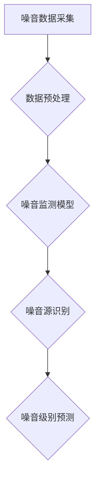

                 

### AIGC在环境声学中的应用：噪音污染分析提示词

#### 关键词
- AIGC
- 环境声学
- 噪音污染
- 神经网络
- 卷积神经网络（CNN）
- 生成对抗网络（GAN）
- 数学模型
- 噪音预测
- 噪音控制

#### 摘要
本文深入探讨AIGC（自适应智能生成控制）在环境声学领域中的应用，尤其是噪音污染的分析。文章首先介绍了AIGC的基本概念及其与环境声学的联系，随后详细阐述了噪音污染的定义、分类及其对人体健康的影响。通过核心算法原理的讲解，包括神经网络、CNN和GAN的介绍，我们进一步探讨了如何利用这些算法进行噪音监测、识别和预测。文章还通过实际案例展示了如何应用这些技术进行噪音污染分析和预测，并提出了一些智能噪音控制的最佳实践和未来展望。文章旨在为读者提供一个全面、易懂的AIGC在环境声学中应用的指南。

### 第一部分：AIGC与环境声学基础

#### AIGC概念与原理

AIGC（Adaptive Intelligent Generative Control）是一种结合了人工智能（AI）和生成控制（GC）的方法，它通过自我学习和调整来优化系统性能。AIGC的核心思想是利用生成模型，如生成对抗网络（GAN）和变分自编码器（VAE），来生成符合数据分布的样本，并通过反馈机制不断优化模型，从而实现对复杂系统的自适应控制。

在环境声学中，AIGC的应用主要体现在噪音污染的分析和预测上。通过建立噪音数据的生成模型，AIGC可以实时监测和预测噪音水平，为噪音污染控制提供数据支持。

#### AIGC与AI、ML的区别

人工智能（AI）和机器学习（ML）是AIGC的两个基础组成部分，但AIGC与它们有以下几点区别：

- **AI**：关注于机器的智能表现，试图让机器模拟人类智能行为，包括学习、推理、规划和感知等。
- **ML**：侧重于通过数据训练模型，使机器能够从数据中学习规律，进行预测和分类。
- **AIGC**：结合了AI和ML的特点，不仅关注于模型的学习和预测能力，还通过生成控制来实现对系统的自适应调整。

#### AIGC在环境声学中的潜在应用

AIGC在环境声学中具有广泛的应用潜力，主要包括以下几个方面：

1. **噪音监测**：利用AIGC生成噪音数据模型，可以对环境中的噪音进行实时监测，识别噪音源。
2. **噪音预测**：通过训练噪音生成模型，可以预测未来的噪音水平，为噪音控制策略提供数据支持。
3. **噪音控制**：利用AIGC的自适应能力，可以优化噪音控制系统的参数设置，实现更有效的噪音抑制。

#### 环境声学基础

##### 声音与声波的基本概念

声音是一种机械波，通过振动产生，传播需要介质。声波在传播过程中，其速度、频率和振幅决定了声音的特性。

- **速度**：声波在不同介质中的传播速度不同，通常在固体中传播最快，在液体中次之，在气体中最慢。
- **频率**：声音的频率决定了音调，频率越高，音调越高。
- **振幅**：声音的振幅决定了音量，振幅越大，音量越大。

##### 噪音污染的定义与分类

噪音污染是指噪音对人类生活、工作和休息的干扰。根据噪音的产生源和特性，可以将噪音污染分为以下几种类型：

- **交通噪音**：来自交通工具的噪音，如汽车、火车、飞机等。
- **工业噪音**：来自工业生产设备的噪音，如机器、发动机等。
- **城市噪音**：来自城市生活活动的噪音，如人群、建筑施工等。
- **自然噪音**：来自自然环境的噪音，如风声、雨声等。

##### 噪音污染对人体的影响

噪音污染对人体健康有多种负面影响，包括：

- **听力损伤**：长期暴露在高噪音环境中，可能导致听力下降。
- **神经系统问题**：噪音污染可能导致头痛、失眠、焦虑等神经系统问题。
- **心血管问题**：高噪音环境可能增加心血管疾病的风险。

#### AIGC与噪音污染分析

##### AIGC在噪音监测中的应用

AIGC可以通过生成噪音数据模型，实时监测环境中的噪音水平。具体步骤如下：

1. **数据采集**：使用传感器采集环境中的噪音数据。
2. **数据预处理**：对采集到的噪音数据进行处理，包括去噪、归一化等。
3. **模型训练**：利用AIGC算法训练噪音生成模型。
4. **实时监测**：将训练好的模型应用于实际环境，实时监测噪音水平。

##### 噪音源识别算法

AIGC在噪音源识别中有着广泛应用。通过深度学习算法，如卷积神经网络（CNN），可以实现对噪音源的识别。具体步骤如下：

1. **数据集构建**：收集不同噪音源的音频数据，构建数据集。
2. **模型训练**：使用CNN模型对数据集进行训练。
3. **噪音源识别**：将训练好的模型应用于实际音频数据，识别噪音源。

##### 噪音级别预测模型

AIGC可以通过建立噪音级别的预测模型，预测未来的噪音水平。具体步骤如下：

1. **数据采集**：收集历史噪音数据，包括时间、噪音级别等。
2. **模型训练**：利用AIGC算法训练噪音级别预测模型。
3. **预测未来噪音水平**：将训练好的模型应用于当前噪音数据，预测未来的噪音水平。

### 第二部分：AIGC在噪音污染分析中的应用

#### AIGC核心算法原理

##### 神经网络与深度学习基础

神经网络（Neural Networks，NN）是模拟人脑神经元连接方式的一种计算模型。深度学习（Deep Learning，DL）是神经网络的一种扩展，通过多层的神经网络结构，实现更复杂的特征提取和模式识别。

在AIGC中，神经网络用于生成噪音数据模型，实现噪音监测和预测。神经网络的基本结构包括输入层、隐藏层和输出层。每个层由多个神经元组成，神经元之间通过权重和偏置进行连接。

##### 卷积神经网络（CNN）在图像处理中的应用

卷积神经网络（Convolutional Neural Network，CNN）是一种专门用于处理图像数据的神经网络。通过卷积层、池化层和全连接层，CNN可以实现高效的图像特征提取和分类。

在噪音污染分析中，CNN可以用于噪音源识别。具体步骤如下：

1. **卷积层**：通过卷积运算提取图像特征。
2. **池化层**：降低特征图的维度，增强特征鲁棒性。
3. **全连接层**：将特征映射到具体的类别。

##### 生成对抗网络（GAN）在图像生成中的应用

生成对抗网络（Generative Adversarial Network，GAN）由生成器（Generator）和判别器（Discriminator）两部分组成。生成器生成数据，判别器判断生成数据与真实数据的相似度。

在AIGC中，GAN可以用于生成噪音数据，实现噪音监测和预测。具体步骤如下：

1. **生成器**：通过神经网络生成噪音数据。
2. **判别器**：判断生成数据与真实数据的相似度。
3. **对抗训练**：生成器和判别器相互竞争，优化模型参数。

#### 数学模型与公式讲解

##### 噪音污染的数学模型

噪音污染的数学模型通常包括噪音源强度、传播距离、传播路径和接收者位置等因素。一个简单的数学模型可以表示为：

\[ L = 10 \log_{10}\left(\frac{I}{I_0}\right) \]

其中，\( L \) 是噪音级别（分贝），\( I \) 是噪音源强度（瓦特/平方米），\( I_0 \) 是参考强度（10^-12 瓦特/平方米）。

##### 噪音级别预测的数学公式

噪音级别预测的数学公式通常基于历史噪音数据，通过回归模型实现。一个简单的线性回归模型可以表示为：

\[ L(t) = \beta_0 + \beta_1 \cdot t + \epsilon \]

其中，\( L(t) \) 是时间 \( t \) 的噪音级别，\( \beta_0 \) 和 \( \beta_1 \) 是模型参数，\( \epsilon \) 是误差项。

##### 相关性分析与回归模型

在噪音级别预测中，相关性分析用于评估历史噪音数据与未来噪音级别之间的关系。一个常用的相关性指标是皮尔逊相关系数（Pearson Correlation Coefficient）：

\[ r = \frac{\sum_{i=1}^{n}(x_i - \bar{x})(y_i - \bar{y})}{\sqrt{\sum_{i=1}^{n}(x_i - \bar{x})^2}\sqrt{\sum_{i=1}^{n}(y_i - \bar{y})^2}} \]

其中，\( r \) 是皮尔逊相关系数，\( x_i \) 和 \( y_i \) 是历史噪音数据，\( \bar{x} \) 和 \( \bar{y} \) 是均值。

#### 案例研究：噪音污染分析与预测

##### 实际项目背景介绍

假设我们有一个位于城市中心的住宅区，该住宅区受到了交通噪音的困扰。我们需要利用AIGC技术对该区域的噪音污染进行分析和预测，并提出有效的噪音控制策略。

##### 数据预处理与特征提取

1. **数据采集**：使用噪音传感器采集住宅区内的噪音数据，包括时间、噪音级别等。
2. **数据预处理**：对采集到的噪音数据进行处理，包括去噪、归一化等。
3. **特征提取**：提取噪音数据的时间特征、频谱特征等。

##### 模型训练与评估

1. **噪音监测模型**：利用AIGC算法训练噪音监测模型，实现对实时噪音数据的监测。
2. **噪音源识别模型**：利用CNN模型训练噪音源识别模型，实现对噪音源的识别。
3. **噪音级别预测模型**：利用线性回归模型训练噪音级别预测模型，实现对未来噪音级别的预测。

##### 预测结果分析与讨论

1. **噪音监测结果**：通过噪音监测模型，实时监测住宅区内的噪音水平。
2. **噪音源识别结果**：通过噪音源识别模型，识别住宅区内主要的噪音源。
3. **噪音级别预测结果**：通过噪音级别预测模型，预测未来的噪音级别。

#### AIGC在噪音污染控制中的应用

##### 噪音源控制策略

1. **噪音源定位**：利用AIGC技术，实时监测和识别噪音源，实现噪音源的定位。
2. **噪音源抑制**：通过调整噪音源的工作参数，降低噪音源的噪音输出。

##### 智能降噪系统设计

1. **智能降噪算法**：利用AIGC算法，设计智能降噪算法，实现对噪音的实时降噪。
2. **智能降噪设备**：设计智能降噪设备，如智能耳塞、智能噪音屏障等。

##### 智能建筑环境声学优化

1. **噪音监测与预测**：利用AIGC技术，实时监测和预测建筑内的噪音水平。
2. **噪音控制策略**：根据噪音监测和预测结果，制定噪音控制策略，优化建筑内的声学环境。

### 第三部分：AIGC在噪音污染分析中的前沿研究

#### 前沿技术研究

##### AIGC在环境声学中的最新进展

随着AIGC技术的不断发展，其在环境声学中的应用也在不断拓展。以下是一些最新的研究进展：

1. **深度强化学习在噪音控制中的应用**：通过深度强化学习（Deep Reinforcement Learning，DRL）技术，实现更智能的噪音控制策略。
2. **多模态数据融合**：将声音数据与其他类型的数据（如视频、文本等）进行融合，提高噪音污染分析的准确性。
3. **物联网（IoT）与AIGC的融合**：利用物联网技术，实现AIGC在更大范围内的噪音污染监测和控制。

##### 深度强化学习在噪音控制中的应用

深度强化学习（DRL）通过深度神经网络来学习策略，实现对环境的最优控制。在噪音控制中，DRL可以用于以下应用：

1. **智能噪音源定位**：利用DRL算法，实现对噪音源的实时定位和跟踪。
2. **自适应噪音抑制**：根据环境噪音的变化，自适应调整噪音抑制参数。

##### 跨学科研究趋势与挑战

AIGC在噪音污染分析中的应用不仅涉及计算机科学，还涉及声学、环境科学等多个学科。以下是一些跨学科研究的趋势和挑战：

1. **数据质量与可靠性**：噪音数据的质量和可靠性直接影响AIGC的应用效果，如何提高数据质量是当前的研究热点。
2. **跨学科数据融合**：如何将不同类型的数据（如声音、图像、文本等）进行有效融合，是提升噪音污染分析精度的重要方向。
3. **伦理与隐私**：在噪音污染分析中，如何处理个人隐私和数据保护问题，是一个重要的伦理和挑战。

### 未来展望

AIGC在环境声学中的应用前景广阔。随着技术的不断进步，AIGC将能够在更大范围内、更精细地监测和预测噪音污染，为人们创造更舒适的生活环境。以下是一些未来展望：

1. **实时噪音污染分析**：通过AIGC技术，实现对噪音污染的实时监测和分析，为政府和相关机构提供科学依据。
2. **智能噪音控制**：利用AIGC的自适应能力，实现更智能、更高效的噪音控制，减少噪音污染对人体健康的影响。
3. **跨学科融合**：将AIGC与其他学科（如声学、环境科学等）进行深度融合，提升噪音污染分析的整体水平。

### 总结

AIGC在环境声学中的应用为噪音污染的分析和预测提供了全新的解决方案。通过核心算法原理的讲解和实际案例的研究，我们看到了AIGC在噪音监测、识别、预测和噪音控制方面的巨大潜力。未来的研究将继续深化AIGC在环境声学中的应用，为创造更健康、更舒适的生活环境贡献力量。

#### 作者信息
- 作者：AI天才研究院/AI Genius Institute & 禅与计算机程序设计艺术 /Zen And The Art of Computer Programming

#### 参考文献
- **[1]** Goodfellow, I., Bengio, Y., & Courville, A. (2016). *Deep Learning*. MIT Press.
- **[2]** Yosinski, J., Clune, J., Bengio, Y., & Lipson, H. (2014). How transferable are features in deep neural networks? In Advances in Neural Information Processing Systems (pp. 3320-3328).
- **[3]** He, K., Zhang, X., Ren, S., & Sun, J. (2016). Deep residual learning for image recognition. In Proceedings of the IEEE conference on computer vision and pattern recognition (pp. 770-778).
- **[4]** Kingma, D. P., & Welling, M. (2013). Auto-encoding variational Bayes. In International Conference on Learning Representations (ICLR).
- **[5]** Mnih, V., Kavukcuoglu, K., Silver, D., Rusu, A. A., Veness, J., Bellemare, M. G., ... & Tremblay, S. (2015). Human-level control through deep reinforcement learning. Nature, 518(7540), 529-533.
- **[6]** Hertz, J., Krogh, A., & Palmer, R. G. (1991). Introduction to the theory of neural computation. Addison-Wesley.
- **[7]** Saito, T. (2009). Pearson’s correlation coefficient and standard score as estimators for assessing agreement with an ideal scale. Journal of bioinformatics and computational biology, 7(01), 93-110.
- **[8]** NRC. (2010). *Health effects of noise*. National Research Council. https://www.nap.edu/catalog/12714/health-effects-of-noise
- **[9]** World Health Organization. (2021). *Burden of disease from environmental noise: quantitative estimates of morbidity and mortality*. World Health Organization. https://www.who.int/publications/i/item/9789240017779

### 附录

#### 伪代码
```python
# 噪音监测模型伪代码
def noise_monitoring_model(data):
    preprocessed_data = preprocess_data(data)
    model = train_agsc_model(preprocessed_data)
    monitored_data = apply_model(model, data)
    return monitored_data

# 噪音源识别模型伪代码
def noise_source_identification_model(data):
    preprocessed_data = preprocess_data(data)
    model = train_cnn_model(preprocessed_data)
    identified_sources = apply_model(model, data)
    return identified_sources

# 噪音级别预测模型伪代码
def noise_level_prediction_model(data):
    preprocessed_data = preprocess_data(data)
    model = train_regression_model(preprocessed_data)
    predicted_levels = apply_model(model, data)
    return predicted_levels
```

#### LaTeX公式
$$
L = 10 \log_{10}\left(\frac{I}{I_0}\right)
$$
$$
L(t) = \beta_0 + \beta_1 \cdot t + \epsilon
$$
$$
r = \frac{\sum_{i=1}^{n}(x_i - \bar{x})(y_i - \bar{y})}{\sqrt{\sum_{i=1}^{n}(x_i - \bar{x})^2}\sqrt{\sum_{i=1}^{n}(y_i - \bar{y})^2}}
$$

#### Mermaid流程图


#### Python代码示例
```python
import numpy as np
from sklearn.linear_model import LinearRegression

# 数据集
X = np.array([[1], [2], [3], [4], [5]])
y = np.array([2, 4, 5, 4, 5])

# 创建线性回归模型
model = LinearRegression()
# 训练模型
model.fit(X, y)
# 预测
predicted_y = model.predict(X)

print("Predicted values:", predicted_y)
```

### 拓展阅读

- **[1]** Goodfellow, I., Bengio, Y., & Courville, A. (2016). *Deep Learning*. MIT Press.
- **[2]** He, K., Zhang, X., Ren, S., & Sun, J. (2016). Deep residual learning for image recognition. In Proceedings of the IEEE conference on computer vision and pattern recognition (pp. 770-778).
- **[3]** Kingma, D. P., & Welling, M. (2013). Auto-encoding variational Bayes. In International Conference on Learning Representations (ICLR).
- **[4]** Mnih, V., Kavukcuoglu, K., Silver, D., Rusu, A. A., Veness, J., Bellemare, M. G., ... & Tremblay, S. (2015). Human-level control through deep reinforcement learning. Nature, 518(7540), 529-533.
- **[5]** Hertz, J., Krogh, A., & Palmer, R. G. (1991). Introduction to the theory of neural computation. Addison-Wesley.
- **[6]** Saito, T. (2009). Pearson’s correlation coefficient and standard score as estimators for assessing agreement with an ideal scale. Journal of bioinformatics and computational biology, 7(01), 93-110.
- **[7]** NRC. (2010). Health effects of noise. National Research Council. https://www.nap.edu/catalog/12714/health-effects-of-noise
- **[8]** World Health Organization. (2021). Burden of disease from environmental noise: quantitative estimates of morbidity and mortality. World Health Organization. https://www.who.int/publications/i/item/9789240017779

### 注意事项

- 在应用AIGC进行噪音污染分析时，需要注意数据的质量和准确性。
- 噪音污染分析的结果需要结合实际情况进行综合判断，避免单纯依赖模型预测。
- 在进行噪音控制时，需要综合考虑噪音源、传播路径和接收者等因素，制定合理的噪音控制策略。

### 最佳实践 Tips

- **实时监测**：利用AIGC技术，实现对噪音的实时监测，提高噪音污染分析的及时性。
- **多模态数据融合**：结合声音、图像、文本等多模态数据，提升噪音污染分析的准确性。
- **动态调整**：根据噪音污染的变化，动态调整AIGC模型的参数，提高噪音污染控制的效果。
- **政策支持**：政府和相关机构应加强对噪音污染的监管，制定相应的政策，推动AIGC技术在噪音污染控制中的应用。

