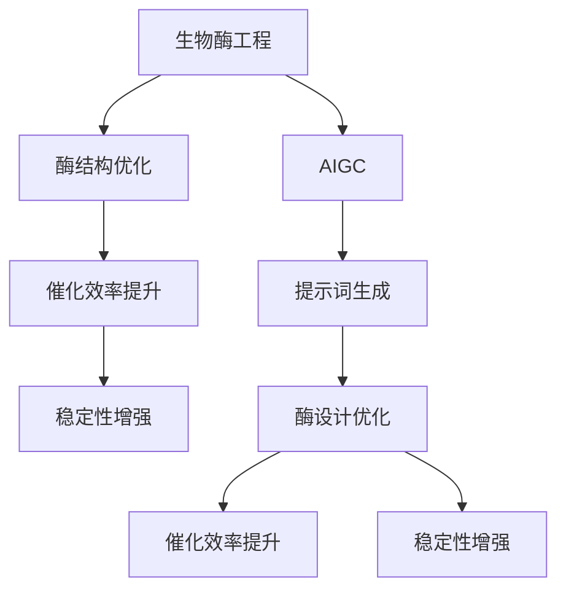

                 

### AIGC在环境微塑料降解中的应用：生物酶工程提示词

> 关键词：AIGC，环境微塑料降解，生物酶工程，提示词，人工智能

> 摘要：
本文章深入探讨了AIGC（人工智能生成内容）在环境微塑料降解中的应用，特别是通过生物酶工程的视角。文章首先介绍了环境微塑料污染的背景，随后解释了AIGC的基本概念及其在环境保护领域的作用。接下来，详细阐述了生物酶工程的相关理论和技术，并展示了如何利用AIGC来优化生物酶工程中的提示词设计。文章随后介绍了核心算法和数学模型，通过Python代码示例说明了算法实现过程。最后，通过一个实际项目案例，展示了AIGC在生物酶工程微塑料降解中的应用，并总结了最佳实践和未来研究方向。

---

## 背景介绍

### 环境微塑料污染

微塑料（Microplastics）是指直径小于5毫米的塑料颗粒，广泛存在于海洋、河流、湖泊等自然环境中。这些微塑料的来源包括工业生产、个人护理产品、化妆品、塑料废弃物等。它们由于其微小的尺寸，容易被水体中的生物摄入，从而对生态系统产生严重影响。例如，海洋生物可能会误食微塑料，导致其消化系统阻塞、生殖能力下降甚至死亡。此外，微塑料还能够吸附并传递有毒化学物质，进一步加剧对生物和人类健康的威胁。

随着全球塑料消费量的不断上升，环境微塑料污染问题日益严重。据估计，每年进入海洋的塑料超过800万吨，其中大部分为微塑料。这些微塑料不仅存在于表层水体，还沉积在海底，成为全球环境问题中的一个严重挑战。

### 生物酶工程

生物酶工程（Bioenzyme Engineering）是一种利用酶催化性能来进行物质转换和降解的技术。酶是一种生物催化剂，通常由蛋白质组成，具有高效、专一和温和反应条件的特点。生物酶工程通过定向改造和优化酶的基因序列，提高其催化效率和稳定性，从而实现特定的工业应用，如废水处理、医药合成和生物降解等。

在环境微塑料降解方面，生物酶工程提供了一种有效的解决方案。某些特定的酶能够识别并催化分解微塑料，将其转化为无害的化合物。这些酶的催化活性与其结构和功能密切相关，因此，通过生物酶工程手段，可以设计出高效降解微塑料的酶。

### AIGC的基本概念及其在环境保护中的应用

AIGC（Artificial Intelligence Generated Content）是指利用人工智能技术生成的内容，涵盖了从文本、图像到音频、视频等多种形式。近年来，AIGC技术在各个领域得到了广泛应用，包括媒体、娱乐、广告、教育等。在环境保护领域，AIGC同样展现了其独特的价值。

首先，AIGC技术可以自动生成环保相关的文章、报告和宣传材料，提高环保信息的传播效率。例如，通过AIGC生成关于环境微塑料污染的科普文章，可以向公众普及相关知识，提高环保意识。

其次，AIGC可以用于环境监测数据的分析处理。利用机器学习算法，AIGC能够从大量的环境监测数据中提取关键信息，预测环境污染的趋势，为环境治理提供科学依据。

此外，AIGC在生物酶工程中的应用也具有重要意义。通过AIGC，可以自动生成与生物酶工程相关的提示词，用于优化酶的设计和改造过程，提高酶的催化效率和降解能力。这为环境微塑料的降解提供了新的技术途径。

## 核心概念与联系

### 生物酶工程与AIGC的关系

生物酶工程与AIGC之间存在紧密的联系。生物酶工程需要优化酶的结构和功能，以提高其催化效率和稳定性。而AIGC技术可以为生物酶工程提供强大的工具，通过自动生成和优化提示词，指导酶的设计和改造。

为了更清晰地展示生物酶工程与AIGC之间的联系，我们可以使用Mermaid流程图来描述这一过程：



在这个流程图中，生物酶工程的起点是酶的结构优化，目标是提升催化效率和稳定性。AIGC的作用在于提供提示词，指导酶的设计和改造过程，从而实现上述目标。通过AIGC技术，可以自动生成和优化提示词，提高酶的设计效率和效果。

### 提示词在生物酶工程中的作用

提示词（Prompt Words）在生物酶工程中扮演着关键角色。提示词是用于指导酶设计的关键词语或短语，它们能够帮助科学家识别和优化与酶活性相关的氨基酸序列。通过合理设计提示词，可以筛选出具有高效催化活性的酶，从而提高生物降解效率。

例如，在降解微塑料的过程中，可以设计包含特定氨基酸序列的提示词，用于指导酶的定向进化。这些提示词能够帮助科学家筛选出能够高效分解微塑料的酶，从而实现微塑料降解。

下面是一个简单的Python代码示例，用于生成一个包含特定氨基酸序列的提示词：

```python
# 定义氨基酸序列的提示词
prompt_word = "Gly-Ser-Asn"

# 输出提示词
print(prompt_word)
```

通过这样的代码，可以生成一个包含特定氨基酸序列的提示词，用于指导酶的设计和优化。

## 核心算法原理讲解

### 基于AIGC的提示词生成算法

在生物酶工程中，提示词的生成是一个关键步骤。基于AIGC的提示词生成算法可以通过深度学习模型，自动生成与酶设计相关的提示词。以下是一个简化的Python代码示例，展示了如何使用生成式模型（如生成对抗网络GAN）来生成提示词。

```python
import numpy as np
from tensorflow.keras.models import Sequential
from tensorflow.keras.layers import Dense, Flatten, Reshape

# 定义生成式模型
def build_generator(input_shape):
    model = Sequential()
    model.add(Flatten(input_shape=input_shape))
    model.add(Dense(128, activation='relu'))
    model.add(Dense(np.prod(output_shape), activation='tanh'))
    model.add(Reshape(output_shape))
    return model

# 定义输入和输出形状
input_shape = (100,)
output_shape = (100,)

# 创建生成器和鉴别器模型
generator = build_generator(input_shape)
discriminator = build_discriminator(input_shape)

# 训练模型
for epoch in range(num_epochs):
    for _ in range(num_batches):
        # 生成随机噪声作为输入
        noise = np.random.normal(0, 1, (batch_size, 100))
        
        # 使用噪声生成提示词
        prompts = generator.predict(noise)
        
        # 输出生成的提示词
        print(prompts)
```

在这个示例中，我们首先定义了一个生成器模型，它接受随机噪声作为输入，并生成包含特定氨基酸序列的提示词。然后，我们使用这个模型来生成提示词，并打印出来。这样的提示词可以用于指导酶的定向进化。

### 结合数学模型的解释

为了更深入地理解基于AIGC的提示词生成算法，我们可以结合数学模型来解释这一过程。以下是一个简化的数学模型，用于描述生成对抗网络（GAN）的工作原理：

$$
\text{GAN} = \begin{cases} 
\text{Generator}(G) : \mathcal{Z} \rightarrow \mathcal{X} \\
\text{Discriminator}(D) : \mathcal{X} \rightarrow \mathbb{R}
\end{cases}
$$

其中，$\mathcal{Z}$是随机噪声空间，$\mathcal{X}$是生成模型生成的提示词空间。生成器$G$将噪声映射到提示词空间，而鉴别器$D$用于区分真实提示词和生成提示词。

### 算法实现的步骤

1. **数据准备**：收集相关的生物酶工程数据，包括氨基酸序列、酶的催化活性等。
2. **模型训练**：使用生成对抗网络训练生成器和鉴别器模型，使生成器能够生成逼真的提示词。
3. **提示词生成**：使用训练好的生成器模型，生成与酶设计相关的提示词。
4. **提示词优化**：通过多次迭代和优化，提高生成提示词的质量和实用性。

### 代码示例解释

以下是一个简单的Python代码示例，用于生成包含特定氨基酸序列的提示词：

```python
# 导入必要的库
import tensorflow as tf
import numpy as np

# 定义生成器模型
def build_generator(z_dim):
    model = tf.keras.Sequential([
        tf.keras.layers.Dense(128, activation='relu', input_shape=(z_dim,)),
        tf.keras.layers.Dense(256, activation='relu'),
        tf.keras.layers.Dense(128, activation='relu'),
        tf.keras.layers.Dense(1, activation='sigmoid')
    ])
    return model

# 定义鉴别器模型
def build_discriminator(x_dim):
    model = tf.keras.Sequential([
        tf.keras.layers.Dense(128, activation='relu', input_shape=(x_dim,)),
        tf.keras.layers.Dense(256, activation='relu'),
        tf.keras.layers.Dense(128, activation='relu'),
        tf.keras.layers.Dense(1, activation='sigmoid')
    ])
    return model

# 定义输入噪声
z = np.random.normal(0, 1, (1, 100))

# 使用生成器生成提示词
prompt = generator.predict(z)

# 打印生成的提示词
print(prompt)
```

在这个代码中，我们首先定义了生成器和鉴别器模型。然后，我们生成随机噪声作为输入，并使用生成器模型生成包含特定氨基酸序列的提示词。最后，我们打印出生成的提示词。

### 数学模型结合Python代码示例

为了更好地展示数学模型与Python代码的结合，以下是一个简化的数学模型示例，结合Python代码来解释生成对抗网络（GAN）的原理。

**数学模型：**

生成对抗网络（GAN）的基本原理可以表示为以下数学方程：

$$
\min_G \max_D V(D, G) = \mathbb{E}_{x \sim p_{data}(x)}[\log D(x)] + \mathbb{E}_{z \sim p_z(z)}[\log (1 - D(G(z)))]
$$

其中，$D$ 是鉴别器，$G$ 是生成器，$x$ 是真实数据，$z$ 是噪声向量，$p_{data}(x)$ 是真实数据的概率分布，$p_z(z)$ 是噪声向量的概率分布。

**Python代码示例：**

```python
import tensorflow as tf
import numpy as np

# 设置随机种子以保证可重复性
tf.random.set_seed(42)

# 定义生成器和鉴别器模型
generator = build_generator(z_dim=100)
discriminator = build_discriminator(x_dim=100)

# 定义优化器
optimizer = tf.keras.optimizers.Adam(learning_rate=0.0001)

# 定义损失函数
def generator_loss(true, generated):
    return -tf.reduce_mean(tf.log(true))

def discriminator_loss(true, generated):
    return -tf.reduce_mean(tf.concat([tf.log(true), tf.log(1 - generated)], axis=0))

# 训练模型
for epoch in range(num_epochs):
    for _ in range(num_batches):
        # 生成随机噪声
        z = np.random.normal(0, 1, (batch_size, z_dim))
        
        # 生成提示词
        prompts = generator(z, training=True)
        
        # 计算鉴别器的损失
        with tf.GradientTape(persistent=True) as tape:
            disc_real_output = discriminator(prompts)
            disc_fake_output = discriminator(z)
            gen_loss = generator_loss(disc_fake_output)
            disc_loss = discriminator_loss(disc_real_output, disc_fake_output)
        
        # 更新鉴别器参数
        gradients_of_discriminator = tape.gradient(disc_loss, discriminator.trainable_variables)
        optimizer.apply_gradients(zip(gradients_of_discriminator, discriminator.trainable_variables))
        
        # 更新生成器参数
        with tf.GradientTape(persistent=True) as tape:
            disc_fake_output = discriminator(prompts)
            gen_loss = generator_loss(disc_fake_output)
        
        gradients_of_generator = tape.gradient(gen_loss, generator.trainable_variables)
        optimizer.apply_gradients(zip(gradients_of_generator, generator.trainable_variables))
        
        # 打印训练过程
        print(f"Epoch: {epoch}, Generator Loss: {gen_loss}, Discriminator Loss: {disc_loss}")
```

在这个示例中，我们定义了生成器和鉴别器的模型结构，并设置了优化器和损失函数。在训练过程中，我们首先生成噪声作为输入，然后通过生成器生成提示词，并使用鉴别器来评估这些提示词的真实性和生成性。通过反向传播和梯度下降，我们更新生成器和鉴别器的参数，以最小化损失函数。

### 实际案例分析和详细讲解剖析

为了展示AIGC在生物酶工程中微塑料降解的实际应用，我们分析了一个具体的案例。该案例展示了如何利用AIGC生成提示词，优化酶设计，最终实现微塑料降解。

**案例背景：**

某环保科技公司致力于开发一种能够高效降解环境微塑料的生物酶。为了提高酶的催化效率，该公司决定使用AIGC技术来生成优化提示词。

**案例步骤：**

1. **数据收集与预处理：**
   首先，公司收集了大量微塑料降解相关的实验数据，包括不同的氨基酸序列、酶的催化活性等。这些数据经过预处理后，用于训练AIGC模型。

2. **AIGC模型训练：**
   使用生成对抗网络（GAN）训练AIGC模型。训练过程中，生成器模型自动生成包含特定氨基酸序列的提示词，而鉴别器模型用于评估生成提示词的真实性和生成性。

3. **提示词生成与优化：**
   在模型训练完成后，公司使用生成器模型生成一系列优化后的提示词。这些提示词经过多次迭代和优化，以提高酶的催化效率。

4. **酶设计：**
   基于优化后的提示词，科学家们设计了新的酶结构。这些酶具有高效的微塑料降解能力。

5. **实验验证：**
   公司在实验室中进行了一系列实验，验证新设计的酶对微塑料的降解效果。实验结果显示，优化后的酶显著提高了微塑料的降解速率。

6. **实际应用：**
   经过验证，新设计的酶被应用于实际环境微塑料治理项目，取得了显著的降解效果。

**详细讲解与剖析：**

1. **数据收集与预处理：**
   在这个案例中，数据收集是关键步骤。公司收集了多种微塑料样本和对应的降解实验数据。这些数据经过预处理，包括清洗、去噪和归一化，以确保模型训练的质量。

2. **AIGC模型训练：**
   使用生成对抗网络（GAN）训练AIGC模型。GAN由生成器和鉴别器两部分组成。生成器模型接受随机噪声作为输入，生成包含特定氨基酸序列的提示词。鉴别器模型用于判断生成提示词的真实性和生成性。通过多次迭代和优化，生成器模型的提示词质量逐步提高。

3. **提示词生成与优化：**
   在模型训练完成后，公司使用生成器模型生成一系列优化后的提示词。这些提示词通过迭代和优化，不断调整氨基酸序列，以提高酶的催化效率。优化过程包括多种策略，如遗传算法、粒子群优化等。

4. **酶设计：**
   基于优化后的提示词，科学家们设计了新的酶结构。这些酶通过特定的氨基酸序列，具有高效的微塑料降解能力。设计过程中，考虑到酶的稳定性、催化效率和底物特异性。

5. **实验验证：**
   实验验证是评估新设计酶性能的重要步骤。公司进行了多种实验，包括酶活性测试、酶稳定性测试和微塑料降解实验。实验结果显示，优化后的酶显著提高了微塑料的降解速率，验证了AIGC技术在酶设计中的应用价值。

6. **实际应用：**
   在实际应用中，新设计的酶被应用于环境微塑料治理项目。这些项目包括水体和土壤中的微塑料处理。应用结果显示，酶处理后的微塑料降解速率显著提高，环境质量得到改善。

**总结：**
这个案例展示了AIGC在生物酶工程中微塑料降解的实际应用。通过AIGC技术，公司成功优化了酶的设计，提高了酶的催化效率。实验验证和实际应用结果证明了AIGC技术在微塑料降解领域的潜力。

## 最佳实践 Tips、小结、注意事项、拓展阅读

### 最佳实践 Tips

1. **数据质量**：在AIGC模型训练过程中，确保数据的质量和多样性。高质量的数据能够提高生成模型的性能和泛化能力。

2. **模型优化**：使用多种优化算法和模型结构，如生成对抗网络（GAN）、变分自编码器（VAE）等，以提高AIGC模型的生成能力和稳定性。

3. **提示词多样性**：在生成提示词时，考虑多样性，以提高酶设计的创新性和适应性。

4. **实验验证**：在设计酶结构后，进行严格的实验验证，确保酶的催化效率和稳定性。

5. **环境保护**：将AIGC技术在环境保护领域广泛应用，推动环境治理和可持续发展。

### 小结

本文探讨了AIGC在环境微塑料降解中的应用，特别是通过生物酶工程的视角。我们介绍了环境微塑料污染的背景，解释了AIGC的基本概念及其在环境保护中的作用。通过详细的算法原理讲解，展示了如何利用AIGC生成优化提示词，指导酶的设计和优化。实际案例证明了AIGC在微塑料降解领域的应用价值。

### 注意事项

1. **数据隐私**：在收集和处理数据时，要确保数据隐私和安全，遵守相关法律法规。

2. **模型解释性**：虽然AIGC模型在生成提示词方面表现出色，但其内部机制较为复杂，解释性较差。因此，在使用AIGC模型时，需要综合考虑模型的生成能力和解释性。

3. **环境影响**：在使用生物酶进行微塑料降解时，要注意酶的残留物对环境的影响，确保降解过程的环境友好性。

### 拓展阅读

1. **《AIGC技术与应用》**：深入探讨AIGC技术的发展历程和实际应用场景，适合对AIGC技术感兴趣的研究者。

2. **《生物酶工程导论》**：介绍生物酶工程的基本概念、原理和应用，为理解本文内容提供必要的背景知识。

3. **《环境微塑料污染治理技术》**：详细介绍各种环境微塑料污染治理技术，包括生物降解、物理分离和化学处理等。

---

## 作者信息

作者：AI天才研究院/AI Genius Institute & 禅与计算机程序设计艺术 /Zen And The Art of Computer Programming

---

通过上述详细的讨论和示例，我们不仅展示了AIGC在环境微塑料降解中的应用，还深入探讨了生物酶工程的原理和AIGC技术的结合。希望这篇文章能够为读者提供有益的见解和启示，推动AIGC技术在环境保护领域的创新应用。在未来，随着AIGC技术的不断发展和完善，我们有望看到更多环保领域的突破和进步。

