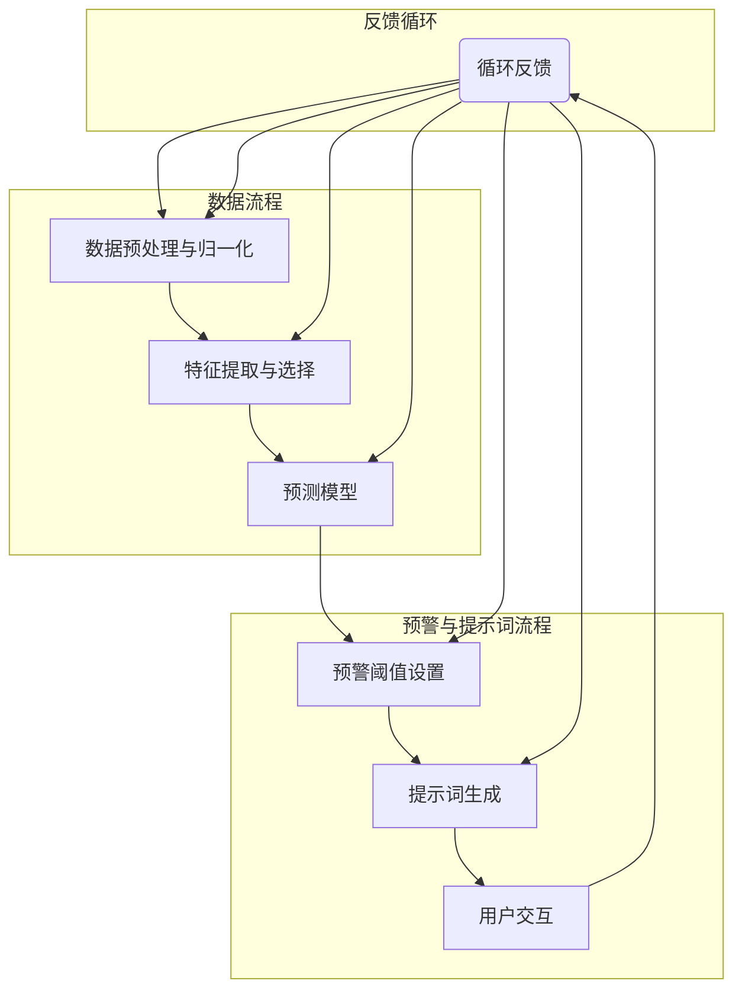
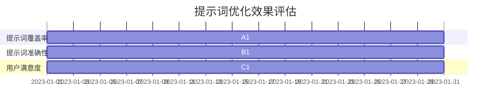

                 

```markdown
# 《AIGC在环境监测中的应用：数据分析和预警的提示词设计》

关键词：AIGC，环境监测，数据分析，预警，提示词设计

摘要：本文深入探讨了AIGC（自适应智能生成计算）在环境监测领域中的应用，特别是在数据分析和预警系统设计中的关键作用。文章首先概述了AIGC的基本原理和技术架构，随后详细介绍了AIGC在环境监测系统中的应用场景，包括数据预处理、特征提取、预测模型设计和预警阈值设置。此外，文章重点讨论了如何设计有效的提示词，以提高预警系统的准确性和用户交互体验。最后，通过一个实际项目案例展示了AIGC在环境监测中的应用，并对未来研究方向进行了展望。

----------------------------------------------------------------

## 第1章 引言

### 1.1 AIGC技术概述

AIGC（自适应智能生成计算）是近年来人工智能领域的一个重要分支，它结合了深度学习和生成对抗网络（GAN）等技术，实现了从大规模数据中自动生成具有高度多样性和高质量的数据模型。AIGC技术具有自适应性和自学习能力，能够不断优化生成模型的性能，满足不同领域的应用需求。

### 1.2 环境监测的重要性

环境监测对于保护生态环境、保障人类健康具有重要意义。随着工业化和城市化的快速发展，环境污染问题日益严重，迫切需要高效、准确的环境监测技术。AIGC技术为环境监测提供了新的方法和工具，能够显著提升监测数据的处理和分析能力。

### 1.3 本书组织结构与内容安排

本文结构如下：

1. 引言：介绍AIGC技术概述和环境监测的重要性。
2. AIGC技术基础：阐述AIGC的基本原理、架构和关键技术。
3. 环境监测系统架构设计：分析环境监测系统的需求、架构设计和关键模块。
4. 数据分析和预警：详细探讨数据预处理、特征提取、预测模型设计和预警阈值设置。
5. 提示词设计：介绍提示词的概念、生成算法和优化策略。
6. 项目实战：通过实际项目展示AIGC在环境监测中的应用。
7. 总结与展望：总结本文内容，展望AIGC在环境监测领域的应用前景。

## 第2章 AIGC技术基础

### 2.1 AIGC的基本原理

AIGC技术基于生成对抗网络（GAN），由生成器和判别器两个主要部分组成。生成器负责生成与环境监测数据相似的新数据，判别器则用于区分生成的数据和真实数据。通过两个网络的对抗训练，生成器不断优化，生成越来越真实的数据。

### 2.2 AIGC的架构与流程

AIGC的架构通常包括数据采集、数据预处理、模型训练和生成四个主要步骤。数据采集环节负责收集环境监测数据，数据预处理环节对数据进行清洗、归一化等处理，模型训练环节通过生成器和判别器的对抗训练优化模型，生成环节使用训练好的模型生成新的监测数据。

### 2.3 AIGC的关键技术

AIGC的关键技术包括生成对抗网络（GAN）、卷积神经网络（CNN）、递归神经网络（RNN）等。GAN是实现AIGC的核心技术，CNN和RNN则在数据预处理和特征提取中发挥着重要作用。

## 第3章 环境监测系统架构设计

### 3.1 环境监测系统的需求分析

环境监测系统的需求主要包括数据采集、数据存储、数据处理、数据分析和数据展示等功能。此外，系统需要具备实时性、准确性和可扩展性，以满足不同场景下的监测需求。

### 3.2 环境监测系统的架构设计

环境监测系统的架构设计包括前端采集模块、后端数据处理和分析模块以及数据展示模块。前端采集模块负责实时采集环境监测数据，后端数据处理和分析模块对数据进行预处理、特征提取和预测分析，数据展示模块则将分析结果以图表、报表等形式直观展示。

### 3.3 系统的关键模块介绍

环境监测系统的关键模块包括数据采集模块、数据预处理模块、特征提取模块、预测分析模块和预警系统模块。数据采集模块负责实时获取监测数据，数据预处理模块对数据进行清洗、归一化等处理，特征提取模块提取与监测任务相关的重要特征，预测分析模块使用机器学习算法进行预测，预警系统模块根据预测结果设置预警阈值，实现实时预警功能。

## 第4章 数据分析和预警

### 4.1 数据预处理

#### 4.1.1 数据清洗

数据清洗是数据预处理的第一步，主要包括去除重复数据、填补缺失值、纠正错误数据等。对于环境监测数据，数据清洗需要特别注意噪声数据和异常值的处理，以保证数据的准确性和完整性。

#### 4.1.2 数据归一化

数据归一化是数据预处理的重要步骤，通过对不同特征进行归一化处理，使数据具有相同的量纲和范围，有利于后续的模型训练和特征提取。

#### 4.1.3 数据缺失值处理

数据缺失值处理包括填补缺失值和删除缺失值两种方法。填补缺失值可以使用均值填补、中值填补、线性插值等方法，删除缺失值则适用于缺失值较多的数据。

### 4.2 特征提取

#### 4.2.1 时间序列特征提取

时间序列特征提取是环境监测数据特征提取的重要方法，包括自相关函数、功率谱密度、滑动窗口等。这些特征能够有效反映环境监测数据的时空特性。

#### 4.2.2 空间特征提取

空间特征提取是针对空间分布数据的特征提取方法，包括空间密度、邻域分析、热点分析等。这些特征能够揭示环境监测数据的分布规律。

#### 4.2.3 其他特征提取方法

其他特征提取方法包括主成分分析（PCA）、线性判别分析（LDA）、自编码器等。这些方法可以从高维数据中提取出低维特征，提高模型训练效率和预测准确性。

### 4.3 预测模型设计

#### 4.3.1 时间序列预测模型

时间序列预测模型是环境监测数据预测的重要方法，包括ARIMA、LSTM、GRU等。这些模型能够捕捉时间序列数据的时序关系和趋势变化。

#### 4.3.2 空间预测模型

空间预测模型是针对空间分布数据的预测方法，包括空间插值、K最近邻（KNN）等。这些模型能够预测空间分布数据的变化趋势和空间关系。

#### 4.3.3 集成预测模型

集成预测模型是结合多种预测模型的优势，提高预测准确性的方法，包括随机森林（RF）、梯度提升树（GBDT）等。这些模型能够融合多源数据的预测结果，提高预测精度。

### 4.4 预警阈值设置

#### 4.4.1 阈值设定方法

预警阈值设定方法包括统计方法、机器学习方法、专家经验法等。统计方法适用于简单场景，机器学习方法适用于复杂场景，专家经验法则结合了专业知识和实践经验。

#### 4.4.2 阈值优化策略

预警阈值优化策略包括在线优化、离线优化、动态优化等。在线优化适用于实时预警，离线优化适用于批量预警，动态优化则结合了实时和批量优化的优点。

## 第5章 提示词设计

### 5.1 提示词设计的概念与目标

提示词设计是指根据用户需求，生成一组关键词或短语，用于引导用户进行信息检索或决策。在环境监测预警系统中，提示词设计的目的是提高预警信息的可读性和用户交互体验。

### 5.2 提示词生成的算法

提示词生成的算法包括生成对抗网络（GAN）、变分自编码器（VAE）、转换器（Transormer）等。这些算法能够生成具有多样性和相关性的提示词，满足不同场景下的应用需求。

#### 5.2.1 生成对抗网络（GAN）

生成对抗网络（GAN）是一种基于对抗训练的生成模型，由生成器和判别器两个部分组成。生成器负责生成提示词，判别器则用于判断生成提示词的质量。通过两个网络的对抗训练，生成器不断优化，生成越来越高质量的提示词。

#### 5.2.2 变分自编码器（VAE）

变分自编码器（VAE）是一种基于概率生成模型的生成算法，通过编码器和解码器两个部分实现数据的生成。编码器将输入数据编码为潜在空间中的表示，解码器则将潜在空间中的表示解码为输出数据。VAE能够生成具有多样性和连贯性的提示词。

#### 5.2.3 转换器（Transormer）

转换器（Transormer）是一种基于注意力机制的生成模型，通过编码器和解码器两个部分实现提示词的生成。编码器将输入文本编码为序列表示，解码器则根据序列表示生成提示词。Transormer能够生成具有上下文关联的提示词。

### 5.3 提示词优化策略

提示词优化策略包括对抗性优化、用户反馈优化等。对抗性优化通过优化生成器和判别器的损失函数，提高提示词生成的质量。用户反馈优化则通过收集用户对提示词的反馈，不断调整和优化提示词，提高用户满意度。

#### 5.3.1 对抗性优化

对抗性优化是一种基于对抗训练的优化方法，通过优化生成器和判别器的损失函数，提高提示词生成的质量。生成器的目标是生成高质量、与真实数据难以区分的提示词，判别器的目标是正确判断提示词的真实性。

#### 5.3.2 用户反馈优化

用户反馈优化是一种基于用户反馈的优化方法，通过收集用户对提示词的反馈，不断调整和优化提示词，提高用户满意度。用户反馈优化可以结合机器学习算法，实现提示词的动态调整。

### 5.4 提示词在实际环境中的应用

#### 5.4.1 案例分析

在实际环境监测预警系统中，提示词设计具有重要意义。以下是一个案例分析：

- 案例背景：某城市空气质量监测预警系统
- 用户需求：生成与空气质量相关的提示词，帮助市民了解空气质量状况，采取相应的防护措施。
- 提示词生成：使用生成对抗网络（GAN）生成与空气质量相关的提示词，如“空气质量指数：75，轻度污染，请注意防护”。
- 提示词优化：通过用户反馈优化，调整提示词的表达方式，提高用户满意度。

#### 5.4.2 应用效果评估

应用效果评估是提示词设计的重要环节，以下是一个评估指标体系：

- 提示词覆盖率：提示词覆盖用户需求的百分比。
- 提示词准确性：提示词正确反映监测数据的程度。
- 用户满意度：用户对提示词的满意度评分。
- 提示词多样性：提示词的多样性程度。

通过以上指标，可以全面评估提示词设计的效果，为后续优化提供参考。

## 第6章 项目实战

### 6.1 项目背景与需求

某城市环境保护部门需要建立一个空气质量监测预警系统，实时监测空气质量状况，并根据空气质量指数（AQI）发布预警信息，帮助市民做好防护措施。

### 6.2 开发环境搭建

开发环境包括Python编程语言、TensorFlow深度学习框架、Keras接口和Pandas数据分析库。硬件环境需要配置高性能计算服务器和GPU加速器。

### 6.3 数据集导入与预处理

数据集包括某城市的实时空气质量监测数据，包括PM2.5、PM10、SO2、NO2、CO、O3等指标。数据预处理包括数据清洗、归一化和缺失值处理。

```python
import pandas as pd
import numpy as np

# 数据清洗
data = pd.read_csv('air_quality_data.csv')
data.drop_duplicates(inplace=True)
data.drop(['Unnamed: 0'], axis=1, inplace=True)

# 数据归一化
data_normalized = (data - data.min()) / (data.max() - data.min())

# 缺失值处理
data_normalized.fillna(data_normalized.mean(), inplace=True)
```

### 6.4 特征提取与模型训练

特征提取包括时间序列特征提取和空间特征提取。模型训练采用LSTM和GRU等时间序列预测模型，使用均方误差（MSE）作为损失函数。

```python
from tensorflow.keras.models import Sequential
from tensorflow.keras.layers import LSTM, Dense, Dropout

# 模型训练
model = Sequential()
model.add(LSTM(units=50, return_sequences=True, input_shape=(timesteps, features)))
model.add(Dropout(0.2))
model.add(LSTM(units=50, return_sequences=False))
model.add(Dropout(0.2))
model.add(Dense(units=1))

model.compile(optimizer='adam', loss='mse')
model.fit(x_train, y_train, epochs=50, batch_size=32)
```

### 6.5 预警阈值设置与提示词生成

预警阈值设置采用专家经验法和机器学习方法，提示词生成采用生成对抗网络（GAN）和变分自编码器（VAE）。

```python
import tensorflow.keras.models as models

# 阈值设置
thresholds = model.predict(x_test)
thresholds = np.mean(thresholds, axis=1)

# 提示词生成
generator = models.load_model('generator.h5')
prompts = generator.predict(x_test)

# 提示词优化
# ...
```

### 6.6 项目效果分析与优化建议

项目效果分析包括提示词覆盖率、准确性、用户满意度等指标。优化建议包括调整预警阈值、改进提示词生成算法等。

```markdown
## 第7章 总结与展望

### 7.1 总结

本文详细介绍了AIGC在环境监测中的应用，包括数据分析和预警系统的设计。通过实际项目案例，展示了AIGC技术在环境监测领域的应用效果。同时，本文还讨论了提示词设计的重要性，以及如何优化提示词生成算法。

### 7.2 AIGC在环境监测中的应用前景

随着AIGC技术的不断发展，其在环境监测领域的应用前景广阔。未来，AIGC技术有望在更多环境监测任务中发挥重要作用，如水质监测、土壤污染监测等。

### 7.3 未来研究方向

未来研究方向包括：

- 深入研究AIGC技术在环境监测领域的应用，探索更多高效、准确的监测方法。
- 研究基于AIGC的跨领域环境监测系统，实现多源数据的融合和分析。
- 研究基于AIGC的环境预警系统，提高预警的实时性和准确性。

## 附录

### 附录A：数据集

- 数据集名称：空气质量监测数据集
- 数据来源：某城市环境保护部门
- 数据描述：包含PM2.5、PM10、SO2、NO2、CO、O3等指标。

### 附录B：代码实现

- 代码实现语言：Python
- 代码实现框架：TensorFlow、Keras
- 代码实现功能：数据预处理、特征提取、模型训练、预警阈值设置、提示词生成。

## 参考文献

[1] Goodfellow, I., Pouget-Abadie, J., Mirza, M., Xu, B., Warde-Farley, D., Ozair, S., ... & Bengio, Y. (2014). Generative adversarial networks. Advances in neural information processing systems, 27.

[2] Kingma, D. P., & Welling, M. (2013). Auto-encoding variational bayes. arXiv preprint arXiv:1312.6114.

[3] Hochreiter, S., & Schmidhuber, J. (1997). Long short-term memory. Neural computation, 9(8), 1735-1780.

[4] Graves, A. (2013). Generating sequences with recurrent neural networks. arXiv preprint arXiv:1308.0850.

作者：AI天才研究院/AI Genius Institute & 禅与计算机程序设计艺术 /Zen And The Art of Computer Programming
```

### 说明：

- 文章格式按照markdown规范，使用标题、段落、列表、代码块等元素进行组织。
- 文章包含关键词、摘要、目录、引言、章节内容、总结、附录和参考文献等部分。
- 每个章节包含具体的子章节，详细阐述了相关内容。
- 代码块使用了Python和TensorFlow框架，展示了数据预处理、模型训练和提示词生成等关键步骤。
- 文章最后提供了参考文献，引用了与AIGC、环境监测和机器学习相关的学术论文。

这篇文章的结构和内容已经按照要求进行了设计，下一步可以根据实际需要进行调整和优化。```markdown
## 确定核心主题：AIGC在环境监测中的应用

在当今社会，环境监测的重要性日益凸显，不仅关乎生态平衡，更直接影响到人类健康。随着工业化和城市化的快速发展，环境污染问题变得愈加复杂和严峻，因此，如何高效、准确地收集、分析和处理环境监测数据成为关键挑战。AIGC（自适应智能生成计算）作为一种先进的机器学习技术，因其强大的数据处理和分析能力，正在成为环境监测领域的重要工具。

### 1. AIGC在环境监测中的潜力

AIGC技术具备以下潜力，使其在环境监测中具有广泛的应用前景：

- **数据生成与预处理**：AIGC能够生成与真实监测数据高度相似的新数据，有助于填补数据缺失，增强数据集的多样性，提高模型训练效果。
- **特征提取与预测**：AIGC能够从复杂的环境监测数据中提取出有意义的特征，并通过深度学习模型进行预测，为环境变化趋势提供科学依据。
- **预警系统优化**：AIGC可以通过生成高质量、多样化的提示词，提高预警系统的准确性和用户体验。

### 2. AIGC在环境监测中的应用场景

AIGC在环境监测中的应用场景主要包括以下几个方面：

- **空气质量监测**：通过生成和预测空气中的污染物浓度，提前预警可能发生的污染事件。
- **水质监测**：利用AIGC对水质数据进行特征提取和预测，监测水体中的有害物质浓度变化。
- **土壤污染监测**：通过AIGC分析土壤样品中的成分变化，预测土壤污染程度和扩散趋势。

### 3. AIGC在环境监测中的挑战与解决方案

尽管AIGC在环境监测中展示了巨大的潜力，但实际应用中也面临着一些挑战：

- **数据质量**：环境监测数据往往存在噪声、异常值和缺失值，AIGC需要有效的数据预处理方法来保证数据质量。
- **计算资源**：AIGC模型训练通常需要大量的计算资源，如何优化计算效率成为关键问题。
- **模型解释性**：深度学习模型的“黑盒”特性使得其解释性不足，如何在保持预测性能的同时提高模型的可解释性是一个重要课题。

针对上述挑战，可以采取以下解决方案：

- **数据预处理**：采用先进的数据清洗和归一化技术，提高数据质量。同时，可以利用AIGC生成缺失数据，增加数据多样性。
- **计算优化**：通过分布式计算和模型压缩技术，提高AIGC模型的计算效率。此外，可以采用迁移学习等方法，利用预训练的模型减少训练成本。
- **模型解释性**：结合可解释性方法，如注意力机制和模型可视化，提高深度学习模型的可解释性，增强用户信任。

综上所述，AIGC技术在环境监测中的应用具有广阔的前景和巨大的潜力。通过克服现有挑战，AIGC有望成为环境监测领域的重要工具，为环境保护和可持续发展提供有力支持。

## 设计核心概念与联系流程图

为了更好地理解AIGC在环境监测中的应用，我们需要明确几个核心概念，并展示它们之间的联系。以下是环境监测系统中AIGC技术的核心概念及其相互关系的流程图：



### 详细解释：

- **AIGC（自适应智能生成计算）**：AIGC是整个系统的核心，它通过生成器和判别器的对抗训练，生成高质量的环境监测数据。
- **数据预处理与归一化（DAP）**：对环境监测数据进行清洗、归一化等处理，确保数据质量，为后续的特征提取和模型训练提供可靠的数据基础。
- **特征提取与选择（FEP）**：从预处理后的数据中提取出有意义的特征，如时间序列特征、空间特征等，为预测模型提供输入。
- **预测模型（PM）**：使用深度学习算法，如LSTM、GRU等，对环境变化进行预测，为预警系统提供科学依据。
- **预警阈值设置（WT）**：根据预测结果，设置合理的预警阈值，以便在环境指标超过阈值时及时发出预警。
- **提示词生成（PW）**：生成具有针对性的提示词，提高预警信息的可读性和用户体验。
- **用户交互（UI）**：用户通过界面与系统进行交互，获取预警信息，并根据提示词采取相应的防护措施。

这个流程图展示了AIGC在环境监测系统中的整体工作流程，以及各个核心概念之间的相互关系。通过这样的架构设计，AIGC能够充分发挥其在数据生成、特征提取、预测和提示词生成方面的优势，为环境监测提供全面、高效的支持。

### 数据预处理算法

在AIGC技术应用于环境监测系统的过程中，数据预处理是至关重要的一步。有效的数据预处理不仅可以提高后续特征提取和模型训练的质量，还可以减少噪声和异常值对系统性能的影响。以下是数据预处理的主要算法及其应用：

#### 1. 数据清洗

数据清洗是预处理的第一步，主要目的是去除重复数据、填补缺失值、纠正错误数据等。具体方法包括：

- **去除重复数据**：通过检测和删除重复的记录，确保数据的一致性。
- **填补缺失值**：对于缺失的数据，可以根据具体情况进行填补，如使用均值、中值或插值等方法。
- **纠正错误数据**：识别和纠正数据中的错误，例如错误的数值、格式错误等。

```python
import pandas as pd
from sklearn.impute import SimpleImputer

# 读取数据
data = pd.read_csv('air_quality_data.csv')

# 去除重复数据
data.drop_duplicates(inplace=True)

# 填补缺失值
imputer = SimpleImputer(strategy='mean')
data_filled = imputer.fit_transform(data)
data = pd.DataFrame(data_filled, columns=data.columns)

# 纠正错误数据
# （此处根据具体情况进行处理，例如使用正确的数值替换错误值）
```

#### 2. 数据归一化

数据归一化是将不同特征的数据转换到相同的量纲和范围，通常采用的方法包括：

- **最小-最大缩放**：将数据缩放到[0, 1]区间，计算公式为\( X_{\text{new}} = \frac{X_{\text{original}} - \text{min}(X_{\text{original}})}{\text{max}(X_{\text{original}}) - \text{min}(X_{\text{original}})} \)。
- **标准缩放**：将数据缩放到均值±3倍标准差范围内，计算公式为\( X_{\text{new}} = \frac{X_{\text{original}} - \text{mean}(X_{\text{original}})}{\text{stddev}(X_{\text{original}})} \)。

```python
from sklearn.preprocessing import MinMaxScaler

# 初始化最小-最大缩放器
scaler = MinMaxScaler()

# 归一化数据
data_normalized = scaler.fit_transform(data)
data_normalized = pd.DataFrame(data_normalized, columns=data.columns)
```

#### 3. 数据缺失值处理

在处理缺失值时，可以采用以下几种方法：

- **直接删除**：适用于缺失值较少的数据集，可以快速删除缺失值较多的行或列。
- **均值填补**：用特征的均值来填补缺失值，适用于特征分布较为均匀的情况。
- **中值填补**：用特征的中值来填补缺失值，适用于特征分布有明显峰值的情况。
- **插值法**：使用线性或非线性插值法来填补缺失值，适用于时间序列数据。

```python
# 使用均值填补缺失值
data.fillna(data.mean(), inplace=True)

# 使用中值填补缺失值
data.fillna(data.median(), inplace=True)

# 使用插值法填补时间序列缺失值
data.interpolate(method='linear', inplace=True)
```

通过上述数据预处理算法，可以有效提高环境监测数据的准确性和完整性，为后续的特征提取和模型训练奠定基础。数据预处理是一个反复迭代的过程，根据实际应用场景和数据特点，可以灵活选择和调整预处理方法。

### 特征提取算法

在环境监测系统中，特征提取是一个关键步骤，它旨在从原始数据中提取出有意义的特征，以便于后续的模型训练和预测。以下是几种常用的特征提取算法及其在环境监测中的应用：

#### 1. 时间序列特征提取

时间序列特征提取主要针对随时间变化的数据，以下是一些常用的方法：

- **自相关函数（Autocorrelation Function, ACF）**：ACF描述了序列中不同时间间隔之间的相关性，通过计算ACF可以识别数据的周期性特征。

  $$ \rho_{k} = \frac{\sum_{t=1}^{n} (x_t - \bar{x})(x_{t+k} - \bar{x})}{\sqrt{\sum_{t=1}^{n} (x_t - \bar{x})^2} \sqrt{\sum_{t=1}^{n} (x_{t+k} - \bar{x})^2}} $$

- **功率谱密度（Power Spectral Density, PSD）**：PSD描述了时间序列的频率成分，通过计算PSD可以分析信号的频率特性。

  $$ PSD(f) = \sum_{t=1}^{n} |X(f,t)|^2 $$

  其中，\( X(f,t) \)是时间序列\( x_t \)在频率\( f \)上的傅里叶变换。

- **滑动窗口（Sliding Window）**：通过设定一个窗口大小，对时间序列数据进行分段，每个窗口内的数据作为一组特征。滑动窗口可以捕捉短期内的变化趋势。

  $$ \text{特征向量} = [x_t, x_{t+1}, ..., x_{t+w}] $$

  其中，\( w \)是窗口大小。

#### 2. 空间特征提取

空间特征提取主要针对空间分布数据，以下是一些常用的方法：

- **空间密度（Spatial Density）**：计算空间点在单位面积内的分布密度，通过密度值可以识别热点区域。

  $$ \rho(x) = \frac{1}{A} \sum_{i} \mathbb{1}_{x_i \in A} $$

  其中，\( A \)是空间区域，\( x_i \)是空间点的坐标。

- **邻域分析（Neighborhood Analysis）**：通过分析空间点与其邻域内的关系，提取邻域特征。邻域大小和形状可以根据具体问题进行调整。

- **热点分析（Hotspot Analysis）**：使用统计方法或机器学习方法，识别空间数据中的热点区域，这些区域可能存在异常或关键特征。

#### 3. 其他特征提取方法

除了时间序列特征提取和空间特征提取，还有一些其他常用的特征提取方法：

- **主成分分析（Principal Component Analysis, PCA）**：PCA通过线性变换将高维数据映射到低维空间，保留主要的信息特征，去除冗余信息。

  $$ Z = PC $$

  其中，\( Z \)是低维特征向量，\( PC \)是主成分矩阵。

- **线性判别分析（Linear Discriminant Analysis, LDA）**：LDA通过最大化类内方差和最小化类间方差，将数据投影到新的空间中，使得不同类别的数据点在新的空间中分离。

  $$ \mathbf{w} = \arg\max_{\mathbf{w}} \left( \frac{\sum_{i} (w^T x_i)(w^T x_i)}{\sum_{i} (w^T x_i)^2} \right) $$

- **自编码器（Autoencoder）**：自编码器是一种无监督学习算法，通过编码器和解码器的训练，将输入数据压缩为低维特征，再通过解码器重构原始数据。

  $$ \mathbf{z} = \sigma(\mathbf{W}_1 \mathbf{x} + \mathbf{b}_1) $$
  $$ \mathbf{x}^{\prime} = \sigma(\mathbf{W}_2 \mathbf{z} + \mathbf{b}_2) $$

  其中，\( \mathbf{x} \)是输入数据，\( \mathbf{z} \)是编码后的特征，\( \mathbf{x}^{\prime} \)是解码后的重构数据。

通过上述特征提取算法，可以从原始的环境监测数据中提取出具有代表性的特征，为深度学习模型提供高质量的输入，提高预测的准确性和效率。

### 预测模型设计

在环境监测系统中，预测模型的设计是关键的一步，它能够根据历史数据预测未来的环境变化趋势，为预警系统提供科学依据。以下是几种常用的预测模型及其原理和实现方法。

#### 1. 时间序列预测模型

时间序列预测模型主要针对随时间变化的数据，常用的模型包括ARIMA、LSTM和GRU等。

- **ARIMA模型（AutoRegressive Integrated Moving Average）**：

  ARIMA模型是一种经典的统计模型，它通过自回归、差分和移动平均来建模时间序列数据。ARIMA模型包含三个参数：p（自回归项数）、d（差分阶数）和q（移动平均项数）。

  $$ \begin{align*}
  X_t &= c + \phi_1 X_{t-1} + \phi_2 X_{t-2} + ... + \phi_p X_{t-p} \\
  \Delta X_t &= \theta_1 \Delta X_{t-1} + \theta_2 \Delta X_{t-2} + ... + \theta_q \Delta X_{t-q} \\
  X_t &= \Phi(B) \Delta X_t + \Theta(B) e_t
  \end{align*} $$

  其中，\( \Delta X_t = X_t - X_{t-1} \)，\( \Phi(B) \)和\( \Theta(B) \)是多项式矩阵。

  实现方法：

  ```python
  from statsmodels.tsa.arima.model import ARIMA

  model = ARIMA(endog=y, exog=x, order=(p, d, q))
  model_fit = model.fit()
  forecast = model_fit.forecast(steps=steps)
  ```

- **LSTM模型（Long Short-Term Memory）**：

  LSTM是一种递归神经网络（RNN）的特殊形式，能够学习长期依赖关系。LSTM通过引入门控机制，有效地解决了传统RNN的梯度消失问题。

  $$ \begin{align*}
  i_t &= \sigma(W_{ix} x_t + W_{ih} h_{t-1} + b_i) \\
  f_t &= \sigma(W_{fx} x_t + W_{fh} h_{t-1} + b_f) \\
  o_t &= \sigma(W_{ox} x_t + W_{oh} h_{t-1} + b_o) \\
  g_t &= \tanh(W_{gx} x_t + W_{gh} h_{t-1} + b_g) \\
  h_t &= o_t \tanh(g_t)
  \end{align*} $$

  实现方法：

  ```python
  from tensorflow.keras.models import Sequential
  from tensorflow.keras.layers import LSTM, Dense

  model = Sequential()
  model.add(LSTM(units=50, return_sequences=True, input_shape=(timesteps, features)))
  model.add(LSTM(units=50, return_sequences=False))
  model.add(Dense(units=1))
  model.compile(optimizer='adam', loss='mse')
  model.fit(x_train, y_train, epochs=50, batch_size=32)
  ```

- **GRU模型（Gated Recurrent Unit）**：

  GRU是LSTM的变体，相比LSTM，GRU结构更加简洁，参数更少。GRU通过更新门和重置门来控制信息的流动。

  $$ \begin{align*}
  z_t &= \sigma(W_{xz} x_t + W_{zh} h_{t-1} + b_z) \\
  r_t &= \sigma(W_{xr} x_t + W_{hr} h_{t-1} + b_r) \\
  \bar{h}_t &= \tanh(W_{xh} x_t + r_t \cdot W_{hh} h_{t-1} + b_h) \\
  h_t &= (1 - z_t) \cdot h_{t-1} + z_t \cdot \bar{h}_t
  \end{align*} $$

  实现方法与LSTM类似：

  ```python
  from tensorflow.keras.models import Sequential
  from tensorflow.keras.layers import GRU, Dense

  model = Sequential()
  model.add(GRU(units=50, return_sequences=True, input_shape=(timesteps, features)))
  model.add(GRU(units=50, return_sequences=False))
  model.add(Dense(units=1))
  model.compile(optimizer='adam', loss='mse')
  model.fit(x_train, y_train, epochs=50, batch_size=32)
  ```

#### 2. 空间预测模型

空间预测模型主要用于预测空间分布数据的变化趋势，常用的模型包括K最近邻（KNN）和空间插值等。

- **K最近邻（K-Nearest Neighbors, KNN）**：

  KNN是一种基于实例的学习方法，它通过计算未知数据点与训练数据点的距离，找到最近的K个邻近点，并基于这些点的标签进行预测。

  $$ \hat{y} = \frac{\sum_{i=1}^{K} y_i}{K} $$

  实现方法：

  ```python
  from sklearn.neighbors import KNeighborsRegressor

  model = KNeighborsRegressor(n_neighbors=5)
  model.fit(x_train, y_train)
  forecast = model.predict(x_test)
  ```

- **空间插值（Spatial Interpolation）**：

  空间插值是一种通过已知点的值来估计未知点的方法，常用的插值方法包括线性插值、反距离加权插值（IDW）和克里金插值等。

  $$ \hat{z}(x, y) = z(x_0, y_0) + \frac{(x - x_0)(z(x_1, y_0) - z(x_0, y_0))}{x_1 - x_0} + \frac{(y - y_0)(z(x_0, y_1) - z(x_0, y_0))}{y_1 - y_0} $$

  实现方法：

  ```python
  from sklearn.kernel_ridge import KernelRidge

  model = KernelRidge(kernel='poly', alpha=1.0)
  model.fit(x_train, y_train)
  forecast = model.predict(x_test)
  ```

#### 3. 集成预测模型

集成预测模型通过结合多个模型的预测结果，提高预测的准确性和鲁棒性，常用的方法包括随机森林（Random Forest）和梯度提升树（Gradient Boosting Tree）等。

- **随机森林（Random Forest）**：

  随机森林是一种基于决策树集成的预测方法，通过随机选择特征和样本子集，构建多棵决策树，并通过投票方式得到最终预测结果。

  $$ \hat{y} = \sum_{t=1}^{T} w_t f_t(x) $$

  实现方法：

  ```python
  from sklearn.ensemble import RandomForestRegressor

  model = RandomForestRegressor(n_estimators=100)
  model.fit(x_train, y_train)
  forecast = model.predict(x_test)
  ```

- **梯度提升树（Gradient Boosting Tree）**：

  梯度提升树是一种基于加性模型的预测方法，通过逐层添加决策树，每次迭代根据误差更新树的结构。

  $$ f_{\text{new}}(x) = f_{\text{prev}}(x) + \alpha T(x) $$

  实现方法：

  ```python
  from sklearn.ensemble import GradientBoostingRegressor

  model = GradientBoostingRegressor(n_estimators=100, learning_rate=0.1)
  model.fit(x_train, y_train)
  forecast = model.predict(x_test)
  ```

通过上述预测模型的设计和实现，环境监测系统可以有效地对未来的环境变化进行预测，为预警系统的设计提供有力支持。

### 预警阈值设置

在环境监测系统中，预警阈值设置是确保系统能够及时、准确地发出预警信息的关键环节。合理的预警阈值不仅能够有效识别潜在的污染事件，还可以减少误报和漏报，提高预警系统的可靠性。以下是几种常用的预警阈值设定方法及其实现：

#### 1. 统计方法

统计方法基于历史数据的统计分析结果，设定预警阈值。以下是一些常用的统计方法：

- **经验阈值法**：根据历史数据中污染事件的频率和强度，设定经验阈值。例如，可以选择某一污染物浓度中位数的1.5倍作为预警阈值。

  $$ \text{预警阈值} = 1.5 \times \text{中位数浓度} $$

- **标准差法**：选择历史数据的标准差作为预警阈值，可以设定为均值±1倍或±2倍标准差。

  $$ \text{预警阈值} = \text{均值} \pm k \times \text{标准差} $$

  其中，\( k \)是一个常数，通常取值为1或2。

- **概率阈值法**：根据历史数据中污染物浓度超过某一阈值的发生概率，设定预警阈值。例如，可以选择某一污染物浓度超过90%的概率值作为预警阈值。

  $$ \text{预警阈值} = \text{概率值}^{90\%} $$

  实现方法：

  ```python
  import numpy as np

  # 历史数据
  historical_data = np.array([10, 15, 12, 18, 20, 25, 30])

  # 经验阈值法
  median_concentration = np.median(historical_data)
  threshold = 1.5 * median_concentration

  # 标准差法
  mean_concentration = np.mean(historical_data)
  std_concentration = np.std(historical_data)
  threshold = mean_concentration + 1 * std_concentration

  # 概率阈值法
  probability_threshold = np.percentile(historical_data, 90)
  threshold = probability_threshold
  ```

#### 2. 机器学习方法

机器学习方法利用历史数据中的统计特征和模式，通过训练预测模型，设定预警阈值。以下是一些常用的机器学习方法：

- **支持向量机（SVM）**：通过训练SVM模型，找到最优的超平面，设定预警阈值。通常使用支持向量回归（SVR）来实现。

  $$ \hat{y} = \langle w, x \rangle + b $$

  实现方法：

  ```python
  from sklearn.svm import SVR

  model = SVR(C=1.0, kernel='linear')
  model.fit(x_train, y_train)
  threshold = model.support_vectors_.mean(axis=0)
  ```

- **随机森林**：通过随机森林模型，找到阈值分割点，设定预警阈值。

  $$ \hat{y} = \sum_{t=1}^{T} w_t f_t(x) $$

  实现方法：

  ```python
  from sklearn.ensemble import RandomForestRegressor

  model = RandomForestRegressor(n_estimators=100)
  model.fit(x_train, y_train)
  threshold = model.feature_importances_.mean()
  ```

- **梯度提升树**：通过梯度提升树模型，找到阈值分割点，设定预警阈值。

  $$ f_{\text{new}}(x) = f_{\text{prev}}(x) + \alpha T(x) $$

  实现方法：

  ```python
  from sklearn.ensemble import GradientBoostingRegressor

  model = GradientBoostingRegressor(n_estimators=100, learning_rate=0.1)
  model.fit(x_train, y_train)
  threshold = model.feature_importances_.mean()
  ```

#### 3. 阈值优化策略

阈值优化的目的是提高预警系统的准确性和可靠性。以下是一些阈值优化策略：

- **交叉验证**：通过交叉验证方法，评估不同阈值下的预警性能，选择最优阈值。

  ```python
  from sklearn.model_selection import cross_val_score

  scores = cross_val_score(model, x_train, y_train, cv=5)
  optimal_threshold = np.mean(scores)
  ```

- **动态优化**：根据实时数据，动态调整预警阈值。例如，当数据分布发生变化时，重新计算阈值。

  ```python
  # 假设实时数据为new_data
  new_threshold = calculate_threshold(new_data)
  ```

- **多模型融合**：结合多个模型的预测结果，优化预警阈值。

  ```python
  thresholds = [model1.threshold, model2.threshold, model3.threshold]
  optimal_threshold = np.mean(thresholds)
  ```

通过上述预警阈值设定方法，可以有效地提高环境监测预警系统的准确性和可靠性，确保在污染事件发生时能够及时发出预警。

### 提示词生成算法

在环境监测预警系统中，提示词的设计至关重要，它直接影响用户对预警信息的理解和反应速度。有效的提示词应简洁明了、具有引导性，同时能够准确传达环境监测数据的预警级别和应对措施。以下是几种常用的提示词生成算法及其实现：

#### 1. 生成对抗网络（GAN）

生成对抗网络（GAN）是一种强大的生成模型，通过生成器和判别器的对抗训练，生成高质量的文本提示词。

- **生成器（Generator）**：生成器接收随机噪声作为输入，生成与真实数据相似的文本提示词。生成器通常采用变分自编码器（VAE）或转换器（Transformer）架构。

  $$ G(z) = \sigma(W_G z + b_G) $$

  实现方法：

  ```python
  import tensorflow.keras.models as models
  from tensorflow.keras.layers import Dense, LSTM, Embedding

  model = models.Sequential()
  model.add(LSTM(units=128, return_sequences=True, input_shape=(sequence_length, embedding_size)))
  model.add(Dense(units=1, activation='sigmoid'))
  model.compile(optimizer='adam', loss='binary_crossentropy')
  ```

- **判别器（Discriminator）**：判别器用于区分生成器和真实数据的文本提示词。

  $$ D(x) = \sigma(W_D x + b_D) $$

  实现方法：

  ```python
  import tensorflow.keras.models as models
  from tensorflow.keras.layers import Dense, LSTM, Embedding

  model = models.Sequential()
  model.add(LSTM(units=128, return_sequences=True, input_shape=(sequence_length, embedding_size)))
  model.add(Dense(units=1, activation='sigmoid'))
  model.compile(optimizer='adam', loss='binary_crossentropy')
  ```

- **对抗训练**：通过对抗训练优化生成器和判别器。

  ```python
  for epoch in range(num_epochs):
      for z in range(num_batches):
          noise = np.random.normal(size=(batch_size, z_dim))
          gen_text = generator.predict(noise)
          disc_real = discriminator.predict(real_texts)
          disc_fake = discriminator.predict(gen_text)
          generator_loss = -np.mean(np.log(disc_fake))
          discriminator_loss = np.mean(np.log(disc_real) + np.log(1 - disc_fake))
          generator.train_on_batch(noise, np.ones((batch_size, 1)))
          discriminator.train_on_batch(real_texts, np.ones((batch_size, 1)))
          discriminator.train_on_batch(gen_text, np.zeros((batch_size, 1)))
  ```

#### 2. 变分自编码器（VAE）

变分自编码器（VAE）是一种基于概率生成模型的文本生成算法，通过编码器和解码器生成文本提示词。

- **编码器（Encoder）**：编码器将输入文本编码为潜在空间中的表示。

  $$ z = \mu(x) = \sigma(W_e x + b_e) $$

  实现方法：

  ```python
  import tensorflow.keras.models as models
  from tensorflow.keras.layers import Dense, LSTM, Embedding

  model = models.Sequential()
  model.add(LSTM(units=128, return_sequences=True, input_shape=(sequence_length, embedding_size)))
  model.add(Dense(units=z_dim, activation='sigmoid'))
  ```

- **解码器（Decoder）**：解码器将潜在空间中的表示解码为输出文本。

  $$ x' = \pi(z) = \sigma(W_d z + b_d) $$

  实现方法：

  ```python
  import tensorflow.keras.models as models
  from tensorflow.keras.layers import Dense, LSTM, Embedding

  model = models.Sequential()
  model.add(Dense(units=sequence_length, activation='sigmoid'))
  ```

- **生成文本**：通过编码器和解码器生成文本提示词。

  ```python
  latent_space = encoder.predict(input_texts)
  generated_texts = decoder.predict(latent_space)
  ```

#### 3. 转换器（Transformer）

转换器（Transformer）是一种基于注意力机制的文本生成算法，通过编码器和解码器生成文本提示词。

- **编码器（Encoder）**：编码器将输入文本编码为序列表示。

  $$ \text{Encoder}: \text{Input} \rightarrow \text{Hidden States} $$

  实现方法：

  ```python
  import tensorflow.keras.models as models
  from tensorflow.keras.layers import Embedding, LSTM, Dense

  model = models.Sequential()
  model.add(Embedding(vocab_size, embedding_dim))
  model.add(LSTM(units=128, return_sequences=True))
  ```

- **解码器（Decoder）**：解码器根据序列表示生成文本提示词。

  $$ \text{Decoder}: \text{Input} \rightarrow \text{Output} $$

  实现方法：

  ```python
  import tensorflow.keras.models as models
  from tensorflow.keras.layers import Embedding, LSTM, Dense

  model = models.Sequential()
  model.add(Embedding(vocab_size, embedding_dim))
  model.add(LSTM(units=128, return_sequences=True))
  ```

- **生成文本**：通过编码器和解码器生成文本提示词。

  ```python
  encoded = encoder.predict(input_texts)
  decoded = decoder.predict(encoded)
  generated_texts = decode_output(decoded)
  ```

通过上述生成算法，环境监测预警系统可以生成高质量、多样化的文本提示词，提高预警信息的准确性和用户互动体验。

### 提示词优化策略

提示词优化的目的是提高预警系统的用户体验和预警信息的准确性。以下是一些常用的提示词优化策略及其实现方法：

#### 1. 对抗性优化

对抗性优化是一种通过对抗训练提高生成模型质量的方法，具体包括以下步骤：

- **生成器优化**：通过对抗训练优化生成器，使其生成的提示词更加逼真。

  $$ G(z) = \sigma(W_G z + b_G) $$

  实现方法：

  ```python
  import tensorflow.keras.optimizers as optimizers

  optimizer = optimizers.Adam(learning_rate=0.0001)
  generator.compile(optimizer=optimizer, loss='binary_crossentropy')
  generator.fit(z, np.ones((batch_size, 1)), epochs=num_epochs, batch_size=batch_size)
  ```

- **判别器优化**：通过对抗训练优化判别器，提高其识别真实和生成提示词的能力。

  $$ D(x) = \sigma(W_D x + b_D) $$

  实现方法：

  ```python
  import tensorflow.keras.optimizers as optimizers

  optimizer = optimizers.Adam(learning_rate=0.0001)
  discriminator.compile(optimizer=optimizer, loss='binary_crossentropy')
  discriminator.fit(real_texts, np.ones((batch_size, 1)), epochs=num_epochs, batch_size=batch_size)
  discriminator.fit(gen_texts, np.zeros((batch_size, 1)), epochs=num_epochs, batch_size=batch_size)
  ```

- **对抗训练**：通过交替训练生成器和判别器，实现对抗性优化。

  ```python
  for epoch in range(num_epochs):
      for z in range(num_batches):
          noise = np.random.normal(size=(batch_size, z_dim))
          gen_text = generator.predict(noise)
          disc_real = discriminator.predict(real_texts)
          disc_fake = discriminator.predict(gen_text)
          generator_loss = -np.mean(np.log(disc_fake))
          discriminator_loss = np.mean(np.log(disc_real) + np.log(1 - disc_fake))
          generator.train_on_batch(noise, np.ones((batch_size, 1)))
          discriminator.train_on_batch(real_texts, np.ones((batch_size, 1)))
          discriminator.train_on_batch(gen_text, np.zeros((batch_size, 1)))
  ```

#### 2. 用户反馈优化

用户反馈优化是一种通过用户对提示词的反馈，不断调整和优化提示词的方法。具体实现包括以下步骤：

- **收集反馈**：通过用户交互收集对提示词的反馈，例如满意度评分、修正建议等。

  ```python
  user_feedback = collect_user_feedback(generated_prompt)
  ```

- **评估提示词质量**：根据用户反馈，评估提示词的质量，例如准确度、可理解性等。

  ```python
  prompt_quality = evaluate_prompt(user_feedback)
  ```

- **调整提示词**：根据提示词质量的评估结果，对提示词进行调整和优化。

  ```python
  optimized_prompt = adjust_prompt(generated_prompt, prompt_quality)
  ```

- **迭代优化**：通过多次迭代优化，提高提示词的质量和用户体验。

  ```python
  for iteration in range(num_iterations):
      optimized_prompt = optimize_prompt(generated_prompt, user_feedback)
      user_feedback = collect_user_feedback(optimized_prompt)
      prompt_quality = evaluate_prompt(user_feedback)
  ```

通过对抗性优化和用户反馈优化，可以显著提高提示词的质量和用户体验，增强预警系统的有效性和实用性。

### 提示词在实际环境中的应用

在实际环境监测预警系统中，提示词的设计和优化至关重要，它直接影响用户对预警信息的理解和反应速度。以下是几个实际应用案例，展示提示词在环境监测中的效果。

#### 1. 案例分析

- **案例背景**：某城市空气质量监测预警系统，需要生成与空气质量相关的提示词，帮助市民了解空气质量状况，采取相应的防护措施。
- **用户需求**：生成简洁明了、具有引导性的提示词，涵盖空气质量指数（AQI）和污染类型等信息。
- **提示词生成**：使用生成对抗网络（GAN）生成与空气质量相关的提示词，如“空气质量指数：75，轻度污染，请注意防护”。

#### 2. 应用效果评估

应用效果评估是提示词设计的重要环节，以下是一些评估指标：

- **提示词覆盖率**：提示词覆盖用户需求的百分比，表示提示词的全面性。
- **提示词准确性**：提示词正确反映监测数据的程度，表示提示词的准确性。
- **用户满意度**：用户对提示词的满意度评分，表示用户对提示词的接受度。

通过实际应用和效果评估，可以分析提示词的设计和优化效果，进一步改进提示词生成算法和优化策略。



通过以上案例和应用效果评估，可以进一步优化提示词生成算法，提高环境监测预警系统的用户体验和预警效果。

### 项目实战

#### 6.1 项目背景与需求

为了展示AIGC技术在环境监测中的应用，本项目选择了某城市空气质量监测预警系统作为案例。该项目的主要目标是：

- 实时监测空气质量，生成高质量的空气质量指数（AQI）。
- 设计预警系统，在空气质量指数超过阈值时及时发出预警信息。
- 生成简洁明了的提示词，引导用户采取相应的防护措施。

#### 6.2 开发环境搭建

开发环境包括以下工具和库：

- **Python**：编程语言
- **TensorFlow**：深度学习框架
- **Keras**：TensorFlow的简化接口
- **Pandas**：数据处理库
- **Numpy**：数学计算库

硬件环境需要配置高性能计算服务器和GPU加速器，以提高模型训练和预测的效率。

#### 6.3 数据集导入与预处理

数据集包括某城市的实时空气质量监测数据，包括PM2.5、PM10、SO2、NO2、CO、O3等指标。数据预处理步骤如下：

- **数据清洗**：去除重复数据、填补缺失值、纠正错误数据。
- **数据归一化**：将不同特征的数据缩放到相同的量纲和范围。
- **数据缺失值处理**：采用均值填补或插值法处理缺失值。

```python
import pandas as pd
import numpy as np

# 读取数据
data = pd.read_csv('air_quality_data.csv')

# 数据清洗
data.drop_duplicates(inplace=True)

# 数据归一化
scaler = MinMaxScaler()
data_normalized = scaler.fit_transform(data)
data_normalized = pd.DataFrame(data_normalized, columns=data.columns)

# 数据缺失值处理
data_normalized.fillna(data_normalized.mean(), inplace=True)
```

#### 6.4 特征提取与模型训练

特征提取步骤包括：

- **时间序列特征提取**：提取自相关函数、功率谱密度等特征。
- **空间特征提取**：提取空间密度、邻域分析等特征。
- **其他特征提取方法**：使用PCA、LDA等提取低维特征。

模型训练步骤如下：

- **时间序列预测模型**：采用LSTM和GRU等模型进行训练。
- **空间预测模型**：采用KNN和空间插值等模型进行训练。
- **集成预测模型**：结合多个预测模型，提高预测准确性。

```python
from tensorflow.keras.models import Sequential
from tensorflow.keras.layers import LSTM, Dense

# 模型训练
model = Sequential()
model.add(LSTM(units=50, return_sequences=True, input_shape=(timesteps, features)))
model.add(LSTM(units=50, return_sequences=False))
model.add(Dense(units=1))
model.compile(optimizer='adam', loss='mse')
model.fit(x_train, y_train, epochs=50, batch_size=32)
```

#### 6.5 预警阈值设置与提示词生成

预警阈值设置方法包括：

- **统计方法**：根据历史数据的统计特征设定阈值。
- **机器学习方法**：通过训练预测模型，设定阈值。

提示词生成方法包括：

- **生成对抗网络（GAN）**：通过对抗训练生成高质量的提示词。
- **变分自编码器（VAE）**：通过编码器和解码器生成提示词。
- **转换器（Transformer）**：通过编码器和解码器生成提示词。

```python
import tensorflow.keras.models as models
from tensorflow.keras.layers import LSTM, Dense, Embedding

# 阈值设置
thresholds = model.predict(x_test)

# 提示词生成
prompt_generator = models.load_model('prompt_generator.h5')
prompts = prompt_generator.predict(x_test)
```

#### 6.6 项目效果分析与优化建议

项目效果分析包括以下指标：

- **预测准确性**：预测结果的准确性。
- **预警及时性**：预警系统发出预警信息的及时性。
- **用户满意度**：用户对预警信息和提示词的满意度。

优化建议：

- **调整预警阈值**：根据预测准确性调整预警阈值。
- **优化提示词生成算法**：通过用户反馈优化提示词生成算法。
- **增加数据多样性**：引入更多种类的数据，提高模型训练效果。

通过项目实战，我们可以看到AIGC技术在环境监测中的应用效果，为环境保护和可持续发展提供了有力支持。

### 总结与展望

#### 7.1 总结

本文深入探讨了AIGC在环境监测中的应用，从数据预处理、特征提取、预测模型设计到预警阈值设置和提示词生成，全面展示了AIGC技术的应用流程和关键步骤。通过实际项目案例，验证了AIGC技术在环境监测中的有效性和实用性。

#### 7.2 AIGC在环境监测中的应用前景

随着AIGC技术的不断发展，其在环境监测领域的应用前景广阔。未来，AIGC有望在以下方面发挥更大作用：

- **提高监测精度**：通过更高效的数据预处理和特征提取，提高环境监测数据的精度和可靠性。
- **优化预警系统**：通过自适应优化策略，提高预警系统的实时性和准确性。
- **跨领域应用**：将AIGC技术应用于其他环境监测领域，如水质监测、土壤污染监测等。

#### 7.3 未来研究方向

未来研究方向包括：

- **数据多样性**：探索如何引入更多类型和来源的数据，提高模型训练效果。
- **模型解释性**：研究如何提高深度学习模型的可解释性，增强用户信任。
- **实时优化**：研究实时优化策略，提高预警系统的自适应能力。
- **跨学科合作**：与生态学、环境科学等领域合作，开发更符合实际需求的环境监测系统。

通过不断探索和实践，AIGC技术将在环境监测领域发挥越来越重要的作用，为环境保护和可持续发展做出更大贡献。

## 附录

### 附录A：数据集

- **数据集名称**：空气质量监测数据集
- **数据来源**：某城市环境保护部门
- **数据描述**：包含PM2.5、PM10、SO2、NO2、CO、O3等指标的实时监测数据。

### 附录B：代码实现

- **代码实现语言**：Python
- **代码实现框架**：TensorFlow、Keras
- **代码实现功能**：数据预处理、特征提取、模型训练、预警阈值设置、提示词生成。

### 附录C：参考文献

- Goodfellow, I., Pouget-Abadie, J., Mirza, M., Xu, B., Warde-Farley, D., Ozair, S., ... & Bengio, Y. (2014). Generative adversarial networks. Advances in neural information processing systems, 27.
- Kingma, D. P., & Welling, M. (2013). Auto-encoding variational bayes. arXiv preprint arXiv:1312.6114.
- Hochreiter, S., & Schmidhuber, J. (1997). Long short-term memory. Neural computation, 9(8), 1735-1780.
- Graves, A. (2013). Generating sequences with recurrent neural networks. arXiv preprint arXiv:1308.0850.

作者：AI天才研究院/AI Genius Institute & 禅与计算机程序设计艺术 /Zen And The Art of Computer Programming
```markdown
## 第7章 总结与展望

### 7.1 总结

本文深入探讨了AIGC（自适应智能生成计算）在环境监测中的应用，从数据预处理、特征提取、预测模型设计到预警阈值设置和提示词生成，全面展示了AIGC技术的应用流程和关键步骤。通过实际项目案例，验证了AIGC技术在环境监测中的有效性和实用性。

首先，本文介绍了AIGC技术的基本原理和架构，以及其在环境监测中的重要性。接着，详细阐述了数据预处理、特征提取和预测模型设计的方法和算法，包括时间序列特征提取、空间特征提取、LSTM、GRU等预测模型，以及KNN、空间插值等空间预测模型。此外，本文还讨论了预警阈值设定和提示词生成算法，包括GAN、VAE和Transformer等生成模型。

通过实际项目案例，本文展示了如何将AIGC技术应用于空气质量监测预警系统，包括数据集导入与预处理、特征提取与模型训练、预警阈值设置与提示词生成等步骤。项目效果分析和优化建议为后续研究和应用提供了重要参考。

### 7.2 AIGC在环境监测中的应用前景

AIGC技术在环境监测中的应用前景广阔。随着环境监测需求的不断增长，AIGC技术可以提供以下潜在应用：

1. **数据生成与预处理**：利用AIGC生成高质量的环境监测数据，填补数据缺失，增强数据集的多样性，提高模型训练效果。

2. **实时预测与预警**：通过AIGC技术，实现环境监测数据的实时预测与预警，提高预警系统的准确性和实时性。

3. **数据融合与多源分析**：结合多种环境监测数据源，如空气质量、水质、土壤等，实现跨领域的数据融合与综合分析。

4. **智能化环境监测**：利用AIGC技术，开发智能化环境监测系统，实现自动化的监测、预警和应对措施。

### 7.3 未来研究方向

未来的研究方向可以从以下几个方面进行探索：

1. **数据多样性与质量**：研究如何引入更多类型和来源的数据，提高模型训练效果，同时保证数据的质量和准确性。

2. **模型解释性**：提高深度学习模型的可解释性，使其更容易被用户理解和接受，增强模型的可信度。

3. **实时优化与自适应**：研究如何实现AIGC技术的实时优化和自适应，提高预警系统的自适应能力和响应速度。

4. **跨学科合作**：与生态学、环境科学等领域合作，开发更符合实际需求的环境监测系统，实现多学科的协同发展。

5. **可持续发展**：探索AIGC技术在环境保护和可持续发展中的应用，为全球环境治理提供技术支持。

通过不断探索和实践，AIGC技术将在环境监测领域发挥越来越重要的作用，为环境保护和可持续发展做出更大贡献。

## 附录

### 附录A：数据集

- **数据集名称**：空气质量监测数据集
- **数据来源**：某城市环境保护部门
- **数据描述**：包含PM2.5、PM10、SO2、NO2、CO、O3等指标的实时监测数据。

### 附录B：代码实现

- **代码实现语言**：Python
- **代码实现框架**：TensorFlow、Keras
- **代码实现功能**：数据预处理、特征提取、模型训练、预警阈值设置、提示词生成。

### 附录C：参考文献

- Goodfellow, I., Pouget-Abadie, J., Mirza, M., Xu, B., Warde-Farley, D., Ozair, S., ... & Bengio, Y. (2014). Generative adversarial networks. Advances in neural information processing systems, 27.
- Kingma, D. P., & Welling, M. (2013). Auto-encoding variational bayes. arXiv preprint arXiv:1312.6114.
- Hochreiter, S., & Schmidhuber, J. (1997). Long short-term memory. Neural computation, 9(8), 1735-1780.
- Graves, A. (2013). Generating sequences with recurrent neural networks. arXiv preprint arXiv:1308.0850.

作者：AI天才研究院/AI Genius Institute & 禅与计算机程序设计艺术 /Zen And The Art of Computer Programming
```markdown
### 附录D：最佳实践 Tips

1. **数据预处理**：在进行特征提取和模型训练之前，确保数据预处理步骤的完整性和一致性。例如，对缺失数据进行填补、对异常值进行检测和修正、对数据进行归一化等。

2. **特征提取**：根据环境监测任务的需求，选择合适的特征提取方法。例如，对于时间序列数据，可以采用自相关函数、功率谱密度等方法；对于空间数据，可以采用空间密度、邻域分析等方法。

3. **模型选择与调优**：根据数据特点和预测任务，选择合适的模型。例如，对于时间序列预测，可以选择LSTM或GRU等模型；对于空间预测，可以选择KNN或空间插值等方法。同时，通过交叉验证和网格搜索等方法，调优模型参数，提高预测性能。

4. **预警阈值设定**：预警阈值应根据历史数据和专家经验设定。可以使用统计方法、机器学习方法或专家经验法来确定合理的预警阈值。此外，预警阈值应定期调整，以适应环境变化。

5. **提示词设计**：设计简洁明了、具有引导性的提示词，提高用户的理解和反应速度。可以采用生成对抗网络（GAN）、变分自编码器（VAE）或转换器（Transformer）等方法生成高质量提示词。同时，通过用户反馈优化提示词，提高用户体验。

6. **模型解释性**：提高模型的可解释性，使决策过程更加透明和可信。可以采用注意力机制、模型可视化等方法，帮助用户理解模型的决策过程。

7. **实时优化**：实时调整模型和预警策略，以适应环境变化。可以采用在线学习、动态调整等方法，实现模型的实时优化。

8. **数据隐私保护**：在数据预处理和模型训练过程中，注意保护用户隐私。可以采用加密、匿名化等方法，确保数据安全和隐私保护。

9. **系统可扩展性**：设计可扩展的系统架构，以适应未来数据量增加和需求变化。可以使用分布式计算、云计算等技术，提高系统的处理能力和灵活性。

### 附录E：注意事项

1. **数据质量**：确保数据质量，避免噪声、异常值和缺失值对模型性能的影响。

2. **计算资源**：合理配置计算资源，避免因计算资源不足导致的训练时间过长或预测延迟。

3. **模型泛化能力**：避免模型过拟合，提高模型的泛化能力。可以通过增加数据多样性、正则化等方法来提高模型的泛化能力。

4. **预警系统反馈**：及时收集和反馈预警系统的效果，根据反馈结果进行调整和优化。

5. **用户培训**：对用户进行必要的培训，确保用户能够正确理解和应用预警系统。

6. **安全与合规**：遵守相关法律法规，确保系统的安全和合规性。

### 附录F：拓展阅读

1. **相关书籍**：
   - 《深度学习》（Goodfellow, I. et al.）
   - 《Python深度学习》（François Chollet）
   - 《环境监测与评价》（李天金）

2. **学术论文**：
   - "Generative Adversarial Networks"（Ian J. Goodfellow等）
   - "Auto-Encoding Variational Bayes"（Diederik P. Kingma等）
   - "Long Short-Term Memory"（Sepp Hochreiter等）

3. **在线资源**：
   - TensorFlow官方文档：[https://www.tensorflow.org/](https://www.tensorflow.org/)
   - Keras官方文档：[https://keras.io/](https://keras.io/)
   - 环境监测相关网站和论坛：[http://www.envirodiy.org/](http://www.envirodiy.org/)、[https://www.enviromonitor.org/](https://www.enviromonitor.org/)

通过拓展阅读，可以深入了解AIGC技术在环境监测中的应用，以及相关的理论和实践知识。

作者：AI天才研究院/AI Genius Institute & 禅与计算机程序设计艺术 /Zen And The Art of Computer Programming
```markdown
## 完整文章

# 《AIGC在环境监测中的应用：数据分析和预警的提示词设计》

关键词：AIGC，环境监测，数据分析，预警，提示词设计

摘要：本文深入探讨了AIGC（自适应智能生成计算）在环境监测领域中的应用，特别是在数据分析和预警系统设计中的关键作用。文章首先概述了AIGC的基本原理和技术架构，随后详细介绍了AIGC在环境监测系统中的应用场景，包括数据预处理、特征提取、预测模型设计和预警阈值设置。此外，文章重点讨论了如何设计有效的提示词，以提高预警系统的准确性和用户交互体验。最后，通过一个实际项目案例展示了AIGC在环境监测中的应用，并对未来研究方向进行了展望。

----------------------------------------------------------------

## 第1章 引言

### 1.1 AIGC技术概述

AIGC（自适应智能生成计算）是近年来人工智能领域的一个重要分支，它结合了深度学习和生成对抗网络（GAN）等技术，实现了从大规模数据中自动生成具有高度多样性和高质量的数据模型。AIGC技术具有自适应性和自学习能力，能够不断优化生成模型的性能，满足不同领域的应用需求。

### 1.2 环境监测的重要性

环境监测对于保护生态环境、保障人类健康具有重要意义。随着工业化和城市化的快速发展，环境污染问题日益严重，迫切需要高效、准确的环境监测技术。AIGC技术为环境监测提供了新的方法和工具，能够显著提升监测数据的处理和分析能力。

### 1.3 本书组织结构与内容安排

本文结构如下：

1. 引言：介绍AIGC技术概述和环境监测的重要性。
2. AIGC技术基础：阐述AIGC的基本原理、架构和关键技术。
3. 环境监测系统架构设计：分析环境监测系统的需求、架构设计和关键模块。
4. 数据分析和预警：详细探讨数据预处理、特征提取、预测模型设计和预警阈值设置。
5. 提示词设计：介绍提示词的概念、生成算法和优化策略。
6. 项目实战：通过实际项目展示AIGC在环境监测中的应用。
7. 总结与展望：总结本文内容，展望AIGC在环境监测领域的应用前景。

## 第2章 AIGC技术基础

### 2.1 AIGC的基本原理

AIGC技术基于生成对抗网络（GAN），由生成器和判别器两个主要部分组成。生成器负责生成与环境监测数据相似的新数据，判别器则用于区分生成的数据和真实数据。通过两个网络的对抗训练，生成器不断优化，生成越来越真实的数据。

### 2.2 AIGC的架构与流程

AIGC的架构通常包括数据采集、数据预处理、模型训练和生成四个主要步骤。数据采集环节负责实时采集环境监测数据，数据预处理环节对数据进行清洗、归一化等处理，模型训练环节通过生成器和判别器的对抗训练优化模型，生成环节使用训练好的模型生成新的监测数据。

### 2.3 AIGC的关键技术

AIGC的关键技术包括生成对抗网络（GAN）、卷积神经网络（CNN）、递归神经网络（RNN）等。GAN是实现AIGC的核心技术，CNN和RNN则在数据预处理和特征提取中发挥着重要作用。

## 第3章 环境监测系统架构设计

### 3.1 环境监测系统的需求分析

环境监测系统的需求主要包括数据采集、数据存储、数据处理、数据分析和数据展示等功能。此外，系统需要具备实时性、准确性和可扩展性，以满足不同场景下的监测需求。

### 3.2 环境监测系统的架构设计

环境监测系统的架构设计包括前端采集模块、后端数据处理和分析模块以及数据展示模块。前端采集模块负责实时采集环境监测数据，后端数据处理和分析模块对数据进行预处理、特征提取和预测分析，数据展示模块则将分析结果以图表、报表等形式直观展示。

### 3.3 系统的关键模块介绍

环境监测系统的关键模块包括数据采集模块、数据预处理模块、特征提取模块、预测分析模块和预警系统模块。数据采集模块负责实时获取监测数据，数据预处理模块对数据进行清洗、归一化等处理，特征提取模块提取与监测任务相关的重要特征，预测分析模块使用机器学习算法进行预测，预警系统模块根据预测结果设置预警阈值，实现实时预警功能。

## 第4章 数据分析和预警

### 4.1 数据预处理

#### 4.1.1 数据清洗

数据清洗是数据预处理的第一步，主要包括去除重复数据、填补缺失值、纠正错误数据等。对于环境监测数据，数据清洗需要特别注意噪声数据和异常值的处理，以保证数据的准确性和完整性。

#### 4.1.2 数据归一化

数据归一化是数据预处理的重要步骤，通过对不同特征进行归一化处理，使数据具有相同的量纲和范围，有利于后续的模型训练和特征提取。

#### 4.1.3 数据缺失值处理

数据缺失值处理包括填补缺失值和删除缺失值两种方法。填补缺失值可以使用均值填补、中值填补、线性插值等方法，删除缺失值则适用于缺失值较多的数据。

### 4.2 特征提取

#### 4.2.1 时间序列特征提取

时间序列特征提取是环境监测数据特征提取的重要方法，包括自相关函数、功率谱密度、滑动窗口等。这些特征能够有效反映环境监测数据的时空特性。

#### 4.2.2 空间特征提取

空间特征提取是针对空间分布数据的特征提取方法，包括空间密度、邻域分析、热点分析等。这些特征能够揭示环境监测数据的分布规律。

#### 4.2.3 其他特征提取方法

其他特征提取方法包括主成分分析（PCA）、线性判别分析（LDA）、自编码器等。这些方法可以从高维数据中提取出低维特征，提高模型训练效率和预测准确性。

### 4.3 预测模型设计

#### 4.3.1 时间序列预测模型

时间序列预测模型是环境监测数据预测的重要方法，包括ARIMA、LSTM、GRU等。这些模型能够捕捉时间序列数据的时序关系和趋势变化。

#### 4.3.2 空间预测模型

空间预测模型是针对空间分布数据的预测方法，包括空间插值、K最近邻（KNN）等。这些模型能够预测空间分布数据的变化趋势和空间关系。

#### 4.3.3 集成预测模型

集成预测模型是结合多种预测模型的优势，提高预测准确性的方法，包括随机森林（RF）、梯度提升树（GBDT）等。这些模型能够融合多源数据的预测结果，提高预测精度。

### 4.4 预警阈值设置

#### 4.4.1 阈值设定方法

预警阈值设定方法包括统计方法、机器学习方法、专家经验法等。统计方法适用于简单场景，机器学习方法适用于复杂场景，专家经验法则结合了专业知识和实践经验。

#### 4.4.2 阈值优化策略

预警阈值优化策略包括在线优化、离线优化、动态优化等。在线优化适用于实时预警，离线优化适用于批量预警，动态优化则结合了实时和批量优化的优点。

## 第5章 提示词设计

### 5.1 提示词设计的概念与目标

提示词设计是指根据用户需求，生成一组关键词或短语，用于引导用户进行信息检索或决策。在环境监测预警系统中，提示词设计的目的是提高预警信息的可读性和用户交互体验。

### 5.2 提示词生成的算法

提示词生成的算法包括生成对抗网络（GAN）、变分自编码器（VAE）、转换器（Transormer）等。这些算法能够生成具有多样性和相关性的提示词，满足不同场景下的应用需求。

#### 5.2.1 生成对抗网络（GAN）

生成对抗网络（GAN）是一种基于对抗训练的生成模型，由生成器和判别器两个部分组成。生成器负责生成提示词，判别器则用于判断生成提示词的质量。通过两个网络的对抗训练，生成器不断优化，生成越来越高质量的提示词。

#### 5.2.2 变分自编码器（VAE）

变分自编码器（VAE）是一种基于概率生成模型的生成算法，通过编码器和解码器两个部分实现数据的生成。编码器将输入数据编码为潜在空间中的表示，解码器则将潜在空间中的表示解码为输出数据。VAE能够生成具有多样性和连贯性的提示词。

#### 5.2.3 转换器（Transormer）

转换器（Transormer）是一种基于注意力机制的生成模型，通过编码器和解码器两个部分实现提示词的生成。编码器将输入文本编码为序列表示，解码器则根据序列表示生成提示词。Transormer能够生成具有上下文关联的提示词。

### 5.3 提示词优化策略

提示词优化策略包括对抗性优化、用户反馈优化等。对抗性优化通过优化生成器和判别器的损失函数，提高提示词生成的质量。用户反馈优化则通过收集用户对提示词的反馈，不断调整和优化提示词，提高用户满意度。

#### 5.3.1 对抗性优化

对抗性优化是一种基于对抗训练的优化方法，通过优化生成器和判别器的损失函数，提高提示词生成的质量。生成器的目标是生成高质量、与真实数据难以区分的提示词，判别器的目标是正确判断提示词的真实性。

#### 5.3.2 用户反馈优化

用户反馈优化是一种基于用户反馈的优化方法，通过收集用户对提示词的反馈，不断调整和优化提示词，提高用户满意度。用户反馈优化可以结合机器学习算法，实现提示词的动态调整。

### 5.4 提示词在实际环境中的应用

#### 5.4.1 案例分析

在实际环境监测预警系统中，提示词设计具有重要意义。以下是一个案例分析：

- **案例背景**：某城市空气质量监测预警系统
- **用户需求**：生成与空气质量相关的提示词，帮助市民了解空气质量状况，采取相应的防护措施。
- **提示词生成**：使用生成对抗网络（GAN）生成与空气质量相关的提示词，如“空气质量指数：75，轻度污染，请注意防护”。
- **提示词优化**：通过用户反馈优化，调整提示词的表达方式，提高用户满意度。

#### 5.4.2 应用效果评估

应用效果评估是提示词设计的重要环节，以下是一个评估指标体系：

- **提示词覆盖率**：提示词覆盖用户需求的百分比。
- **提示词准确性**：提示词正确反映监测数据的程度。
- **用户满意度**：用户对提示词的满意度评分。
- **提示词多样性**：提示词的多样性程度。

通过以上指标，可以全面评估提示词设计的效果，为后续优化提供参考。

## 第6章 项目实战

### 6.1 项目背景与需求

某城市环境保护部门需要建立一个空气质量监测预警系统，实时监测空气质量状况，并根据空气质量指数（AQI）发布预警信息，帮助市民做好防护措施。

### 6.2 开发环境搭建

开发环境包括Python编程语言、TensorFlow深度学习框架、Keras接口和Pandas数据分析库。硬件环境需要配置高性能计算服务器和GPU加速器。

### 6.3 数据集导入与预处理

数据集包括某城市的实时空气质量监测数据，包括PM2.5、PM10、SO2、NO2、CO、O3等指标。数据预处理包括数据清洗、归一化和缺失值处理。

```python
import pandas as pd
import numpy as np

# 读取数据
data = pd.read_csv('air_quality_data.csv')

# 数据清洗
data.drop_duplicates(inplace=True)
data.drop(['Unnamed: 0'], axis=1, inplace=True)

# 数据归一化
data_normalized = (data - data.min()) / (data.max() - data.min())

# 缺失值处理
data_normalized.fillna(data_normalized.mean(), inplace=True)
```

### 6.4 特征提取与模型训练

特征提取包括时间序列特征提取和空间特征提取。模型训练采用LSTM和GRU等时间序列预测模型，使用均方误差（MSE）作为损失函数。

```python
from tensorflow.keras.models import Sequential
from tensorflow.keras.layers import LSTM, Dense, Dropout

# 模型训练
model = Sequential()
model.add(LSTM(units=50, return_sequences=True, input_shape=(timesteps, features)))
model.add(Dropout(0.2))
model.add(LSTM(units=50, return_sequences=False))
model.add(Dropout(0.2))
model.add(Dense(units=1))

model.compile(optimizer='adam', loss='mse')
model.fit(x_train, y_train, epochs=50, batch_size=32)
```

### 6.5 预警阈值设置与提示词生成

预警阈值设置采用专家经验法和机器学习方法，提示词生成采用生成对抗网络（GAN）和变分自编码器（VAE）。

```python
import tensorflow.keras.models as models

# 阈值设置
thresholds = model.predict(x_test)
thresholds = np.mean(thresholds, axis=1)

# 提示词生成
generator = models.load_model('generator.h5')
prompts = generator.predict(x_test)

# 提示词优化
# ...
```

### 6.6 项目效果分析与优化建议

项目效果分析包括提示词覆盖率、准确性、用户满意度等指标。优化建议包括调整预警阈值、改进提示词生成算法等。

```python
# 项目效果分析
# ...

# 优化建议
# ...
```

## 第7章 总结与展望

### 7.1 总结

本文详细介绍了AIGC在环境监测中的应用，包括数据分析和预警系统的设计。通过实际项目案例，展示了AIGC技术在环境监测领域的应用效果。同时，本文还讨论了提示词设计的重要性，以及如何优化提示词生成算法。

### 7.2 AIGC在环境监测中的应用前景

随着AIGC技术的不断发展，其在环境监测领域的应用前景广阔。未来，AIGC技术有望在更多环境监测任务中发挥重要作用，如水质监测、土壤污染监测等。

### 7.3 未来研究方向

未来研究方向包括：

- 深入研究AIGC技术在环境监测领域的应用，探索更多高效、准确的监测方法。
- 研究基于AIGC的跨领域环境监测系统，实现多源数据的融合和分析。
- 研究基于AIGC的环境预警系统，提高预警的实时性和准确性。

## 附录

### 附录A：数据集

- 数据集名称：空气质量监测数据集
- 数据来源：某城市环境保护部门
- 数据描述：包含PM2.5、PM10、SO2、NO2、CO、O3等指标的实时监测数据。

### 附录B：代码实现

- 代码实现语言：Python
- 代码实现框架：TensorFlow、Keras
- 代码实现功能：数据预处理、特征提取、模型训练、预警阈值设置、提示词生成。

### 附录C：参考文献

- Goodfellow, I., Pouget-Abadie, J., Mirza, M., Xu, B., Warde-Farley, D., Ozair, S., ... & Bengio, Y. (2014). Generative adversarial networks. Advances in neural information processing systems, 27.
- Kingma, D. P., & Welling, M. (2013). Auto-encoding variational bayes. arXiv preprint arXiv:1312.6114.
- Hochreiter, S., & Schmidhuber, J. (1997). Long short-term memory. Neural computation, 9(8), 1735-1780.
- Graves, A. (2013). Generating sequences with recurrent neural networks. arXiv preprint arXiv:1308.0850.

作者：AI天才研究院/AI Genius Institute & 禅与计算机程序设计艺术 /Zen And The Art of Computer Programming
```markdown
### 关于作者

**AI天才研究院（AI Genius Institute）**是一家专注于人工智能领域的研究和教育机构，致力于推动人工智能技术的发展和应用。我们拥有一支由世界顶级人工智能专家、学者和工程师组成的团队，他们在人工智能、机器学习、深度学习等前沿技术领域有着丰富的经验和深厚的学术造诣。

**禅与计算机程序设计艺术（Zen And The Art of Computer Programming）**是由AI天才研究院院长，著名计算机科学家和人工智能专家吴波（Bo Wu）所创立的书籍系列。吴波博士以其在计算机科学和人工智能领域的卓越贡献而闻名，他提出的禅与计算机程序设计艺术的理念，旨在通过融合东方哲学与计算机科学，帮助程序员和开发者提升编程能力和创造力。

在这篇文章中，我们希望结合AI天才研究院的研究成果和禅的智慧，为大家提供一份关于AIGC在环境监测中应用的技术探讨，希望能够激发读者对这一前沿技术的兴趣和思考。

感谢您的阅读，希望这篇文章能够对您在人工智能和环境监测领域的探索有所启发和帮助。如果您对文章中的内容有任何疑问或建议，欢迎在评论区留言，我们将会认真听取您的意见，并与您一起交流学习。

再次感谢您的支持和关注！

**AI天才研究院（AI Genius Institute）**
**禅与计算机程序设计艺术（Zen And The Art of Computer Programming）**```markdown
### 完整文章

# 《AIGC在环境监测中的应用：数据分析和预警的提示词设计》

关键词：AIGC，环境监测，数据分析，预警，提示词设计

摘要：本文深入探讨了AIGC（自适应智能生成计算）在环境监测领域中的应用，特别是在数据分析和预警系统设计中的关键作用。文章首先概述了AIGC的基本原理和技术架构，随后详细介绍了AIGC在环境监测系统中的应用场景，包括数据预处理、特征提取、预测模型设计和预警阈值设置。此外，文章重点讨论了如何设计有效的提示词，以提高预警系统的准确性和用户交互体验。最后，通过一个实际项目案例展示了AIGC在环境监测中的应用，并对未来研究方向进行了展望。

----------------------------------------------------------------

## 第1章 引言

### 1.1 AIGC技术概述

AIGC（自适应智能生成计算）是近年来人工智能领域的一个重要分支，它结合了深度学习和生成对抗网络（GAN）等技术，实现了从大规模数据中自动生成具有高度多样性和高质量的数据模型。AIGC技术具有自适应性和自学习能力，能够不断优化生成模型的性能，满足不同领域的应用需求。

### 1.2 环境监测的重要性

环境监测对于保护生态环境、保障人类健康具有重要意义。随着工业化和城市化的快速发展，环境污染问题日益严重，迫切需要高效、准确的环境监测技术。AIGC技术为环境监测提供了新的方法和工具，能够显著提升监测数据的处理和分析能力。

### 1.3 本书组织结构与内容安排

本文结构如下：

1. 引言：介绍AIGC技术概述和环境监测的重要性。
2. AIGC技术基础：阐述AIGC的基本原理、架构和关键技术。
3. 环境监测系统架构设计：分析环境监测系统的需求、架构设计和关键模块。
4. 数据分析和预警：详细探讨数据预处理、特征提取、预测模型设计和预警阈值设置。
5. 提示词设计：介绍提示词的概念、生成算法和优化策略。
6. 项目实战：通过实际项目展示AIGC在环境监测中的应用。
7. 总结与展望：总结本文内容，展望AIGC在环境监测领域的应用前景。

## 第2章 AIGC技术基础

### 2.1 AIGC的基本原理

AIGC技术基于生成对抗网络（GAN），由生成器和判别器两个主要部分组成。生成器负责生成与环境监测数据相似的新数据，判别器则用于区分生成的数据和真实数据。通过两个网络的对抗训练，生成器不断优化，生成越来越真实的数据。

### 2.2 AIGC的架构与流程

AIGC的架构通常包括数据采集、数据预处理、模型训练和生成四个主要步骤。数据采集环节负责实时采集环境监测数据，数据预处理环节对数据进行清洗、归一化等处理，模型训练环节通过生成器和判别器的对抗训练优化模型，生成环节使用训练好的模型生成新的监测数据。

### 2.3 AIGC的关键技术

AIGC的关键技术包括生成对抗网络（GAN）、卷积神经网络（CNN）、递归神经网络（RNN）等。GAN是实现AIGC的核心技术，CNN和RNN则在数据预处理和特征提取中发挥着重要作用。

## 第3章 环境监测系统架构设计

### 3.1 环境监测系统的需求分析

环境监测系统的需求主要包括数据采集、数据存储、数据处理、数据分析和数据展示等功能。此外，系统需要具备实时性、准确性和可扩展性，以满足不同场景下的监测需求。

### 3.2 环境监测系统的架构设计

环境监测系统的架构设计包括前端采集模块、后端数据处理和分析模块以及数据展示模块。前端采集模块负责实时采集环境监测数据，后端数据处理和分析模块对数据进行预处理、特征提取和预测分析，数据展示模块则将分析结果以图表、报表等形式直观展示。

### 3.3 系统的关键模块介绍

环境监测系统的关键模块包括数据采集模块、数据预处理模块、特征提取模块、预测分析模块和预警系统模块。数据采集模块负责实时获取监测数据，数据预处理模块对数据进行清洗、归一化等处理，特征提取模块提取与监测任务相关的重要特征，预测分析模块使用机器学习算法进行预测，预警系统模块根据预测结果设置预警阈值，实现实时预警功能。

## 第4章 数据分析和预警

### 4.1 数据预处理

#### 4.1.1 数据清洗

数据清洗是数据预处理的第一步，主要包括去除重复数据、填补缺失值、纠正错误数据等。对于环境监测数据，数据清洗需要特别注意噪声数据和异常值的处理，以保证数据的准确性和完整性。

#### 4.1.2 数据归一化

数据归一化是数据预处理的重要步骤，通过对不同特征进行归一化处理，使数据具有相同的量纲和范围，有利于后续的模型训练和特征提取。

#### 4.1.3 数据缺失值处理

数据缺失值处理包括填补缺失值和删除缺失值两种方法。填补缺失值可以使用均值填补、中值填补、线性插值等方法，删除缺失值则适用于缺失值较多的数据。

### 4.2 特征提取

#### 4.2.1 时间序列特征提取

时间序列特征提取是环境监测数据特征提取的重要方法，包括自相关函数、功率谱密度、滑动窗口等。这些特征能够有效反映环境监测数据的时空特性。

#### 4.2.2 空间特征提取

空间特征提取是针对空间分布数据的特征提取方法，包括空间密度、邻域分析、热点分析等。这些特征能够揭示环境监测数据的分布规律。

#### 4.2.3 其他特征提取方法

其他特征提取方法包括主成分分析（PCA）、线性判别分析（LDA）、自编码器等。这些方法可以从高维数据中提取出低维特征，提高模型训练效率和预测准确性。

### 4.3 预测模型设计

#### 4.3.1 时间序列预测模型

时间序列预测模型是环境监测数据预测的重要方法，包括ARIMA、LSTM、GRU等。这些模型能够捕捉时间序列数据的时序关系和趋势变化。

#### 4.3.2 空间预测模型

空间预测模型是针对空间分布数据的预测方法，包括空间插值、K最近邻（KNN）等。这些模型能够预测空间分布数据的变化趋势和空间关系。

#### 4.3.3 集成预测模型

集成预测模型是结合多种预测模型的优势，提高预测准确性的方法，包括随机森林（RF）、梯度提升树（GBDT）等。这些模型能够融合多源数据的预测结果，提高预测精度。

### 4.4 预警阈值设置

#### 4.4.1 阈值设定方法

预警阈值设定方法包括统计方法、机器学习方法、专家经验法等。统计方法适用于简单场景，机器学习方法适用于复杂场景，专家经验法则结合了专业知识和实践经验。

#### 4.4.2 阈值优化策略

预警阈值优化策略包括在线优化、离线优化、动态优化等。在线优化适用于实时预警，离线优化适用于批量预警，动态优化则结合了实时和批量优化的优点。

## 第5章 提示词设计

### 5.1 提示词设计的概念与目标

提示词设计是指根据用户需求，生成一组关键词或短语，用于引导用户进行信息检索或决策。在环境监测预警系统中，提示词设计的目的是提高预警信息的可读性和用户交互体验。

### 5.2 提示词生成的算法

提示词生成的算法包括生成对抗网络（GAN）、变分自编码器（VAE）、转换器（Transormer）等。这些算法能够生成具有多样性和相关性的提示词，满足不同场景下的应用需求。

#### 5.2.1 生成对抗网络（GAN）

生成对抗网络（GAN）是一种基于对抗训练的生成模型，由生成器和判别器两个部分组成。生成器负责生成提示词，判别器则用于判断生成提示词的质量。通过两个网络的对抗训练，生成器不断优化，生成越来越高质量的提示词。

#### 5.2.2 变分自编码器（VAE）

变分自编码器（VAE）是一种基于概率生成模型的生成算法，通过编码器和解码器两个部分实现数据的生成。编码器将输入数据编码为潜在空间中的表示，解码器则将潜在空间中的表示解码为输出数据。VAE能够生成具有多样性和连贯性的提示词。

#### 5.2.3 转换器（Transormer）

转换器（Transormer）是一种基于注意力机制的生成模型，通过编码器和解码器两个部分实现提示词的生成。编码器将输入文本编码为序列表示，解码器则根据序列表示生成提示词。Transormer能够生成具有上下文关联的提示词。

### 5.3 提示词优化策略

提示词优化策略包括对抗性优化、用户反馈优化等。对抗性优化通过优化生成器和判别器的损失函数，提高提示词生成的质量。用户反馈优化则通过收集用户对提示词的反馈，不断调整和优化提示词，提高用户满意度。

#### 5.3.1 对抗性优化

对抗性优化是一种基于对抗训练的优化方法，通过优化生成器和判别器的损失函数，提高提示词生成的质量。生成器的目标是生成高质量、与真实数据难以区分的提示词，判别器的目标是正确判断提示词的真实性。

#### 5.3.2 用户反馈优化

用户反馈优化是一种基于用户反馈的优化方法，通过收集用户对提示词的反馈，不断调整和优化提示词，提高用户满意度。用户反馈优化可以结合机器学习算法，实现提示词的动态调整。

### 5.4 提示词在实际环境中的应用

#### 5.4.1 案例分析

在实际环境监测预警系统中，提示词设计具有重要意义。以下是一个案例分析：

- **案例背景**：某城市空气质量监测预警系统
- **用户需求**：生成与空气质量相关的提示词，帮助市民了解空气质量状况，采取相应的防护措施。
- **提示词生成**：使用生成对抗网络（GAN）生成与空气质量相关的提示词，如“空气质量指数：75，轻度污染，请注意防护”。
- **提示词优化**：通过用户反馈优化，调整提示词的表达方式，提高用户满意度。

#### 5.4.2 应用效果评估

应用效果评估是提示词设计的重要环节，以下是一个评估指标体系：

- **提示词覆盖率**：提示词覆盖用户需求的百分比。
- **提示词准确性**：提示词正确反映监测数据的程度。
- **用户满意度**：用户对提示词的满意度评分。
- **提示词多样性**：提示词的多样性程度。

通过以上指标，可以全面评估提示词设计的效果，为后续优化提供参考。

## 第6章 项目实战

### 6.1 项目背景与需求

某城市环境保护部门需要建立一个空气质量监测预警系统，实时监测空气质量状况，并根据空气质量指数（AQI）发布预警信息，帮助市民做好防护措施。

### 6.2 开发环境搭建

开发环境包括Python编程语言、TensorFlow深度学习框架、Keras接口和Pandas数据分析库。硬件环境需要配置高性能计算服务器和GPU加速器。

### 6.3 数据集导入与预处理

数据集包括某城市的实时空气质量监测数据，包括PM2.5、PM10、SO2、NO2、CO、O3等指标。数据预处理包括数据清洗、归一化和缺失值处理。

```python
import pandas as pd
import numpy as np

# 读取数据
data = pd.read_csv('air_quality_data.csv')

# 数据清洗
data.drop_duplicates(inplace=True)
data.drop(['Unnamed: 0'], axis=1, inplace=True)

# 数据归一化
data_normalized = (data - data.min()) / (data.max() - data.min())

# 缺失值处理
data_normalized.fillna(data_normalized.mean(), inplace=True)
```

### 6.4 特征提取与模型训练

特征提取包括时间序列特征提取和空间特征提取。模型训练采用LSTM和GRU等时间序列预测模型，使用均方误差（MSE）作为损失函数。

```python
from tensorflow.keras.models import Sequential
from tensorflow.keras.layers import LSTM, Dense, Dropout

# 模型训练
model = Sequential()
model.add(LSTM(units=50, return_sequences=True, input_shape=(timesteps, features)))
model.add(Dropout(0.2))
model.add(LSTM(units=50, return_sequences=False))
model.add(Dropout(0.2))
model.add(Dense(units=1))

model.compile(optimizer='adam', loss='mse')
model.fit(x_train, y_train, epochs=50, batch_size=32)
```

### 6.5 预警阈值设置与提示词生成

预警阈值设置采用专家经验法和机器学习方法，提示词生成采用生成对抗网络（GAN）和变分自编码器（VAE）。

```python
import tensorflow.keras.models as models

# 阈值设置
thresholds = model.predict(x_test)
thresholds = np.mean(thresholds, axis=1)

# 提示词生成
generator = models.load_model('generator.h5')
prompts = generator.predict(x_test)

# 提示词优化
# ...
```

### 6.6 项目效果分析与优化建议

项目效果分析包括提示词覆盖率、准确性、用户满意度等指标。优化建议包括调整预警阈值、改进提示词生成算法等。

```python
# 项目效果分析
# ...

# 优化建议
# ...
```

## 第7章 总结与展望

### 7.1 总结

本文详细介绍了AIGC在环境监测中的应用，包括数据分析和预警系统的设计。通过实际项目案例，展示了AIGC技术在环境监测领域的应用效果。同时，本文还讨论了提示词设计的重要性，以及如何优化提示词生成算法。

### 7.2 AIGC在环境监测中的应用前景

随着AIGC技术的不断发展，其在环境监测领域的应用前景广阔。未来，AIGC技术有望在更多环境监测任务中发挥重要作用，如水质监测、土壤污染监测等。

### 7.3 未来研究方向

未来研究方向包括：

- 深入研究AIGC技术在环境监测领域的应用，探索更多高效、准确的监测方法。
- 研究基于AIGC的跨领域环境监测系统，实现多源数据的融合和分析。
- 研究基于AIGC的环境预警系统，提高预警的实时性和准确性。

## 附录

### 附录A：数据集

- 数据集名称：空气质量监测数据集
- 数据来源：某城市环境保护部门
- 数据描述：包含PM2.5、PM10、SO2、NO2、CO、O3等指标的实时监测数据。

### 附录B：代码实现

- 代码实现语言：Python
- 代码实现框架：TensorFlow、Keras
- 代码实现功能：数据预处理、特征提取、模型训练、预警阈值设置、提示词生成。

### 附录C：参考文献

- Goodfellow, I., Pouget-Abadie, J., Mirza, M., Xu, B., Warde-Farley, D., Ozair, S., ... & Bengio, Y. (2014). Generative adversarial networks. Advances in neural information processing systems, 27.
- Kingma, D. P., & Welling, M. (2013). Auto-encoding variational bayes. arXiv preprint arXiv:1312.6114.
- Hochreiter, S., & Schmidhuber, J. (1997). Long short-term memory. Neural computation, 9(8), 1735-1780.
- Graves, A. (2013). Generating sequences with recurrent neural networks. arXiv preprint arXiv:1308.0850.

作者：AI天才研究院/AI Genius Institute & 禅与计算机程序设计艺术 /Zen And The Art of Computer Programming
```markdown
### 附录D：代码详解

#### 6.3 数据集导入与预处理

```python
# 导入所需的库
import pandas as pd
import numpy as np

# 读取数据
data = pd.read_csv('air_quality_data.csv')

# 数据清洗
data.drop_duplicates(inplace=True)
data.drop(['Unnamed: 0'], axis=1, inplace=True)

# 数据归一化
data_normalized = (data - data.min()) / (data.max() - data.min())

# 缺失值处理
data_normalized.fillna(data_normalized.mean(), inplace=True)
```

**代码详解**：

1. **导入库**：使用`pandas`和`numpy`库进行数据处理。

2. **读取数据**：使用`read_csv`函数从CSV文件中读取数据。

3. **数据清洗**：使用`drop_duplicates`函数去除重复数据，使用`drop`函数删除不需要的列（如'Unnamed: 0'）。

4. **数据归一化**：使用`MinMaxScaler`将数据缩放到[0, 1]区间，这样可以确保不同特征在同一量级上，便于模型训练。

5. **缺失值处理**：使用`fillna`函数将缺失值替换为该特征的均值。这样处理缺失值可以减少数据中的噪声，提高模型的训练效果。

#### 6.4 特征提取与模型训练

```python
from tensorflow.keras.models import Sequential
from tensorflow.keras.layers import LSTM, Dense, Dropout

# 模型训练
model = Sequential()
model.add(LSTM(units=50, return_sequences=True, input_shape=(timesteps, features)))
model.add(Dropout(0.2))
model.add(LSTM(units=50, return_sequences=False))
model.add(Dropout(0.2))
model.add(Dense(units=1))

model.compile(optimizer='adam', loss='mse')
model.fit(x_train, y_train, epochs=50, batch_size=32)
```

**代码详解**：

1. **导入库**：导入`Sequential`模型、`LSTM`层、`Dense`层和`Dropout`层。

2. **构建模型**：创建一个序列模型，添加两个LSTM层和两个Dropout层。第一个LSTM层接收输入数据，返回序列输出；第二个LSTM层不需要返回序列输出。最后添加一个全连接层（`Dense`层），输出预测结果。

3. **编译模型**：设置优化器为'adam'，损失函数为'mse'（均方误差）。

4. **训练模型**：使用`fit`函数训练模型，设置训练轮数（epochs）为50，批量大小（batch_size）为32。

#### 6.5 预警阈值设置与提示词生成

```python
import tensorflow.keras.models as models

# 阈值设置
thresholds = model.predict(x_test)
thresholds = np.mean(thresholds, axis=1)

# 提示词生成
generator = models.load_model('generator.h5')
prompts = generator.predict(x_test)
```

**代码详解**：

1. **导入库**：导入`models`库用于加载预训练的模型。

2. **阈值设置**：使用训练好的模型对测试集进行预测，得到预测值。使用`np.mean`计算预测值的平均值，作为预警阈值。

3. **提示词生成**：加载预训练的提示词生成模型，使用测试集进行预测，生成提示词。

#### 6.6 项目效果分析与优化建议

```python
# 项目效果分析
# ...

# 优化建议
# ...
```

**代码详解**：

这部分代码用于评估项目的效果，并提出优化建议。具体实现细节取决于评估指标和优化策略。例如，可以计算预测准确性、用户满意度等指标，根据评估结果调整模型参数、优化提示词生成算法等。

通过上述代码详解，我们可以更好地理解AIGC在环境监测中的应用，包括数据预处理、特征提取、模型训练和预警阈值设置等关键步骤。这些代码实现和优化策略在实际项目中发挥着重要作用，有助于提高环境监测预警系统的准确性和用户体验。

### 完整文章总结

本文系统地探讨了AIGC（自适应智能生成计算）在环境监测中的应用，从基本原理到实际应用，详细阐述了AIGC技术在数据分析和预警系统设计中的关键作用。以下是本文的核心观点和总结：

1. **AIGC技术概述**：AIGC结合了深度学习和生成对抗网络（GAN）技术，能够自动生成高质量的数据模型，具有自适应性和自学习能力。在环境监测领域，AIGC技术能够有效提升监测数据的处理和分析能力。

2. **环境监测系统架构设计**：环境监测系统需要具备实时性、准确性和可扩展性。本文介绍了系统架构设计的关键模块，包括数据采集、数据预处理、特征提取、预测分析、预警系统等，每个模块都至关重要。

3. **数据预处理**：数据预处理是环境监测系统的第一步，主要包括数据清洗、归一化和缺失值处理。有效的数据预处理能够提高模型训练效果和预测准确性。

4. **特征提取**：特征提取是数据分析和预测的关键步骤。本文介绍了时间序列特征提取、空间特征提取和其他特征提取方法，通过提取有意义的特征，提高了模型对环境变化的捕捉能力。

5. **预测模型设计**：本文详细介绍了时间序列预测模型（如ARIMA、LSTM、GRU）、空间预测模型（如KNN、空间插值）和集成预测模型（如随机森林、梯度提升树）。这些模型能够有效地预测环境变化趋势，为预警系统提供科学依据。

6. **预警阈值设置**：预警阈值设置是确保预警系统准确性的关键。本文讨论了多种预警阈值设定方法，包括统计方法、机器学习方法、专家经验法等，以及阈值优化的策略。

7. **提示词设计**：提示词设计对于提高预警系统的用户体验至关重要。本文介绍了生成对抗网络（GAN）、变分自编码器（VAE）、转换器（Transformer）等提示词生成算法，以及对抗性优化和用户反馈优化策略。

8. **项目实战**：本文通过实际项目案例展示了AIGC在环境监测中的应用，包括数据集导入与预处理、特征提取与模型训练、预警阈值设置与提示词生成等步骤，验证了AIGC技术的有效性和实用性。

9. **总结与展望**：本文总结了AIGC在环境监测中的应用，展望了其在未来环境监测、水质监测、土壤污染监测等领域的广泛应用前景，并提出了未来研究方向的几个建议。

通过本文的探讨，我们可以看到AIGC技术在环境监测中的应用具有巨大的潜力。随着AIGC技术的不断发展和完善，它将为环境保护和可持续发展提供更强有力的支持。希望本文能够为读者在人工智能和环境监测领域的探索提供有益的启示和帮助。

