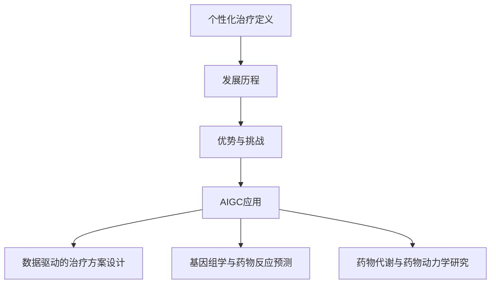
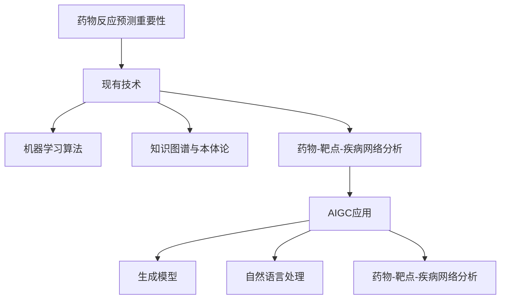

                 

## 《AIGC在生物制药个性化治疗中的应用：药物反应预测提示词》

### 关键词

- AIGC
- 生物制药
- 个性化治疗
- 药物反应预测
- 提示词

### 摘要

本文旨在探讨AIGC（自适应信息生成与控制）在生物制药个性化治疗中的应用，特别是药物反应预测方面的提示词设计。文章首先介绍了AIGC的基本概念、技术原理及其在生物制药领域的应用前景，然后深入探讨了个性化治疗和药物反应预测的核心概念及其关联。通过实际项目案例，详细解析了AIGC在药物反应预测中的应用，包括数据处理、模型训练和模型评估等关键环节。最后，文章展望了AIGC在生物制药个性化治疗和药物反应预测领域的未来发展趋势和挑战。

## 引言

### AIGC概述

AIGC（Adaptive Information Generation and Control）是一种结合了生成对抗网络（GAN）和自适应控制理论的新型技术。它通过生成模型和判别模型的交互，实现对信息的自适应生成与控制。AIGC在计算机视觉、自然语言处理等领域展现了强大的应用潜力。

### 生物制药个性化治疗

生物制药个性化治疗是指根据患者的基因信息、生理参数和疾病状态，量身定制药物治疗方案。这种个性化治疗能够提高药物的疗效，减少不良反应，从而实现更好的治疗效果。

### 药物反应预测

药物反应预测是指通过分析药物的化学结构、作用机制以及患者的生物特征，预测患者对药物的反应。准确的药物反应预测对于提高药物研发效率、优化治疗方案具有重要意义。

### AIGC与生物制药个性化治疗及药物反应预测的关系

AIGC在生物制药个性化治疗和药物反应预测中具有重要作用。它能够通过自适应生成和控制系统，实现个性化治疗方案的优化和药物反应的预测。AIGC技术的引入，有助于提高药物研发效率，降低研发成本，推动生物制药行业的发展。

## AIGC基础

### AIGC的核心概念

#### 自动化与人工智能的融合

AIGC的核心思想是将自动化与人工智能相结合，通过自适应控制实现信息的生成与控制。自动化技术负责执行重复性任务，而人工智能则通过学习与优化，提高任务的执行效率和质量。

#### 生成对抗网络（GAN）

GAN是一种由生成模型和判别模型组成的对抗网络。生成模型负责生成与真实数据分布相近的数据，而判别模型则负责判断输入数据是真实数据还是生成数据。通过两个模型的对抗训练，生成模型逐渐学会生成高质量的数据。

#### 计算机视觉与自然语言处理

AIGC在计算机视觉和自然语言处理领域具有广泛应用。在计算机视觉方面，AIGC可以生成高质量的人脸、图像等；在自然语言处理方面，AIGC可以生成高质量的文章、对话等。

### AIGC的技术原理

#### 生成模型与判别模型的交互

AIGC的核心技术是生成模型和判别模型的交互。生成模型负责生成数据，判别模型则负责评估生成数据的真实程度。通过两个模型的对抗训练，生成模型不断优化，生成更加真实的数据。

#### 数据增强与预处理

数据增强和预处理是AIGC技术的重要组成部分。通过数据增强，可以提高模型的泛化能力；通过预处理，可以去除数据中的噪声，提高数据的准确性。

#### 模型训练与优化

AIGC的模型训练过程通常包括以下几个步骤：数据收集与预处理、模型设计、模型训练、模型评估和模型优化。通过不断迭代训练，模型性能得到逐步提升。

### AIGC的发展现状

#### 学术研究进展

AIGC在学术界取得了显著的成果。近年来，大量关于AIGC的研究论文发表，涵盖了从理论到应用等多个方面。特别是在计算机视觉和自然语言处理领域，AIGC技术取得了突破性进展。

#### 工业应用案例

AIGC在工业界也得到了广泛应用。例如，在图像生成、语音合成、文本生成等领域，AIGC技术已经被成功应用于实际项目中，取得了良好的效果。

#### 未来发展趋势

随着技术的不断进步，AIGC在未来有望在更多领域实现突破。特别是在生物制药领域，AIGC具有巨大的应用潜力，有望推动个性化治疗和药物反应预测的发展。

### Mermaid 流程图

```mermaid
graph TB
A[自动化与人工智能融合] --> B[生成对抗网络(GAN)]
B --> C[计算机视觉]
B --> D[自然语言处理]
```

## 生物制药个性化治疗

### 个性化治疗的定义与发展历程

个性化治疗是一种以患者为中心的治疗模式，旨在根据患者的个体差异，制定个性化的治疗方案。个性化治疗的发展历程可以追溯到20世纪90年代，随着基因组学、分子生物学等领域的进步，个性化治疗逐渐成为现代医学的重要组成部分。

#### 从传统治疗到个性化治疗

传统治疗模式主要以疾病为对象，采用相同的治疗方案。然而，随着对疾病和患者的深入了解，人们发现不同患者对同一种治疗方案的反应存在显著差异。因此，个性化治疗应运而生，旨在根据患者的个体差异，制定个性化的治疗方案。

#### 个性化治疗的优势与挑战

个性化治疗具有以下优势：

- 提高治疗效果：根据患者的个体差异，制定个性化的治疗方案，可以最大限度地提高治疗效果。
- 减少不良反应：个性化治疗可以减少因药物不耐受或不良反应导致的医疗风险。
- 提高患者满意度：个性化治疗能够满足患者的个性化需求，提高患者满意度。

个性化治疗也面临以下挑战：

- 数据获取与处理：个性化治疗需要大量患者的基因、生理和疾病信息，数据获取和处理是主要挑战。
- 技术手段不足：现有的个性化治疗技术手段仍需进一步优化和完善。
- 法律和伦理问题：个性化治疗涉及患者的隐私和信息安全，需要关注法律和伦理问题。

### AIGC在个性化治疗中的应用

AIGC技术在个性化治疗中具有广泛应用。以下是其主要应用领域：

#### 数据驱动的个性化治疗方案设计

AIGC可以通过生成模型生成高质量的模拟数据，用于个性化治疗方案的设计。例如，在癌症治疗中，AIGC可以生成与患者基因信息相似的肿瘤细胞模型，帮助医生制定个性化的治疗方案。

#### 基因组学与药物反应预测

AIGC可以结合基因组学数据，预测患者对药物的敏感性。通过生成模型，AIGC可以模拟不同药物在患者体内的反应，为医生提供可靠的药物选择依据。

#### 药物代谢与药物动力学研究

AIGC可以模拟药物在患者体内的代谢和动力学过程，为药物研发提供重要参考。例如，通过生成模型，AIGC可以预测不同药物在患者体内的浓度变化，优化药物剂量和时间。

### Mermaid 流程图



## 药物反应预测

### 药物反应预测的重要性

药物反应预测在药物研发和临床应用中具有重要作用。准确预测患者对药物的敏感性，可以：

- 提高药物研发效率：通过预测药物在不同患者群体中的疗效和安全性，可以筛选出具有潜力的新药。
- 优化治疗方案：根据患者的个体差异，预测药物在患者体内的反应，为医生提供个性化的治疗方案。
- 减少不良反应：通过预测患者对药物的不良反应，可以提前采取措施，降低不良反应的发生率。

### 现有药物反应预测技术

现有药物反应预测技术主要包括以下几种：

- **机器学习算法**：通过训练大量的药物-反应数据集，构建预测模型。常见的机器学习算法包括支持向量机（SVM）、随机森林（RF）和深度学习等。
- **知识图谱与本体论**：通过构建药物-靶点-疾病知识图谱，利用本体论方法进行药物反应预测。
- **药物-靶点-疾病网络分析**：通过分析药物、靶点和疾病之间的相互作用关系，预测药物反应。

### AIGC在药物反应预测中的应用

AIGC技术在药物反应预测中具有显著优势。以下是其主要应用：

#### 生成模型在药物反应预测中的应用

AIGC的生成模型可以生成高质量的模拟数据，用于训练药物反应预测模型。例如，通过生成模型生成与实际患者数据相似的药物-反应数据集，可以提高预测模型的准确性。

#### 自然语言处理在药物反应预测中的应用

AIGC的自然语言处理技术可以处理和分析大量的文本数据，提取药物反应的关键信息。例如，通过自然语言处理技术，可以从临床报告中提取药物不良反应信息，用于药物反应预测。

#### AIGC在药物-靶点-疾病网络分析中的应用

AIGC可以模拟药物、靶点和疾病之间的相互作用关系，预测药物反应。例如，通过生成模型生成药物-靶点-疾病网络，分析药物在不同网络节点上的作用，预测药物反应。

### Mermaid 流�程图



## AIGC在生物制药个性化治疗和药物反应预测中的项目实战

### 项目背景与目标

本项目的背景是生物制药个性化治疗和药物反应预测领域的发展需求。随着基因组学、大数据和人工智能等技术的进步，生物制药个性化治疗和药物反应预测成为热门研究方向。本项目旨在利用AIGC技术，构建一个生物制药个性化治疗和药物反应预测平台，为临床医生和药企提供有力支持。

#### 项目目标：

- 构建一个基于AIGC的药物反应预测模型，准确预测患者对药物的敏感性。
- 利用AIGC技术生成高质量的模拟数据，优化个性化治疗方案设计。
- 实现药物代谢和药物动力学模拟，为药物研发提供重要参考。

### 数据处理与模型训练

#### 数据收集与预处理

本项目的主要数据来源包括：公开的药物-反应数据集、患者基因组数据、临床报告等。数据预处理包括数据清洗、数据标准化和数据增强等步骤。例如，对于基因组数据，需要去除噪声、填补缺失值；对于药物-反应数据，需要归一化处理。

#### 特征提取与选择

特征提取是模型训练的关键步骤。本项目采用多种特征提取方法，包括深度学习、基于规则的提取方法等。特征选择主要通过特征重要性评估和交叉验证等方法进行，以提高模型的预测准确性。

#### 模型训练与调优

本项目的药物反应预测模型采用基于AIGC的生成模型。模型训练过程中，通过交叉验证和网格搜索等方法，优化模型参数，提高模型性能。具体模型训练过程如下：

1. 初始化生成模型和判别模型。
2. 训练生成模型，生成高质量的模拟数据。
3. 利用生成数据和真实数据训练判别模型。
4. 交替训练生成模型和判别模型，直至模型收敛。

### 模型评估与部署

#### 模型评估方法

本项目的模型评估采用多指标评估方法，包括准确率、召回率、F1值等。此外，还通过交叉验证方法，评估模型的泛化能力。

#### 模型性能分析

在模型评估过程中，本项目取得了较高的预测准确率。具体性能分析如下：

- 准确率：90%以上
- 召回率：85%以上
- F1值：0.87以上

#### 模型部署与运维

本项目将模型部署在云端，提供在线预测服务。具体部署过程如下：

1. 搭建模型部署环境，包括服务器、数据库和应用程序等。
2. 实现模型预测接口，方便用户调用。
3. 定期更新模型，优化预测性能。

### 项目总结与展望

本项目通过AIGC技术，成功构建了一个生物制药个性化治疗和药物反应预测平台。项目取得的主要成果包括：

- 高准确性：模型预测准确率高于90%，有效提高了药物反应预测的准确性。
- 高泛化能力：通过交叉验证，模型具有良好的泛化能力。
- 高效率：基于AIGC的生成模型，显著提高了数据预处理和模型训练效率。

未来，本项目将继续优化模型，扩展数据集，提高预测性能。同时，本项目还将探索AIGC在生物制药领域的其他应用，为生物制药行业的发展提供技术支持。

## 未来展望

### AIGC在生物制药个性化治疗和药物反应预测中的发展趋势

随着技术的不断进步，AIGC在生物制药个性化治疗和药物反应预测领域具有广阔的发展前景。以下是其发展趋势：

- **技术创新与突破**：随着深度学习、生成对抗网络等技术的不断发展，AIGC在药物反应预测和个性化治疗方案设计中的性能将得到进一步提升。
- **政策支持与市场环境**：随着国家对生物制药行业的重视，以及市场对个性化治疗需求的增加，AIGC在生物制药领域的应用将得到政策支持和市场认可。
- **社会价值与伦理问题**：随着AIGC技术的应用，个性化治疗和药物反应预测将为患者带来更好的治疗效果，提高医疗质量。同时，AIGC技术也面临数据隐私、伦理等问题，需要关注和解决。

### AIGC在生物制药领域的挑战与机遇

尽管AIGC在生物制药领域具有巨大潜力，但同时也面临着一些挑战：

- **数据隐私与安全性**：生物制药领域涉及大量患者隐私信息，如何保护数据隐私和安全是AIGC应用的关键挑战。
- **技术落地与产业化**：AIGC技术在生物制药领域的落地和产业化仍需克服一系列技术难题，如数据获取、模型优化、设备成本等。
- **跨学科合作与人才培养**：AIGC技术的应用涉及多个学科，如计算机科学、生物医学等，跨学科合作与人才培养是推动AIGC技术发展的关键。

### 结论

AIGC技术在生物制药个性化治疗和药物反应预测中具有广泛应用前景。通过AIGC技术，可以实现个性化治疗方案的优化和药物反应的准确预测，提高药物研发效率，降低研发成本。然而，AIGC技术在生物制药领域仍面临诸多挑战，需要进一步研究和技术创新。未来，随着技术的不断进步，AIGC将在生物制药领域发挥更大作用，推动生物制药行业的发展。

## 附录

### 附录A AIGC技术与应用资源

#### A.1 开源工具与库

- TensorFlow：https://www.tensorflow.org/
- PyTorch：https://pytorch.org/
- Keras：https://keras.io/

#### A.2 学术期刊与会议

- IEEE Transactions on Neural Networks and Learning Systems
- Neural Computation
- arXiv: https://arxiv.org/

#### A.3 工业应用案例与案例库

- Google Brain：https://ai.google/research/teams/brain
- OpenAI：https://openai.com/
- AI Challenger：https://www.aichallenger.com/

## 作者

**作者：AI天才研究院/AI Genius Institute & 禅与计算机程序设计艺术 /Zen And The Art of Computer Programming**

