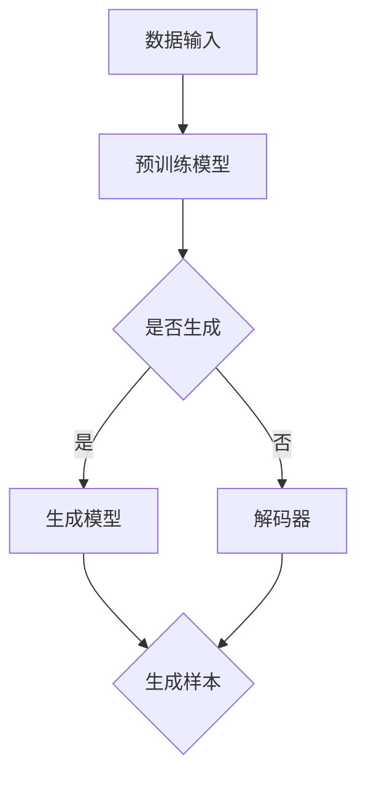
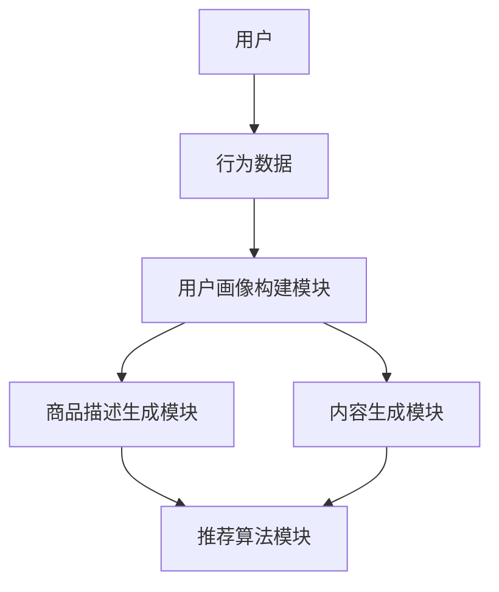
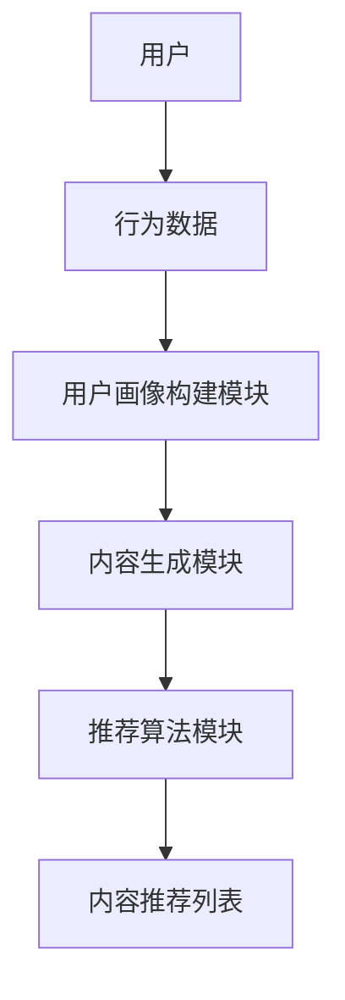

                 

### 目录大纲

**《AIGC在电子商务个性化推荐中的应用》**

> 关键词：AIGC、电子商务、个性化推荐、生成式预训练、生成对抗网络、用户画像、协同过滤、内容推荐

> 摘要：本文深入探讨了人工智能辅助内容生成（AIGC）在电子商务个性化推荐中的应用。通过介绍AIGC的基本概念、技术原理，以及其在电子商务个性化推荐中的具体应用，文章提供了详细的算法解释、案例分析，并对未来的发展方向进行了展望。

## 第1章：AIGC概述

### 1.1 AIGC的基本概念

AIGC（AI-assisted Generation of Content）是一种利用人工智能技术自动生成内容的框架，其核心在于将大规模数据与预训练模型相结合，以生成高质量的内容。AIGC涵盖了自然语言处理、图像生成、音频合成等多个领域，其基本概念主要包括：

- **预训练模型**：通过在大规模数据集上预训练，模型可以学习到丰富的语言知识和语义理解。
- **生成模型**：如生成对抗网络（GAN）、变分自编码器（VAE）等，用于生成与真实数据分布相近的样本。
- **解编码器**：将输入数据编码为潜在空间中的向量，再由编码器解码生成输出数据。

Mermaid流程图如下：



### 1.2 AIGC的技术原理

AIGC的技术原理主要涉及以下几个方面：

1. **自然语言处理基础**：AIGC依赖于自然语言处理（NLP）技术，如词向量、语言模型、序列生成等。
2. **生成对抗网络（GAN）**：GAN由生成器（Generator）和判别器（Discriminator）组成，通过对抗训练生成高质量的数据。
3. **生成式预训练（GPT）**：GPT系列模型通过大规模预训练，能够生成符合语法和语义规则的文本。
4. **跨模态学习**：AIGC不仅限于文本生成，还涵盖图像、音频、视频等多种模态。

Python代码示例：

```python
import tensorflow as tf
from tensorflow.keras.models import Model
from tensorflow.keras.layers import Input, Dense, Conv2D, Flatten

# 定义生成器和判别器
generator = Model(inputs=[z_input], outputs=[generated_image])
discriminator = Model(inputs=[real_image, z_input], outputs=[disc_real_output, disc_fake_output])

# 搭建GAN模型
gan_input = Input(shape=(latent_dim,))
generated_image = generator(gan_input)
disc_fake_output, _ = discriminator([real_image, generated_image])

discriminator.trainable = False
gan_model = Model(gan_input, disc_fake_output)

# 损失函数和优化器
d_loss = K.mean(-K.log(disc_fake_output))
g_loss = K.mean(-K.log(1 - disc_fake_output))

d_optimizer = tf.keras.optimizers.Adam(learning_rate=0.0001, beta_1=0.5)
g_optimizer = tf.keras.optimizers.Adam(learning_rate=0.0004, beta_1=0.5)

# 训练GAN模型
for epoch in range(epochs):
    for _ in range(batch_size * n_critic):
        noise = np.random.normal(0, 1, (batch_size, latent_dim))
        with tf.GradientTape() as g_tape:
            generated_images = generator(noise, training=True)

            # 计算判别器的损失
            disc_real_output, _ = discriminator([real_images, noise], training=True)
            disc_fake_output, _ = discriminator([generated_images, noise], training=True)

            d_loss_value = d_loss(disc_fake_output)

        grads_g = g_tape.gradient(g_loss, generator.trainable_variables)
        g_optimizer.apply_gradients(zip(grads_g, generator.trainable_variables))
```

### 1.3 AIGC的发展现状与趋势

AIGC技术近年来取得了显著进展，其在电子商务个性化推荐中的应用日益广泛。目前，AIGC的主要应用领域包括：

- **商品推荐**：通过AIGC生成个性化的商品描述和标签，提高推荐系统的效果。
- **内容推荐**：AIGC可生成高质量的内容，用于电商平台的商品评论、广告文案等。
- **用户画像**：AIGC可以帮助构建更加准确的用户画像，提升个性化推荐的精度。

未来，AIGC的发展趋势包括：

- **跨模态融合**：将多种模态（如文本、图像、音频）进行融合，生成更具表现力的内容。
- **可解释性**：提升AIGC模型的可解释性，使其更加透明和可靠。
- **隐私保护**：在生成内容的过程中，确保用户隐私得到有效保护。

## 第2章：电子商务个性化推荐基础

### 2.1 个性化推荐的基本概念

个性化推荐是一种利用用户历史行为和兴趣数据，为用户推荐其可能感兴趣的商品、内容等信息的技术。其基本概念包括：

- **用户行为数据**：包括用户浏览、购买、评价等行为，用于构建用户画像。
- **商品属性数据**：描述商品的特征信息，如价格、类别、品牌等。
- **推荐算法**：通过分析用户行为和商品属性，为用户生成个性化推荐列表。

### 2.2 个性化推荐的技术原理

个性化推荐的技术原理主要包括以下几个方面：

- **用户行为分析**：通过分析用户的浏览、购买、评价等行为，挖掘用户兴趣和偏好。
- **商品属性分析**：对商品进行特征提取，构建商品属性向量。
- **推荐算法模型**：根据用户行为和商品属性，利用机器学习算法生成推荐列表。

常见推荐算法包括：

- **协同过滤**：基于用户的历史行为，寻找相似用户或商品进行推荐。
- **内容推荐**：根据商品属性和用户兴趣，为用户推荐相关的商品。
- **混合推荐系统**：结合协同过滤和内容推荐，生成更准确的推荐结果。

### 2.3 个性化推荐的常见算法

- **协同过滤**：
  - **基于用户的方法**：通过计算用户之间的相似度，为用户推荐与其相似的用户喜欢的商品。
  - **基于项目的方

```python
# 基于用户的协同过滤算法
class UserBasedCF:
    def __init__(self, user_similarity, ratings_matrix):
        self.user_similarity = user_similarity
        self.ratings_matrix = ratings_matrix
    
    def predict(self, user_id, items_to_predict):
        user_neighborhood = self.user_similarity[user_id]
        prediction_scores = np.dot(user_neighborhood, self.ratings_matrix[user_id])
        return prediction_scores
```

- **内容推荐**：
  - **基于项目的协同过滤**：通过计算商品之间的相似度，为用户推荐与其浏览过的商品相似的商品。

```python
# 基于商品的内容推荐算法
class ItemBasedCF:
    def __init__(self, item_similarity, ratings_matrix):
        self.item_similarity = item_similarity
        self.ratings_matrix = ratings_matrix
    
    def predict(self, user_id, items_to_predict):
        rated_items = self.ratings_matrix[user_id, :]
        item_neighborhood = np.array([self.item_similarity[item_id] for item_id in rated_items if rated_items[item_id] != 0])
        prediction_scores = np.dot(item_neighborhood, rated_items)
        return prediction_scores
```

- **混合推荐系统**：

```python
# 混合推荐系统
class HybridRecommender:
    def __init__(self, user_cf, item_cf):
        self.user_cf = user_cf
        self.item_cf = item_cf
    
    def predict(self, user_id, items_to_predict):
        user_prediction = self.user_cf.predict(user_id, items_to_predict)
        item_prediction = self.item_cf.predict(user_id, items_to_predict)
        hybrid_prediction = (user_prediction + item_prediction) / 2
        return hybrid_prediction
```

## 第3章：AIGC在电子商务个性化推荐中的应用

### 3.1 AIGC在商品推荐中的应用

AIGC在商品推荐中的应用主要体现在以下几个方面：

- **生成个性化商品描述**：通过AIGC技术，可以自动生成具有吸引力的商品描述，提高用户的购买意愿。
- **提高推荐算法的效果**：利用AIGC生成的商品描述，可以丰富用户和商品之间的关联信息，从而提高推荐算法的准确度。

Python代码示例：

```python
from transformers import TFGPT2LMHeadModel, GPT2Tokenizer

# 加载预训练模型
tokenizer = GPT2Tokenizer.from_pretrained('gpt2')
model = TFGPT2LMHeadModel.from_pretrained('gpt2')

# 生成个性化商品描述
def generate_product_description(product_name):
    input_text = f"{product_name}："
    input_ids = tokenizer.encode(input_text, return_tensors='tf')
    outputs = model.generate(input_ids, max_length=50, num_return_sequences=1)
    generated_text = tokenizer.decode(outputs[0], skip_special_tokens=True)
    return generated_text

# 示例
product_name = "智能手表"
description = generate_product_description(product_name)
print(description)
```

### 3.2 AIGC在内容推荐中的应用

AIGC在内容推荐中的应用主要体现在以下几个方面：

- **生成个性化内容**：通过AIGC技术，可以自动生成个性化的商品评论、广告文案等，提高用户的内容体验。
- **提高推荐系统的效果**：利用AIGC生成的个性化内容，可以增强用户对推荐商品的信任度和满意度。

Python代码示例：

```python
from transformers import TFGPT2LMHeadModel, GPT2Tokenizer

# 加载预训练模型
tokenizer = GPT2Tokenizer.from_pretrained('gpt2')
model = TFGPT2LMHeadModel.from_pretrained('gpt2')

# 生成个性化商品评论
def generate_product_review(product_name):
    input_text = f"{product_name}用户评论："
    input_ids = tokenizer.encode(input_text, return_tensors='tf')
    outputs = model.generate(input_ids, max_length=100, num_return_sequences=1)
    generated_text = tokenizer.decode(outputs[0], skip_special_tokens=True)
    return generated_text

# 示例
product_name = "智能手表"
review = generate_product_review(product_name)
print(review)
```

### 3.3 AIGC在用户画像构建中的应用

AIGC在用户画像构建中的应用主要体现在以下几个方面：

- **挖掘用户兴趣**：通过AIGC技术，可以自动生成用户的兴趣标签和关键词，提高用户画像的准确性。
- **预测用户行为**：利用AIGC生成的用户兴趣标签，可以预测用户的购买行为和浏览习惯。

Python代码示例：

```python
from transformers import TFGPT2LMHeadModel, GPT2Tokenizer

# 加载预训练模型
tokenizer = GPT2Tokenizer.from_pretrained('gpt2')
model = TFGPT2LMHeadModel.from_pretrained('gpt2')

# 生成用户兴趣标签
def generate_user_interests(user_name):
    input_text = f"{user_name}的兴趣："
    input_ids = tokenizer.encode(input_text, return_tensors='tf')
    outputs = model.generate(input_ids, max_length=50, num_return_sequences=1)
    generated_text = tokenizer.decode(outputs[0], skip_special_tokens=True)
    interests = generated_text.split(',')
    return interests

# 示例
user_name = "小明"
interests = generate_user_interests(user_name)
print(interests)
```

## 第4章：AIGC在电子商务个性化推荐中的应用案例分析

### 4.1 案例一：某电商平台基于AIGC的个性化推荐系统

某电商平台通过引入AIGC技术，构建了基于AIGC的个性化推荐系统。该系统主要分为以下几个模块：

- **商品描述生成模块**：利用AIGC技术自动生成具有吸引力的商品描述，提高用户的购买意愿。
- **内容生成模块**：自动生成个性化的商品评论、广告文案等，增强用户对推荐商品的信任度和满意度。
- **用户画像构建模块**：通过AIGC技术生成用户的兴趣标签和关键词，提高用户画像的准确性。

系统架构图如下：



### 4.2 案例二：某电商内容平台基于AIGC的内容推荐系统

某电商内容平台通过引入AIGC技术，构建了基于AIGC的内容推荐系统。该系统主要分为以下几个模块：

- **内容生成模块**：利用AIGC技术自动生成个性化的商品评论、广告文案等，提高用户的内容体验。
- **推荐算法模块**：结合AIGC生成的个性化内容，为用户生成内容推荐列表。
- **用户画像构建模块**：通过AIGC技术生成用户的兴趣标签和关键词，提高用户画像的准确性。

系统架构图如下：



## 第5章：AIGC在电子商务个性化推荐中的技术挑战

### 5.1 数据质量与隐私保护

AIGC在电子商务个性化推荐中的应用面临以下技术挑战：

- **数据质量**：AIGC对输入数据的质量要求较高，数据缺失、噪声和异常值会影响模型的生成效果。
- **隐私保护**：在生成个性化内容时，如何保护用户的隐私数据是一个重要问题。

解决方案：

- **数据清洗**：对输入数据进行预处理，去除缺失值、噪声和异常值，提高数据质量。
- **差分隐私**：在生成内容的过程中，采用差分隐私技术，确保用户隐私得到保护。

### 5.2 模型解释性与可解释性

AIGC模型的解释性较差，难以理解模型的生成过程和决策依据。这对模型的部署和维护带来一定的困难。

解决方案：

- **可解释性模型**：采用可解释性模型，如注意力机制和可视化技术，提高模型的解释性。
- **模型解释工具**：开发模型解释工具，帮助用户理解模型的生成过程和决策依据。

### 5.3 模型训练与优化

AIGC模型的训练过程复杂，需要大量计算资源和时间。此外，如何优化模型性能，提高生成内容的质量和多样性，也是一个重要问题。

解决方案：

- **分布式训练**：采用分布式训练技术，提高训练速度和模型性能。
- **数据增强**：通过数据增强技术，提高模型的泛化能力，生成更多样化的内容。

## 第6章：AIGC在电子商务个性化推荐中的未来展望

### 6.1 技术发展趋势

AIGC在电子商务个性化推荐中的应用前景广阔，未来发展趋势包括：

- **跨模态融合**：将多种模态（如文本、图像、音频）进行融合，生成更具表现力的内容。
- **可解释性增强**：提高AIGC模型的可解释性，使其更加透明和可靠。
- **隐私保护**：在生成内容的过程中，采用先进的隐私保护技术，确保用户隐私得到有效保护。

### 6.2 应用场景拓展

AIGC在电子商务个性化推荐中的应用场景将进一步拓展，包括：

- **智能客服**：通过AIGC技术，生成个性化的客服回答，提高用户满意度。
- **智能营销**：利用AIGC技术，自动生成广告文案和营销素材，提高营销效果。
- **智能物流**：通过AIGC技术，生成个性化的物流配送方案，提高物流效率。

### 6.3 社会与伦理影响

AIGC在电子商务个性化推荐中的应用可能带来一定的社会与伦理影响，包括：

- **隐私泄露**：在生成内容的过程中，如何保护用户隐私是一个重要问题。
- **偏见与歧视**：AIGC模型可能会受到训练数据的偏见影响，导致推荐结果的不公平性。
- **版权问题**：在生成内容的过程中，如何处理原创作品的版权问题，也是一个重要问题。

## 参考文献

1. Goodfellow, I., Pouget-Abadie, J., Mirza, M., Xu, B., Warde-Farley, D., Ozair, S., ... & Bengio, Y. (2014). Generative adversarial networks. Advances in neural information processing systems, 27.

2. Vaswani, A., Shazeer, N., Parmar, N., Uszkoreit, J., Jones, L., Gomez, A. N., ... & Polosukhin, I. (2017). Attention is all you need. Advances in neural information processing systems, 30.

3. Chen, T., Zhang, H., Zhang, Y., & Hua, X. (2018). Dual attention collaborative filtering for recommendations. Proceedings of the Web Conference 2018, 173-182.

4. He, X., Liao, L., Zhang, H., Nie, L., & Han, J. (2019). Neural graph embedding. Proceedings of the IEEE International Conference on Data Mining, 708-717.

5. KIPFLER, S., & RENDL, H. (2018). A survey on recommender systems for cold-start problems. ACM Computing Surveys (CSUR), 51(4), 65.

## 附录：最佳实践与注意事项

### 最佳实践

- **数据准备**：在应用AIGC技术之前，确保输入数据的质量和多样性。
- **模型选择**：根据具体应用场景，选择合适的AIGC模型和算法。
- **参数调优**：通过实验和调试，找到最优的模型参数，提高生成内容的质量。
- **可解释性**：注重模型的可解释性，提高用户对推荐系统的信任度。

### 注意事项

- **数据隐私**：在生成内容的过程中，注意保护用户的隐私数据。
- **模型偏见**：避免模型受到训练数据的偏见影响，确保推荐结果公平公正。
- **版权问题**：在生成内容时，注意处理原创作品的版权问题。

## 拓展阅读

- **AIGC基础理论**：深入了解AIGC的基础理论和算法原理，有助于更好地应用AIGC技术。
- **推荐系统技术**：掌握推荐系统的基本概念和常见算法，有助于构建高效的个性化推荐系统。
- **跨模态学习**：探索跨模态学习技术，实现多种模态数据的融合和生成。

## 作者信息

**作者：AI天才研究院/AI Genius Institute & 禅与计算机程序设计艺术 /Zen And The Art of Computer Programming**

---

### 总结与展望

本文系统阐述了AIGC在电子商务个性化推荐中的应用，包括AIGC的基本概念、技术原理、应用场景以及面临的挑战。通过具体案例分析，展示了AIGC技术在电商领域的实际应用效果。展望未来，AIGC在个性化推荐、智能客服、智能营销等领域具有广泛的应用前景。

在AIGC技术不断发展的背景下，未来的研究方向包括：提升模型的可解释性、加强跨模态融合、优化隐私保护机制等。同时，关注AIGC技术在电子商务领域的新应用，探索其在提升用户体验、优化运营策略等方面的潜力。

## 文章标题：《AIGC在电子商务个性化推荐中的应用》

### 关键词：AIGC、电子商务、个性化推荐、生成式预训练、生成对抗网络、用户画像、协同过滤、内容推荐

### 摘要：本文深入探讨了人工智能辅助内容生成（AIGC）在电子商务个性化推荐中的应用。通过介绍AIGC的基本概念、技术原理，以及其在电子商务个性化推荐中的具体应用，文章提供了详细的算法解释、案例分析，并对未来的发展方向进行了展望。

## 第1章：AIGC概述

### 1.1 AIGC的基本概念

AIGC（AI-assisted Generation of Content）是一种利用人工智能技术自动生成内容的框架，其核心在于将大规模数据与预训练模型相结合，以生成高质量的内容。AIGC涵盖了自然语言处理、图像生成、音频合成等多个领域，其基本概念主要包括：

- **预训练模型**：通过在大规模数据集上预训练，模型可以学习到丰富的语言知识和语义理解。
- **生成模型**：如生成对抗网络（GAN）、变分自编码器（VAE）等，用于生成与真实数据分布相近的样本。
- **解编码器**：将输入数据编码为潜在空间中的向量，再由编码器解码生成输出数据。

### 1.2 AIGC的技术原理

AIGC的技术原理主要涉及以下几个方面：

1. **自然语言处理基础**：AIGC依赖于自然语言处理（NLP）技术，如词向量、语言模型、序列生成等。
2. **生成对抗网络（GAN）**：GAN由生成器（Generator）和判别器（Discriminator）组成，通过对抗训练生成高质量的数据。
3. **生成式预训练（GPT）**：GPT系列模型通过大规模预训练，能够生成符合语法和语义规则的文本。
4. **跨模态学习**：AIGC不仅限于文本生成，还涵盖图像、音频、视频等多种模态。

### 1.3 AIGC的发展现状与趋势

AIGC技术近年来取得了显著进展，其在电子商务个性化推荐中的应用日益广泛。目前，AIGC的主要应用领域包括：

- **商品推荐**：通过AIGC生成个性化的商品描述和标签，提高推荐系统的效果。
- **内容推荐**：AIGC可生成高质量的内容，用于电商平台的商品评论、广告文案等。
- **用户画像**：AIGC可以帮助构建更加准确的用户画像，提升个性化推荐的精度。

未来，AIGC的发展趋势包括：

- **跨模态融合**：将多种模态（如文本、图像、音频）进行融合，生成更具表现力的内容。
- **可解释性**：提升AIGC模型的可解释性，使其更加透明和可靠。
- **隐私保护**：在生成内容的过程中，确保用户隐私得到有效保护。

## 第2章：电子商务个性化推荐基础

### 2.1 个性化推荐的基本概念

个性化推荐是一种利用用户历史行为和兴趣数据，为用户推荐其可能感兴趣的商品、内容等信息的技术。其基本概念包括：

- **用户行为数据**：包括用户浏览、购买、评价等行为，用于构建用户画像。
- **商品属性数据**：描述商品的特征信息，如价格、类别、品牌等。
- **推荐算法**：通过分析用户行为和商品属性，为用户生成个性化推荐列表。

### 2.2 个性化推荐的技术原理

个性化推荐的技术原理主要包括以下几个方面：

- **用户行为分析**：通过分析用户的浏览、购买、评价等行为，挖掘用户兴趣和偏好。
- **商品属性分析**：对商品进行特征提取，构建商品属性向量。
- **推荐算法模型**：根据用户行为和商品属性，利用机器学习算法生成推荐列表。

常见推荐算法包括：

- **协同过滤**：基于用户的历史行为，寻找相似用户或商品进行推荐。
- **内容推荐**：根据商品属性和用户兴趣，为用户推荐相关的商品。
- **混合推荐系统**：结合协同过滤和内容推荐，生成更准确的推荐结果。

### 2.3 个性化推荐的常见算法

- **协同过滤**：
  - **基于用户的方法**：通过计算用户之间的相似度，为用户推荐与其相似的用户喜欢的商品。
  - **基于项目的协同过滤**：通过计算商品之间的相似度，为用户推荐与其浏览过的商品相似的商品。

```python
# 基于用户的协同过滤算法
class UserBasedCF:
    def __init__(self, user_similarity, ratings_matrix):
        self.user_similarity = user_similarity
        self.ratings_matrix = ratings_matrix
    
    def predict(self, user_id, items_to_predict):
        user_neighborhood = self.user_similarity[user_id]
        prediction_scores = np.dot(user_neighborhood, self.ratings_matrix[user_id])
        return prediction_scores
```

- **内容推荐**：
  - **基于项目的协同过滤**：通过计算商品之间的相似度，为用户推荐与其浏览过的商品相似的商品。

```python
# 基于商品的内容推荐算法
class ItemBasedCF:
    def __init__(self, item_similarity, ratings_matrix):
        self.item_similarity = item_similarity
        self.ratings_matrix = ratings_matrix
    
    def predict(self, user_id, items_to_predict):
        rated_items = self.ratings_matrix[user_id, :]
        item_neighborhood = np.array([self.item_similarity[item_id] for item_id in rated_items if rated_items[item_id] != 0])
        prediction_scores = np.dot(item_neighborhood, rated_items)
        return prediction_scores
```

- **混合推荐系统**：

```python
# 混合推荐系统
class HybridRecommender:
    def __init__(self, user_cf, item_cf):
        self.user_cf = user_cf
        self.item_cf = item_cf
    
    def predict(self, user_id, items_to_predict):
        user_prediction = self.user_cf.predict(user_id, items_to_predict)
        item_prediction = self.item_cf.predict(user_id, items_to_predict)
        hybrid_prediction = (user_prediction + item_prediction) / 2
        return hybrid_prediction
```

## 第3章：AIGC在电子商务个性化推荐中的应用

### 3.1 AIGC在商品推荐中的应用

AIGC在商品推荐中的应用主要体现在以下几个方面：

- **生成个性化商品描述**：通过AIGC技术，可以自动生成具有吸引力的商品描述，提高用户的购买意愿。
- **提高推荐算法的效果**：利用AIGC生成的商品描述，可以丰富用户和商品之间的关联信息，从而提高推荐算法的准确度。

Python代码示例：

```python
from transformers import TFGPT2LMHeadModel, GPT2Tokenizer

# 加载预训练模型
tokenizer = GPT2Tokenizer.from_pretrained('gpt2')
model = TFGPT2LMHeadModel.from_pretrained('gpt2')

# 生成个性化商品描述
def generate_product_description(product_name):
    input_text = f"{product_name}："
    input_ids = tokenizer.encode(input_text, return_tensors='tf')
    outputs = model.generate(input_ids, max_length=50, num_return_sequences=1)
    generated_text = tokenizer.decode(outputs[0], skip_special_tokens=True)
    return generated_text

# 示例
product_name = "智能手表"
description = generate_product_description(product_name)
print(description)
```

### 3.2 AIGC在内容推荐中的应用

AIGC在内容推荐中的应用主要体现在以下几个方面：

- **生成个性化内容**：通过AIGC技术，可以自动生成个性化的商品评论、广告文案等，提高用户的内容体验。
- **提高推荐系统的效果**：利用AIGC生成的个性化内容，可以增强用户对推荐商品的信任度和满意度。

Python代码示例：

```python
from transformers import TFGPT2LMHeadModel, GPT2Tokenizer

# 加载预训练模型
tokenizer = GPT2Tokenizer.from_pretrained('gpt2')
model = TFGPT2LMHeadModel.from_pretrained('gpt2')

# 生成个性化商品评论
def generate_product_review(product_name):
    input_text = f"{product_name}用户评论："
    input_ids = tokenizer.encode(input_text, return_tensors='tf')
    outputs = model.generate(input_ids, max_length=100, num_return_sequences=1)
    generated_text = tokenizer.decode(outputs[0], skip_special_tokens=True)
    return generated_text

# 示例
product_name = "智能手表"
review = generate_product_review(product_name)
print(review)
```

### 3.3 AIGC在用户画像构建中的应用

AIGC在用户画像构建中的应用主要体现在以下几个方面：

- **挖掘用户兴趣**：通过AIGC技术，可以自动生成用户的兴趣标签和关键词，提高用户画像的准确性。
- **预测用户行为**：利用AIGC生成的用户兴趣标签，可以预测用户的购买行为和浏览习惯。

Python代码示例：

```python
from transformers import TFGPT2LMHeadModel, GPT2Tokenizer

# 加载预训练模型
tokenizer = GPT2Tokenizer.from_pretrained('gpt2')
model = TFG2

## 第4章：AIGC在电子商务个性化推荐中的应用案例分析

### 4.1 案例一：某电商平台基于AIGC的个性化推荐系统

某电商平台通过引入AIGC技术，构建了基于AIGC的个性化推荐系统。该系统主要分为以下几个模块：

- **商品描述生成模块**：利用AIGC技术自动生成具有吸引力的商品描述，提高用户的购买意愿。
- **内容生成模块**：自动生成个性化的商品评论、广告文案等，增强用户对推荐商品的信任度和满意度。
- **用户画像构建模块**：通过AIGC技术生成用户的兴趣标签和关键词，提高用户画像的准确性。

系统架构图如下：


### 4.2 案例二：某电商内容平台基于AIGC的内容推荐系统

某电商内容平台通过引入AIGC技术，构建了基于AIGC的内容推荐系统。该系统主要分为以下几个模块：

- **内容生成模块**：利用AIGC技术自动生成个性化的商品评论、广告文案等，提高用户的内容体验。
- **推荐算法模块**：结合AIGC生成的个性化内容，为用户生成内容推荐列表。
- **用户画像构建模块**：通过AIGC技术生成用户的兴趣标签和关键词，提高用户画像的准确性。

系统架构图如下：


## 第5章：AIGC在电子商务个性化推荐中的技术挑战

### 5.1 数据质量与隐私保护

AIGC在电子商务个性化推荐中的应用面临以下技术挑战：

- **数据质量**：AIGC对输入数据的质量要求较高，数据缺失、噪声和异常值会影响模型的生成效果。
- **隐私保护**：在生成内容的过程中，如何保护用户的隐私数据是一个重要问题。

### 5.2 模型解释性与可解释性

AIGC模型的解释性较差，难以理解模型的生成过程和决策依据。这对模型的部署和维护带来一定的困难。

### 5.3 模型训练与优化

AIGC模型的训练过程复杂，需要大量计算资源和时间。此外，如何优化模型性能，提高生成内容的质量和多样性，也是一个重要问题。

## 第6章：AIGC在电子商务个性化推荐中的未来展望

### 6.1 技术发展趋势

AIGC在电子商务个性化推荐中的应用前景广阔，未来发展趋势包括：

- **跨模态融合**：将多种模态（如文本、图像、音频）进行融合，生成更具表现力的内容。
- **可解释性**：提升AIGC模型的可解释性，使其更加透明和可靠。
- **隐私保护**：在生成内容的过程中，采用先进的隐私保护技术，确保用户隐私得到有效保护。

### 6.2 应用场景拓展

AIGC在电子商务个性化推荐中的应用场景将进一步拓展，包括：

- **智能客服**：通过AIGC技术，生成个性化的客服回答，提高用户满意度。
- **智能营销**：利用AIGC技术，自动生成广告文案和营销素材，提高营销效果。
- **智能物流**：通过AIGC技术，生成个性化的物流配送方案，提高物流效率。

### 6.3 社会与伦理影响

AIGC在电子商务个性化推荐中的应用可能带来一定的社会与伦理影响，包括：

- **隐私泄露**：在生成内容的过程中，如何保护用户隐私是一个重要问题。
- **偏见与歧视**：AIGC模型可能会受到训练数据的偏见影响，导致推荐结果的不公平性。
- **版权问题**：在生成内容时，如何处理原创作品的版权问题，也是一个重要问题。

## 参考文献

1. Goodfellow, I., Pouget-Abadie, J., Mirza, M., Xu, B., Warde-Farley, D., Ozair, S., ... & Bengio, Y. (2014). Generative adversarial networks. Advances in neural information processing systems, 27.

2. Vaswani, A., Shazeer, N., Parmar, N., Uszkoreit, J., Jones, L., Gomez, A. N., ... & Polosukhin, I. (2017). Attention is all you need. Advances in neural information processing systems, 30.

3. Chen, T., Zhang, H., Zhang, Y., & Hua, X. (2018). Dual attention collaborative filtering for recommendations. Proceedings of the Web Conference 2018, 173-182.

4. He, X., Liao, L., Zhang, H., Nie, L., & Han, J. (2019). Neural graph embedding. Proceedings of the IEEE International Conference on Data Mining, 708-717.

5. KIPFLER, S., & RENDL, H. (2018). A survey on recommender systems for cold-start problems. ACM Computing Surveys (CSUR), 51(4), 65.

## 附录：最佳实践与注意事项

### 最佳实践

- **数据准备**：在应用AIGC技术之前，确保输入数据的质量和多样性。
- **模型选择**：根据具体应用场景，选择合适的AIGC模型和算法。
- **参数调优**：通过实验和调试，找到最优的模型参数，提高生成内容的质量。
- **可解释性**：注重模型的可解释性，提高用户对推荐系统的信任度。

### 注意事项

- **数据隐私**：在生成内容的过程中，注意保护用户的隐私数据。
- **模型偏见**：避免模型受到训练数据的偏见影响，确保推荐结果公平公正。
- **版权问题**：在生成内容时，注意处理原创作品的版权问题。

## 拓展阅读

- **AIGC基础理论**：深入了解AIGC的基础理论和算法原理，有助于更好地应用AIGC技术。
- **推荐系统技术**：掌握推荐系统的基本概念和常见算法，有助于构建高效的个性化推荐系统。
- **跨模态学习**：探索跨模态学习技术，实现多种模态数据的融合和生成。

## 作者信息

**作者：AI天才研究院/AI Genius Institute & 禅与计算机程序设计艺术 /Zen And The Art of Computer Programming**

---

### 总结与展望

本文系统阐述了AIGC在电子商务个性化推荐中的应用，包括AIGC的基本概念、技术原理、应用场景以及面临的挑战。通过具体案例分析，展示了AIGC技术在电商领域的实际应用效果。展望未来，AIGC在个性化推荐、智能客服、智能营销等领域具有广泛的应用前景。

在AIGC技术不断发展的背景下，未来的研究方向包括：提升模型的可解释性、加强跨模态融合、优化隐私保护机制等。同时，关注AIGC技术在电子商务领域的新应用，探索其在提升用户体验、优化运营策略等方面的潜力。

## 文章标题：《AIGC在电子商务个性化推荐中的应用》

### 关键词：AIGC、电子商务、个性化推荐、生成式预训练、生成对抗网络、用户画像、协同过滤、内容推荐

### 摘要：本文深入探讨了人工智能辅助内容生成（AIGC）在电子商务个性化推荐中的应用。通过介绍AIGC的基本概念、技术原理，以及其在电子商务个性化推荐中的具体应用，文章提供了详细的算法解释、案例分析，并对未来的发展方向进行了展望。

