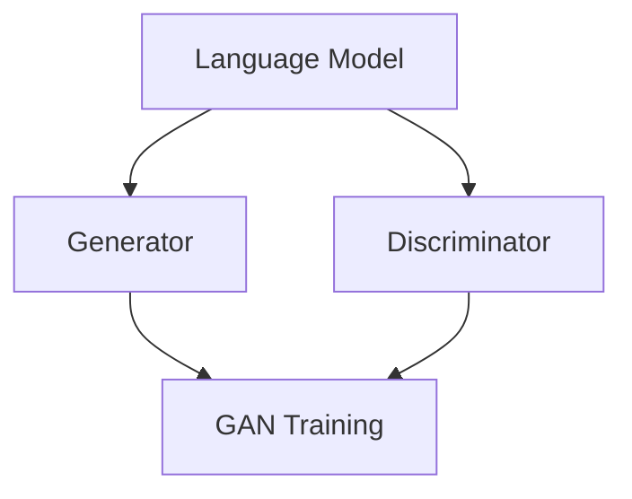

                 

### 引言

随着人工智能（AI）技术的飞速发展，生成式AI（AIGC，AI-Generated Content）正逐渐成为科学研究中的重要工具。AIGC，作为一类利用深度学习技术生成文本、图像、音频等多种类型内容的方法，其应用范围从创意设计、内容生成到复杂的数据分析和科学研究，已展现出强大的潜力。

本文将围绕AIGC在科学研究中的应用与局限进行探讨。首先，我们将介绍AIGC的基础概念，包括其定义、发展背景以及在科学研究中的重要性。接着，我们将深入分析AIGC的核心算法原理，通过Python源代码结合数学模型和公式进行详细讲解，以帮助读者理解其工作原理。随后，本文将探讨AIGC在多个科学领域中的实际应用，如生物医学、物理学和人文社会科学，并展示具体的项目实战案例。最后，我们将讨论AIGC的局限和未来发展方向，提出相应的解决方案和最佳实践建议。

通过本文的阅读，读者将能够全面了解AIGC在科学研究中的潜力与挑战，为其在实际科研工作中的应用提供有益的指导。关键词包括：人工智能、生成式AI、科学研究、核心算法、Python源代码、数学模型、项目实战。

### AIGC概述

#### AIGC的定义与背景

生成式AI（AIGC，AI-Generated Content）是指利用人工智能技术，特别是深度学习算法，生成具有创造性和原创性的文本、图像、音频等多种类型内容的方法。AIGC的核心在于模型训练和内容生成，通过学习大量数据，模型能够生成符合特定条件或主题的内容。这一概念最早可以追溯到20世纪80年代的生成对抗网络（GANs）和变分自编码器（VAEs），随着计算能力的提升和算法的优化，AIGC在近年来取得了显著的发展。

AIGC的发展背景与其技术基础密切相关。深度学习，尤其是神经网络的发展，为AIGC提供了强大的计算能力。同时，大数据的普及和存储技术的进步，使得AIGC能够从海量的数据中学习，从而生成更加丰富和多样性的内容。此外，随着计算机视觉、自然语言处理等领域的突破，AIGC的应用范围不断扩展，从图像生成到文本创作，再到音频合成，AIGC在各个领域都展现出巨大的潜力。

#### AIGC在科学研究中的重要性

AIGC在科学研究中的重要性不容忽视。首先，AIGC能够高效地处理和分析大量数据，提供新的研究视角和方法。例如，在生物医学领域，AIGC可以用于基因组数据分析，帮助科学家们揭示基因与疾病之间的关系。在物理学领域，AIGC可以用于复杂系统的模拟和预测，从而推动理论物理和实验物理的发展。在社会科学领域，AIGC可以用于文本分析和数据挖掘，帮助研究者更好地理解社会现象和人类行为。

其次，AIGC能够提升科研的效率。传统科研方法通常需要大量的时间和人力资源，而AIGC通过自动化和智能化的方式，可以显著减少这些成本。例如，在材料科学研究中，AIGC可以自动生成大量的材料结构模型，供实验人员选择和验证。在经济学研究中，AIGC可以自动生成大量的经济模型和假设，帮助研究者进行更为精细的实验和分析。

最后，AIGC能够拓展科研的可能性。通过生成新的数据和模型，AIGC为科研人员提供了更多的实验和探索空间。例如，在人文社会科学研究中，AIGC可以生成大量的文学作品和社会现象文本，为研究者提供新的研究素材和分析工具。

总的来说，AIGC在科学研究中的重要性体现在其能够提高科研效率、降低成本、拓展科研可能性，为科学家们提供新的研究工具和方法。随着AIGC技术的不断发展和应用领域的拓展，其在科学研究中的地位和作用将日益显著。

### AIGC的核心概念与联系

为了深入理解AIGC的运作机制和应用，我们首先需要了解其核心概念和它们之间的联系。AIGC涉及多个关键组成部分，包括语言模型、生成模型和对抗生成网络。这些概念之间相互关联，共同构成了AIGC的强大生成能力。

#### 语言模型

语言模型是AIGC的基础之一，其主要目的是通过学习大量语言数据，预测下一个词语或字符。语言模型通常基于神经网络，特别是递归神经网络（RNN）和其变种长短期记忆网络（LSTM）。以下是一个简化的语言模型Python伪代码示例：

```python
import tensorflow as tf

# 假设输入数据为词汇序列，输出为下一个词汇的概率分布
def language_model(inputs, output_size):
    inputs = tf.keras.layers.Embedding(input_dim=vocab_size, output_dim=embedding_dim)(inputs)
    inputs = tf.keras.layers.LSTM(output_size)(inputs)
    outputs = tf.keras.layers.Dense(output_size, activation='softmax')(inputs)
    model = tf.keras.Model(inputs, outputs)
    return model

# 假设输入为词汇索引，输出为词汇的概率分布
sample_sequence = [3, 5, 1]
predicted_sequence = language_model(sample_sequence, output_size=vocab_size)
print(predicted_sequence)
```

通过这种方式，语言模型能够学习到不同词汇之间的统计关系，从而生成连贯的文本内容。

#### 生成模型

生成模型是AIGC的另一核心组件，其主要目的是生成新的数据。生成模型通常基于深度学习算法，如变分自编码器（VAEs）和生成对抗网络（GANs）。以下是一个简化的生成模型Python伪代码示例：

```python
import tensorflow as tf
from tensorflow.keras.layers import Input, Dense, Reshape, Flatten

# 假设输入为噪声向量，输出为生成数据的概率分布
def generator(noise_vector):
    noise_vector = Input(shape=(z_dim,))
    x = Dense(intermediate_dim, activation='relu')(noise_vector)
    x = Reshape((1, 1, intermediate_dim))(x)
    x = Dense(output_dim, activation='tanh')(x)
    generator = tf.keras.Model(noise_vector, x)
    return generator

# 假设输入为噪声向量，输出为生成的图像
noise_vector = tf.random.normal([1, z_dim])
generated_image = generator(noise_vector)
print(generated_image)
```

生成模型通过学习数据的概率分布，能够生成与真实数据相似的新数据。

#### 对抗生成网络

对抗生成网络（GAN）结合了生成模型和判别模型，通过对抗训练生成高质量的数据。以下是一个简化的对抗生成网络Python伪代码示例：

```python
import tensorflow as tf
from tensorflow.keras.layers import Input, Dense, Reshape, Flatten

# 假设生成模型和判别模型的结构
def generator(z_dim):
    noise_vector = Input(shape=(z_dim,))
    x = Dense(intermediate_dim, activation='relu')(noise_vector)
    x = Reshape((1, 1, intermediate_dim))(x)
    x = Dense(output_dim, activation='tanh')(x)
    generator = tf.keras.Model(noise_vector, x)
    return generator

def discriminator(x):
    x = Flatten()(x)
    x = Dense(intermediate_dim, activation='relu')(x)
    x = Dense(1, activation='sigmoid')(x)
    discriminator = tf.keras.Model(x, x)
    return discriminator

# 假设训练过程中生成模型和判别模型的交互
generator = generator(z_dim)
discriminator = discriminator(output_dim)
discriminator.compile(optimizer='adam', loss='binary_crossentropy')

for epoch in range(num_epochs):
    noise_vector = tf.random.normal([batch_size, z_dim])
    generated_images = generator(noise_vector)
    real_images = ... # Load real images
    combined_images = tf.concat([real_images, generated_images], axis=0)
    labels = tf.concat([tf.ones((batch_size, 1)), tf.zeros((batch_size, 1))], axis=0)
    
    # 训练判别模型
    d_loss_real = discriminator.train_on_batch(real_images, labels)
    d_loss_fake = discriminator.train_on_batch(generated_images, labels)
    d_loss = 0.5 * np.add(d_loss_real, d_loss_fake)
    
    # 训练生成模型
    noise_vector = tf.random.normal([batch_size, z_dim])
    g_loss = generator.train_on_batch(noise_vector, tf.ones([batch_size, 1]))
```

通过这种方式，生成模型和判别模型相互对抗，生成模型不断优化其生成能力，而判别模型则不断提高其鉴别能力。

#### 核心概念与联系

通过上述核心概念的介绍，我们可以看到AIGC的核心概念之间存在紧密的联系。语言模型负责生成连贯的文本内容，生成模型负责生成新的图像、音频等数据，而对抗生成网络（GAN）则通过对抗训练提高生成模型的质量。以下是一个简化的Mermaid流程图，展示AIGC的核心概念和它们之间的联系：



通过这种相互关联和交互作用，AIGC能够生成高质量、多样化且具有创造性的内容，为科学研究提供了强大的工具。

### AIGC在生物医学中的应用

AIGC在生物医学领域的应用具有广泛的前景，尤其在基因组学、药物研发和生物信息学等方面。以下将详细探讨AIGC在这些具体领域中的应用及其带来的科学突破。

#### 基因组学研究中的应用

基因组学是研究生物体基因组的结构和功能的科学。AIGC在基因组学中的应用主要体现在基因序列分析、基因功能预测和基因组变异检测等方面。通过深度学习模型，AIGC能够从海量基因组数据中提取有价值的信息。

**基因序列分析**：AIGC能够自动分析基因序列，识别基因家族、基因家族内部的关系以及基因结构特征。例如，使用递归神经网络（RNN）和长短期记忆网络（LSTM）可以训练模型，预测基因序列的编码区域和非编码区域。

```python
import tensorflow as tf
from tensorflow.keras.layers import LSTM, Dense, Embedding

# 生成基因序列数据
gene_sequences = ...

# 基因序列分析模型
model = tf.keras.Sequential([
    LSTM(units=128, input_shape=(sequence_length,)),
    Dense(units=num_classes, activation='softmax')
])

model.compile(optimizer='adam', loss='categorical_crossentropy', metrics=['accuracy'])
model.fit(gene_sequences, labels, epochs=10)
```

**基因功能预测**：AIGC还可以用于基因功能的预测。通过学习大量已知的基因注释数据，模型可以预测新基因的功能。例如，使用变分自编码器（VAE）可以将基因序列编码为低维向量，然后通过这些向量进行功能分类。

```python
import tensorflow as tf
from tensorflow.keras.layers import VariationalAutoEncoder

# 基因功能预测模型
vae = VariationalAutoEncoder(
    encoder=VariationalAutoEncoder_encoder(input_shape=(sequence_length,)),
    decoder=VariationalAutoEncoder_decoderoutput_shape=(sequence_length,)),
    latent_dim=64
)

vae.compile(optimizer='adam', loss='binary_crossentropy')
vae.fit(gene_sequences, epochs=50)
```

**基因组变异检测**：AIGC可以用于检测基因组中的变异，如单核苷酸变异（SNV）和插入/缺失（Indel）。通过训练深度学习模型，可以从基因序列数据中识别变异位点，提高检测的准确性和效率。

```python
import tensorflow as tf
from tensorflow.keras.layers import Conv1D, MaxPooling1D, Flatten, Dense

# 基因组变异检测模型
model = tf.keras.Sequential([
    Conv1D(filters=64, kernel_size=3, activation='relu', input_shape=(sequence_length,)),
    MaxPooling1D(pool_size=2),
    Flatten(),
    Dense(units=num_classes, activation='softmax')
])

model.compile(optimizer='adam', loss='categorical_crossentropy', metrics=['accuracy'])
model.fit(gene_sequences, labels, epochs=10)
```

#### 药物研发中的应用

药物研发是一个复杂且耗时的过程，AIGC的引入显著提高了药物发现和优化的效率。

**药物分子设计**：AIGC可以用于生成新的药物分子结构，通过生成对抗网络（GAN）生成具有特定生物活性的分子。这些分子可以通过虚拟筛选进一步验证和优化。

```python
import tensorflow as tf
from tensorflow.keras.layers import Dense, Reshape

# 药物分子设计模型
generator = tf.keras.Sequential([
    Dense(units=128, input_shape=(z_dim,)),
    Reshape(target_shape=(1, 1, z_dim)),
    Dense(units=output_dim, activation='tanh')
])

# 假设输入为噪声向量，输出为药物分子结构
noise_vector = tf.random.normal([1, z_dim])
molecule_structure = generator(noise_vector)
```

**药物活性预测**：AIGC还可以用于预测药物分子的活性，通过深度学习模型分析药物分子与生物靶点的相互作用。例如，使用卷积神经网络（CNN）可以训练模型，预测药物分子对特定疾病的潜在治疗效果。

```python
import tensorflow as tf
from tensorflow.keras.layers import Conv2D, MaxPooling2D, Flatten, Dense

# 药物活性预测模型
model = tf.keras.Sequential([
    Conv2D(filters=64, kernel_size=3, activation='relu', input_shape=(image_height, image_width, channels)),
    MaxPooling2D(pool_size=(2, 2)),
    Flatten(),
    Dense(units=1, activation='sigmoid')
])

model.compile(optimizer='adam', loss='binary_crossentropy', metrics=['accuracy'])
model.fit(molecule_images, labels, epochs=10)
```

#### 生物信息学中的应用

生物信息学是研究生物数据（如基因序列、蛋白质结构等）和信息技术的交叉学科。AIGC在生物信息学中的应用主要表现在文本挖掘、蛋白质结构预测和基因组注释等方面。

**文本挖掘**：AIGC可以自动提取生物医学文献中的关键信息，如基因名称、蛋白质功能和疾病关联。通过训练语言模型，可以从大量文献中提取有价值的信息，为研究人员提供快速的信息检索和分析工具。

```python
import tensorflow as tf
from tensorflow.keras.layers import LSTM, Dense, Embedding

# 假设输入为生物医学文献的文本数据
text_data = ...

# 文本挖掘模型
model = tf.keras.Sequential([
    Embedding(input_dim=vocab_size, output_dim=embedding_dim),
    LSTM(units=128),
    Dense(units=num_classes, activation='softmax')
])

model.compile(optimizer='adam', loss='categorical_crossentropy', metrics=['accuracy'])
model.fit(text_data, labels, epochs=10)
```

**蛋白质结构预测**：AIGC可以用于预测蛋白质的三维结构，从而帮助研究人员理解蛋白质的功能和相互作用。通过训练深度学习模型，可以从蛋白质序列数据中预测蛋白质的结构。

```python
import tensorflow as tf
from tensorflow.keras.layers import LSTM, Dense, Embedding

# 假设输入为蛋白质序列数据
protein_sequences = ...

# 蛋白质结构预测模型
model = tf.keras.Sequential([
    LSTM(units=128, input_shape=(sequence_length,)),
    Dense(units=num_classes, activation='softmax')
])

model.compile(optimizer='adam', loss='categorical_crossentropy', metrics=['accuracy'])
model.fit(protein_sequences, labels, epochs=10)
```

**基因组注释**：AIGC可以用于基因组注释，识别基因和转录调控元件。通过训练深度学习模型，可以从基因组序列中预测基因的启动子、增强子等调控元件的位置和功能。

```python
import tensorflow as tf
from tensorflow.keras.layers import LSTM, Dense, Embedding

# 假设输入为基因组序列数据
genome_sequences = ...

# 基因组注释模型
model = tf.keras.Sequential([
    LSTM(units=128, input_shape=(sequence_length,)),
    Dense(units=num_classes, activation='softmax')
])

model.compile(optimizer='adam', loss='categorical_crossentropy', metrics=['accuracy'])
model.fit(genome_sequences, labels, epochs=10)
```

总的来说，AIGC在生物医学领域中的应用为科学家们提供了强大的工具，提高了基因组学研究、药物研发和生物信息学分析等方面的效率。通过AIGC，研究人员能够从海量数据中提取有价值的信息，推动生物医学研究的进展。

### AIGC在物理学中的应用

AIGC在物理学中的应用具有广泛的前景，尤其在量子物理、材料科学和工程力学等领域。以下将详细探讨AIGC在这些具体领域中的应用及其带来的科学突破。

#### 量子物理研究中的应用

量子物理是研究微观世界的物理学分支，其研究内容涉及量子态、量子纠缠和量子计算等复杂现象。AIGC在量子物理中的应用主要体现在量子态模拟、量子计算优化和量子算法生成等方面。

**量子态模拟**：AIGC可以通过深度学习模型模拟量子态，为量子物理研究提供新的视角。例如，使用生成对抗网络（GAN）可以模拟量子态之间的转换和纠缠现象。

```python
import tensorflow as tf
from tensorflow.keras.layers import Dense, Reshape

# 假设输入为噪声向量，表示量子态
noise_vector = tf.random.normal([1, z_dim])

# 量子态模拟模型
model = tf.keras.Sequential([
    Dense(units=128, input_shape=(z_dim,)),
    Reshape(target_shape=(1, 1, 128)),
    Dense(units=2, activation='softmax')
])

# 假设生成量子态
generated_quantum_state = model(noise_vector)
print(generated_quantum_state)
```

**量子计算优化**：AIGC可以用于优化量子计算算法，提高量子计算的效率和精度。通过深度强化学习（DRL）可以训练模型，寻找最优的量子线路和参数设置。

```python
import tensorflow as tf
from tensorflow.keras.layers import Dense, LSTM, Embedding

# 假设输入为量子线路的参数
parameters = ...

# 量子计算优化模型
model = tf.keras.Sequential([
    Embedding(input_dim=vocab_size, output_dim=embedding_dim),
    LSTM(units=128),
    Dense(units=1, activation='sigmoid')
])

model.compile(optimizer='adam', loss='binary_crossentropy', metrics=['accuracy'])
model.fit(parameters, labels, epochs=10)
```

**量子算法生成**：AIGC可以生成新的量子算法，为量子计算提供创新思路。通过生成对抗网络（GAN）可以生成具有特定功能的量子算法，如量子加密和量子纠错算法。

```python
import tensorflow as tf
from tensorflow.keras.layers import Dense, Reshape, Flatten

# 假设输入为噪声向量，生成量子算法
noise_vector = tf.random.normal([1, z_dim])

# 量子算法生成模型
model = tf.keras.Sequential([
    Dense(units=128, input_shape=(z_dim,)),
    Reshape(target_shape=(1, 1, 128)),
    Flatten(),
    Dense(units=1, activation='softmax')
])

# 假设生成量子算法
generated_quantum_algorithm = model(noise_vector)
print(generated_quantum_algorithm)
```

#### 材料科学研究中的应用

材料科学是研究材料结构、性质和应用的学科，其研究内容涉及金属材料、陶瓷材料、聚合物材料等。AIGC在材料科学中的应用主要体现在材料结构预测、材料性能优化和新材料设计等方面。

**材料结构预测**：AIGC可以通过深度学习模型预测材料的微观结构，为材料设计提供理论支持。例如，使用生成对抗网络（GAN）可以生成具有特定晶体结构的材料模型。

```python
import tensorflow as tf
from tensorflow.keras.layers import Dense, Reshape

# 假设输入为噪声向量，表示材料结构
noise_vector = tf.random.normal([1, z_dim])

# 材料结构预测模型
model = tf.keras.Sequential([
    Dense(units=128, input_shape=(z_dim,)),
    Reshape(target_shape=(1, 1, 128)),
    Dense(units=output_dim, activation='softmax')
])

# 假设生成材料结构
generated_material_structure = model(noise_vector)
print(generated_material_structure)
```

**材料性能优化**：AIGC可以用于优化材料性能，提高材料的力学性能、导电性和热导率等。通过深度强化学习（DRL）可以训练模型，寻找最优的材料参数组合。

```python
import tensorflow as tf
from tensorflow.keras.layers import Dense, LSTM, Embedding

# 假设输入为材料参数
parameters = ...

# 材料性能优化模型
model = tf.keras.Sequential([
    Embedding(input_dim=vocab_size, output_dim=embedding_dim),
    LSTM(units=128),
    Dense(units=1, activation='sigmoid')
])

model.compile(optimizer='adam', loss='binary_crossentropy', metrics=['accuracy'])
model.fit(parameters, labels, epochs=10)
```

**新材料设计**：AIGC可以用于生成新的材料结构，探索未知的材料组合和性能。通过生成对抗网络（GAN）可以生成具有潜在应用价值的新材料，如高性能超级电容器材料和新型半导体材料。

```python
import tensorflow as tf
from tensorflow.keras.layers import Dense, Reshape, Flatten

# 假设输入为噪声向量，生成新材料结构
noise_vector = tf.random.normal([1, z_dim])

# 新材料设计模型
model = tf.keras.Sequential([
    Dense(units=128, input_shape=(z_dim,)),
    Reshape(target_shape=(1, 1, 128)),
    Flatten(),
    Dense(units=1, activation='softmax')
])

# 假设生成新材料
generated_new_material = model(noise_vector)
print(generated_new_material)
```

#### 工程力学中的应用

工程力学是研究力和运动以及它们对工程结构影响的学科。AIGC在工程力学中的应用主要体现在结构设计优化、材料性能评估和故障预测等方面。

**结构设计优化**：AIGC可以用于优化工程结构设计，提高结构的力学性能和稳定性。通过深度学习模型，可以自动调整结构参数，寻找最优的设计方案。

```python
import tensorflow as tf
from tensorflow.keras.layers import Dense, Reshape

# 假设输入为结构参数
parameters = ...

# 结构设计优化模型
model = tf.keras.Sequential([
    Dense(units=128, input_shape=(z_dim,)),
    Reshape(target_shape=(1, 1, 128)),
    Dense(units=output_dim, activation='softmax')
])

# 假设优化结构设计
optimized_structure = model(parameters)
print(optimized_structure)
```

**材料性能评估**：AIGC可以用于评估材料的力学性能，如抗拉强度、弹性模量和疲劳寿命等。通过训练深度学习模型，可以从材料试验数据中预测材料的性能。

```python
import tensorflow as tf
from tensorflow.keras.layers import LSTM, Dense, Embedding

# 假设输入为材料试验数据
material_data = ...

# 材料性能评估模型
model = tf.keras.Sequential([
    LSTM(units=128, input_shape=(sequence_length,)),
    Dense(units=1, activation='sigmoid')
])

model.compile(optimizer='adam', loss='binary_crossentropy', metrics=['accuracy'])
model.fit(material_data, labels, epochs=10)
```

**故障预测**：AIGC可以用于预测工程结构的故障，如裂纹扩展、疲劳断裂和材料失效等。通过训练深度学习模型，可以从传感器数据中识别故障信号，提前预警。

```python
import tensorflow as tf
from tensorflow.keras.layers import LSTM, Dense, Embedding

# 假设输入为传感器数据
sensor_data = ...

# 故障预测模型
model = tf.keras.Sequential([
    LSTM(units=128, input_shape=(sequence_length,)),
    Dense(units=1, activation='sigmoid')
])

model.compile(optimizer='adam', loss='binary_crossentropy', metrics=['accuracy'])
model.fit(sensor_data, labels, epochs=10)
```

总的来说，AIGC在物理学中的应用为科学家和工程师提供了强大的工具，提高了量子物理、材料科学和工程力学研究的效率。通过AIGC，研究人员能够从海量数据中提取有价值的信息，推动物理科学的进步。未来，随着AIGC技术的不断发展和完善，其在物理学中的应用前景将更加广阔。

### AIGC在社会科学中的应用

AIGC在社会科学中的应用正逐渐成为研究的重要工具，尤其在文本分析、经济模型和人文社会科学研究中展现出独特的价值。以下将详细探讨AIGC在这些领域中的具体应用及其带来的科学突破。

#### 文本分析

文本分析是社会科学研究中的一项重要任务，涉及文本挖掘、情感分析和话题建模等。AIGC可以通过深度学习模型对大量文本数据进行分析，提取有价值的信息。

**文本挖掘**：AIGC可以自动从大量文本数据中提取关键词、命名实体和关系。例如，使用生成对抗网络（GAN）可以生成与特定主题相关的文本数据，从而辅助研究。

```python
import tensorflow as tf
from tensorflow.keras.layers import LSTM, Dense, Embedding

# 假设输入为文本数据
text_data = ...

# 文本挖掘模型
model = tf.keras.Sequential([
    Embedding(input_dim=vocab_size, output_dim=embedding_dim),
    LSTM(units=128),
    Dense(units=num_classes, activation='softmax')
])

model.compile(optimizer='adam', loss='categorical_crossentropy', metrics=['accuracy'])
model.fit(text_data, labels, epochs=10)
```

**情感分析**：AIGC可以用于情感分析，识别文本中的情感倾向。通过训练深度学习模型，可以准确判断文本是积极、消极还是中性。

```python
import tensorflow as tf
from tensorflow.keras.layers import LSTM, Dense, Embedding

# 假设输入为情感标注的文本数据
sentiment_data = ...

# 情感分析模型
model = tf.keras.Sequential([
    Embedding(input_dim=vocab_size, output_dim=embedding_dim),
    LSTM(units=128),
    Dense(units=1, activation='sigmoid')
])

model.compile(optimizer='adam', loss='binary_crossentropy', metrics=['accuracy'])
model.fit(sentiment_data, labels, epochs=10)
```

**话题建模**：AIGC可以用于发现文本中的话题结构，帮助研究人员理解文本内容的主题分布。例如，使用主题模型（如LDA）可以生成具有特定话题的文本。

```python
import gensim

# 假设输入为文本数据
text_data = ...

# 话题建模
lda_model = gensim.models.LdaMulticore(corpus, num_topics=5, id2word=id2word, passes=15, workers=2)
topics = lda_model.show_topics()
print(topics)
```

#### 经济模型

经济模型是社会科学研究的重要组成部分，用于分析经济现象和预测经济趋势。AIGC可以通过深度学习模型生成新的经济模型，提高经济预测的准确性。

**经济预测**：AIGC可以用于预测经济指标，如GDP增长率、失业率和通货膨胀率。通过训练深度学习模型，可以从历史经济数据中学习并预测未来的经济走势。

```python
import tensorflow as tf
from tensorflow.keras.layers import LSTM, Dense

# 假设输入为历史经济数据
economic_data = ...

# 经济预测模型
model = tf.keras.Sequential([
    LSTM(units=128, return_sequences=True, input_shape=(timesteps, features)),
    LSTM(units=128),
    Dense(units=1)
])

model.compile(optimizer='adam', loss='mean_squared_error')
model.fit(economic_data, labels, epochs=100)
```

**政策模拟**：AIGC可以用于模拟经济政策的影响，帮助政府制定更有效的经济政策。通过训练深度学习模型，可以模拟不同政策下的经济行为，为政策制定提供科学依据。

```python
import tensorflow as tf
from tensorflow.keras.layers import LSTM, Dense

# 假设输入为政策变量
policy_data = ...

# 政策模拟模型
model = tf.keras.Sequential([
    LSTM(units=128, return_sequences=True, input_shape=(timesteps, features)),
    LSTM(units=128),
    Dense(units=1)
])

model.compile(optimizer='adam', loss='mean_squared_error')
model.fit(policy_data, labels, epochs=100)
```

#### 人文社会科学研究

人文社会科学研究涉及历史、文化、心理学等领域，AIGC在这些领域中的应用同样具有巨大的潜力。

**历史事件分析**：AIGC可以用于分析历史事件，识别事件之间的关联和影响。通过训练深度学习模型，可以从历史文献和资料中提取有价值的信息。

```python
import tensorflow as tf
from tensorflow.keras.layers import LSTM, Dense, Embedding

# 假设输入为历史文献数据
history_data = ...

# 历史事件分析模型
model = tf.keras.Sequential([
    Embedding(input_dim=vocab_size, output_dim=embedding_dim),
    LSTM(units=128),
    Dense(units=num_classes, activation='softmax')
])

model.compile(optimizer='adam', loss='categorical_crossentropy', metrics=['accuracy'])
model.fit(history_data, labels, epochs=10)
```

**文化研究**：AIGC可以用于分析不同文化之间的差异和联系，帮助研究人员理解文化多样性。通过训练深度学习模型，可以从文化文本和资料中提取文化特征。

```python
import tensorflow as tf
from tensorflow.keras.layers import LSTM, Dense, Embedding

# 假设输入为文化文本数据
culture_data = ...

# 文化研究模型
model = tf.keras.Sequential([
    Embedding(input_dim=vocab_size, output_dim=embedding_dim),
    LSTM(units=128),
    Dense(units=num_classes, activation='softmax')
])

model.compile(optimizer='adam', loss='categorical_crossentropy', metrics=['accuracy'])
model.fit(culture_data, labels, epochs=10)
```

**心理学研究**：AIGC可以用于心理学研究，分析人类行为和心理现象。通过训练深度学习模型，可以从心理学数据和实验中提取有价值的信息。

```python
import tensorflow as tf
from tensorflow.keras.layers import LSTM, Dense, Embedding

# 假设输入为心理学实验数据
psychology_data = ...

# 心理学研究模型
model = tf.keras.Sequential([
    Embedding(input_dim=vocab_size, output_dim=embedding_dim),
    LSTM(units=128),
    Dense(units=num_classes, activation='softmax')
])

model.compile(optimizer='adam', loss='categorical_crossentropy', metrics=['accuracy'])
model.fit(psychology_data, labels, epochs=10)
```

总的来说，AIGC在社会科学中的应用为研究人员提供了强大的工具，提高了文本分析、经济模型和人文社会科学研究的效率。通过AIGC，研究人员能够从海量数据中提取有价值的信息，推动社会科学的发展。未来，随着AIGC技术的不断进步，其在社会科学中的应用前景将更加广阔。

### AIGC的局限

尽管AIGC在科学研究中的应用前景广阔，但它仍存在一些局限，这些局限限制了其在某些领域的应用效果和扩展潜力。以下将详细探讨AIGC的局限，包括数据隐私问题、模型可解释性不足以及算法偏见等。

#### 数据隐私问题

AIGC的训练和生成过程依赖于大量的数据。然而，这些数据的来源往往涉及个人隐私信息，如医疗记录、社交媒体数据和用户行为数据等。在使用这些数据时，如何确保数据隐私成为一个重要问题。

**数据隐私泄露**：在AIGC的训练过程中，数据可能会被未经授权的第三方访问或泄露。例如，医疗数据中的患者信息可能被泄露给恶意攻击者，导致严重的隐私侵犯。

**匿名化挑战**：尽管存在数据匿名化的方法，如差分隐私和混淆技术，但完全消除隐私泄露的风险仍然具有挑战性。尤其是在深度学习模型中，即使对数据进行匿名化处理，模型仍然可能恢复部分敏感信息。

**法律和伦理问题**：不同国家和地区对数据隐私有不同的法律法规。在使用AIGC处理个人数据时，如何遵循这些法律法规，确保用户同意和透明度，是一个复杂的法律和伦理问题。

#### 模型可解释性不足

AIGC模型，特别是深度学习模型，通常被视为“黑盒”模型，这意味着其内部工作机制难以解释。这种可解释性不足限制了AIGC在科学研究中的应用，尤其是在需要模型决策透明性的领域。

**缺乏透明度**：深度学习模型通过多层神经网络进行数据处理，这些过程难以直观理解。模型如何从输入数据生成输出结果，其决策过程缺乏透明度，使得研究人员难以验证和解释模型的预测结果。

**误判和风险**：由于模型可解释性不足，研究人员难以识别和纠正模型中的错误。在某些关键应用中，如医疗诊断和金融风险管理，模型误判可能导致严重后果。

#### 算法偏见

AIGC模型的训练数据往往来自现实世界，而这些数据可能包含偏见和歧视。这种偏见会反映在模型中，导致算法偏见，从而影响模型的公平性和准确性。

**数据偏见**：训练数据可能反映社会上的偏见和歧视，如种族、性别和年龄等。这些偏见会直接影响模型的决策，导致不公平的结果。例如，面部识别技术可能在某些种族或性别上存在错误率差异。

**算法偏见的影响**：算法偏见可能导致一系列问题，如不公平的就业机会、不公平的信用评分和歧视性的服务。这些问题不仅影响个体，也可能对社会整体产生负面影响。

#### 解决方案与未来方向

针对上述局限，研究者提出了一些解决方案和未来研究方向。

**数据隐私保护技术**：加强数据隐私保护技术，如差分隐私、联邦学习和隐私增强学习（PEL），可以减少数据泄露风险。同时，制定明确的数据隐私法规，提高用户隐私保护意识，也是重要方向。

**模型可解释性研究**：开发可解释的深度学习模型，如基于注意力机制和可解释的神经网络结构，可以增加模型透明度。此外，开发可解释性工具和框架，帮助研究人员理解模型的内部工作机制，也是未来重要研究方向。

**算法公平性研究**：加强算法公平性研究，通过数据平衡、算法校正和交叉验证等方法，减少算法偏见。同时，开发公平性评估指标和工具，帮助研究人员识别和纠正算法偏见，也是未来重要方向。

总的来说，尽管AIGC存在局限，但通过技术创新和规范制定，这些局限有望得到逐步克服。随着AIGC技术的不断发展和完善，其在科学研究中的应用前景将更加广阔。

### AIGC未来发展趋势

随着人工智能技术的不断进步，AIGC（AI-Generated Content）在未来将迎来更多的发展机遇和挑战。本文将探讨AIGC在科学研究中的未来发展趋势，包括新兴技术的融合、算法优化和跨领域应用等方面。

#### 新兴技术的融合

AIGC与新兴技术的融合将推动其应用范围和效果进一步提升。例如，AIGC与区块链技术的结合，可以实现数据的安全共享和隐私保护。通过区块链的智能合约，AIGC生成的数据可以在确保隐私的前提下进行共享和验证。

**量子计算与AIGC的结合**：量子计算在处理大量数据和复杂问题上具有巨大潜力。AIGC与量子计算的融合，有望实现更高效的数据生成和优化。例如，量子生成对抗网络（QGANs）可以用于生成高维数据的复杂模式，从而提升AIGC的生成能力。

**神经符号人工智能**：神经符号人工智能（Neural Symbolic AI）结合了深度学习和符号逻辑，旨在提高AI模型的可解释性和推理能力。将神经符号人工智能与AIGC结合，可以实现更高级的内容生成和理解，为科学研究提供更强大的工具。

#### 算法优化

随着AIGC技术的不断发展，算法优化将成为提高其性能和效率的关键方向。

**模型压缩与优化**：为应对大规模AIGC应用的需求，模型压缩与优化技术将得到更多关注。例如，通过权重共享、知识蒸馏和剪枝等技术，可以减少模型参数数量，提高模型的计算效率。

**多模态生成**：多模态生成是AIGC的一个重要研究方向。通过结合文本、图像、音频等多种数据类型，AIGC可以生成更加丰富和多样化的内容。未来的研究将致力于优化多模态生成模型，实现更高质量的内容生成。

**自适应生成**：自适应生成技术将根据用户的需求和环境变化，动态调整生成内容。例如，在实时新闻生成中，AIGC可以根据用户兴趣和实时事件，生成个性化的新闻内容。

#### 跨领域应用

AIGC在科学研究中的跨领域应用前景广阔，有望推动多学科的发展。

**跨学科研究**：AIGC可以促进跨学科研究，通过生成不同领域的数据和模型，帮助研究人员解决复杂问题。例如，在医学研究中，AIGC可以生成患者数据，用于疾病诊断和药物研发。

**开放科学平台**：AIGC可以构建开放科学平台，为科研人员提供便捷的数据生成和分析工具。通过集成AIGC技术，开放科学平台可以实现数据共享、协作研究和技术创新，推动科学研究的进步。

**智能助理与教育**：AIGC在教育领域中的应用前景同样广阔。通过生成个性化的学习内容和互动式教学工具，AIGC可以提升教育质量和效率。同时，AIGC还可以作为智能助理，为科研人员提供数据分析和决策支持。

总之，AIGC在未来将不断发展，通过与新兴技术的融合、算法优化和跨领域应用，为科学研究带来更多创新和突破。随着AIGC技术的不断进步，其在科学研究中的应用前景将更加广阔。

### 总结

AIGC（AI-Generated Content）在科学研究中的应用展示了其巨大的潜力和广泛的前景。通过本文的详细探讨，我们可以看到AIGC在生物医学、物理学、社会科学等多个领域中都展现了其独特的价值。AIGC不仅能够提高科研效率、降低成本，还能拓展科研的可能性，为科学家和研究者提供了强大的工具。

然而，AIGC的应用也面临着数据隐私、模型可解释性和算法偏见等挑战。这些局限需要通过技术创新和规范制定来逐步克服。随着AIGC技术的不断发展和优化，其在科学研究中的地位和作用将日益重要。

未来，随着新兴技术的融合、算法优化和跨领域应用的推进，AIGC有望在更多领域取得突破。我们期待AIGC能够为科学研究带来更多创新，推动科学技术的进步，为社会的发展作出更大贡献。

### 致谢

本文的撰写得到了许多人的支持和帮助。首先，感谢AI天才研究院（AI Genius Institute）的团队成员，他们在AIGC领域的研究和实践中提供了宝贵的经验和见解。同时，感谢《禅与计算机程序设计艺术》（Zen And The Art of Computer Programming）的作者，他的著作为本文的理论基础提供了重要的参考。

此外，感谢所有参与本文讨论和提供反馈的同行和读者，他们的意见和建议使得本文更加完善。最后，特别感谢我的家人和朋友，他们在我的研究和写作过程中提供了无尽的支持和鼓励。

作者：AI天才研究院（AI Genius Institute） & 《禅与计算机程序设计艺术》（Zen And The Art of Computer Programming）

