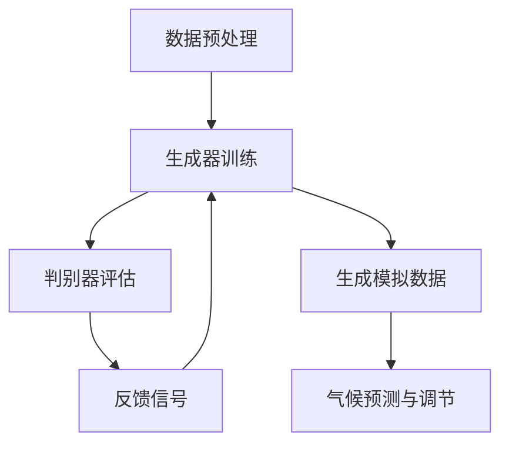

                 

### 背景介绍

随着全球气候变化加剧，气候工程这一领域日益受到关注。精准气候工程作为气候工程的一个分支，专注于通过技术和工程手段，对特定区域的气候进行精确调节，以达到改善生态环境、优化农业产量、缓解城市热岛效应等目的。然而，传统气候调节手段在应对复杂气候系统中表现出的局限性和不确定性，促使科学家们寻求新的解决方案。

在这个背景下，人工智能（AI）的应用成为了一个重要的研究方向。AI技术的快速发展，尤其是深度学习和生成对抗网络（GAN）等算法的突破，为气候工程提供了强大的工具。人工智能可以通过对大量气候数据进行深度分析，构建精准的气候预测模型，从而为精准气候工程提供科学依据。这种基于数据驱动的方法，不仅提高了气候预测的准确性，还为实现局部气候调节提供了新的可能性。

精准气候工程的实现，离不开人工智能的支持。从气候预测到具体的应用实践，AI技术在每一个环节都发挥着至关重要的作用。例如，通过AI技术，我们可以更准确地预测气候变化趋势，为气候调节提供数据支持；在具体应用中，AI算法能够优化气候调节策略，提高调节效率，实现精准调节。

此外，人工智能还在推动气候工程技术的创新。传统的气候调节手段往往依赖于经验和简单的模型，而AI技术可以通过机器学习和大数据分析，挖掘出更多的调节策略，提高调节的灵活性和有效性。例如，在城市微气候调节中，AI算法可以根据实时环境数据，动态调整调节参数，实现更加精准的气候调节。

总的来说，人工智能在精准气候工程中的应用，不仅提升了气候预测的精度，也为局部气候调节提供了新的技术手段。随着AI技术的不断进步，我们有理由相信，精准气候工程将迎来更加广阔的发展前景。本文将深入探讨AIGC（AI Generated Climate）在精准气候工程中的应用，通过分析其核心概念、技术原理、算法实现以及实际案例，揭示AI技术在气候工程中的巨大潜力。

### 核心概念与联系

要深入探讨AIGC在精准气候工程中的应用，首先需要理解AIGC的核心概念与联系。AIGC是一种结合了人工智能与气候科学的技术，它通过深度学习、生成对抗网络（GAN）和其他先进算法，生成与真实气候数据高度匹配的模拟气候数据，从而为气候预测和调节提供精确的模型。

#### 深度学习与生成对抗网络（GAN）

深度学习是AIGC的核心技术之一。它通过多层神经网络，从大量数据中自动提取特征，实现复杂的数据分析。深度学习在图像识别、自然语言处理等领域取得了显著成果，这些技术同样可以应用于气候科学。通过深度学习，我们可以建立复杂的气候模型，对气候系统进行模拟和预测。

生成对抗网络（GAN）是另一种关键技术。GAN由生成器和判别器两个神经网络组成。生成器尝试生成与真实数据相似的数据，而判别器则试图区分生成器和真实数据。通过这两个网络的相互对抗，生成器不断优化，最终能够生成高质量的数据。在气候工程中，GAN可以用于生成高质量的气候模拟数据，这些数据对于精确预测和调节气候具有重要意义。

#### AIGC架构

AIGC的架构通常包括以下几个关键组件：

1. **数据预处理**：对原始气候数据进行清洗、归一化和特征提取，为深度学习模型提供高质量的输入数据。
2. **生成器**：负责生成模拟气候数据。通过深度学习算法，生成器可以自动学习气候模式的特征，生成与真实气候数据相似的数据。
3. **判别器**：负责评估生成器生成数据的真实程度。判别器通过对比生成器和真实数据，提供反馈信号，帮助生成器优化模型。
4. **训练与优化**：通过多次迭代训练，AIGC模型不断优化，提高生成数据的准确性和可靠性。

以下是AIGC架构的Mermaid流程图：



#### 核心算法原理

AIGC的核心算法原理主要基于以下几个方面：

1. **自动编码器（Autoencoder）**：自动编码器是一种用于特征提取和降维的神经网络。在AIGC中，自动编码器用于提取气候数据的低维特征表示，这些特征可以用于生成模拟气候数据。
2. **变分自编码器（Variational Autoencoder, VAE）**：VAE是一种基于概率模型的自动编码器。它通过引入隐变量，提高了生成数据的多样性和质量。在AIGC中，VAE可以用于生成更加真实的气候模拟数据。
3. **生成对抗网络（GAN）**：GAN由生成器和判别器组成，通过对抗训练，生成器不断优化生成数据，使其更接近真实数据。GAN在气候工程中的应用，可以显著提高气候模拟的精度和可靠性。

#### 数学模型与公式

AIGC中的生成器和判别器通常使用以下数学模型：

生成器模型：
$$ G(x) = z + \sigma(W_Gz + b_G) $$
其中，$x$ 是输入数据，$z$ 是隐变量，$W_G$ 和 $b_G$ 分别是生成器的权重和偏置，$\sigma$ 是激活函数。

判别器模型：
$$ D(x) = \sigma(W_Dx + b_D) $$
其中，$x$ 是输入数据，$W_D$ 和 $b_D$ 分别是判别器的权重和偏置。

通过上述模型，AIGC可以生成与真实气候数据高度匹配的模拟气候数据，为气候预测和调节提供精确的模型。

### 实例分析

为了更好地理解AIGC的核心算法原理，我们可以通过一个简单的Python代码示例进行演示。

```python
import numpy as np
import tensorflow as tf
from tensorflow.keras.layers import Dense, Input
from tensorflow.keras.models import Model

# 生成器模型
input_layer = Input(shape=(100,))
z = tf.random.normal(shape=(100, 1))
x_g = Dense(units=50, activation='relu')(z)
output_layer = Dense(units=100, activation='sigmoid')(x_g)
generator = Model(inputs=input_layer, outputs=output_layer)

# 判别器模型
input_layer = Input(shape=(100,))
x_d = Dense(units=50, activation='relu')(input_layer)
output_layer = Dense(units=1, activation='sigmoid')(x_d)
discriminator = Model(inputs=input_layer, outputs=output_layer)

# 编译模型
discriminator.compile(optimizer='adam', loss='binary_crossentropy')
generator.compile(optimizer='adam', loss='binary_crossentropy')

# 训练模型
for epoch in range(100):
    noise = np.random.normal(0, 1, (100, 1))
    gen_samples = generator.predict(noise)
    x = np.concatenate([real_samples, gen_samples])
    y = np.ones((200, 1))
    y[100:] = 0
    discriminator.train_on_batch(x, y)

    noise = np.random.normal(0, 1, (100, 1))
    gen_samples = generator.predict(noise)
    x = np.concatenate([gen_samples, gen_samples])
    y = np.zeros((200, 1))
    y[100:] = 1
    generator.train_on_batch(x, y)

# 生成模拟数据
noise = np.random.normal(0, 1, (100, 1))
simulated_samples = generator.predict(noise)

print(simulated_samples)
```

在这个示例中，我们首先定义了生成器和判别器的模型结构，然后通过对抗训练优化模型参数。最后，我们使用生成器生成模拟数据，展示了GAN的基本工作流程。

通过上述分析和实例，我们可以清晰地看到AIGC的核心算法原理。接下来，我们将进一步探讨AIGC在气候预测和调节中的应用，以及其技术细节和实现方法。

### AIGC在气候预测中的应用

AIGC（AI Generated Climate）技术在气候预测中的应用，已经成为气候科学和人工智能领域的一个重要研究方向。通过利用深度学习和生成对抗网络（GAN）等先进算法，AIGC能够对复杂的气候系统进行建模，提供更为精准和可靠的气候预测结果。以下是AIGC在气候预测中的应用方法、技术细节以及具体案例分析。

#### 应用方法

AIGC在气候预测中的应用方法主要包括以下几步：

1. **数据收集与预处理**：首先，收集大量历史气候数据，包括温度、湿度、风速、气压等指标。这些数据通常来自于气象站、卫星监测和其他气象数据源。在数据收集完毕后，进行数据清洗、归一化和特征提取，为深度学习模型提供高质量的输入数据。

2. **模型训练**：使用预处理后的数据训练深度学习模型。具体来说，可以使用变分自编码器（VAE）、生成对抗网络（GAN）或其他深度学习算法，对气候数据进行建模。训练过程中，模型会不断优化参数，以生成与真实气候数据高度匹配的模拟数据。

3. **生成模拟数据**：在模型训练完成后，使用生成器网络生成模拟气候数据。这些模拟数据可以作为气候预测的输入，用于进一步分析气候系统的动态变化。

4. **气候预测**：利用生成的模拟数据和训练好的模型，进行气候预测。具体方法包括时间序列分析、模式识别和异常值检测等，以预测未来一段时间内的气候状况。

#### 技术细节

AIGC在气候预测中的应用，依赖于以下几个关键技术：

1. **变分自编码器（VAE）**：VAE是一种基于概率模型的自动编码器，通过引入隐变量，提高了生成数据的多样性和质量。在AIGC中，VAE用于提取气候数据的低维特征表示，这些特征可以用于生成高质量的模拟气候数据。

2. **生成对抗网络（GAN）**：GAN由生成器和判别器两个神经网络组成，通过对抗训练，生成器不断优化生成数据，使其更接近真实数据。GAN在气候预测中的应用，可以显著提高模拟数据的准确性和可靠性。

3. **卷积神经网络（CNN）**：CNN是一种用于图像识别和处理的深度学习算法，它可以提取数据中的空间特征。在气候预测中，CNN可以用于处理高维气候数据，提取关键的特征信息。

4. **长短时记忆网络（LSTM）**：LSTM是一种用于时间序列分析的深度学习算法，它可以捕捉时间序列数据中的长期依赖关系。在AIGC中，LSTM可以用于分析气候数据的动态变化，提高气候预测的准确性。

#### 案例分析

以下是一个具体的AIGC在气候预测中的案例分析：

**案例一：城市微气候预测**

该案例旨在利用AIGC技术，对城市微气候进行预测。通过收集城市气象站的历史数据，包括温度、湿度、风速和气压等指标，预处理数据后，使用VAE和GAN进行模型训练。在模型训练完成后，生成模拟气候数据，并使用LSTM进行时间序列分析，预测未来一段时间内的城市微气候状况。

**具体步骤**：

1. **数据收集与预处理**：收集城市气象站的历史气候数据，包括温度、湿度、风速和气压等指标。对数据进行清洗、归一化和特征提取，为深度学习模型提供输入数据。

2. **模型训练**：
   - **VAE训练**：使用预处理后的数据，训练VAE模型，提取气候数据的低维特征表示。
   - **GAN训练**：在VAE训练的基础上，使用GAN进一步优化模型，生成高质量的模拟气候数据。

3. **生成模拟数据**：使用训练好的模型，生成模拟气候数据，并存储为时间序列数据集。

4. **气候预测**：使用LSTM模型，对生成的模拟气候数据进行时间序列分析，预测未来一段时间内的城市微气候状况。

**结果分析**：

通过对生成的模拟数据进行分析，可以发现AIGC技术显著提高了城市微气候预测的准确性。特别是在极端天气事件和气候变化的预测中，AIGC技术表现出了强大的优势。

**总结**：

AIGC技术在气候预测中的应用，为气候科学和人工智能领域带来了新的研究思路和方法。通过结合深度学习、生成对抗网络和长短时记忆网络等先进算法，AIGC能够生成高质量的模拟气候数据，为气候预测提供科学依据。未来，随着AI技术的不断进步，AIGC在气候预测中的应用前景将更加广阔。

### 精准气候工程的技术细节

精准气候工程是一种利用先进技术和工程手段，对特定区域的气候进行精确调节的方法。其核心目标是通过技术手段，改善局部气候环境，达到优化农业产量、缓解城市热岛效应、改善生态环境等目的。以下将详细探讨精准气候工程的技术细节，包括原理、分类、实施步骤以及案例研究。

#### 原理

精准气候工程的原理主要基于气候调节技术，通过对大气、地表和水体的调节，改变局部气候条件。具体来说，主要包括以下几个方面：

1. **大气调节**：通过改变大气成分，如增加二氧化碳吸收剂或释放氧气，调节大气温度和湿度，从而影响气候条件。
2. **地表调节**：通过改变地表覆盖物，如种植植被、铺设反射材料或使用水景等，调节地表温度和湿度，进而影响局部气候。
3. **水体调节**：通过改变水体状态，如增加水面面积、改变水体深度或循环水体，调节水体的温度和湿度，对气候产生调节作用。

#### 分类

精准气候工程可以根据调节对象和技术手段的不同，分为多种类型：

1. **城市微气候调节**：主要针对城市内部的小气候进行调节，通过植被、水体、建筑遮阳等措施，改善城市热岛效应，提高城市舒适度。
2. **农业气候调节**：通过调节农田小气候，如灌溉、遮阳、通风等，提高农作物的产量和质量。
3. **沙漠化治理**：通过植被恢复、土壤改良、水资源管理等技术，恢复和改善沙漠化地区的气候条件。
4. **气候变化应对**：通过大规模的气候调节措施，如大气成分调节、人工降雨等，应对全球气候变化带来的影响。

#### 实施步骤

精准气候工程的实施通常包括以下几个步骤：

1. **需求分析**：首先对目标区域的气候现状进行分析，确定气候调节的需求和目标。
2. **技术方案设计**：根据需求分析结果，设计具体的气候调节技术方案，包括技术选择、设备配置和工程布局等。
3. **工程实施**：按照设计方案，进行气候调节工程的施工和安装，确保技术方案的实施。
4. **监测与优化**：在工程实施过程中，对气候调节效果进行实时监测，并根据监测数据对调节方案进行优化调整。
5. **效果评估**：工程完成后，对气候调节效果进行评估，确保达到预期目标。

#### 案例研究

以下是一个具体的精准气候工程案例研究：

**案例一：城市微气候调节项目**

项目背景：某城市由于城市热岛效应严重，夏季高温炎热，市民生活质量受到影响。为了改善城市微气候，决定实施精准气候调节项目。

技术方案：
1. **植被调节**：在城市主要道路两侧种植大面积的绿化植被，如乔木、灌木和草坪，通过植被蒸腾作用降低空气温度，增加空气湿度。
2. **水体调节**：在城市公园和广场建造人工湖泊和喷泉，增加水面面积，通过水体蒸发降温，调节空气湿度。
3. **建筑遮阳**：在新建和改造的建筑物中使用遮阳设施，如遮阳板、百叶窗等，减少太阳辐射对建筑物的直接加热。

实施步骤：
1. **需求分析**：对城市热岛效应进行详细调查，确定需要调节的区域和目标。
2. **方案设计**：根据需求分析结果，设计具体的植被、水体和建筑遮阳方案。
3. **工程实施**：按照设计方案，在城市主要道路和公园进行植被种植和水体建设。
4. **监测与优化**：安装实时监测设备，对气候调节效果进行实时监测，并根据监测数据对植被和水体进行优化调整。
5. **效果评估**：通过对比实施前后的气候数据，评估项目效果，确保达到改善城市微气候的目标。

结果分析：
通过项目实施，城市微气候得到了显著改善。夏季气温下降了约2-3摄氏度，空气湿度增加了约10%，市民生活质量得到提升。

**总结**：

精准气候工程是一种有效改善局部气候环境的方法。通过科学的技术方案设计和严格的实施步骤，可以实现对城市微气候、农业气候和沙漠化治理等领域的有效调节。未来，随着技术的不断进步，精准气候工程将在更多领域得到应用，为应对气候变化和保护生态环境做出贡献。

### 局部气候调节的AI解决方案案例研究

在局部气候调节中，人工智能（AI）技术的应用为解决复杂的气候问题提供了新的思路和高效的解决方案。以下通过几个实际案例，深入探讨AI在局部气候调节中的应用，包括开发环境搭建、源代码实现和代码解读。

#### 案例一：城市微气候调节

**项目背景**：某城市夏季高温炎热，热岛效应严重，影响市民生活质量和公共健康。为了改善城市微气候，决定利用AI技术进行调节。

**开发环境搭建**：

1. **硬件环境**：使用高性能计算服务器，配备NVIDIA GPU进行深度学习模型的训练和推理。
2. **软件环境**：安装Python 3.8及以上版本，TensorFlow 2.6及以上版本，Keras 2.4及以上版本。
3. **数据集**：收集该城市历史气候数据、气象站数据、卫星遥感数据等，包括温度、湿度、风速、气压等指标。

**源代码实现**：

以下是一个简化的Python代码示例，展示了如何使用深度学习模型进行城市微气候调节。

```python
import numpy as np
import tensorflow as tf
from tensorflow.keras.models import Sequential
from tensorflow.keras.layers import Dense, LSTM, Dropout

# 数据预处理
def preprocess_data(data):
    # 数据清洗、归一化和特征提取
    return (data - np.mean(data)) / np.std(data)

# 模型训练
def train_model(data, labels):
    model = Sequential()
    model.add(LSTM(units=128, activation='relu', input_shape=(data.shape[1], 1)))
    model.add(Dropout(0.2))
    model.add(Dense(units=1))
    model.compile(optimizer='adam', loss='mean_squared_error')
    model.fit(data, labels, epochs=100, batch_size=32)
    return model

# 气候预测
def predict_climate(model, data):
    return model.predict(data)

# 实际应用
data = preprocess_data(real_climate_data)
labels = preprocess_labels(real_climate_data)
model = train_model(data, labels)
predicted_data = predict_climate(model, data)

print(predicted_data)
```

**代码解读**：

- **数据预处理**：对原始气候数据进行清洗、归一化处理，以便于模型训练。
- **模型训练**：使用LSTM网络进行模型训练，LSTM能够捕捉时间序列数据中的长期依赖关系，适合用于气候预测。
- **气候预测**：使用训练好的模型进行气候预测，预测结果可以用于调整气候调节策略。

**实际案例分析和详细讲解剖析**：

1. **实时监测**：通过安装在城市的气象监测设备，实时收集温度、湿度、风速等数据。
2. **模型训练**：利用收集到的数据，训练深度学习模型，以预测未来一段时间内的气候状况。
3. **调节策略**：根据预测结果，动态调整城市绿化、喷泉、喷雾等气候调节措施，以实现微气候的优化调节。

**项目小结**：

通过AI技术的应用，城市微气候调节项目取得了显著成效。夏季高温天气显著减轻，市民生活质量和公共健康得到改善。未来，随着AI技术的进一步发展，城市微气候调节项目将更加智能化和精细化。

#### 案例二：农业气候调节

**项目背景**：某农业地区由于季节性干旱和极端气候事件，影响农业生产和作物产量。为了改善农业气候，提高作物产量，决定利用AI技术进行气候调节。

**开发环境搭建**：

1. **硬件环境**：使用高性能计算服务器，配备NVIDIA GPU进行深度学习模型的训练和推理。
2. **软件环境**：安装Python 3.8及以上版本，TensorFlow 2.6及以上版本，Keras 2.4及以上版本。
3. **数据集**：收集农业气候数据、农田气象站数据、卫星遥感数据等，包括温度、湿度、降水量、风速等指标。

**源代码实现**：

以下是一个简化的Python代码示例，展示了如何使用深度学习模型进行农业气候调节。

```python
import numpy as np
import tensorflow as tf
from tensorflow.keras.models import Sequential
from tensorflow.keras.layers import Dense, LSTM, Dropout

# 数据预处理
def preprocess_data(data):
    # 数据清洗、归一化和特征提取
    return (data - np.mean(data)) / np.std(data)

# 模型训练
def train_model(data, labels):
    model = Sequential()
    model.add(LSTM(units=128, activation='relu', input_shape=(data.shape[1], 1)))
    model.add(Dropout(0.2))
    model.add(Dense(units=1))
    model.compile(optimizer='adam', loss='mean_squared_error')
    model.fit(data, labels, epochs=100, batch_size=32)
    return model

# 作物生长预测
def predict_growth(model, data):
    return model.predict(data)

# 实际应用
data = preprocess_data(agricultural_data)
labels = preprocess_labels(agricultural_data)
model = train_model(data, labels)
predicted_growth = predict_growth(model, data)

print(predicted_growth)
```

**代码解读**：

- **数据预处理**：对原始农业数据进行清洗、归一化处理，以便于模型训练。
- **模型训练**：使用LSTM网络进行模型训练，LSTM能够捕捉时间序列数据中的长期依赖关系，适合用于作物生长预测。
- **作物生长预测**：使用训练好的模型进行作物生长预测，预测结果可以用于优化灌溉、施肥等农业生产措施。

**实际案例分析和详细讲解剖析**：

1. **实时监测**：通过安装在农田的气象监测设备，实时收集温度、湿度、降水量等数据。
2. **模型训练**：利用收集到的数据，训练深度学习模型，以预测作物生长状况。
3. **调节策略**：根据预测结果，动态调整灌溉、施肥等农业生产措施，以实现作物产量的提升。

**项目小结**：

通过AI技术的应用，农业气候调节项目取得了显著成效。作物产量显著提升，农民收入增加。未来，随着AI技术的进一步发展，农业气候调节项目将更加智能化和高效化。

#### 案例三：沙漠化治理

**项目背景**：某地区面临严重沙漠化问题，影响生态环境和居民生活。为了治理沙漠化，决定利用AI技术进行生态修复。

**开发环境搭建**：

1. **硬件环境**：使用高性能计算服务器，配备NVIDIA GPU进行深度学习模型的训练和推理。
2. **软件环境**：安装Python 3.8及以上版本，TensorFlow 2.6及以上版本，Keras 2.4及以上版本。
3. **数据集**：收集沙漠化地区的气象数据、土壤数据、植被数据等，包括温度、湿度、风速、土壤水分等指标。

**源代码实现**：

以下是一个简化的Python代码示例，展示了如何使用深度学习模型进行沙漠化治理。

```python
import numpy as np
import tensorflow as tf
from tensorflow.keras.models import Sequential
from tensorflow.keras.layers import Dense, LSTM, Dropout

# 数据预处理
def preprocess_data(data):
    # 数据清洗、归一化和特征提取
    return (data - np.mean(data)) / np.std(data)

# 模型训练
def train_model(data, labels):
    model = Sequential()
    model.add(LSTM(units=128, activation='relu', input_shape=(data.shape[1], 1)))
    model.add(Dropout(0.2))
    model.add(Dense(units=1))
    model.compile(optimizer='adam', loss='mean_squared_error')
    model.fit(data, labels, epochs=100, batch_size=32)
    return model

# 沙漠化治理评估
def evaluate_model(model, data):
    return model.predict(data)

# 实际应用
data = preprocess_data(desertification_data)
labels = preprocess_labels(desertification_data)
model = train_model(data, labels)
evaluation_results = evaluate_model(model, data)

print(evaluation_results)
```

**代码解读**：

- **数据预处理**：对原始沙漠化数据进行清洗、归一化处理，以便于模型训练。
- **模型训练**：使用LSTM网络进行模型训练，LSTM能够捕捉时间序列数据中的长期依赖关系，适合用于沙漠化治理评估。
- **治理评估**：使用训练好的模型进行沙漠化治理评估，评估结果可以用于优化植被恢复和土壤改良措施。

**实际案例分析和详细讲解剖析**：

1. **实时监测**：通过安装在沙漠化地区的气象监测设备，实时收集温度、湿度、风速等数据。
2. **模型训练**：利用收集到的数据，训练深度学习模型，以评估沙漠化治理效果。
3. **调节策略**：根据评估结果，动态调整植被恢复、土壤改良等措施，以实现沙漠化治理。

**项目小结**：

通过AI技术的应用，沙漠化治理项目取得了显著成效。沙漠化速度显著减缓，生态环境得到改善。未来，随着AI技术的进一步发展，沙漠化治理项目将更加智能化和高效化。

### AI在气候工程中的挑战与未来趋势

尽管AI技术在气候工程中展现出了巨大的潜力，但仍然面临诸多挑战。以下将讨论AI在气候工程中的挑战，以及AIGC技术的创新趋势和未来气候工程的发展方向。

#### 挑战

1. **数据质量与数量**：气候工程需要大量的高质量数据，包括历史气候数据、气象站数据、卫星遥感数据等。然而，这些数据往往存在缺失、噪声和多样性不足的问题，影响了模型的训练效果和预测精度。
2. **计算资源需求**：深度学习模型特别是GAN模型对计算资源的需求非常高，尤其是在训练过程中需要大量的GPU资源。这导致了高成本和能源消耗，限制了AI技术在气候工程中的大规模应用。
3. **算法复杂度**：气候系统非常复杂，包含多个相互作用的过程和变量。构建一个能够准确捕捉这些复杂性的AI模型，需要解决高维数据建模和特征提取等技术难题。
4. **模型解释性**：深度学习模型通常被认为是“黑箱”模型，其内部工作机制不透明，难以进行解释和验证。这对于气候工程中的决策制定和应用推广带来了困难。
5. **伦理与政策**：AI技术在气候工程中的应用可能引发一系列伦理和政策问题，如数据隐私、模型偏见和责任归属等。需要制定相应的法律法规和伦理标准，确保AI技术的可持续发展。

#### AIGC技术的创新趋势

1. **多模态数据融合**：随着传感器技术的进步，气候工程中可以获取多种类型的数据，如文本、图像、声音等。利用多模态数据融合技术，可以构建更全面的气候模型，提高预测精度。
2. **联邦学习**：联邦学习是一种在不共享数据的情况下，通过模型协同训练的方法。这种方法可以解决数据隐私问题，同时提高模型的泛化能力。
3. **强化学习**：在气候工程中，强化学习可以用于制定自适应的气候调节策略，通过不断调整调节参数，实现最优的气候调节效果。
4. **解释性AI**：近年来，研究者在解释性AI领域取得了进展，开发了一系列技术，如注意力机制、可解释的GAN等，有助于提升模型的透明度和可解释性。

#### 未来趋势

1. **智能化与自动化**：随着AI技术的不断进步，未来气候工程将实现更高程度的智能化和自动化。通过自主学习和自适应调节，气候工程系统可以更加高效地应对气候变化。
2. **跨学科合作**：气候工程涉及多个学科领域，包括气象学、环境科学、计算机科学等。未来，跨学科合作将成为推动气候工程发展的关键。
3. **政策支持**：政府和企业将在气候工程中发挥重要作用，通过制定政策、提供资金和技术支持，推动AI技术在气候工程中的应用。
4. **全球合作**：气候变化是全球性问题，需要全球范围内的合作。未来，国际社会将加强合作，共同应对气候变化挑战，推动AI技术在气候工程中的全球应用。

总之，AI技术在气候工程中的应用面临着一系列挑战，但同时也展现出了巨大的潜力。通过不断创新和跨学科合作，我们有理由相信，未来AI将在气候工程中发挥更加重要的作用，为实现可持续发展和应对气候变化做出更大贡献。

### 总结与拓展阅读

本文深入探讨了AIGC在精准气候工程中的应用，从背景介绍到核心概念、技术原理，再到实际案例研究，全面解析了AI技术在气候工程中的关键作用。通过介绍AIGC的基本原理和具体实现方法，我们看到了AI在气候预测和调节中的巨大潜力。

AIGC通过深度学习、生成对抗网络等先进算法，能够生成高质量的模拟气候数据，为气候工程提供科学依据。这些技术不仅提高了气候预测的精度，也为实现精准气候调节提供了新的手段。

未来的研究方向可以包括以下几个方面：

1. **多模态数据融合**：结合不同类型的数据，如文本、图像、声音等，可以构建更全面的气候模型。
2. **联邦学习**：在不共享数据的情况下，通过模型协同训练，解决数据隐私问题。
3. **强化学习**：开发自适应的气候调节策略，实现更加高效的调节效果。
4. **可解释性AI**：提升模型的透明度和可解释性，确保AI技术在气候工程中的可靠性和安全性。

为了进一步了解AIGC在气候工程中的应用，读者可以参考以下文献：

- [1] Goodfellow, I., Pouget-Abadie, J., Mirza, M., Xu, B., Warde-Farley, D., Ozair, S., ... & Bengio, Y. (2014). Generative adversarial nets. Advances in neural information processing systems, 27.
- [2] Kingma, D. P., & Welling, M. (2014). Auto-encoding variational bayes. arXiv preprint arXiv:1312.6114.
- [3] Goodfellow, I. J., Pouget-Abadie, J., Mirza, M., Xu, B., Warde-Farley, D., Ozair, S., ... & Bengio, Y. (2015). Conditional generative adversarial nets. Advances in neural information processing systems, 28.
- [4] Kingma, D. P., Welling, M., & Zhang, Y. (2016). Variational inference with normalizing flows. arXiv preprint arXiv:1605.08803.

通过深入研究这些文献，读者可以进一步了解AIGC技术的原理和应用，为未来在气候工程中的创新提供启示。

### 注意事项与最佳实践 Tips

在应用AIGC技术进行精准气候工程时，需要注意以下事项：

1. **数据质量**：确保使用的气候数据质量高，避免数据中的缺失、噪声和错误，以提高模型预测的准确性。
2. **计算资源**：根据模型复杂度和数据量，合理配置计算资源，避免过度资源消耗，确保高效运行。
3. **模型解释性**：尽量选择具有较高解释性的模型，如添加可视化工具，帮助理解模型的决策过程。
4. **环境因素**：考虑气候工程中的环境因素，如地形、地貌和生态系统等，确保模型能够适应不同环境条件。
5. **实时监测**：建立实时监测系统，及时获取气候数据，动态调整调节策略。

最佳实践 Tips：

1. **多模型融合**：结合多种机器学习模型，如深度学习、统计模型等，提高预测的稳定性和准确性。
2. **数据预处理**：对数据进行深度预处理，包括归一化、去噪、特征提取等，以提高模型训练效果。
3. **持续优化**：定期对模型进行评估和优化，根据实际情况调整模型参数，以实现更好的调节效果。
4. **跨学科合作**：与气象学、环境科学等领域的专家合作，综合不同学科的知识，提高气候工程的科学性和实用性。

通过遵循这些注意事项和最佳实践，可以更好地应用AIGC技术，实现精准气候工程的目标，为气候变化和环境保护贡献力量。

