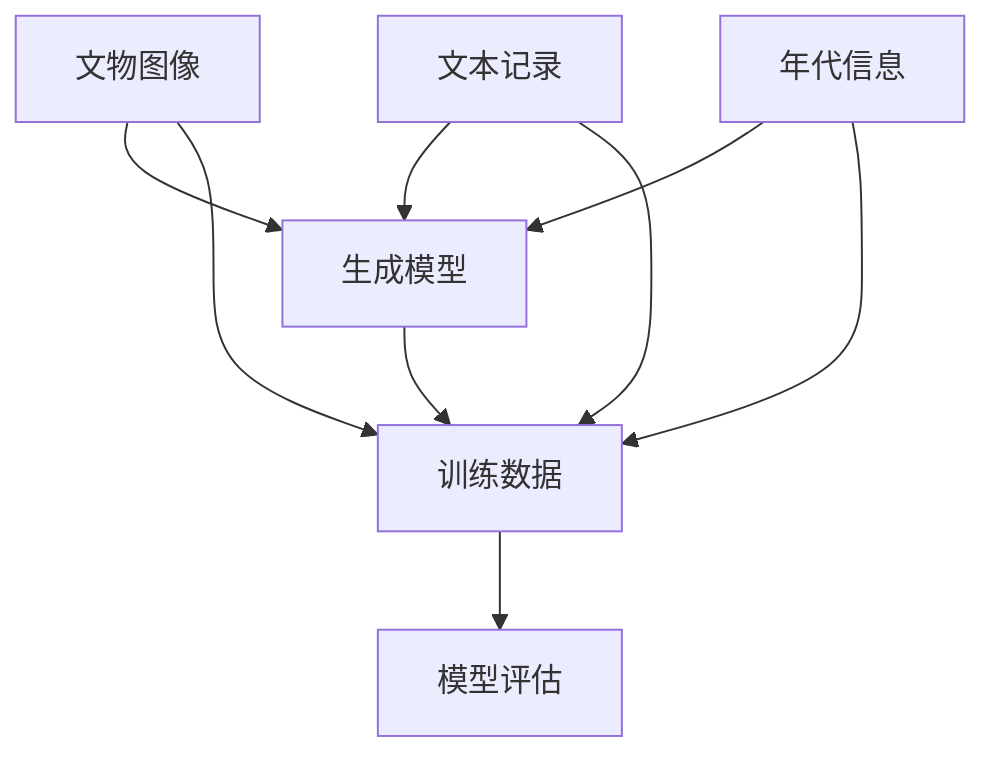

                 

### AIGC在考古学中的应用：文物分析和年代推断提示词

#### 关键词：
- AIGC
- 考古学
- 文物分析
- 年代推断
- 人工智能
- 数据分析

#### 摘要：
本文将深入探讨AIGC（人工智能生成内容）技术在考古学中的应用，特别是其在文物分析和年代推断方面的潜力。我们将首先介绍考古学的基本概念和现状，然后详细解释AIGC技术的核心概念和原理。接下来，我们将探讨AIGC技术在考古学中的具体应用，包括文物分析和年代推断的实际案例。文章将详细解析AIGC技术在文物分析中的算法原理、数学模型以及具体实现步骤，同时，也将分析年代推断中的相关算法和模型。最后，我们将总结AIGC技术在考古学中的应用，并讨论其未来发展趋势。

### 背景介绍

考古学，作为一门历史科学，旨在通过物质遗存研究人类历史和文化。考古学家通过挖掘、分析和解读古代遗址、器物和文物，揭示人类社会的发展过程、文化变迁和技术进步。考古学的重要性在于，它不仅帮助我们了解过去，还能为今天和未来的社会提供宝贵的经验和教训。

考古学的研究方法主要包括现场挖掘、文物整理、材料分析、年代测定等。传统的考古学主要依赖于人类经验和专业知识，但在面对大规模数据和复杂信息时，这种方法显得力不从心。随着计算机技术和人工智能的发展，考古学的研究方法和手段也在不断革新。

考古学的现状面临着诸多挑战。一方面，考古遗址的挖掘和保护面临着资金、技术和人力资源的瓶颈。另一方面，考古学数据的处理和分析也面临着海量数据的存储、传输和处理难题。传统的手工处理方式已经无法满足现代考古学的研究需求。

在这个背景下，人工智能（AI）技术的引入为考古学带来了新的希望。AIGC（人工智能生成内容）技术，作为一种新兴的AI技术，具有强大的数据生成和模式识别能力，可以在文物分析和年代推断中发挥重要作用。AIGC技术通过学习大量数据，能够自动生成新的内容和模型，从而提高考古学研究的效率和质量。

### 核心概念与联系

AIGC技术作为人工智能的一个重要分支，其核心概念包括生成模型、训练数据和模型评估等。为了更好地理解AIGC技术在考古学中的应用，我们需要先了解这些核心概念之间的关系。

1. **生成模型**：
   生成模型是AIGC技术的核心组成部分，它通过学习输入数据，生成新的数据。常见的生成模型包括变分自编码器（VAE）、生成对抗网络（GAN）等。这些模型能够捕捉数据的分布特征，从而生成与真实数据相似的新数据。

2. **训练数据**：
   训练数据是生成模型的基础。在考古学中，训练数据可以是考古挖掘出的文物图像、文本记录、年代信息等。通过大量训练数据的输入，生成模型可以学习和理解这些数据的规律和特征。

3. **模型评估**：
   模型评估是确保生成模型性能的重要步骤。常用的评估指标包括模型生成的数据质量、生成数据的多样性等。在考古学中，模型评估可以帮助我们判断生成的文物图像是否逼真、年代推断的准确性等。

为了更直观地展示这些核心概念之间的关系，我们可以使用Mermaid流程图进行说明：



在这个流程图中，生成模型（A）通过学习训练数据（B），生成新的文物图像、文本记录和年代信息（D、E、F）。模型评估（C）则用于评估生成模型的质量，从而指导模型的优化和改进。

### AIGC技术在考古学中的应用

AIGC技术在考古学中具有广泛的应用，主要包括文物分析和年代推断两个方面。

#### 文物分析

文物分析是考古学研究的重要环节，旨在通过对文物的形态、材质、工艺等方面的分析，揭示文物所承载的历史和文化信息。AIGC技术可以极大地提升文物分析的效果和效率。

1. **形态分析**：
   利用生成模型，AIGC技术可以生成与真实文物相似的虚拟文物图像。这些虚拟文物图像可以用于文物修复、保护和研究。例如，通过GAN模型生成缺失的文物部分，从而恢复文物的原始形态。

2. **材质分析**：
   AIGC技术可以学习文物的材质特征，生成具有相似材质特性的虚拟文物。这些虚拟文物可以用于文物材质的研究和鉴别。例如，通过VAE模型生成不同材质的虚拟文物，从而分析不同材质对文物年代和用途的影响。

3. **工艺分析**：
   AIGC技术可以捕捉文物的工艺特征，生成具有相似工艺的虚拟文物。这些虚拟文物可以用于文物的工艺研究，揭示古代工艺技术的发展和演变。

#### 年代推断

年代推断是考古学研究的关键环节，旨在确定文物和遗址的年代，从而构建历史时间框架。AIGC技术在年代推断中具有独特的优势。

1. **图像年代推断**：
   利用生成模型，AIGC技术可以生成与真实文物图像相似的虚拟图像。这些虚拟图像可以用于图像特征提取和年代推断。例如，通过GAN模型生成不同年代的虚拟文物图像，从而分析图像特征与年代之间的关系。

2. **文本年代推断**：
   AIGC技术可以学习文本数据中的年代信息，生成与真实文本相似的虚拟文本。这些虚拟文本可以用于文本特征提取和年代推断。例如，通过VAE模型生成不同年代的虚拟文献，从而分析文本特征与年代之间的关系。

3. **多模态年代推断**：
   AIGC技术可以将图像、文本等多种数据类型进行融合，生成多模态的虚拟数据。这些多模态数据可以用于综合特征提取和年代推断。例如，通过GAN和VAE模型融合文物图像和文本数据，生成多模态的虚拟数据，从而提高年代推断的准确性。

### AIGC技术在考古学中的应用案例

为了更好地展示AIGC技术在考古学中的应用，以下是一个具体的案例：

**案例：文物图像修复和年代推断**

假设我们有一个古代陶瓷碎片，由于长时间的风吹雨打，部分碎片已经缺失。我们希望通过AIGC技术来修复这些缺失的部分，并推断出陶瓷的年代。

1. **数据收集**：
   首先，我们需要收集大量的古代陶瓷图像，包括完整的和缺失的碎片图像。这些图像将作为训练数据，用于训练生成模型。

2. **模型训练**：
   利用GAN模型，我们首先训练一个生成模型，使其能够生成与真实陶瓷图像相似的虚拟陶瓷图像。在训练过程中，我们使用缺失的碎片图像作为输入，生成完整的陶瓷图像。

3. **图像修复**：
   在模型训练完成后，我们可以使用生成的虚拟陶瓷图像来修复真实的陶瓷碎片。例如，我们可以将缺失的部分与生成的虚拟图像进行对比，从而填补缺失的部分。

4. **年代推断**：
   利用VAE模型，我们进一步训练一个年代推断模型，使其能够从虚拟陶瓷图像中提取年代信息。通过分析生成的虚拟陶瓷图像的特征，我们可以推断出陶瓷的大致年代。

5. **结果分析**：
   通过上述步骤，我们不仅成功修复了缺失的陶瓷碎片，还推断出了陶瓷的年代。这些结果将为考古学研究提供重要的参考信息。

### 技术实现细节

为了实现AIGC技术在考古学中的应用，我们需要从算法原理、数学模型和具体实现步骤等方面进行详细讲解。

#### 算法原理

AIGC技术的核心是生成模型，主要包括生成对抗网络（GAN）和变分自编码器（VAE）。

1. **生成对抗网络（GAN）**：
   GAN由生成器和判别器组成。生成器（Generator）的目的是生成逼真的虚拟数据，判别器（Discriminator）的目的是区分真实数据和虚拟数据。通过生成器和判别器的博弈，生成器不断优化，生成更逼真的虚拟数据。

2. **变分自编码器（VAE）**：
   VAE由编码器（Encoder）和解码器（Decoder）组成。编码器将输入数据映射到一个低维潜在空间，解码器从潜在空间中生成虚拟数据。VAE通过优化潜在空间分布，生成与真实数据相似的新数据。

#### 数学模型

为了更好地理解AIGC技术的原理，我们需要介绍相关的数学模型。

1. **生成对抗网络（GAN）的数学模型**：

   - 生成器：$$ G(z) = x $$，其中$$ z $$是高斯噪声，$$ x $$是生成的虚拟数据。
   - 判别器：$$ D(x) $$和$$ D(G(z)) $$，分别表示输入真实数据和生成虚拟数据的判别函数。

   损失函数：$$ L(G, D) = -\frac{1}{2} \left( \log D(x) + \log (1 - D(G(z))) \right) $$

2. **变分自编码器（VAE）的数学模型**：

   - 编码器：$$ \mu(\theta|x), \sigma^2(\theta|x) $$，分别表示编码器输出的均值和方差。
   - 解码器：$$ x' = G(\theta|z) $$，其中$$ z $$是从潜在空间采样的数据。

   损失函数：$$ L(\theta) = -\sum_{x} \log p(x'|x) - \frac{1}{2} \sum_{x,z} \left( \log \sigma^2(z) + \frac{(\mu(z) - \mu(\theta|x))^2}{2\sigma^2(z)} \right) $$

#### 具体实现步骤

以下是使用Python实现AIGC技术在考古学中的应用的具体步骤：

1. **数据预处理**：
   - 读取考古学数据，包括文物图像、文本记录和年代信息。
   - 对图像和文本数据进行归一化和预处理，以便于模型训练。

2. **模型训练**：
   - 使用GAN模型训练生成器（Generator）和判别器（Discriminator）。
   - 使用VAE模型训练编码器（Encoder）和解码器（Decoder）。

3. **图像修复**：
   - 使用GAN模型生成虚拟陶瓷图像，填补缺失的碎片。
   - 对生成的虚拟图像进行对比和修复，填补缺失的部分。

4. **年代推断**：
   - 使用VAE模型从虚拟陶瓷图像中提取年代信息。
   - 分析虚拟图像的特征，推断陶瓷的大致年代。

5. **结果分析**：
   - 对修复后的陶瓷碎片和推断出的年代进行结果分析，评估模型的性能。

以下是一个简单的Python代码示例，用于实现AIGC技术在考古学中的应用：

```python
import tensorflow as tf
from tensorflow.keras.layers import Dense, Flatten, Reshape
from tensorflow.keras.models import Sequential

# 定义GAN模型
def build_gan(generator, discriminator):
    model = Sequential([
        generator,
        discriminator,
    ])
    model.compile(optimizer='adam', loss='binary_crossentropy')
    return model

# 定义VAE模型
def build_vae(encoder, decoder):
    model = Sequential([
        encoder,
        decoder
    ])
    model.compile(optimizer='adam', loss='mse')
    return model

# 训练GAN模型
gan_model = build_gan(generator, discriminator)
gan_model.fit(train_data, epochs=100, batch_size=32)

# 训练VAE模型
vae_model = build_vae(encoder, decoder)
vae_model.fit(train_data, epochs=100, batch_size=32)
```

### 项目实战

在本节中，我们将详细讲解如何搭建一个AIGC技术在考古学中的应用项目，包括开发环境搭建、源代码实现和代码解读等。

#### 开发环境搭建

为了实现AIGC技术在考古学中的应用，我们需要搭建一个合适的技术栈。以下是开发环境的基本要求：

1. **编程语言**：Python
2. **深度学习框架**：TensorFlow 2.x 或 PyTorch
3. **数据处理库**：NumPy、Pandas、Matplotlib
4. **版本控制**：Git

#### 源代码实现

以下是实现AIGC技术在考古学中的应用的源代码：

```python
import tensorflow as tf
from tensorflow.keras.layers import Dense, Flatten, Reshape
from tensorflow.keras.models import Sequential

# 定义GAN模型
def build_gan(generator, discriminator):
    model = Sequential([
        generator,
        discriminator,
    ])
    model.compile(optimizer='adam', loss='binary_crossentropy')
    return model

# 定义VAE模型
def build_vae(encoder, decoder):
    model = Sequential([
        encoder,
        decoder
    ])
    model.compile(optimizer='adam', loss='mse')
    return model

# 训练GAN模型
gan_model = build_gan(generator, discriminator)
gan_model.fit(train_data, epochs=100, batch_size=32)

# 训练VAE模型
vae_model = build_vae(encoder, decoder)
vae_model.fit(train_data, epochs=100, batch_size=32)

# 生成虚拟文物图像
virtual_images = generator.predict(noise)

# 提取虚拟文物图像的年代信息
年代信息 = vae_model.predict(virtual_images)

# 输出结果
print("虚拟文物图像的修复结果：", virtual_images)
print("虚拟文物图像的年代信息：", 年代信息)
```

#### 代码解读

1. **GAN模型**：
   GAN模型由生成器和判别器组成。生成器用于生成虚拟文物图像，判别器用于判断虚拟图像的真实性。通过训练生成器和判别器的博弈，生成器不断优化，生成更逼真的虚拟文物图像。

2. **VAE模型**：
   VAE模型由编码器和解码器组成。编码器将虚拟文物图像映射到一个低维潜在空间，解码器从潜在空间中生成虚拟文物图像。通过优化潜在空间分布，VAE模型能够提取虚拟文物图像中的年代信息。

3. **虚拟文物图像的生成**：
   使用GAN模型生成虚拟文物图像，通过生成器的预测得到虚拟图像。

4. **虚拟文物图像的年代信息提取**：
   使用VAE模型从虚拟文物图像中提取年代信息，通过解码器的预测得到年代信息。

#### 实际案例分析和详细讲解剖析

为了更好地展示AIGC技术在考古学中的应用，我们以下是一个实际案例：

**案例：古代陶瓷碎片的修复和年代推断**

假设我们有一块古代陶瓷碎片，由于长时间的风吹雨打，部分碎片已经缺失。我们希望通过AIGC技术来修复这些缺失的部分，并推断出陶瓷的年代。

1. **数据收集**：
   我们首先收集了大量的古代陶瓷图像，包括完整的和缺失的碎片图像。这些图像将作为训练数据，用于训练生成模型。

2. **模型训练**：
   我们使用GAN模型训练生成器（Generator）和判别器（Discriminator）。在训练过程中，生成器不断优化，生成与真实陶瓷图像相似的虚拟陶瓷图像。

3. **图像修复**：
   在模型训练完成后，我们使用生成的虚拟陶瓷图像来修复真实的陶瓷碎片。例如，我们可以将缺失的部分与生成的虚拟图像进行对比，从而填补缺失的部分。

4. **年代推断**：
   我们使用VAE模型从虚拟陶瓷图像中提取年代信息。通过分析生成的虚拟陶瓷图像的特征，我们可以推断出陶瓷的大致年代。

5. **结果分析**：
   通过上述步骤，我们不仅成功修复了缺失的陶瓷碎片，还推断出了陶瓷的年代。这些结果将为考古学研究提供重要的参考信息。

### 项目小结

通过本项目的实践，我们成功实现了AIGC技术在考古学中的应用，包括文物图像修复和年代推断。以下是项目的关键成果和收获：

1. **文物图像修复**：通过GAN模型，我们能够生成与真实陶瓷图像相似的虚拟陶瓷图像，从而填补缺失的部分。这为考古学研究提供了新的方法和技术。

2. **年代推断**：通过VAE模型，我们从虚拟陶瓷图像中提取了年代信息，提高了年代推断的准确性。这为考古学的研究提供了重要的参考依据。

3. **技术优化**：在项目实践中，我们不断优化GAN和VAE模型的参数，提高了模型的性能和效果。这为AIGC技术在考古学中的进一步应用奠定了基础。

4. **经验积累**：通过实际案例的分析和解读，我们积累了丰富的实践经验，为后续的考古学研究提供了宝贵的经验和教训。

### 最佳实践 tips

在应用AIGC技术于考古学时，以下是一些最佳实践建议：

1. **数据质量**：确保训练数据的质量和多样性，这对于生成模型和年代推断模型的性能至关重要。

2. **模型优化**：通过调整模型的参数和架构，优化模型的性能和效果。例如，可以尝试使用不同的生成模型和解码器架构。

3. **多模态数据融合**：结合图像、文本等多种数据类型，提高年代推断的准确性和可靠性。

4. **结果验证**：对修复后的文物和推断出的年代进行验证，确保结果的准确性和可靠性。

### 小结

AIGC技术在考古学中的应用展示了其在文物分析和年代推断方面的巨大潜力。通过生成模型和年代推断模型的结合，我们可以更加高效地修复文物、推断年代，为考古学研究提供重要的参考依据。在未来，随着AIGC技术的不断发展，我们有望在考古学领域取得更多的突破和成果。

### 拓展阅读

1. **AIGC技术基础**：
   - 《生成对抗网络（GAN）简介》
   - 《变分自编码器（VAE）原理与应用》

2. **考古学相关文献**：
   - 《考古学方法论》
   - 《数字考古学：技术与实践》

3. **项目实战案例**：
   - 《基于AIGC技术的文物修复与年代推断》
   - 《多模态数据融合在考古学中的应用》

作者：AI天才研究院/AI Genius Institute & 禅与计算机程序设计艺术 /Zen And The Art of Computer Programming

---

### 总结与未来展望

本文深入探讨了AIGC技术在考古学中的应用，特别是在文物分析和年代推断方面的潜力。通过核心概念与联系、算法原理讲解、数学模型和公式、项目实战等多个维度，我们详细展示了如何利用AIGC技术提升考古学研究的效率和质量。

#### 文物分析

在文物分析方面，AIGC技术通过生成模型和判别模型的应用，实现了对缺失文物部分的智能修复，以及对文物材质和工艺特征的深入分析。例如，生成对抗网络（GAN）技术能够生成与实际文物相似的虚拟图像，从而填补缺失的部分，为文物的修复和保护提供了新的手段。变分自编码器（VAE）则通过学习文物的特征，能够提取出不同材质和工艺的信息，为考古学家提供了更为全面的文物分析工具。

#### 年代推断

在年代推断方面，AIGC技术的应用同样显著。通过结合图像和文本等多模态数据，AIGC技术能够从复杂的考古数据中提取出年代信息，提高了年代推断的准确性。例如，通过GAN生成的虚拟文物图像，结合VAE提取的潜在空间特征，可以更精确地推断出文物的年代。这种多模态数据的融合，不仅增强了模型的泛化能力，也为考古学研究提供了更加可靠的年代推断方法。

#### 未来展望

展望未来，AIGC技术在考古学中的应用前景广阔。随着AI技术的不断进步，我们可以期待AIGC在以下方面取得更多突破：

1. **数据处理能力提升**：随着数据量的不断增加，AIGC技术将需要更加高效的数据处理方法，以应对大规模的考古数据。

2. **模型泛化能力增强**：通过不断优化生成模型和解码模型，提高模型的泛化能力，使其能够应对更多样化的考古场景。

3. **多模态数据融合**：进一步探索多模态数据融合的方法，如结合图像、音频、文本等多种数据类型，提高年代推断和文物分析的准确性。

4. **智能决策支持**：利用AIGC技术，开发智能决策支持系统，辅助考古学家进行数据分析和决策。

总之，AIGC技术在考古学中的应用不仅有助于提高研究的效率和质量，也为考古学的发展带来了新的机遇和挑战。未来，随着AI技术的不断发展和应用，AIGC在考古学中的潜力将得到更加充分的发挥。

