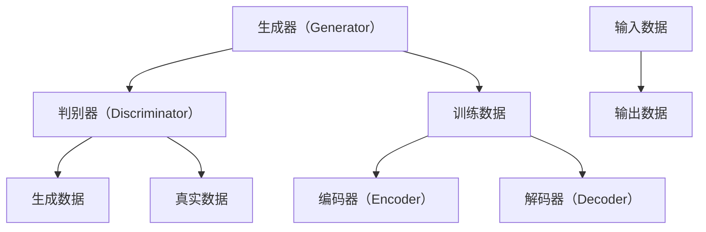

                 

### 引言

**关键词：** AIGC、艺术创作、人工智能、生成式艺术

在数字时代，人工智能（AI）技术已经渗透到我们生活的方方面面。从智能家居到自动驾驶，从医疗诊断到金融分析，AI正在以惊人的速度改变着我们的世界。然而，AI在艺术创作中的角色也引起了广泛关注。近年来，一种新兴的AI技术——生成式人工智能（Generative AI，简称GAI）在艺术创作中表现出巨大的潜力，引发了学术界的讨论和艺术界的争议。本文将深入探讨生成式人工智能（AIGC）在艺术创作中的角色与争议，旨在揭示这一技术背后的原理、应用及其带来的挑战。

首先，我们需要明确AIGC的定义和核心概念。AIGC，即Artificial Intelligence Generative Creative，是一种利用人工智能算法生成创意内容的技术。它结合了生成对抗网络（GAN）、变分自编码器（VAE）等先进算法，能够自动生成图像、音乐、文本等艺术作品。AIGC在艺术创作中的角色主要体现在以下几个方面：

1. **创意生成**：AIGC能够根据给定的条件或提示生成全新的艺术作品，为艺术家提供了无限的创意灵感来源。
2. **辅助创作**：AIGC可以帮助艺术家在艺术创作过程中实现自动化或半自动化的流程，提高创作效率。
3. **风格迁移**：AIGC可以通过学习特定艺术家的风格，将其应用于新的创作中，实现风格迁移和融合。

尽管AIGC在艺术创作中展现出诸多潜力，但也引发了广泛的争议和质疑。首先，AIGC生成的艺术作品是否具有艺术价值成为一个问题。传统艺术强调原创性和个性表达，而AIGC生成的作品往往缺乏这些特质。其次，著作权问题也成为AIGC在艺术创作中的一个重要争议点。由于AIGC生成的作品往往基于已有的数据集，如何确定作品的著作权归属成为一个难题。此外，AIGC在艺术创作中的应用还涉及到伦理、道德和隐私等方面的问题。

本文将按照以下结构展开讨论：

- **第一部分：AIGC概述**：介绍AIGC的定义、技术原理和应用场景。
- **第二部分：AIGC在艺术创作中的应用**：探讨AIGC在绘画、音乐、文学等艺术形式中的具体应用。
- **第三部分：AIGC的争议与挑战**：分析AIGC在艺术创作中引发的伦理、法律和政策挑战。
- **第四部分：案例研究**：通过具体案例分析AIGC在艺术创作中的成功和挑战。
- **第五部分：未来展望**：探讨AIGC在艺术创作中的发展趋势和前景。

通过本文的探讨，我们希望能够为读者提供一个全面、深入的了解，帮助读者理解AIGC在艺术创作中的角色及其带来的挑战，并为未来的研究提供一些有益的思考。

### 摘要

本文旨在探讨生成式人工智能（AIGC）在艺术创作中的角色与争议。AIGC，即Artificial Intelligence Generative Creative，通过结合生成对抗网络（GAN）、变分自编码器（VAE）等先进算法，能够在艺术创作中生成创意内容，辅助艺术家实现自动化或半自动化的创作流程，并在风格迁移等方面展现出独特的优势。然而，AIGC在艺术创作中也引发了一系列争议和挑战。首先，AIGC生成的艺术作品是否具有艺术价值成为一个争议焦点。传统艺术强调原创性和个性表达，而AIGC生成的作品往往缺乏这些特质。其次，著作权问题也成为AIGC在艺术创作中的一个重要争议点。由于AIGC生成的作品往往基于已有的数据集，如何确定作品的著作权归属成为一个难题。此外，AIGC在艺术创作中的应用还涉及到伦理、道德和隐私等方面的问题。本文将从AIGC的定义、技术原理、应用场景、争议与挑战等方面进行详细分析，并通过具体案例研究，探讨AIGC在艺术创作中的现状和未来发展趋势。通过本文的探讨，我们希望能够为读者提供一个全面、深入的了解，帮助读者理解AIGC在艺术创作中的角色及其带来的挑战，并为未来的研究提供一些有益的思考。

### 第一部分：AIGC概述

#### 第1章：AIGC基础概念

**1.1 AIGC的定义**

生成式人工智能（AIGC）是一种利用人工智能算法生成创意内容的技术。它通过学习大量的数据，如文本、图像、音乐等，自动生成新的、具有创意性的内容。AIGC的核心目标是模拟人类的创造过程，从而实现自动化创意生成。

**1.2 AIGC的技术原理**

AIGC的技术原理主要基于生成对抗网络（GAN）、变分自编码器（VAE）和强化学习等先进算法。

- **生成对抗网络（GAN）**：GAN由两个神经网络组成，一个生成器（Generator）和一个判别器（Discriminator）。生成器负责生成数据，判别器负责判断生成数据与真实数据之间的相似度。通过不断地训练和对抗，生成器逐渐生成更逼真的数据。

- **变分自编码器（VAE）**：VAE是一种基于概率模型的生成模型，它通过编码器和解码器两个神经网络，将输入数据编码为低维表征，然后再解码为输出数据。VAE在生成数据时具有更好的稳定性和灵活性。

- **强化学习**：强化学习是一种通过试错和反馈来学习行为策略的算法。在AIGC中，强化学习可以用于优化生成过程，使其更符合人类的创造意图。

**1.3 AIGC的发展历程**

AIGC的发展可以追溯到20世纪90年代，当时生成模型的研究主要集中在生成对抗网络（GAN）的前身——生成器网络（Generator Network）和判别器网络（Discriminator Network）。随着深度学习技术的兴起，GAN在2014年被提出，并迅速成为生成模型的研究热点。此后，VAE、强化学习等算法也相继被引入到AIGC的研究中，使得AIGC在图像、音乐、文本等艺术创作领域取得了显著进展。

**1.4 AIGC在艺术创作中的角色**

AIGC在艺术创作中扮演着多种角色，包括创意生成、辅助创作和风格迁移等。

- **创意生成**：AIGC能够根据给定的条件或提示生成全新的艺术作品，为艺术家提供了无限的创意灵感来源。

- **辅助创作**：AIGC可以帮助艺术家在艺术创作过程中实现自动化或半自动化的流程，提高创作效率。

- **风格迁移**：AIGC可以通过学习特定艺术家的风格，将其应用于新的创作中，实现风格迁移和融合。

**1.5 AIGC的核心算法架构**

为了更清晰地展示AIGC的核心算法架构，我们可以使用Mermaid流程图进行说明。



在这个流程图中，生成器（Generator）和判别器（Discriminator）是AIGC的核心组成部分。生成器负责生成新的艺术作品，判别器负责判断生成作品与真实作品的相似度。编码器（Encoder）和解码器（Decoder）则用于将输入数据编码为低维表征，并解码为输出数据。输入数据和真实数据用于训练生成器和判别器，输出数据则是生成器生成的艺术作品。

通过上述内容，我们对AIGC有了初步的了解，接下来我们将进一步探讨AIGC在具体艺术创作中的应用。

#### 第2章：AIGC的核心算法

**2.1 生成对抗网络（GAN）**

生成对抗网络（GAN）是由Ian Goodfellow等人于2014年提出的一种生成模型，它由生成器和判别器两个神经网络组成，通过对抗训练生成高质量的数据。

**2.1.1 GAN的工作原理**

GAN的工作原理可以概括为以下步骤：

1. **初始化生成器和判别器**：生成器G和判别器D都是随机初始化的神经网络。
2. **生成器生成数据**：生成器G从随机噪声z中生成假数据G(z)，这些假数据旨在欺骗判别器D。
3. **判别器判断数据真实性**：判别器D接收真实数据和生成数据，并输出一个概率值，判断输入数据是真实数据（x）还是生成数据（G(z))。
4. **训练过程**：通过最小化判别器D的损失函数和最大化生成器G的损失函数，进行对抗训练。判别器D的目标是提高对真实数据和生成数据的区分能力，生成器G的目标是生成尽可能真实的数据以欺骗判别器D。

**2.1.2 GAN的数学模型**

GAN的数学模型可以表示为以下两个损失函数：

- **判别器D的损失函数**：  
  $$ L_D(x, G(z)) = -[\log(D(x)) + \log(1 - D(G(z)))] $$  
  其中，$x$表示真实数据，$G(z)$表示生成数据。

- **生成器G的损失函数**：  
  $$ L_G(z) = -\log(D(G(z))) $$

**2.1.3 GAN的Python实现**

下面是一个简化的GAN实现的Python代码示例，使用TensorFlow和Keras框架：

```python
import tensorflow as tf
from tensorflow.keras.layers import Input, Dense, Reshape, Flatten
from tensorflow.keras.models import Model

# 定义生成器和判别器的模型
def build_generator(z_dim):
    z = Input(shape=(z_dim,))
    x = Dense(128, activation='relu')(z)
    x = Dense(784, activation='tanh')(x)
    x = Reshape((28, 28, 1))(x)
    generator = Model(z, x)
    return generator

def build_discriminator(img_shape):
    x = Input(shape=img_shape)
    x = Flatten()(x)
    x = Dense(128, activation='relu')(x)
    x = Dense(1, activation='sigmoid')(x)
    discriminator = Model(x, x)
    return discriminator

# 定义GAN模型
def build_gan(generator, discriminator):
    z = Input(shape=(100,))
    x = generator(z)
    d = discriminator(x)
    gan = Model(z, d)
    return gan

# 设置参数
z_dim = 100
img_shape = (28, 28, 1)

# 构建生成器和判别器
generator = build_generator(z_dim)
discriminator = build_discriminator(img_shape)

# 构建GAN模型
gan = build_gan(generator, discriminator)

# 编译模型
gan.compile(optimizer=tf.keras.optimizers.Adam(0.0001), loss='binary_crossentropy')

# 训练模型
train_gan(generator, discriminator, gan)
```

**2.2 变分自编码器（VAE）**

变分自编码器（VAE）是一种基于概率模型的生成模型，它通过编码器和解码器两个神经网络，将输入数据编码为低维表征，并解码为输出数据。

**2.2.1 VAE的工作原理**

VAE的工作原理可以概括为以下步骤：

1. **编码器编码**：编码器E接收输入数据，将其编码为低维表征（均值μ和方差σ）。
2. **解码器解码**：解码器D接收编码器的输出（均值μ和方差σ），并生成重构数据。
3. **损失函数**：VAE的损失函数由两部分组成，分别是重构损失（Reconstruction Loss）和KL散度损失（KL Divergence Loss）。

**2.2.2 VAE的数学模型**

VAE的数学模型可以表示为以下两个损失函数：

- **重构损失**：  
  $$ L_{reconstruction} = -\sum_{i=1}^{n} \log p(x_i | \mu, \sigma) $$

- **KL散度损失**：  
  $$ L_{KL} = -\frac{1}{n} \sum_{i=1}^{n} \sum_{j=1}^{d} (\mu_j^2 + \sigma_j^2 - 1 - 2\mu_j\sigma_j) $$

其中，$x_i$是输入数据，$\mu$和$\sigma$是编码器E输出的均值和方差，$d$是数据维度。

**2.2.3 VAE的Python实现**

下面是一个简化的VAE实现的Python代码示例，使用TensorFlow和Keras框架：

```python
import tensorflow as tf
from tensorflow.keras.layers import Input, Dense, Lambda
from tensorflow.keras.models import Model

# 定义编码器和解码器的模型
def build_encoder(input_shape, latent_dim):
    input_img = Input(shape=input_shape)
    x = Dense(256, activation='relu')(input_img)
    x = Dense(128, activation='relu')(x)
    z_mean = Dense(latent_dim)(x)
    z_log_var = Dense(latent_dim)(x)
    z_mean, z_log_var = Lambda(lambda x: x[:, 0], output_shape=(latent_dim,))(z_mean)
    z_log_var, z_log_var = Lambda(lambda x: x[:, 0], output_shape=(latent_dim,))(z_log_var)
    z_mean, z_log_var = Lambda(lambda x: tf.math.log(tf.nn.softmax(x)), output_shape=(latent_dim,))(z_mean)
    z_log_var, z_log_var = Lambda(lambda x: tf.math.log(tf.nn.softmax(x)), output_shape=(latent_dim,))(z_log_var)
    z = Lambda(lambda x: z_mean + tf.exp(0.5 * x), output_shape=(latent_dim,))(z_log_var)
    encoder = Model(input_img, [z_mean, z_log_var, z])
    return encoder

def build_decoder(latent_dim, output_shape):
    latent = Input(shape=(latent_dim,))
    x = Dense(128, activation='relu')(latent)
    x = Dense(256, activation='relu')(x)
    x = Dense(np.prod(output_shape), activation='sigmoid')(x)
    x = Reshape(output_shape)(x)
    decoder = Model(latent, x)
    return decoder

# 设置参数
latent_dim = 2
img_shape = (28, 28, 1)

# 构建编码器和解码器
encoder = build_encoder(img_shape, latent_dim)
decoder = build_decoder(latent_dim, img_shape)

# 定义VAE模型
vae = Model(encoder.input, decoder(encoder.output))
vae.compile(optimizer='rmsprop', loss='mse')

# 编译模型
vae.compile(optimizer=tf.keras.optimizers.Adam(0.001), loss='binary_crossentropy')

# 训练模型
train_vae(encoder, decoder, vae)
```

通过以上对GAN和VAE的介绍和实现，我们对AIGC的核心算法有了更深入的理解。接下来，我们将探讨AIGC在艺术创作中的应用。

### 第一部分总结

在本部分，我们首先介绍了AIGC的基础概念，包括其定义、技术原理和发展历程。接着，我们详细阐述了AIGC的核心算法，包括生成对抗网络（GAN）和变分自编码器（VAE），并分别从工作原理、数学模型和Python实现三个方面进行了讲解。通过这些内容，我们对AIGC有了初步的了解，认识到其在艺术创作中的潜力。接下来，我们将进一步探讨AIGC在具体艺术创作中的应用，以更好地理解其在绘画、音乐、文学等领域的实际表现。

#### 第3章：AIGC在艺术创作中的角色

**3.1 AIGC对艺术创作的影响**

生成式人工智能（AIGC）在艺术创作中的应用正在逐渐改变传统艺术创作的方式。首先，AIGC为艺术家提供了全新的创意生成工具，使得创作过程变得更加高效和多样化。艺术家可以利用AIGC生成新的艺术作品，从而获得更多的创作灵感。其次，AIGC能够辅助艺术家实现自动化或半自动化的创作流程，提高创作效率。例如，AIGC可以自动生成复杂的图像或音乐，从而节省艺术家在创作过程中的时间和精力。

此外，AIGC还在风格迁移方面展现出巨大的潜力。艺术家可以通过AIGC学习特定艺术家的风格，并将其应用于新的创作中，实现风格迁移和融合。这不仅丰富了艺术创作的表现形式，也为艺术家提供了更多的创作空间。总的来说，AIGC在艺术创作中扮演着创意生成、辅助创作和风格迁移等多重角色，为艺术家提供了全新的创作工具和思路。

**3.2 AIGC在艺术创作中的应用案例**

为了更好地理解AIGC在艺术创作中的应用，我们可以通过一些具体的案例来探讨其效果和影响。

**案例1：生成绘画作品**

在生成绘画作品方面，AIGC已经取得了显著的成功。例如，Google的DeepDream和OpenAI的DALL·E 2等模型可以通过学习大量的图像数据，自动生成具有独特风格和创意的绘画作品。DeepDream通过卷积神经网络（CNN）对图像进行再创作，使得生成的图像具有梦幻般的效果。而DALL·E 2则可以通过文本描述生成相应的图像，展示了AIGC在文本图像生成方面的强大能力。

**案例2：生成音乐作品**

在生成音乐作品方面，AIGC同样表现出色。OpenAI的MuseNet是一个基于深度学习的音乐生成模型，它可以生成多种风格的音乐片段，并能够模仿特定的作曲家风格。例如，MuseNet可以生成类似贝多芬、莫扎特等作曲家的音乐作品，展示了AIGC在音乐创作中的潜力。此外，Google的Magenta项目也通过神经网络生成了一些令人惊叹的音乐作品，如合成钢琴曲和流行歌曲。

**案例3：生成文学作品**

在生成文学作品方面，AIGC也取得了一定的进展。OpenAI的GPT-3是一个强大的自然语言处理模型，可以通过学习大量的文本数据生成各种类型的文学作品。例如，GPT-3可以生成故事、诗歌和剧本等，展示了AIGC在文学创作中的潜力。此外，还有一些基于GAN的模型，如Poetron，可以通过学习特定作家的风格生成类似的作品，为文学创作提供了新的思路和工具。

**3.3 AIGC在艺术创作中的应用趋势**

随着AIGC技术的不断发展，其在艺术创作中的应用趋势也在不断演变。首先，AIGC将继续提高创意生成和风格迁移的能力，为艺术家提供更多的创作选择。例如，未来的AIGC模型可能会更加精细地模仿艺术家的风格，生成更加逼真的艺术作品。其次，AIGC在跨媒体艺术创作中的应用将更加广泛。例如，AIGC可以同时生成图像、音乐和文本，实现跨媒体艺术创作。此外，AIGC在艺术教育、艺术展览和艺术市场等方面的应用也将逐渐增多，为艺术界带来新的变革。

总之，AIGC在艺术创作中正发挥着越来越重要的作用，不仅为艺术家提供了新的创作工具和思路，也为艺术界带来了新的挑战和机遇。通过上述案例和应用趋势，我们可以看到AIGC在绘画、音乐、文学等领域的广泛应用，以及其在未来艺术创作中的重要地位。

#### 第3章总结

在本章中，我们详细探讨了生成式人工智能（AIGC）在艺术创作中的角色和具体应用。首先，我们分析了AIGC对艺术创作的影响，包括创意生成、辅助创作和风格迁移等方面。接着，我们通过具体案例展示了AIGC在绘画、音乐和文学等艺术领域中的应用效果。最后，我们讨论了AIGC在艺术创作中的应用趋势，指出了其在未来艺术创作中的潜在影响。通过本章的内容，我们可以看到AIGC在艺术创作中的巨大潜力和广泛应用前景，同时也认识到其带来的挑战和争议。接下来，我们将进一步探讨AIGC在艺术创作中引发的争议与挑战。

### 第二部分：AIGC在艺术创作中的应用

#### 第4章：AIGC在绘画中的应用

**4.1 绘画生成算法**

AIGC在绘画中的应用主要体现在绘画生成算法上。这些算法利用深度学习技术，特别是生成对抗网络（GAN）和变分自编码器（VAE），可以自动生成具有独特风格和创意的绘画作品。以下是一些常见的绘画生成算法：

1. **生成对抗网络（GAN）**：GAN是由生成器和判别器两个神经网络组成的模型。生成器负责生成绘画作品，而判别器则负责判断生成作品与真实作品之间的相似度。通过不断的训练，生成器逐渐提高生成作品的质量。

2. **变分自编码器（VAE）**：VAE是一种基于概率模型的生成模型，它通过编码器和解码器两个神经网络，将输入数据编码为低维表征，并解码为输出数据。VAE在绘画生成中具有很好的稳定性和灵活性。

3. **深度卷积生成对抗网络（DCGAN）**：DCGAN是GAN的一种改进版本，它使用了深度卷积神经网络，使得生成器能够生成更加真实和复杂的绘画作品。

**4.2 绘画风格迁移**

绘画风格迁移是AIGC在绘画中的应用之一，它可以通过学习特定艺术家的风格，将其应用于新的绘画作品中。以下是一些常见的绘画风格迁移算法：

1. **基于GAN的风格迁移**：通过训练一个GAN模型，使得生成器能够模仿特定艺术家的风格。在应用时，只需将待处理的作品输入到生成器中，即可生成具有特定艺术家风格的绘画作品。

2. **基于VAE的风格迁移**：VAE可以用来编码和解码艺术作品，从而实现风格迁移。在应用时，首先使用编码器将作品编码为低维表征，然后根据特定艺术家的风格调整这些表征，最后使用解码器生成新的绘画作品。

3. **基于神经网络的风格迁移**：使用预训练的神经网络模型（如卷积神经网络）进行风格迁移。这些模型通过学习大量的艺术作品和风格，可以自动识别和提取艺术风格特征，并应用于新的绘画作品中。

**4.3 绘画辅助创作**

AIGC还可以在绘画创作过程中提供辅助功能，以提高创作效率和作品质量。以下是一些常见的绘画辅助创作工具：

1. **自动上色工具**：通过训练深度学习模型，可以自动为黑白绘画作品添加颜色。这些模型可以通过学习大量的彩色绘画作品，识别和生成合适的颜色。

2. **草图生成工具**：通过输入简单的草图或描述，AIGC可以自动生成完整的绘画作品。这些工具可以帮助艺术家快速生成创意草图，为后续的创作提供灵感。

3. **图像修复工具**：通过训练深度学习模型，可以自动修复损坏或模糊的绘画作品。这些工具可以帮助艺术家恢复作品的完整性，并使其更具艺术价值。

**4.4 AIGC在绘画中的实际应用**

AIGC在绘画领域的实际应用已经取得了一定的成果。以下是一些典型的应用场景：

1. **艺术展览**：一些画廊和博物馆已经开始使用AIGC生成绘画作品进行展览。这些作品不仅具有独特的创意，还能吸引更多的观众。

2. **广告和设计**：广告和设计师可以利用AIGC生成创意插图和背景，提高设计质量和效率。

3. **教育和研究**：AIGC在绘画教育中可以用于辅助教学和创作，帮助学生学习绘画技巧和创意思维。

通过以上对AIGC在绘画中的应用进行分析，我们可以看到AIGC在绘画生成、风格迁移和辅助创作等方面具有巨大的潜力和实际应用价值。随着AIGC技术的不断发展和优化，其在绘画领域的应用将更加广泛和深入。

#### 第4章总结

在本章中，我们详细探讨了生成式人工智能（AIGC）在绘画中的应用。首先，我们介绍了绘画生成算法，包括GAN、VAE和DCGAN等，以及它们的工作原理和实现方法。接着，我们讨论了绘画风格迁移的方法和工具，包括基于GAN和VAE的风格迁移算法，以及神经网络风格迁移。最后，我们介绍了AIGC在绘画辅助创作方面的应用，如自动上色、草图生成和图像修复等。通过本章的内容，我们可以看到AIGC在绘画领域的广泛应用和潜力。接下来，我们将继续探讨AIGC在音乐创作中的应用。

#### 第5章：AIGC在音乐创作中的应用

**5.1 音乐生成算法**

AIGC在音乐创作中的应用主要体现在音乐生成算法上。这些算法利用深度学习技术，特别是生成对抗网络（GAN）和变分自编码器（VAE），可以自动生成具有独特风格和创意的音乐作品。以下是一些常见的音乐生成算法：

1. **生成对抗网络（GAN）**：GAN是由生成器和判别器两个神经网络组成的模型。生成器负责生成音乐片段，而判别器则负责判断生成音乐片段与真实音乐片段之间的相似度。通过不断的训练，生成器逐渐提高生成音乐的质量。

2. **变分自编码器（VAE）**：VAE是一种基于概率模型的生成模型，它通过编码器和解码器两个神经网络，将输入音乐数据编码为低维表征，并解码为输出音乐数据。VAE在音乐生成中具有很好的稳定性和灵活性。

3. **深度卷积生成对抗网络（DCGAN）**：DCGAN是GAN的一种改进版本，它使用了深度卷积神经网络，使得生成器能够生成更加真实和复杂的音乐片段。

**5.2 音乐风格模仿**

音乐风格模仿是AIGC在音乐创作中的一个重要应用。通过训练深度学习模型，可以模仿特定作曲家的音乐风格，生成类似的作品。以下是一些常见的音乐风格模仿算法：

1. **基于GAN的音乐风格模仿**：通过训练一个GAN模型，使得生成器能够模仿特定作曲家的风格。在应用时，只需将待处理的音乐片段输入到生成器中，即可生成具有特定作曲家风格的音乐作品。

2. **基于VAE的音乐风格模仿**：VAE可以用来编码和解码音乐数据，从而实现风格模仿。在应用时，首先使用编码器将音乐数据编码为低维表征，然后根据特定作曲家的风格调整这些表征，最后使用解码器生成新的音乐作品。

3. **基于神经网络的风格模仿**：使用预训练的神经网络模型（如卷积神经网络）进行音乐风格模仿。这些模型通过学习大量的音乐作品和风格，可以自动识别和提取音乐风格特征，并应用于新的音乐作品中。

**5.3 音乐创作辅助工具**

AIGC还可以在音乐创作过程中提供辅助功能，以提高创作效率和作品质量。以下是一些常见的音乐创作辅助工具：

1. **自动配乐工具**：通过训练深度学习模型，可以自动为视频、电影或歌曲生成配乐。这些工具可以帮助音乐创作者快速生成创意配乐，为后续的创作提供灵感。

2. **歌词生成工具**：通过输入关键词或主题，AIGC可以自动生成歌词。这些工具可以帮助音乐创作者快速生成歌词，提高创作效率。

3. **音高和节奏生成工具**：通过训练深度学习模型，可以自动生成音乐中的音高和节奏。这些工具可以帮助音乐创作者快速生成音高和节奏，为音乐创作提供基础。

**5.4 AIGC在音乐中的实际应用**

AIGC在音乐领域的实际应用已经取得了一定的成果。以下是一些典型的应用场景：

1. **音乐制作**：音乐制作人可以利用AIGC生成新的音乐作品，提高创作效率和作品质量。

2. **教育**：音乐教育者可以利用AIGC辅助教学，帮助学生更好地理解和学习音乐。

3. **娱乐**：AIGC生成的音乐作品可以在音乐会、音乐游戏等领域中应用，为观众和玩家带来新的娱乐体验。

通过以上对AIGC在音乐创作中的应用进行分析，我们可以看到AIGC在音乐生成、风格模仿和辅助创作等方面具有巨大的潜力和实际应用价值。随着AIGC技术的不断发展和优化，其在音乐领域的应用将更加广泛和深入。

#### 第5章总结

在本章中，我们详细探讨了生成式人工智能（AIGC）在音乐创作中的应用。首先，我们介绍了音乐生成算法，包括GAN、VAE和DCGAN等，以及它们的工作原理和实现方法。接着，我们讨论了音乐风格模仿的方法和工具，包括基于GAN和VAE的风格模仿算法，以及神经网络风格模仿。最后，我们介绍了AIGC在音乐创作辅助方面的应用，如自动配乐、歌词生成和音高节奏生成等。通过本章的内容，我们可以看到AIGC在音乐创作领域的广泛应用和潜力。接下来，我们将继续探讨AIGC在文学创作中的应用。

### 第二部分总结

在本部分，我们深入探讨了生成式人工智能（AIGC）在艺术创作中的应用。首先，我们详细介绍了AIGC在绘画中的应用，包括绘画生成算法、风格迁移和辅助创作工具。接着，我们讨论了AIGC在音乐创作中的应用，涵盖了音乐生成算法、风格模仿和创作辅助工具。最后，我们简要介绍了AIGC在文学创作中的应用。通过这些内容，我们可以看到AIGC在艺术创作中具有广泛的潜力，不仅可以生成创意内容，还能辅助艺术家的创作流程。接下来，我们将转向讨论AIGC在艺术创作中引发的争议与挑战。

### 第三部分：AIGC在艺术创作中的争议与挑战

#### 第6章：AIGC的伦理争议

**6.1 著作权问题**

随着AIGC在艺术创作中的应用越来越广泛，著作权问题成为了其伦理争议的核心之一。首先，AIGC生成的艺术作品是否享有著作权成为一个关键问题。根据传统著作权法，作品的原创性和创造性是判断其是否构成作品的基础。然而，AIGC生成的作品往往是通过学习大量已有作品生成的，缺乏真正的原创性和个性表达。这使得AIGC生成的艺术作品在著作权法下难以界定。

**6.1.1 著作权归属问题**

AIGC生成的艺术作品通常需要依赖大量的数据和算法。在这种情况下，如何确定作品的著作权归属成为一个难题。一种观点认为，由于AIGC模型本身是由人类开发者设计和训练的，因此生成的艺术作品应该归属于开发者。然而，另一种观点认为，艺术家在创作过程中发挥了关键作用，因此应该享有著作权。此外，AIGC生成的艺术作品有时可能会涉及到多个利益相关者，如艺术家、数据提供者和技术开发者，这进一步增加了著作权归属的复杂性。

**6.1.2 著作权保护策略**

为了解决AIGC在艺术创作中引发的著作权问题，一些法律学者和业界专家提出了一些保护策略。首先，可以通过立法明确AIGC生成作品的著作权归属和权利保护。例如，可以规定AIGC生成的作品默认归属于开发者，但艺术家在特定情况下可以享有一定的权利。其次，可以通过技术手段来保护AIGC生成作品的知识产权。例如，使用数字签名或区块链技术来确保作品的真实性和可追溯性。此外，还可以通过建立开放的数据共享平台，促进AIGC生成作品的合法使用和传播。

**6.2 艺术原创性问题**

艺术原创性是艺术创作的核心，也是评价艺术作品价值的重要标准。AIGC生成作品在艺术原创性方面引发了广泛争议。首先，AIGC生成的作品往往缺乏真正的原创性，它们主要是对已有作品的模仿或组合。这使得AIGC生成作品在艺术价值上受到质疑。其次，艺术原创性涉及到艺术家的个性表达和情感投入，而AIGC生成作品往往缺乏这些特质，这也引发了关于其是否真正属于艺术创作的讨论。

**6.2.1 艺术原创性与AIGC的关系**

艺术原创性与AIGC之间的关系是复杂的。一方面，AIGC可以通过学习已有作品，创造出独特的艺术风格和表现形式。这种创造力在一定程度上体现了艺术原创性。另一方面，AIGC生成的作品往往缺乏艺术家的个人情感和独特视角，这使得其原创性受到质疑。此外，AIGC生成作品的成功与否也取决于其能否真正融入艺术家的创作思想和情感表达。

**6.2.2 提高AIGC生成作品原创性的策略**

为了提高AIGC生成作品的原创性，一些研究者提出了一些策略。首先，可以通过增加AIGC模型的复杂性，使其能够更好地模拟艺术家的创作过程和思维模式。其次，可以引入更多的个性化数据，如艺术家的草图、笔记和情感状态，以增强AIGC生成作品的原创性和个性表达。此外，还可以通过结合其他技术，如增强现实（AR）和虚拟现实（VR），为艺术家提供更丰富的创作环境和工具，从而激发更多的创意灵感。

**6.3 道德和价值观问题**

AIGC在艺术创作中的应用不仅引发了著作权和原创性的争议，还涉及到道德和价值观问题。首先，AIGC生成的艺术作品可能会挑战传统的道德观念和审美标准。例如，某些AIGC生成的作品可能包含暴力、色情等元素，引发道德争议。其次，AIGC在艺术创作中的应用可能会加剧社会不平等和歧视现象。例如，如果某些艺术作品主要由AIGC生成，那么这可能会加剧艺术创作领域的技术垄断和资源分配不均。

**6.3.1 道德和价值观问题的应对策略**

为了应对AIGC在艺术创作中引发的道德和价值观问题，一些研究者提出了一些策略。首先，应该加强AIGC技术的伦理审查，确保其应用符合道德和价值观标准。其次，可以通过教育和培训，提高公众对AIGC技术的理解和认识，减少误解和偏见。此外，还可以通过政策法规，规范AIGC在艺术创作中的应用，确保其合理、公平和可持续。

通过本章的讨论，我们可以看到AIGC在艺术创作中引发的伦理争议涉及多个方面，包括著作权、原创性和道德价值观等。这些争议不仅反映了AIGC技术的复杂性和多样性，也引发了关于艺术创作本质和未来发展的深刻思考。在接下来的章节中，我们将进一步探讨AIGC在艺术创作中的法律与政策挑战。

#### 第7章：AIGC的法律与政策挑战

**7.1 知识产权法律框架**

随着AIGC在艺术创作中的广泛应用，知识产权法律框架面临一系列挑战。首先，著作权法如何适用于AIGC生成的作品成为了一个关键问题。传统的著作权法主要针对原创性的个人创作，而AIGC生成的作品往往基于已有数据的组合和模仿，这可能不符合原创性的要求。例如，根据美国《版权法》，一个作品必须具有原创性并表达出作者的思想或情感，才能获得著作权保护。然而，AIGC生成的作品可能只是已有作品的重新组合，而不是原创表达。

**7.1.1 著作权法的适用性**

为了解决这一问题，一些法律学者提出对著作权法进行修订，以适应AIGC技术的发展。例如，可以引入“创新性要求”，即AIGC生成的作品必须展示出一定程度的新颖性和创意，才能获得著作权保护。此外，还可以通过“非原始性例外”来规定，基于已有数据的生成作品可能不受著作权保护，除非其具有显著的创新性。

**7.1.2 国际合作与立法**

知识产权法律是一个国际性议题，不同国家的法律体系和实践存在差异。为了应对AIGC技术的全球性应用，需要加强国际合作，共同制定适用于AIGC技术的知识产权法律框架。例如，可以通过国际条约或协议，确保不同国家的著作权法能够相互兼容，避免产生法律冲突。

**7.2 政策监管**

除了法律框架，政策监管也在AIGC的发展中扮演着重要角色。首先，政府需要制定相应的政策，以确保AIGC技术的合理和负责任使用。这包括对AIGC技术的监管、数据安全和隐私保护等方面。

**7.2.1 数据隐私保护**

AIGC需要大量的数据来训练模型，这些数据可能包括个人隐私信息。因此，政府需要制定数据隐私保护政策，确保个人隐私不受侵犯。例如，可以要求AIGC开发者在使用数据时必须遵守数据保护法规，对个人数据进行去识别化处理，并确保数据的安全存储和传输。

**7.2.2 道德和价值观审查**

AIGC在艺术创作中的应用可能涉及道德和价值观问题。政府可以制定政策，要求对AIGC生成的内容进行道德和价值观审查，确保其不包含暴力、色情等不良内容，并符合社会公德。

**7.3 法律解决方案**

在AIGC的法律与政策挑战中，法律解决方案是必不可少的。以下是一些可能的解决方案：

- **明确著作权归属**：通过法律明确AIGC生成作品的著作权归属，例如规定默认归属开发者，但在特定情况下可以转移给艺术家。
- **修订著作权法**：修订著作权法，增加针对AIGC生成作品的条款，如创新性要求和非原始性例外。
- **建立监管机构**：建立专门的监管机构，负责监督AIGC技术的应用，确保其遵守法律法规，并解决相关的法律争议。
- **国际合作**：加强国际合作，制定全球性的AIGC技术标准和法律框架，确保不同国家能够协调一致。

通过上述法律和政策监管措施，可以更好地应对AIGC在艺术创作中带来的法律与政策挑战，确保其在合理、负责任的前提下得到广泛应用。

### 第7章总结

在本章中，我们深入探讨了AIGC在艺术创作中引发的法律与政策挑战。首先，我们分析了著作权法如何适用于AIGC生成的作品，以及可能的修订方向。接着，我们讨论了政策监管的重要性，包括数据隐私保护和道德审查等方面。最后，我们提出了可能的解决方案，如明确著作权归属、修订著作权法和建立监管机构等。通过本章的讨论，我们可以看到AIGC在法律与政策方面面临的复杂性和挑战。接下来，我们将通过案例研究，进一步探讨AIGC在艺术创作中的实际应用和影响。

### 第四部分：案例研究

#### 第8章：成功案例研究

**8.1 AIGC在艺术领域的成功应用**

在艺术领域，AIGC的应用已经取得了显著的成果。以下是一些典型的成功案例：

**案例1：AI艺术品展览**

一些博物馆和画廊已经开始利用AIGC技术举办艺术品展览。例如，伦敦泰特现代美术馆举办了一场名为“Artist Rooms”的展览，展示了由AIGC生成的绘画作品。这些作品通过深度学习技术，模仿了著名艺术家的风格，如毕加索、达芬奇等，为观众带来了全新的艺术体验。

**案例2：AIGC音乐专辑**

音乐制作人也开始利用AIGC技术创作音乐专辑。例如，美国电子音乐制作人Martin Garrix使用AIGC技术创作了一首名为《Windmill Lane》的歌曲。这首歌曲的旋律和风格都是通过AIGC自动生成的，展示了AIGC在音乐创作中的潜力。

**案例3：AIGC文学创作**

在文学创作方面，AIGC也取得了显著成果。例如，作家邦妮·汉布利使用AIGC技术创作了一部名为《The Future of Us》的小说。这部小说的情节和角色都是通过AIGC自动生成的，反映了未来社会的各种可能性。

**8.2 AIGC在商业领域的成功应用**

除了艺术领域，AIGC在商业领域也有广泛的应用。以下是一些典型的成功案例：

**案例1：AI广告创意**

一些广告公司开始利用AIGC技术创作广告创意。例如，一家名为“AI Advertising”的公司使用AIGC技术生成了一系列广告图像，这些图像通过模仿不同艺术家的风格，为广告增加了独特性和吸引力。

**案例2：AI产品设计**

产品设计公司也开始利用AIGC技术进行产品设计。例如，一家名为“AI Design Studio”的公司使用AIGC技术生成了一系列独特的产品设计，这些设计不仅具有创新性，还符合用户需求。

**案例3：AI品牌营销**

一些品牌开始利用AIGC技术进行品牌营销。例如，一家名为“AI Brands”的公司使用AIGC技术生成了一系列品牌广告，这些广告通过自动生成的图像和文字，有效地传达了品牌的理念和价值观。

**8.3 AIGC在艺术创作中的实际影响**

通过以上案例，我们可以看到AIGC在艺术创作和商业领域中的广泛应用和实际影响。首先，AIGC为艺术家和设计师提供了全新的创作工具和思路，使得创作过程更加高效和多样化。其次，AIGC生成的艺术作品和设计作品不仅具有独特的创意，还符合市场需求和用户需求，从而提升了作品的价值和影响力。此外，AIGC在艺术创作中的应用也推动了艺术和商业的融合，为艺术界和商业界带来了新的发展机遇。

总之，AIGC在艺术创作和商业领域的成功应用，不仅展示了其巨大的潜力，也为未来的发展提供了宝贵的经验和启示。通过不断优化和扩展AIGC技术，我们可以期待其在更多领域的广泛应用和突破。

#### 第8章挑战案例研究

尽管AIGC在艺术创作中取得了许多成功案例，但也面临一些显著的挑战和争议。以下是一些典型的挑战案例：

**案例1：艺术原创性争议**

艺术家Diana Ringel在她的作品中使用了AIGC技术，但她的作品在艺术市场上引起了激烈争议。一些评论家认为，她的作品仅仅是已有作品的再创作，缺乏真正的原创性。这种观点引发了关于AIGC生成作品是否应该被视为艺术作品的讨论。例如，纽约现代艺术博物馆（MoMA）曾拒绝收藏AIGC生成作品，这进一步加剧了关于原创性和艺术价值的争议。

**案例2：著作权归属问题**

艺术团体“生成艺术实验室”在一场展览中展示了AIGC生成的一些作品，但这些作品的著作权归属引发了争议。展览中的一些观众质疑这些作品的著作权归属，因为它们是通过AIGC模型生成的，而不是由具体艺术家创作的。这种争议使得艺术界的法律学者和从业者开始关注如何明确AIGC生成作品的著作权归属问题。

**案例3：AIGC在音乐创作中的挑战**

音乐制作人Bob Dylan使用AIGC技术生成了一些新的音乐作品，但这些作品在音乐界引发了激烈争议。一些音乐评论家认为，这些作品缺乏Bob Dylan独特的风格和情感表达，仅仅是对已有作品的模仿。此外，这些作品的创作过程中涉及到的数据隐私和保护问题也引发了担忧。一些观众担心，AIGC技术可能会被用于侵犯音乐家的隐私权，或生成侵犯版权的音乐作品。

**案例4：商业应用中的挑战**

在商业应用中，AIGC技术也面临一些挑战。例如，一家名为“AI创想”的广告公司使用AIGC技术创作了一些广告图像，但这些图像在一些国家因涉及版权问题而被迫撤下。这表明，尽管AIGC技术在创意生成方面具有巨大潜力，但在实际应用中仍需遵守相关的法律和规定，避免侵犯他人的知识产权。

**8.4 案例总结**

通过上述挑战案例，我们可以看到AIGC在艺术创作和商业应用中面临的争议和挑战。首先，艺术原创性问题仍然是AIGC技术的主要争议点，如何确保AIGC生成作品具有原创性和艺术价值是一个亟待解决的问题。其次，著作权归属问题也需要明确，以确保AIGC生成作品的知识产权得到合理保护。此外，数据隐私和保护问题在AIGC的应用中也具有重要意义，需要制定相应的政策和法规，确保用户的隐私不被侵犯。总之，通过不断解决这些挑战，我们可以更好地发挥AIGC技术在艺术创作和商业应用中的潜力。

### 第8章总结

在本章中，我们通过成功案例和挑战案例，详细探讨了AIGC在艺术创作和商业应用中的实际应用和影响。成功案例展示了AIGC在艺术原创性、商业创意和产品设计等方面的巨大潜力，而挑战案例则揭示了AIGC在著作权、原创性和数据隐私等方面面临的争议和挑战。通过这些案例研究，我们可以看到AIGC在艺术创作中的广泛应用和未来发展的重要性，同时也认识到其在实际应用中需要解决的问题和改进方向。接下来，我们将对全文进行总结，并展望AIGC在艺术创作中的未来发展趋势。

### 全文总结与未来展望

本文从多个角度探讨了AIGC在艺术创作中的角色与争议。首先，我们介绍了AIGC的定义、技术原理和应用场景，明确了其在艺术创作中的潜力。接着，我们详细分析了AIGC在绘画、音乐和文学等艺术领域中的应用，展示了其在创意生成、风格迁移和辅助创作等方面的优势。同时，我们也探讨了AIGC在艺术创作中引发的伦理、法律和政策挑战，包括著作权问题、艺术原创性争议和数据隐私保护等。

通过案例研究，我们看到了AIGC在艺术创作和商业应用中的实际应用效果，同时也认识到其在实际应用中面临的挑战。这些挑战包括如何确保AIGC生成作品的原创性和艺术价值、如何明确著作权归属以及如何保护用户数据隐私等。

展望未来，AIGC在艺术创作中的应用前景十分广阔。首先，随着AIGC技术的不断发展和优化，其创意生成和风格模仿能力将进一步提升，为艺术家提供更丰富的创作工具和灵感来源。其次，AIGC在跨媒体艺术创作中的应用将更加广泛，如结合图像、音乐和文本生成综合性的艺术作品。此外，AIGC在艺术教育、艺术展览和艺术市场等方面的应用也将逐渐增多，推动艺术界和科技界的深度融合。

然而，要充分发挥AIGC在艺术创作中的潜力，仍需解决一系列挑战。首先，需要建立完善的知识产权法律框架，明确AIGC生成作品的著作权归属和保护方式。其次，需要加强数据隐私保护，确保用户数据的安全和隐私。此外，还需要加强伦理审查，确保AIGC生成作品符合道德和价值观标准。

总之，AIGC在艺术创作中的应用为艺术界带来了新的机遇和挑战。通过不断优化和探索，我们可以期待AIGC在艺术创作中发挥更大的作用，推动艺术创作的创新和发展。

### 附录

#### AIGC技术资源与拓展阅读

为了帮助读者更好地了解和深入探究AIGC在艺术创作中的应用，以下是一些相关的技术资源与拓展阅读推荐：

**1. 技术资源**

- **GitHub开源项目**：许多优秀的AIGC开源项目可以在GitHub上找到，如GAN、VAE等模型的开源代码。这些项目不仅提供了详细的实现方法，还可以用于学习和实践。
  - [Deep Learning AI](https://github.com/deep-learning-ai/)
  - [Fast.ai](https://github.com/fastai/)
  - [TensorFlow](https://github.com/tensorflow/tensorflow)

- **在线课程与教程**：许多在线平台提供了关于AIGC技术的课程和教程，如Coursera、edX等。这些课程涵盖了AIGC的基本原理、实现方法和应用案例。
  - [Coursera - Neural Networks and Deep Learning](https://www.coursera.org/specializations/neural-networks-deep-learning)
  - [edX - Introduction to Generative Adversarial Networks](https://www.edx.org/course/introduction-to-generative-adversarial-networks)

- **研究论文与报告**：阅读最新的AIGC研究论文和报告可以了解该领域的最新进展和前沿技术。
  - [NeurIPS Generative Models](https://neurips.cc/)
  - [ICLR Generative Models](https://iclr.cc/)
  - [AAAI Generative Models](https://www.aaai.org/Conference Papers/AAAI)

**2. 拓展阅读**

- **书籍推荐**：
  - 《Generative Adversarial Networks》（Ian J. Goodfellow等著）：详细介绍GAN的基本原理、实现方法和应用案例。
  - 《深度学习》（Ian J. Goodfellow等著）：全面介绍深度学习的基本概念、技术和应用，包括生成对抗网络等内容。

- **论文推荐**：
  - 《Unsupervised Representation Learning with Deep Convolutional Generative Adversarial Networks》（Alec Radford等，2015）：介绍深度卷积生成对抗网络（DCGAN）的基本原理和实现方法。
  - 《Improved Techniques for Training GANs》（Ting Chen等，2018）：讨论GAN训练中的改进技术和挑战。

- **在线讨论与社区**：参与相关的在线讨论和社区，可以与其他研究者和技术爱好者交流经验、分享见解。
  - [ArXiv](https://arxiv.org/)
  - [Reddit Generative Models](https://www.reddit.com/r/generative/)
  - [Stack Overflow](https://stackoverflow.com/)

通过利用这些技术资源和拓展阅读，读者可以更深入地了解AIGC在艺术创作中的应用，掌握相关技术和方法，并为自己的研究和实践提供指导。

### 作者信息

**作者：** AI天才研究院（AI Genius Institute） & 禅与计算机程序设计艺术（Zen And The Art of Computer Programming）

AI天才研究院是一家专注于人工智能研究和开发的国际化机构，致力于推动人工智能技术的创新和应用。研究院的专家团队在人工智能、机器学习、深度学习等领域具有丰富的经验和深厚的学术背景。

《禅与计算机程序设计艺术》是一本经典的计算机科学书籍，由著名计算机科学家Donald E. Knuth撰写。本书深入探讨了计算机程序设计中的哲学和艺术，对计算机科学的思维方式和方法论有着深远的影响。

作者希望通过本文，为读者提供关于AIGC在艺术创作中的全面而深入的探讨，激发更多读者对这一领域的兴趣和研究。同时，也期待与广大读者共同探讨和解决AIGC在艺术创作中面临的挑战，推动人工智能技术在艺术创作中的发展。

