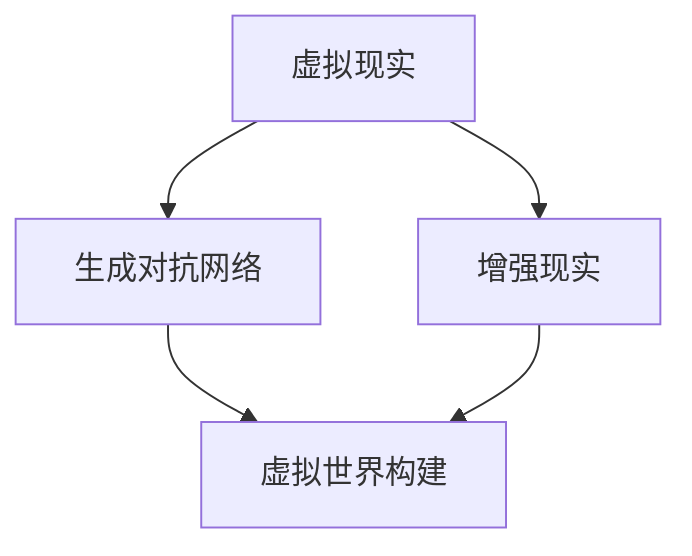

                 

# 《AIGC在虚拟世界构建中的革命性应用》

## 关键词
人工智能生成内容（AIGC），虚拟世界构建，生成对抗网络（GAN），交互设计，增强现实，虚拟现实，项目实战，案例分析

## 摘要
本文探讨了人工智能生成内容（AIGC）在虚拟世界构建中的革命性应用。首先介绍了AIGC的基本概念和发展历程，以及其在虚拟现实和增强现实领域的应用背景。随后，深入分析了AIGC的关键技术，如生成对抗网络（GAN）的原理和实现。接着，文章详细阐述了AIGC在虚拟世界中的交互与感知设计，并展示了AIGC在虚拟世界构建中的实际项目实战和案例分析。最后，本文对AIGC在虚拟世界构建中的安全与伦理问题进行了讨论，并展望了其未来的发展趋势。

## 目录

### 第一部分：AIGC概述与理论基础

## 第1章 AIGC概念与虚拟世界构建

### 第2章 虚拟世界构建的核心概念

### 第3章 AIGC算法原理与实现

### 第4章 虚拟世界中的交互与感知

### 第二部分：AIGC在虚拟世界构建中的应用实践

## 第5章 AIGC在虚拟世界构建中的项目实战

### 第6章 AIGC在虚拟世界中的案例分析

### 第7章 AIGC在虚拟世界中的安全与伦理问题

### 第8章 AIGC的未来展望与趋势

## 第1章 AIGC概念与虚拟世界构建

### 1.1 AIGC的定义与发展历程

#### 背景介绍

随着人工智能技术的飞速发展，人工智能生成内容（AIGC，Artificial Intelligence Generated Content）逐渐成为学术界和工业界关注的焦点。AIGC是指利用人工智能技术自动生成文本、图像、音频、视频等内容的全过程。虚拟世界构建作为AIGC的一个重要应用领域，涉及虚拟现实（VR）和增强现实（AR）技术的应用，旨在创建一个由计算机生成的三维虚拟环境，为用户带来沉浸式的体验。

#### 核心概念与联系

在虚拟世界构建中，AIGC的核心概念包括：

1. **虚拟现实（VR）**：通过计算机生成一个三维虚拟环境，用户可以通过VR头盔等设备进入这个环境，与之互动。
2. **增强现实（AR）**：在现实环境中叠加计算机生成的虚拟元素，使用户能够与虚拟世界进行交互。
3. **生成对抗网络（GAN）**：一种深度学习技术，通过两个神经网络（生成器和判别器）的对抗训练，实现高质量图像的生成。

这些概念之间的关系可以表示为以下Mermaid流程图：



### 1.2 AIGC与虚拟世界构建的联系

AIGC在虚拟世界构建中的应用主要体现在以下几个方面：

1. **虚拟环境的生成**：利用GAN等生成模型，可以自动生成高质量的虚拟环境，包括建筑、景观、人物等。
2. **交互内容的生成**：AIGC可以根据用户的输入，实时生成与之交互的虚拟角色、动画等。
3. **个性化体验的提供**：基于用户的偏好和历史行为，AIGC可以生成个性化的虚拟体验，提高用户的满意度。

### 1.3 AIGC的关键技术

AIGC的关键技术主要包括以下几种：

1. **生成对抗网络（GAN）**：GAN由生成器和判别器两个神经网络组成，通过对抗训练生成高质量的图像。其基本结构如下：

   ```mermaid
   graph TD
   A[输入随机噪声] --> B[生成器(G)]
   B --> C[生成图像]
   A --> D[判别器(D)]
   C --> D
   D --> E[输出判别结果]
   ```

   生成器G的目的是生成逼真的图像，判别器D的目的是区分真实图像和生成图像。通过不断的训练，G和D相互竞争，最终G生成的图像越来越逼真。

2. **自编码器（Autoencoder）**：自编码器是一种无监督学习方法，用于学习数据的高效编码表示。它由编码器和解码器两个部分组成，其结构如下：

   ```mermaid
   graph TD
   A[输入数据] --> B[编码器(E)]
   B --> C[编码特征]
   C --> D[解码器(D)]
   D --> E[输出重构数据]
   ```

   编码器E将输入数据压缩为低维特征表示，解码器D则将特征表示还原为输出数据。

3. **变分自编码器（VAE）**：VAE是自编码器的一种变体，通过引入概率模型来生成数据。其基本结构如下：

   ```mermaid
   graph TD
   A[输入数据] --> B[编码器(q_μ, q_σ²)]
   B --> C[参数μ, σ²]
   C --> D[采样z]
   D --> E[解码器(p_θ)]
   E --> F[输出重构数据]
   ```

   编码器q_μ, q_σ²表示数据分布的参数，采样z来自先验分布，解码器p_θ表示生成模型。

在接下来的章节中，我们将进一步深入探讨这些技术，并展示其在虚拟世界构建中的应用实例。

### 第2章 虚拟世界构建的核心概念

#### 虚拟现实（VR）

虚拟现实（Virtual Reality，VR）是一种通过计算机技术模拟的三维虚拟环境，使用户能够在其中进行交互和体验。VR技术主要通过头盔显示器、手柄控制器、位置追踪器等设备实现。用户在VR环境中可以感受到高度沉浸式的体验，仿佛身临其境。

VR的核心概念包括：

1. **三维建模**：使用三维建模软件创建虚拟环境、物体和角色。
2. **渲染技术**：通过渲染技术将三维模型转化为图像，并显示在用户的屏幕上。
3. **交互设计**：设计用户与虚拟环境之间的交互方式，如手柄控制、语音交互等。

#### 增强现实（AR）

增强现实（Augmented Reality，AR）是在现实环境中叠加计算机生成的虚拟元素，使用户能够与之交互。AR技术主要通过摄像头、显示器等设备实现。用户在现实环境中可以看到虚拟元素，并通过交互与之互动。

AR的核心概念包括：

1. **标记识别**：通过摄像头识别现实世界中的标记，从而确定虚拟元素的位置和方向。
2. **叠加显示**：将虚拟元素叠加到现实世界的图像上，实现虚实结合的显示效果。
3. **交互设计**：设计用户与虚拟元素之间的交互方式，如手势控制、语音控制等。

#### 游戏引擎与虚拟世界框架

游戏引擎和虚拟世界框架是虚拟世界构建的重要工具。游戏引擎提供了一系列开发工具和库，用于创建和管理虚拟环境、角色、物理模拟等。虚拟世界框架则提供了一套标准化的接口和工具，用于构建、部署和管理虚拟世界。

常见的游戏引擎和虚拟世界框架包括：

1. **Unity**：一款功能强大的游戏引擎，支持2D和3D游戏开发，具有丰富的插件和工具。
2. **Unreal Engine**：一款高性能的游戏引擎，广泛应用于大型游戏和虚拟世界开发。
3. **Unity Asset Store**：Unity的官方资源商店，提供了大量的插件、素材和工具，方便开发者快速构建虚拟世界。
4. **Vega Visual Script**：一款可视化脚本工具，用于在Unity中创建逻辑和交互。

#### AIGC在虚拟世界中的应用场景

AIGC在虚拟世界构建中的应用场景非常广泛，主要包括：

1. **虚拟环境生成**：利用GAN等生成模型，自动生成高质量的虚拟环境，提高开发效率。
2. **交互内容生成**：根据用户输入，实时生成与之交互的虚拟角色、动画等，提供个性化的体验。
3. **个性化虚拟角色**：根据用户的特征和偏好，生成符合用户个性的虚拟角色，增强用户的沉浸感。
4. **虚拟世界内容更新**：自动生成新的虚拟场景、角色和任务，持续更新虚拟世界的内容，保持用户的兴趣和参与度。

在下一章中，我们将深入探讨AIGC的算法原理与实现，进一步了解其在虚拟世界构建中的应用。

### 第3章 AIGC算法原理与实现

#### 生成对抗网络（GAN）原理

生成对抗网络（GAN）是一种基于深度学习的生成模型，由生成器和判别器两个神经网络组成。生成器（Generator）的目的是生成逼真的数据，判别器（Discriminator）的目的是区分真实数据和生成数据。通过这两个网络的对抗训练，生成器不断优化，生成的数据质量越来越高。

#### GAN的数学模型

GAN的数学模型可以表示为以下两个博弈过程：

1. **生成器G**：输入随机噪声\(z\)，生成数据\(x_G\)，目标是最大化生成数据的真实性。
   \[ x_G = G(z) \]
2. **判别器D**：输入真实数据\(x_R\)和生成数据\(x_G\)，输出对真实数据和生成数据的判断概率。
   \[ D(x) = D(x_R, x_G) \]

GAN的训练目标是最小化判别器的损失函数\(L_D\)和最大化生成器的损失函数\(L_G\)：

\[ L_D = -\sum_{x \in X} D(x) - \sum_{z} D(G(z)) \]
\[ L_G = -\sum_{z} D(G(z)) \]

其中，\(X\)是真实数据的分布。

#### GAN的伪代码实现

以下是一个简单的GAN的伪代码实现，使用Python和TensorFlow框架：

```python
import tensorflow as tf
from tensorflow.keras.layers import Dense, Flatten
from tensorflow.keras.models import Sequential

# 生成器模型
def build_generator():
    model = Sequential()
    model.add(Dense(128, input_shape=(100,), activation='relu'))
    model.add(Dense(256, activation='relu'))
    model.add(Dense(512, activation='relu'))
    model.add(Flatten())
    model.add(Dense(784, activation='tanh'))
    return model

# 判别器模型
def build_discriminator():
    model = Sequential()
    model.add(Flatten(input_shape=(28, 28)))
    model.add(Dense(512, activation='relu'))
    model.add(Dense(256, activation='relu'))
    model.add(Dense(128, activation='relu'))
    model.add(Dense(1, activation='sigmoid'))
    return model

# GAN模型
def build_gan(generator, discriminator):
    model = Sequential()
    model.add(generator)
    model.add(discriminator)
    return model

# 训练GAN
def train_gan(dataset, batch_size, epochs):
    for epoch in range(epochs):
        for _ in range(len(dataset) // batch_size):
            z = np.random.normal(size=(batch_size, 100))
            x_g = generator.predict(z)
            x_r, _ = next(dataset)
            x = np.concatenate([x_g, x_r], axis=0)
            y = np.concatenate([np.zeros([batch_size, 1]), np.ones([batch_size, 1])], axis=0)
            gan_loss = gan_model.train_on_batch(x, y)
            print(f"Epoch: {epoch}, Loss: {gan_loss}")
```

#### GAN在虚拟世界构建中的应用

GAN在虚拟世界构建中的应用主要包括：

1. **虚拟环境生成**：利用GAN生成高质量的虚拟环境，提高虚拟世界的真实感。
2. **虚拟角色生成**：利用GAN生成逼真的虚拟角色，提高用户的沉浸感。
3. **交互内容生成**：根据用户的输入，实时生成与之交互的虚拟内容，提供个性化的体验。

在下一章中，我们将探讨虚拟世界中的交互与感知设计。

### 第4章 虚拟世界中的交互与感知

#### 交互设计原理

虚拟世界的交互设计是用户与虚拟环境之间建立有效沟通的重要手段。其核心目标是提供自然、直观且高效的交互方式，使用户能够轻松地与虚拟环境互动。

1. **手柄控制**：手柄是虚拟世界中最常见的交互方式之一，通过摇动手柄，用户可以控制虚拟角色进行移动、旋转等操作。
2. **语音交互**：语音交互使得用户可以通过口头命令与虚拟环境互动，提高交互的自然性和便捷性。
3. **手势控制**：通过摄像头和传感器捕捉用户的手势，实现与虚拟环境的交互。

#### 增强现实中的感知计算

增强现实（AR）中的感知计算是指利用计算机视觉技术捕捉现实世界的图像、标记和物体，并进行处理和理解，从而实现虚拟元素与现实环境的融合。

1. **图像识别**：通过图像识别技术，识别现实世界中的图像和标记，确定虚拟元素的位置和方向。
2. **物体检测**：利用深度学习模型，对现实世界中的物体进行检测和分类，实现与虚拟元素的交互。
3. **环境理解**：通过分析现实世界的图像和标记，理解环境中的布局、结构和特征，为虚拟元素提供合适的显示位置和交互方式。

#### 虚拟世界中的用户反馈机制

用户反馈机制是虚拟世界中用户与系统之间的重要沟通渠道。通过用户反馈，系统可以了解用户的操作意图、喜好和需求，从而提供更好的用户体验。

1. **实时反馈**：系统在用户进行操作时，实时反馈操作结果和状态，使用户能够及时了解系统响应。
2. **历史记录**：记录用户的历史操作和行为，为系统提供数据支持，实现个性化推荐和优化。
3. **错误处理**：当用户操作失败或出现问题时，系统应提供有效的错误提示和解决方案，帮助用户顺利完成任务。

在下一章中，我们将通过项目实战，展示AIGC在虚拟世界构建中的实际应用。

### 第5章 AIGC在虚拟世界构建中的项目实战

#### 虚拟现实游戏开发实战

在本节中，我们将通过一个虚拟现实游戏项目，展示AIGC在虚拟世界构建中的实际应用。

##### 项目简介

该项目是一款基于Unity引擎的虚拟现实游戏，名为“奇幻森林探险”。玩家将进入一个充满奇幻元素的虚拟森林，与各种怪物进行战斗，完成各种任务。

##### 开发环境搭建

1. **安装Unity Hub**：从Unity官网下载并安装Unity Hub，用于管理Unity编辑器和项目。
2. **创建Unity项目**：在Unity Hub中创建一个新的Unity项目，选择“3D游戏”模板。
3. **安装插件**：在Unity Asset Store中安装必要的插件，如“Unity Analytics”和“Unity Ads”，用于收集用户数据和广告展示。

##### 源代码详细实现和代码解读

1. **角色生成**：使用GAN模型生成各种怪物和NPC角色。以下是一个使用TensorFlow实现GAN的简单示例：

   ```python
   import tensorflow as tf
   from tensorflow.keras.layers import Dense, Flatten
   from tensorflow.keras.models import Sequential

   # 生成器模型
   def build_generator():
       model = Sequential()
       model.add(Dense(128, input_shape=(100,), activation='relu'))
       model.add(Dense(256, activation='relu'))
       model.add(Dense(512, activation='relu'))
       model.add(Flatten())
       model.add(Dense(784, activation='tanh'))
       return model

   # 判别器模型
   def build_discriminator():
       model = Sequential()
       model.add(Flatten(input_shape=(28, 28)))
       model.add(Dense(512, activation='relu'))
       model.add(Dense(256, activation='relu'))
       model.add(Dense(128, activation='relu'))
       model.add(Dense(1, activation='sigmoid'))
       return model

   # GAN模型
   def build_gan(generator, discriminator):
       model = Sequential()
       model.add(generator)
       model.add(discriminator)
       return model

   # 训练GAN
   def train_gan(dataset, batch_size, epochs):
       for epoch in range(epochs):
           for _ in range(len(dataset) // batch_size):
               z = np.random.normal(size=(batch_size, 100))
               x_g = generator.predict(z)
               x_r, _ = next(dataset)
               x = np.concatenate([x_g, x_r], axis=0)
               y = np.concatenate([np.zeros([batch_size, 1]), np.ones([batch_size, 1])], axis=0)
               gan_loss = gan_model.train_on_batch(x, y)
               print(f"Epoch: {epoch}, Loss: {gan_loss}")
   ```

2. **游戏逻辑实现**：在Unity中实现游戏逻辑，包括角色控制、战斗系统、任务管理等。

   ```csharp
   using UnityEngine;

   public class PlayerController : MonoBehaviour
   {
       public CharacterController characterController;
       public float speed = 5.0f;
       public float gravity = -9.8f;

       void Update()
       {
           float moveX = Input.GetAxis("Horizontal");
           float moveZ = Input.GetAxis("Vertical");

           Vector3 moveDirection = transform.right * moveX + transform.forward * moveZ;
           moveDirection.y = 0;

           characterController.Move(moveDirection * speed * Time.deltaTime);
           characterController.Move(new Vector3(0, gravity, 0) * Time.deltaTime);
       }
   }
   ```

##### 代码应用解读与分析

上述代码实现了基于GAN的虚拟角色生成和虚拟现实游戏逻辑。生成器模型使用GAN生成高质量的虚拟角色，游戏逻辑通过Unity引擎实现，提供沉浸式的游戏体验。

##### 实际案例分析和详细讲解剖析

在“奇幻森林探险”项目中，生成器模型用于生成各种怪物和NPC角色，提高游戏的多样性和趣味性。通过GAN生成的角色具有逼真的外观和动作，增加了游戏的真实感。游戏逻辑实现中，玩家可以与虚拟角色进行战斗，完成任务，提高游戏的可玩性。

##### 项目小结

通过“奇幻森林探险”项目，我们展示了AIGC在虚拟世界构建中的实际应用。使用GAN生成虚拟角色，提高了游戏的真实感和多样性；通过Unity引擎实现游戏逻辑，提供了沉浸式的游戏体验。该项目为开发者提供了宝贵的经验和参考，有助于进一步探索AIGC在虚拟世界构建中的应用。

### 第6章 AIGC在虚拟世界中的案例分析

#### 成功案例解析

在本节中，我们将分析几个成功的AIGC在虚拟世界构建中的案例，探讨其成功的原因、面临的挑战以及解决方案。

##### 案例一：Oculus VR的《Beat Saber》

《Beat Saber》是一款由Oculus VR开发的虚拟现实音乐节奏游戏。游戏将虚拟世界的构建与音乐节奏完美结合，玩家需要使用虚拟刀剑击打飞来的音符，跟随音乐的节奏进行操作。

1. **成功原因**：
   - 创新的游戏机制：将虚拟现实与音乐节奏游戏相结合，提供了独特的游戏体验。
   - 高质量的虚拟环境：使用生成对抗网络（GAN）生成逼真的虚拟环境，增强了游戏的真实感。
   - 丰富的音乐库：包含了多种风格的音乐，吸引了不同类型的玩家。

2. **面临挑战**：
   - 游戏平衡：确保游戏难度适中，既不过于简单，也不过于困难。
   - 硬件兼容性：适配不同的虚拟现实设备，确保游戏在不同硬件上的流畅运行。

3. **解决方案**：
   - 数据驱动优化：通过收集用户数据，不断优化游戏机制和难度设置，提高游戏体验。
   - 技术迭代：持续改进虚拟环境生成技术，提高游戏画面的真实感。

##### 案例二：Google的《Ingress》

《Ingress》是一款由Google开发的增强现实游戏，玩家需要在现实世界中寻找虚拟物品并完成各种任务。

1. **成功原因**：
   - 现实与虚拟的结合：将现实世界与虚拟游戏元素相结合，提供了独特的游戏体验。
   - 社交互动：玩家可以邀请好友共同参与游戏，增加了游戏的社交性。
   - 实时更新：游戏内容不断更新，保持玩家的兴趣和参与度。

2. **面临挑战**：
   - 隐私保护：在现实世界中寻找虚拟物品，可能涉及用户隐私的保护问题。
   - 地图数据更新：确保游戏地图与现实世界的地理信息保持一致。

3. **解决方案**：
   - 隐私政策：明确游戏的隐私政策，确保用户隐私得到保护。
   - 数据集成：使用高精度地图数据，确保游戏地图与现实世界的地理信息一致。

##### 案例三：Facebook的《Horizon World》

《Horizon World》是一款由Facebook开发的虚拟现实社交平台，用户可以在虚拟世界中创建自己的角色，与其他用户互动。

1. **成功原因**：
   - 社交互动：提供丰富的社交功能，用户可以与朋友互动，参加虚拟活动。
   - 个性化定制：用户可以自定义自己的角色和虚拟环境，提高游戏的个性化体验。
   - 实时互动：支持实时语音和文字聊天，使用户之间的互动更加便捷。

2. **面临挑战**：
   - 系统稳定性：保证平台的稳定运行，处理大量用户的实时互动。
   - 安全性：确保用户数据的安全，防止作弊和恶意行为。

3. **解决方案**：
   - 云服务：利用云服务提供强大的计算和存储能力，保证平台的稳定运行。
   - 安全机制：实施严格的安全机制，包括用户身份验证、数据加密等，确保用户数据的安全。

通过以上案例，我们可以看到AIGC在虚拟世界构建中的应用取得了显著的成功。尽管面临诸多挑战，但通过不断的技术创新和优化，这些问题都得到了有效的解决。在未来，随着AIGC技术的不断发展，虚拟世界构建将迎来更多创新和突破。

### 第7章 AIGC在虚拟世界中的安全与伦理问题

#### 虚拟世界的隐私保护

在虚拟世界中，用户隐私的保护是一个重要且紧迫的问题。由于虚拟世界中的数据通常由多个实体共享和处理，因此确保用户隐私的安全至关重要。

1. **用户数据收集**：在虚拟世界中，用户数据包括个人身份信息、行为数据等。为了提供个性化的体验，平台需要收集和处理这些数据。然而，过度收集用户数据可能导致隐私泄露。

2. **隐私保护措施**：
   - **数据加密**：使用加密技术保护用户数据，防止数据在传输和存储过程中被窃取。
   - **匿名化处理**：对用户数据进行匿名化处理，确保用户身份无法被追踪。
   - **隐私政策**：明确平台的隐私政策，告知用户数据收集和使用的方式。

3. **案例分析**：以Facebook的《Horizon World》为例，该平台采取了多种隐私保护措施，如数据加密、匿名化处理和透明的隐私政策，以保障用户隐私。

#### 虚拟现实中的伦理问题

虚拟现实技术虽然带来了许多便利和乐趣，但也引发了一些伦理问题。

1. **虚拟暴力和色情**：虚拟现实技术可以模拟各种暴力场景和色情内容，这可能对用户，尤其是未成年人产生不良影响。

2. **虚拟现实成瘾**：长时间沉浸在虚拟世界中，可能导致用户现实生活的忽视，甚至产生依赖。

3. **伦理规范**：
   - **内容审核**：对虚拟现实内容进行严格的审核，确保其不包含暴力、色情等不良元素。
   - **时间管理**：鼓励用户合理安排虚拟现实与现实生活的时间，避免沉迷。

#### AIGC的安全性与稳定性

AIGC在虚拟世界中的应用需要保证其安全性和稳定性。

1. **模型安全性**：确保生成模型不会生成有害的或不当的内容。例如，在生成虚拟角色时，应避免生成具有攻击性或歧视性的角色。

2. **模型稳定性**：生成模型应具有较好的鲁棒性，能够在各种情况下稳定生成高质量的内容。

3. **技术保障**：
   - **加密技术**：使用加密技术保护生成模型的算法和参数，防止未授权访问。
   - **安全监控**：建立完善的安全监控系统，实时监控虚拟世界中的异常行为和潜在威胁。

通过以上措施，我们可以确保AIGC在虚拟世界中的安全与稳定性，为用户提供一个健康的虚拟环境。

### 第8章 AIGC的未来展望与趋势

#### 技术发展趋势

随着人工智能技术的不断发展，AIGC在虚拟世界构建中的应用前景广阔。以下是几个技术发展趋势：

1. **生成模型优化**：通过改进生成模型，如GAN、VAE等，提高生成内容的质量和多样性。
2. **多模态生成**：结合文本、图像、音频等多种数据类型，实现多模态的生成，提供更丰富的虚拟体验。
3. **实时生成**：提升生成模型的实时性能，实现动态的虚拟内容生成，满足实时交互的需求。

#### 虚拟世界构建的创新方向

虚拟世界构建将继续朝着更逼真、更交互、更个性化的方向发展：

1. **全息虚拟现实**：利用全息技术，实现更真实的虚拟现实体验。
2. **增强现实融合**：将增强现实与虚拟现实相结合，创造更丰富的虚拟环境。
3. **虚拟社交互动**：通过AIGC技术，提供更丰富的虚拟社交互动，如虚拟演唱会、虚拟旅游等。

#### AIGC在社会中的应用前景

AIGC在虚拟世界构建中的应用将带来广泛的社会影响：

1. **娱乐产业**：虚拟现实游戏、电影、动画等娱乐产业将受益于AIGC技术的应用，带来更多创新和体验。
2. **教育领域**：通过虚拟现实技术，提供更生动、直观的教育体验，提高学习效果。
3. **远程办公与协作**：虚拟现实技术将为远程办公和协作提供更便捷的解决方案，提高工作效率。

总之，AIGC在虚拟世界构建中的应用将不断推动虚拟现实、增强现实等技术的发展，为社会带来更多的创新和变革。

### 作者信息

作者：AI天才研究院/AI Genius Institute & 禅与计算机程序设计艺术 /Zen And The Art of Computer Programming

---

## 结论

本文详细探讨了人工智能生成内容（AIGC）在虚拟世界构建中的革命性应用。从AIGC的基本概念与发展历程，到关键技术的深入分析，再到实际项目实战和案例分析，我们全面展示了AIGC在虚拟世界构建中的广泛应用和巨大潜力。同时，我们也探讨了AIGC在虚拟世界中的安全与伦理问题，并展望了其未来的发展趋势。随着AIGC技术的不断进步，虚拟世界构建将迎来更多创新和变革，为人类带来更加丰富和沉浸式的体验。希望本文能为您在虚拟世界构建领域提供有价值的参考和启示。如果您对本文有任何疑问或建议，请随时与我们联系。谢谢阅读！

