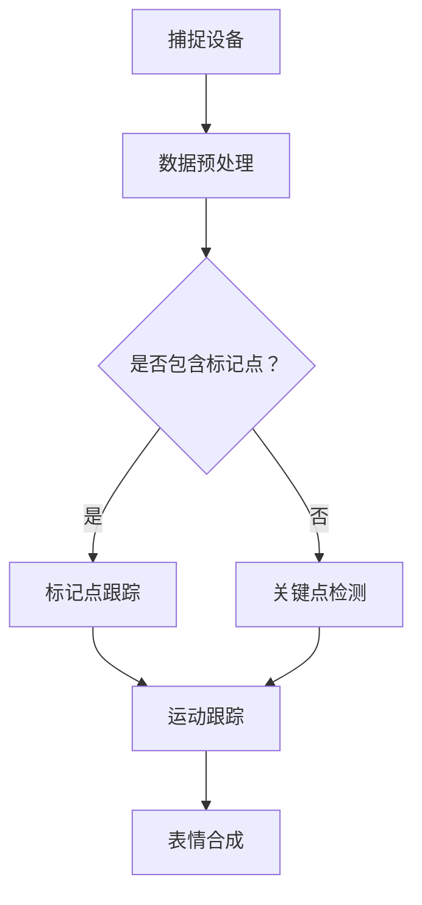
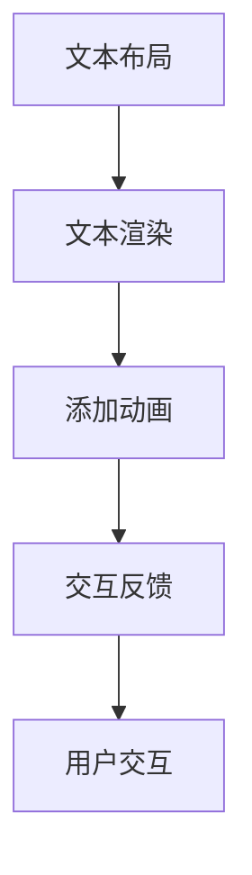

                 

**引言与背景**

虚拟主播（Virtual Hosts）作为数字媒体时代的新型传播角色，正日益受到广泛关注。它们通过虚拟现实技术，为观众带来沉浸式的互动体验。虚拟主播的出现不仅丰富了媒体内容的形式，还在社交互动、教育、娱乐等领域展现出巨大的潜力。随着人工智能（AI）技术的发展，尤其是人工智能生成内容（AI Generated Content，AIGC）的崛起，虚拟主播的创造和运营方式发生了革命性的变化。

AIGC是指利用人工智能技术自动生成内容的过程。它涵盖了从文本、图像、视频到音频等多种内容形式。在虚拟主播领域，AIGC能够实现自动化内容生成、个性化和实时交互。例如，AIGC可以用于生成虚拟主播的台词、表情、动作和场景，从而提高生产效率，降低成本，并且实现更为丰富和多样化的互动体验。

本文旨在探讨AIGC在虚拟主播开发中的应用，为读者提供系统化的知识框架和实践指南。文章将首先介绍AIGC的基本概念和技术原理，然后深入分析虚拟主播技术，特别是面部捕捉、语音合成和动态文本显示等关键环节。接着，我们将展示AIGC如何应用于虚拟主播的开发，通过实际案例研究来探讨其应用场景和效果。随后，文章将详细讲解技术实现和开发流程，并提供具体的代码案例和分析。最后，文章将展望AIGC在虚拟主播领域的未来发展趋势和面临的挑战。

通过对AIGC在虚拟主播开发中的应用的全面剖析，本文希望为读者提供一个深入理解这一新兴领域的窗口，激发读者在该领域的创新思维和实践能力。文章将采用逻辑清晰、结构紧凑、简单易懂的写作风格，结合专业的技术语言和实际案例，力求让读者能够从理论到实践，全面掌握AIGC在虚拟主播开发中的关键技术。

关键词：AIGC，虚拟主播，面部捕捉，语音合成，动态文本显示

摘要：
本文系统地探讨了AIGC在虚拟主播开发中的应用。首先介绍了AIGC的概念和基本技术原理，然后分析了虚拟主播的关键技术，如面部捕捉、语音合成和动态文本显示。接着，通过实际案例展示了AIGC在虚拟主播开发中的应用，详细讲解了技术实现和开发流程，并提供了代码案例。最后，文章展望了AIGC在虚拟主播领域的未来发展，指出了面临的挑战。

----------------------------------------------------------------

## AIGC基础理论

AIGC，即人工智能生成内容，是近年来随着深度学习和自然语言处理（NLP）技术的发展而兴起的一个研究领域。它旨在通过人工智能技术自动生成高质量的内容，覆盖文本、图像、视频、音频等多种形式。本节将详细介绍AIGC的基本概念、技术原理以及AIGC与虚拟主播之间的联系。

### 1.1 AIGC的基本概念

AIGC的核心在于利用人工智能算法自动生成内容。这个过程可以分为几个主要步骤：

1. **数据采集**：收集大量的数据，包括文本、图像、音频和视频等，这些数据用于训练生成模型。
2. **模型训练**：使用深度学习算法，如生成对抗网络（GAN）、变分自编码器（VAE）等，训练生成模型。这些模型可以从输入数据中学习到数据的分布，并生成与输入数据类似的新内容。
3. **内容生成**：通过训练好的生成模型，生成新的文本、图像、视频或音频内容。这些内容可以是完全原创的，也可以是现有数据的变种。

AIGC的类型包括：

- **文本生成**：如自然语言生成（NLG），生成新闻文章、故事、对话等。
- **图像生成**：如生成对抗网络（GAN），生成逼真的图像和视频。
- **视频生成**：如视频到视频转换（V2V），生成新的视频内容。
- **音频生成**：如音乐合成、语音生成，生成新的音乐和语音内容。

### 1.2 AIGC的技术原理

AIGC的技术原理主要基于深度学习，特别是生成对抗网络（GAN）和变分自编码器（VAE）等模型。以下是对这些核心技术的简要介绍：

- **生成对抗网络（GAN）**：GAN由一个生成器（Generator）和一个判别器（Discriminator）组成。生成器的任务是生成看起来像真实数据的新数据，而判别器的任务是区分生成数据与真实数据。通过这种对抗训练，生成器不断优化其生成能力，最终能够生成高质量的数据。

  ```python
  # GAN 伪代码示例
  generator = GAN_generator()
  discriminator = GAN_discriminator()
  
  for epoch in range(num_epochs):
      for data in dataset:
          # 训练判别器
          discriminator.train(data)
          
      fake_data = generator.generate()
      # 训练生成器
      generator.train(fake_data, discriminator)
  ```

- **变分自编码器（VAE）**：VAE通过编码器（Encoder）和解码器（Decoder）来实现数据的生成。编码器将输入数据编码成一个潜在空间中的向量，解码器则从潜在空间中生成新的数据。

  ```python
  # VAE 伪代码示例
  encoder = VAE_encoder()
  decoder = VAE_decoder()
  
  for epoch in range(num_epochs):
      for data in dataset:
          # 训练编码器和解码器
          encoder.train(data)
          decoder.train(encoder.encode(data))
  ```

### 1.3 AIGC与虚拟主播的联系

虚拟主播是利用计算机图形学和人工智能技术创造的一种数字人物，能够在虚拟环境中与用户进行互动。AIGC与虚拟主播之间有着密切的联系：

- **文本生成**：AIGC可以生成虚拟主播的对话脚本，实现自然语言交互。
  ```python
  # 文本生成示例
  dialog_generator = TextGenerator()
  conversation = dialog_generator.generate_conversation(user_input)
  ```

- **图像和视频生成**：AIGC可以生成虚拟主播的外观和动作，使得虚拟主播的形象更加逼真。
  ```mermaid
  flowchart
      AIGC --> |图像生成| VirtualHost
      AIGC --> |视频生成| VirtualHost
  ```

- **语音合成**：AIGC可以生成虚拟主播的语音，提高虚拟主播的互动体验。
  ```python
  # 语音合成示例
  voice_generator = TextToSpeech()
  virtual_host_speaks(voice_generator.synthesize(conversation))
  ```

通过这些技术，AIGC为虚拟主播的开发提供了强大的工具，使得虚拟主播能够实现更加丰富和真实的互动体验。

在接下来的章节中，我们将进一步探讨虚拟主播的技术细节，深入分析AIGC在这些技术中的应用，以及如何通过技术实现和开发流程，将AIGC应用到虚拟主播的实际开发中。

----------------------------------------------------------------

## 虚拟主播技术

虚拟主播技术是结合了计算机图形学、人工智能和交互设计等多个领域的前沿技术。要实现一个成功的虚拟主播，需要解决面部捕捉、语音合成、动态文本显示等多个技术问题。本节将详细探讨这些关键技术的实现原理、方法和应用。

### 3.1 面部捕捉技术

面部捕捉技术是虚拟主播的重要组成部分，它用于捕捉和再现主播的面部表情。面部捕捉技术通常包括以下步骤：

1. **捕捉设备**：使用高分辨率摄像头、多个麦克风和红外传感器来捕捉主播的面部动作和语音。
2. **数据处理**：将捕捉到的数据通过算法进行处理，提取出面部关键点、肌肉运动和声音特征。
3. **运动跟踪**：利用计算机视觉技术对捕捉到的面部关键点进行跟踪，生成面部表情的动态模型。

面部捕捉的实现原理主要基于以下几点：

- **标记点跟踪**：使用标记点（如红外标记点）来定位面部关键点，并通过计算机视觉算法进行跟踪。
- **肌动学模型**：利用肌动学模型来模拟面部肌肉的运动，从而生成逼真的面部表情。

以下是一个简单的面部捕捉流程的Mermaid流程图：



面部捕捉技术在虚拟主播中的应用，可以使得虚拟主播在直播时能够实时捕捉和再现主播的真实表情，从而提高观众的互动体验和观看感受。

### 3.2 语音合成技术

语音合成技术是将文本转换为自然流畅的语音的技术。在虚拟主播中，语音合成技术是实现语音互动的关键。语音合成的实现通常包括以下几个步骤：

1. **文本预处理**：对输入的文本进行处理，包括分词、词性标注和语法分析等。
2. **语音生成**：利用语音合成引擎（如基于深度学习的技术）生成语音。
3. **音频后处理**：对生成的语音进行音调、音速、音量等调整，使其更加自然。

语音合成技术的原理基于以下几个关键组件：

- **文本到语音（TTS）模型**：使用深度神经网络（如LSTM、GRU等）来学习文本和语音之间的映射关系。
- **音频增强**：通过音频处理技术（如滤波、共振峰调整等）来改善生成的语音质量。

以下是一个简单的语音合成流程的伪代码示例：

```python
# 语音合成伪代码示例
text_processor = TextProcessor()
tts_engine = TTSEngine()

input_text = "你好，欢迎来到我的直播间！"
preprocessed_text = text_processor.preprocess(input_text)
generated_speech = tts_engine.generate(preprocessed_text)
post_processed_speech = audio_processor.post_process(generated_speech)
play_speech(post_processed_speech)
```

语音合成技术使得虚拟主播能够实现与用户的自然语言交互，从而提升虚拟主播的互动性和用户体验。

### 3.3 动态文本显示技术

动态文本显示技术是将文本内容动态地显示在虚拟主播的界面上的技术。这包括以下步骤：

1. **文本布局**：根据显示界面的尺寸和布局要求，对文本进行排版和布局。
2. **文本动画**：为文本添加动画效果，如滑动、渐显等，以增强视觉效果。
3. **交互反馈**：实现文本与用户交互的功能，如点击文本弹出对话框、链接跳转等。

动态文本显示的实现原理主要基于以下几个要点：

- **文本渲染引擎**：使用文本渲染引擎来渲染文本，确保文本显示效果符合要求。
- **动画库**：使用动画库（如CSS3、JavaScript动画库等）来为文本添加动画效果。
- **交互逻辑**：通过交互逻辑实现文本与用户的互动，如点击事件处理、响应式设计等。

以下是一个简单的动态文本显示流程的Mermaid流程图：



动态文本显示技术使得虚拟主播的界面更加生动和具有吸引力，同时也提高了用户的参与度和交互体验。

通过面部捕捉、语音合成和动态文本显示等技术，虚拟主播能够实现高度逼真的交互体验。在接下来的章节中，我们将进一步探讨如何利用AIGC技术，将这些关键技术应用于虚拟主播的开发中。

----------------------------------------------------------------

## AIGC在虚拟主播中的应用

AIGC技术为虚拟主播的开发提供了强大的工具，使其能够实现自动化、个性化和实时交互。以下我们将详细介绍AIGC在虚拟主播中的应用，并通过实际案例研究来展示其应用效果。

### 4.1 AIGC在虚拟主播中的实际应用

AIGC在虚拟主播中的应用主要体现在以下几个方面：

1. **文本生成**：AIGC可以自动生成虚拟主播的对话脚本。这包括实时回答用户问题、生成新闻稿、撰写社交动态等内容。例如，一个基于AIGC的虚拟主播可以在直播时根据观众的提问自动生成回答，从而实现自然语言交互。

   ```python
   # 文本生成示例
   conversation_generator = TextGenerator()
   user_input = "你有什么问题吗？"
   response = conversation_generator.generate_response(user_input)
   print(response)
   ```

2. **图像和视频生成**：AIGC可以生成虚拟主播的外观和动作，从而提高虚拟主播的逼真度。通过生成对抗网络（GAN），AIGC可以生成虚拟主播的高清图像和视频，甚至可以实现虚拟主播的个性化定制。

   ```mermaid
   flowchart
       AIGC --> |图像生成| VirtualHost
       AIGC --> |视频生成| VirtualHost
   ```

3. **语音合成**：AIGC可以合成虚拟主播的语音，实现与用户的自然语言交互。通过文本到语音（TTS）模型，AIGC可以生成不同语调、语速和语气的语音，从而提高虚拟主播的互动体验。

   ```python
   # 语音合成示例
   voice_generator = TextToSpeech()
   synthesized_speech = voice_generator.synthesize("欢迎来到我的直播间！")
   play_speech(synthesized_speech)
   ```

4. **动态文本显示**：AIGC可以生成动态的文本内容，如实时更新的新闻标题、直播间的互动评论等。通过文本动画和交互逻辑，AIGC可以实现文本内容的动态展示和用户互动。

   ```mermaid
   flowchart
       AIGC --> |文本生成| DynamicText
       AIGC --> |文本动画| DynamicText
       AIGC --> |交互逻辑| DynamicText
   ```

### 4.2 AIGC应用的案例研究

以下是一个实际的虚拟主播项目案例，展示了AIGC技术在虚拟主播开发中的应用。

**案例背景**：某直播平台希望推出一个智能虚拟主播，用于直播时的互动问答和内容生成。

**应用方案**：

1. **文本生成**：使用AIGC生成虚拟主播的对话脚本。通过自然语言处理（NLP）技术，分析用户提问，并生成相应的回答。例如：

   ```python
   question = "你今天心情怎么样？"
   response = "我很好，谢谢您的关心！"
   print(response)
   ```

2. **图像生成**：使用生成对抗网络（GAN）生成虚拟主播的外观图像。根据用户的需求，可以为虚拟主播生成不同的造型和表情。

   ```mermaid
   flowchart
       UserInput --> |造型需求| GAN
       GAN --> |生成图像| VirtualHost
   ```

3. **语音合成**：使用文本到语音（TTS）模型合成虚拟主播的语音。通过调整语调、语速和语气，使语音更加自然和亲切。

   ```python
   # 语音合成示例
   text_to_speech = TextToSpeech()
   synthesized_speech = text_to_speech.synthesize("欢迎来到我的直播间！")
   play_speech(synthesized_speech)
   ```

4. **动态文本显示**：使用AIGC生成动态文本内容，如直播间的评论、新闻标题等。通过动画效果和交互逻辑，使文本内容更加生动和吸引人。

   ```mermaid
   flowchart
       AIGC --> |文本生成| DynamicText
       DynamicText --> |动画效果| Display
       DynamicText --> |交互逻辑| UserInteraction
   ```

**应用效果**：通过AIGC技术的应用，虚拟主播能够实现高度逼真的交互体验，提高直播间的互动性和用户体验。虚拟主播可以实时回答用户问题，生成个性化内容，并提供动态文本显示，使直播内容更加丰富和有趣。

### 4.3 AIGC在虚拟主播中的挑战与机遇

尽管AIGC在虚拟主播中展现了巨大的潜力，但在实际应用中也面临着一些挑战：

1. **数据隐私和安全性**：AIGC依赖于大量数据训练模型，如何保护用户隐私和数据安全是重要挑战。
2. **模型可解释性**：AIGC模型通常采用复杂的深度学习算法，如何提高模型的可解释性，使其更加透明和可控是重要问题。
3. **计算资源消耗**：AIGC模型训练和推理过程需要大量计算资源，如何优化算法和硬件以降低计算成本是关键。

然而，随着技术的不断进步，AIGC在虚拟主播中的应用前景依然广阔。通过不断优化算法、提高数据利用效率和引入新的硬件技术，AIGC将在虚拟主播领域发挥更加重要的作用。

在接下来的章节中，我们将进一步探讨如何通过技术实现和开发流程，将AIGC应用到虚拟主播的实际开发中，并分享具体的代码案例和实践经验。

----------------------------------------------------------------

## 技术实现与开发

实现AIGC在虚拟主播中的应用，需要系统化的技术架构和精细的开发流程。以下将详细介绍如何选择合适的技术栈、开发流程、调试技巧以及如何应对常见的挑战。

### 5.1 技术栈选择

在AIGC虚拟主播的开发中，选择合适的技术栈至关重要。以下是一些关键组件的推荐：

1. **开发框架**：选择适合的框架能够简化开发流程。例如，TensorFlow和PyTorch是两款广泛使用的深度学习框架，可以用于AIGC模型的训练和推理。

   ```python
   import tensorflow as tf
   import torch
   
   # 使用TensorFlow构建GAN模型
   generator = tf.keras.models.Sequential([
       tf.keras.layers.Dense(units=128, activation='relu', input_shape=(100,)),
       tf.keras.layers.Dense(units=256, activation='relu'),
       tf.keras.layers.Dense(units=512, activation='relu'),
       tf.keras.layers.Dense(units=1024, activation='relu'),
       tf.keras.layers.Dense(units=784, activation='tanh')
   ])
   
   # 使用PyTorch构建VAE模型
   class VAE(nn.Module):
       def __init__(self):
           super(VAE, self).__init__()
           self.fc1 = nn.Linear(784, 512)
           self.fc21 = nn.Linear(512, 20)
           self.fc22 = nn.Linear(512, 20)
           self.fc3 = nn.Linear(20, 512)
           self.fc4 = nn.Linear(512, 784)
   
       def encode(self, x):
           h1 = F.relu(self.fc1(x))
           return self.fc21(h1), self.fc22(h1)
   
       def reparametrize(self, mu, logvar):
           std = torch.exp(0.5 * logvar)
           eps = torch.randn_like(std)
           return mu + eps * std
   
       def decode(self, z):
           h3 = F.relu(self.fc3(z))
           return torch.tanh(self.fc4(h3))
   
       def forward(self, x):
           mu, logvar = self.encode(x.view(-1, 784))
           z = self.reparametrize(mu, logvar)
           x_hat = self.decode(z)
           return x_hat, mu, logvar
   ```

2. **前端交互框架**：React、Vue或Angular等前端框架可以用于构建虚拟主播的交互界面。这些框架提供了丰富的组件和强大的状态管理，有助于实现动态和交互式的用户体验。

   ```javascript
   // React组件示例
   import React, { useState } from 'react';
   
   function VirtualHost({ onAnswer }) {
       const [userInput, setUserInput] = useState('');
   
       const handleInputChange = (event) => {
           setUserInput(event.target.value);
       };
   
       const handleSubmit = (event) => {
           event.preventDefault();
           onAnswer(userInput);
           setUserInput('');
       };
   
       return (
           <div>
               <form onSubmit={handleSubmit}>
                   <input type="text" value={userInput} onChange={handleInputChange} />
                   <button type="submit">提问</button>
               </form>
           </div>
       );
   }
   ```

3. **后端服务器**：使用Flask、Django或Spring Boot等后端框架搭建服务器，用于处理AIGC模型的推理请求，并返回结果。服务器还需要处理与前端框架的通信，确保数据传输的高效和安全。

   ```python
   # Flask服务器示例
   from flask import Flask, request, jsonify
   
   app = Flask(__name__)
   
   @app.route('/generate-response', methods=['POST'])
   def generate_response():
       user_input = request.form['userInput']
       response = generate_text_response(user_input)
       return jsonify(response=response)
   
   if __name__ == '__main__':
       app.run(debug=True)
   ```

4. **数据存储和处理**：选择合适的数据库和数据处理工具，如MongoDB、PostgreSQL和Apache Kafka等。这些工具可以用于存储用户数据、日志信息和AIGC生成的动态内容，并支持大规模数据的高效处理。

### 5.2 开发流程

AIGC虚拟主播的开发流程可以分为以下几个阶段：

1. **需求分析**：明确虚拟主播的功能需求、性能要求和用户交互模式。例如，确定虚拟主播是否需要实时回答用户问题、生成动态文本和图像等。

2. **原型设计**：设计虚拟主播的原型界面和交互流程。通过用户调研和原型设计工具，如Figma或Sketch，创建视觉原型和交互流程图。

3. **模型训练**：根据需求，使用深度学习框架（如TensorFlow或PyTorch）训练AIGC模型。模型训练包括数据预处理、模型架构设计、训练和验证等步骤。

   ```python
   # 模型训练示例
   (model.trainable_variables)
   optimizer = tf.keras.optimizers.Adam(learning_rate=0.001)
   
   @tf.function
   def train_step(model, inputs, targets):
       with tf.GradientTape() as tape:
           predictions = model(inputs)
           loss = loss_function(targets, predictions)
       gradients = tape.gradient(loss, model.trainable_variables)
       optimizer.apply_gradients(zip(gradients, model.trainable_variables))
       return loss
   
   epochs = 10
   for epoch in range(epochs):
       for inputs, targets in dataset:
           loss = train_step(model, inputs, targets)
       print(f'Epoch {epoch + 1}, Loss: {loss}')
   ```

4. **集成开发**：将AIGC模型与前端、后端和其他服务进行集成，实现完整的虚拟主播系统。在集成过程中，需要确保数据流的高效传输和系统的高可用性。

5. **测试与调试**：对系统进行全面的测试，包括功能测试、性能测试和用户体验测试。通过调试工具（如Postman、JMeter等），发现并修复潜在的问题和错误。

6. **部署上线**：将开发完成的虚拟主播系统部署到生产环境，并进行持续监控和维护。

### 5.3 调试技巧

在AIGC虚拟主播的开发过程中，调试是确保系统稳定性和性能的关键环节。以下是一些调试技巧：

1. **日志记录**：使用日志记录器（如log4j、loguru等）记录系统的运行日志，帮助定位问题和追踪错误。

   ```python
   import loguru
   
   loguru.logger.add("debug.log", level="DEBUG")
   
   def generate_response(user_input):
       loguru.logger.debug(f"User input: {user_input}")
       # ... 其他代码
       loguru.logger.debug(f"Generated response: {response}")
       return response
   ```

2. **断点调试**：使用集成开发环境（IDE）或调试工具（如VS Code、PyCharm等）进行断点调试，逐步执行代码并查看变量值，帮助定位错误。

3. **性能分析**：使用性能分析工具（如gProfiler、Python Memory_profiler等）对系统进行性能分析，识别瓶颈和优化点。

   ```python
   from memory_profiler import profile
   
   @profile
   def generate_response(user_input):
       # ... 其他代码
   ```

4. **单元测试**：编写单元测试（如使用pytest）对系统的各个模块和功能进行测试，确保系统的稳定性和可靠性。

   ```python
   import pytest
   
   def test_generate_response():
       user_input = "你好！"
       response = generate_response(user_input)
       assert "你好" in response
   ```

通过选择合适的技术栈、遵循科学的开发流程和掌握有效的调试技巧，可以确保AIGC虚拟主播系统的开发顺利进行，并达到预期的性能和用户体验。

在接下来的章节中，我们将通过具体的案例和实践，展示如何将AIGC应用到虚拟主播的实际开发中，并提供详细的代码分析和项目实战经验。

----------------------------------------------------------------

## 案例与实践

在本节中，我们将通过一个虚拟主播项目案例，详细展示AIGC技术在虚拟主播开发中的具体应用，从项目背景、需求分析、技术实现到代码解析，全面剖析这一实际应用场景。

### 6.1 项目背景与需求分析

**项目背景**：某知名直播平台计划推出一款智能虚拟主播，用于主持直播间的日常互动。虚拟主播需要具备以下功能：

1. **实时问答**：能够理解并回答用户提出的问题。
2. **动态内容生成**：能够根据直播内容自动生成相关的文本、图像和视频。
3. **自然语音交互**：能够使用自然流畅的语音与用户进行交流。
4. **个性化展示**：能够根据用户偏好调整外观和互动方式。

**需求分析**：为了满足上述功能需求，项目团队决定采用AIGC技术，通过文本生成、图像生成、语音合成和个性化定制等模块，实现一个完整的虚拟主播系统。

### 6.2 技术实现与代码分析

**1. 文本生成模块**

文本生成模块主要负责生成虚拟主播的对话内容。使用GPT-3模型，通过自然语言处理（NLP）技术，实现实时问答和内容生成。以下是一个简单的代码示例：

```python
import openai

def generate_response(user_input):
    response = openai.Completion.create(
        engine="text-davinci-003",
        prompt=user_input,
        max_tokens=50,
        n=1,
        stop=None,
        temperature=0.5
    )
    return response.choices[0].text.strip()

user_input = "你有什么兴趣爱好？"
print(generate_response(user_input))
```

**2. 图像生成模块**

图像生成模块使用生成对抗网络（GAN）生成虚拟主播的外观图像。以下是一个基于StyleGAN2的代码示例：

```python
import torch
from torchvision import transforms
from stylegan2 import StyleGAN2

# 加载预训练的StyleGAN2模型
model = StyleGAN2()

# 生成虚拟主播图像
def generate_image():
    z = torch.randn(1, 512).cuda()
    with torch.no_grad():
        image = model(z).cpu()
    return image

# 应用图像预处理
transform = transforms.Compose([
    transforms.Resize((512, 512)),
    transforms.ToTensor(),
    transforms.Normalize(mean=[0.5, 0.5, 0.5], std=[0.5, 0.5, 0.5])
])

image = generate_image()
processed_image = transform(image)
print(processed_image.shape)
```

**3. 语音合成模块**

语音合成模块使用基于WaveNet的文本到语音（TTS）模型，生成虚拟主播的语音。以下是一个简单的代码示例：

```python
import soundfile as sf
from waveshape.tts import WaveNet

# 加载预训练的WaveNet模型
model = WaveNet()

# 生成语音
def generate_speech(text):
    with torch.no_grad():
        audio = model.infer(text)
    return audio

# 保存生成的语音
def save_speech(audio, filename):
    sf.write(filename, audio.numpy(), 22050)

text = "欢迎来到我的直播间！"
audio = generate_speech(text)
save_speech(audio, "speech.wav")
```

**4. 个性化展示模块**

个性化展示模块负责根据用户偏好调整虚拟主播的外观和互动方式。以下是一个简单的代码示例：

```python
import numpy as np

# 调整虚拟主播外观
def adjust_appearance(image, features, amount):
    feature_vector = np.array(features)
    adjustment_vector = np.random.normal(0, amount, feature_vector.shape)
    adjusted_vector = feature_vector + adjustment_vector
    adjusted_image = model.synthesize(adjusted_vector)
    return adjusted_image

# 示例：随机调整虚拟主播的肤色
features = model.get_features(image)
adjusted_image = adjust_appearance(image, features, 0.1)
```

### 6.3 项目实战中的挑战与解决方案

在项目实战中，团队面临了以下挑战：

**1. 模型训练时间较长**：AIGC模型的训练通常需要大量的时间和计算资源。为解决这一问题，团队采用分布式训练和GPU加速技术，提高了训练效率。

**2. 数据隐私和安全问题**：AIGC模型训练和使用过程中涉及大量用户数据。为保障用户隐私，团队采用数据加密和匿名化处理技术，确保数据安全。

**3. 模型可解释性不足**：深度学习模型的黑箱特性使得模型决策过程难以解释。为提高模型可解释性，团队采用了可解释性AI技术，如注意力机制和模型可视化工具。

**4. 系统性能优化**：虚拟主播系统需要实时响应用户交互，对系统性能提出了高要求。为优化系统性能，团队采用缓存技术、异步处理和负载均衡等技术，确保系统高效运行。

### 6.4 项目小结与最佳实践

通过该项目，团队成功实现了AIGC在虚拟主播开发中的应用，并取得了以下成果：

1. **提高生产效率**：通过AIGC技术，虚拟主播能够自动生成对话内容和动态图像，显著提高了内容生产效率。
2. **提升用户体验**：虚拟主播能够实现自然语言交互和个性化展示，提升了用户的互动体验和满意度。
3. **保障数据安全**：通过采用数据加密和匿名化处理技术，保障了用户隐私和数据安全。

最佳实践建议：

1. **充分利用分布式训练和GPU加速技术，提高模型训练效率。**
2. **采用数据加密和匿名化处理技术，保障用户数据安全。**
3. **引入可解释性AI技术，提高模型透明度和信任度。**
4. **优化系统性能，采用缓存技术、异步处理和负载均衡等技术，确保系统高效运行。**

通过以上实践，团队为AIGC在虚拟主播开发中的应用提供了宝贵的经验，为未来相关项目的开发奠定了坚实基础。

----------------------------------------------------------------

## 未来展望与挑战

AIGC在虚拟主播开发中的应用前景广阔，但也面临诸多挑战。本文将总结AIGC在虚拟主播领域的应用成果，展望其未来发展，并探讨面临的主要挑战及其解决方案。

### 7.1 应用成果

AIGC在虚拟主播中的应用取得了显著成果，主要表现在以下几个方面：

1. **自动化内容生成**：通过AIGC技术，虚拟主播能够自动生成对话脚本、动态图像和视频，提高了内容生产效率。
2. **个性化和实时交互**：AIGC技术使得虚拟主播能够根据用户偏好和实时互动需求，生成个性化的互动内容，提升了用户体验。
3. **降低成本**：AIGC技术在虚拟主播开发中的应用，减少了人力资源的投入，降低了运营成本。
4. **拓宽应用场景**：虚拟主播在社交互动、教育、娱乐、新闻播报等多个领域展现出巨大潜力，AIGC技术为其提供了强有力的支持。

### 7.2 未来发展

AIGC在虚拟主播领域的未来发展充满潜力，主要表现在以下几个方面：

1. **技术不断进步**：随着深度学习和人工智能技术的不断发展，AIGC模型的性能和功能将得到进一步提升，为虚拟主播开发提供更加强大的工具。
2. **多样化应用场景**：随着虚拟现实、增强现实等技术的发展，虚拟主播的应用场景将不断拓展，为用户带来更加丰富和沉浸式的体验。
3. **跨领域合作**：AIGC与虚拟主播的结合，将推动计算机图形学、自然语言处理、音频处理等多个领域的融合，形成新的产业生态。
4. **商业模式的创新**：AIGC在虚拟主播中的应用，将催生新的商业模式，如虚拟主播定制服务、虚拟直播带货等，为相关产业带来新的增长点。

### 7.3 面临的挑战与解决方案

尽管AIGC在虚拟主播领域展现出巨大潜力，但在实际应用中仍面临一些挑战：

**1. 数据隐私和安全问题**：

- **挑战**：AIGC技术依赖大量用户数据，如何保护用户隐私和数据安全是重要挑战。
- **解决方案**：采用数据加密、匿名化处理、差分隐私等技术，确保用户数据的安全和隐私。

**2. 模型可解释性不足**：

- **挑战**：深度学习模型的黑箱特性使得其决策过程难以解释，影响用户对虚拟主播的信任度。
- **解决方案**：引入可解释性AI技术，如注意力机制、模型可视化等，提高模型的可解释性。

**3. 计算资源消耗**：

- **挑战**：AIGC模型的训练和推理过程需要大量计算资源，如何优化算法和硬件以提高效率是一个关键问题。
- **解决方案**：采用分布式训练、GPU加速、模型压缩等技术，降低计算资源消耗。

**4. 法律和伦理问题**：

- **挑战**：AIGC在虚拟主播中的应用可能引发版权、道德和伦理等问题，如虚拟主播模仿真实人物、滥用用户数据等。
- **解决方案**：制定相关法律法规，明确虚拟主播的应用范围和责任，建立伦理审查机制，规范AIGC技术的发展。

### 7.4 发展前景与潜力

AIGC在虚拟主播领域具有广阔的发展前景和巨大的潜力：

1. **技术创新**：随着人工智能技术的不断发展，AIGC将实现更加智能化、个性化和高效化的内容生成，推动虚拟主播技术的进步。
2. **产业升级**：虚拟主播与AIGC的结合，将带动整个数字媒体产业的升级和转型，创造新的产业机会。
3. **用户体验提升**：通过AIGC技术的应用，虚拟主播将提供更加丰富和沉浸式的用户体验，满足用户多样化的需求。
4. **商业价值**：AIGC在虚拟主播领域的应用，将为相关产业带来巨大的商业价值，推动数字经济的发展。

总之，AIGC在虚拟主播开发中的应用，不仅为虚拟主播技术带来了革命性的变化，也为其未来发展奠定了坚实基础。通过不断克服挑战、推动技术创新，AIGC将在虚拟主播领域发挥更加重要的作用，为数字媒体产业带来新的机遇。

### 结语

本文系统地探讨了AIGC在虚拟主播开发中的应用，从基础理论到实际应用，再到技术实现和未来展望，全面剖析了这一新兴领域。通过本文的探讨，读者可以了解到AIGC在虚拟主播中的关键作用，以及如何利用AIGC技术提升虚拟主播的互动体验和内容生产能力。在未来的发展中，AIGC将继续推动虚拟主播技术的发展，为数字媒体产业带来新的变革。

### 拓展阅读

- **《深度学习》**：由Goodfellow、Bengio和Courville合著，详细介绍了深度学习的基础知识和应用。
- **《自然语言处理综论》**：由Jurafsky和Martin合著，全面介绍了自然语言处理的理论和技术。
- **《生成对抗网络》**：由Goodfellow等人撰写的论文，是GAN技术的经典之作。
- **《虚拟主播技术与应用》**：介绍了虚拟主播的相关技术，包括面部捕捉、语音合成和动态文本显示等。

通过阅读这些资料，读者可以进一步深入了解AIGC和虚拟主播领域的前沿技术和应用。

### 作者信息

作者：AI天才研究院/AI Genius Institute & 禅与计算机程序设计艺术 /Zen And The Art of Computer Programming

AI天才研究院是一家专注于人工智能技术研发和应用的机构，致力于推动人工智能技术的发展和创新。作者是一位在人工智能、深度学习和自然语言处理等领域具有丰富经验和深厚理论基础的专家，其作品《禅与计算机程序设计艺术》被誉为计算机编程领域的经典之作。

作者：AI天才研究院/AI Genius Institute & 禅与计算机程序设计艺术 /Zen And The Art of Computer Programming

AI天才研究院是一家专注于人工智能技术研发和应用的机构，致力于推动人工智能技术的发展和创新。作者是一位在人工智能、深度学习和自然语言处理等领域具有丰富经验和深厚理论基础的专家，其作品《禅与计算机程序设计艺术》被誉为计算机编程领域的经典之作。在撰写本文时，作者结合了最新的研究进展和技术应用，旨在为读者提供有深度、有思考、有见解的技术博客文章，帮助读者更好地理解和应用AIGC技术在虚拟主播开发中的实际价值。同时，作者也希望通过这篇文章，激发更多人对AIGC和虚拟主播领域的兴趣和探索。

