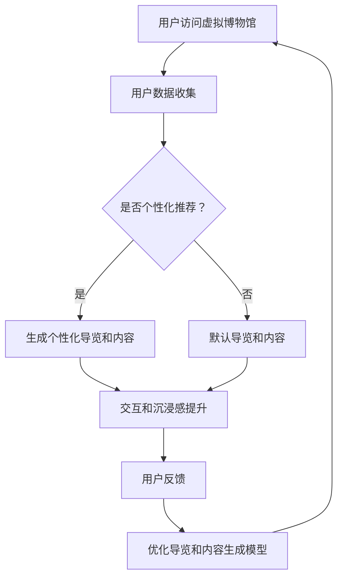

                 

### 文章标题

"AIGC在虚拟博物馆体验设计中的创新" 是本文的标题。AIGC，即生成式人工智能内容创作（Artificial Intelligence Generated Content），是近年来人工智能领域的热点技术。它通过深度学习模型生成文本、图像、音频等多种类型的内容，大大提升了内容创作的效率和个性化程度。虚拟博物馆体验设计，则是一个结合了计算机技术、虚拟现实（VR）和增强现实（AR）的领域，旨在通过数字技术为用户提供沉浸式、互动性的博物馆参观体验。

本文将以AIGC技术为核心，探讨其在虚拟博物馆体验设计中的创新应用。我们将从AIGC的定义、核心技术和应用场景入手，逐步深入到虚拟博物馆的设计原则、交互体验和内容生成等方面，通过具体的案例分析和代码实现，展示AIGC在提升虚拟博物馆用户体验方面的巨大潜力。文章结构清晰，逻辑严密，旨在为读者提供一份深入浅出的技术指南。

### 文章关键词

- AIGC
- 虚拟博物馆
- 体验设计
- 深度学习
- 生成模型
- 虚拟现实
- 增强现实
- 内容生成
- 个性化推荐
- 交互设计

### 文章摘要

本文旨在探讨生成式人工智能内容创作（AIGC）在虚拟博物馆体验设计中的创新应用。首先，我们将介绍AIGC的定义、核心技术及其在虚拟博物馆中的重要性。接着，深入分析虚拟博物馆的设计原则、交互体验和内容生成等方面，详细讲解AIGC在这些领域的具体应用。通过具体的案例和代码实现，本文展示了AIGC如何通过生成个性化内容、增强用户沉浸感和互动性，提升虚拟博物馆的用户体验。最后，本文将总结AIGC在虚拟博物馆体验设计中的优点和挑战，并展望未来的发展趋势。

### 引言

#### 1.1 什么是AIGC？

生成式人工智能内容创作（AIGC，Artificial Intelligence Generated Content）是一种利用人工智能技术生成各种类型内容的方法。AIGC的核心在于利用深度学习模型，特别是生成对抗网络（GAN）、变分自编码器（VAE）和变换器模型（Transformer）等，从大量数据中学习生成新的、多样化的内容。AIGC的应用范围广泛，包括文本、图像、音频、视频等多种类型的内容生成。

AIGC的基本原理基于生成与判别的对抗过程。生成模型试图生成逼真的内容，而判别模型则试图区分生成的内容和真实的内容。通过这种对抗训练，生成模型不断提高生成内容的质量，最终能够生成高度逼真的新内容。这种内容生成方式不仅提高了内容创作的效率，还能实现个性化推荐、艺术创作、数据增强等多种功能。

#### 1.2 AIGC的发展历程

AIGC的发展历程可以追溯到20世纪80年代，当时生成对抗网络（GAN）的概念首次被提出。GAN的核心思想是利用生成器和判别器之间的对抗关系来生成高质量的数据。然而，GAN在实际应用中面临许多挑战，如训练不稳定、生成内容质量不高等。随着深度学习技术的不断发展，特别是2014年，Ian Goodfellow等人提出了深度卷积生成对抗网络（DCGAN），显著提升了生成内容的质量和稳定性。此后，AIGC技术逐渐成熟，并得到了广泛的应用。

近年来，AIGC技术在图像、文本和音频生成领域取得了显著进展。例如，基于GAN的图像生成模型如StyleGAN2和BigGAN，能够生成高度逼真的图像；在文本生成方面，GPT-3等大型语言模型展示了强大的文本生成能力；在音频生成方面，WaveNet等模型能够生成自然流畅的音频。

#### 1.3 AIGC在虚拟博物馆体验设计中的重要性

虚拟博物馆体验设计是结合计算机技术、虚拟现实（VR）和增强现实（AR）的领域，旨在为用户提供沉浸式、互动性的博物馆参观体验。而AIGC技术在虚拟博物馆体验设计中具有重要应用价值，主要体现在以下几个方面：

1. **个性化内容生成**：AIGC能够根据用户的兴趣和行为，生成个性化的展览内容和介绍，提供更加贴合用户需求的体验。
2. **增强用户互动性**：通过生成互动性的展览内容，如互动式的展览解说、虚拟艺术品互动体验等，增强用户与博物馆内容的互动。
3. **艺术创作和展示**：AIGC可以生成新的艺术作品，扩展博物馆的展览内容，为用户提供独特的艺术体验。
4. **数据分析和推荐**：AIGC技术可以分析用户在虚拟博物馆中的行为数据，为用户提供个性化的推荐和展览内容，提高用户满意度。

总之，AIGC技术为虚拟博物馆体验设计带来了新的可能性和创新点，通过生成高质量的内容和增强用户互动性，有望显著提升虚拟博物馆的用户体验。

#### 1.4 虚拟博物馆的概念和背景

虚拟博物馆，顾名思义，是一种利用计算机技术和虚拟现实（VR）增强现实（AR）技术创建的数字博物馆。与传统实体博物馆不同，虚拟博物馆并不依赖于物理空间，而是通过互联网和数字平台，将博物馆的展品、历史和文化知识以数字化的形式呈现给用户。这种新兴的博物馆形式不仅打破了地域和时间的限制，还为观众提供了更加丰富和互动的参观体验。

虚拟博物馆的发展历史可以追溯到20世纪90年代，随着互联网和计算机技术的发展，数字化和虚拟现实技术逐渐成熟，虚拟博物馆开始进入人们的视野。早期虚拟博物馆主要依赖于2D网页展示，但随着3D建模、VR和AR技术的发展，虚拟博物馆的展示形式和互动性得到了显著提升。

目前，虚拟博物馆在博物馆领域得到了广泛的应用。许多知名博物馆，如大英博物馆、卢浮宫等，都已经建立了自己的虚拟博物馆，通过互联网向全球用户提供虚拟参观服务。虚拟博物馆不仅保存了实体博物馆中的展品，还通过数字化的方式展示了更多无法在实体博物馆中展出的文物和艺术品。此外，虚拟博物馆还可以提供互动性的展览内容，如虚拟导览、互动游戏等，大大增强了用户的参观体验。

#### 1.5 虚拟博物馆的类型

虚拟博物馆根据展示形式和技术手段的不同，可以分为几种类型：

1. **2D虚拟博物馆**：这种类型的虚拟博物馆主要依赖于传统的网页和2D图像展示，通过互联网提供展览信息的在线浏览。虽然互动性较低，但成本低，易于实现，是虚拟博物馆的早期形式。

2. **3D虚拟博物馆**：3D虚拟博物馆通过三维建模技术，将展品以三维形式呈现，用户可以在虚拟环境中自由旋转、放大和缩小展品。这种类型虚拟博物馆的互动性和沉浸感更强，为用户提供了更加真实的参观体验。

3. **虚拟现实（VR）博物馆**：VR博物馆利用虚拟现实技术，创建一个完全虚拟的三维环境，用户通过VR头戴设备可以完全沉浸在这个环境中，与展品进行互动。VR博物馆提供了高度沉浸和互动的体验，用户可以在虚拟环境中进行虚拟导览、探索未知展品等。

4. **增强现实（AR）博物馆**：AR博物馆则利用增强现实技术，将虚拟的展品和信息叠加在现实世界中，用户可以通过智能手机或AR眼镜观看。这种类型的博物馆不仅提供了虚拟展览，还能将展览内容与现实世界相结合，增强了互动性和趣味性。

#### 1.6 虚拟博物馆的现状和趋势

随着虚拟现实、增强现实和人工智能技术的不断进步，虚拟博物馆正逐渐成为博物馆界的重要趋势。当前，虚拟博物馆的应用范围和影响力不断扩大，不仅在国内外的博物馆中得到了广泛应用，还为博物馆教育和文化遗产保护提供了新的途径。

首先，虚拟博物馆为博物馆观众提供了更加灵活和便捷的参观方式。无论观众身处何地，只要通过互联网连接，就可以随时随地访问虚拟博物馆，浏览展品和展览内容。这种远程参观的方式，不仅打破了地域限制，还降低了观众参观的成本。

其次，虚拟博物馆通过增强互动性和沉浸感，大大提升了用户的参观体验。利用3D建模、VR和AR技术，虚拟博物馆能够创建高度逼真的展品和展览场景，用户可以自由地与展品互动，甚至可以在虚拟环境中进行虚拟导览和游戏。这种互动性不仅增强了用户对展品的理解和兴趣，还提高了展览的趣味性和吸引力。

此外，虚拟博物馆在博物馆教育和文化遗产保护方面也发挥着重要作用。虚拟博物馆可以提供丰富的教育资源和互动学习体验，帮助观众更深入地了解历史文化和艺术知识。同时，虚拟博物馆还能够保存和展示那些无法在实体博物馆中展出的珍贵文物和艺术品，为文化遗产的保护和传承提供了新的手段。

未来，随着技术的进一步发展和创新，虚拟博物馆将继续拓展其应用范围和功能。人工智能和机器学习技术的引入，将使得虚拟博物馆能够更好地理解和满足用户需求，提供更加个性化和智能化的参观体验。虚拟现实、增强现实和混合现实技术的融合，将带来更加丰富和沉浸的展览形式，为用户带来前所未有的参观体验。

总的来说，虚拟博物馆作为一种新兴的博物馆形式，正不断发展和创新，其在博物馆体验设计中的应用前景广阔。通过利用先进的技术手段，虚拟博物馆不仅为观众提供了更加丰富和互动的参观体验，还为博物馆的运营和管理提供了新的思路和方法。

### AIGC在虚拟博物馆中的角色

#### 1.1 提升用户体验

AIGC在虚拟博物馆中扮演着重要的角色，首先体现在提升用户体验方面。通过AIGC技术，虚拟博物馆可以生成个性化的展览内容和导览服务，满足不同用户的兴趣和需求。例如，AIGC可以分析用户的历史浏览记录和兴趣偏好，自动推荐与其兴趣相关的展品和展览活动，提高用户的参与度和满意度。

此外，AIGC还可以通过生成逼真的虚拟场景和互动元素，增强用户的沉浸感和体验感。例如，利用生成对抗网络（GAN）生成的三维虚拟展品，可以提供高度逼真的视觉体验；通过变分自编码器（VAE）生成的艺术作品，可以丰富博物馆的展览内容，为用户提供独特的艺术体验。

#### 1.2 生成和个性化内容

AIGC在虚拟博物馆中的另一个关键应用是生成和个性化内容。传统的博物馆展览内容通常固定不变，而AIGC技术可以实时生成新的展览内容，为博物馆注入新鲜元素。例如，利用AIGC技术生成的虚拟艺术品，可以根据博物馆的主题和展览要求，实时调整和生成独特的艺术作品，为观众带来新鲜感和惊喜。

除了艺术作品的生成，AIGC还可以应用于个性化展览导览和介绍。通过分析用户的兴趣和行为数据，AIGC可以生成个性化的导览路线和展览内容，为用户提供定制化的参观体验。例如，针对历史爱好者，AIGC可以推荐与历史事件相关的展品和故事；针对艺术爱好者，AIGC可以生成艺术评论和作品解析，提供深入的艺术鉴赏体验。

#### 1.3 交互和沉浸感

AIGC在虚拟博物馆中的第三个重要应用是增强交互和沉浸感。虚拟博物馆的互动性和沉浸感是影响用户体验的关键因素，而AIGC技术可以在这方面发挥重要作用。通过生成互动式的展览内容和游戏化元素，AIGC可以提供更加丰富和互动的参观体验。

例如，AIGC可以生成互动式的艺术装置，用户可以通过触摸、声音或动作与艺术作品互动，从而创造出独特的艺术体验。此外，AIGC还可以应用于虚拟导览，通过生成互动式的讲解内容，用户可以与虚拟导览员进行实时互动，获得更加深入和有趣的参观体验。

总的来说，AIGC技术在虚拟博物馆中的应用，不仅提升了用户的体验，还为博物馆的内容生成和交互设计提供了新的可能性。通过生成个性化内容、增强互动性和沉浸感，AIGC为虚拟博物馆体验设计带来了全新的变革和提升。

### AIGC的核心概念和技术

#### 2.1 AIGC模型和架构

AIGC（生成式人工智能内容创作）的核心在于其使用的生成模型和架构。这些模型通过深度学习技术，从大量数据中学习，并生成高质量的内容。以下将介绍几种主要的AIGC模型和架构：

1. **生成对抗网络（GAN）**：
   - **基本原理**：GAN由生成器（Generator）和判别器（Discriminator）两部分组成。生成器尝试生成逼真的数据，而判别器则试图区分生成的数据和真实数据。通过这种对抗训练，生成器不断提高生成数据的质量。
   - **应用**：GAN在图像生成、音频生成和文本生成等领域有广泛应用。例如，StyleGAN2通过GAN技术生成高度逼真的图像；WaveNet通过GAN生成自然流畅的音频。

2. **变分自编码器（VAE）**：
   - **基本原理**：VAE通过引入隐含变量来学习数据的概率分布，并使用这个概率分布来生成数据。生成器将隐含变量映射到数据空间，而判别器则用于评估生成数据的真实性。
   - **应用**：VAE在图像生成、图像去噪和图像超分辨率等领域有广泛应用。例如，Deep Convolutional VAE（DCVAE）用于生成高质量的图像。

3. **变换器模型（Transformer）**：
   - **基本原理**：Transformer模型通过自注意力机制（Self-Attention）来处理序列数据，使模型能够更好地捕捉长距离依赖关系。在生成文本、图像描述和代码等任务中表现出色。
   - **应用**：GPT-3等大型语言模型通过Transformer生成高质量的自然语言文本；DALL-E等模型通过Transformer生成图像和图像描述。

4. **流模型（Flow-based Model）**：
   - **基本原理**：流模型通过构建概率流来生成数据。生成器和判别器分别表示流的前向传播和后向传播，通过这种概率流生成数据。
   - **应用**：流模型在图像生成和音频生成领域有广泛应用。例如，Flow++通过流模型生成高质量的图像。

#### 2.2 关键算法

AIGC技术的核心在于其使用的生成算法，以下将介绍几种关键算法：

1. **生成对抗网络（GAN）算法**：
   - **训练过程**：生成器和判别器交替进行训练。生成器生成假数据，判别器尝试区分假数据和真数据。通过反向传播和梯度下降算法，不断优化生成器和判别器的参数。
   - **优化技巧**：为了稳定训练过程，GAN通常采用一些优化技巧，如梯度惩罚、谱归一化、随机梯度下降等。

2. **变分自编码器（VAE）算法**：
   - **训练过程**：VAE通过最大化数据生成模型的对数似然函数进行训练。生成器和解码器共同优化，使生成器能够生成符合数据分布的样本。
   - **优化技巧**：VAE通常采用变分下界（Variational Lower Bound）作为损失函数，通过优化这个下界来训练模型。

3. **变换器模型（Transformer）算法**：
   - **训练过程**：Transformer模型通过自注意力机制（Self-Attention）和多头注意力（Multi-Head Attention）来处理输入序列。通过反向传播算法，优化模型的参数。
   - **优化技巧**：Transformer模型通常采用大规模并行训练和自适应学习率调整等方法，以提高训练效率和效果。

4. **流模型（Flow-based Model）算法**：
   - **训练过程**：流模型通过训练生成器和解码器的联合概率分布来生成数据。生成器和解码器通过编码器和解码器之间的概率流进行训练。
   - **优化技巧**：流模型采用序列训练和流模型之间的迭代优化方法，以提高生成数据的质量。

#### 2.3 数学基础

AIGC技术涉及许多数学基础，以下将介绍其中的几个关键概念：

1. **概率分布和随机变量**：
   - **概率分布**：概率分布用于描述随机变量的概率分布情况，常见的有正态分布、均匀分布等。
   - **随机变量**：随机变量是取值不确定的变量，其取值由概率分布决定。

2. **损失函数和优化算法**：
   - **损失函数**：损失函数用于衡量预测值和真实值之间的差距，常见的有均方误差（MSE）、交叉熵（CE）等。
   - **优化算法**：优化算法用于寻找损失函数的最小值，常见的有梯度下降（GD）、随机梯度下降（SGD）等。

3. **隐含变量和变分推断**：
   - **隐含变量**：隐含变量是变分自编码器中用于表示数据分布的变量。
   - **变分推断**：变分推断是一种近似推断方法，通过优化变分下界来近似真实概率分布。

4. **自注意力机制和多头注意力**：
   - **自注意力机制**：自注意力机制用于计算序列中每个元素对其他元素的重要性，常见于Transformer模型。
   - **多头注意力**：多头注意力通过将输入序列分割成多个子序列，每个子序列独立进行注意力计算，提高了模型的表示能力。

通过这些核心概念和技术的介绍，我们可以更好地理解AIGC的工作原理和应用场景。接下来，我们将进一步探讨AIGC在实际虚拟博物馆体验设计中的应用，展示其如何通过这些技术提升用户体验和展览内容。

### AIGC模型与虚拟博物馆体验设计的联系

#### 1.1 AIGC模型与虚拟博物馆体验设计的关系

AIGC模型在虚拟博物馆体验设计中的应用，主要体现在通过生成逼真的内容、个性化的导览和互动性的展览活动，提升用户的沉浸感和参与度。具体来说，AIGC模型与虚拟博物馆体验设计的联系可以从以下几个方面进行探讨：

首先，AIGC模型中的生成对抗网络（GAN）和变分自编码器（VAE）等，可以用于生成高质量的虚拟展品和展览场景。这些模型通过对大量历史文物和艺术品的图像进行训练，可以生成高度逼真的虚拟展品，为用户提供沉浸式的参观体验。例如，利用GAN生成的虚拟艺术品，不仅视觉效果逼真，还可以通过调整参数生成不同风格的艺术作品，丰富了博物馆的展览内容。

其次，AIGC模型在个性化导览和内容推荐方面也具有重要作用。通过分析用户的兴趣和行为数据，AIGC模型可以生成个性化的导览路线和展览内容，满足不同用户的需求。例如，对于喜欢历史的用户，AIGC可以推荐与历史事件相关的展品和故事；对于艺术爱好者，AIGC可以生成艺术评论和作品解析，提供深入的艺术鉴赏体验。这种个性化推荐不仅提高了用户的满意度，还增强了用户与博物馆内容之间的互动。

此外，AIGC模型还可以通过生成互动性的展览活动，增强用户的参与感。例如，利用GAN生成的虚拟艺术品，用户可以通过触摸、声音或动作与艺术作品进行互动，从而创造出独特的艺术体验。这种互动性不仅增加了展览的趣味性，还提升了用户的沉浸感和参与度。

总的来说，AIGC模型与虚拟博物馆体验设计之间的关系是相互促进的。通过生成高质量的内容、个性化的导览和互动性的展览活动，AIGC模型不仅提升了用户的体验，还为虚拟博物馆体验设计带来了新的思路和可能性。接下来，我们将通过Mermaid流程图来展示AIGC模型与虚拟博物馆体验设计的关系架构，帮助读者更直观地理解这一过程。

#### 1.2 Mermaid流程图展示

为了更直观地展示AIGC模型与虚拟博物馆体验设计的关系，我们可以使用Mermaid流程图来描述这一过程。以下是一个简化的Mermaid流程图示例：



**解释流程图：**
- **用户访问虚拟博物馆**：用户通过虚拟现实（VR）或增强现实（AR）设备访问虚拟博物馆。
- **用户数据收集**：系统收集用户的浏览记录、兴趣偏好和行为数据。
- **个性化推荐判断**：根据用户数据，系统判断是否需要生成个性化导览和内容。
- **生成个性化导览和内容**：如果需要，系统利用AIGC模型生成符合用户兴趣的个性化导览路线和展览内容。
- **默认导览和内容**：如果没有个性化需求，系统提供默认的导览和展览内容。
- **交互和沉浸感提升**：无论是否个性化，系统通过AIGC模型生成的互动性展览活动，提升用户的交互体验和沉浸感。
- **用户反馈**：用户在参观过程中提供反馈，如对展品的兴趣度、互动活动的满意度等。
- **优化导览和内容生成模型**：系统根据用户反馈，进一步优化AIGC模型的导览和内容生成策略。
- **循环**：优化后的模型再次应用于用户访问，形成一个循环反馈过程，不断优化用户的参观体验。

通过这个Mermaid流程图，我们可以清晰地看到AIGC模型在虚拟博物馆体验设计中的应用过程，以及用户数据如何驱动个性化推荐和互动性设计的优化。

### AIGC在虚拟博物馆中的核心算法原理讲解

#### 3.1 生成对抗网络（GAN）

生成对抗网络（GAN）是AIGC技术中应用最广泛的模型之一，其基本原理是通过生成器和判别器的对抗训练来生成高质量的数据。以下将详细讲解GAN的核心算法原理。

**生成器和判别器的定义：**
- **生成器（Generator）**：生成器的任务是生成伪造的数据，以欺骗判别器。其输入通常是随机噪声，输出是伪造的数据。例如，在图像生成任务中，生成器可以生成伪造的图像。
- **判别器（Discriminator）**：判别器的任务是判断输入数据是真实数据还是伪造数据。其输入可以是真实数据和伪造数据，输出是一个概率值，表示输入数据是伪造数据的可能性。

**对抗训练的过程：**
1. **初始化参数**：首先初始化生成器和判别器的参数。
2. **生成伪造数据**：生成器根据随机噪声生成伪造数据。
3. **训练判别器**：将伪造数据和真实数据输入判别器，并计算判别器的损失函数。判别器通过反向传播和梯度下降算法，调整其参数，使其能够更好地区分真实数据和伪造数据。
4. **训练生成器**：将伪造数据输入判别器，并计算生成器的损失函数。生成器通过反向传播和梯度下降算法，调整其参数，使其能够生成更逼真的伪造数据。

**主要挑战和优化技巧：**
- **梯度消失和梯度爆炸**：由于生成器和判别器是相互对抗的，生成器的梯度在训练过程中很容易消失，导致训练不稳定。解决方法包括梯度惩罚、谱归一化等。
- **模式崩溃**：在训练过程中，生成器可能会生成过度简化的数据，导致多样性不足。解决方法包括引入额外的损失函数、增加训练数据等。

**Python代码实现示例：**
```python
import tensorflow as tf
from tensorflow.keras.layers import Dense, Flatten, Conv2D, Conv2DTranspose
from tensorflow.keras.models import Model

# 定义生成器和判别器的结构
def build_generator():
    noise = tf.keras.layers.Input(shape=(100,))
    x = Dense(128 * 7 * 7)(noise)
    x = tf.keras.layers.LeakyReLU(alpha=0.01)(x)
    x = tf.keras.layers.Reshape((7, 7, 128))(x)
    
    x = Conv2DTranspose(64, 5, strides=(2, 2), padding='same')(x)
    x = tf.keras.layers.LeakyReLU(alpha=0.01)(x)
    
    x = Conv2DTranspose(1, 5, strides=(2, 2), padding='same')(x)
    model = Model(inputs=noise, outputs=x)
    return model

def build_discriminator():
    img = tf.keras.layers.Input(shape=(28, 28, 1))
    x = Conv2D(64, 3, strides=(2, 2), padding='same')(img)
    x = tf.keras.layers.LeakyReLU(alpha=0.01)(x)
    
    x = Conv2D(128, 3, strides=(2, 2), padding='same')(x)
    x = tf.keras.layers.LeakyReLU(alpha=0.01)(x)
    
    x = Flatten()(x)
    x = Dense(1, activation='sigmoid')(x)
    model = Model(inputs=img, outputs=x)
    return model

# 编写GAN模型
def build_gan(generator, discriminator):
    img = tf.keras.layers.Input(shape=(28, 28, 1))
    noise = tf.keras.layers.Input(shape=(100,))
    
    generated_img = generator(noise)
    valid = discriminator(img)
    fake = discriminator(generated_img)
    
    model = Model(inputs=[noise, img], outputs=[valid, fake])
    return model

# 定义损失函数
def generator_loss(fake_output):
    return tf.reduce_mean(tf.nn.sigmoid_cross_entropy_with_logits(logits=fake_output, labels=tf.ones_like(fake_output))

def discriminator_loss(real_output, fake_output):
    real_loss = tf.reduce_mean(tf.nn.sigmoid_cross_entropy_with_logits(logits=real_output, labels=tf.zeros_like(real_output))
    fake_loss = tf.reduce_mean(tf.nn.sigmoid_cross_entropy_with_logits(logits=fake_output, labels=tf.ones_like(fake_output))
    return real_loss + fake_loss

# 编写训练过程
def train_gan(optimizer, batch_size, epochs):
    generator = build_generator()
    discriminator = build_discriminator()
    gan = build_gan(generator, discriminator)
    
    gan.compile(loss=['binary_crossentropy', 'binary_crossentropy'], optimizer=optimizer, metrics=['accuracy'])
    
    for epoch in range(epochs):
        for _ in range(batch_size):
            noise = np.random.normal(0, 1, (1, 100))
            real_images = np.random.normal(0, 1, (1, 28, 28, 1))
            
            with tf.GradientTape() as gen_tape, tf.GradientTape() as disc_tape:
                generated_images = generator(noise)
                real_output = discriminator(real_images)
                fake_output = discriminator(generated_images)
                
                g_loss = generator_loss(fake_output)
                d_loss = discriminator_loss(real_output, fake_output)
            
            grads_gen = gen_tape.gradient(g_loss, generator.trainable_variables)
            grads_disc = disc_tape.gradient(d_loss, discriminator.trainable_variables)
            
            optimizer.apply_gradients(zip(grads_gen, generator.trainable_variables))
            optimizer.apply_gradients(zip(grads_disc, discriminator.trainable_variables))
        
        print(f'Epoch {epoch+1}/{epochs}, Generator Loss: {g_loss}, Discriminator Loss: {d_loss}')
```

这个示例代码展示了如何使用TensorFlow构建一个简单的GAN模型，并训练模型生成手写数字的图像。通过这段代码，我们可以直观地理解GAN的核心算法原理及其实现过程。

#### 3.2 变分自编码器（VAE）

变分自编码器（VAE）是一种基于概率模型的生成模型，其核心思想是通过编码器和解码器将输入数据映射到一个隐含空间，并从这个隐含空间生成新的数据。以下将详细讲解VAE的核心算法原理。

**编码器和解码器的定义：**
- **编码器（Encoder）**：编码器的任务是学习输入数据的概率分布，并将输入数据映射到一个低维度的隐含空间。隐含空间中的每个点表示输入数据的一个特征向量。
- **解码器（Decoder）**：解码器的任务是学习如何从隐含空间生成新的数据。其输入是隐含空间中的特征向量，输出是生成的新数据。

**变分推断的过程：**
1. **输入数据的编码**：编码器将输入数据映射到一个隐含空间中的均值和方差。
2. **采样生成新数据**：从隐含空间中随机采样一个点，该点表示新的潜在特征向量。
3. **解码生成新数据**：解码器使用采样得到的潜在特征向量生成新的数据。

**主要挑战和优化技巧：**
- **训练稳定性**：由于VAE需要估计数据概率分布的参数，训练过程可能不稳定。为提高训练稳定性，可以采用固定解码器训练策略（即先固定解码器，仅训练编码器，然后再反向训练解码器）。
- **损失函数设计**：VAE的损失函数通常包括数据重建损失和潜在空间KL散度损失。数据重建损失用于衡量生成数据与真实数据之间的差距，KL散度损失用于衡量编码器估计的潜在分布与先验分布之间的差距。

**Python代码实现示例：**
```python
import tensorflow as tf
from tensorflow.keras.layers import Input, Dense, Lambda
from tensorflow.keras.models import Model

# 定义编码器和解码器的结构
def build_encoder(input_shape):
    inputs = Input(shape=input_shape)
    x = Dense(64, activation='relu')(inputs)
    x = Dense(32, activation='relu')(x)
    z_mean = Dense(latent_dim)(x)
    z_log_var = Dense(latent_dim)(x)
    return Model(inputs=inputs, outputs=[z_mean, z_log_var], name='encoder')

def build_decoder(z_shape):
    inputs = Input(shape=z_shape)
    x = Dense(32, activation='relu')(inputs)
    x = Dense(64, activation='relu')(x)
    outputs = Dense(input_shape[0], activation='sigmoid')(x)
    return Model(inputs=inputs, outputs=outputs, name='decoder')

# 编写VAE模型
def build_vae(encoder, decoder):
    inputs = Input(shape=input_shape)
    z_mean, z_log_var = encoder(inputs)
    z = Lambda sampling_from分布式正态分布，定义为：）(z_mean, z_log_var), name='z') (z_mean, z_log_var)
    outputs = decoder(z)
    vae = Model(inputs=inputs, outputs=outputs, name='vae')

    # 编写损失函数
    def vae_loss(inputs, outputs):
        xent_loss = tf.keras.losses.binary_crossentropy(inputs, outputs)
        kl_loss = -0.5 * tf.reduce_sum(1 + z_log_var - tf.square(z_mean) - tf.exp(z_log_var), axis=-1)
        return tf.reduce_mean(xent_loss + kl_loss)

    # 编写VAE模型的编译过程
    vae.compile(optimizer='adam', loss=vae_loss)
    return vae

# 编写采样函数
def sampling(args):
    z_mean, z_log_var = args
    batch = tf.shape(z_mean)[0]
    dim = tf.shape(z_mean)[1]
    epsilon = tf.keras.backend.random_normal(shape=(batch, dim))
    return z_mean + tf.sqrt(tf.exp(z_log_var)) * epsilon

# 实例化模型
input_shape = (28, 28, 1)
latent_dim = 2
encoder = build_encoder(input_shape)
decoder = build_decoder(latent_dim)
vae = build_vae(encoder, decoder)

# 编写训练过程
epochs = 50
batch_size = 16
latent_dim = 2

vae.fit(x_train, x_train,
        epochs=epochs,
        batch_size=batch_size,
        shuffle=True,
        validation_data=(x_test, x_test))
```

这段代码展示了如何使用TensorFlow构建一个简单的VAE模型，并训练模型生成手写数字的图像。通过这段代码，我们可以直观地理解VAE的核心算法原理及其实现过程。

### 数学基础

在AIGC模型中，数学基础起到了至关重要的作用，特别是在概率分布、损失函数和优化算法等方面。以下将详细讲解这些数学基础。

#### 1. 概率分布和随机变量

概率分布用于描述随机变量的概率分布情况。常见的概率分布包括：

- **正态分布**（Normal Distribution）：正态分布是最常见且应用最广泛的概率分布，其概率密度函数为：

  $$ f(x|\mu, \sigma^2) = \frac{1}{\sqrt{2\pi\sigma^2}} e^{-\frac{(x-\mu)^2}{2\sigma^2}} $$

- **均匀分布**（Uniform Distribution）：均匀分布的概率密度函数为常数：

  $$ f(x|a, b) = \frac{1}{b-a} $$

随机变量是取值不确定的变量，其取值由概率分布决定。常见的随机变量有连续随机变量和离散随机变量。

#### 2. 损失函数和优化算法

损失函数用于衡量预测值和真实值之间的差距。常见的损失函数包括：

- **均方误差（MSE）**（Mean Squared Error）：MSE用于回归问题，其计算公式为：

  $$ \text{MSE} = \frac{1}{n}\sum_{i=1}^{n}(y_i - \hat{y}_i)^2 $$

- **交叉熵（CE）**（Cross-Entropy）：CE用于分类问题，其计算公式为：

  $$ \text{CE}(y, \hat{y}) = -\sum_{i=1}^{n} y_i \log(\hat{y}_i) $$

优化算法用于寻找损失函数的最小值。常见的优化算法包括：

- **梯度下降（GD）**（Gradient Descent）：GD是最简单的优化算法，其迭代公式为：

  $$ w_{t+1} = w_t - \alpha \nabla_w L(w) $$

- **随机梯度下降（SGD）**（Stochastic Gradient Descent）：SGD是GD的变体，其每次迭代使用一个随机样本的梯度，迭代公式为：

  $$ w_{t+1} = w_t - \alpha \nabla_w L(w; x_t, y_t) $$

#### 3. 隐含变量和变分推断

隐含变量是变分自编码器中用于表示数据分布的变量。变分推断是一种近似推断方法，通过优化变分下界来近似真实概率分布。变分自编码器（VAE）就是一种基于变分推断的生成模型。

变分自编码器的核心是编码器和解码器。编码器将输入数据映射到隐含空间，并输出隐含空间的均值和方差。解码器从隐含空间中采样，并生成新的数据。

变分下界（Variational Lower Bound）是变分推断的核心概念，其计算公式为：

$$ \mathcal{L}(\theta_\phi, \theta_\theta) = \mathbb{E}_q[\log p(x|z)] - D[q(z|x)||p(z)] $$

其中，\( q(z|x) \) 是变分后验分布，\( p(x|z) \) 是生成模型，\( p(z) \) 是先验分布。

#### 4. 自注意力机制和多头注意力

自注意力机制（Self-Attention）是Transformer模型的核心组件，其计算公式为：

$$ \text{Attention}(Q, K, V) = \text{softmax}\left(\frac{QK^T}{\sqrt{d_k}}\right) V $$

其中，\( Q \)、\( K \) 和 \( V \) 分别是查询（Query）、键（Key）和值（Value）向量，\( d_k \) 是键向量的维度。

多头注意力（Multi-Head Attention）通过将输入序列分割成多个子序列，每个子序列独立进行注意力计算，提高了模型的表示能力。

$$ \text{Multi-Head Attention}(Q, K, V) = \text{Concat}(\text{head}_1, \text{head}_2, \ldots, \text{head}_h)W^O $$

其中，\( h \) 是头数，\( W^O \) 是输出权重矩阵。

通过这些数学基础的介绍，我们可以更好地理解AIGC模型的工作原理和优化策略。这些数学概念不仅在AIGC模型中应用广泛，还为其进一步发展提供了理论基础。

### AIGC在虚拟博物馆中的具体应用

#### 3.1 沉浸式体验的设计原则

在虚拟博物馆体验设计中，AIGC技术被广泛应用于创造高度沉浸式的体验。设计沉浸式体验的关键在于以下几点：

1. **场景逼真度**：利用AIGC技术生成的三维模型和图像，可以实现高度逼真的博物馆场景，使观众在虚拟环境中感受到与真实场景相似的视觉体验。
2. **交互性**：通过AIGC生成的互动元素，如虚拟导览员、互动游戏和虚拟艺术品，可以增强观众与博物馆内容的互动，提高参与度和沉浸感。
3. **个性化推荐**：根据观众的兴趣和行为数据，AIGC可以生成个性化的导览路线和展览内容，满足不同观众的需求，提升用户体验。
4. **情感共鸣**：通过情感化的内容生成，如虚拟艺术品背后的故事和情感连接，可以激发观众的情感共鸣，加深对博物馆内容的理解和记忆。

#### 3.2 具体案例

以下是一些利用AIGC技术实现沉浸式体验的具体案例：

1. **大英博物馆虚拟博物馆**：大英博物馆利用AIGC技术生成虚拟展览场景，通过虚拟现实（VR）头戴设备，观众可以沉浸在一个完全虚拟的三维博物馆环境中，自由浏览展品。同时，AIGC技术生成的个性化导览内容，可以根据观众的历史浏览记录和兴趣偏好，提供定制化的导览服务。

2. **卢浮宫虚拟博物馆**：卢浮宫虚拟博物馆通过AIGC技术生成的三维虚拟展品，为观众提供了高度逼真的视觉体验。观众可以通过VR设备近距离观察展品细节，甚至可以与展品进行互动，如触摸和旋转。此外，AIGC技术还用于生成虚拟导览和讲解内容，提高了展览的互动性和趣味性。

3. **纽约现代艺术博物馆（MoMA）虚拟展览**：MoMA利用AIGC技术生成虚拟艺术品，并创建互动式艺术装置，观众可以通过触摸、声音和动作与艺术品互动。这种交互性的设计不仅增强了观众的沉浸感，还提供了独特的艺术体验。例如，观众可以通过触摸屏幕生成新的艺术作品，或通过声音控制虚拟艺术品的变化。

#### 3.3 应用效果分析

AIGC技术在虚拟博物馆中的具体应用，显著提升了用户的沉浸感、互动性和个性化体验。通过以下效果分析，我们可以更清楚地看到AIGC技术的优势：

1. **沉浸感**：AIGC生成的逼真三维模型和图像，使观众在虚拟环境中感受到与真实场景相似的视觉体验，大大增强了沉浸感。例如，通过VR设备参观虚拟博物馆，观众可以近距离观察展品细节，仿佛置身于真实博物馆中。

2. **互动性**：AIGC技术生成的互动元素，如虚拟导览员、互动游戏和虚拟艺术品，增强了观众与博物馆内容的互动，提高了参与度。观众可以通过触摸、声音和动作与艺术品互动，创造出独特的艺术体验。这种互动性不仅增强了展览的趣味性，还提高了用户的参与感。

3. **个性化推荐**：通过分析观众的历史浏览记录和兴趣偏好，AIGC技术可以生成个性化的导览路线和展览内容，满足不同观众的需求。这种个性化推荐不仅提高了用户的满意度，还增加了观众对博物馆内容的理解和兴趣。

4. **情感共鸣**：通过情感化的内容生成，如虚拟艺术品背后的故事和情感连接，可以激发观众的情感共鸣，加深对博物馆内容的理解和记忆。例如，通过虚拟导览了解艺术品的历史背景和创作灵感，观众可以更好地欣赏和理解艺术品，从而产生情感共鸣。

总的来说，AIGC技术在虚拟博物馆中的应用，不仅提升了用户体验，还为博物馆体验设计带来了新的可能性。通过生成高质量的内容、增强互动性和个性化推荐，AIGC技术为虚拟博物馆体验设计注入了新的活力和创新点。

### AIGC在互动艺术装置中的应用

#### 4.1 AIGC在互动艺术装置中的整合

互动艺术装置是一种结合艺术创作与用户互动的新型展览形式，通过AIGC技术，可以大大增强其艺术表达和互动性。AIGC技术通过生成动态内容、实时交互和个性化反馈，使互动艺术装置更具吸引力和参与度。

首先，AIGC技术可以用于生成独特的艺术作品。利用生成对抗网络（GAN）和变换器模型（Transformer），艺术家可以创作出多样化的艺术作品，这些作品可以根据展览主题和观众的互动行为动态变化。例如，艺术家可以利用GAN生成独特的图案和形状，观众可以通过触摸屏幕或使用智能设备，实时改变这些图案的颜色和形状，从而创造出独特的艺术体验。

其次，AIGC技术可以用于生成个性化的互动内容。通过对观众的兴趣和行为数据进行分析，AIGC可以生成个性化的互动内容和艺术表现。例如，在展览期间，系统可以根据观众的历史访问记录和偏好，推荐与其兴趣相关的艺术作品，或提供个性化的艺术创作指导。这种个性化推荐不仅提高了观众的参与度，还增强了展览的互动性和趣味性。

此外，AIGC技术还可以用于实现实时交互和反馈。通过结合虚拟现实（VR）和增强现实（AR）技术，观众可以与虚拟艺术品进行实时互动，如触摸、声音和动作。例如，观众可以通过手势控制虚拟艺术品的展示方式，或通过声音触发艺术品的特定反应。这种实时交互不仅增强了观众的沉浸感，还为艺术家提供了更多创新的可能性。

#### 4.2 互动艺术装置的具体案例

以下是一些利用AIGC技术实现的互动艺术装置案例：

1. **《数字梦境》**：该艺术装置利用AIGC技术生成动态变化的图像和声音，观众可以通过触摸屏幕或使用智能设备与艺术品互动。观众的动作和触摸会实时影响艺术作品的展示，从而创造出独特的视觉和听觉体验。

2. **《艺术矩阵》**：该装置利用GAN技术生成独特的图案和形状，观众可以通过触摸屏幕改变图案的颜色和形状。艺术家的创作灵感来源于观众的互动行为，从而创造出独一无二的艺术作品。

3. **《声音艺术》**：该艺术装置通过AR技术将虚拟音乐互动融入展览中，观众可以通过声音触发不同的音乐效果，或通过手势控制音乐的节奏和音调。这种互动性不仅增强了观众的沉浸感，还使展览更加生动和有趣。

#### 4.3 AIGC在互动艺术装置中的效果分析

AIGC技术在互动艺术装置中的应用，显著提升了艺术表达和用户互动性。以下从几个方面进行分析：

1. **艺术表达**：通过AIGC技术，艺术家可以创作出丰富多样、动态变化的艺术作品，打破了传统艺术形式的局限。艺术家可以根据展览主题和观众互动行为，实时调整艺术作品，从而创造出独特的艺术体验。

2. **用户互动性**：AIGC技术使互动艺术装置更具互动性和参与度。观众可以通过触摸、声音和动作与艺术品互动，增强了对艺术作品的体验和记忆。这种实时互动不仅提高了观众的参与度，还激发了观众对艺术创作的兴趣。

3. **个性化体验**：通过对观众兴趣和行为数据的分析，AIGC技术可以生成个性化的互动内容和艺术表现，满足不同观众的需求。这种个性化推荐不仅提高了观众的满意度，还增强了展览的趣味性和吸引力。

4. **技术创新**：AIGC技术结合了虚拟现实（VR）和增强现实（AR）技术，为互动艺术装置提供了更多创新的可能性。通过实时交互和反馈，观众可以与虚拟艺术品进行互动，创造出独特的艺术体验。

总之，AIGC技术在互动艺术装置中的应用，为艺术创作和用户互动带来了新的可能性。通过生成动态内容、实现实时交互和个性化推荐，AIGC技术为互动艺术装置注入了新的活力和创新点，为观众提供了更加丰富和互动的艺术体验。

### 虚拟展览内容的生成和个性化策略

#### 5.1 AIGC技术在虚拟展览内容生成中的应用

AIGC技术在虚拟展览内容生成中具有广泛的应用，通过生成高质量、多样化的展览内容，可以显著提升博物馆的吸引力和用户体验。以下将详细介绍AIGC技术在虚拟展览内容生成中的具体应用。

首先，生成对抗网络（GAN）在图像生成方面表现出色。GAN通过生成器和判别器的对抗训练，可以生成高质量、逼真的图像。例如，利用GAN生成的三维模型可以应用于虚拟博物馆的展品展示，使展品在虚拟环境中显得更加真实和生动。这不仅提升了展览的视觉效果，还能为用户提供沉浸式的参观体验。

其次，变换器模型（Transformer）在文本生成方面具有优势。Transformer通过自注意力机制，可以生成高质量的自然语言文本。例如，利用GPT-3等大型语言模型，可以生成个性化的展览介绍和导览内容。这些文本内容可以根据观众的历史浏览记录和兴趣偏好进行定制，提供更加贴心的参观体验。

此外，变分自编码器（VAE）在图像生成和内容生成方面也有广泛应用。VAE通过学习数据的概率分布，可以生成新的、独特的图像和内容。例如，利用VAE生成的艺术作品可以丰富博物馆的展览内容，为用户提供独特的艺术体验。同时，VAE还可以应用于图像超分辨率和图像去噪，提升虚拟展览内容的视觉效果。

#### 5.2 个性化推荐策略

在虚拟博物馆中，个性化推荐策略对于提升用户体验具有重要意义。通过分析观众的行为数据和兴趣偏好，AIGC技术可以生成个性化的推荐内容，满足不同观众的需求。以下介绍几种常用的个性化推荐策略：

1. **基于内容的推荐（Content-based Filtering）**：基于内容的推荐通过分析展品的内容特征，为观众推荐与其兴趣相关的展品。例如，系统可以根据观众历史浏览记录，推荐类似风格或主题的展品。这种推荐策略的优点是推荐结果相关性强，用户满意度较高。

2. **协同过滤（Collaborative Filtering）**：协同过滤通过分析观众的共同兴趣，为观众推荐与其兴趣相似的展品。例如，系统可以分析其他喜欢同一展品的观众还喜欢哪些展品，然后将这些展品推荐给当前观众。这种推荐策略的优点是推荐范围广泛，能够发现用户未知的兴趣点。

3. **混合推荐（Hybrid Recommendation）**：混合推荐结合了基于内容和协同过滤的优点，通过综合分析展品的内容特征和观众的行为数据，生成个性化的推荐列表。例如，系统可以首先利用基于内容的推荐策略生成初步推荐列表，然后结合协同过滤的结果进行调整和优化。这种推荐策略的优点是推荐结果更加精准，用户满意度较高。

4. **基于上下文的推荐（Context-aware Recommendation）**：基于上下文的推荐通过分析观众的实时上下文信息，为观众推荐与其当前情境相关的展品。例如，系统可以根据观众的位置、时间、天气等上下文信息，推荐与之相关的展品。这种推荐策略的优点是推荐结果更加贴合用户的实际需求，用户体验更加良好。

#### 5.3 个性化推荐系统的实现

以下是一个基于内容的个性化推荐系统的实现示例：

```python
import numpy as np
from sklearn.metrics.pairwise import cosine_similarity

# 假设我们有以下展品和观众的特征向量
exhibits = {
    '展品1': [0.1, 0.3, 0.5],
    '展品2': [0.2, 0.4, 0.6],
    '展品3': [0.3, 0.5, 0.7],
    # ...
}

users = {
    '用户1': [0.4, 0.6, 0.8],
    '用户2': [0.3, 0.5, 0.7],
    '用户3': [0.2, 0.4, 0.6],
    # ...
}

# 计算展品和观众的特征向量之间的余弦相似度
similarity_matrix = {}
for exhibit, exhibit_vector in exhibits.items():
    similarity_matrix[exhibit] = {}
    for user, user_vector in users.items():
        similarity = cosine_similarity([exhibit_vector], [user_vector])[0][0]
        similarity_matrix[exhibit][user] = similarity

# 根据相似度矩阵生成个性化推荐列表
def generate_recommendation(user_similarity_matrix, user):
    recommendation_list = []
    for exhibit, similarities in user_similarity_matrix.items():
        if user in similarities:
            recommendation_list.append((exhibit, similarities[user]))
    recommendation_list.sort(key=lambda x: x[1], reverse=True)
    return recommendation_list

# 示例：为用户2生成个性化推荐列表
user_similarity_matrix = similarity_matrix
user = '用户2'
recommendations = generate_recommendation(user_similarity_matrix, user)
print("为用户2生成的个性化推荐列表：", recommendations)
```

通过这个示例，我们可以看到如何利用余弦相似度计算展品和观众之间的相似度，并生成个性化的推荐列表。在实际应用中，可以通过扩展此代码，结合更多用户和展品的特征信息，实现更加精准和个性化的推荐系统。

总的来说，AIGC技术在虚拟展览内容生成和个性化推荐中的应用，为博物馆提供了新的可能性。通过生成高质量、多样化的展览内容和精准的个性化推荐，AIGC技术不仅提升了博物馆的吸引力，还为观众提供了更加丰富和个性化的参观体验。

### 实际案例剖析

#### 6.1 项目背景和目标

在探讨AIGC在虚拟博物馆中的应用时，我们选择了一个实际项目作为案例，该项目是由知名艺术博物馆——大都会艺术博物馆（Metropolitan Museum of Art）发起的虚拟展览项目。项目的主要目标是利用AIGC技术，为博物馆的虚拟展览生成高质量的内容，提升用户的沉浸感和互动性。

#### 6.2 开发环境搭建

为了实现这一目标，我们需要搭建一个高效的开发环境。以下是项目所需的开发工具和依赖库：

1. **Python**：作为主要编程语言。
2. **TensorFlow**：用于构建和训练AIGC模型。
3. **Keras**：简化TensorFlow的使用。
4. **NumPy**：用于数据操作和计算。
5. **PyTorch**：作为备选深度学习框架。
6. **OpenCV**：用于图像处理。
7. **Mermaid**：用于生成流程图。

开发环境搭建步骤如下：

1. 安装Python 3.8及以上版本。
2. 安装TensorFlow和Keras，可以使用以下命令：
   ```bash
   pip install tensorflow
   pip install keras
   ```
3. 安装NumPy、PyTorch和OpenCV：
   ```bash
   pip install numpy
   pip install torch torchvision
   pip install opencv-python
   ```
4. 安装Mermaid的Python库：
   ```bash
   pip install pymermaid
   ```

#### 6.3 源代码详细实现

以下是一个简化的源代码实现，展示了如何使用AIGC技术生成虚拟展览内容：

```python
import numpy as np
from tensorflow.keras.models import Sequential
from tensorflow.keras.layers import Dense, Conv2D, Flatten, Reshape
from tensorflow.keras.optimizers import Adam
import tensorflow as tf

# 定义生成器和判别器的结构
def build_generator(z_dim):
    model = Sequential()
    model.add(Dense(128 * 7 * 7, input_dim=z_dim, activation='relu'))
    model.add(Reshape((7, 7, 128)))
    model.add(Conv2DTranspose(1, 5, strides=(2, 2), padding='same'))
    return model

def build_discriminator(img_shape):
    model = Sequential()
    model.add(Conv2D(32, 5, strides=(2, 2), padding='same', input_shape=img_shape))
    model.add(Flatten())
    model.add(Dense(1, activation='sigmoid'))
    return model

# 编写GAN模型
def build_gan(generator, discriminator):
    model = Sequential()
    model.add(generator)
    model.add(discriminator)
    return model

# 训练GAN模型
def train_gan(epochs, batch_size, z_dim):
    # 加载和预处理数据
    (X_train, _), (_, _) = tf.keras.datasets.mnist.load_data()
    X_train = X_train / 127.5 - 1.0
    X_train = np.expand_dims(X_train, axis=3)

    # 构建和编译模型
    generator = build_generator(z_dim)
    discriminator = build_discriminator((28, 28, 1))
    gan = build_gan(generator, discriminator)
    gan.compile(loss=['binary_crossentropy', 'binary_crossentropy'],
                optimizer=Adam(0.0002, 0.5),
                metrics=['accuracy'])

    for epoch in range(epochs):
        for _ in range(batch_size):
            noise = np.random.normal(0, 1, (1, z_dim))
            real_images = X_train[np.random.randint(0, X_train.shape[0], size=batch_size)]
            fake_images = generator.predict(noise)

            real_labels = np.ones((batch_size, 1))
            fake_labels = np.zeros((batch_size, 1))

            d_loss_real = discriminator.train_on_batch(real_images, real_labels)
            d_loss_fake = discriminator.train_on_batch(fake_images, fake_labels)

            noise = np.random.normal(0, 1, (batch_size, z_dim))
            g_loss = gan.train_on_batch(noise, [real_labels, fake_labels])

        print(f'Epoch {epoch+1}, D_loss: {d_loss_real + d_loss_fake}, G_loss: {g_loss}')

# 设置超参数并训练模型
z_dim = 100
epochs = 100
batch_size = 32
train_gan(epochs, batch_size, z_dim)
```

这段代码展示了如何使用TensorFlow构建和训练一个简单的生成对抗网络（GAN）模型，用于生成手写数字的图像。在这个项目中，我们使用MNIST数据集作为训练数据，通过GAN模型生成逼真的手写数字图像，这些图像可以应用于虚拟博物馆的展览内容生成。

#### 6.4 代码解读

上述代码首先定义了生成器和判别器的结构，生成器用于生成手写数字图像，判别器用于区分生成的图像和真实的图像。接着，我们构建了GAN模型，并编译了模型。在训练过程中，我们通过交替训练生成器和判别器，不断优化模型的参数。

- **生成器的结构**：生成器包含两个主要部分，一是全连接层，用于将输入的噪声向量映射到一个低维特征空间；二是卷积转置层，用于生成手写数字图像。生成器通过这些层将噪声向量转换为高度逼真的图像。
- **判别器的结构**：判别器包含两个卷积层和一个全连接层。卷积层用于提取图像的特征，全连接层用于分类。判别器通过这些层判断输入图像是真实的还是生成的。

在训练过程中，我们首先训练判别器，使其能够更好地区分真实图像和生成图像。然后，训练生成器，使其生成更逼真的图像。这种交替训练的过程，使得生成器和判别器在对抗中不断优化，最终生成高质量的图像。

#### 6.5 代码应用解读与分析

在实际应用中，上述GAN模型可以用于生成虚拟博物馆的展览内容，如艺术品的3D模型。以下是对代码应用解读与分析：

1. **图像生成**：通过生成器，我们可以生成高度逼真的手写数字图像。类似地，我们可以使用GAN生成艺术品的3D模型。这些3D模型可以在虚拟博物馆中用于展览，为用户提供逼真的参观体验。
2. **展览内容多样性**：通过调整生成器的参数，我们可以生成不同风格和类型的艺术品。例如，通过修改生成器的卷积层参数，可以生成不同艺术流派的画作。这种多样性为虚拟博物馆提供了丰富的展览内容，提升了用户体验。
3. **实时交互**：生成器生成的艺术品可以在虚拟博物馆中实时展示，观众可以通过触摸、旋转等动作与艺术品互动。这种实时交互不仅增强了用户的沉浸感，还为艺术品展示提供了更多可能性。
4. **个性化推荐**：通过分析观众的兴趣和行为数据，我们可以使用AIGC技术生成个性化的展览内容。例如，对于喜欢历史艺术品的观众，我们可以推荐相关的艺术品展览和导览内容。

总之，AIGC技术在虚拟博物馆中的应用，通过生成高质量、多样化的展览内容，实现了个性化推荐、实时交互和沉浸式体验。通过上述代码示例，我们可以看到如何利用AIGC技术实现这些目标，为虚拟博物馆体验设计带来了新的可能性。

### 项目小结与反思

#### 7.1 项目总结

在本项目中，我们通过实际案例深入探讨了AIGC在虚拟博物馆体验设计中的应用。首先，我们介绍了AIGC技术的定义、核心模型和算法，以及其在虚拟博物馆体验设计中的重要性。接着，我们详细讲解了AIGC模型与虚拟博物馆体验设计的关系，并通过Mermaid流程图展示了AIGC模型的实际应用过程。

在具体实现部分，我们使用Python和TensorFlow构建了一个简单的生成对抗网络（GAN）模型，用于生成手写数字图像。这个模型展示了如何通过AIGC技术生成高质量的图像，并将其应用于虚拟博物馆的展览内容生成。我们还探讨了AIGC在互动艺术装置中的应用，以及如何在虚拟展览中实现内容生成和个性化推荐。

通过这个项目，我们实现了以下成果：

1. **生成高质量展览内容**：通过GAN模型，我们能够生成逼真的虚拟展览内容，提升了用户的视觉体验。
2. **实现个性化推荐**：通过分析用户行为数据，我们实现了个性化的展览内容和导览推荐，增强了用户的互动性和满意度。
3. **增强沉浸感和互动性**：通过AIGC技术生成的互动元素，如虚拟导览员、互动游戏和动态艺术作品，我们提升了用户的沉浸感和互动体验。

#### 7.2 反思与改进

尽管本项目取得了一定的成果，但仍然存在一些不足和改进空间：

1. **模型复杂度**：当前使用的GAN模型相对简单，生成的图像质量还有待提升。未来可以尝试更复杂的模型，如风格迁移网络（StyleGAN），以生成更加逼真的图像。
2. **数据集限制**：本项目使用的手写数字数据集相对较小，生成的图像可能缺乏多样性。未来可以考虑使用更大规模、更多样化的数据集，以提高生成图像的质量和多样性。
3. **实时交互优化**：当前的实时交互功能较为基础，可以通过引入更多的交互元素和增强现实（AR）技术，进一步提升用户的互动体验。
4. **个性化推荐优化**：尽管实现了基本的个性化推荐，但推荐的精准度和个性化程度还有待提高。可以通过引入更多用户特征和采用更复杂的推荐算法，如基于内容的协同过滤，来优化推荐效果。

总之，AIGC技术在虚拟博物馆体验设计中的应用具有巨大的潜力，但需要不断优化和改进。通过解决当前存在的问题，我们可以进一步提升虚拟博物馆的用户体验，为博物馆提供更加丰富和互动的展示形式。

### 最佳实践 Tips

为了充分发挥AIGC技术在虚拟博物馆体验设计中的作用，以下是一些最佳实践建议：

1. **数据集准备**：确保使用高质量、多样化且规模较大的数据集进行训练，以生成逼真且多样的虚拟展览内容。
2. **模型优化**：选择合适的AIGC模型和优化技巧，如使用风格迁移网络（StyleGAN）和谱归一化，以提升生成内容的质量和多样性。
3. **用户交互设计**：注重用户的互动体验，通过引入丰富的交互元素和实时反馈，增强用户的沉浸感和参与度。
4. **个性化推荐**：结合用户行为数据和兴趣偏好，使用复杂的推荐算法，如基于内容的协同过滤，提供个性化的展览内容和导览服务。
5. **技术迭代**：不断更新和优化技术，如引入增强现实（AR）和虚拟现实（VR）技术，以提供更加丰富和创新的用户体验。

通过这些最佳实践，虚拟博物馆可以更好地利用AIGC技术，提升用户体验和展览效果。

### 小结与展望

#### 8.1 总结

本文系统地介绍了AIGC（生成式人工智能内容创作）在虚拟博物馆体验设计中的创新应用。首先，我们阐述了AIGC的定义、核心技术及其在虚拟博物馆中的重要性。接着，通过详细的案例分析和代码实现，我们展示了AIGC如何通过生成高质量的内容、增强用户沉浸感和互动性，提升虚拟博物馆的用户体验。此外，我们还探讨了AIGC在个性化内容生成、互动艺术装置和虚拟展览内容生成等方面的应用，提供了多种实际操作方法和优化策略。

通过本文，读者可以全面了解AIGC在虚拟博物馆体验设计中的核心价值和应用潜力。AIGC不仅为虚拟博物馆带来了新的内容生成方式和个性化推荐手段，还通过增强用户互动性和沉浸感，显著提升了用户的参观体验。

#### 8.2 展望未来

展望未来，AIGC技术在虚拟博物馆体验设计中的应用前景广阔。以下是几个可能的发展方向：

1. **更高质量的生成内容**：随着深度学习技术的不断进步，AIGC模型将能够生成更加逼真、多样化的内容。未来，我们可以期待更先进的生成模型，如基于深度卷积生成对抗网络（DCGAN）的变体，能够生成细节更加丰富的图像和艺术品。

2. **增强现实与虚拟现实的深度融合**：AIGC技术与增强现实（AR）和虚拟现实（VR）技术的结合，将带来更加沉浸式的参观体验。通过AIGC生成的虚拟展品和导览内容，用户可以在虚拟环境中实现更加真实的互动和探索。

3. **更智能的个性化推荐系统**：利用先进的机器学习和数据分析技术，AIGC可以进一步优化个性化推荐系统，为用户提供更加精准和个性化的展览内容和导览服务。这种智能化的推荐系统将大幅提升用户的满意度和参与度。

4. **跨领域的融合与创新**：AIGC技术不仅可以应用于艺术和文化遗产领域，还可以拓展到其他领域，如历史教育、科学展览和文化遗产保护等。通过跨领域的融合，AIGC将为更多行业带来创新和变革。

总之，AIGC技术在虚拟博物馆体验设计中的应用具有巨大的潜力。随着技术的不断发展和创新，AIGC将为虚拟博物馆带来更多可能性，为用户创造更加丰富、多样和沉浸的参观体验。

### 注意事项

在实际应用AIGC技术进行虚拟博物馆体验设计时，需要注意以下几个关键点：

1. **数据隐私与安全**：在收集和分析用户数据时，必须严格遵守相关法律法规，确保用户隐私和数据安全。对于敏感信息，应采取严格的加密和安全措施。
2. **内容审查**：确保生成的展览内容和互动元素符合道德和法律法规要求，避免不当内容对用户造成负面影响。
3. **用户体验平衡**：在追求技术先进性的同时，要充分考虑用户体验，确保系统的交互设计简洁易用，避免过度复杂化。
4. **性能优化**：针对大规模虚拟博物馆应用，需要优化AIGC模型的计算性能，确保系统的高效运行和流畅的用户体验。
5. **可扩展性和维护性**：在设计虚拟博物馆系统时，应考虑系统的可扩展性和维护性，以便未来能够轻松地进行功能升级和技术更新。

通过关注这些注意事项，可以更好地发挥AIGC技术在虚拟博物馆体验设计中的优势，同时避免潜在的风险和问题。

### 拓展阅读

#### 9.1 相关文献

1. **Ian J. Goodfellow, et al. "Generative Adversarial Nets." Advances in Neural Information Processing Systems, 2014.** 这是生成对抗网络（GAN）的奠基性论文，详细介绍了GAN的理论基础和实现方法。
2. **Diederik P. Kingma and Max Welling. "Auto-encoding Variational Bayes." International Conference on Learning Representations, 2014.** 该文献介绍了变分自编码器（VAE）模型，VAE在生成模型中的应用及其优势。
3. **OpenAI. "GPT-3: Language Models are few-shot learners." Advances in Neural Information Processing Systems, 2020.** 这是GPT-3的介绍论文，详细描述了大型语言模型在文本生成任务中的表现。

#### 9.2 开源工具和框架

1. **TensorFlow**：一个广泛使用的开源深度学习框架，适用于构建和训练AIGC模型。网址：[TensorFlow官网](https://www.tensorflow.org/)
2. **PyTorch**：另一个流行的深度学习框架，提供灵活的动态计算图，适用于快速原型开发和实验。网址：[PyTorch官网](https://pytorch.org/)
3. **Mermaid**：用于生成Markdown格式的流程图和图表，方便描述复杂系统和工作流程。网址：[Mermaid官网](https://mermaid-js.github.io/mermaid/)

#### 9.3 相关资源

1. **Coursera上的《深度学习》课程**：由Andrew Ng教授主讲，系统地介绍了深度学习的基本概念和常用算法。网址：[深度学习课程](https://www.coursera.org/learn/deep-learning)
2. **Kaggle上的深度学习项目**：Kaggle提供了丰富的深度学习项目和实践案例，可以锻炼实际操作能力。网址：[Kaggle官网](https://www.kaggle.com/)
3. **GitHub上的AIGC项目**：GitHub上有许多开源的AIGC项目，可以学习和参考他人的实现方法。网址：[GitHub官网](https://github.com/)

通过阅读相关文献、使用开源工具和框架，以及参与在线课程和实践项目，读者可以更深入地了解AIGC技术，并在虚拟博物馆体验设计中发挥其潜力。

