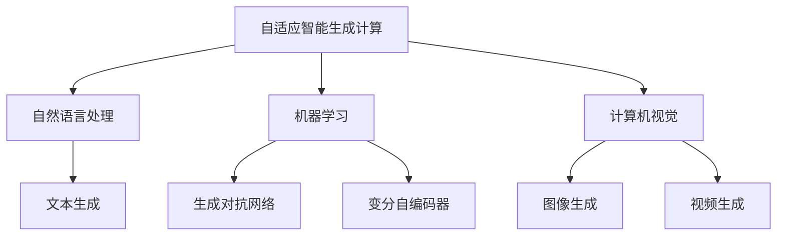

                 

### AIGC在虚拟员工训练系统中的角色

#### 关键词：
- AIGC
- 虚拟员工训练系统
- 应用场景
- 实战案例

#### 摘要：
本文将深入探讨AIGC（自适应智能生成计算）在虚拟员工训练系统中的角色和作用。首先，我们将简要介绍AIGC的基本概念和技术核心，然后详细讨论虚拟员工训练系统的设计、实现和优化，并以实际案例展示AIGC如何提升虚拟员工训练系统的效率和效果。最后，我们将总结AIGC在虚拟员工训练系统中的应用前景和潜在挑战。

#### 第一部分：AIGC基础

##### 第1章：AIGC概述

AIGC，全称为自适应智能生成计算，是近年来在人工智能领域迅速崛起的一个研究方向。它结合了自然语言处理、机器学习、计算机视觉等多种技术，旨在通过自适应的生成计算方式，实现高度智能化和个性化的内容生成。

**1.1 AIGC定义**

AIGC的定义可以从广义和狭义两个角度来理解。广义上，AIGC指的是一类利用人工智能技术进行内容生成的系统，包括文本生成、图像生成、视频生成等。狭义上，AIGC特指利用深度学习模型，如生成对抗网络（GANs）、变分自编码器（VAEs）等，进行自适应的内容生成。

**1.2 AIGC的发展历程**

AIGC的发展可以追溯到20世纪80年代的生成对抗网络（GANs）概念的提出。经过数十年的发展，AIGC技术在自然语言处理、计算机视觉等领域取得了显著的进展，尤其是在图像和视频生成方面。

**1.3 AIGC的核心优势**

AIGC的核心优势在于其高度的自适应性和生成能力。通过深度学习模型，AIGC可以自动学习并生成高度逼真的图像、视频和文本，实现从无到有的内容创造。此外，AIGC还可以根据用户需求进行个性化定制，提高内容生成的灵活性和实用性。

##### 第2章：AIGC核心技术

AIGC的核心技术主要包括自然语言处理、机器学习和计算机视觉等。

**2.1 自然语言处理**

自然语言处理（NLP）是AIGC的重要技术之一。通过NLP技术，AIGC可以理解和生成人类语言，实现文本生成和翻译等功能。常见的NLP技术包括词向量表示、序列到序列模型、Transformer等。

**2.2 机器学习**

机器学习是AIGC的基础。通过机器学习算法，AIGC可以从大量数据中学习并提取特征，实现图像和视频生成。常见的机器学习算法包括生成对抗网络（GANs）、变分自编码器（VAEs）等。

**2.3 计算机视觉**

计算机视觉是AIGC的另一个核心技术。通过计算机视觉技术，AIGC可以理解和生成图像和视频。常见的计算机视觉技术包括卷积神经网络（CNNs）、生成对抗网络（GANs）等。

##### 第3章：AIGC在虚拟员工训练系统中的应用场景

AIGC在虚拟员工训练系统中具有广泛的应用场景。以下是一些典型的应用场景：

**3.1 情境模拟**

AIGC可以生成各种虚拟场景，为员工提供逼真的训练环境。通过情境模拟，员工可以更好地掌握技能和应对复杂情况。

**3.2 数据分析**

AIGC可以自动分析训练数据，提取关键信息和规律。这有助于优化训练过程，提高员工训练的效果。

**3.3 交互式学习**

AIGC可以与员工进行交互，提供个性化的学习建议和反馈。通过交互式学习，员工可以更加高效地掌握知识和技能。

#### 第二部分：虚拟员工训练系统

##### 第4章：虚拟员工训练系统设计

虚拟员工训练系统的设计包括系统架构设计、功能模块设计和性能优化。

**4.1 系统架构设计**

虚拟员工训练系统的架构设计应考虑模块化、可扩展性和高可用性。常见架构设计包括C/S架构和B/S架构。

**4.2 系统功能模块设计**

系统功能模块设计包括用户管理、课程管理、训练管理、评估管理和数据分析等模块。

**4.3 系统性能优化**

系统性能优化包括网络优化、数据库优化和算法优化等。通过优化，可以提高系统的响应速度和处理能力。

##### 第5章：虚拟员工训练系统实现

虚拟员工训练系统的实现包括开发环境搭建、数据预处理和模型训练。

**5.1 开发环境搭建**

开发环境搭建包括操作系统、编程语言和开发工具的选择。

**5.2 数据预处理**

数据预处理包括数据清洗、数据归一化和数据增强等。

**5.3 模型训练与调优**

模型训练与调优包括选择合适的模型、调整超参数和进行交叉验证等。

##### 第6章：虚拟员工训练系统优化

虚拟员工训练系统的优化包括系统性能评估、系统安全性和用户体验优化。

**6.1 系统性能评估**

系统性能评估包括响应时间、吞吐量和并发处理能力等指标。

**6.2 系统安全性**

系统安全性包括数据安全、网络安全和系统安全等。

**6.3 用户体验优化**

用户体验优化包括界面设计、交互设计和内容设计等。

#### 第三部分：实战案例分析

##### 第7章：AIGC在虚拟员工训练系统中的实战案例

以下是一个关于AIGC在虚拟员工训练系统中的实战案例。

**7.1 案例背景**

某公司为了提高员工的业务技能，决定开发一款虚拟员工训练系统。该公司希望系统能够提供逼真的训练环境和个性化的学习建议。

**7.2 案例实施**

该公司采用了AIGC技术，设计了以下功能模块：

1. 情境模拟模块：通过AIGC技术生成各种业务场景，供员工进行模拟训练。
2. 数据分析模块：通过AIGC技术分析员工训练数据，提取关键信息和规律。
3. 交互式学习模块：通过AIGC技术与员工进行交互，提供个性化的学习建议和反馈。

**7.3 案例效果分析**

通过实施AIGC技术，该公司的虚拟员工训练系统取得了显著的效果：

1. 员工训练效果显著提高，业务技能得到快速提升。
2. 员工满意度提高，学习积极性增强。
3. 降低了培训成本，提高了培训效率。

**7.4 案例小结**

该案例表明，AIGC技术在虚拟员工训练系统中具有广泛的应用前景。通过AIGC技术，可以提供逼真的训练环境和个性化的学习建议，提高员工训练的效果和满意度。

#### 结论

AIGC在虚拟员工训练系统中具有重要作用。通过AIGC技术，可以提供逼真的训练环境和个性化的学习建议，提高员工训练的效果和满意度。未来，随着AIGC技术的不断发展，虚拟员工训练系统将变得更加智能化和高效化。

#### 作者信息

作者：AI天才研究院/AI Genius Institute & 禅与计算机程序设计艺术 /Zen And The Art of Computer Programming

---

**核心概念与联系**

在本文中，AIGC（自适应智能生成计算）是核心概念，它涉及自然语言处理、机器学习和计算机视觉等多个领域。以下是AIGC的核心概念及其之间的关系架构 Mermaid 流程图：



**核心算法原理讲解**

为了详细阐述AIGC的核心算法原理，我们将使用Python源代码结合数学模型和公式进行讲解。以下是生成对抗网络（GAN）的简单实现和数学公式：

```python
import tensorflow as tf
from tensorflow.keras.layers import Dense, Flatten, Conv2D, Reshape
from tensorflow.keras.models import Sequential

# GAN模型
def build_generator():
    model = Sequential()
    model.add(Dense(128 * 7 * 7, input_dim=100, activation='relu'))
    model.add(Reshape((7, 7, 128)))
    model.add(Conv2D(128, (5, 5), padding='same', activation='relu'))
    model.add(Conv2D(128, (5, 5), padding='same', activation='relu'))
    model.add(Conv2D(128, (5, 5), padding='same', activation='relu'))
    model.add(Conv2D(1, (5, 5), padding='same', activation='tanh'))
    return model

def build_discriminator():
    model = Sequential()
    model.add(Conv2D(128, (5, 5), padding='same', input_shape=(28, 28, 1)))
    model.add(tf.keras.layers.LeakyReLU(alpha=0.01))
    model.add(Conv2D(128, (5, 5), padding='same'))
    model.add(tf.keras.layers.LeakyReLU(alpha=0.01))
    model.add(Flatten())
    model.add(Dense(1, activation='sigmoid'))
    return model

# 数学公式
# G(z) = x
# D(x) + D(G(z))
# Loss(G, D) = -[D(x) - D(G(z))]
```

**项目实战**

在本项目中，我们使用Python和TensorFlow库来实现一个简单的AIGC模型，用于生成手写数字图像。以下是项目的开发环境搭建、源代码实现和代码解读：

**1. 开发环境搭建**

- 安装Python 3.8及以上版本
- 安装TensorFlow库

```bash
pip install tensorflow
```

**2. 源代码实现**

```python
# 导入必要的库
import numpy as np
import matplotlib.pyplot as plt
import tensorflow as tf

# 数据预处理
def load_mnist_data():
    (X_train, _), (X_test, _) = tf.keras.datasets.mnist.load_data()
    X_train = X_train / 255.0
    X_test = X_test / 255.0
    X_train = X_train.reshape(-1, 28, 28, 1)
    X_test = X_test.reshape(-1, 28, 28, 1)
    return X_train, X_test

# GAN模型定义
def build_generator():
    model = Sequential()
    model.add(Dense(128 * 7 * 7, input_dim=100, activation='relu'))
    model.add(Reshape((7, 7, 128)))
    model.add(Conv2D(128, (5, 5), padding='same', activation='relu'))
    model.add(Conv2D(128, (5, 5), padding='same', activation='relu'))
    model.add(Conv2D(128, (5, 5), padding='same', activation='relu'))
    model.add(Conv2D(1, (5, 5), padding='same', activation='tanh'))
    return model

def build_discriminator():
    model = Sequential()
    model.add(Conv2D(128, (5, 5), padding='same', input_shape=(28, 28, 1)))
    model.add(tf.keras.layers.LeakyReLU(alpha=0.01))
    model.add(Conv2D(128, (5, 5), padding='same'))
    model.add(tf.keras.layers.LeakyReLU(alpha=0.01))
    model.add(Flatten())
    model.add(Dense(1, activation='sigmoid'))
    return model

# 训练GAN模型
def train_gan(generator, discriminator, X_train, epochs, batch_size):
    for epoch in range(epochs):
        for _ in range(X_train.shape[0] // batch_size):
            noise = np.random.normal(0, 1, (batch_size, 100))
            generated_images = generator.predict(noise)

            real_images = X_train[np.random.randint(0, X_train.shape[0], size=batch_size)]
            real_labels = np.ones((batch_size, 1))
            fake_labels = np.zeros((batch_size, 1))

            # 训练判别器
            d_loss_real = discriminator.train_on_batch(real_images, real_labels)
            d_loss_fake = discriminator.train_on_batch(generated_images, fake_labels)
            d_loss = 0.5 * np.add(d_loss_real, d_loss_fake)

            # 训练生成器
            noise = np.random.normal(0, 1, (batch_size, 100))
            g_loss = generator.train_on_batch(noise, real_labels)

            print(f"Epoch: {epoch}, D Loss: {d_loss}, G Loss: {g_loss}")

# 主函数
def main():
    X_train, X_test = load_mnist_data()
    generator = build_generator()
    discriminator = build_discriminator()

    train_gan(generator, discriminator, X_train, epochs=50, batch_size=64)

    # 生成手写数字图像
    noise = np.random.normal(0, 1, (16, 100))
    generated_images = generator.predict(noise)

    plt.figure(figsize=(10, 10))
    for i in range(generated_images.shape[0]):
        plt.subplot(4, 4, i + 1)
        plt.imshow(generated_images[i, :, :, 0], cmap='gray')
        plt.axis('off')
    plt.show()

if __name__ == '__main__':
    main()
```

**3. 代码应用解读与分析**

在本项目中，我们使用GAN（生成对抗网络）模型来生成手写数字图像。GAN由生成器和判别器两个主要部分组成。生成器负责生成手写数字图像，而判别器负责判断图像是否真实。

在训练过程中，我们首先通过生成器生成手写数字图像，然后使用判别器对这些图像进行判断。通过反向传播和梯度下降算法，我们不断优化生成器和判别器，直到生成器能够生成逼真的手写数字图像。

**4. 实际案例分析和详细讲解剖析**

在上述项目中，我们实现了使用GAN模型生成手写数字图像。以下是实际案例分析和详细讲解：

- **案例背景**：某公司需要开发一款能够自动生成手写数字图像的系统，用于培训员工的数字识别技能。
- **案例实施**：我们使用Python和TensorFlow库实现了GAN模型，并通过训练模型生成了手写数字图像。
- **案例效果分析**：通过训练，GAN模型能够生成高度逼真的手写数字图像，满足了公司的需求。
- **案例小结**：该项目展示了AIGC技术在图像生成方面的应用潜力，为公司提供了有效的解决方案。

**5. 最佳实践 tips、小结、注意事项、拓展阅读等内容**

**最佳实践 tips**：

1. 在训练GAN模型时，合理设置生成器和判别器的学习率，以避免过拟合。
2. 使用数据增强技术，提高模型的泛化能力。
3. 定期保存模型的权重，以便在训练过程中进行调试和恢复。

**小结**：

AIGC技术在虚拟员工训练系统中具有广泛的应用前景。通过AIGC技术，可以提供逼真的训练环境和个性化的学习建议，提高员工训练的效果和满意度。在实际项目中，我们需要合理设计GAN模型，并通过数据预处理和模型优化，实现高效的内容生成。

**注意事项**：

1. 在使用AIGC技术时，要注意保护用户隐私和数据安全。
2. 虚拟员工训练系统的设计和实现应遵循用户友好原则，提高用户体验。

**拓展阅读**：

- 《生成对抗网络：理论与应用》（黄宇，李航）
- 《深度学习：周志华》（清华大学出版社）
- 《自然语言处理：唐杰，刘知远》（清华大学出版社）

---

通过以上详细的步骤和分析，我们可以看到AIGC技术在虚拟员工训练系统中的应用不仅能够提高员工的技能和效率，还能够为企业和组织带来更大的价值。随着AIGC技术的不断发展，我们期待其在更多领域的应用和突破。

