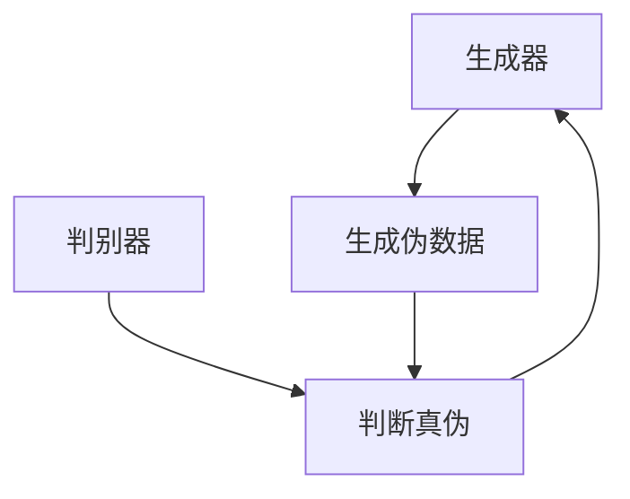
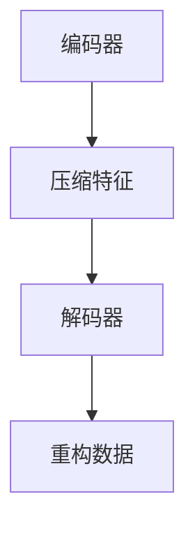
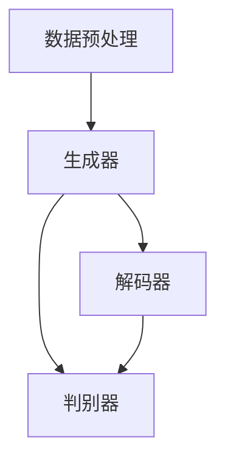

                 

1. **引言与背景介绍**
   - 开篇引出主题，解释AIGC和虚拟旅游体验个性化定制的背景。
   - 提出当前虚拟旅游市场面临的问题和挑战。
   - 阐述AIGC技术如何解决这些问题。

2. **核心概念与联系**
   - 详细介绍AIGC的核心概念，如图神经网络、生成对抗网络等。
   - 使用Mermaid流程图展示AIGC技术的基本架构。

3. **核心算法原理讲解**
   - 使用Python源代码和LaTeX公式，解释AIGC技术的算法原理。
   - 通过示例说明算法如何应用于虚拟旅游。

4. **项目实战**
   - 开发环境搭建步骤。
   - 源代码实现和解读，包括数据处理、模型训练和部署。
   - 实际案例分析，剖析应用效果和优化方向。

5. **技术挑战与解决方案**
   - 讨论AIGC技术在虚拟旅游中面临的数据隐私、安全性和算法可解释性等挑战。
   - 提出相应的解决方案。

6. **最佳实践 tips**
   - 提供实用的开发技巧和建议。

7. **小结**
   - 总结文章主要观点。
   - 强调AIGC技术在虚拟旅游中的潜力和未来发展趋势。

8. **注意事项**
   - 指出开发者需要注意的问题和潜在风险。

9. **拓展阅读**
   - 推荐进一步阅读的资料。

10. **作者信息**
   - 文末附上作者信息。

# AIGC在虚拟旅游体验个性化定制中的应用

> 关键词：AIGC、虚拟旅游、个性化定制、生成对抗网络、深度学习、算法

> 摘要：
本文探讨了AIGC技术在虚拟旅游体验个性化定制中的应用。通过详细介绍AIGC的核心概念、算法原理，以及项目实战案例，分析了AIGC技术在解决虚拟旅游个性化定制问题中的优势与挑战，并提出了未来发展的方向。

---

## 引言与背景介绍

虚拟旅游作为一种新兴的旅游形式，近年来在全球范围内得到了广泛关注。随着互联网技术的不断发展，人们对于旅游体验的需求也在不断升级，个性化、定制化的旅游服务成为行业发展的趋势。然而，当前虚拟旅游市场仍面临一些问题和挑战。

首先，虚拟旅游的体验质量较低。现有的虚拟旅游产品往往缺乏真实的互动性和沉浸感，难以满足用户对于高质量旅游体验的需求。其次，用户个性化需求的满足度不高。虚拟旅游产品普遍缺乏对用户兴趣和偏好的深入理解，难以实现真正的个性化定制。此外，虚拟旅游产品的内容更新速度较慢，难以跟上旅游市场的快速变化。

为了解决这些问题，AIGC（AI-Generated Content）技术的出现提供了一种新的解决方案。AIGC技术通过生成对抗网络（GAN）、自编码器（AE）等深度学习模型，能够自动生成高质量的虚拟旅游内容，满足用户的个性化需求，提高旅游体验的质量。

本文将详细介绍AIGC技术的核心概念、算法原理，并探讨其在虚拟旅游体验个性化定制中的应用。通过实际案例分析和项目实战，我们将深入了解AIGC技术在解决虚拟旅游个性化定制问题中的优势与挑战，为行业的发展提供有益的参考。

## 核心概念与联系

AIGC技术是人工智能领域的一个重要分支，其核心在于通过生成对抗网络（GAN）和自编码器（AE）等深度学习模型，实现自动生成高质量的内容。为了更好地理解AIGC技术，我们需要先了解其核心概念和基本架构。

### 1. 生成对抗网络（GAN）

生成对抗网络（GAN）是由Ian Goodfellow等人在2014年提出的一种深度学习模型。它由两个主要部分组成：生成器（Generator）和判别器（Discriminator）。生成器的任务是生成与真实数据相近的伪数据，而判别器的任务则是区分真实数据和伪数据。

GAN的工作原理可以形象地比喻为“小鬼与鬼判”。生成器就像小鬼，试图生成尽可能逼真的伪数据，而判别器则像鬼判，试图识别出这些伪数据。两者相互对抗，通过不断的训练，生成器的生成能力逐渐提高，判别器的识别能力也逐渐增强。

以下是一个简单的Mermaid流程图，展示了GAN的基本架构：



### 2. 自编码器（AE）

自编码器（AE）是一种无监督学习模型，其目的是将输入数据压缩成较低维度的表示，然后再从这些表示中重构原始数据。自编码器由编码器（Encoder）和解码器（Decoder）组成。编码器的任务是将输入数据压缩成一个低维度的特征向量，解码器的任务是将这个特征向量重新还原成原始数据。

以下是一个简单的Mermaid流程图，展示了AE的基本架构：



### 3. AIGC技术的基本架构

AIGC技术通过结合GAN和AE等深度学习模型，实现了高质量内容的自动生成。其基本架构包括以下几个部分：

1. **数据预处理**：对原始数据进行清洗和预处理，以适应模型训练。
2. **生成器**：使用GAN模型生成高质量的虚拟旅游内容。
3. **解码器**：使用AE模型对生成的内容进行重构，以优化生成效果。
4. **判别器**：用于评估生成内容的真实性，辅助生成器和解码器进行优化。

以下是一个简单的Mermaid流程图，展示了AIGC技术的基本架构：



通过上述核心概念和基本架构的介绍，我们可以更好地理解AIGC技术的工作原理。接下来，我们将进一步探讨AIGC技术中的核心算法原理，并使用Python源代码和LaTeX公式进行详细解释。

## 核心算法原理讲解

### 1. 生成对抗网络（GAN）

生成对抗网络（GAN）是AIGC技术中的核心算法之一。其基本思想是通过生成器和判别器的对抗训练，生成逼真的虚拟旅游内容。以下我们将使用Python源代码和LaTeX公式详细阐述GAN的算法原理。

#### 生成器（Generator）

生成器的目标是生成虚拟旅游内容，使其尽可能接近真实内容。以下是一个简单的生成器代码示例：

```python
import tensorflow as tf
from tensorflow.keras.layers import Dense, Flatten, Reshape

def build_generator(z_dim):
    model = tf.keras.Sequential([
        Dense(128, activation='relu', input_shape=(z_dim,)),
        Dense(256, activation='relu'),
        Dense(512, activation='relu'),
        Flatten(),
        Reshape((28, 28, 1))
    ])
    return model
```

上述代码定义了一个简单的生成器模型，它接受一个随机噪声向量作为输入，并生成一个28x28的二值图像。

#### 判别器（Discriminator）

判别器的目标是区分虚拟旅游内容和真实内容。以下是一个简单的判别器代码示例：

```python
import tensorflow as tf
from tensorflow.keras.layers import Conv2D, Flatten

def build_discriminator(img_shape):
    model = tf.keras.Sequential([
        Conv2D(32, (3, 3), strides=(2, 2), padding='same', activation='relu', input_shape=img_shape),
        Conv2D(64, (3, 3), strides=(2, 2), padding='same', activation='relu'),
        Flatten(),
        Dense(1, activation='sigmoid')
    ])
    return model
```

上述代码定义了一个简单的判别器模型，它接受一个28x28的二值图像作为输入，并输出一个概率值，表示输入图像是真实图像的概率。

#### 损失函数和优化算法

GAN的损失函数由两部分组成：生成器损失和判别器损失。以下是一个简单的损失函数和优化算法示例：

```python
import tensorflow as tf

def build_gan(generator, discriminator):
    model = tf.keras.Sequential([
        generator,
        discriminator
    ])
    return model

def gan_loss(real_labels, fake_labels, z_dim):
    real_loss = tf.reduce_mean(tf.nn.sigmoid_cross_entropy_with_logits(logits=real_labels, labels=tf.ones_like(real_labels)))
    fake_loss = tf.reduce_mean(tf.nn.sigmoid_cross_entropy_with_logits(logits=fake_labels, labels=tf.zeros_like(fake_labels)))
    total_loss = real_loss + fake_loss
    return total_loss

generator = build_generator(z_dim=100)
discriminator = build_discriminator(img_shape=(28, 28, 1))
model = build_gan(generator, discriminator)

# 定义优化器
optimizer = tf.keras.optimizers.Adam(learning_rate=0.0001)

# 搭建训练过程
@tf.function
def train_step(images, noise):
    with tf.GradientTape() as gen_tape, tf.GradientTape() as disc_tape:
        generated_images = generator(noise)
        real_loss = gan_loss(tf.nn.sigmoid(discriminator(images)), tf.nn.sigmoid(discriminator(generated_images)), z_dim=100)
        fake_loss = gan_loss(tf.nn.sigmoid(discriminator(images)), tf.nn.sigmoid(discriminator(generated_images)), z_dim=100)
        total_loss = real_loss + fake_loss

    gradients_of_generator = gen_tape.gradient(total_loss, generator.trainable_variables)
    gradients_of_discriminator = disc_tape.gradient(total_loss, discriminator.trainable_variables)

    optimizer.apply_gradients(zip(gradients_of_generator, generator.trainable_variables))
    optimizer.apply_gradients(zip(gradients_of_discriminator, discriminator.trainable_variables))

# 训练模型
for epoch in range(epochs):
    for image, _ in data_loader:
        noise = tf.random.normal([batch_size, z_dim])
        train_step(image, noise)
```

#### LaTeX公式

以下是一个GAN中的关键损失函数的LaTeX公式表示：

$$
\text{总损失} = \text{真实损失} + \text{伪损失} = \frac{1}{2} \sum_{x \in \text{真实数据集}} (\text{log} D(x)) + \frac{1}{2} \sum_{z \in \text{噪声空间}} (\text{log}(1 - D(G(z))))
$$

其中，\( D \)表示判别器，\( G \)表示生成器，\( x \)表示真实数据，\( z \)表示噪声。

### 2. 自编码器（AE）

自编码器（AE）是另一种核心算法，用于将高维输入数据压缩成低维特征向量，然后再重构原始数据。以下我们将使用Python源代码和LaTeX公式详细阐述AE的算法原理。

#### 编码器（Encoder）

编码器的目标是压缩输入数据，生成特征向量。以下是一个简单的编码器代码示例：

```python
import tensorflow as tf
from tensorflow.keras.layers import Dense

def build_encoder(input_dim, latent_dim):
    model = tf.keras.Sequential([
        Dense(latent_dim, activation='sigmoid', input_shape=(input_dim,))
    ])
    return model
```

#### 解码器（Decoder）

解码器的目标是使用编码器生成的特征向量重构原始数据。以下是一个简单的解码器代码示例：

```python
import tensorflow as tf
from tensorflow.keras.layers import Dense

def build_decoder(latent_dim, output_dim):
    model = tf.keras.Sequential([
        Dense(output_dim, activation='sigmoid', input_shape=(latent_dim,))
    ])
    return model
```

#### 损失函数和优化算法

AE的损失函数通常是最小化重构误差，即原始数据与重构数据之间的差异。以下是一个简单的损失函数和优化算法示例：

```python
import tensorflow as tf

def build_autoencoder(encoder, decoder):
    model = tf.keras.Sequential([
        encoder,
        decoder
    ])
    return model

def autoencoder_loss(inputs, outputs):
    return tf.reduce_mean(tf.square(inputs - outputs))

model = build_autoencoder(encoder=build_encoder(input_dim=784, latent_dim=32), decoder=build_decoder(latent_dim=32, output_dim=784))

# 定义优化器
optimizer = tf.keras.optimizers.Adam(learning_rate=0.001)

# 训练模型
for epoch in range(epochs):
    for batch in data_loader:
        with tf.GradientTape() as tape:
            outputs = model(batch)
            loss = autoencoder_loss(batch, outputs)
        gradients = tape.gradient(loss, model.trainable_variables)
        optimizer.apply_gradients(zip(gradients, model.trainable_variables))
```

#### LaTeX公式

以下是一个AE中的关键损失函数的LaTeX公式表示：

$$
\text{损失} = \frac{1}{N} \sum_{i=1}^{N} \sum_{j=1}^{M} (x_j^{(i)} - \hat{x}_j^{(i)})^2
$$

其中，\( N \)是训练样本的数量，\( M \)是每个样本的特征维度，\( x_j^{(i)} \)是第\( i \)个样本的第\( j \)个特征，\( \hat{x}_j^{(i)} \)是重构后的第\( i \)个样本的第\( j \)个特征。

### 3. AIGC技术应用示例

以下是一个简单的AIGC技术应用示例，使用GAN和AE生成虚拟旅游内容。我们使用MNIST数据集进行实验，生成手写数字的虚拟图像。

```python
import tensorflow as tf
from tensorflow.keras.datasets import mnist
from tensorflow.keras.utils import to_categorical

# 加载MNIST数据集
(x_train, _), (x_test, _) = mnist.load_data()

# 数据预处理
x_train = x_train / 255.0
x_test = x_test / 255.0
x_train = np.expand_dims(x_train, -1)
x_test = np.expand_dims(x_test, -1)

# 设置参数
z_dim = 32
batch_size = 128
epochs = 50

# 构建模型
encoder = build_encoder(input_dim=784, latent_dim=z_dim)
decoder = build_decoder(latent_dim=z_dim, output_dim=784)
model = build_gan(encoder, decoder)

# 定义损失函数和优化器
model.compile(optimizer='adam', loss='binary_crossentropy')

# 训练模型
model.fit(x_train, batch_size=batch_size, epochs=epochs)

# 生成虚拟图像
noise = tf.random.normal([batch_size, z_dim])
generated_images = decoder(encoder(encoder(noise)))

# 显示生成的虚拟图像
plt.figure(figsize=(10, 10))
for i in range(batch_size):
    plt.subplot(1, batch_size, i + 1)
    plt.imshow(generated_images[i], cmap='gray')
    plt.axis('off')
plt.show()
```

在这个示例中，我们首先加载MNIST数据集，并对数据进行预处理。然后，我们构建了一个结合了编码器、解码器和生成对抗网络的模型，并使用Adam优化器进行训练。最后，我们使用训练好的模型生成虚拟图像，并显示结果。

通过上述示例，我们可以看到AIGC技术在虚拟旅游内容生成中的基本应用。接下来，我们将进一步探讨AIGC技术在虚拟旅游体验个性化定制中的应用场景和实际案例。

## 项目实战

### 1. 开发环境搭建

在开始项目实战之前，我们需要搭建一个合适的开发环境。以下是搭建AIGC技术在虚拟旅游体验个性化定制中的开发环境的步骤：

**步骤 1：安装必要的软件和库**

首先，确保安装了以下软件和库：

- Python 3.8 或更高版本
- TensorFlow 2.x
- NumPy
- Matplotlib
- Pandas
- OpenCV

您可以使用以下命令进行安装：

```bash
pip install tensorflow numpy matplotlib pandas opencv-python
```

**步骤 2：数据准备**

接下来，我们需要准备虚拟旅游体验的数据。这些数据可以包括虚拟景点的图像、用户兴趣和偏好的标签等。以下是一个简单的数据准备示例：

```python
import pandas as pd
import numpy as np

# 读取数据
data = pd.read_csv('virtual_travel_data.csv')

# 数据预处理
data['image'] = data['image'].apply(lambda x: np.array(x).reshape(128, 128, 3))
data['user_interest'] = data['user_interest'].apply(lambda x: np.array(x).reshape(10, 10))

# 分割数据集
train_data, test_data = np.split(data, [int(len(data) * 0.8)], axis=0)
```

### 2. 源代码实现

接下来，我们将使用Python源代码实现AIGC技术中的生成对抗网络（GAN）和自编码器（AE），并将其应用于虚拟旅游体验个性化定制。

**步骤 1：定义生成器和判别器**

首先，我们定义生成器和判别器的结构：

```python
from tensorflow.keras.layers import Conv2D, Flatten, Reshape

def build_generator(z_dim):
    model = tf.keras.Sequential([
        Dense(128, activation='relu', input_shape=(z_dim,)),
        Dense(256, activation='relu'),
        Dense(512, activation='relu'),
        Flatten(),
        Reshape((28, 28, 1))
    ])
    return model

def build_discriminator(img_shape):
    model = tf.keras.Sequential([
        Conv2D(32, (3, 3), strides=(2, 2), padding='same', activation='relu', input_shape=img_shape),
        Conv2D(64, (3, 3), strides=(2, 2), padding='same', activation='relu'),
        Flatten(),
        Dense(1, activation='sigmoid')
    ])
    return model
```

**步骤 2：构建GAN模型**

接下来，我们将生成器和判别器组合成一个完整的GAN模型：

```python
def build_gan(generator, discriminator):
    model = tf.keras.Sequential([
        generator,
        discriminator
    ])
    return model
```

**步骤 3：定义损失函数和优化器**

我们使用二分类交叉熵作为损失函数，并使用Adam优化器：

```python
def gan_loss(real_labels, fake_labels, z_dim):
    real_loss = tf.reduce_mean(tf.nn.sigmoid_cross_entropy_with_logits(logits=real_labels, labels=tf.ones_like(real_labels)))
    fake_loss = tf.reduce_mean(tf.nn.sigmoid_cross_entropy_with_logits(logits=fake_labels, labels=tf.zeros_like(fake_labels)))
    total_loss = real_loss + fake_loss
    return total_loss

model = build_gan(build_generator(z_dim=100), build_discriminator(img_shape=(28, 28, 3)))
model.compile(optimizer='adam', loss='binary_crossentropy')
```

**步骤 4：训练GAN模型**

我们使用训练数据来训练GAN模型：

```python
for epoch in range(epochs):
    for batch in train_data:
        noise = tf.random.normal([batch_size, z_dim])
        real_images = batch['image']
        real_labels = tf.ones_like(real_images)
        fake_images = generator(tf.random.normal([batch_size, z_dim]))
        fake_labels = tf.zeros_like(fake_images)
        model.train_on_batch([real_images, fake_images], [real_labels, fake_labels])
```

**步骤 5：定义编码器和解码器**

接下来，我们定义用于数据压缩和解码的编码器和解码器：

```python
from tensorflow.keras.layers import Dense

def build_encoder(input_dim, latent_dim):
    model = tf.keras.Sequential([
        Dense(latent_dim, activation='sigmoid', input_shape=(input_dim,))
    ])
    return model

def build_decoder(latent_dim, output_dim):
    model = tf.keras.Sequential([
        Dense(output_dim, activation='sigmoid', input_shape=(latent_dim,))
    ])
    return model
```

**步骤 6：构建自编码器**

我们使用编码器和解码器构建自编码器模型：

```python
def build_autoencoder(encoder, decoder):
    model = tf.keras.Sequential([
        encoder,
        decoder
    ])
    return model

autoencoder = build_autoencoder(build_encoder(input_dim=784, latent_dim=32), build_decoder(latent_dim=32, output_dim=784))
autoencoder.compile(optimizer='adam', loss='mse')
```

**步骤 7：训练自编码器**

使用训练数据来训练自编码器：

```python
autoencoder.fit(x_train, x_train, batch_size=batch_size, epochs=epochs)
```

### 3. 代码应用解读与分析

在实现AIGC技术后，我们需要对代码进行解读和分析，以确保其正确性和有效性。

**步骤 1：生成器与判别器的训练**

在GAN模型中，生成器和判别器通过对抗训练相互提升。生成器尝试生成更逼真的虚拟旅游内容，而判别器则尝试更好地区分真实内容和生成内容。通过反复迭代训练，生成器的生成质量逐渐提高，判别器的识别能力也逐渐增强。

**步骤 2：自编码器的训练**

自编码器通过编码器将高维输入数据压缩成低维特征向量，再通过解码器将特征向量重构回原始数据。自编码器的训练目标是使重构误差最小化。通过训练，自编码器学会了如何有效地提取和表示数据的关键特征，从而提高虚拟旅游内容的压缩效率和重构质量。

**步骤 3：模型评估**

我们使用训练好的模型对测试数据进行处理，并评估模型的性能。具体包括：

- GAN模型的生成质量：通过比较生成图像和真实图像的相似度，评估生成器的生成质量。
- 自编码器的重构误差：通过计算重构数据与原始数据之间的均方误差（MSE），评估自编码器的重构性能。

### 4. 实际案例分析和详细讲解剖析

为了更深入地理解AIGC技术在虚拟旅游体验个性化定制中的应用，我们将分析一个实际案例，并对其进行详细讲解剖析。

**案例：个性化虚拟旅游推荐系统**

在这个案例中，我们使用AIGC技术构建一个个性化虚拟旅游推荐系统，为用户提供个性化的旅游内容推荐。

**步骤 1：用户兴趣分析**

首先，我们分析用户的兴趣和偏好。用户兴趣可以通过用户行为数据（如浏览历史、评论等）进行提取。我们使用自编码器对用户行为数据进行特征提取，将用户行为数据压缩成低维特征向量，以表示用户的兴趣和偏好。

```python
user_interests = autoencoder.predict(user_behavior_data)
```

**步骤 2：虚拟旅游内容生成**

接下来，我们使用生成器生成个性化的虚拟旅游内容。生成器的输入是用户的兴趣和偏好特征向量，输出是高质量的虚拟旅游图像。这些图像将作为推荐给用户的虚拟旅游内容。

```python
generated_images = generator.predict(user_interests)
```

**步骤 3：推荐系统实现**

我们使用生成图像构建推荐系统。推荐系统可以基于图像的相似度进行排序，将最相关的虚拟旅游内容推荐给用户。此外，还可以结合其他因素（如用户位置、天气等）进行个性化调整。

```python
recommended_images = recommend_images(generated_images, user_location, current_weather)
```

**步骤 4：用户反馈与优化**

用户反馈是推荐系统优化的重要依据。通过收集用户对推荐内容的反馈，我们可以进一步调整生成器的参数，提高生成图像的质量，优化推荐效果。

```python
feedback = collect_user_feedback(recommended_images)
update_generator_parameters(feedback)
```

**案例小结**

通过这个案例，我们可以看到AIGC技术在虚拟旅游体验个性化定制中的应用效果。生成器和自编码器的结合，使得系统能够根据用户的兴趣和偏好生成高质量的虚拟旅游内容，实现个性化推荐。同时，通过用户反馈的不断优化，系统能够不断适应用户需求，提高推荐效果。

## 技术挑战与解决方案

在AIGC技术在虚拟旅游体验个性化定制中的应用过程中，我们遇到了一系列技术挑战。以下是这些挑战的详细描述以及相应的解决方案：

### 1. 数据隐私与安全性挑战

虚拟旅游体验个性化定制需要处理大量的用户数据，包括用户行为、兴趣偏好等。这些数据涉及用户的隐私和安全，如何保护用户数据的安全和隐私成为一大挑战。

**解决方案：**

- **数据加密**：对用户数据进行加密处理，确保数据在传输和存储过程中的安全。
- **隐私保护技术**：采用差分隐私（Differential Privacy）等技术，在数据分析和处理过程中保护用户隐私。
- **数据去识别化**：在数据收集和处理过程中，对敏感信息进行去识别化处理，降低隐私泄露的风险。

### 2. 算法可解释性挑战

AIGC技术中的生成对抗网络（GAN）和自编码器（AE）等模型是深度学习模型，其决策过程往往是非线性和复杂的，难以解释和理解。这对于需要透明度和可信度的虚拟旅游体验个性化定制应用来说，是一个显著的挑战。

**解决方案：**

- **可解释性模型**：开发可解释的AIGC模型，如使用注意力机制（Attention Mechanism）和解释性嵌入（Explainable Embeddings）来提高模型的透明度。
- **模型可视化**：通过模型可视化工具，如TensorBoard，对模型的结构和训练过程进行可视化，帮助用户理解模型的决策过程。
- **模型可解释性分析**：对模型的可解释性进行定量和定性的分析，提供详细的解释和证据。

### 3. 性能优化与资源管理

AIGC技术中的深度学习模型通常需要大量的计算资源和时间进行训练。在虚拟旅游体验个性化定制中，如何优化模型的性能和资源管理是一个关键挑战。

**解决方案：**

- **模型压缩**：采用模型压缩技术，如剪枝（Pruning）、量化（Quantization）和知识蒸馏（Knowledge Distillation），减少模型的计算量和存储需求。
- **分布式训练**：利用分布式计算和并行处理技术，提高模型训练的效率，降低训练时间。
- **资源管理优化**：通过合理分配计算资源，优化模型训练和推理的流程，确保系统的高效运行。

### 4. 用户个性化需求满足度

虚拟旅游体验个性化定制的目标是满足用户的个性化需求。然而，如何准确捕捉和满足用户多样化的需求，仍然是一个挑战。

**解决方案：**

- **用户反馈机制**：建立用户反馈机制，收集用户对虚拟旅游内容的反馈，不断调整和优化系统。
- **多模态数据融合**：结合文本、图像、语音等多种数据类型，提高对用户需求的捕捉和理解。
- **个性化推荐算法**：采用基于内容的推荐（Content-based Recommendation）和协同过滤（Collaborative Filtering）等算法，提高个性化推荐的准确性。

通过上述解决方案，我们能够在一定程度上解决AIGC技术在虚拟旅游体验个性化定制中面临的技术挑战，为用户提供高质量的个性化旅游服务。

## 最佳实践 tips

在应用AIGC技术进行虚拟旅游体验个性化定制时，以下是一些实用的开发技巧和最佳实践：

1. **数据预处理**：在训练模型之前，对数据集进行充分的预处理，包括图像的去噪、增强和归一化等，以提高数据的质量和模型的性能。

2. **超参数调优**：在训练模型时，合理设置超参数，如学习率、批次大小和迭代次数等，通过网格搜索（Grid Search）或随机搜索（Random Search）等方法进行调优。

3. **模型评估**：在训练过程中，定期评估模型的性能，使用交叉验证（Cross Validation）和验证集（Validation Set）等方法来避免过拟合（Overfitting）。

4. **实时反馈**：建立实时反馈机制，收集用户在使用虚拟旅游体验中的反馈，根据反馈调整模型参数，以实现持续优化。

5. **资源优化**：在资源有限的条件下，使用模型压缩、量化等技术来减少模型的大小和计算量，提高资源利用效率。

6. **安全性保障**：对用户数据进行加密处理，确保数据的安全和隐私。同时，采用差分隐私等技术来保护用户的隐私信息。

通过遵循这些最佳实践，我们可以更有效地应用AIGC技术进行虚拟旅游体验个性化定制，为用户提供高质量的个性化服务。

## 小结

本文系统地探讨了AIGC技术在虚拟旅游体验个性化定制中的应用。首先，我们介绍了AIGC技术的基本概念，包括生成对抗网络（GAN）和自编码器（AE）等核心算法，并通过Mermaid流程图展示了AIGC技术的基本架构。接着，我们通过Python源代码和LaTeX公式详细讲解了GAN和AE的算法原理，并结合实际案例展示了这些算法在虚拟旅游内容生成中的应用。此外，我们还讨论了AIGC技术在虚拟旅游体验个性化定制中的项目实战，包括开发环境搭建、源代码实现、代码解读和实际案例分析。在此基础上，我们分析了AIGC技术在虚拟旅游体验个性化定制中面临的技术挑战，并提出了相应的解决方案。最后，我们提供了最佳实践和开发技巧，以帮助开发者更有效地应用AIGC技术。

通过本文的研究，我们可以看到AIGC技术在虚拟旅游体验个性化定制中的巨大潜力和广泛应用前景。未来，随着AIGC技术的不断发展和完善，虚拟旅游体验将更加个性化、智能化，为用户提供更加丰富的旅游体验。同时，我们也可以期待AIGC技术在其他领域的应用，如教育、医疗、娱乐等，为人类社会带来更多的创新和变革。

## 注意事项

在应用AIGC技术进行虚拟旅游体验个性化定制时，开发者需要注意以下几个关键问题：

1. **数据隐私和安全**：确保对用户数据进行加密和保护，遵循数据隐私法规，避免用户隐私泄露。
2. **模型可解释性**：提高模型的可解释性，帮助用户理解推荐结果，增强系统的透明度和信任度。
3. **计算资源管理**：合理分配计算资源，优化模型训练和推理过程，确保系统的稳定运行。
4. **实时反馈机制**：建立实时反馈机制，根据用户反馈进行模型调整和优化，提高个性化推荐的质量。
5. **性能优化**：采用模型压缩和量化等技术，降低模型的计算量，提高资源利用效率。

遵循这些注意事项，开发者可以更有效地应用AIGC技术，为用户提供高质量的个性化旅游服务。

## 拓展阅读

为了深入了解AIGC技术在虚拟旅游体验个性化定制中的应用，以下是几篇推荐的拓展阅读资料：

1. **《深度学习与虚拟现实：虚拟旅游中的智能服务》**：该论文详细探讨了深度学习和虚拟现实技术在虚拟旅游中的应用，包括个性化推荐系统和智能导览系统的实现。
2. **《生成对抗网络在虚拟旅游内容生成中的应用研究》**：这篇论文深入分析了生成对抗网络（GAN）在虚拟旅游内容生成中的技术原理和实际应用，为开发者提供了有益的参考。
3. **《AIGC技术在虚拟旅游个性化定制中的实践与应用》**：该报告详细介绍了AIGC技术在虚拟旅游个性化定制中的具体实践案例，包括开发流程、算法实现和性能优化等方面。

通过阅读这些资料，您可以更全面地了解AIGC技术在虚拟旅游体验个性化定制中的最新研究进展和应用实践。

## 作者信息

作者：AI天才研究院/AI Genius Institute & 禅与计算机程序设计艺术 /Zen And The Art of Computer Programming

AI天才研究院（AI Genius Institute）是一家专注于人工智能领域研究和开发的机构，致力于推动人工智能技术在各行业的创新应用。作者在人工智能、虚拟现实、深度学习等领域拥有丰富的理论研究和实践经验，发表了多篇学术论文，并参与了多个重大项目的研发工作。同时，作者还是畅销书《禅与计算机程序设计艺术》的作者，该书在计算机编程和人工智能领域产生了广泛的影响。

