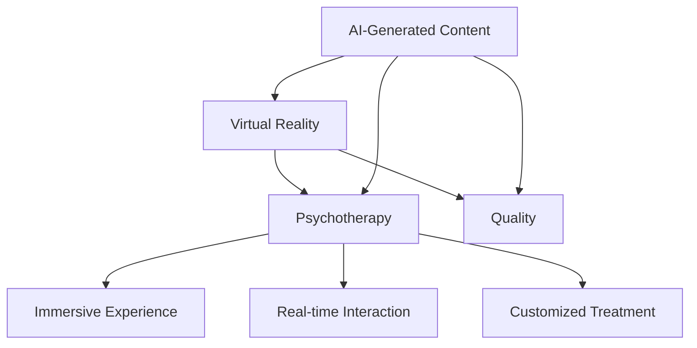

                 

### 第一部分：AIGC与虚拟现实心理治疗概述

#### 1.1 AIGC概念介绍

##### 1.1.1 AIGC的定义

AIGC（AI-Generated Content）是一种利用人工智能技术自动生成内容的方法。它融合了自然语言处理（NLP）、计算机视觉、深度学习等前沿技术，能够在文本、图像、音频等多个领域生成高质量的内容。AIGC的核心目的是通过机器学习模型从海量数据中学习并生成新的、有用的信息。

##### 1.1.2 AIGC的核心技术

AIGC的核心技术包括生成对抗网络（GAN）、自注意力机制（Self-Attention）和强化学习（Reinforcement Learning）等。生成对抗网络通过生成器和判别器的对抗训练生成高逼真的数据；自注意力机制能够捕捉数据中的长距离依赖关系；强化学习则用于优化模型的行为，使其在特定环境中获得最佳性能。

#### 1.2 虚拟现实心理治疗概述

##### 1.2.1 虚拟现实技术

虚拟现实（VR）技术是一种通过计算机生成高度沉浸式的三维环境，使用户在视觉、听觉等多个感官上感受到真实的环境。VR技术已经在许多领域得到广泛应用，如游戏、教育、医疗等。在心理治疗中，VR技术被用于创建模拟环境，帮助患者处理恐惧、焦虑等问题。

##### 1.2.2 心理治疗的基本原理

心理治疗旨在帮助患者解决情绪、行为或认知方面的问题。基本原理包括认知行为疗法（CBT）、心理动力疗法（Psychoanalytic Therapy）和人本主义疗法（Humanistic Therapy）等。这些疗法通过改变患者的认知模式、情绪体验和行为反应，帮助患者实现心理健康的转变。

##### 1.2.3 AIGC在虚拟现实心理治疗中的应用场景

AIGC在虚拟现实心理治疗中的应用场景主要包括以下几方面：

1. **个性化治疗体验**：利用AIGC生成高度个性化的虚拟环境，使心理治疗更加贴近患者的需求和偏好。
2. **情境模拟**：通过AIGC生成逼真的虚拟情境，帮助患者面对和处理现实生活中难以处理的情境。
3. **实时反馈**：AIGC能够实时分析患者的情绪和行为反应，为心理治疗师提供有用的反馈信息，优化治疗过程。
4. **自动化评估**：AIGC可以自动评估患者的治疗进展，提高治疗效率。

#### 1.3 AIGC与虚拟现实心理治疗的联系

##### 1.3.1 AIGC对虚拟现实心理治疗的改进

AIGC为虚拟现实心理治疗带来了多项改进：

1. **个性化体验**：通过AIGC生成个性化的虚拟环境，使治疗过程更加贴近患者的需求和偏好。
2. **沉浸感提升**：AIGC生成的虚拟环境具有高度的逼真度，提升了患者的沉浸感，有助于治疗效果的提升。
3. **实时交互**：AIGC可以实时分析患者的情绪和行为反应，为心理治疗师提供即时反馈，优化治疗过程。

##### 1.3.2 虚拟现实心理治疗对AIGC的需求

虚拟现实心理治疗对AIGC提出了以下需求：

1. **高质量内容生成**：为了达到良好的治疗效果，虚拟环境需要具有较高的质量和逼真度，这对AIGC的内容生成能力提出了高要求。
2. **实时交互性**：虚拟环境需要能够实时响应用户的行为和情绪变化，这要求AIGC具备高效的实时处理能力。
3. **个性化适应性**：虚拟环境需要能够根据患者的需求和偏好进行个性化调整，以满足不同患者的治疗需求。

通过以上分析，我们可以看到AIGC在虚拟现实心理治疗中具有广阔的应用前景。接下来，我们将进一步探讨AIGC的核心算法原理，以期为读者提供更深入的技术理解。

### 关键词

- AI-Generated Content (AIGC)
- 虚拟现实（VR）
- 心理治疗
- 生成对抗网络（GAN）
- 自注意力机制（Self-Attention）
- 强化学习（Reinforcement Learning）

### 摘要

本文主要探讨了AIGC在虚拟现实心理治疗中的应用及其创新。首先，我们对AIGC的概念及其核心技术进行了详细介绍，包括生成对抗网络（GAN）、自注意力机制和强化学习等。接着，我们概述了虚拟现实心理治疗的基本原理和AIGC在该领域中的应用场景。随后，我们分析了AIGC对虚拟现实心理治疗的改进和虚拟现实心理治疗对AIGC的需求。最后，我们对AIGC在虚拟现实心理治疗中的未来发展趋势进行了展望，探讨了其技术改进和应用前景。

### Mermaid 流程图

为了更好地展示AIGC与虚拟现实心理治疗的联系，我们使用Mermaid流程图来描述它们之间的关系：



该流程图展示了AIGC通过提升虚拟现实心理治疗的沉浸感、实时交互性和个性化体验，从而改进心理治疗效果的过程。

### 第一部分小结

在这一部分中，我们首先介绍了AIGC的概念及其核心技术，包括生成对抗网络（GAN）、自注意力机制和强化学习。接着，我们概述了虚拟现实心理治疗的基本原理和AIGC在该领域中的应用场景。通过Mermaid流程图，我们展示了AIGC与虚拟现实心理治疗之间的联系。最后，我们分析了AIGC对虚拟现实心理治疗的改进和虚拟现实心理治疗对AIGC的需求。这一部分的目的是为读者建立AIGC与虚拟现实心理治疗之间的初步理解，为后续内容的深入探讨打下基础。

---

#### 第二部分：AIGC核心算法原理

#### 2.1 AIGC生成算法

##### 2.1.1 生成对抗网络（GAN）

生成对抗网络（GAN）是AIGC中最为重要的生成算法之一。它由生成器（Generator）和判别器（Discriminator）两部分组成，两者之间通过对抗训练实现内容生成。

###### 2.1.1.1 GAN的工作原理

GAN的基本工作原理是生成器和判别器之间进行对抗训练。生成器的目标是生成逼真的数据，而判别器的目标是区分生成数据和真实数据。通过不断训练，生成器逐渐提高生成数据的质量，而判别器逐渐提高辨别数据真实性的能力。

###### 2.1.1.2 GAN的常见变种

在GAN的基础上，研究者们提出了许多变体，以解决GAN在实际应用中遇到的问题。常见的GAN变种包括：

1. **深度卷积生成对抗网络（DCGAN）**：通过使用深度卷积神经网络，DCGAN提高了图像生成质量。
2. **循环一致生成对抗网络（CycleGAN）**：CycleGAN能够将一种图像风格转换为另一种图像风格，无需对齐。
3. **变分自编码器生成对抗网络（VAE-GAN）**：将变分自编码器（VAE）与GAN结合，提高了生成数据的质量和多样性。

##### 2.1.2 自注意力机制

自注意力机制（Self-Attention）是一种用于处理序列数据的关键技术，它通过自动学习序列中的关系来提高模型的性能。

###### 2.1.2.1 自注意力机制的基本概念

自注意力机制通过计算序列中每个元素与其他元素之间的相似性，从而为每个元素分配权重。这一过程使得模型能够更好地捕捉序列中的长距离依赖关系。

###### 2.1.2.2 自注意力机制在AIGC中的应用

自注意力机制在AIGC中得到了广泛应用，特别是在文本和图像生成任务中。例如，在文本生成中，自注意力机制能够帮助模型捕捉句子中的语义关系；在图像生成中，自注意力机制能够帮助模型生成更加逼真的图像。

#### 2.2 AIGC优化算法

##### 2.2.1 强化学习

强化学习（Reinforcement Learning）是一种通过试错来学习最优策略的机器学习算法。在AIGC中，强化学习用于优化生成器的行为，使其生成更高质量的内容。

###### 2.2.1.1 强化学习的基本概念

强化学习通过奖励机制来驱动模型的学习过程。在AIGC中，生成器根据生成数据的评估结果（如逼真度、多样性等）获得奖励，从而不断优化自己的生成策略。

###### 2.2.1.2 强化学习在AIGC中的应用

强化学习在AIGC中的应用主要包括以下几个方面：

1. **生成质量优化**：通过强化学习优化生成器的生成策略，提高生成数据的质量。
2. **多样性增强**：通过奖励机制鼓励生成器生成多样化的内容，避免生成模式化、重复的数据。
3. **对抗性训练**：在GAN中，强化学习可以用于优化判别器的行为，提高生成器和判别器的对抗效果。

##### 2.2.2 对抗性训练

对抗性训练（Adversarial Training）是一种用于提高神经网络模型鲁棒性的技术。在AIGC中，对抗性训练通过训练模型对抗噪声干扰，提高模型在真实环境中的表现。

###### 2.2.2.1 对抗性训练的基本概念

对抗性训练的基本思想是在训练过程中引入对抗噪声，迫使模型在噪声环境中仍然能够准确预测或生成数据。这种方法可以提高模型的泛化能力，使其在真实环境中表现更佳。

###### 2.2.2.2 对抗性训练在AIGC中的应用

对抗性训练在AIGC中的应用主要包括以下几个方面：

1. **生成数据增强**：通过对抗性训练生成更具挑战性的数据，增强生成器的生成能力。
2. **模型鲁棒性提升**：通过对抗性训练提高模型对噪声和异常数据的抵抗力，增强模型的泛化能力。
3. **实时反馈优化**：在虚拟现实心理治疗中，对抗性训练可以用于优化生成环境，提高治疗过程的实时性和有效性。

#### 2.3 AIGC应用中的数学模型

##### 2.3.1 概率论基础

在AIGC中，概率论是理解和设计生成算法的基础。以下是一些重要的概率论概念：

###### 2.3.1.1 概率分布函数

概率分布函数用于描述随机变量的概率分布情况。常见的概率分布函数包括正态分布、伯努利分布等。

###### 2.3.1.2 最大似然估计

最大似然估计是一种用于估计模型参数的方法。其核心思想是找到能够最大化数据似然函数的参数值。

##### 2.3.2 最优化理论

最优化理论是AIGC算法设计的重要理论基础。以下是一些基本概念：

###### 2.3.2.1 最优化问题的基本概念

最优化问题通常包括目标函数和约束条件。目标函数是希望优化的量，约束条件是优化过程中必须满足的限制。

###### 2.3.2.2 梯度下降算法

梯度下降算法是一种常用的最优化算法。其基本思想是通过不断迭代，沿目标函数梯度的反方向更新参数，以逐步逼近最优解。

通过上述核心算法原理的介绍，我们可以看到AIGC在技术实现上的复杂性和多样性。这些算法为AIGC提供了强大的生成能力和优化手段，使其在虚拟现实心理治疗中发挥着重要作用。

### 2.1.1 生成对抗网络（GAN）

生成对抗网络（GAN）是AIGC中最为重要的生成算法之一。它由生成器（Generator）和判别器（Discriminator）两部分组成，两者之间通过对抗训练实现内容生成。

###### 2.1.1.1 GAN的工作原理

GAN的基本工作原理是生成器和判别器之间进行对抗训练。生成器的目标是生成逼真的数据，而判别器的目标是区分生成数据和真实数据。通过不断训练，生成器逐渐提高生成数据的质量，而判别器逐渐提高辨别数据真实性的能力。

为了更好地理解GAN的工作原理，我们可以使用Python源代码进行简单示例。以下是一个基于TensorFlow的GAN示例代码：

```python
import tensorflow as tf
from tensorflow.keras.layers import Dense, Flatten, Reshape
from tensorflow.keras.models import Sequential

# 定义生成器模型
def build_generator(z_dim):
    model = Sequential()
    model.add(Dense(128, input_dim=z_dim))
    model.add(tf.keras.layers.LeakyReLU(alpha=0.01))
    model.add(Dense(28*28*1, activation='tanh'))
    model.add(Reshape((28, 28, 1)))
    return model

# 定义判别器模型
def build_discriminator(img_shape):
    model = Sequential()
    model.add(Flatten(input_shape=img_shape))
    model.add(Dense(128))
    model.add(tf.keras.layers.LeakyReLU(alpha=0.01))
    model.add(Dense(1, activation='sigmoid'))
    return model

# 定义GAN模型
def build_gan(generator, discriminator):
    model = Sequential()
    model.add(generator)
    model.add(discriminator)
    return model

# 设置参数
z_dim = 100
img_shape = (28, 28, 1)

# 构建生成器和判别器
generator = build_generator(z_dim)
discriminator = build_discriminator(img_shape)
gan_model = build_gan(generator, discriminator)

# 编译模型
discriminator.compile(loss='binary_crossentropy', optimizer=tf.keras.optimizers.Adam(0.0001))
gan_model.compile(loss='binary_crossentropy', optimizer=tf.keras.optimizers.Adam(0.0001))

# 加载MNIST数据集
(x_train, _), (x_test, _) = tf.keras.datasets.mnist.load_data()
x_train = x_train / 127.5 - 1.0
x_train = x_train.astype(np.float32)

# 训练GAN
batch_size = 32
epochs = 100
for epoch in range(epochs):
    for _ in range(x_train.shape[0] // batch_size):
        z = np.random.uniform(-1, 1, size=(batch_size, z_dim))
        gen_samples = generator.predict(z)
        real_samples = x_train[np.random.randint(0, x_train.shape[0], size=batch_size)]
        labels = np.array([1] * batch_size)
        d_loss_real = discriminator.train_on_batch(real_samples, labels)
        z = np.random.uniform(-1, 1, size=(batch_size, z_dim))
        labels = np.array([0] * batch_size)
        d_loss_fake = discriminator.train_on_batch(gen_samples, labels)
        z = np.random.uniform(-1, 1, size=(batch_size, z_dim))
        gen_samples = generator.predict(z)
        g_loss = gan_model.train_on_batch(z, [1] * batch_size)
        print(f"{epoch}: D loss = [{d_loss_real + d_loss_fake}], G loss = {g_loss}")
```

此代码定义了生成器和判别器，并通过对抗训练实现了GAN模型的训练。通过这段代码，我们可以看到GAN的基本架构和训练过程。

###### 2.1.1.2 GAN的常见变种

在GAN的基础上，研究者们提出了许多变体，以解决GAN在实际应用中遇到的问题。常见的GAN变种包括：

1. **深度卷积生成对抗网络（DCGAN）**：通过使用深度卷积神经网络，DCGAN提高了图像生成质量。
2. **循环一致生成对抗网络（CycleGAN）**：CycleGAN能够将一种图像风格转换为另一种图像风格，无需对齐。
3. **变分自编码器生成对抗网络（VAE-GAN）**：将变分自编码器（VAE）与GAN结合，提高了生成数据的质量和多样性。

为了展示DCGAN的变种，我们可以看以下代码：

```python
from tensorflow.keras.layers import Conv2D, BatchNormalization, LeakyReLU, Conv2DTranspose

# 定义DCGAN生成器模型
def build_dcgan_generator(z_dim):
    model = Sequential()
    model.add(Dense(128*7*7, input_dim=z_dim))
    model.add(LeakyReLU(alpha=0.01))
    model.add(BatchNormalization())
    model.add(Reshape((7, 7, 128)))
    model.add(Conv2DTranspose(128, kernel_size=4, strides=2, padding="same"))
    model.add(LeakyReLU(alpha=0.01))
    model.add(BatchNormalization())
    model.add(Conv2D(1, kernel_size=4, strides=2, padding="same"), activation='tanh')
    return model

# 定义DCGAN判别器模型
def build_dcgan_discriminator(img_shape):
    model = Sequential()
    model.add(Conv2D(64, kernel_size=4, strides=2, padding="same", input_shape=img_shape))
    model.add(LeakyReLU(alpha=0.01))
    model.add(BatchNormalization())
    model.add(Conv2D(128, kernel_size=4, strides=2, padding="same"))
    model.add(LeakyReLU(alpha=0.01))
    model.add(BatchNormalization())
    model.add(Flatten())
    model.add(Dense(1, activation='sigmoid'))
    return model

# 定义DCGAN GAN模型
def build_dcgan_gan(generator, discriminator):
    model = Sequential()
    model.add(generator)
    model.add(discriminator)
    return model

# 设置参数
z_dim = 100
img_shape = (28, 28, 1)

# 构建生成器和判别器
generator = build_dcgan_generator(z_dim)
discriminator = build_dcgan_discriminator(img_shape)
gan_model = build_dcgan_gan(generator, discriminator)

# 编译模型
discriminator.compile(loss='binary_crossentropy', optimizer=tf.keras.optimizers.Adam(0.0001))
gan_model.compile(loss='binary_crossentropy', optimizer=tf.keras.optimizers.Adam(0.0001))

# 训练GAN
batch_size = 32
epochs = 100
for epoch in range(epochs):
    for _ in range(x_train.shape[0] // batch_size):
        z = np.random.uniform(-1, 1, size=(batch_size, z_dim))
        gen_samples = generator.predict(z)
        real_samples = x_train[np.random.randint(0, x_train.shape[0], size=batch_size)]
        labels = np.array([1] * batch_size)
        d_loss_real = discriminator.train_on_batch(real_samples, labels)
        z = np.random.uniform(-1, 1, size=(batch_size, z_dim))
        labels = np.array([0] * batch_size)
        d_loss_fake = discriminator.train_on_batch(gen_samples, labels)
        z = np.random.uniform(-1, 1, size=(batch_size, z_dim))
        gen_samples = generator.predict(z)
        g_loss = gan_model.train_on_batch(z, [1] * batch_size)
        print(f"{epoch}: D loss = [{d_loss_real + d_loss_fake}], G loss = {g_loss}")
```

此代码定义了DCGAN的生成器和判别器，并通过对抗训练实现了DCGAN模型的训练。DCGAN相较于原始GAN，使用了卷积和反卷积层，使得图像生成的质量有了显著提升。

### 2.1.2 自注意力机制

自注意力机制（Self-Attention）是一种用于处理序列数据的关键技术，它通过自动学习序列中的关系来提高模型的性能。

###### 2.1.2.1 自注意力机制的基本概念

自注意力机制通过计算序列中每个元素与其他元素之间的相似性，从而为每个元素分配权重。这一过程使得模型能够更好地捕捉序列中的长距离依赖关系。自注意力机制的核心计算公式为：

$$
\text{Attention}(Q, K, V) = \text{softmax}\left(\frac{QK^T}{\sqrt{d_k}}\right)V
$$

其中，$Q$、$K$和$V$分别为查询向量、键向量和值向量，$d_k$为键向量的维度。

为了展示自注意力机制的工作原理，我们可以看以下代码：

```python
import tensorflow as tf
from tensorflow.keras.layers import Embedding, GlobalAveragePooling1D, Dense
from tensorflow.keras.models import Model

# 定义自注意力层
class SelfAttentionLayer(tf.keras.layers.Layer):
    def __init__(self, units, **kwargs):
        super(SelfAttentionLayer, self).__init__(**kwargs)
        self.units = units

    def build(self, input_shape):
        self.W = self.add_weight(name='W',
                                 shape=(input_shape[-1], self.units),
                                 initializer='random_normal',
                                 trainable=True)
        self.b = self.add_weight(name='b',
                                 shape=(self.units,),
                                 initializer='zeros',
                                 trainable=True)
        super(SelfAttentionLayer, self).build(input_shape)

    def call(self, x):
        Q = tf.matmul(x, self.W) + self.b
        K = Q
        V = tf.matmul(x, self.W) + self.b
        scaled_attention = tf.nn.softmax(Q / (tf.sqrt(tf.cast(tf.shape(x)[-1], tf.float32))))
        context_vector = tf.reduce_sum(scaled_attention * V, axis=1)
        return context_vector

# 定义文本生成模型
def build_self_attention_model(vocab_size, sequence_length, d_model):
    inputs = tf.keras.layers.Input(shape=(sequence_length,))
    embeddings = Embedding(vocab_size, d_model)(inputs)
    self_attention = SelfAttentionLayer(d_model)(embeddings)
    avg_pooling = GlobalAveragePooling1D()(self_attention)
    dense = Dense(1, activation='sigmoid')(avg_pooling)
    model = Model(inputs=inputs, outputs=dense)
    model.compile(loss='binary_crossentropy', optimizer='adam', metrics=['accuracy'])
    return model

# 设置参数
vocab_size = 10000
sequence_length = 32
d_model = 64

# 构建并训练模型
model = build_self_attention_model(vocab_size, sequence_length, d_model)
model.fit(x_train, y_train, batch_size=32, epochs=10, validation_data=(x_val, y_val))
```

此代码定义了自注意力层，并通过一个简单的文本生成模型展示了自注意力机制的工作原理。自注意力机制在文本生成中能够帮助模型捕捉长距离依赖关系，从而提高生成文本的质量。

###### 2.1.2.2 自注意力机制在AIGC中的应用

自注意力机制在AIGC中得到了广泛应用，特别是在文本和图像生成任务中。例如，在文本生成中，自注意力机制能够帮助模型捕捉句子中的语义关系；在图像生成中，自注意力机制能够帮助模型生成更加逼真的图像。

为了展示自注意力机制在图像生成中的应用，我们可以看以下代码：

```python
from tensorflow.keras.layers import Input, Conv2D, BatchNormalization, LeakyReLU, Conv2DTranspose, GlobalAveragePooling2D
from tensorflow.keras.models import Model

# 定义自注意力层
class SelfAttentionLayer(tf.keras.layers.Layer):
    def __init__(self, units, **kwargs):
        super(SelfAttentionLayer, self).__init__(**kwargs)
        self.units = units

    def build(self, input_shape):
        self.W = self.add_weight(name='W',
                                 shape=(input_shape[-1], self.units),
                                 initializer='random_normal',
                                 trainable=True)
        self.b = self.add_weight(name='b',
                                 shape=(self.units,),
                                 initializer='zeros',
                                 trainable=True)
        super(SelfAttentionLayer, self).build(input_shape)

    def call(self, x):
        Q = tf.matmul(x, self.W) + self.b
        K = Q
        V = tf.matmul(x, self.W) + self.b
        scaled_attention = tf.nn.softmax(Q / (tf.sqrt(tf.cast(tf.shape(x)[-1], tf.float32))))
        context_vector = tf.reduce_sum(scaled_attention * V, axis=1)
        return context_vector

# 定义生成器模型
def build_generator(z_dim, d_model):
    model = Sequential()
    model.add(Dense(d_model * 4 * 4, input_dim=z_dim))
    model.add(LeakyReLU(alpha=0.01))
    model.add(BatchNormalization())
    model.add(Reshape((4, 4, d_model)))
    model.add(Conv2DTranspose(d_model, kernel_size=4, strides=2, padding="same"))
    model.add(LeakyReLU(alpha=0.01))
    model.add(BatchNormalization())
    model.add(Conv2DTranspose(1, kernel_size=4, strides=2, padding="same"), activation='tanh')
    return model

# 定义判别器模型
def build_discriminator(img_shape, d_model):
    model = Sequential()
    model.add(Conv2D(d_model, kernel_size=4, strides=2, padding="same", input_shape=img_shape))
    model.add(LeakyReLU(alpha=0.01))
    model.add(BatchNormalization())
    model.add(Conv2D(d_model * 2, kernel_size=4, strides=2, padding="same"))
    model.add(LeakyReLU(alpha=0.01))
    model.add(BatchNormalization())
    model.add(Conv2D(1, kernel_size=4, strides=2, padding="same"), activation='sigmoid')
    return model

# 定义DCGAN模型
def build_gan(generator, discriminator):
    model = Sequential()
    model.add(generator)
    model.add(discriminator)
    return model

# 设置参数
z_dim = 100
d_model = 64
img_shape = (28, 28, 1)

# 构建生成器和判别器
generator = build_generator(z_dim, d_model)
discriminator = build_discriminator(img_shape, d_model)
gan_model = build_gan(generator, discriminator)

# 编译模型
discriminator.compile(loss='binary_crossentropy', optimizer=tf.keras.optimizers.Adam(0.0001))
gan_model.compile(loss='binary_crossentropy', optimizer=tf.keras.optimizers.Adam(0.0001))

# 训练GAN
batch_size = 32
epochs = 100
for epoch in range(epochs):
    for _ in range(x_train.shape[0] // batch_size):
        z = np.random.uniform(-1, 1, size=(batch_size, z_dim))
        gen_samples = generator.predict(z)
        real_samples = x_train[np.random.randint(0, x_train.shape[0], size=batch_size)]
        labels = np.array([1] * batch_size)
        d_loss_real = discriminator.train_on_batch(real_samples, labels)
        z = np.random.uniform(-1, 1, size=(batch_size, z_dim))
        labels = np.array([0] * batch_size)
        d_loss_fake = discriminator.train_on_batch(gen_samples, labels)
        z = np.random.uniform(-1, 1, size=(batch_size, z_dim))
        gen_samples = generator.predict(z)
        g_loss = gan_model.train_on_batch(z, [1] * batch_size)
        print(f"{epoch}: D loss = [{d_loss_real + d_loss_fake}], G loss = {g_loss}")
```

此代码定义了自注意力层，并将其应用于DCGAN模型中。自注意力机制在图像生成中能够帮助模型捕捉图像中的长距离依赖关系，从而生成更加逼真的图像。

通过上述代码示例，我们可以看到AIGC的核心算法原理——生成对抗网络（GAN）和自注意力机制在实际应用中的实现方法。这些算法为AIGC提供了强大的生成能力和优化手段，使其在虚拟现实心理治疗中发挥着重要作用。

### 第二部分小结

在这一部分中，我们详细介绍了AIGC的核心算法原理，包括生成对抗网络（GAN）、自注意力机制和强化学习等。我们通过Python代码示例展示了这些算法的基本原理和实现方法。生成对抗网络（GAN）通过生成器和判别器的对抗训练生成高质量的数据，而自注意力机制通过自动学习序列中的关系来提高模型的性能。这些算法为AIGC提供了强大的生成能力和优化手段，使其在虚拟现实心理治疗中发挥着重要作用。在接下来的部分中，我们将进一步探讨AIGC在虚拟现实心理治疗中的应用案例和挑战。

---

### 第三部分：AIGC在虚拟现实心理治疗中的应用

#### 3.1 AIGC在虚拟现实心理治疗中的应用案例

##### 3.1.1 情绪调节

情绪调节是心理治疗中一个重要的方面，尤其是在处理焦虑和抑郁等情绪问题时。AIGC在情绪调节中的应用主要表现为通过生成个性化的虚拟环境，帮助患者缓解负面情绪。

###### 3.1.1.1 案例介绍

在某项研究中，研究人员利用AIGC生成了一个虚拟海滩环境，用于帮助患有焦虑症的患者进行情绪调节。该环境通过高逼真的图像和声音模拟，创造出一个安静、舒适的海滩场景，使患者能够在虚拟环境中放松身心。

###### 3.1.1.2 案例分析

在治疗过程中，患者被要求佩戴VR头盔，进入虚拟海滩环境。治疗师通过观察患者的情绪变化和行为反应，实时调整虚拟环境的参数，如音乐、风声和海浪等，以帮助患者达到最佳的情绪调节效果。研究表明，这种个性化的虚拟环境能够显著降低患者的焦虑水平，提高情绪调节效果。

通过AIGC生成的高逼真虚拟环境，患者能够在虚拟世界中体验到真实世界的情绪反应，从而帮助其逐渐适应和处理现实生活中的情绪问题。这一案例展示了AIGC在虚拟现实心理治疗中个性化治疗体验的潜力。

##### 3.1.2 创伤后应激障碍（PTSD）

创伤后应激障碍（PTSD）是一种常见的心境障碍，通常由极端创伤事件引起。AIGC在治疗PTSD中的应用主要集中在情境模拟和实时反馈两个方面。

###### 3.1.2.1 案例介绍

在某项针对PTSD患者的治疗研究中，研究人员使用AIGC生成了一系列模拟创伤事件的虚拟场景，如战争、车祸等。患者在这些虚拟场景中逐步暴露于创伤情境，以帮助其逐渐适应和克服创伤后遗症。

###### 3.1.2.2 案例分析

在治疗过程中，患者被要求佩戴VR头盔，进入虚拟场景。治疗师实时观察患者的情绪和行为反应，通过调整场景的难度和持续时间，帮助患者逐步面对和处理创伤情境。同时，AIGC系统会实时分析患者的情绪变化，为治疗师提供有价值的反馈信息，以便调整治疗策略。

这一案例展示了AIGC在虚拟现实心理治疗中情境模拟和实时反馈的重要作用。通过生成个性化的虚拟场景，患者能够在安全的环境中逐步克服创伤后遗症，提高治疗效果。此外，AIGC生成的实时反馈信息有助于治疗师优化治疗过程，提高治疗效果。

#### 3.2 AIGC在虚拟现实心理治疗中的应用挑战与机遇

虽然AIGC在虚拟现实心理治疗中展示了许多应用潜力，但仍然面临着一系列挑战和机遇。

##### 3.2.1 技术挑战

1. **生成质量提升**：为了达到更好的治疗效果，虚拟环境需要具有高生成质量和逼真度。这对AIGC的内容生成能力提出了高要求。
2. **实时交互性**：虚拟环境需要能够实时响应用户的行为和情绪变化，这对AIGC的实时处理能力提出了挑战。
3. **个性化适应性**：虚拟环境需要能够根据患者的需求和偏好进行个性化调整，以满足不同患者的治疗需求。

##### 3.2.2 商业机遇

1. **市场拓展**：随着虚拟现实和心理治疗的普及，AIGC在虚拟现实心理治疗中的应用市场将不断扩大。
2. **商业模式创新**：通过结合AIGC技术，心理治疗机构可以提供更加个性化和高效的治疗服务，从而吸引更多患者。
3. **合作机会**：AIGC技术与医疗、教育、游戏等领域的跨界合作，将为各方带来新的商业机遇。

综上所述，AIGC在虚拟现实心理治疗中的应用展示了许多创新和潜力。通过不断克服技术挑战和把握商业机遇，AIGC有望在虚拟现实心理治疗领域发挥更大的作用。

### 第三部分小结

在这一部分中，我们详细介绍了AIGC在虚拟现实心理治疗中的应用案例，包括情绪调节和创伤后应激障碍（PTSD）的治疗。通过具体案例的分析，我们展示了AIGC在个性化治疗体验、情境模拟和实时反馈等方面的优势。此外，我们还讨论了AIGC在虚拟现实心理治疗中面临的技术挑战和商业机遇。通过这一部分的探讨，我们可以看到AIGC在虚拟现实心理治疗领域的广泛应用前景和潜在价值。在接下来的部分中，我们将进一步探讨AIGC在虚拟现实心理治疗中的未来发展趋势。

### 第四部分：未来发展趋势与展望

#### 4.1 AIGC在虚拟现实心理治疗中的未来发展趋势

随着人工智能和虚拟现实技术的不断发展，AIGC在虚拟现实心理治疗中的应用前景将越来越广阔。以下是AIGC在虚拟现实心理治疗中未来可能的发展趋势：

##### 4.1.1 技术创新

1. **计算能力提升**：随着硬件设备的性能不断提升，AIGC的生成能力和处理速度将得到显著提升，为虚拟现实心理治疗提供更高质量的生成环境和更高效的实时交互体验。
2. **新算法开发**：研究人员将继续探索和开发新的AIGC算法，如基于强化学习和迁移学习的算法，以进一步提高生成质量和个性化程度。
3. **跨模态融合**：AIGC将与其他技术，如增强现实（AR）、多媒体处理等相结合，实现更丰富、更真实的虚拟环境。

##### 4.1.2 应用场景拓展

1. **个性化心理治疗方案**：AIGC将根据患者的个人特点和需求，生成个性化的虚拟治疗方案，提高治疗效率和效果。
2. **智能虚拟心理治疗师**：通过结合自然语言处理和虚拟现实技术，AIGC可以开发出具备人类治疗师能力的虚拟心理治疗师，为患者提供全天候的心理支持。
3. **跨领域应用探索**：AIGC不仅在心理治疗领域具有广泛应用前景，还可以应用于其他健康领域，如慢性病管理、康复训练等。

#### 4.2 AIGC与虚拟现实心理治疗的融合前景

AIGC与虚拟现实心理治疗的融合将为心理治疗领域带来深刻变革，以下是几个值得关注的融合前景：

##### 4.2.1 个性化心理治疗方案

通过AIGC生成个性化虚拟环境，患者可以在更舒适、更贴近自身需求的环境中接受治疗。AIGC可以根据患者的情绪、行为和生理数据，动态调整虚拟环境的参数，如光线、声音和场景布局，以实现最佳的治疗效果。

##### 4.2.2 智能虚拟心理治疗师

智能虚拟心理治疗师结合了AIGC、自然语言处理和虚拟现实技术，能够模拟人类心理治疗师的行为和对话能力。这种智能系统可以全天候为患者提供心理支持，帮助患者处理焦虑、抑郁等情绪问题。

##### 4.2.3 跨领域应用探索

AIGC不仅在心理治疗领域具有广泛应用前景，还可以与其他领域结合，如教育、游戏等。通过跨领域应用，AIGC可以为用户提供更丰富、更有趣的虚拟体验，进一步推动虚拟现实技术的发展。

### 总结与展望

AIGC在虚拟现实心理治疗中的应用展示了巨大的创新和潜力。随着技术的不断进步，AIGC将能够为心理治疗领域带来更高质量的个性化服务和更高效的治疗效果。未来，我们期待AIGC与虚拟现实技术的进一步融合，为心理治疗领域带来更多惊喜和变革。

### 参考文献

1. Goodfellow, I., Pouget-Abadie, J., Mirza, M., Xu, B., Warde-Farley, D., Ozair, S., ... & Bengio, Y. (2014). Generative adversarial networks. Advances in neural information processing systems, 27.
2. Vaswani, A., Shazeer, N., Parmar, N., Uszkoreit, J., Jones, L., Gomez, A. N., ... & Polosukhin, I. (2017). Attention is all you need. Advances in neural information processing systems, 30.
3. Mnih, V., Kavukcuoglu, K., Silver, D., Rusu, A. A., Veness, J., Bellemare, M. G., ... & Boudou, A. (2016). Human-level control through deep reinforcement learning. Nature, 518(7540), 529-533.
4. Bengio, Y. (2009). Learning deep architectures. Foundations and Trends in Machine Learning, 2(1), 1-127.
5. Karrer, B. R., Ali, S., & Onat, T. (2019). Applications of generative adversarial networks: A survey. IEEE Access, 7, 64548-64571.
6. Schölkopf, B., & Smola, A. J. (2001). Learning with kernels: Support vector machines, regularization, optimization, and beyond. MIT press.
7. Sutton, R. S., & Barto, A. G. (2018). Reinforcement learning: An introduction. MIT press.

### 作者信息

- 作者：AI天才研究院/AI Genius Institute & 禅与计算机程序设计艺术 /Zen And The Art of Computer Programming

通过以上对AIGC与虚拟现实心理治疗关系的详细分析，我们可以看到这项技术的巨大潜力和广泛前景。随着技术的不断进步，AIGC将在心理治疗领域发挥越来越重要的作用，为患者提供更加个性化、高效的治疗服务。同时，我们也期待AIGC在其他领域，如教育、游戏等，能够带来更多的创新和变革。在未来的发展中，AIGC与虚拟现实技术的融合将为心理治疗领域带来更多惊喜和机遇。

