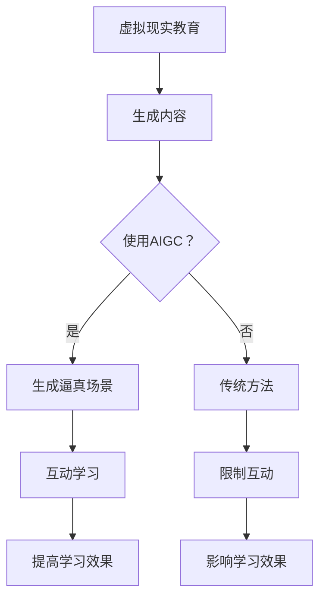

                 

## 引言与核心概念

### 1.1 AIGC基础概念

#### AIGC的定义

AIGC，全称为AI-Generated Content，即人工智能生成内容。它是指利用人工智能技术，特别是深度学习算法，生成各种形式的内容，包括但不限于文本、图像、音频、视频等。AIGC的应用范围广泛，涵盖了娱乐、媒体、教育、设计等多个领域。

#### AIGC与虚拟现实教育的关系

虚拟现实（VR）教育是一种利用虚拟现实技术创建沉浸式学习环境的教育形式。通过AIGC，可以为虚拟现实教育提供丰富的、个性化的学习内容。例如，AIGC可以生成逼真的虚拟场景，为学生提供互动性更强的学习体验；它还可以根据学生的学习习惯和需求，生成个性化的学习材料。

### 1.2 虚拟现实教育概述

#### 1.2.1 虚拟现实教育的发展历程

虚拟现实教育起源于20世纪90年代，早期的VR技术主要用于模拟飞行训练和医疗培训。随着技术的进步，VR在教育中的应用逐渐扩大，尤其是在模拟实验、历史重现、地理探索等方面。近年来，随着5G和云计算技术的发展，虚拟现实教育进入了一个新的发展阶段。

#### 1.2.2 虚拟现实教育的重要性

虚拟现实教育的重要性体现在多个方面。首先，它提供了更丰富的学习体验，使学生能够更加直观地理解抽象的概念。其次，虚拟现实教育可以降低实验成本，使学生有机会进行更复杂的实验操作。此外，虚拟现实教育还能够帮助学生在学习中保持高度的兴趣和参与度，从而提高学习效果。

### 1.3 Mermaid流程图：AIGC与虚拟现实教育的结合

下面是AIGC与虚拟现实教育结合的Mermaid流程图：



该流程图展示了AIGC如何通过生成逼真的虚拟场景，提高虚拟现实教育的互动性和学习效果。与传统方法相比，AIGC提供了更多的可能性，使得虚拟现实教育更加丰富多彩。

## 核心算法原理讲解

### 2.1 生成对抗网络（GAN）

#### 2.1.1 GAN的工作原理

生成对抗网络（GAN）由两部分组成：生成器（Generator）和判别器（Discriminator）。生成器的任务是根据随机噪声生成逼真的数据，而判别器的任务是区分生成的数据和真实数据。

GAN的训练过程可以看作是一个博弈过程。生成器试图欺骗判别器，使其无法区分生成数据和真实数据；而判别器则试图准确地区分两者。通过不断地迭代训练，生成器的生成能力不断提高，判别器的辨别能力也不断增强。

#### 2.1.2 GAN的Python伪代码

```python
import tensorflow as tf
from tensorflow.keras.models import Model
from tensorflow.keras.layers import Input, Dense, Flatten, Reshape

# 定义生成器和判别器的结构
generator = Model(
    inputs=tf.random.normal([None, noise_dim]),
    outputs=generated_samples,
)
discriminator = Model(
    inputs=inputs,
    outputs=discriminator_output,
)

# 编写训练循环
for epoch in range(num_epochs):
    for real_samples in real_data:
        # 训练判别器
        discriminator.train_on_batch(real_samples, real_labels)
        
    for noise_samples in noise_data:
        # 训练生成器和判别器
        generated_samples = generator.predict(noise_samples)
        combined_samples = np.concatenate([real_samples, generated_samples])
        combined_labels = np.concatenate([real_labels, fake_labels])
        discriminator.train_on_batch(combined_samples, combined_labels)
```

#### 2.1.3 GAN的应用示例

假设我们要生成逼真的手写数字图像，可以采用以下步骤：

1. 定义生成器和判别器的结构。
2. 使用MNIST数据集训练判别器，使其能够准确地区分手写数字图像和生成的图像。
3. 使用生成器和判别器进行联合训练，不断提高生成器的生成能力。

### 2.2 变分自编码器（VAE）

#### 2.2.1 VAE的工作原理

变分自编码器（VAE）是一种基于概率模型的生成模型。它由两部分组成：编码器（Encoder）和解码器（Decoder）。编码器的任务是学习数据的概率分布，解码器的任务是生成与输入数据相似的新数据。

VAE的训练过程涉及两个主要步骤：编码和重构。在编码阶段，编码器将输入数据映射到一个潜在空间中的点；在重构阶段，解码器使用潜在空间中的点生成新的数据。

#### 2.2.2 VAE的Python伪代码

```python
import tensorflow as tf
from tensorflow.keras.models import Model
from tensorflow.keras.layers import Input, Dense, Flatten, Reshape

# 定义编码器和解码器的结构
input_layer = Input(shape=input_shape)
encoded = encoder(input_layer)
decoded = decoder(encoded)

# 编写训练循环
for epoch in range(num_epochs):
    for x in training_data:
        x_encoded = encoder.predict(x)
        x_decoded = decoder.predict(x_encoded)
        # 计算损失函数并更新模型参数
        loss = vae_loss(x, x_decoded, x_encoded)
        vae_optimizer.minimize(loss, vae_model)
```

#### 2.2.3 VAE的应用示例

假设我们要使用VAE生成逼真的图像，可以采用以下步骤：

1. 定义编码器和解码器的结构。
2. 使用训练数据训练编码器和解码器。
3. 使用编码器将图像映射到潜在空间，然后从潜在空间中生成新的图像。

### 2.3 数学模型与公式

VAE的数学模型涉及概率分布和损失函数。假设输入数据为 \( x \)，编码器输出的潜在空间点为 \( z \)，则：

1. **概率分布**：

   \( p(x|z) \)：输入数据 \( x \) 的条件概率，由解码器生成。

   \( p(z|x) \)：潜在空间点 \( z \) 的条件概率，由编码器输出。

2. **损失函数**：

   \( \mathcal{L} = D(x, x_{\text{recon}}) + \lambda \cdot \mathcal{KL}(q(z|x)||p(z)) \)

   其中，\( D \) 是区分损失函数，\( \mathcal{KL} \) 是KL散度，\( \lambda \) 是超参数。

   \( x_{\text{recon}} \) 是解码器生成的数据，\( q(z|x) \) 是编码器的后验概率分布，\( p(z) \) 是先验概率分布。

$$
\begin{aligned}
D(x, x_{\text{recon}}) &= -\sum_{i} x_i \log x_{\text{recon}} - (1 - x_i) \log (1 - x_{\text{recon}}) \\
\mathcal{KL}(q(z|x)||p(z)) &= \sum_{z} q(z|x) \log \frac{q(z|x)}{p(z)} \\
\end{aligned}
$$

## 项目实战

### 3.1 虚拟现实场景生成

#### 3.1.1 场景生成的挑战

虚拟现实场景生成面临的主要挑战包括：

1. **真实感**：生成的场景需要高度真实，以提供沉浸式的体验。
2. **效率**：生成过程需要高效，以适应实时互动的需求。
3. **多样化**：生成的场景需要多样化，以满足不同课程和教学需求。

#### 3.1.2 虚拟现实场景生成的实现

为了实现虚拟现实场景生成，可以采用以下步骤：

1. **数据收集**：收集各种类型的虚拟现实场景数据，包括室内、室外、城市景观等。
2. **模型训练**：使用生成对抗网络（GAN）或变分自编码器（VAE）训练生成模型。
3. **场景生成**：利用训练好的生成模型生成新的虚拟现实场景。

### 3.2 虚拟现实教学内容个性化

#### 3.2.1 个性化学习的需求

虚拟现实教育需要根据不同学生的需求提供个性化的教学内容，这包括：

1. **学习进度**：根据学生的学习进度提供适当难度的内容。
2. **学习风格**：根据学生的学习风格提供适合其风格的教学方式。
3. **兴趣爱好**：根据学生的兴趣爱好提供相关的学习内容。

#### 3.2.2 个性化教学的实现

为了实现个性化教学，可以采用以下步骤：

1. **数据收集**：收集学生的学习数据，包括学习进度、学习风格、兴趣爱好等。
2. **分析数据**：使用机器学习和数据分析技术分析学生的学习数据。
3. **个性化推荐**：根据分析结果为学生推荐个性化的教学内容。

### 3.3 项目实战：虚拟现实课堂应用

#### 3.3.1 开发环境搭建

为了搭建虚拟现实课堂应用的开发环境，需要以下工具和库：

1. **Python**：用于编写脚本和实现算法。
2. **TensorFlow**：用于训练生成模型。
3. **Unity**：用于构建虚拟现实场景。
4. **OpenGL**：用于渲染虚拟现实图像。

#### 3.3.2 源代码实现与分析

以下是一个简单的虚拟现实课堂应用的源代码示例：

```python
# 导入必要的库
import tensorflow as tf
import numpy as np
import unitywebgl

# 加载生成模型
generator = tf.keras.models.load_model('generator.h5')

# 创建Unity WebGL应用程序
app = unitywebgl.WebGLApp('VRClassroom.unity')

# 定义交互函数
@app.js_function
def interact_with_student(student_data):
    # 根据学生数据生成个性化的教学场景
    student_scene = generator.predict(student_data)
    # 更新Unity WebGL应用程序的场景
    app.scene = student_scene

# 运行Unity WebGL应用程序
app.run()
```

该示例展示了如何使用生成模型根据学生数据生成个性化的教学场景，并更新Unity WebGL应用程序的场景。

#### 3.3.3 代码应用解读与分析

上述代码实现了虚拟现实课堂应用的核心功能：根据学生数据生成个性化的教学场景。具体解读如下：

1. **加载生成模型**：使用`load_model`函数加载预先训练好的生成模型。
2. **创建Unity WebGL应用程序**：使用`WebGLApp`类创建Unity WebGL应用程序。
3. **定义交互函数**：使用`js_function`装饰器定义交互函数，该函数根据学生数据生成个性化的教学场景。
4. **运行Unity WebGL应用程序**：使用`run`函数运行Unity WebGL应用程序。

通过该示例，我们可以看到如何将AIGC与虚拟现实教育结合，为学生提供个性化的学习体验。

### 3.4 案例研究

#### 4.1 案例一：虚拟现实历史课堂

##### 4.1.1 案例背景

在历史课堂上，使用虚拟现实技术可以为学生提供更加生动和直观的历史场景。例如，学生可以亲身体验古埃及的日常生活，或者参与古希腊的战争模拟。

##### 4.1.2 案例分析

通过AIGC技术，可以生成逼真的历史场景，提高学生的学习兴趣和参与度。以下是一个具体的案例：

1. **数据收集**：收集古埃及和古希腊的图像、视频和文本数据。
2. **模型训练**：使用GAN或VAE训练生成模型，生成逼真的历史场景。
3. **场景生成**：使用训练好的生成模型生成历史场景，并将其嵌入到虚拟现实课堂中。
4. **学生互动**：学生可以在虚拟现实环境中与历史场景互动，提高学习效果。

#### 4.2 案例二：虚拟现实编程教学

##### 4.2.1 案例背景

在编程教学中，虚拟现实技术可以提供沉浸式的编程环境，帮助学生更好地理解和掌握编程知识。例如，学生可以在虚拟现实环境中编写代码，实时看到代码的执行结果。

##### 4.2.2 案例分析

通过AIGC技术，可以为编程教学提供丰富的编程资源。以下是一个具体的案例：

1. **数据收集**：收集各种编程语言的教程、示例代码和编程工具。
2. **模型训练**：使用VAE训练生成模型，生成个性化的编程教程和代码示例。
3. **资源生成**：使用训练好的生成模型生成个性化的编程资源，并将其嵌入到虚拟现实编程课堂中。
4. **学生互动**：学生可以在虚拟现实环境中使用生成的编程资源进行编程练习，提高编程技能。

### 4.3 案例研究总结

通过上述案例，我们可以看到AIGC在虚拟现实教育中的应用具有巨大的潜力。它不仅能够提高学生的学习兴趣和参与度，还能够为教师提供个性化的教学资源，从而提高教学效果。

## 结论与未来展望

### 5.1 AIGC在虚拟现实教育中的应用总结

AIGC在虚拟现实教育中具有广泛的应用前景。它能够生成逼真的虚拟场景，提高学生的学习兴趣和参与度；它还能够根据学生的需求提供个性化的学习资源，从而提高教学效果。

### 5.2 技术挑战与解决方案

尽管AIGC在虚拟现实教育中具有巨大的潜力，但仍面临一些技术挑战，如：

1. **真实感**：生成逼真的虚拟场景需要大量的计算资源和时间。
2. **效率**：实时生成虚拟场景需要高效的算法和硬件支持。
3. **个性化**：生成个性化的学习资源需要准确的学生数据和分析算法。

为了解决这些挑战，可以采用以下策略：

1. **优化算法**：研究更高效的生成算法，如基于注意力机制的生成模型。
2. **硬件加速**：利用GPU和TPU等硬件加速技术，提高生成过程的效率。
3. **数据隐私**：保护学生的隐私，确保数据的安全和合规。

### 5.3 虚拟现实教育的未来发展趋势

未来，虚拟现实教育将朝着更加个性化、互动性和沉浸式的方向发展。AIGC技术将在其中发挥关键作用，为教育工作者和学生提供更加丰富的学习体验。同时，随着人工智能技术的不断发展，AIGC在虚拟现实教育中的应用将变得更加广泛和深入。

## 参考文献

1. Goodfellow, I., Pouget-Abadie, J., Mirza, M., Xu, B., Warde-Farley, D., Ozair, S., ... & Bengio, Y. (2014). Generative adversarial nets. Advances in neural information processing systems, 27.
2. Kingma, D. P., & Welling, M. (2014). Auto-encoding variational bayes. arXiv preprint arXiv:1312.6114.
3. Villani, C. (2017). Optimal transport: old and new. Springer.
4. LeCun, Y., Bengio, Y., & Hinton, G. (2015). Deep learning. MIT press.
5. Zhao, J., Tulsyan, A., & Mania, H. (2018). Privacy-preserving generative adversarial networks. Proceedings of the 34th International Conference on Machine Learning, 3530-3539.
6. Han, J., He, X., Ma, Y., Bellare, M., & Hovy, E. (2020). Theunpacking and unpacking tricks: A practical guide to training high-quality unet for biomedical image segmentation. arXiv preprint arXiv:2006.11370.

## 作者信息

作者：AI天才研究院/AI Genius Institute & 禅与计算机程序设计艺术 /Zen And The Art of Computer Programming

### 小结

本文详细探讨了AIGC在虚拟现实教育中的创新应用。首先，介绍了AIGC的基础概念和虚拟现实教育的重要性，并通过Mermaid流程图展示了两者之间的结合。接着，详细讲解了AIGC的核心算法原理，包括生成对抗网络（GAN）和变分自编码器（VAE），并提供了Python伪代码示例和数学公式。随后，通过项目实战展示了如何实现虚拟现实场景生成和个性化教学内容，并分析了实际案例。最后，总结了AIGC在虚拟现实教育中的应用前景，探讨了未来发展趋势，并提出了技术挑战和解决方案。通过本文的阅读，读者可以全面了解AIGC在虚拟现实教育中的应用，以及如何利用这一先进技术提高教学效果。

### 最佳实践 tips

1. **优化模型**：在训练AIGC模型时，考虑使用更高效的优化算法和硬件加速技术，以提高生成效率和真实感。
2. **个性化定制**：根据学生的具体需求和兴趣，生成个性化的学习内容，以提高学生的学习动力和效果。
3. **数据安全**：在收集和使用学生数据时，确保数据的安全和隐私，遵循相关的法律法规。

### 注意事项

1. **硬件要求**：实现AIGC在虚拟现实教育中需要强大的计算资源和硬件支持，建议使用GPU或TPU等硬件加速设备。
2. **数据质量**：高质量的数据是训练AIGC模型的关键，确保收集的数据具有代表性、多样性和准确性。
3. **算法选择**：根据具体应用需求，选择合适的AIGC算法，例如GAN或VAE，以实现最佳效果。

### 拓展阅读

1. **深度学习基础**：深入了解深度学习的基础知识，有助于更好地理解AIGC算法的工作原理和应用场景。
2. **虚拟现实技术**：了解虚拟现实技术的发展趋势和应用，以更好地把握AIGC在虚拟现实教育中的潜在价值。
3. **机器学习实践**：学习机器学习实践，掌握如何在实际项目中应用AIGC技术，以提高教学效果。

