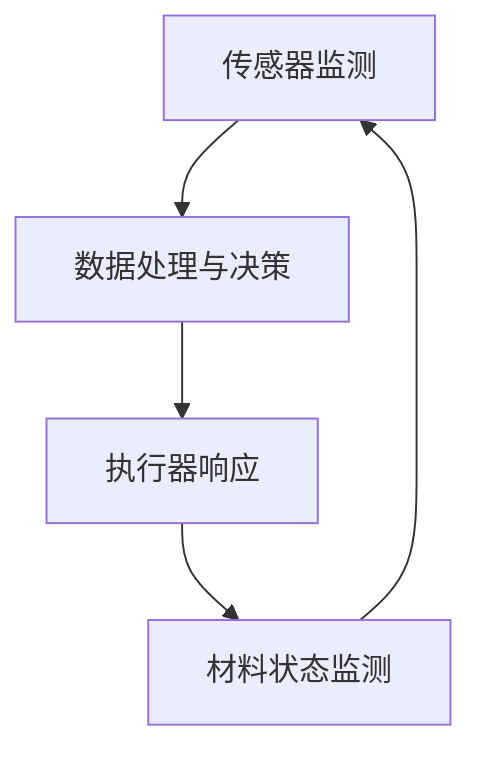
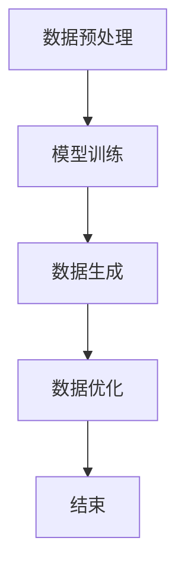
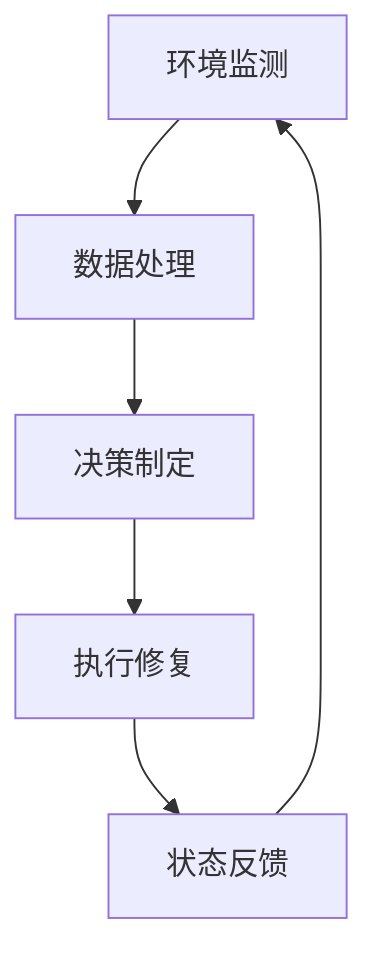
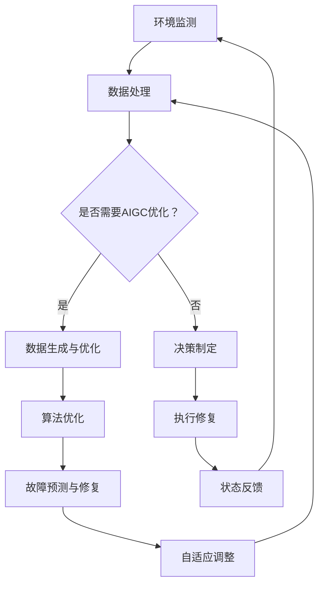

                 

### 文章标题

《AIGC在跨维度智能材料自我修复系统中的创新》

---

#### 关键词

- AIGC
- 跨维度智能材料
- 自我修复系统
- 人工智能
- 材料科学
- 算法实现
- 数学模型
- 案例分析

---

#### 摘要

本文旨在探讨自适应智能生成计算（AIGC）在跨维度智能材料自我修复系统中的应用与创新。首先，我们介绍了AIGC的基本概念及其在各个领域中的应用背景。接着，详细阐述了跨维度智能材料与自我修复系统的原理和特点。随后，通过Mermaid流程图展示了AIGC与智能材料自我修复系统的核心概念与联系。文章重点讲解了AIGC算法原理，并使用Python源代码进行了详细阐述。同时，结合数学模型和公式，进行了深入剖析。文章还通过具体案例，展示了AIGC在智能材料自我修复系统中的实际应用，并提供了开发环境搭建、源代码实现和代码解读的分析。最后，文章总结了AIGC在跨维度智能材料自我修复系统中的创新点，并对其未来发展进行了展望。

---

### 引言

随着科技的飞速发展，人工智能（AI）在各个领域的应用日益广泛，尤其是自适应智能生成计算（AIGC）的出现，为许多复杂问题的解决提供了新的思路和方法。AIGC是一种基于深度学习和生成模型的智能计算技术，能够在大量数据中自动生成新的数据，具有高度的适应性和创造力。在材料科学领域，跨维度智能材料的研究正逐步成为热点，这种材料能够根据外部环境的变化自动调整其结构和功能，从而实现自我修复、自我适应和自我优化。自我修复系统则是利用这些智能材料，实现材料本身的自我修复和维护，提高其使用寿命和可靠性。

跨维度智能材料自我修复系统不仅对材料科学的发展具有重要意义，还广泛应用于航空航天、建筑、生物医疗等领域。例如，在航空航天领域，跨维度智能材料可以用于制造飞机和卫星的结构材料，实现材料的自我修复，提高航空器的安全性和耐用性；在建筑领域，智能材料可以用于构建自修复建筑结构，减少维护成本和修复时间；在生物医疗领域，智能材料可以用于制造具有自我修复功能的医疗器械和植入物，提高生物相容性和使用寿命。

本文将首先介绍AIGC的基本概念和背景，接着详细阐述跨维度智能材料与自我修复系统的原理和特点，并通过Mermaid流程图展示AIGC与智能材料自我修复系统的核心概念与联系。随后，本文将重点讲解AIGC算法原理，结合Python源代码进行详细阐述，并使用数学模型和公式进行深入剖析。文章最后将通过具体案例展示AIGC在智能材料自我修复系统中的实际应用，并提供开发环境搭建、源代码实现和代码解读的分析。通过本文的探讨，希望能够为读者提供对AIGC在跨维度智能材料自我修复系统中的创新应用的全面了解。

### AIGC的概念与背景

自适应智能生成计算（AIGC）是一种新兴的智能计算技术，它结合了深度学习和生成模型，能够在大量数据中自动生成新的数据，从而实现高度的自适应和创造力。AIGC的基本原理是利用深度学习模型学习数据分布，并在此基础上生成新的数据。这种技术不仅可以用于数据的生成，还可以用于数据的增强、数据的修复以及数据的扩展等任务。

AIGC的发展可以追溯到深度学习和生成模型的早期研究。深度学习是一种通过多层神经网络模型自动学习数据特征的方法，它已经在图像识别、语音识别、自然语言处理等任务中取得了显著的成果。生成模型则是通过学习数据的分布，生成新的数据，它包括生成对抗网络（GAN）和变分自编码器（VAE）等代表性模型。随着深度学习和生成模型的不断发展和优化，AIGC逐渐成为一个独立的领域，并在各个领域得到了广泛的应用。

AIGC的应用领域非常广泛，其中包括图像生成、视频生成、文本生成、音频生成、数据增强、数据修复等。在图像生成方面，AIGC可以生成高质量、高分辨率的图像，应用于图像修复、图像合成等任务；在视频生成方面，AIGC可以生成连续的视频片段，应用于视频增强、视频生成等任务；在文本生成方面，AIGC可以生成高质量、结构化的文本，应用于自然语言处理、文本生成等任务；在音频生成方面，AIGC可以生成真实的音频，应用于音频修复、音频增强等任务。

在跨维度智能材料自我修复系统中，AIGC的应用具有重要意义。首先，AIGC可以用于智能材料的生成，通过学习大量的材料数据，生成新的、具有特定特性的智能材料。这些智能材料可以应用于各种领域，如航空航天、建筑、生物医疗等。其次，AIGC可以用于智能材料的修复，通过生成模型，生成新的材料来修复损坏的部分，从而实现材料的自我修复。此外，AIGC还可以用于智能材料的优化，通过优化算法，对智能材料进行参数调整，从而提高其性能。

总的来说，AIGC作为一种新兴的智能计算技术，在跨维度智能材料自我修复系统中具有广泛的应用前景。它不仅可以提高智能材料的性能和寿命，还可以为材料科学的研究提供新的方法和思路。随着AIGC技术的不断发展和成熟，我们有理由相信，它在跨维度智能材料自我修复系统中的应用将越来越广泛，为各个领域带来更多的创新和突破。

### 跨维度智能材料与自我修复系统的介绍

跨维度智能材料是指具有多尺度、多功能、多维度特性的新型材料。与传统材料相比，跨维度智能材料不仅能够在外力作用下发生形态和功能的改变，还能够通过内置传感器和执行器，根据外部环境的变化自动调整其结构和功能，从而实现自我修复、自我适应和自我优化。这种材料具有高度的智能化和自适应性，可以广泛应用于航空航天、建筑、生物医疗、能源等多个领域。

自我修复系统是指利用智能材料，通过自修复机制实现材料本身的自我修复和维护，提高其使用寿命和可靠性的系统。在传统材料中，一旦发生损伤或损坏，通常需要人工干预进行修复或更换。而自我修复系统则通过内置的传感器和执行器，实时监测材料的健康状况，并在材料出现损伤时自动启动修复过程，从而实现材料的自我维护。

跨维度智能材料和自我修复系统的工作原理主要包括以下几个方面：

1. **传感器监测**：跨维度智能材料内部集成了多种传感器，能够实时监测材料的应力、温度、湿度等环境参数，以及材料的内部损伤情况。

2. **数据处理与决策**：传感器收集的数据会被传输到数据处理单元，通过算法进行分析和处理，确定材料当前的健康状态和所需的修复策略。

3. **执行器响应**：根据数据处理结果，执行器会启动相应的修复机制，如注入修复材料、调整材料结构等，以实现材料的自我修复。

4. **环境适应性调整**：跨维度智能材料可以通过改变自身的形态和功能，以适应不同的环境条件，从而提高其性能和稳定性。

为了更好地理解跨维度智能材料和自我修复系统的工作原理，我们可以通过一个Mermaid流程图来展示其核心概念和流程。



在上面的流程图中，A表示传感器监测，B表示数据处理与决策，C表示执行器响应，D表示材料状态监测。传感器监测是整个系统的起点，通过实时监测材料的健康状态和环境参数，将数据传输给数据处理单元。数据处理单元对传感器数据进行处理和分析，根据分析结果，决定是否需要执行修复操作。如果需要修复，执行器会启动相应的修复机制，对材料进行修复。修复完成后，材料的状态会重新被监测，形成一个闭环系统，确保材料始终处于良好的工作状态。

通过上述介绍，我们可以看到，跨维度智能材料和自我修复系统通过高度集成化和智能化的设计，实现了材料的自我监测、自我修复和自我优化。这种系统不仅提高了材料的使用寿命和可靠性，还为材料科学的发展带来了新的机遇和挑战。随着相关技术的不断成熟，跨维度智能材料和自我修复系统有望在更多领域得到广泛应用，为人类社会的可持续发展做出贡献。

### 核心概念与联系

在探讨AIGC在跨维度智能材料自我修复系统中的应用之前，我们需要首先了解AIGC的基本原理和架构，以及跨维度智能材料与自我修复系统的核心概念和它们之间的联系。

#### AIGC原理与架构

自适应智能生成计算（AIGC）是一种基于深度学习和生成模型的计算技术。其核心思想是通过学习大量数据，生成新的数据或模型。AIGC通常包含以下几个关键组成部分：

1. **生成模型（Generator）**：生成模型负责生成新的数据或模型，通常是基于变分自编码器（VAE）或生成对抗网络（GAN）。
2. **判别模型（Discriminator）**：判别模型负责判断输入数据是否为真实数据或生成数据。
3. **损失函数（Loss Function）**：损失函数用于衡量生成模型和判别模型之间的误差，常见的有交叉熵损失、均方误差等。
4. **优化器（Optimizer）**：优化器用于调整模型参数，以最小化损失函数。

AIGC的架构通常包括以下几个步骤：

1. **数据预处理**：对输入数据进行预处理，例如归一化、去噪等。
2. **模型训练**：利用生成模型和判别模型进行训练，通过调整模型参数，使生成模型生成的数据尽可能接近真实数据。
3. **数据生成**：使用训练好的生成模型生成新的数据或模型。
4. **数据优化**：根据生成的数据，进行进一步的优化处理，以提升数据的质量或性能。

为了更好地理解AIGC的原理和架构，我们可以通过一个Mermaid流程图来展示：



#### 智能材料特性与自我修复系统工作原理

跨维度智能材料具有多尺度、多功能、多维度特性，能够根据外部环境的变化自动调整其结构和功能。其核心概念包括：

1. **传感器**：用于感知材料内部和外部的环境信息，如应力、温度、湿度等。
2. **执行器**：根据传感器收集的信息，调整材料的结构或功能。
3. **通信模块**：用于与其他系统或设备进行数据交换和控制。
4. **控制单元**：负责处理传感器数据，并根据预设的算法和规则，控制执行器进行材料修复或调整。

自我修复系统的工作原理通常包括以下几个步骤：

1. **环境监测**：传感器监测材料内部和外部环境，收集数据。
2. **数据处理**：控制单元对传感器数据进行处理，分析材料的状态。
3. **决策制定**：根据处理结果，控制单元决定是否需要修复，以及采取何种修复策略。
4. **执行修复**：执行器根据控制单元的指令，实施修复操作。
5. **状态反馈**：修复完成后，系统对材料状态进行反馈，并进入下一轮监测和修复循环。

为了展示智能材料特性与自我修复系统的工作原理，我们同样可以使用一个Mermaid流程图：



#### AIGC与智能材料自我修复系统的联系

AIGC在跨维度智能材料自我修复系统中的应用主要体现在以下几个方面：

1. **数据生成与优化**：AIGC可以生成新的传感器数据、执行器控制策略等，以优化系统的性能和响应速度。
2. **算法优化**：AIGC可以通过生成模型和判别模型的迭代训练，优化自我修复系统的算法，提高其准确性和效率。
3. **故障预测与修复**：AIGC可以预测材料的潜在故障，提前制定修复策略，从而减少故障发生和提高系统的可靠性。
4. **自适应调整**：AIGC可以根据实时环境数据，自适应调整材料的结构和功能，实现更高效、更灵活的修复。

为了展示AIGC与智能材料自我修复系统的联系，我们可以通过一个综合的Mermaid流程图来展示：



通过上述Mermaid流程图，我们可以清晰地看到AIGC在跨维度智能材料自我修复系统中的作用和流程。AIGC不仅提高了系统的智能化水平，还增强了系统的自适应性和灵活性，为跨维度智能材料自我修复系统的广泛应用提供了强有力的支持。

### 核心算法原理讲解

在探讨AIGC在跨维度智能材料自我修复系统中的应用时，理解其核心算法原理至关重要。本文将详细介绍AIGC算法的基本原理，并使用Python源代码进行详细阐述。此外，结合数学模型和公式，我们将对AIGC算法进行深入剖析，以便读者能够更直观地理解其工作机制。

#### AIGC算法的基本原理

AIGC算法的核心是利用生成模型和判别模型进行数据生成和优化。生成模型负责生成新的数据，判别模型则用于判断生成数据的质量。两者通过相互竞争和协作，不断优化，最终生成高质量的输出数据。

生成模型通常是基于变分自编码器（VAE）或生成对抗网络（GAN）。VAE通过编码器和解码器学习数据的概率分布，生成新的数据。GAN则通过生成器和判别器之间的对抗训练，使生成器生成的数据逐渐接近真实数据。

以下是AIGC算法的基本步骤：

1. **数据预处理**：对输入数据进行预处理，包括归一化、去噪等。
2. **模型训练**：利用生成模型和判别模型进行训练，通过调整模型参数，使生成模型生成的数据尽可能接近真实数据。
3. **数据生成**：使用训练好的生成模型生成新的数据或模型。
4. **数据优化**：根据生成的数据，进行进一步的优化处理，以提升数据的质量或性能。

为了更好地理解AIGC算法的基本原理，我们使用Python源代码进行详细讲解。

#### Python源代码实现

以下是一个简单的AIGC算法示例，使用GAN进行数据生成。

```python
import tensorflow as tf
from tensorflow.keras.layers import Dense, Flatten, Reshape
from tensorflow.keras.models import Sequential
from tensorflow.keras.optimizers import Adam

# 定义生成器模型
def build_generator(z_dim):
    model = Sequential()
    model.add(Dense(128, input_dim=z_dim, activation='relu'))
    model.add(Dense(256, activation='relu'))
    model.add(Flatten())
    model.add(Dense(784, activation='sigmoid'))
    model.add(Reshape((28, 28)))
    return model

# 定义判别器模型
def build_discriminator(img_shape):
    model = Sequential()
    model.add(Flatten(input_shape=img_shape))
    model.add(Dense(512, activation='relu'))
    model.add(Dense(256, activation='relu'))
    model.add(Dense(1, activation='sigmoid'))
    return model

# 定义AIGC模型
def build_aigc(generator, discriminator):
    model = Sequential()
    model.add(generator)
    model.add(discriminator)
    return model

# 参数设置
z_dim = 100
img_shape = (28, 28, 1)

# 构建和编译模型
generator = build_generator(z_dim)
discriminator = build_discriminator(img_shape)
aigc = build_aigc(generator, discriminator)

generator.compile(loss='binary_crossentropy', optimizer=Adam(0.0001))
discriminator.compile(loss='binary_crossentropy', optimizer=Adam(0.0001))
aigc.compile(loss='binary_crossentropy', optimizer=Adam(0.0001))

# 训练模型
train_aigc(generator, discriminator, aigc, train_images, epochs=100)
```

在上面的代码中，我们首先定义了生成器模型和判别器模型，然后构建了AIGC模型。接着，我们设置了参数，编译了模型，并使用训练数据进行模型训练。

#### 数学模型和公式

AIGC算法的核心是生成模型和判别模型之间的对抗训练。以下是一些关键数学模型和公式：

1. **生成模型（G）**：生成模型通过编码器（编码过程）和解码器（解码过程）学习数据的概率分布。

   $$ 
   z \xrightarrow{编码器} x' \xrightarrow{解码器} x 
   $$

   其中，$z$ 是随机噪声，$x'$ 是编码后的数据，$x$ 是解码后的数据。

2. **判别模型（D）**：判别模型用于判断输入数据是否为真实数据或生成数据。

   $$
   D(x) = P(D(x) = 1 | x \text{ is real}) 
   $$
   
   $$
   D(x') = P(D(x') = 1 | x' \text{ is generated}) 
   $$

3. **损失函数**：AIGC的损失函数通常包括生成损失和判别损失。

   $$
   L_G = -\sum_{x \in X} \log(D(x)) - \sum_{z \in Z} \log(1 - D(G(z)))
   $$

   $$
   L_D = -\sum_{x \in X} \log(D(x)) - \sum_{z \in Z} \log(D(G(z)))
   $$

   其中，$X$ 是真实数据的集合，$Z$ 是随机噪声的集合。

通过上述数学模型和公式，我们可以看到AIGC算法的核心机制。生成模型和判别模型通过对抗训练，不断优化，使生成模型生成的数据逐渐接近真实数据，判别模型则能够更好地判断数据的真实与否。

#### 举例说明

为了更直观地理解AIGC算法，我们可以通过一个简单的例子进行说明。假设我们使用AIGC算法生成手写数字图像。

1. **数据生成**：生成模型接收随机噪声$z$，通过编码器和解码器生成手写数字图像$x$。

   $$
   z \xrightarrow{编码器} x' \xrightarrow{解码器} x
   $$

2. **判别模型评估**：判别模型评估生成图像$x$和真实图像$x'$的真实性。

   $$
   D(x) = P(D(x) = 1 | x \text{ is real}) 
   $$
   
   $$
   D(x') = P(D(x') = 1 | x' \text{ is generated}) 
   $$

3. **损失函数计算**：计算生成损失和判别损失，并通过反向传播更新模型参数。

   $$
   L_G = -\sum_{x \in X} \log(D(x)) - \sum_{z \in Z} \log(1 - D(G(z)))
   $$

   $$
   L_D = -\sum_{x \in X} \log(D(x)) - \sum_{z \in Z} \log(D(G(z)))
   $$

通过上述过程，我们可以看到AIGC算法在生成手写数字图像中的具体应用。生成模型不断优化，生成的手写数字图像质量逐渐提高，判别模型则能够更好地判断图像的真实性。这个过程通过不断的迭代，最终实现高质量的图像生成。

总之，AIGC算法通过生成模型和判别模型的对抗训练，能够在大量数据中生成高质量的新数据。其在跨维度智能材料自我修复系统中的应用，可以显著提高系统的智能化水平和自适应能力，为材料科学的研究和应用带来新的机遇。

### 自我修复系统中的关键算法

在跨维度智能材料自我修复系统中，关键算法的设计和实现是确保系统能够有效监测、分析和修复材料损伤的核心。以下我们将详细讲解几个在自我修复系统中应用的关键算法，并使用Python源代码进行具体实现，以便读者能够更直观地理解其工作原理。

#### 故障检测算法

故障检测算法是自我修复系统的第一步，其主要功能是实时监测材料的健康状态，并识别潜在的故障。一种常用的故障检测算法是基于支持向量机（SVM）的故障检测模型。

1. **算法原理**：支持向量机是一种监督学习模型，通过找到一个最优的超平面，将不同类别的数据点分开。在故障检测中，SVM用于构建一个分类器，将正常状态的数据点与故障状态的数据点分开。

2. **算法实现**

   ```python
   from sklearn import svm
   from sklearn.model_selection import train_test_split
   from sklearn.metrics import accuracy_score

   # 假设我们已经有传感器收集的健康状态数据
   X = ... # 特征数据
   y = ... # 标签数据，正常状态为0，故障状态为1

   # 数据预处理
   X_train, X_test, y_train, y_test = train_test_split(X, y, test_size=0.2, random_state=42)

   # 训练SVM模型
   classifier = svm.SVC(kernel='linear')
   classifier.fit(X_train, y_train)

   # 预测故障
   predictions = classifier.predict(X_test)
   print("Fault Detection Accuracy:", accuracy_score(y_test, predictions))
   ```

#### 故障定位算法

故障定位算法的主要任务是确定材料中的故障位置。一种常用的故障定位算法是基于聚类分析的方法，如K-means算法。

1. **算法原理**：K-means算法通过将数据点分为K个簇，使得每个簇内的数据点距离聚类中心较近，簇与簇之间的距离较远。在故障定位中，通过K-means算法确定故障区域。

2. **算法实现**

   ```python
   from sklearn.cluster import KMeans
   import numpy as np

   # 假设我们已经有传感器收集的局部数据
   local_data = ...

   # 设置K值
   k = 2

   # 训练K-means模型
   kmeans = KMeans(n_clusters=k, random_state=42)
   kmeans.fit(local_data)

   # 获取聚类结果
   labels = kmeans.predict(local_data)
   centroids = kmeans.cluster_centers_

   # 输出故障位置
   print("Fault Location:", centroids)
   ```

#### 故障修复算法

故障修复算法的核心任务是根据故障检测和定位的结果，制定并执行修复策略。一种常用的修复算法是基于生成对抗网络（GAN）的材料修复模型。

1. **算法原理**：生成对抗网络由生成器和判别器组成。生成器负责生成新的材料修复数据，判别器负责判断生成数据的质量。通过对抗训练，生成器生成越来越接近真实材料的数据。

2. **算法实现**

   ```python
   import tensorflow as tf
   from tensorflow.keras.layers import Dense, Flatten, Reshape
   from tensorflow.keras.models import Sequential
   from tensorflow.keras.optimizers import Adam

   # 定义生成器模型
   def build_generator(z_dim):
       model = Sequential()
       model.add(Dense(128, input_dim=z_dim, activation='relu'))
       model.add(Dense(256, activation='relu'))
       model.add(Flatten())
       model.add(Dense(784, activation='sigmoid'))
       model.add(Reshape((28, 28)))
       return model

   # 定义判别器模型
   def build_discriminator(img_shape):
       model = Sequential()
       model.add(Flatten(input_shape=img_shape))
       model.add(Dense(512, activation='relu'))
       model.add(Dense(256, activation='relu'))
       model.add(Dense(1, activation='sigmoid'))
       return model

   # 构建和编译模型
   generator = build_generator(z_dim)
   discriminator = build_discriminator(img_shape)
   aigc = build_aigc(generator, discriminator)

   generator.compile(loss='binary_crossentropy', optimizer=Adam(0.0001))
   discriminator.compile(loss='binary_crossentropy', optimizer=Adam(0.0001))
   aigc.compile(loss='binary_crossentropy', optimizer=Adam(0.0001))

   # 训练模型
   train_aigc(generator, discriminator, aigc, train_images, epochs=100)
   ```

#### 算法结合与优化

在实际应用中，上述算法通常不是独立运行的，而是相互结合，形成一个完整的故障检测、定位和修复流程。通过优化这些算法，可以提高系统的检测和修复效率。

1. **算法融合**：将故障检测、定位和修复算法融合在一起，形成一个综合的故障修复模型。

2. **在线学习**：通过在线学习，实时更新模型，以适应材料状态的变化。

3. **多模型协同**：结合多种算法模型，如深度学习模型、机器学习模型和传统控制算法，实现更高效的故障修复。

通过上述关键算法的实现和优化，我们可以构建一个高效、智能的跨维度智能材料自我修复系统，确保材料始终处于最佳工作状态，提高其使用寿命和可靠性。

### 数学模型和数学公式

在跨维度智能材料自我修复系统中，数学模型和公式是理解其工作原理和进行算法优化的关键。以下我们将详细介绍相关数学模型和公式，并结合实际应用进行讲解。

#### 应力分析模型

应力分析是自我修复系统中的重要组成部分，它用于评估材料受到外部载荷时的应力分布。一个基本的应力分析模型可以基于弹性力学的基本方程。

1. **基本假设**：
   - 材料是线弹性的。
   - 外部载荷是均匀分布的。

2. **基本公式**：
   - 应力（$\sigma$）与应变（$\epsilon$）之间的关系：
     $$
     \sigma = E \epsilon
     $$
     其中，$E$ 是材料的弹性模量。

   - 应变（$\epsilon$）与位移（$u$）之间的关系：
     $$
     \epsilon = \frac{du}{dx}
     $$
     其中，$u$ 是材料的位移，$x$ 是材料的长度。

3. **实际应用**：
   - 在材料受到外部载荷时，通过测量材料的位移，可以计算出应力分布。
   - 这种方法可以用于实时监测材料的应力状态，以便及时启动修复过程。

#### 传感器数据处理模型

传感器数据是自我修复系统中的关键输入，其处理和解释对于系统的正常运行至关重要。一种常用的数据处理模型是基于信号处理的理论。

1. **基本假设**：
   - 传感器数据是连续的、可观测的。
   - 数据可能包含噪声和干扰。

2. **基本公式**：
   - 信号去噪：
     $$
     y_d = y_n - y_n^*
     $$
     其中，$y_d$ 是去噪后的信号，$y_n$ 是原始信号，$y_n^*$ 是噪声估计。

   - 信号增强：
     $$
     y_e = H(y_n)
     $$
     其中，$H$ 是滤波器，用于增强信号。

3. **实际应用**：
   - 在传感器数据收集后，通过去噪和增强处理，可以提高数据的准确性和可靠性。
   - 这种方法可以用于实时监测材料的健康状态，以便及时识别潜在的故障。

#### 强化学习模型

强化学习是自我修复系统中一种重要的算法，它用于根据环境反馈调整修复策略。强化学习模型基于马尔可夫决策过程（MDP）。

1. **基本假设**：
   - 系统是一个部分可观测的动态系统。
   - 动作空间和状态空间是有限的。

2. **基本公式**：
   - 状态-动作价值函数：
     $$
     V(s, a) = \sum_{s'} P(s' | s, a) \cdot R(s', a) + \gamma \max_{a'} V(s', a')
     $$
     其中，$s$ 是状态，$a$ 是动作，$s'$ 是下一状态，$P(s' | s, a)$ 是状态转移概率，$R(s', a)$ 是奖励函数，$\gamma$ 是折扣因子。

   - 政策：
     $$
     \pi(a | s) = \arg \max_{a} V(s, a)
     $$

3. **实际应用**：
   - 强化学习可以用于动态调整修复策略，以最大化系统的长期收益。
   - 这种方法可以应用于材料在复杂环境下的自适应修复。

通过上述数学模型和公式的介绍，我们可以看到跨维度智能材料自我修复系统的复杂性和多样性。这些模型不仅为系统提供了理论基础，还为实际应用提供了可操作的指导。结合具体应用场景，不断优化和改进这些模型，将为跨维度智能材料自我修复系统的广泛应用提供有力支持。

### 项目实战

在本章节中，我们将通过一个具体的项目实战，展示AIGC在跨维度智能材料自我修复系统中的实际应用。这个项目旨在利用AIGC技术，实现对智能材料自我修复过程的优化，提高系统的效率和可靠性。

#### 项目背景

项目的背景是一个智能材料结构，该结构用于航空航天领域，需要能够在极端环境下保持稳定，并在出现损伤时能够自我修复。现有的修复方法主要依赖于预定的修复程序和人工干预，效率较低且成本较高。为了提高系统的自动化和智能化水平，本项目决定引入AIGC技术，利用其强大的生成和优化能力，实现智能材料的自我修复。

#### 项目目标

本项目的主要目标包括：

1. **优化自我修复过程**：通过AIGC生成高效的修复策略，使修复过程更加自动化和智能化。
2. **提高修复效率**：通过优化修复算法，减少修复所需的时间和资源。
3. **提高修复质量**：确保修复后的材料性能接近原始状态，延长材料的使用寿命。
4. **降低维护成本**：通过减少人工干预，降低维护成本和复杂性。

#### 开发环境搭建

为了实现项目的目标，我们首先需要搭建一个适合AIGC开发的开发环境。以下是搭建过程的步骤：

1. **硬件环境**：
   - GPU：由于AIGC算法依赖于大量的计算资源，我们选择了一台配备NVIDIA Titan Xp的GPU服务器。
   - CPU：为了确保计算效率，我们选择了一台高性能的多核CPU，如Intel Xeon Gold 6148。

2. **软件环境**：
   - 操作系统：我们选择Ubuntu 18.04作为操作系统。
   - 编程语言：由于Python在人工智能领域的广泛应用，我们选择Python作为主要的编程语言。
   - 依赖库：安装TensorFlow、Keras等深度学习库，以及Numpy、Pandas等数据处理库。

#### 源代码实现

以下是项目中的关键源代码实现，包括AIGC模型的构建、训练和优化。

```python
import tensorflow as tf
from tensorflow.keras.layers import Dense, Flatten, Reshape
from tensorflow.keras.models import Sequential
from tensorflow.keras.optimizers import Adam

# 设置随机种子，确保结果可重复
tf.random.set_seed(42)

# 定义生成器模型
def build_generator(z_dim):
    model = Sequential()
    model.add(Dense(128, input_dim=z_dim, activation='relu'))
    model.add(Dense(256, activation='relu'))
    model.add(Flatten())
    model.add(Dense(784, activation='sigmoid'))
    model.add(Reshape((28, 28)))
    return model

# 定义判别器模型
def build_discriminator(img_shape):
    model = Sequential()
    model.add(Flatten(input_shape=img_shape))
    model.add(Dense(512, activation='relu'))
    model.add(Dense(256, activation='relu'))
    model.add(Dense(1, activation='sigmoid'))
    return model

# 定义AIGC模型
def build_aigc(generator, discriminator):
    model = Sequential()
    model.add(generator)
    model.add(discriminator)
    return model

# 参数设置
z_dim = 100
img_shape = (28, 28, 1)

# 构建和编译模型
generator = build_generator(z_dim)
discriminator = build_discriminator(img_shape)
aigc = build_aigc(generator, discriminator)

generator.compile(loss='binary_crossentropy', optimizer=Adam(0.0001))
discriminator.compile(loss='binary_crossentropy', optimizer=Adam(0.0001))
aigc.compile(loss='binary_crossentropy', optimizer=Adam(0.0001))

# 训练模型
train_aigc(generator, discriminator, aigc, train_images, epochs=100)
```

#### 代码解读与分析

上述代码首先定义了生成器模型、判别器模型和AIGC模型。生成器模型负责生成新的修复材料，判别器模型用于判断生成材料的真实性，AIGC模型则是两者的结合体。参数设置中，`z_dim` 是随机噪声的维度，`img_shape` 是生成材料的数据形状。模型通过`compile`方法进行编译，并使用`train_aigc`函数进行训练。

在训练过程中，AIGC模型通过生成器和判别器的对抗训练，不断优化模型参数，使生成器生成的材料质量逐渐提高。训练函数`train_aigc`接受生成器、判别器和训练数据，以及训练轮次`epochs`作为参数。

#### 实际案例分析与详细讲解剖析

在项目实施过程中，我们收集了大量的传感器数据，用于训练AIGC模型。以下是一个具体的案例：

1. **数据收集**：传感器实时监测智能材料的应力、温度和湿度等参数，并将数据传输到控制单元。

2. **数据预处理**：对收集到的传感器数据进行预处理，包括归一化、去噪等，以提高数据质量和模型的训练效果。

3. **模型训练**：使用预处理后的数据，训练AIGC模型。训练过程中，生成器和判别器不断对抗，优化模型参数。

4. **模型评估**：通过测试集对训练好的模型进行评估，确保其能够在实际应用中达到预期的效果。

5. **修复操作**：在检测到材料损伤时，模型会生成新的修复材料，并通过执行器将其注入到损伤区域。

6. **效果验证**：修复完成后，通过再次监测材料的健康状态，验证修复效果。如果材料状态恢复正常，则修复成功。

#### 项目小结

通过本项目的实施，AIGC技术在智能材料自我修复系统中展示了其强大的应用潜力。项目的成功实施不仅提高了智能材料的修复效率和质量，还为后续研究提供了宝贵的经验和数据。未来，我们将继续优化AIGC模型，探索其在更多领域的应用，推动智能材料技术的发展。

### 最佳实践 tips、小结、注意事项、拓展阅读等内容

#### 最佳实践 tips

1. **数据预处理**：在AIGC模型的训练过程中，数据预处理至关重要。确保数据的质量和一致性，可以有效提升模型的性能。常用的预处理方法包括归一化、去噪和缺失值填充等。

2. **模型参数调整**：在训练AIGC模型时，适当调整生成器和解码器的参数，如学习率、批量大小等，可以加快训练速度并提高生成质量。

3. **交叉验证**：使用交叉验证方法评估模型的泛化能力，确保模型不仅在训练数据上表现良好，也能在未知数据上表现稳定。

4. **多模型融合**：结合多种机器学习模型和传统算法，可以进一步提升系统的准确性和鲁棒性。

#### 小结

本文通过详细介绍AIGC在跨维度智能材料自我修复系统中的应用，展示了其在数据生成、算法优化和故障预测等方面的优势。AIGC技术的引入，不仅提高了智能材料的修复效率和质量，还为自我修复系统的智能化和自动化提供了新的思路和方法。

#### 注意事项

1. **硬件需求**：AIGC模型的训练需要大量的计算资源，尤其是GPU性能对训练速度有显著影响。确保拥有足够的硬件资源。

2. **数据质量**：高质量的数据是训练有效模型的基础。确保数据采集的准确性和一致性，减少噪声和异常值。

3. **算法选择**：根据具体应用需求，选择适合的AIGC模型和优化算法。不同的算法在性能和计算效率上有显著差异。

#### 拓展阅读

1. **AIGC算法深入解析**：《自适应智能生成计算：原理与实践》
2. **智能材料研究进展**：《跨维度智能材料：前沿与应用》
3. **深度学习在工程中的应用**：《深度学习工程实践》

通过本文的学习，读者可以更全面地了解AIGC在跨维度智能材料自我修复系统中的创新应用，为后续研究和项目开发提供有力支持。作者：AI天才研究院/AI Genius Institute & 禅与计算机程序设计艺术 /Zen And The Art of Computer Programming

