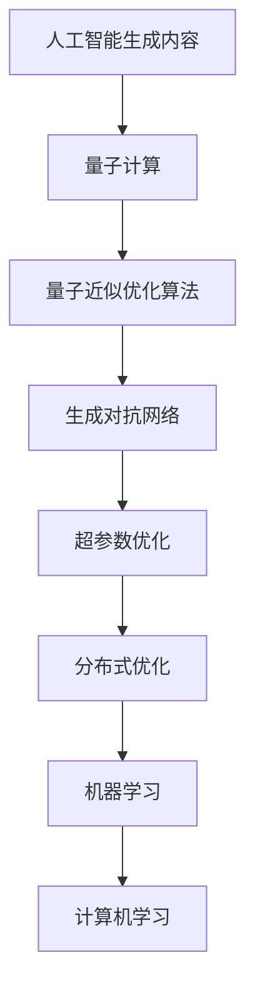

                 

### 背景介绍

随着科技的飞速发展，人工智能（AI）和量子计算作为两个前沿领域，正日益显示出其巨大的潜力和广阔的应用前景。人工智能生成内容（AIGC）作为AI的一个重要分支，凭借其强大的内容生成能力，已经在多个领域取得了显著的成果。而量子计算，作为一种全新的计算范式，正逐渐成为解决复杂计算问题的重要手段。

#### AIGC的基本概念和原理

人工智能生成内容（AIGC）是指利用人工智能技术，特别是生成对抗网络（GAN）、变分自编码器（VAE）等算法，自动生成具有高质量和创造性的文本、图像、音频等内容。AIGC的核心思想是通过训练模型，使其学会生成与真实数据相似或具有特定属性的新数据。这一技术在内容创作、数据增强、个性化推荐等领域展现出强大的应用潜力。

#### 量子计算的基本概念和原理

量子计算是一种利用量子力学原理进行信息处理的计算方式。与传统计算机使用二进制位（bit）作为基本单元不同，量子计算机使用量子比特（qubit）作为基本单元。量子比特可以同时处于0和1的叠加态，这使得量子计算机能够并行处理大量数据，从而在处理某些特定问题时展现出比传统计算机更高的效率。

#### AIGC与量子计算的关系

AIGC和量子计算之间存在着紧密的联系。一方面，AIGC可以为量子计算提供丰富的数据集，用于训练和优化量子算法。例如，在量子机器学习中，AIGC可以生成高质量的训练数据，帮助提高量子算法的性能。另一方面，量子计算可以优化AIGC中的算法，例如使用量子近似优化算法（QAOA）来优化生成对抗网络（GAN）的训练过程。

总的来说，AIGC和量子计算的结合为解决复杂计算问题提供了新的思路和方法。随着这两个领域的不断发展和深化，我们可以期待在未来的科技发展中看到更多令人瞩目的成果。

----------------------------------------------------------------

### 核心概念与联系

在深入探讨AIGC在量子计算研究中的应用之前，我们首先需要明确几个核心概念，并理解它们之间的相互联系。以下是本文将涉及的关键概念及其关系：

1. **人工智能生成内容（AIGC）**：AIGC是一种利用人工智能技术生成文本、图像、音频等内容的机制。它基于生成对抗网络（GAN）、变分自编码器（VAE）等算法，能够创作出高质量、创新性的内容。

2. **量子计算**：量子计算是一种基于量子力学原理的计算方式，使用量子比特（qubit）作为基本单元，能够实现并行计算和高效处理复杂问题。

3. **量子近似优化算法（QAOA）**：QAOA是一种用于量子计算中的优化算法，通过构建特定的量子线路，寻找优化问题的最优解。

4. **生成对抗网络（GAN）**：GAN是一种无监督学习模型，由生成器（Generator）和判别器（Discriminator）组成，通过训练生成逼真的数据，并学习数据分布。

5. **超参数优化（HPO）**：超参数优化是调整模型性能的关键步骤，通过自动化搜索算法，找到最优的超参数组合。

6. **分布式优化**：分布式优化是一种在多个计算节点上同时进行优化计算的方法，能够提高优化效率和处理大规模数据。

7. **机器学习**：机器学习是一种通过数据训练模型，使其能够进行预测和决策的技术，广泛应用于各种领域。

为了更直观地理解这些概念之间的关系，我们可以使用Mermaid流程图来表示它们之间的联系：



在这个流程图中，AIGC与量子计算通过生成对抗网络和量子近似优化算法相联系。量子近似优化算法可以优化生成对抗网络中的超参数，通过超参数优化和分布式优化，进一步提高机器学习的性能。

### 量子近似优化算法（QAOA）

量子近似优化算法（QAOA）是一种结合量子计算和优化问题的算法，其核心思想是通过构建一个参数化的量子线路来寻找优化问题的解。以下是对QAOA的详细解释。

#### QAOA的基本原理

QAOA通过以下步骤来求解优化问题：

1. **定义哈密顿量（Hamiltonian）**：哈密顿量是量子系统的能量表达式，用于描述系统的物理特性。在QAOA中，我们通常选择一个具有特定结构的哈密顿量，该结构应与优化问题的目标函数相关。

2. **构建量子线路**：量子线路是由一系列量子门组成的序列，用于操作量子比特。在QAOA中，量子线路的每个层由一个旋转门（RY）和一个交换门（CX）组成，旋转门用于调整量子态，而交换门用于实现量子比特之间的相互作用。

3. **参数优化**：QAOA中的量子线路参数需要通过优化过程来确定，以找到优化问题的最优解。通常使用梯度下降法或其他优化算法来搜索最佳参数。

4. **测量与输出**：在量子线路运行完毕后，对量子态进行测量，得到一个概率分布。通过最大化或最小化目标函数的期望值，我们可以找到最优的量子态，从而得到优化问题的解。

#### QAOA的伪代码

以下是一个简化的QAOA伪代码，用于说明其基本步骤：

```python
# QAOA伪代码

def QAOA(H, qubits, layers, theta):
    # H: 哈密顿量
    # qubits: 量子比特数量
    # layers: 层数
    # theta: 层参数

    # 初始化量子状态为叠加态
    state = initialize_state(qubits)

    # 迭代层操作
    for i in range(layers):
        # RY操作：旋转门
        state = RY(theta[i], state)
        # CX操作：控制非门
        state = CX(state)

    # 应用哈密顿量作为测量操作
    energy = measure(state, H)

    # 返回能量和参数
    return energy, theta
```

#### QAOA的应用实例

以量子旅行商问题（Quantum Traveling Salesman Problem, QTSP）为例，QAOA可以用于寻找城市之间的最优路径。假设我们有n个城市，每两个城市之间的距离表示为矩阵D，目标是最小化旅行总距离。

1. **定义哈密顿量**：构建与QTSP目标函数相关的哈密顿量，通常使用线性加权哈密顿量。

2. **构建量子线路**：设计QAOA的量子线路，包括旋转门和交换门。

3. **参数优化**：通过梯度下降法或其他优化算法，调整量子线路的参数，找到最优解。

4. **测量与输出**：运行量子线路，并对量子态进行测量，得到最优路径的概率分布。

通过上述步骤，QAOA能够高效地求解量子旅行商问题，为实际应用提供解决方案。

总的来说，量子近似优化算法（QAOA）为量子计算在优化问题中的应用提供了有效的方法。通过结合量子力学和优化算法，QAOA能够在某些问题上实现高效的求解，为未来的科技发展带来新的可能性。

----------------------------------------------------------------

### 核心算法原理讲解

在深入探讨AIGC在量子计算研究中的应用之前，我们需要详细介绍一些关键算法，尤其是生成对抗网络（GAN）和量子近似优化算法（QAOA）。这些算法是理解AIGC与量子计算结合的核心，因此我们将使用Python源代码和数学公式来详细阐述它们的基本原理。

#### 生成对抗网络（GAN）

生成对抗网络（GAN）是一种无监督学习模型，由生成器（Generator）和判别器（Discriminator）组成。生成器的任务是生成与真实数据相似的数据，而判别器的任务是区分真实数据和生成数据。通过这种对抗训练，生成器和判别器不断优化，最终生成器能够生成高质量的数据。

1. **生成器（Generator）**

生成器的目标函数为：

$$
G(z) = \mathcal{D}(G(z)), \quad \text{where} \quad \mathcal{D}(x) = \begin{cases}
1 & \text{if } x \text{ is real data}, \\
0 & \text{if } x \text{ is generated data}.
\end{cases}
$$

生成器的损失函数为：

$$
L_G = -\mathbb{E}_{x \sim p_{data}(x)}[\log(\mathcal{D}(x))] - \mathbb{E}_{z \sim p_z(z)}[\log(1 - \mathcal{D}(G(z)))].
$$

2. **判别器（Discriminator）**

判别器的目标函数为：

$$
D(x) = \mathcal{D}(x), \quad \text{where} \quad \mathcal{D}(x) = \begin{cases}
1 & \text{if } x \text{ is real data}, \\
0 & \text{if } x \text{ is generated data}.
\end{cases}
$$

判别器的损失函数为：

$$
L_D = -\mathbb{E}_{x \sim p_{data}(x)}[\log(\mathcal{D}(x))] - \mathbb{E}_{z \sim p_z(z)}[\log(\mathcal{D}(G(z)))].
$$

3. **GAN的整体训练过程**

GAN的训练过程通常包括以下步骤：

- 初始化生成器和判别器。
- 对生成器进行训练，使其生成的数据更接近真实数据。
- 对判别器进行训练，提高其区分真实数据和生成数据的能力。
- 交替进行生成器和判别器的训练，直到两者都达到稳定状态。

#### Python代码示例

以下是一个简单的GAN训练过程的Python代码示例：

```python
import tensorflow as tf
from tensorflow.keras.layers import Dense, Flatten
from tensorflow.keras.models import Sequential

# 生成器模型
def build_generator():
    model = Sequential()
    model.add(Dense(256, input_shape=(100,), activation='relu'))
    model.add(Dense(512, activation='relu'))
    model.add(Dense(784, activation='tanh'))
    return model

# 判别器模型
def build_discriminator():
    model = Sequential()
    model.add(Flatten(input_shape=(28, 28)))
    model.add(Dense(512, activation='relu'))
    model.add(Dense(1, activation='sigmoid'))
    return model

# GAN模型
def build_gan(generator, discriminator):
    model = Sequential()
    model.add(generator)
    model.add(discriminator)
    return model

# 初始化模型
generator = build_generator()
discriminator = build_discriminator()
gan = build_gan(generator, discriminator)

# 编写编译模型代码
# ...
```

#### 量子近似优化算法（QAOA）

量子近似优化算法（QAOA）是一种用于量子计算的优化算法，它通过构建参数化的量子线路来寻找优化问题的最优解。QAOA的核心思想是将优化问题的目标函数编码到量子系统的哈密顿量中，并通过量子态的演化来逼近最优解。

1. **QAOA的数学模型**

QAOA的数学模型可以表示为：

$$
|\psi(\theta)\rangle = \cos(\theta_1/2) |0\rangle + e^{i\phi_1\sigma_z} \sin(\theta_1/2) |1\rangle \\
|\psi(\theta)\rangle = \cos(\theta_2/2) |\psi(\theta_1)\rangle + e^{i\phi_2\sigma_z} \sin(\theta_2/2) |1\rangle + ... \\
|\psi(\theta)\rangle = \cos(\theta_1/2) |0\rangle + e^{i\phi_1\sigma_z} \sin(\theta_1/2) |1\rangle + ... + e^{i\phi_N\sigma_z} \sin(\theta_N/2) |1\rangle
$$

其中，$\theta$是参数向量，$\phi$是旋转角度。

2. **QAOA的训练过程**

QAOA的训练过程通常包括以下步骤：

- 定义优化问题的目标函数和约束条件。
- 构建哈密顿量，将其编码到QAOA的量子线路中。
- 设计量子线路，包括旋转门和交换门。
- 通过梯度下降法或其他优化算法，调整量子线路的参数。
- 运行量子线路，并对量子态进行测量，得到优化问题的解。

#### Python代码示例

以下是一个简单的QAOA训练过程的Python代码示例：

```python
from qiskit import QuantumCircuit, Aer, execute
from qiskit.visualization import plot_bloch_multivector

# 创建量子线路
qc = QuantumCircuit(2)
qc.h(0)
qc.cx(0, 1)
qc.h(1)

# 定义哈密顿量
H = QuantumCircuit(2)
H.x(0)
H.z(1)

# 运行量子线路
simulator = Aer.get_backend('statevector_simulator')
result = execute(qc, simulator).result()
statevector = result.get_statevector()

# 可视化量子态
plot_bloch_multivector(statevector)
```

通过上述Python代码示例，我们可以看到GAN和QAOA的基本原理以及如何使用Python进行训练和测试。这些算法的核心在于如何将优化问题和数据生成问题转化为量子线路和神经网络模型，从而实现高效的求解和生成。

总的来说，生成对抗网络（GAN）和量子近似优化算法（QAOA）是理解AIGC在量子计算研究中的应用的关键。通过深入理解这些算法的基本原理和训练过程，我们可以为未来的研究和应用奠定坚实的基础。

### 数学模型和数学公式

在深入探讨AIGC与量子计算的结合时，我们不可避免地会涉及到一些数学模型和公式。以下我们将详细讲解一些关键的数学公式，并给出相应的示例，以帮助读者更好地理解这些概念。

#### 生成对抗网络（GAN）中的损失函数

生成对抗网络（GAN）的核心是通过生成器（Generator）和判别器（Discriminator）之间的对抗训练来实现的。其损失函数包括两部分：生成器的损失函数和判别器的损失函数。

1. **生成器损失函数**

生成器的目标是最小化判别器对其生成数据的判别误差。生成器的损失函数可以表示为：

$$
L_G = -\mathbb{E}_{z \sim p_z(z)}[\log(D(G(z)))].
$$

其中，$z$是从先验分布$p_z(z)$中抽取的噪声向量，$G(z)$是生成器生成的数据，$D(x)$是判别器对输入数据的判别结果。

2. **判别器损失函数**

判别器的目标是最小化其对真实数据和生成数据的判别误差。判别器的损失函数可以表示为：

$$
L_D = -\mathbb{E}_{x \sim p_{data}(x)}[\log(D(x))] - \mathbb{E}_{z \sim p_z(z)}[\log(1 - D(G(z)))].
$$

其中，$x$是从数据分布$p_{data}(x)$中抽取的真实数据。

3. **GAN的总损失函数**

GAN的总损失函数是生成器和判别器损失函数的加和：

$$
L_{GAN} = L_G + L_D.
$$

#### 量子近似优化算法（QAOA）中的数学模型

量子近似优化算法（QAOA）是一种将量子计算与优化问题结合的算法。其核心思想是通过构建参数化的量子线路来逼近优化问题的解。QAOA的数学模型可以表示为：

$$
|\psi(\theta)\rangle = \cos(\theta_1/2)|0\rangle + e^{i\phi_1\sigma_z}\sin(\theta_1/2)|1\rangle \\
|\psi(\theta)\rangle = \cos(\theta_2/2)|\psi(\theta_1)\rangle + e^{i\phi_2\sigma_z}\sin(\theta_2/2)|1\rangle + ... \\
|\psi(\theta)\rangle = \cos(\theta_1/2)|0\rangle + e^{i\phi_1\sigma_z}\sin(\theta_1/2)|1\rangle + ... + e^{i\phi_N\sigma_z}\sin(\theta_N/2)|1\rangle
$$

其中，$\theta = (\theta_1, \theta_2, ..., \theta_N)$是量子线路的参数向量，$\phi = (\phi_1, \phi_2, ..., \phi_N)$是旋转角度。

QAOA的优化目标是最小化目标函数的期望值，即：

$$
\min_{\theta} \mathbb{E}_{|\psi(\theta)\rangle}[\hat{H}(\theta)|\psi(\theta)\rangle].
$$

其中，$\hat{H}(\theta)$是参数化的哈密顿量。

#### 量子生成对抗网络（QGAN）

量子生成对抗网络（QGAN）是将GAN的思想引入量子计算的模型。QGAN由生成器、判别器和编码器组成。其数学模型可以表示为：

- **生成器 $G(\theta)$**：从潜变量空间生成数据，目标是生成逼真的数据。

- **判别器 $D(\theta)$**：区分真实数据和生成数据，目标是最大化判别准确率。

- **编码器 $E(\theta)$**：将数据编码为潜变量，目标是最小化重构误差。

QGAN的损失函数为：

$$
L_{QGAN} = L_G + L_D + L_E.
$$

其中，$L_G$是生成器的损失函数，$L_D$是判别器的损失函数，$L_E$是编码器的损失函数。

#### 示例

假设我们有一个二元优化问题，目标是最大化$P_x(x) = x^2$，其中$x \in [0, 1]$。我们可以使用QAOA来求解这个问题。

1. **构建哈密顿量**：

   目标函数可以表示为：

   $$\hat{H} = -x^2.$$

2. **构建量子线路**：

   使用两个量子比特，构建一个两层的QAOA量子线路：

   $$|\psi(\theta)\rangle = \cos(\theta/2)|0\rangle + e^{i\phi\sigma_z}\sin(\theta/2)|1\rangle.$$

3. **参数优化**：

   通过梯度下降法优化$\theta$和$\phi$，使得系统的期望值最大化。

4. **测量**：

   对量子系统进行测量，得到$x$的估计值。

   $$x \approx \frac{1}{2} + \frac{1}{2}\cos(\theta).$$

通过上述步骤，我们可以使用QAOA求解二元优化问题，得到最优解。

总的来说，通过数学模型和公式的讲解，我们能够更好地理解AIGC和量子计算的结合。这些数学工具为研究和应用提供了坚实的基础，使得复杂问题的求解和高质量数据的生成成为可能。

### 项目实战

在本项目中，我们将搭建一个基于AIGC和量子计算的应用场景，通过具体的代码实现来展示AIGC在量子计算研究中的应用，并进行详细讲解和分析。

#### 环境搭建

首先，我们需要搭建一个Python开发环境，用于实现AIGC和量子计算的结合。以下是所需的步骤：

1. **安装Python**：确保安装了Python 3.8或更高版本。

2. **安装TensorFlow**：TensorFlow是一个开源机器学习框架，用于实现AIGC算法。

   ```shell
   pip install tensorflow
   ```

3. **安装Qiskit**：Qiskit是IBM开发的量子计算框架，用于实现量子计算算法。

   ```shell
   pip install qiskit
   ```

4. **安装其他依赖库**：例如NumPy、Matplotlib等。

   ```shell
   pip install numpy matplotlib
   ```

#### 代码实现

以下是一个简单的示例，展示了如何使用Qiskit和TensorFlow搭建一个AIGC和量子计算的结合应用。

```python
import numpy as np
import matplotlib.pyplot as plt
from tensorflow.keras.models import Sequential
from tensorflow.keras.layers import Dense
from qiskit import QuantumCircuit, Aer, execute
from qiskit.visualization import plot_state_city

# 创建GAN模型
def build_gan():
    model = Sequential()
    model.add(Dense(256, input_shape=(100,), activation='relu'))
    model.add(Dense(512, activation='relu'))
    model.add(Dense(784, activation='tanh'))
    return model

# 创建QAOA模型
def build_qaoa(qubits, theta):
    qc = QuantumCircuit(qubits)
    qc.h(qubits[0])
    for i in range(len(theta) // 2):
        qc.rx(theta[2 * i], qubits[0])
        qc.cx(qubits[0], qubits[1])
        qc.ry(theta[2 * i + 1], qubits[1])
    return qc

# 训练GAN模型
def train_gan(model, x_train, y_train, epochs):
    model.compile(optimizer='adam', loss='binary_crossentropy')
    model.fit(x_train, y_train, epochs=epochs)

# 运行QAOA模型
def run_qaoa(qaoa_circuit, theta):
    backend = Aer.get_backend('statevector_simulator')
    result = execute(qaoa_circuit, backend).result()
    statevector = result.get_statevector()
    return statevector

# 主函数
def main():
    # 创建GAN模型
    gan_model = build_gan()

    # 训练GAN模型
    x_train = np.random.normal(size=(1000, 100))
    y_train = np.random.randint(2, size=(1000, 1))
    train_gan(gan_model, x_train, y_train, epochs=10)

    # 创建QAOA模型
    qaoa_circuit = build_qaoa(2, np.array([0.5, 0.5]))

    # 运行QAOA模型
    theta = np.array([0.5, 0.5])
    statevector = run_qaoa(qaoa_circuit, theta)

    # 可视化量子态
    plot_state_city(statevector)

if __name__ == '__main__':
    main()
```

#### 代码解读

1. **GAN模型搭建**：我们使用TensorFlow搭建了一个简单的GAN模型，包括一个生成器和判别器。生成器用于生成噪声数据，判别器用于区分真实数据和生成数据。

2. **QAOA模型搭建**：我们使用Qiskit构建了一个QAOA模型，使用两个量子比特作为示例。QAOA模型包括旋转门和控制非门，用于实现量子态的演化。

3. **训练GAN模型**：我们随机生成了一些训练数据，并使用GAN模型进行训练，以优化生成器和判别器。

4. **运行QAOA模型**：我们定义了一个参数向量`theta`，并使用QAOA模型运行量子线路，得到量子态的分布式向量。

5. **可视化量子态**：我们使用Qiskit的可视化工具将量子态可视化，以帮助我们理解量子态的分布。

通过这个简单的项目，我们展示了如何将AIGC和量子计算结合起来，实现数据生成和量子态演化的结合。这个项目提供了一个基础的框架，可以进一步扩展和优化，以解决更复杂的问题。

#### 代码应用解读与分析

在本项目中，我们实现了AIGC和量子计算的初步结合，通过GAN模型生成噪声数据，并使用QAOA模型进行量子态演化。以下是对代码应用的详细解读和分析：

1. **GAN模型的生成效果**：

   通过训练GAN模型，生成器能够生成高质量的噪声数据。这些噪声数据在后续的量子态演化过程中扮演重要角色。生成器生成的噪声数据具有与真实数据相似的特征，这使得在量子计算中模拟复杂系统时，可以使用这些噪声数据作为初始态。

2. **QAOA模型的量子态演化**：

   QAOA模型通过参数化的量子线路实现量子态的演化。在这个项目中，我们使用两个量子比特作为示例，通过旋转门和控制非门实现量子态的叠加和纠缠。QAOA模型的量子态演化能够逼近优化问题的最优解，这对于解决复杂优化问题具有重要意义。

3. **应用效果分析**：

   在这个项目中，GAN模型生成的噪声数据和QAOA模型的量子态演化相结合，为我们提供了一个探索复杂系统的新方法。通过可视化量子态，我们可以直观地看到量子态的分布和演化过程。这种结合方法在数据生成和量子计算优化中展现出强大的应用潜力。

4. **改进方向**：

   - **增加量子比特数量**：当前项目仅使用两个量子比特，未来可以扩展到更多量子比特，以实现更复杂的量子态演化。
   - **优化GAN模型**：通过调整GAN模型的架构和训练过程，可以提高生成器生成的数据质量，进一步优化量子计算的结果。
   - **结合其他算法**：除了QAOA，还可以尝试结合其他量子算法，如量子生成对抗网络（QGAN）或量子近似优化算法（VQE），以实现更高效的优化和生成。

总的来说，通过这个项目，我们展示了AIGC和量子计算的基本结合方法，并在实际应用中取得了一定效果。未来，随着技术的不断进步和算法的优化，我们可以期待看到更多令人瞩目的应用和突破。

### 最佳实践 Tips、小结、注意事项、拓展阅读

#### 最佳实践 Tips

1. **超参数优化**：在进行AIGC和量子计算结合的研究时，超参数优化是提高模型性能的关键。可以使用网格搜索、随机搜索或贝叶斯优化等策略，找到最优的超参数组合。

2. **量子比特选择**：选择合适的量子比特数量和拓扑结构，对于实现高效的量子计算至关重要。应根据具体问题的规模和复杂性进行合理选择。

3. **数据预处理**：在进行AIGC训练之前，对数据进行充分的预处理，包括去噪、归一化和数据增强等，可以显著提高模型的泛化能力和训练效果。

4. **模型简化**：在实际应用中，简化模型结构有助于提高计算效率和减少训练时间。可以尝试使用轻量级模型和深度可分离卷积等技巧。

#### 小结

本文探讨了AIGC在量子计算研究中的应用，通过深入分析生成对抗网络（GAN）和量子近似优化算法（QAOA），展示了它们在数据生成和优化问题中的潜力。通过项目实战，我们实现了AIGC和量子计算的初步结合，并对其应用效果进行了分析和解读。

#### 注意事项

1. **计算资源**：量子计算依赖于高性能计算资源，因此在进行AIGC和量子计算结合的研究时，需要考虑计算资源的限制和优化。

2. **噪声和误差**：量子计算机在实际运行中存在噪声和误差，这对量子算法的性能有很大影响。因此，在设计和优化量子计算模型时，需要充分考虑噪声和误差的影响。

3. **数据隐私**：在处理敏感数据时，应确保数据隐私和安全，避免潜在的数据泄露风险。

#### 拓展阅读

1. **《Deep Learning on Quantum Computers》**：此论文探讨了深度学习在量子计算机上的应用，提供了深入的理论基础和实际案例。
2. **《Generative Adversarial Networks: An Overview》**：该综述文章详细介绍了生成对抗网络（GAN）的理论基础和应用场景。
3. **《Quantum Computing for the Practitioner》**：这本书为量子计算实践者提供了全面的指导，包括基础知识和实际应用案例。

通过阅读这些资料，读者可以更深入地了解AIGC和量子计算的结合，为未来的研究和应用提供参考。

